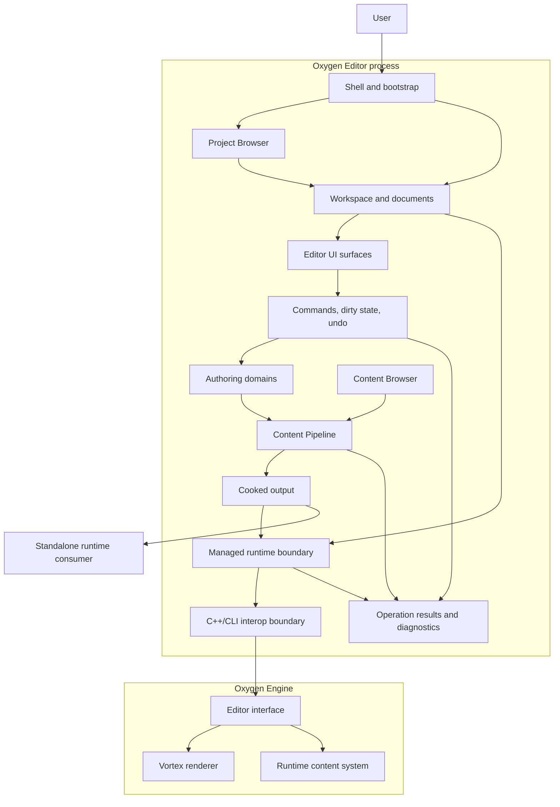
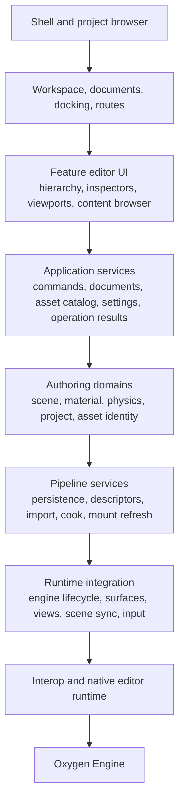
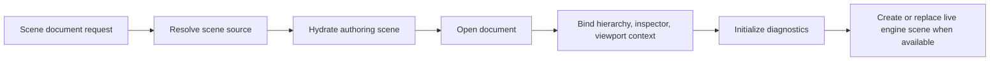
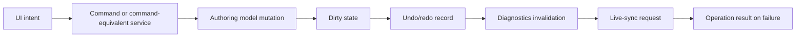
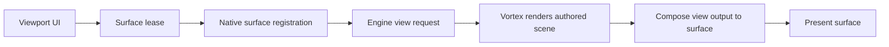
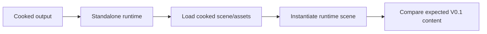
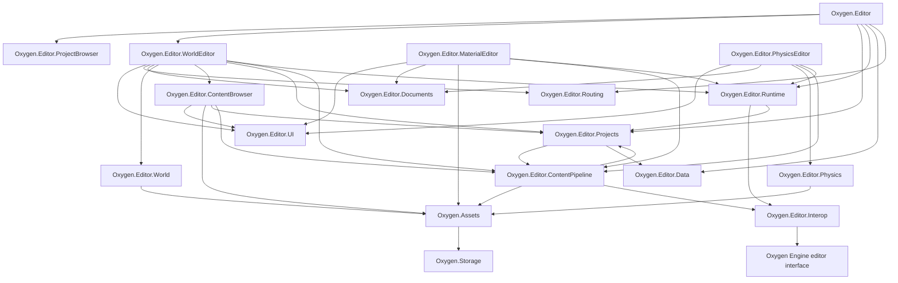

# Oxygen Editor Architecture

Status: `active architecture baseline`

Related:

- [README.md](./README.md)
- [PRD.md](./PRD.md)
- [DESIGN.md](./DESIGN.md)
- [PLAN.md](./PLAN.md)
- [PROJECT-LAYOUT.md](./PROJECT-LAYOUT.md)
- [IMPLEMENTATION_STATUS.md](./IMPLEMENTATION_STATUS.md)
- [RULES.md](./RULES.md)
- [lld/README.md](./lld/README.md)

Reference:

- [projects/Oxygen.Engine/design/vortex/ARCHITECTURE.md](../../projects/Oxygen.Engine/design/vortex/ARCHITECTURE.md)

## Mandatory Editor Rule

Oxygen Editor V0.1 is the first production-quality vertical slice of the
editor. It is not a sample shell, a debug UI, or a temporary proof.

Every architecture, LLD, and implementation decision for V0.1 must preserve
these rules:

1. The editor owns authoring workflows and authoring state.
2. The engine owns runtime execution, rendering, asset loading, simulation, and
   GPU diagnostics.
3. Cooked products are derived runtime data. They are not edited as source
   authoring data.
4. The embedded live engine is a runtime projection of editor-authored data,
   not the source of truth.
5. New V0.1 editor features must close end-to-end: UI, view model, authoring
   model, command path, persistence, live sync where supported, cook/runtime
   behavior where applicable, and operation result handling.
6. No temporary compatibility bridge, manual file repair workflow, or
   editor-only copy of an engine runtime system may be treated as the target
   architecture.

## Table of Contents

- [1. Purpose and Scope](#1-purpose-and-scope)
- [2. System Context](#2-system-context)
- [3. Architecture Drivers](#3-architecture-drivers)
- [4. Architectural Principles](#4-architectural-principles)
- [5. Architectural Model](#5-architectural-model)
- [6. Module Ownership](#6-module-ownership)
- [7. Brownfield Delta Register](#7-brownfield-delta-register)
- [8. Workflow Architecture](#8-workflow-architecture)
- [9. Data and Persistence Architecture](#9-data-and-persistence-architecture)
- [10. Subsystem Contracts](#10-subsystem-contracts)
- [11. Runtime, Viewport, and Frame-Phase Architecture](#11-runtime-viewport-and-frame-phase-architecture)
- [12. Content Pipeline Architecture](#12-content-pipeline-architecture)
- [13. Diagnostics and Operation Results](#13-diagnostics-and-operation-results)
- [14. Dependency Architecture](#14-dependency-architecture)
- [15. Requirements Traceability](#15-requirements-traceability)
- [16. Extension Model](#16-extension-model)
- [17. Architectural Governance](#17-architectural-governance)

## 1. Purpose and Scope

This document is the architecture contract for Oxygen Editor V0.1. It
translates [PRD.md](./PRD.md) into stable ownership boundaries, dependency
direction, runtime integration contracts, data ownership, and workflow
architecture.

[PROJECT-LAYOUT.md](./PROJECT-LAYOUT.md) is the placement authority for
projects, folders, and MSBuild shape. This document is the architecture
authority for ownership, boundaries, runtime contracts, and architectural
decisions. When this document names modules, it must remain consistent with
`PROJECT-LAYOUT.md`.

This document defines:

- where Oxygen Editor sits inside the DroidNet/Oxygen codebase
- which modules own shell, project, workspace, scene, content, material,
  physics, runtime, viewport, interop, and diagnostics concerns
- how authoring data, generated descriptors, cooked output, and live engine
  state relate
- which workflows must remain explicit: project open, scene mutation,
  save/reopen, live sync, descriptor generation, cook, mount, preview, and
  standalone load
- which brownfield dependencies are accepted for migration and which are not
  target architecture

This document does not define:

- implementation sequencing
- task-level planning
- detailed UI layout
- concrete API signatures unless they are architecturally decisive
- low-level renderer, cooker, or storage internals

If an LLD or implementation conflicts with this architecture, the proposal must
be revised or this document must be updated explicitly first.

## 2. System Context

Oxygen Editor is a WinUI 3/.NET authoring application for Oxygen projects. It
uses DroidNet shell, routing, docking, hosting, settings, and persistence
infrastructure. It integrates with Oxygen Engine through a managed runtime
boundary, a C++/CLI interop boundary, the engine editor interface, and native
editor runtime modules.

At V0.1, the editor exists at the intersection of:

- WinUI shell and Project Browser
- project and workspace services
- document and docking systems
- managed scene authoring domain
- property inspectors and viewport tools
- content browser and asset identity
- descriptor/manifest generation and cooking
- embedded Oxygen Engine runtime
- Vortex-rendered editor viewports
- loose cooked root mounting
- standalone runtime validation

### 2.1 Context Diagram



Standalone runtime is outside the editor. It consumes cooked products and
proves that the editor produced real Oxygen runtime data.

### 2.2 Editor and Oxygen Engine

Ownership:

- the editor owns project/workspace/document state, authoring data, editor UI,
  commands, validation presentation, and user-triggered operation results
- the engine owns frame execution, scene runtime state, asset loading, Vortex
  rendering, surfaces, GPU resources, and runtime diagnostics

Contract:

- editor code communicates with native engine capabilities through managed
  runtime and interop boundaries
- engine state is synchronized from authoring state
- engine failures may surface through logs, but user-triggered workflows must
  also produce visible operation results
- editor runtime integration must not mutate authoring data as a side effect of
  rendering

### 2.3 Editor and Vortex

Ownership:

- Vortex owns renderer architecture, scene textures, view rendering, and
  composition work
- the editor owns viewport intent, editor camera tools, layout, surface
  leases, and editor-only overlay intent

Contract:

- embedded preview renders authored scene content through Vortex
- editor overlays, gizmos, selection outlines, node icons, and diagnostics may
  differ from standalone runtime
- authored scene content, material values, camera, directional light,
  atmosphere, exposure, and tone mapping must match cooked standalone runtime
  within documented tolerance

### 2.4 Editor and Cooker/Content

Ownership:

- the editor owns source authoring workflow, asset identity selection,
  generated descriptors/manifests, project cook scope, and user-facing cook
  results
- the content pipeline owns editor import/cook/pak/inspect orchestration
- the cooker owns import/cook execution and cooked product generation
- the engine content system owns runtime loading and loose cooked root
  interpretation

Contract:

- procedural descriptors and scoped source import are first-class editor
  content concepts
- descriptor/manifest generation is explicit and diagnosable
- cooking includes the current scene and referenced V0.1 assets
- cooked roots are mounted only after output exists and indexes validate

## 3. Architecture Drivers

### 3.1 End-To-End V0.1 Authoring

The primary driver is the workflow in `GOAL-001`: author a supported scene,
preview it live, cook it, and load the cooked scene in standalone runtime
without manual file repair.

The architecture must therefore connect UI, commands, authoring data,
persistence, descriptor generation, cooking, runtime mounting, live preview,
and standalone validation. A feature that exists only in UI or only in engine
runtime is not complete editor architecture.

### 3.2 Authoring Source Of Truth

The editor must avoid letting runtime state, cooked state, or ad hoc UI state
become the source of truth. Authoring data must be durable, inspectable,
round-trippable, and able to regenerate runtime inputs.

This drives the separation between:

- authoring scene data
- source assets and generated descriptors
- cooked outputs
- live engine projection

### 3.3 Command-Based Mutability

`REQ-006` requires new V0.1 scene-authoring work to use command-based mutation
paths that update dirty state. This affects inspectors, scene hierarchy
operations, viewport tools, live sync, persistence, and undo/redo.

### 3.4 Live/Cooked Runtime Parity

The embedded preview is valuable only if it represents authored content the
same way standalone runtime does. Editor-only overlays may differ, but authored
scene content must be shared by both live and cooked paths.

This drives:

- component sync adapters
- material and environment sync
- descriptor/manifest generation
- cooked root mount refresh
- standalone load validation

### 3.5 Asset Identity And Content Workflow

The content browser is not a file explorer skin. V0.1 requires source,
generated/descriptor, and cooked states to be understandable and actionable,
and asset picking must use identity instead of raw cooked path text.

This drives an editor-level asset identity model above filesystem paths and
below UI selection surfaces.

### 3.6 Honest Failure Surfaces

Failures in import, descriptor generation, cook, mount, save, sync, engine
runtime, and launch must become visible operation results. Logs are supporting
evidence, not the primary product surface for user-triggered failures.

## 4. Architectural Principles

### 4.1 Ground Truths

1. The Project Browser is the startup experience when the editor launches.
2. `Oxygen.Editor.World` owns scene authoring data for V0.1.
3. Sibling authoring domains may exist for material, physics, and future
   editors when their dependency sets require separate ownership.
4. The embedded engine is a projection target, not an editor datastore.
5. Cooked data is derived and read-only from the authoring perspective.
6. Descriptor and manifest generation is a content-pipeline concern, not an
   inspector concern.
7. Viewports have two lifecycles: UI surfaces and engine views.
8. Surface identity and view identity are separate and must remain separate.
9. Editor camera/navigation tools are editor concerns even when native engine
   capabilities implement the final movement.
10. Brownfield namespace names and existing references are not ownership proof.

### 4.2 Axioms

1. Authoring data flows downward to runtime integration; runtime integration
   must not flow upward into authoring policy.
2. UI surfaces issue commands or requests; they do not own domain mutations.
3. Commands own authoring mutation, dirty state, undo/redo participation, and
   live-sync intent.
4. Live sync is performed by component/domain adapters and runtime services,
   not by arbitrary view models calling native APIs directly.
5. `Oxygen.Editor.Runtime` is the intended managed boundary for engine
   lifecycle, surfaces, views, mounted cooked roots, input translation, and
   native runtime settings.
6. `Oxygen.Editor.Interop` is a native capability bridge. It must not own
   authoring defaults, project policy, UI behavior, or content workflow policy.
7. Asset references are editor/domain identities first and filesystem/cooked
   paths second.
8. Descriptor generation, cooking, index validation, mounting, and standalone
   load are distinct architectural phases.
9. Diagnostics must identify the failure domain: authoring data, missing
   content, descriptor generation, import tool, cook output, mount state, live
   sync, or engine runtime.
10. Brownfield shortcuts may be documented as migration constraints; they must
    not be promoted into target architecture.

## 5. Architectural Model

[PROJECT-LAYOUT.md](./PROJECT-LAYOUT.md) owns the canonical project and folder
layout. The architectural layers are:



The target dependency direction is downward or through an explicitly documented
runtime boundary. Lower layers must not depend on workspace, inspector,
content-browser, or shell implementation details.

## 6. Module Ownership

This table is the canonical ownership map for this architecture document.
Placement details, folder shape, and MSBuild rules remain owned by
`PROJECT-LAYOUT.md`.

| Module | Architectural Role | Owns | Must Not Own |
| --- | --- | --- | --- |
| `Oxygen.Editor` | application composition shell | bootstrap, DI root, top-level routes, windows, process-local native runtime discovery | scene policy, asset workflow policy, cook policy, engine operations beyond bootstrap |
| `Oxygen.Editor.UI` | Oxygen-specific reusable editor UI kit | reusable editor controls, fields, overlays, styles, UI helper VMs | feature policy, domain models, project/cook/runtime behavior |
| `Oxygen.Editor.Routing` | editor-specific route glue | route helpers and editor route integration contracts | feature state or workflow policy |
| `Oxygen.Editor.ProjectBrowser` | no-project/startup UX | recent projects, templates, create/open flow, invalid project states, transition to workspace | project persistence rules, scene editing, content browsing inside workspace |
| `Oxygen.Editor.Documents` | generic document abstractions | shared document contracts, document identity, document lifecycle primitives | world-specific document behavior |
| `Oxygen.Editor.World` | scene authoring domain | scenes, nodes, components, scene serialization, scene-owned settings, authoring references | WinUI, routing, docking, runtime handles, native interop, cook execution |
| `Oxygen.Editor.WorldEditor` | open scene workspace feature | scene documents, hierarchy, inspector, viewport UI, commands, selection, validation presentation, scene-engine sync orchestration | native calls directly from VMs, reusable asset/cook primitives, project-wide cook policy |
| `Oxygen.Editor.MaterialEditor` | planned material editor feature | material documents, material inspector/tools, material preview UI, material validation presentation | reusable asset/cook primitives, native engine calls, project policy |
| `Oxygen.Editor.Physics` | planned shared physics authoring domain | physics authoring data used by physics scenes and scene-attached physics components | WinUI, editor documents, runtime handles, native interop |
| `Oxygen.Editor.PhysicsEditor` | planned physics scene sidecar editor | physics scene documents/tools, physics validation presentation | shared physics domain ownership, reusable cook primitives, native engine calls, project policy |
| `Oxygen.Editor.ContentBrowser` | asset browsing and picking UX | project asset navigation, catalog UI, source/descriptor/cooked views, asset picker UI, content diagnostics presentation | scene component mutation policy, project template management, engine mounting |
| `Oxygen.Editor.ContentPipeline` | editor asset tooling orchestration | import, cook, pak, inspect, asset jobs, descriptor/manifest workflow, pipeline diagnostics, native cooker/content tool adapters | panels, feature-specific authoring policy, low-level cooked binary structures |
| `Oxygen.Editor.Projects` | project metadata and project services | project metadata, project settings, content root policy, project-level cook scope/policy | WinUI panels, scene inspector UI, native interop, cook execution internals |
| `Oxygen.Editor.Runtime` | managed engine runtime boundary | engine lifecycle, effective runtime settings, surface leases, view service, cooked-root mount service, runtime diagnostics | authoring defaults, project policy, UI workflow, scene serialization |
| `Oxygen.Editor.Interop` | C++/CLI/native bridge | managed/native translation, bridge to stable Oxygen Engine APIs, native editor runtime adapter | authoring policy, UI behavior, project layout policy, cook policy, fallback behavior |
| `Oxygen.Editor.Data` | durable editor state/settings substrate | persistent state database, settings infrastructure, settings descriptors/generators | feature-specific settings meaning or UI |
| `Oxygen.Assets` | shared asset/cook data library | asset identities, references, catalogs, import/cook primitives, loose cooked index utilities | editor UI, project workflow policy, live engine mounting |
| `Oxygen.Storage` | storage abstraction | storage providers and filesystem access | asset semantics, editor settings, project policy |

## 7. Brownfield Delta Register

This section records current deviations from the target module ownership. It
does not redefine ownership.

| Brownfield Delta | Current Risk | Target Direction |
| --- | --- | --- |
| `WorldEditor` currently has direct native interop references. | View models and workspace services can bypass runtime ownership. | New managed engine work goes through `Oxygen.Editor.Runtime`; direct interop use shrinks to compatibility seams or documented LLD exceptions. |
| `Projects` currently performs some scene save/cook work. | Project metadata/policy can become cook execution owner. | `Projects` defines project policy and cook scope; `ContentPipeline` owns execution orchestration and diagnostics. |
| `WorldEditor` hosts broad workspace, content, sync, inspector, and viewport code. | Reusable widgets and cross-cutting tooling can become trapped in one feature. | Reusable editor UI moves to `Oxygen.Editor.UI`; content tooling moves to `ContentPipeline`; shared domains move to domain projects. |
| `WorldEditor` namespace overlaps with `World`. | Namespace can be mistaken for ownership. | Ownership follows project responsibility, not root namespace. |
| Native editor runtime behavior is currently concentrated behind interop. | Authoring defaults or editor policy can drift into native code. | Native code exposes capabilities; managed editor modules own authoring and workflow policy. |

## 8. Workflow Architecture

### 8.1 Startup and Project Open

```mermaid
flowchart LR
    Start[Process start]
    Xaml[XAML requirements]
    Native[Process-local native runtime discovery]
    Root[Root DI and settings]
    Browser[Project Browser]
    Open[Open or create project]
    Workspace[Workspace route]
    Child[Workspace child container]
    Restore[Restore layout and documents]
    Mount[Refresh cooked roots]

    Start --> Xaml --> Native --> Root --> Browser --> Open --> Workspace --> Child --> Restore --> Mount
```



Architectural requirements:

- Project Browser remains the startup route.
- Workspace restoration happens after a project is open.
- Partial restoration failures must be visible.
- Engine startup may be eager or lazy by implementation decision, but runtime
  state must be explicit at the managed runtime boundary.

### 8.2 Scene Load



The authoring scene is valid even when the embedded engine is not running.
Engine unavailability is a runtime state, not a reason to corrupt or skip
authoring data.

### 8.3 Scene Mutation



The command path is the architectural center for V0.1 mutation. Scene explorer
operations, inspector edits, material assignment, viewport tools, and add/remove
component actions must converge on commands or command-equivalent services.

### 8.4 Save, Descriptor Generation, Cook, Mount

```mermaid
flowchart LR
    Scene[Authoring scene]
    Save[Save authoring data]
    Desc[Generate or update descriptors]
    Manifest[Generate cook manifest]
    Cook[Invoke cook/import capability]
    Validate[Validate cooked output]
    Catalog[Refresh content catalog]
    Mount[Request runtime mount refresh]
    Result[Publish operation result]

    Scene --> Save --> Desc --> Manifest --> Cook --> Validate --> Catalog --> Mount --> Result
```



Save, descriptor generation, cook, and mount are separate phases. They may be
invoked together by a user workflow, but architecture and diagnostics must not
collapse them into one opaque side effect.

### 8.5 Live Preview



Surface registration and view creation are related but independent lifecycles.
A surface is a presentation target leased by UI. A view is render intent
realized by the engine and targeting a surface.

### 8.6 Standalone Runtime Validation



Standalone validation proves the editor is producing real Oxygen runtime data,
not merely a live editor preview.

## 9. Data and Persistence Architecture

### 9.1 Authoring Scene Data

The authoring scene owns:

- scene identity and name
- node hierarchy
- node names and stable IDs
- Transform
- Geometry
- PerspectiveCamera
- DirectionalLight
- Environment
- Material assignment/override
- asset references and override slots required for V0.1

The authoring scene must save and reopen without manual repair.

### 9.2 Component Data

A component is architecturally complete only when the full chain closes:

```text
domain
  -> persistence
  -> command mutation
  -> editor UI
  -> live sync where supported
  -> cook/runtime behavior where applicable
  -> operation results/diagnostics
```

The owning LLD enumerates the precise phases and verification method.

Transform, Geometry, PerspectiveCamera, DirectionalLight, Environment, and
Material assignment/override are the V0.1 component set.

### 9.3 Material Data

V0.1 material authoring is scalar-material authoring. The architecture must
support:

- material asset creation/open
- scalar property inspection and edit
- content browser selection with thumbnail or clear visual identity
- assignment to geometry
- save/reopen
- cook
- embedded preview where engine APIs support it
- standalone runtime load

Texture authoring, material graphs, and complex texture workflows are outside
V0.1.

### 9.4 Descriptor and Manifest Data

Descriptors and manifests are cooker inputs. They may be:

- authored directly when engine schemas fit the editor model
- generated from editor authoring data
- produced as a hybrid of authored and generated data
- used to motivate engine schema augmentation when small schema changes are
  enough

The PRD does not require one universal persistence schema. It requires that
supported V0.1 data round-trips and cooks without manual repair.

### 9.5 Cooked Data

Cooked output includes runtime-loadable assets, descriptors, binary data, and
loose cooked indexes. The editor may:

- display cooked state
- validate cooked indexes
- mount cooked roots
- inspect cooked metadata
- use cooked output for runtime validation

The editor must not edit cooked data as source authoring data.

## 10. Subsystem Contracts

This section describes subsystem behavior and contracts. Ownership remains
defined only in [6. Module Ownership](#6-module-ownership).

### 10.1 Project and Workspace

The project/workspace contract:

- open/create project establishes active project context
- workspace activation follows successful project selection
- workspace layout and recent documents are restored where possible
- project-level cook scope and content root policy come from project services
- partial restoration and project-policy failures produce visible results

### 10.2 Documents

The document contract:

- documents expose identity, dirty state, save/reopen behavior, and owning
  authoring model
- feature editors attach document-specific UI, commands, and validation
- documents do not own native runtime state

### 10.3 Scene Authoring

The scene authoring contract:

- scene graph and component mutations use commands or command-equivalent
  services
- commands update dirty state and undo/redo participation
- diagnostics are invalidated after relevant mutations
- live sync is requested when runtime is available
- unsupported live sync is surfaced as a user-visible result when triggered by
  user workflow

### 10.4 Property Inspectors

The inspector contract:

- inspector fields edit authoring data through commands
- component editors present supported V0.1 component state
- validation is visible near the edited data where practical
- inspectors do not call native interop directly

### 10.5 Material Editor

The material editor contract:

- material documents are first-class editor documents
- scalar material properties can be inspected, edited, saved, reopened, cooked,
  and previewed
- assignment to geometry uses asset identity, not raw cooked path entry
- material preview/runtime operations pass through runtime/content-pipeline
  boundaries

### 10.6 Content Browser and Asset Identity

The content browser contract:

- source, descriptor/generated, cooked, mounted, missing, and broken states are
  distinguishable
- asset picking returns asset identity
- selection UI does not own scene mutation
- content diagnostics are presented with enough context to act

### 10.7 Embedded Runtime

The embedded runtime contract:

- runtime availability is explicit
- surface and view lifecycles are distinct
- runtime settings are applied at the runtime boundary
- cooked roots are mounted through runtime services
- native failures are translated into operation results and logs

## 11. Runtime, Viewport, and Frame-Phase Architecture

### 11.1 Native Runtime Bootstrap

The shell performs process-local native runtime discovery before the C++/CLI
bridge is loaded. This is an application bootstrap concern.

It is not:

- a project setting
- a workspace setting
- a per-scene setting
- a reason to copy native engine DLLs into editor output by hand

### 11.2 Surface and View Roles

Surface role:

- presentation target leased by UI
- owns native presentation resources for a viewport panel
- resizes independently of scene data
- is released when the UI lease ends

View role:

- render intent created by the editor/runtime boundary
- targets a surface through composition
- owns editor camera/view state
- receives rendered authored scene output from Vortex

Rules:

1. Surface identity and view identity are separate.
2. A visible viewport requires both a valid surface lease and a realized view.
3. Multi-viewport layouts are multiple surface/view pairs.
4. Each visible viewport must present to the correct surface.
5. View creation and surface registration may complete on different engine
   frame phases; APIs must not imply stronger completion than they guarantee.

### 11.3 Threading and Frame Phases

The editor crosses three execution domains:

- WinUI UI thread
- managed runtime services and async workflows
- native engine frame loop

Threading rules:

1. UI thread code may originate user intents, viewport surface handles, and
   layout changes.
2. UI view models must not block synchronously waiting for a native frame.
3. Managed runtime services are the marshal point for engine lifecycle,
   surface, view, input, and mount requests.
4. Native editor modules own mutations that must occur during engine frame
   phases.
5. Completion of an async editor operation must state whether the request was
   accepted, committed on an engine frame, or presented.
6. Surface attach/resize originates from UI state, but native commitment occurs
   in the engine frame domain.
7. Scene live sync requests are serialized through the runtime boundary so
   authoring mutation ordering is preserved.

### 11.4 Scene Sync Coverage

V0.1 live sync must cover the supported authoring surface:

- scene create/destroy
- node create/remove/reparent
- local transforms
- geometry attachment/detachment
- perspective camera attachment and camera parameters
- directional light attachment and parameters
- material assignment/override where supported by engine APIs
- environment settings required by V0.1

Unsupported sync must surface as a visible result or diagnostic when triggered
by user workflow.

### 11.5 Viewport UX Boundary

Correct rendering, stable surface/view lifecycles, camera navigation, and frame
all/selected are architecture-critical for V0.1 preview parity.

Selection highlight, transform gizmos, non-geometry node icons, overlays, and
debug affordances are editor presentation layers over authored scene/runtime
state. Their sequencing belongs in [PLAN.md](./PLAN.md), but the architecture
requires they do not become alternate sources of scene truth.

## 12. Content Pipeline Architecture

`Oxygen.Editor.ContentPipeline` is the named owner of editor import, descriptor,
manifest, cook, pak, inspect, and pipeline diagnostics orchestration.

`Oxygen.Editor.Projects` owns project metadata, content roots, and project
cook scope/policy. It does not own cook execution internals.

`Oxygen.Assets` owns reusable asset identity, catalog, import/cook primitives,
and loose cooked index utilities.

Native engine tooling is accessed through adapter boundaries, not from editor
panels.

### 12.1 Content State Model

The editor content model distinguishes:

- source files
- authored descriptors
- generated descriptors
- generated manifests
- cooked assets
- mounted cooked roots
- missing/broken references

The content browser must make these states understandable without exposing raw
cooked paths as the primary user-facing identity.

### 12.2 Import and Descriptor Generation

V0.1 supports:

- engine-supported procedural mesh descriptors
- scoped source import for geometry assets
- scalar material assets
- scene descriptors/manifests for supported scenes and referenced assets

Descriptor generation must be deterministic, inspectable, and tied to
operation results.

### 12.3 Cooking

Cooking is a content-pipeline operation:

```mermaid
flowchart LR
    Policy[Project cook scope and policy]
    Collect[Collect scene and referenced assets]
    Generate[Generate descriptors and manifests]
    Execute[Invoke cooker/import capability]
    Validate[Validate output]
    Refresh[Refresh asset catalog]
    Mount[Request runtime mount refresh]
    Result[Publish operation result]

    Policy --> Collect --> Generate --> Execute --> Validate --> Refresh --> Mount --> Result
```



Cooking must not be hidden inside scene save without an explicit operation
result. A save-and-cook command may exist, but its phases must remain
diagnosable.

### 12.4 Mounting

Mounting is runtime integration:

- project/content workflow requests mount refresh after validated cooked output
- runtime service performs mount/unmount against the embedded engine
- native runtime updates engine content lookup state
- failures identify whether the problem is missing directory, invalid index,
  incompatible loose cooked layout, mount registration, or engine loader state

## 13. Diagnostics and Operation Results

User-triggered workflows must return visible operation results. The diagnostics
LLD specifies the exact result shape.

Required result-producing workflows:

- project open/create
- scene save/reopen
- import
- descriptor generation
- cook
- cooked root mount
- live sync
- standalone launch/load

Logs remain required for engine/runtime/pipeline diagnostics. They must not be
the only way to know a user action failed.

Diagnostics must classify failures into at least:

- authoring data
- missing content
- asset identity/reference
- descriptor generation
- import tool/cooker
- cooked output/index
- mount state
- live sync
- engine runtime
- UI/window/surface lifecycle

## 14. Dependency Architecture

### 14.1 Target Dependency Graph

This graph is the target architectural dependency/control direction. Concrete
compile-time references must be checked against `PROJECT-LAYOUT.md` and LLDs to
avoid cycles.



The `Projects` and `ContentPipeline` relationship is intentionally split:
project services own policy and cook scope, while the content pipeline owns
execution orchestration. If a concrete implementation would create a cycle, the
LLD must introduce a contract package or inversion point rather than hiding the
operation in the wrong owner.

### 14.2 Required Edges

| From | To | Reason |
| --- | --- | --- |
| `Oxygen.Editor` | shell-facing feature modules | application composition |
| `WorldEditor` | `World` | scene authoring domain |
| `WorldEditor` | `Runtime` | live preview and scene sync boundary |
| `WorldEditor` | `ContentPipeline` | scene save/cook/mount workflows |
| `ContentBrowser` | `Assets` | asset identity and catalog data |
| `ContentBrowser` | `ContentPipeline` | source/generated/cooked state and pipeline actions |
| `Projects` | `ContentPipeline` | project-level cook scope requests |
| `ContentPipeline` | `Assets` | reusable asset/cook primitives |
| `ContentPipeline` | `Interop` | native cooker/content tool adapters |
| `Runtime` | `Interop` | embedded engine lifecycle, surfaces, views, mounts |
| `Interop` | Oxygen Engine editor interface | native engine capabilities |

### 14.3 Forbidden Edges

| Forbidden Edge | Reason |
| --- | --- |
| `World` -> WinUI, `WorldEditor`, `Runtime`, or `Interop` | scene domain must remain pure authoring data |
| `Physics` -> WinUI, `PhysicsEditor`, `Runtime`, or `Interop` | shared physics domain must remain reusable |
| `ContentBrowser` -> `WorldEditor` | content browsing must not depend on scene editor internals |
| `ProjectBrowser` -> `WorldEditor` | project startup must not depend on workspace internals |
| `Documents` -> `WorldEditor` | generic document contracts must not depend on scene UI |
| `Projects` -> runtime UI/lifecycle behavior | project policy must not require a live engine |
| feature UI VMs -> `Interop` | native access goes through runtime/content-pipeline services |
| `Runtime` -> feature UI modules | runtime must not know workspace or inspector implementation |
| `Interop` -> editor policy modules | native bridge exposes capabilities, not policy |
| `Assets` -> editor UI or runtime modules | asset primitives must remain reusable |
| `Storage` -> asset/editor/project modules | storage remains a primitive layer |

## 15. Requirements Traceability

| Architecture Decision | Traced Requirements |
| --- | --- |
| Project Browser remains startup and workspace opens only after project context exists. | `REQ-001`, `REQ-002`, `REQ-003` |
| Scene mutation converges on commands or command-equivalent services. | `REQ-004`, `REQ-005`, `REQ-006`, `REQ-008` |
| Supported component chain closes from domain to persistence, UI, live sync, cook/runtime, and diagnostics. | `REQ-007`, `REQ-009`, `REQ-026`, `REQ-037` |
| Material editor is a first-class planned module with scalar material scope. | `REQ-010`, `REQ-011`, `REQ-012`, `REQ-013`, `REQ-014` |
| Content pipeline owns descriptor, manifest, cook, pak, inspect, and pipeline diagnostics orchestration. | `REQ-015`, `REQ-016`, `REQ-017`, `REQ-018`, `REQ-019`, `REQ-020` |
| Asset picking uses editor asset identity rather than raw cooked paths. | `REQ-013`, `REQ-021` |
| Operation results are required for user-triggered workflow failures. | `REQ-022`, `REQ-023`, `REQ-024` |
| Surface and view lifecycles remain distinct and support multi-viewport layouts. | `REQ-025`, `REQ-027`, `REQ-028` |
| Viewport UX is a presentation layer over authored/runtime state. | `REQ-029`, `REQ-030`, `REQ-031`, `REQ-032`, `REQ-033`, `REQ-034`, `REQ-035` |
| Persistence architecture permits descriptor-native, generated, or hybrid models per subsystem LLD. | `REQ-036`, `REQ-037` |

## 16. Extension Model

Editor extensibility is domain-driven. A new supported editor capability grows
through this chain:

```text
domain model
  -> persistence/round-trip contract
  -> command mutations
  -> editor UI and property fields
  -> validation/operation results
  -> live sync adapter where supported
  -> descriptor/manifest contribution where applicable
  -> cook/runtime validation where applicable
```

This applies to:

- new components
- new material capabilities
- new asset types
- viewport tools
- environment services
- future physics scene sidecars
- future full material graph editing

Complex editors that own a domain, such as material editor or future physics
scene editor, must have their own module/project ownership when dependency
management requires it. Shared Oxygen-editor widgets belong in
`Oxygen.Editor.UI`, not DroidNet controls, unless they are broadly reusable
outside Oxygen Editor.

## 17. Architectural Governance

Architecture compliance is evaluated through three evidence classes:

1. design evidence: PRD traceability, architecture consistency, LLD ownership,
   and project-layout compliance
2. implementation evidence: dependency direction, command paths, persistence
   behavior, runtime integration, and operation result flow
3. validation evidence: automated tests where useful, manual workflow
   validation where appropriate, embedded preview, cooked output, standalone
   runtime load, and milestone ledger summary

LLDs and work packages must reference the relevant `GOAL-XXX`, `REQ-XXX`, and
`SUCCESS-XXX` IDs. Milestones close only when
[IMPLEMENTATION_STATUS.md](./IMPLEMENTATION_STATUS.md) records the concise
validation summary for the milestone.

Architectural drift must not be hidden behind working demos. If a path works
only because of manual file repair, raw cooked path entry, direct native calls
from UI, log-only error discovery, or editor-only runtime copies, it is not the
target architecture.
