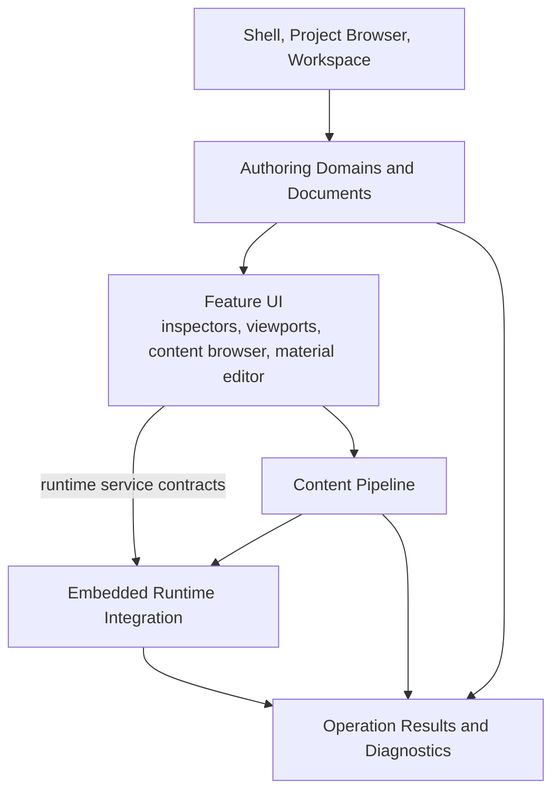

# Oxygen Editor Top-Level Design

Status: `active top-level design`

Related:

- [PRD.md](./PRD.md)
- [ARCHITECTURE.md](./ARCHITECTURE.md)
- [PROJECT-LAYOUT.md](./PROJECT-LAYOUT.md)
- [PLAN.md](./PLAN.md)
- [IMPLEMENTATION_STATUS.md](./IMPLEMENTATION_STATUS.md)
- [lld/README.md](./lld/README.md)

## 1. Purpose

This document is the top-level design for Oxygen Editor V0.1. It sits between
the architecture and the individual low-level designs.

The architecture defines ownership, dependency direction, and runtime
boundaries. The LLDs define concrete subsystem models, service contracts, UI
composition, data contracts, failure modes, and validation gates. This document
keeps those LLDs coherent.

The design goal for V0.1 is not a prototype workflow. It is a production-ready
baseline for the scoped editor surface:

- project startup and workspace activation
- scene documents and command-based authoring
- component inspectors for the V0.1 component set
- scalar material authoring
- content browser asset identity and selection
- descriptor, manifest, cook, mount, and inspect workflows
- embedded live engine preview
- runtime/cooked/standalone parity for authored scene content
- visible operation results and diagnostics

## 2. Design Decomposition

The V0.1 editor is designed as six cooperating product areas:



Each product area has a dedicated LLD owner. Cross-area workflows are described
in this document and then resolved in the owning LLDs.

## 3. Required LLD Set

The LLD set is intentionally explicit. If a feature cannot point to one of
these documents, either the feature is out of scope or the LLD set is missing an
owner.

| Area | LLD | Covers |
| --- | --- | --- |
| Shell, project open, workspace activation | [project-workspace-shell.md](lld/project-workspace-shell.md) | Project Browser startup, project open/create, workspace activation, restoration, project/service boundaries. |
| Project services | [project-services.md](lld/project-services.md) | Project metadata, project settings, content roots, project cook scope and policy. |
| Documents, commands, undo, dirty state | [documents-and-commands.md](lld/documents-and-commands.md) | Generic document abstractions, document lifecycle, command model, undo/redo, dirty state, selection state, command result flow. |
| Scene authoring domain | [scene-authoring-model.md](lld/scene-authoring-model.md) | Scene graph, components, scene persistence, component completion matrix. |
| Scene explorer | [scene-explorer.md](lld/scene-explorer.md) | Hierarchy UI, selection presentation, rename/create/delete/reparent UX, drag/drop semantics. |
| Property inspector | [property-inspector.md](lld/property-inspector.md) | Component editors, field controls, validation presentation, multi-selection behavior. |
| Material editor | [material-editor.md](lld/material-editor.md) | Scalar material documents, property UI, previews, assignment, save/cook/preview contract. |
| Environment authoring | [environment-authoring.md](lld/environment-authoring.md) | Atmosphere, sun, exposure, tone mapping, scene render intent. |
| Content browser and asset identity | [content-browser-asset-identity.md](lld/content-browser-asset-identity.md) | Source/generated/cooked browsing, asset identity, asset picker, missing references. |
| Asset primitives | [asset-primitives.md](lld/asset-primitives.md) | `Oxygen.Assets` reusable asset identity, catalog, import/cook primitives, loose index utilities. |
| Content pipeline | [content-pipeline.md](lld/content-pipeline.md) | Import, descriptor generation, manifest generation, cook, pak, inspect, mount refresh requests. |
| Live engine sync | [live-engine-sync.md](lld/live-engine-sync.md) | Authoring-to-runtime projection, sync adapters, ordering, sync diagnostics. |
| Runtime integration | [runtime-integration.md](lld/runtime-integration.md) | Embedded engine lifecycle, settings application, surface leases, views, mounts, input bridge, threading/frame phases. |
| Standalone runtime validation | [standalone-runtime-validation.md](lld/standalone-runtime-validation.md) | Cooked-output launch/load validation in standalone runtime and parity evidence. |
| Viewport and tools | [viewport-and-tools.md](lld/viewport-and-tools.md) | Viewport layout, editor camera, frame selected/all, selection, gizmos, overlays. |
| Settings architecture | [settings-architecture.md](lld/settings-architecture.md) | Editor, project, workspace, scene, runtime, diagnostic override settings. |
| Diagnostics and operation results | [diagnostics-operation-results.md](lld/diagnostics-operation-results.md) | Operation result model, diagnostic scopes, failure-domain classification, presentation, workspace output/log panel composition. |

Material editing has its own LLD because V0.1 requires scalar material
authoring. Physics scene editing has no V0.1 LLD because it is out of scope per
[PRD.md](./PRD.md).

## 4. Cross-LLD Workflow Contracts

### 4.1 Project Open To Workspace

Owner chain:

```text
project-workspace-shell
  -> project-services
  -> documents-and-commands
  -> content-browser-asset-identity
  -> runtime-integration
  -> diagnostics-operation-results
```

Design contract:

- Project Browser remains the startup experience.
- Process bootstrap performs native runtime discovery before any runtime or
  interop call; failure surfaces before workspace activation.
- Project open/create establishes active project context before workspace
  activation.
- Workspace restoration is best effort and failure-visible.
- Cooked root refresh and runtime startup are explicit runtime operations, not
  hidden shell side effects.

### 4.2 Scene Mutation

Owner chain:

```text
property-inspector / viewport-and-tools / scene-explorer
  -> documents-and-commands
  -> scene-authoring-model
  -> live-engine-sync
  -> diagnostics-operation-results
```

Design contract:

- User edits become commands or command-equivalent service calls.
- Commands mutate authoring state, update dirty state, participate in
  undo/redo, invalidate diagnostics, and request live sync where supported.
- Direct UI mutation of authoring objects is migration debt.

### 4.3 Save, Cook, Mount

Owner chain:

```text
documents-and-commands
  -> scene-authoring-model / material-editor / environment-authoring
  -> asset-primitives
  -> content-pipeline
  -> runtime-integration
  -> diagnostics-operation-results
```

Design contract:

- Save, descriptor generation, manifest generation, cook, output validation,
  catalog refresh, and mount refresh are distinct phases.
- A single user action may invoke multiple phases, but the result must show
  where success or failure occurred.
- Cooked output is never edited as source authoring data.

### 4.4 Live Preview

Owner chain:

```text
viewport-and-tools
  -> runtime-integration
  -> live-engine-sync
  -> environment-authoring / material-editor / scene-authoring-model
  -> diagnostics-operation-results
```

Design contract:

- The viewport is a live runtime projection of authoring state.
- Surface lifecycle and view lifecycle remain separate.
- Editor camera state is document/view state unless the user explicitly edits
  a scene camera.
- Authored content parity matters; editor-only overlays may differ from
  standalone runtime.

### 4.5 Asset Selection And Assignment

Owner chain:

```text
content-browser-asset-identity
  -> asset-primitives
  -> content-pipeline
  -> scene-authoring-model / material-editor
  -> documents-and-commands
  -> diagnostics-operation-results
```

Design contract:

- Asset picking returns asset identity, not raw cooked paths.
- Component and material assignment commands store authoring intent.
- The content pipeline resolves authoring intent into descriptors, manifests,
  cooked references, and runtime mount state.

### 4.6 Standalone Runtime Validation

Owner chain:

```text
content-pipeline
  -> standalone-runtime-validation
  -> diagnostics-operation-results
```

Design contract:

- Standalone validation consumes cooked output; it does not inspect live editor
  runtime state as proof.
- The validation harness proves that cooked V0.1 scenes load in standalone
  runtime with expected authored geometry, materials, camera, lighting,
  atmosphere, exposure, and tone mapping.
- Failures identify whether the problem is cooked output, asset resolution,
  runtime loading, or expected-content mismatch.

## 5. Cross-Cutting Design Contracts

### 5.1 Source Of Truth

Authoring state is the source of truth. Runtime state, cooked output, UI
selection, and generated descriptors are projections or products of authoring
state.

Each LLD must state:

- which state it owns
- which state it reads
- which state it produces
- which state it must not mutate

### 5.2 Component Completion

A supported V0.1 component is done only when the chain closes:

```text
domain model
  -> persistence
  -> inspector or explicit no-editor decision
  -> command mutation
  -> diagnostics
  -> live sync where supported
  -> cook/runtime behavior where applicable
```

The detailed matrix lives in `scene-authoring-model.md`; inspectors,
environment, material, sync, and content pipeline LLDs own their part of the
same matrix.

### 5.3 Runtime Boundary

Managed editor features use runtime services for live engine behavior. They do
not call native interop directly for new V0.1 work.

The runtime integration LLD owns:

- engine lifecycle state
- native runtime discovery assumptions after shell bootstrap
- surface leases
- engine view requests
- cooked-root mounts
- input bridge
- runtime settings application
- UI-thread, async-service, and engine-frame boundary rules

Frame-phase ordering across command, sync, and runtime is owned by
`runtime-integration.md`; `live-engine-sync.md` consumes that contract.

### 5.4 Content Pipeline Boundary

`Oxygen.Editor.ContentPipeline` owns editor tooling orchestration for:

- import
- descriptor generation
- manifest generation
- cook
- pak
- inspect
- pipeline diagnostics

Project services own project policy and cook scope. Asset libraries own
reusable asset/cook primitives. Panels use pipeline services; they do not own
pipeline execution.

The reusable primitive library is documented by `asset-primitives.md`; the
editor workflow orchestration is documented by `content-pipeline.md`.

### 5.5 Operation Results

User-triggered workflows return operation results. Logs are required but are
not the product surface for failure.

Each LLD must define:

- which user actions it owns
- which operation result it emits
- how result status maps to logs and diagnostics
- what information the user needs to continue

### 5.6 Settings

Durable settings belong to the narrowest durable scope that matches user
intent:

- editor
- project
- workspace
- document
- scene
- runtime

Diagnostic overrides are temporary and must not become product configuration.

### 5.7 Selection Model

Selection is workspace/document-scoped state. `documents-and-commands.md` owns
the shared selection model and mutation rules. `scene-explorer.md`,
`property-inspector.md`, and `viewport-and-tools.md` consume that model and may
request selection changes through commands or command-equivalent services.

### 5.8 Reusable UI And Routing

Reusable Oxygen-specific widgets, fields, overlays, and editor styles belong in
`Oxygen.Editor.UI`. Editor-specific route helpers belong in
`Oxygen.Editor.Routing`. Feature LLDs may cite these modules, but they must not
redefine their ownership or duplicate reusable infrastructure locally.

## 6. LLD Definition Of Done

The authoritative LLD template is [lld/README.md](lld/README.md). An LLD is
ready for implementation when each section in that template is answered or
marked as a deliberate open issue. A missing answer is not acceptable as an
implicit implementation choice.

## 7. Design Governance

Top-level design changes must preserve:

- the ownership map in `ARCHITECTURE.md`
- the placement rules in `PROJECT-LAYOUT.md`
- PRD requirement traceability
- LLD ownership clarity
- the rule that finished V0.1 work is finished end-to-end

Detailed design belongs in the owning LLD. This document should change only
when the subsystem map, cross-LLD contracts, or top-level design decisions
change.
