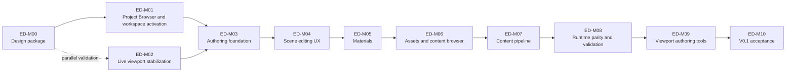

# Oxygen Editor V0.1 Plan

Status: `active top-level plan`

Related:

- [PRD.md](./PRD.md)
- [ARCHITECTURE.md](./ARCHITECTURE.md)
- [DESIGN.md](./DESIGN.md)
- [PROJECT-LAYOUT.md](./PROJECT-LAYOUT.md)
- [IMPLEMENTATION_STATUS.md](./IMPLEMENTATION_STATUS.md)
- [lld/README.md](./lld/README.md)
- [plan/README.md](./plan/README.md)

## 1. Purpose

This document is the top-level execution plan for Oxygen Editor V0.1. It
defines milestone order, milestone outcomes, LLD timing, and the handoff from
design into detailed implementation plans.

It is not the live progress ledger. Progress is tracked in
[IMPLEMENTATION_STATUS.md](./IMPLEMENTATION_STATUS.md).

It is not the task list for individual milestones. Detailed implementation
plans live under [plan/](./plan/), and each active milestone must have one
before implementation starts.

## 2. Planning Hierarchy

```text
PRD
  -> ARCHITECTURE
    -> DESIGN
      -> PLAN
        -> LLDs for the milestone
          -> detailed milestone/work-package implementation plans
            -> implementation
              -> IMPLEMENTATION_STATUS validation ledger
```

Planning rules:

1. A milestone may begin implementation only after its required LLDs are
   reviewed enough to guide code.
2. A milestone must have a detailed implementation plan before code work
   starts.
3. Implementation plans may contain tasks, file touch points, sequencing,
   tests, risks, and rollout steps. This top-level plan must not.
4. Milestone validation is recorded once in `IMPLEMENTATION_STATUS.md`.
5. If scope changes, update PRD/ARCHITECTURE/DESIGN before reshaping milestone
   work.

## 3. Milestone Sequence



`ED-M02` has partially landed behavior and can be validated in parallel with
`ED-M00` and `ED-M01`. `ED-M03` LLD review and detailed planning may proceed in
parallel, but `ED-M03` implementation must not rely on live preview as evidence
until `ED-M02` is validated.

## 4. Milestone Roadmap

| ID | Milestone | Outcome | Primary LLDs | Detailed Plan |
| --- | --- | --- | --- | --- |
| `ED-M00` | Design package and execution baseline | `design/editor` is canonical, reviewed, traceable, and ready to drive implementation. | all LLD scaffolds; top-level docs | required before close |
| `ED-M01` | Project Browser and workspace activation | Project Browser startup, project open/create, invalid project handling, workspace transition, and restoration failure visibility work as product behavior. | `project-workspace-shell`, `project-services`, `diagnostics-operation-results` | required before implementation |
| `ED-M02` | Live viewport stabilization | Embedded Vortex preview, surface/view lifecycle, native runtime discovery, runtime settings, and viewport presentation are stable. | `runtime-integration`, `viewport-and-tools`, `diagnostics-operation-results` | required before validation |
| `ED-M03` | Authoring foundation | Scene documents, commands, dirty state, undo/redo, selection model, scene explorer, operation results, and save/reopen form a reliable authoring core. | `documents-and-commands`, `scene-authoring-model`, `scene-explorer`, `diagnostics-operation-results` | required before implementation |
| `ED-M04` | Scene editing UX and component inspectors | V0.1 scene components except real material asset authoring have production-ready inspectors, defaults, validation, and live-sync requests. | `property-inspector`, `environment-authoring`, `settings-architecture`, `live-engine-sync`, `runtime-integration` | required before implementation |
| `ED-M05` | Scalar material authoring | Users can create/open/edit scalar material assets and assign them to geometry through real editor UI; a minimum material cook/preview slice is defined and validated. | `material-editor`, `content-browser-asset-identity`, `asset-primitives`, `content-pipeline` | required before implementation |
| `ED-M06` | Asset identity and content browser | Source, generated, descriptor, cooked, mounted, missing, and broken asset states are visible and selectable by identity. | `content-browser-asset-identity`, `asset-primitives`, `project-services`, `diagnostics-operation-results` | required before implementation |
| `ED-M07` | Content pipeline and cooking | Descriptor/manifest generation, cook, inspect, cooked validation, catalog refresh, and mount refresh work as explicit workflows. | `content-pipeline`, `project-services`, `asset-primitives`, `runtime-integration`, `diagnostics-operation-results` | required before implementation |
| `ED-M08` | Runtime parity and standalone validation | A minimum authored content slice proves embedded preview, cooked output, mounted content, and standalone runtime load agree. | `standalone-runtime-validation`, `live-engine-sync`, `runtime-integration`, `content-pipeline`, `environment-authoring` | required before implementation |
| `ED-M09` | Viewport authoring tools and overlays | Camera navigation, frame selected/all, selection highlight, transform gizmos, node icons, and overlays are usable in supported viewport layouts. | `viewport-and-tools`, `documents-and-commands`, `scene-explorer`, `runtime-integration` | required before implementation |
| `ED-M10` | V0.1 acceptance | The full PRD V0.1 workflow completes end-to-end without manual repair. | all V0.1 LLDs | required before validation |

## 5. Milestone Details

### ED-M00 - Design Package And Execution Baseline

Purpose: finish the planning package so implementation can proceed without
rediscovering ownership, scope, or validation rules in code.

LLD work:

- All LLD files exist and have the required structure.
- LLDs needed by `ED-M01`, `ED-M02`, and `ED-M03` are reviewed first.
- Later LLDs may remain scaffolds until their milestone approaches.

Exit gate:

- PRD, architecture, top-level design, project layout, plan, LLD index, and
  status tracker are reviewed as a coherent package.
- `IMPLEMENTATION_STATUS.md` records one concise `ED-M00` validation row.

### ED-M01 - Project Browser And Workspace Activation

Purpose: make the required start-of-workflow product behavior real before
scene authoring milestones assume an active project/workspace.

LLD work:

- `project-workspace-shell.md` is reviewed in detail for Project Browser,
  project open/create, invalid project handling, workspace activation, and
  restoration failure behavior.
- `project-services.md` is reviewed for project metadata, content roots,
  project settings, and project policy needed at activation time.
- `diagnostics-operation-results.md` is reviewed for project open/create and
  workspace restoration failures.

Exit gate:

- Editor starts at Project Browser.
- Recent project, create project, open project, and invalid project states are
  usable.
- Successful project open transitions into the editor workspace.
- Workspace restoration is best effort and visible when partially unsuccessful.
- Project open/create failures produce visible operation results.

### ED-M02 - Live Viewport Stabilization

Purpose: make the embedded engine preview stable enough to support authoring
validation.

LLD work:

- `runtime-integration.md` covers engine lifecycle, runtime settings, surface
  leases, view lifecycle, and frame-phase completion semantics.
- `viewport-and-tools.md` covers current viewport presentation and framing
  behavior.
- `diagnostics-operation-results.md` covers visible runtime/surface/view
  failures.

Exit gate:

- One/two/four viewport layouts do not abort.
- Each visible viewport presents to the correct surface.
- Runtime DLL discovery works from the engine install runtime directory.
- Editor camera can frame authored content with sane defaults.
- Runtime/FPS settings are applied or a visible diagnostic explains why not.

### ED-M03 - Authoring Foundation

Purpose: establish the scene document, command, selection, dirty-state,
operation-result, and hierarchy foundation that every later authoring feature
depends on.

LLD work:

- `documents-and-commands.md` is reviewed in detail.
- `scene-authoring-model.md` is reviewed for V0.1 domain and persistence
  coverage.
- `scene-explorer.md` is reviewed for hierarchy UI and selection behavior.
- `diagnostics-operation-results.md` is reviewed for command/save/sync failure
  surfaces.

Exit gate:

- Node create/delete/rename/reparent operations use command paths.
- Component add/remove/edit operations for V0.1 components use command paths.
- Dirty state and undo/redo work for supported mutations.
- Scene save/reopen round-trips supported values.
- Live-sync intent is requested after supported mutations.
- Operation result presentation exists for command, save, and sync failures.

### ED-M04 - Scene Editing UX And Component Inspectors

Purpose: make the supported scene component set authorable through real UI,
not hardcoded defaults or debug-only paths. Material asset authoring and
identity-based material assignment are completed in `ED-M05`.

LLD work:

- `property-inspector.md` is reviewed for component editors, fields,
  validation, and multi-selection.
- `environment-authoring.md` is reviewed for atmosphere, sun, exposure, tone
  mapping, and scene render intent.
- `settings-architecture.md` is reviewed for scene/runtime/project settings
  needed by environment and inspector workflows.
- `live-engine-sync.md` is reviewed for component sync coverage.
- `runtime-integration.md` is re-reviewed if inspector-driven sync requires new
  runtime completion semantics.

Exit gate:

- Transform, Geometry, PerspectiveCamera, DirectionalLight, and Environment
  have scoped production-ready editing behavior.
- Geometry components expose a material assignment/override slot that persists
  and can hold an unresolved or placeholder material identity until `ED-M05`
  wires real material asset creation, picking, and assignment.
- Component edits use commands/services, not direct interop.
- Edits persist, request sync, and report failures visibly.

### ED-M05 - Scalar Material Authoring

Purpose: establish a real V0.1 material editor baseline that can grow into
texture and graph workflows later.

LLD work:

- `material-editor.md` is reviewed in detail.
- `asset-primitives.md` defines material asset identity primitives.
- `content-browser-asset-identity.md` covers the material-picking slice and
  visual identity.
- `content-pipeline.md` is reviewed for the minimum scalar material descriptor,
  cook contribution, and preview slice. Full pipeline review happens in
  `ED-M07`.

Exit gate:

- Users can create/open scalar material assets.
- Users can inspect and edit scalar material values.
- Users can assign material assets to geometry through asset identity.
- Material values save and reopen.
- A minimum scalar material descriptor/cook/preview slice is validated or a
  visible engine/API limitation is recorded before the full pipeline milestone.

### ED-M06 - Asset Identity And Content Browser

Purpose: make content browser and asset references editor concepts rather than
raw filesystem or cooked path workflows.

LLD work:

- `content-browser-asset-identity.md` is reviewed in detail for full browser
  scope.
- `asset-primitives.md` is reviewed for identity/catalog/reference primitives.
- `project-services.md` is reviewed for content root policy.
- `diagnostics-operation-results.md` covers missing/broken reference surfaces.

Exit gate:

- Content browser distinguishes source, generated/descriptor, cooked, mounted,
  missing, and broken states.
- Asset picker returns typed asset identity.
- Broken references become visible diagnostics.
- Authoring data avoids raw cooked-path text as the user-facing identity.

### ED-M07 - Content Pipeline And Cooking

Purpose: make descriptor, manifest, cook, inspect, validate, catalog refresh,
and mount refresh explicit workflows.

LLD work:

- `content-pipeline.md` is reviewed in detail.
- `project-services.md` defines project cook scope and content root policy.
- `asset-primitives.md` covers reusable import/cook/index primitives.
- `runtime-integration.md` is re-reviewed for cooked-root mount behavior.
- `diagnostics-operation-results.md` covers pipeline failure domains.

Exit gate:

- Procedural geometry descriptors are generated for supported procedural
  meshes.
- Scoped source import produces supported descriptors.
- Cooking includes current scene and referenced V0.1 assets.
- Cook output validates before mount.
- Cook, inspect, and mount failures produce visible operation results.

### ED-M08 - Runtime Parity And Standalone Validation

Purpose: prove the minimum runtime parity slice before full V0.1 acceptance.
The minimum slice is one geometry node, one scalar material, one camera, one
directional light, and scene environment settings.

LLD work:

- `standalone-runtime-validation.md` is reviewed in detail.
- `live-engine-sync.md` is reviewed for V0.1 component/material/environment
  coverage.
- `runtime-integration.md` is re-reviewed for mount and runtime-state evidence.
- `environment-authoring.md` is reviewed for runtime parity of atmosphere,
  exposure, tone mapping, and lighting.

Exit gate:

- Embedded preview renders the minimum authored content slice.
- Cooked output for the minimum slice loads in standalone runtime.
- Expected geometry, material, camera, directional light, atmosphere, exposure,
  and tone mapping are present within documented tolerance.
- Failures identify cooked output, asset resolution, runtime load, sync, or
  parity mismatch.

### ED-M09 - Viewport Authoring Tools And Overlays

Purpose: make viewport interaction usable for scene authoring after the core
runtime, authoring, and cook paths are stable.

LLD work:

- `viewport-and-tools.md` is reviewed in detail.
- `documents-and-commands.md` provides selection and transform command
  behavior.
- `scene-explorer.md` provides hierarchy/selection coordination.
- `runtime-integration.md` is re-reviewed for input bridge and frame-phase
  constraints.

Exit gate:

- Camera navigation and frame selected/all are usable.
- Selection highlight is implemented.
- Transform gizmo UX mutates through commands.
- Non-geometry node icons exist for cameras/lights.
- One/two/four viewport layouts remain stable with overlays enabled.

### ED-M10 - V0.1 Acceptance

Purpose: close the full V0.1 workflow in product terms.

LLD work:

- All V0.1 LLDs have been reviewed or explicitly marked as not gating V0.1.
- Any residual open issue is either resolved or moved out of V0.1 by PRD/design
  decision.

Exit gate:

- Start from Project Browser.
- Open/create a project and scene.
- Author full V0.1 geometry, material, camera, light, and environment content.
- Preview live in the embedded Vortex viewport.
- Save and reopen without manual repair.
- Generate descriptors/manifests.
- Cook, inspect, refresh, and mount output.
- Load cooked scene in standalone runtime.
- Record final `SUCCESS-XXX` validation evidence in
  `IMPLEMENTATION_STATUS.md`.

## 6. LLD Schedule

| LLD | First Milestone That Needs Detailed Review | Notes |
| --- | --- | --- |
| `project-workspace-shell.md` | `ED-M00` scaffold; full review at `ED-M01` | Project Browser/workspace behavior is implemented in `ED-M01`. |
| `project-services.md` | `ED-M01` | Project metadata/policy starts with activation and returns for cook scope in `ED-M07`. |
| `documents-and-commands.md` | `ED-M03` | Gating LLD for authoring foundation and selection model. |
| `scene-authoring-model.md` | `ED-M03` | Gating LLD for component persistence and authoring source of truth. |
| `scene-explorer.md` | `ED-M03` | Gating LLD for hierarchy and selection behavior. |
| `property-inspector.md` | `ED-M04` | Gating LLD for component editor implementation. |
| `environment-authoring.md` | `ED-M04` | Needed before environment and parity work. |
| `settings-architecture.md` | `ED-M04` | Scaffold reviewed for project settings in `ED-M01`; detailed review in `ED-M04`; re-reviewed in `ED-M07` for project cook scope and content-root settings. |
| `material-editor.md` | `ED-M05` | Gating LLD for scalar material authoring. |
| `asset-primitives.md` | `ED-M05` | Needed by material, browser, and pipeline work. |
| `content-browser-asset-identity.md` | `ED-M05` material picker slice; full review at `ED-M06` | Starts with material picking, completed in content browser milestone. |
| `content-pipeline.md` | `ED-M05` material slice; full review at `ED-M07` | Minimum material descriptor/cook slice first; full pipeline later. |
| `runtime-integration.md` | `ED-M02` | Re-reviewed in `ED-M04` for sync completion, `ED-M07` for mount, `ED-M08` for parity, and `ED-M09` for input bridge. |
| `live-engine-sync.md` | `ED-M04` | Needed once command-driven mutations are in place. |
| `viewport-and-tools.md` | `ED-M02` | Initial stabilization in `ED-M02`, authoring tools in `ED-M09`. |
| `diagnostics-operation-results.md` | `ED-M01` | Starts with project failures and becomes foundational in `ED-M03`. |
| `standalone-runtime-validation.md` | `ED-M08` | Needed before runtime parity milestone implementation. |

## 7. Detailed Implementation Plans

Detailed implementation plans are created per milestone or work package under
[plan/](./plan/). Each active milestone has either a single milestone plan
(`ED-Mxx-...md`) or one or more work-package plans (`ED-WPxx.y-...md`). The
owner choice is recorded in [IMPLEMENTATION_STATUS.md](./IMPLEMENTATION_STATUS.md).
The `ED-WPxx.y` numeric prefix is historical and does not necessarily match the
current milestone ID after the `ED-M01` insertion.

Detailed plans are expected to contain:

- PRD traceability
- LLDs that must be reviewed first
- scope and non-scope
- implementation sequencing
- likely project/file touch points
- dependency and migration risks
- validation gates
- rollback or containment notes where useful

Existing detailed plans are early work-package plans and should be reconciled
with this milestone structure as each milestone starts:

| Plan | Milestone |
| --- | --- |
| [ED-WP02.1-normalize-scene-mutation-commands.md](plan/ED-WP02.1-normalize-scene-mutation-commands.md) | `ED-M03` |
| [ED-WP02.2-component-inspectors-and-live-sync.md](plan/ED-WP02.2-component-inspectors-and-live-sync.md) | `ED-M03` / `ED-M04` |
| [ED-WP04.1-asset-reference-model.md](plan/ED-WP04.1-asset-reference-model.md) | `ED-M05` / `ED-M06` |
| [ED-WP05.1-manifest-driven-cooking.md](plan/ED-WP05.1-manifest-driven-cooking.md) | `ED-M07` |
| [ED-WP06.1-settings-architecture-and-editors.md](plan/ED-WP06.1-settings-architecture-and-editors.md) | `ED-M04` / `ED-M07` |
| [ED-WP08.1-validation-model.md](plan/ED-WP08.1-validation-model.md) | `ED-M03` / `ED-M09` |

## 8. Milestone Closure

A milestone closes only when:

1. its required LLDs have been reviewed enough to support implementation
2. its detailed implementation plan exists
3. the planned implementation has landed
4. validation evidence is recorded in `IMPLEMENTATION_STATUS.md`
5. any deferred scope has been explicitly moved to a later milestone or out of
   V0.1

Working demos do not close milestones. The milestone outcome must be usable,
documented, and validated against the PRD requirement IDs it claims to satisfy.
