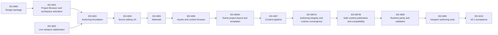

# Oxygen Editor V0.1 Plan

Status: `active top-level plan`

Related:

- [PRD.md](./PRD.md)
- [ARCHITECTURE.md](./ARCHITECTURE.md)
- [DESIGN.md](./DESIGN.md)
- [PROJECT-LAYOUT.md](./PROJECT-LAYOUT.md)
- [IMPLEMENTATION_STATUS.md](./IMPLEMENTATION_STATUS.md)
- [lld/README.md](./lld/README.md)
- [plan/README.md](./plan/README.md)

## 1. Purpose

This document is the top-level execution plan for Oxygen Editor V0.1. It
defines milestone order, milestone outcomes, LLD timing, and the handoff from
design into detailed implementation plans.

It is not the live progress ledger. Progress is tracked in
[IMPLEMENTATION_STATUS.md](./IMPLEMENTATION_STATUS.md).

It is not the task list for individual milestones. Detailed implementation
plans live under [plan/](./plan/), and each active milestone must have one
before implementation starts.

## 2. Planning Hierarchy

```text
PRD
  -> ARCHITECTURE
    -> DESIGN
      -> PLAN
        -> LLDs for the milestone
          -> detailed milestone implementation plans
            -> implementation
              -> IMPLEMENTATION_STATUS validation ledger
```

Planning rules:

1. A milestone may begin implementation only after its required LLDs are
   reviewed enough to guide code.
2. A milestone must have a detailed implementation plan before code work
   starts.
3. Implementation plans may contain tasks, file touch points, sequencing,
   tests, risks, and rollout steps. This top-level plan must not.
4. Milestone validation is recorded once in `IMPLEMENTATION_STATUS.md`.
5. If scope changes, update PRD/ARCHITECTURE/DESIGN before reshaping milestone
   work.
6. PRD section 8 owns the V0.1 capability boundary; the linked LLD field and
   interaction contracts define its details. Required gates execute under their
   current owning milestones. Multi-viewport stability is the explicit deferral;
   listed non-goals are exclusions, not permission to omit required fields.
7. Previously recorded milestone status/evidence is retained. Identified missing
   implementation or additional guarantees execute in named gap-closing
   milestones; do not create a retrospective closure sweep.

## 3. Milestone Sequence


```mermaid
flowchart LR
    M00[ED-M00<br/>Design package]
    M01[ED-M01<br/>Project Browser and workspace activation]
    M02[ED-M02<br/>Live viewport stabilization]
    M03[ED-M03<br/>Authoring foundation]
    M04[ED-M04<br/>Scene editing UX]
    M05[ED-M05<br/>Materials]
    M06[ED-M06<br/>Assets and content browser]
    M06A[ED-M06A<br/>Game project layout and templates]
    M07[ED-M07<br/>Content pipeline]
    M07A[ED-M07A<br/>Authoring integrity and runtime convergence]
    M07B[ED-M07B<br/>Safe content publication and compatibility]
    M08[ED-M08<br/>Runtime parity and validation]
    M09[ED-M09<br/>Viewport authoring tools]
    M10[ED-M10<br/>V0.1 acceptance]

    M00 --> M01
    M01 --> M03
    M02 --> M03
    M03 --> M04 --> M05 --> M06 --> M06A --> M07 --> M07A --> M07B --> M08 --> M09 --> M10
```

`ED-M02` still requires its recorded supported-viewport validation. The current
execution sequence is ED-M08 -> ED-M09 -> ED-M10. ED-M07A and ED-M07B are validated.
Earlier milestones retain their delivery records; source-identified omissions
are assigned to 07A/07B, with no new M04 closure action. Implementation can progress while
ED-M02's evidence is collected, but M08 cannot close without that evidence.

## 4. Milestone Roadmap

| ID | Milestone | Outcome | Primary LLDs | Detailed Plan |
| --- | --- | --- | --- | --- |
| `ED-M00` | Design package and execution baseline | `design/editor` is canonical, reviewed, traceable, and ready to drive implementation. | all LLD scaffolds; top-level docs | required before close |
| `ED-M01` | Project Browser and workspace activation | Project Browser startup, project open/create, invalid project handling, workspace transition, and restoration failure visibility work as product behavior. | `project-workspace-shell`, `project-services`, `diagnostics-operation-results` | required before implementation |
| `ED-M02` | Live viewport stabilization | Embedded Vortex preview, surface/view lifecycle, native runtime discovery, runtime settings, and viewport presentation are stable. | `runtime-integration`, `viewport-and-tools`, `diagnostics-operation-results` | required before validation |
| `ED-M03` | Authoring foundation | Scene documents, commands, dirty state, undo/redo, selection model, scene explorer, operation results, and save/reopen form a reliable authoring core. | `documents-and-commands`, `scene-authoring-model`, `scene-explorer`, `diagnostics-operation-results` | required before implementation |
| `ED-M04` | Scene editing UX and component inspectors | V0.1 scene components except real material asset authoring have production-ready inspectors, defaults, validation, and live-sync requests. | `property-inspector`, `environment-authoring`, `settings-architecture`, `live-engine-sync`, `runtime-integration` | required before implementation |
| `ED-M05` | Scalar material authoring | Users can create/open/edit scalar material assets and assign them to geometry through real editor UI; a minimum material cook/preview slice is defined and validated. | `material-editor`, `content-browser-asset-identity`, `asset-primitives`, `content-pipeline` | required before implementation |
| `ED-M06` | Asset identity and content browser | Source, generated, descriptor, cooked, missing, broken, and runtime-availability overlay states are visible and selectable by identity; authoritative mounted state is deferred to `ED-M07`. | `content-browser-asset-identity`, `asset-primitives`, `project-services`, `diagnostics-operation-results` | required before implementation |
| `ED-M06A` | Game project layout and template standardization | Newly created projects, predefined templates, scene/material creation targets, content-root navigation, source-media placement, and derived-root presentation match the accepted game-project filesystem contract. | `project-layout-and-templates`, `project-services`, `project-workspace-shell`, `content-browser-asset-identity`, `material-editor`, `scene-authoring-model`, `diagnostics-operation-results` | required before implementation |
| `ED-M07` | Content pipeline and cooking | Descriptor/manifest generation, cook, inspect, cooked validation, catalog refresh, and mount refresh work as explicit workflows. | `content-pipeline`, `project-services`, `asset-primitives`, `runtime-integration`, `diagnostics-operation-results` | required before implementation |
| `ED-M07A` | Authoring integrity and runtime convergence | Identified background, gesture, field-diagnostic, sync-lifetime and save-integrity gaps close with concrete UI/native evidence. | `property-pipeline`, `property-inspector`, `environment-authoring`, `documents-and-commands`, `material-editor`, `settings-architecture`, `live-engine-sync` | detailed plan exists |
| `ED-M07B` | Safe content publication and compatibility | Intuitive content discovery/use, consistent status, incremental cooking, saved snapshots, safe publication, complete native mappings, matched builds and reproducible import work. | `content-cooking-workflows`, `content-browser-asset-identity`, `material-editor`, `content-pipeline`, `runtime-integration`, `project-services`, `asset-primitives` | Validated; complete workflow audit recorded |
| `ED-M08` | Runtime parity and standalone validation | The saved/published PRD fixture and field suite agree in embedded preview and an automatic standalone check. | `standalone-runtime-validation`, `live-engine-sync`, `runtime-integration`, `content-pipeline`, `environment-authoring` | Reviewed after M07B; ready for implementation |
| `ED-M09` | Viewport authoring tools and overlays | Camera navigation, frame selected/all, selection highlight, transform gizmos, node icons, and overlays are usable in supported viewport layouts. | `viewport-and-tools`, `documents-and-commands`, `scene-explorer`, `runtime-integration` | required before implementation |
| `ED-M10` | V0.1 acceptance | The full PRD V0.1 workflow completes end-to-end without manual repair. | all V0.1 LLDs | required before validation |

## 5. Milestone Details

### ED-M00 - Design Package And Execution Baseline

Purpose: finish the planning package so implementation can proceed without
rediscovering ownership, scope, or validation rules in code.

LLD work:

- All LLD files exist and have the required structure.
- LLDs needed by `ED-M01`, `ED-M02`, and `ED-M03` are reviewed first.
- Later LLDs may remain scaffolds until their milestone approaches.

Exit gate:

- PRD, architecture, top-level design, project layout, plan, LLD index, and
  status tracker are reviewed as a coherent package.
- `IMPLEMENTATION_STATUS.md` records one concise `ED-M00` validation row.

### ED-M01 - Project Browser And Workspace Activation

Purpose: make the required start-of-workflow product behavior real before
scene authoring milestones assume an active project/workspace.

LLD work:

- `project-workspace-shell.md` is reviewed in detail for Project Browser,
  project open/create, invalid project handling, workspace activation, and
  restoration failure behavior.
- `project-services.md` is reviewed for project metadata, content roots,
  project settings, and project policy needed at activation time.
- `diagnostics-operation-results.md` is reviewed for project open/create and
  workspace restoration failures.

Exit gate:

- Editor starts at Project Browser.
- Recent project, create project, open project, and invalid project states are
  usable.
- Successful project open transitions into the editor workspace.
- Workspace restoration is best effort and visible when partially unsuccessful.
- Project open/create failures produce visible operation results.

### ED-M02 - Live Viewport Stabilization

Purpose: make the embedded engine preview stable enough to support authoring
validation.

LLD work:

- `runtime-integration.md` covers engine lifecycle, runtime settings, surface
  leases, view lifecycle, and frame-phase completion semantics.
- `viewport-and-tools.md` covers current viewport presentation and framing
  behavior.
- `diagnostics-operation-results.md` covers visible runtime/surface/view
  failures.

Exit gate:

- The supported single live viewport layout does not abort.
- The supported live viewport presents to the correct surface.
- Runtime DLL discovery works from the engine install runtime directory.
- Editor camera can frame authored content with sane defaults.
- Runtime/FPS settings are applied or a visible diagnostic explains why not.

Deferred work:

- Multi-viewport layout validation is deferred out of ED-M02. The existing UI
  path may remain visible, but multi-pane stability is not an ED-M02 closure
  gate and must stay deferred. Stable multi-viewport requires later
  engine multi-surface / multi-view renderer work.

### ED-M03 - Authoring Foundation

Purpose: establish the scene document, command, selection, dirty-state,
operation-result, and hierarchy foundation that every later authoring feature
depends on.

LLD work:

- `documents-and-commands.md` is reviewed in detail.
- `scene-authoring-model.md` is reviewed for V0.1 domain and persistence
  coverage.
- `scene-explorer.md` is reviewed for hierarchy UI and selection behavior.
- `diagnostics-operation-results.md` is reviewed for command/save/sync failure
  surfaces.

Exit gate:

- Node create/delete/rename/reparent operations use command paths.
- Quick-add primitive and directional light creation use command paths.
- Dirty state and undo/redo work for supported mutations.
- Scene save/reopen round-trips supported values.
- Live-sync intent is requested after supported mutations.
- Operation result presentation exists for command, save, and sync failures.

### ED-M04 - Scene Editing UX And Component Inspectors

Delivery note: this is the original milestone scope. Its recorded status/evidence
is preserved. Concrete missing implementation and evidence are assigned to
ED-M07A and ED-M07B; no new execution or closure sweep occurs under ED-M04.

Purpose: make the supported scene component set authorable through real UI,
not hardcoded defaults or debug-only paths. Material asset authoring and
identity-based material assignment are completed in `ED-M05`.

LLD work:

- `property-inspector.md` is reviewed for component editors, fields,
  validation, and multi-selection.
- `environment-authoring.md` is reviewed for atmosphere, sun, exposure, tone
  mapping, and scene render intent.
- `settings-architecture.md` is reviewed for scene/runtime/project settings
  needed by environment and inspector workflows.
- `live-engine-sync.md` is reviewed for component sync coverage.
- `runtime-integration.md` is re-reviewed if inspector-driven sync requires new
  runtime completion semantics.

Exit gate:

- Transform, Geometry, PerspectiveCamera, DirectionalLight, and Environment
  have scoped production-ready editing behavior.
- Geometry components expose a material assignment/override slot that persists
  and can hold an unresolved or placeholder material identity until `ED-M05`
  wires real material asset creation, picking, and assignment.
- Component edits use commands/services, not direct interop.
- Edits persist, request sync, and report failures visibly.
- Every non-deferred `property-inspector.md` and `environment-authoring.md`
  validation gate is implemented and validated. Do not narrow this to a subset
  of fields or examples.

### ED-M05 - Scalar Material Authoring

Purpose: establish a real V0.1 material editor baseline that can grow into
texture and graph workflows later.

LLD work:

- `material-editor.md` is reviewed in detail.
- `asset-primitives.md` defines material asset identity primitives.
- `content-browser-asset-identity.md` covers the material-picking slice and
  visual identity.
- `content-pipeline.md` is reviewed for the minimum scalar material descriptor,
  cook contribution, and preview slice. Full pipeline review happens in
  `ED-M07`.

Exit gate:

- Users can create/open scalar material assets.
- Users can inspect and edit scalar material values.
- Users can assign material assets to geometry through asset identity.
- Material values save and reopen.
- A minimum scalar material descriptor/cook/preview slice is validated or a
  visible engine/API limitation is recorded before the full pipeline milestone.

### ED-M06 - Asset Identity And Content Browser

Purpose: make content browser and asset references editor concepts rather than
raw filesystem or cooked path workflows.

LLD work:

- `content-browser-asset-identity.md` is reviewed in detail for full browser
  scope.
- `asset-primitives.md` is reviewed for identity/catalog/reference primitives.
- `project-services.md` is reviewed for content root policy.
- `diagnostics-operation-results.md` covers missing/broken reference surfaces.

Exit gate:

- Content browser distinguishes source, generated/descriptor, cooked, missing,
  broken, and runtime-availability overlay states. ED-M06 may show
  `Unknown`/`NotMounted`; authoritative `Mounted` is deferred to `ED-M07`.
- Asset picker returns typed asset identity.
- Broken references become visible diagnostics.
- Authoring data avoids raw cooked-path text as the user-facing identity.

### ED-M06A - Game Project Layout And Template Standardization

Purpose: make the accepted game-project filesystem contract real before
content pipeline and runtime milestones depend on it.

LLD work:

- `project-layout-and-templates.md` is reviewed in detail for project folder
  layout, authored content roots, local folder mounts, derived roots,
  predefined template payloads, template descriptors, and creation targets.
- `project-services.md` is reviewed for project manifest, project creation,
  validation, active project context, and cook-scope facts.
- `project-workspace-shell.md` is reviewed only for create-from-template
  activation and starter-scene opening behavior.
- `content-browser-asset-identity.md` is reviewed for browser roots, folder
  navigation, source-media rows, material picker filtering, and derived-state
  presentation.
- `material-editor.md` and `scene-authoring-model.md` are reviewed only for
  material and scene source locations under authored content roots.
- `diagnostics-operation-results.md` is reviewed for template, layout, mount,
  and browser-target failure results.

Exit gate:

- Creating each predefined project template produces a valid project with a
  unique project id, required folder skeleton, valid manifest, required
  template media, and starter scene under `Content/Scenes`.
- New scenes are authored under `Content/Scenes/*.oscene.json`.
- New materials are authored under `Content/Materials/*.omat.json`.
- Content Browser folder navigation refreshes visible rows without restart.
- Material Picker shows one logical row per material and no unrelated project
  files.
- Source media, config, packages, and derived roots are presented distinctly
  and never become implicit authored-asset creation targets.
- Extra authoring mounts and explicitly selected local mounts follow the
  project-layout target rules.
- Project/template/layout failures produce visible operation results.

### ED-M07 - Content Pipeline And Cooking

Purpose: make descriptor, manifest, cook, inspect, validate, catalog refresh,
and mount refresh explicit workflows.

LLD work:

- `content-pipeline.md` is reviewed in detail.
- `project-services.md` defines project cook scope and content root policy.
- `asset-primitives.md` covers reusable import/cook/index primitives.
- `runtime-integration.md` is re-reviewed for cooked-root mount behavior.
- `diagnostics-operation-results.md` covers pipeline failure domains.

Exit gate:

- Procedural geometry descriptors are generated for supported procedural
  meshes.
- Scoped source import produces supported descriptors.
- Cooking includes current scene and referenced V0.1 assets.
- Cook output validates before mount.
- Cook, inspect, and mount failures produce visible operation results.

### ED-M07A - Authoring Integrity And Runtime Convergence

Status: `validated` (2026-09-11). Automated control/native cases and user-confirmed
viewport workflows pass; see the [field/workflow results](validation/ED-M07A-field-workflows.md).

Purpose: close the source-identified inspector/property and authoring-integrity
gaps in the [detailed plan](plan/ED-M07A-authoring-integrity-and-runtime-convergence.md).
This plan names existing working paths, missing behavior, file touch points and
pass/fail cases; implementation starts with those fixes, not another audit.

Exit gate: native background truth, gesture sessions, scoped field diagnostics,
revision/lifetime-aware replay, scene/material save integrity and complete actual
control/native evidence pass the named task gates, including issues #6/#7/#9/#10. Earlier milestone evidence is
retained; ED-M07A gets its own validation row.

### ED-M07B - Safe Content Publication And Compatibility

Purpose: complete intuitive before/after-cook browsing, picking, status, and
recovery alongside descriptor/publication/import/compatibility gaps in the
[detailed plan](plan/ED-M07B-safe-content-publication-and-compatibility.md).

Exit gate: saved dependency capture, staged validation, brief preview pause,
rollback/recovery, PostProcess/Background native cook/load mapping, matched-build
preflight and portable static/scalar import pass their specified failure cases.
All four existing cook scopes execute incrementally with honest freshness and
publication results. Shared state, correct list/tile navigation, useful filters
and details, typed picking before/after cooking, import/save recovery, and usable
command layouts pass the recorded UI journeys. Implement the automatic trigger
policy accepted in 07B.0. Native worker lifetime (#8) and the complete
engine procedural catalog's shared authority (#11) pass their concrete tasks
before parity, including Cylinder scene/project cooking and engine sphere aliases.
07B.5g also closes compact single/multi-node inspector layout and component
filtering, with deselection restoring all applicable property editors.

### ED-M08 - Runtime Parity And Standalone Validation

Purpose: prove exact saved/published project content in embedded and standalone
runtime using the PRD 100-node/1,000-entry qualification fixture and field suite.
The one-mesh smoke scene is a development aid, not the complete acceptance gate.

ED-M07A/07B are validated. M08 implementation can proceed; remaining ED-M02
supported-viewport evidence is required before M08 closure.
ED-M09 tool completion is not a prerequisite. Required LLDs are property-pipeline,
standalone-runtime-validation, live-engine-sync, runtime-integration,
content-pipeline and environment-authoring. The
[detailed plan](plan/ED-M08-runtime-parity-and-standalone-validation.md) owns the
exact-request RenderScene entry point, observations/captures and comparisons.
The user confirmed an automatic check that exits, with concise editor feedback.
Captures and full comparisons remain verification artifacts for joint review;
there is no additional comparison tab or validation dashboard.

Exit gate: exact project/scene loading, every required field's semantic parity,
controlled static/auto-exposure image cases, precise failure/cancel/timeout
behavior and output leasing pass the standalone LLD's fixed criteria. No
unsupported required field or native exit-success shortcut closes this gate.

### ED-M09 - Viewport Authoring Tools And Overlays

Purpose: make viewport interaction usable for scene authoring after the core
runtime, authoring, and cook paths are stable.

LLD work:

- `viewport-and-tools.md` is reviewed in detail.
- `documents-and-commands.md` provides selection and transform command
  behavior.
- Viewport tools consume ED-M07A.3 scoped field diagnostics and the canonical
  property sessions; no separate validation model or open invalidation design
  remains. Viewport-and-tools section 16 fixes the interaction and failure rules.
- `scene-explorer.md` provides hierarchy/selection coordination.
- `runtime-integration.md` is re-reviewed for input bridge and frame-phase
  constraints.

Exit gate:

- Camera navigation and frame selected/all are usable.
- Selection highlight is implemented.
- Transform gizmo UX mutates through commands.
- Non-geometry node icons exist for cameras/lights.
- Supported viewport layouts remain stable with overlays enabled.

### ED-M10 - V0.1 Acceptance

Purpose: close the full V0.1 workflow in product terms.

LLD work:

- All V0.1 LLDs have been reviewed or explicitly marked as not gating V0.1.
- The scope decisions are fixed in PRD sections 8-10. Required implementation
  and validation failures remain release blockers until fixed; no silent deferral.

Exit gate:

- Start from Project Browser.
- Open/create a project and scene.
- Author full V0.1 geometry, material, camera, light, and environment content.
- Preview live in the embedded Vortex viewport.
- Save and reopen without manual repair.
- Generate descriptors/manifests.
- Cook, inspect, refresh, and mount output.
- Load cooked scene in standalone runtime.
- Pass the matched-build, 100-node/1,000-entry workload, save/cook failure,
  clean-copy reproduction and lifecycle/performance cases in the ED-M10 plan.
- Record final `SUCCESS-XXX` validation evidence in
  `IMPLEMENTATION_STATUS.md`.

## 6. LLD Schedule

| LLD | First Milestone That Needs Detailed Review | Notes |
| --- | --- | --- |
| `project-workspace-shell.md` | `ED-M00` scaffold; full review at `ED-M01` | Project Browser/workspace behavior is implemented in `ED-M01`. |
| `project-services.md` | `ED-M01` | Project metadata/policy starts with activation, is re-reviewed in `ED-M06A` for project layout/template creation, and returns for cook scope in `ED-M07`. |
| `project-layout-and-templates.md` | `ED-M06A` | Gating LLD for game project folder layout, template payloads, authored roots, source media, derived roots, and default creation targets. |
| `documents-and-commands.md` | `ED-M03` | Gating LLD for authoring foundation and selection model. |
| `scene-authoring-model.md` | `ED-M03` | Gating LLD for component persistence and authoring source of truth. |
| `scene-explorer.md` | `ED-M03` | Gating LLD for hierarchy and selection behavior. |
| `property-pipeline.md` | `ED-M07A` | Canonical property identity, revision/history, session, field diagnostic and convergence contract. |
| `property-inspector.md` | `ED-M04` | Gating LLD for component editor implementation. |
| `environment-authoring.md` | `ED-M04` | Needed before environment and parity work. |
| `settings-architecture.md` | `ED-M04` | Scaffold reviewed for project settings in `ED-M01`; detailed review in `ED-M04`; re-reviewed in `ED-M07` for project cook scope and content-root settings. |
| `material-editor.md` | `ED-M05` | Gating LLD for scalar material authoring. |
| `asset-primitives.md` | `ED-M05` | Needed by material, browser, and pipeline work. |
| `content-browser-asset-identity.md` | `ED-M05` material picker slice; full review at `ED-M06`; layout-root re-check at `ED-M06A` | Starts with material picking, completed in content browser milestone, then aligned with project layout/template rules. |
| `content-pipeline.md` | `ED-M05` material slice; full review at `ED-M07` | Minimum material descriptor/cook slice first; full pipeline later. |
| `runtime-integration.md` | `ED-M02` | Re-reviewed in `ED-M04` for sync completion, `ED-M07` for mount, `ED-M08` for parity, and `ED-M09` for input bridge. |
| `live-engine-sync.md` | `ED-M04` | Needed once command-driven mutations are in place. |
| `viewport-and-tools.md` | `ED-M02` | Initial stabilization in `ED-M02`, authoring tools in `ED-M09`. |
| `diagnostics-operation-results.md` | `ED-M01` | Starts with project failures, is extended in `ED-M02` for runtime/viewport failure domains, and becomes foundational in `ED-M03`. |
| `standalone-runtime-validation.md` | `ED-M08` | Needed before runtime parity milestone implementation. |

## 7. Detailed Implementation Plans

Each active milestone has one detailed implementation plan (`ED-Mxx-...md`)
under [plan/](./plan/), with numbered implementation slices inside it. The
milestone owns the delivery outcome and validation gates; its slices describe
how to deliver them. Shared technical contracts remain in the LLDs. A concern
that spans milestones must identify the contribution and gates owned by each
milestone rather than create a second execution plan.

[IMPLEMENTATION_STATUS.md](./IMPLEMENTATION_STATUS.md) owns milestone progress
and validation evidence. A plan or slice being written, accepted, or reorganized
does not establish implementation or validation completion. Future milestones
still require reviewed LLDs and a detailed plan before implementation starts.

Detailed plans are expected to contain:

- PRD traceability
- LLDs that must be reviewed first
- scope and non-scope
- implementation sequencing
- likely project/file touch points
- dependency and execution risks
- validation gates
- rollback or containment notes where useful

Unresolved scope questions remain explicit in the owning milestone plan.
Reorganizing plans does not resolve those questions, defer features, or establish
implementation or validation completion.

Active milestone plans:

| Plan | Milestone |
| --- | --- |
| [ED-M01-project-browser-workspace-activation.md](plan/ED-M01-project-browser-workspace-activation.md) | `ED-M01` |
| [ED-M02-live-viewport-stabilization.md](plan/ED-M02-live-viewport-stabilization.md) | `ED-M02` |
| [ED-M03-authoring-foundation.md](plan/ED-M03-authoring-foundation.md) | `ED-M03` |
| [ED-M04-scene-editing-ux-component-inspectors.md](plan/ED-M04-scene-editing-ux-component-inspectors.md) | `ED-M04` |
| [ED-M05-scalar-material-authoring.md](plan/ED-M05-scalar-material-authoring.md) | `ED-M05` |
| [ED-M06-asset-identity-content-browser.md](plan/ED-M06-asset-identity-content-browser.md) | `ED-M06` |
| [ED-M06A-game-project-layout-and-template-standardization.md](plan/ED-M06A-game-project-layout-and-template-standardization.md) | `ED-M06A` |
| [ED-M07-content-pipeline-and-cooking.md](plan/ED-M07-content-pipeline-and-cooking.md) | `ED-M07` |
| [ED-M07A-authoring-integrity-and-runtime-convergence.md](plan/ED-M07A-authoring-integrity-and-runtime-convergence.md) | `ED-M07A` |
| [ED-M07B-safe-content-publication-and-compatibility.md](plan/ED-M07B-safe-content-publication-and-compatibility.md) | `ED-M07B` |
| [ED-M08-runtime-parity-and-standalone-validation.md](plan/ED-M08-runtime-parity-and-standalone-validation.md) | `ED-M08` |
| [ED-M09-viewport-authoring-tools.md](plan/ED-M09-viewport-authoring-tools.md) | `ED-M09` |
| [ED-M10-v01-release-qualification.md](plan/ED-M10-v01-release-qualification.md) | `ED-M10` |

## 8. Milestone Closure

A milestone closes only when:

1. its required LLDs have been reviewed enough to support implementation
2. its detailed implementation plan exists
3. the planned implementation has landed
4. validation evidence is recorded in `IMPLEMENTATION_STATUS.md`
5. any deferred scope has been explicitly moved to a later milestone or out of
   V0.1

Working demos do not close milestones. The milestone outcome must be usable,
documented, and validated against the PRD requirement IDs it claims to satisfy.

## 9. GitHub Issue Integration At Editor ea395a310

This is an ownership/evidence map, not an issue-closure claim or second progress
ledger. Historical issue bodies were checked against the rebased source. Issues
6-11 remain implementation tasks even where earlier fixes already supply part
of their requested behavior. Their complete acceptance cases live in the owning
plan tasks and LLDs.

| Issue | Landed evidence or remaining work | Milestone/task |
| --- | --- | --- |
| [#2](https://github.com/abdes/DroidNet/issues/2) | Save/Discard/Cancel and coordinated document/window closure landed in 5f1f98140. Preserve the guards and recorded evidence. | Existing foundation; regression dependency for 07A.5/8. |
| [#3](https://github.com/abdes/DroidNet/issues/3) | Serialized runtime teardown, ownership retention, completed-loop State detection and loop-ended surface waits landed in f6ab4f94c. | Existing foundation; #6 adds active run supervision in 07A.7. |
| [#4](https://github.com/abdes/DroidNet/issues/4) | Coherent saved snapshots, writer serialization, revision acknowledgment and 232 recorded automated tests landed in 519e19e9f; manual editor replay was not performed. | Existing foundation; atomic-file/conflict gaps are 07A.5, history is 07A.8. |
| [#5](https://github.com/abdes/DroidNet/issues/5) | Native geometry/material request generations and mutation-phase acceptance landed in ea395a310; 34 native tests recorded, including 19 regressions. | Preserve through 07A.0/4 and 07B.7; managed property replay is a distinct gap. |
| [#6](https://github.com/abdes/DroidNet/issues/6) | Active loop observer, original-failure diagnostics, state event, finite pending work and restart isolation; existing getter/teardown safeguards retained. | ED-M07A.7; Runtime LLD section 18. |
| [#7](https://github.com/abdes/DroidNet/issues/7) | Shared atomic storage contract and scene adoption; retain existing material temp/rename and #4 revision behavior; test first/existing save and failures. | ED-M07A.5; document section 16 and material section 18. |
| [#8](https://github.com/abdes/DroidNet/issues/8) | Own/terminate/drain worker job and descendants before cleanup/cancel completion; controlled subprocess and stream tests. | ED-M07B.6; pipeline section 18. |
| [#9](https://github.com/abdes/DroidNet/issues/9) | Material-document undo/redo, gesture history, dirty/cook state and document isolation. | ED-M07A.8; material section 17. |
| [#10](https://github.com/abdes/DroidNet/issues/10) | Injectable managed world/input capabilities, Runtime-owned facade/DTO conversion, full consumer migration and boundary tests. | ED-M07A.0; Runtime section 18. |
| [#11](https://github.com/abdes/DroidNet/issues/11) | Engine/content authority for the full named generator catalog and aliases, every selectable shape cookable, no interop pak policy, shared live/cook semantic tests. | ED-M07B.7; pipeline section 19; visual parity in ED-M08. |

No earlier milestone is reopened or superseded by this map. New proof belongs
to the gap-closing milestones. The issue #2-5 plans retain their recorded limits,
including automated versus running-editor evidence.
