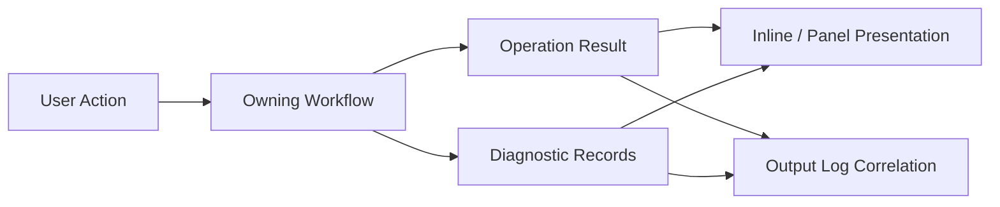

# Diagnostics And Operation Results LLD

Status: `review`

## 1. Purpose

Define the shared V0.1 model for operation results, diagnostics, failure-domain
classification, presentation rules, and log correlation.

The goal is not to replace logs. The goal is to ensure user-triggered editor
workflows produce visible, structured outcomes that explain what happened and
what the user can do next.

## 2. PRD Traceability

| ID | Coverage |
| --- | --- |
| `REQ-022` | Save, sync, project, runtime, and pipeline workflows expose visible results. |
| `REQ-023` | Engine/runtime and pipeline failures produce useful logs. |
| `REQ-024` | Diagnostics identify whether failure is caused by authoring data, missing content, cook output, mount state, sync, or engine runtime state. |
| `SUCCESS-006` | Import, descriptor generation, cook, mount, and standalone load states are visible in later milestones. |
| `SUCCESS-009` | V0.1 acceptance includes visible failure reporting across the workflow. |

## 3. Architecture Links

- `ARCHITECTURE.md` sections 8, 10, 12, 13, 15.
- `DESIGN.md` sections 3, 4, 5, 6.
- `project-workspace-shell.md` for ED-M01 project activation results.
- `project-services.md` for project validation and persistence result sources.
- `runtime-integration.md`, `content-pipeline.md`,
  `standalone-runtime-validation.md`, and feature LLDs for later result
  producers.

## 4. Current Baseline

The current codebase has useful pieces that should be reused:

- Serilog and Microsoft logging are configured during application bootstrap.
- `DroidNet.Controls.OutputConsole` provides a reusable output console and
  `OutputLogBuffer`.
- `Oxygen.Editor.WorldEditor.OutputViewModel` presents the shared log buffer in
  the workspace output panel.
- WinUI first-chance and unhandled exception diagnostics are written to debug
  output.
- `Oxygen.Assets.Import` has import diagnostics and import results.
- Project and runtime services log failures in many code paths.

These are infrastructure assets, not the final user-facing result model. V0.1
should keep the output console and logging pipeline, then add operation results
on top instead of building another unrelated log viewer.

The baseline gaps are architectural:

- There is no shared editor operation-result contract.
- Many user-triggered workflows collapse failure to `bool`, nullable return, or
  exception/log only.
- Logs are technical and chronological; they do not answer whether a specific
  user operation succeeded.
- Output/log panel is available in the workspace but not clearly connected to
  Project Browser startup/open failures.
- Diagnostics from different subsystems use different shapes and severity
  vocabularies.
- There is no correlation ID tying UI result, service logs, and output panel
  entries together.

## 5. Target Design

Every user-triggered workflow produces a top-level operation result. The result
can be success, warning, partial success, cancelled, or failure. Logs remain
available for deep inspection and are correlated to the result.

Target invariants:

1. A user action has at most one top-level operation result.
2. A result may contain multiple diagnostics.
3. A result is user-readable without opening logs.
4. Technical details remain available through correlated logs.
5. Result contracts are UI-independent.
6. Feature UI chooses placement, but not diagnostic vocabulary.
7. Exceptions are adapted into diagnostics at subsystem boundaries.
8. Compound workflows produce child diagnostics, not nested top-level results.
9. Project Browser and workspace panels read from the same host-level result
   store.

## 6. Ownership

| Owner | Responsibility |
| --- | --- |
| owning subsystem | creates result and diagnostics for its own workflow |
| `Oxygen.Core` | shared operation-result and diagnostic contracts |
| `Oxygen.Editor` | host-level result store, publisher, DI composition, and log-correlation setup |
| feature UI | presents workflow-local results near the triggering surface |
| WorldEditor workspace shell | owns V0.1 output/log panel composition and global result affordances |
| Project Browser shell | presents startup/open/create results before workspace exists |
| output/log panel | shows adapted result summaries, correlated technical detail, and history |

This LLD owns common vocabulary and contracts. It does not own every feature's
presentation layout.

Target placement: ED-M01 puts operation-result and diagnostic contracts in
`Oxygen.Core` because Project Browser, WorldEditor, Runtime, Content Browser,
and later pipeline code already need a shared non-UI contract layer. The
host-level store, publisher, and output-log wiring are composed by
`Oxygen.Editor`. Neither the contracts nor host services may depend on feature
UI projects such as `Oxygen.Editor.WorldEditor` or
`Oxygen.Editor.ProjectBrowser`.

## 7. Data Contracts

### Operation Result

Top-level result for one user-triggered workflow.

Required fields:

- `OperationId`: correlation ID.
- `OperationKind`: stable operation name, e.g. `Project.Open`,
  `Scene.Save`, `Content.Cook`.
- `Status`: `Succeeded`, `SucceededWithWarnings`, `PartiallySucceeded`,
  `Failed`, or `Cancelled`.
- `Severity`: maximum diagnostic severity.
- `Title`: short user-facing summary.
- `Message`: actionable user-facing details.
- `StartedAt` and `CompletedAt`, when known.
- `AffectedScope`: project/document/asset/node/component identities.
- `Diagnostics`: ordered child diagnostics.
- `PrimaryAction`: optional action descriptor, not a delegate.

Rules:

- `Status` describes the operation outcome, not the log level.
- `Status` is computed by the status reducer.
- `Severity` is computed from diagnostics.
- `Title` and `Message` must not be raw exception dumps.
- Technical exception details belong in diagnostics and logs.
- Results are immutable after publication.
- Long-running progress is out of ED-M01 scope and must use a separate channel
  if introduced later.
- `AffectedScope` is the primary operation scope. Diagnostics carry narrower
  `AffectedEntity`, `AffectedPath`, or `AffectedVirtualPath` values for
  per-item failures.

### Primary Action

Required fields:

- `ActionId`: stable command identity, e.g. `Project.Open.Retry`.
- `Label`: user-facing label.
- `Kind`: `Retry`, `Remove`, `Browse`, `OpenDetails`, or feature-owned action
  kind.
- optional action payload.

The result model stores the action identity and payload only. UI or workflow
owners resolve the handler.

For inline presentation, the operation result `PrimaryAction` is the primary
button. Diagnostic-level `SuggestedAction` values appear only in details or
per-diagnostic views unless the owning workflow promotes one to
`PrimaryAction`.

### Diagnostic Record

Structured detail under an operation result.

Required fields:

- `DiagnosticId`.
- `OperationId`.
- `Domain`.
- `Severity`: `Info`, `Warning`, `Error`, or `Fatal`.
- `Code`: stable, searchable string.
- `Message`: user-readable explanation.
- `TechnicalMessage`: optional detailed message.
- `ExceptionType`: optional.
- `AffectedPath`: optional filesystem path.
- `AffectedVirtualPath`: optional asset/project path.
- `AffectedEntity`: optional project/document/asset/node/component identity.
- `SuggestedAction`: optional.

`DiagnosticId` is per-instance. `Code` is per-class and feature-prefixed, for
example `OXE.PROJECT.MANIFEST_INVALID`. Diagnostic code prefixes are allocated
centrally by this LLD; individual feature LLDs own their concrete codes under
their assigned prefix.

ED-M03 prefix allocations:

| Prefix | Owner |
| --- | --- |
| `OXE.SCENE.*` | Scene authoring commands and scene explorer layout operations. |
| `OXE.DOCUMENT.*` | Scene document open/save lifecycle. |
| `OXE.LIVESYNC.*` | Command-triggered live scene sync failures. |

ED-M05 prefix allocations:

| Prefix | Owner |
| --- | --- |
| `OXE.MATERIAL.*` | Material editor scalar authoring and material-document validation. |
| `OXE.ASSETID.*` | Content browser / asset picker identity and resolve diagnostics. |
| `OXE.CONTENTPIPELINE.*` | Content-pipeline orchestration diagnostics surfaced by material workflows. |

### Failure Domain

Domains are stable vocabulary, not class names.

| Domain | Active Milestone | Producer |
| --- | --- | --- |
| `ProjectBrowser` | ED-M01 | Project Browser open/create surfaces. |
| `ProjectValidation` | ED-M01 | Project validation service. |
| `ProjectPersistence` | ED-M01 | Project manifest/persistent-state service. |
| `ProjectTemplate` | ED-M01 | Project creation/template service. |
| `ProjectUsage` | ED-M01 | Recent project usage service. |
| `ProjectContentRoots` | ED-M01 | Project content-root validation. |
| `WorkspaceActivation` | ED-M01 | Shell activation coordinator. |
| `WorkspaceRestoration` | ED-M01; reused by ED-M02 | Workspace restoration adapter and restored viewport-layout issues. |
| `Unknown` | ED-M01 | Exception adapters when the narrow domain is not known. |
| `RuntimeDiscovery` | ED-M02 | Workspace activation/runtime startup. |
| `RuntimeSurface` | ED-M02 | Viewport control/runtime surface lease. |
| `RuntimeView` | ED-M02 | Viewport control/runtime view calls. |
| `AssetMount` | ED-M02 | Workspace cooked-root refresh when content availability is affected. |
| `Settings` | ED-M02 | Scene editor runtime settings surface. |
| `ProjectSettings` | ED-M07 | Project-scoped settings for content roots/cook scope. |
| `Document` | ED-M03 | Document save/open workflow. |
| `SceneAuthoring` | ED-M03 | Scene commands/property editing. |
| `LiveSync` | ED-M03 | Live scene sync. |
| `MaterialAuthoring` | ED-M05 | Material editor scalar authoring and descriptor validation. |
| `AssetIdentity` | ED-M05 | Content browser/picker asset identity and resolve state. |
| `ContentPipeline` | ED-M05 material cook slice; expanded ED-M07 | Content pipeline orchestration. |
| `AssetImport` | ED-M05 | Asset import. |
| `AssetCook` | ED-M07 | Cook execution. |
| `StandaloneRuntime` | ED-M08 | Standalone load validation. |

`ProjectSettings` is reserved for project-scoped settings. `Settings` is the
global editor settings domain and is active in ED-M02 for runtime FPS/logging
setting failures.

### Affected Scope

Optional identity bundle:

- project ID/path/name.
- document ID/path/name.
- asset ID/source path/virtual path.
- scene ID/name.
- node ID/name.
- component type/name.

The scope may be partial. The requirement is to include all known facts without
guessing. A single result has one primary affected scope; child diagnostics may
name multiple narrower affected entities.

## 8. Commands, Services, Or Adapters

### Operation Result Publisher

Receives finalized operation results and makes them available to UI consumers.

Required behavior:

- publish current result to interested UI surfaces through
  `IObservable<OperationResult>`.
- retain recent results for output panel/history where configured.
- preserve correlation IDs.
- avoid blocking producer workflows on UI rendering.
- producers may publish from background async workflows; subscribers marshal to
  the UI dispatcher before touching WinUI objects.

### Operation Result Store

Runtime store for current-session operation results and diagnostics.

ED-M01 minimum:

- one host-level singleton `IOperationResultStore`.
- current/recent operation results in memory.
- `IReadOnlyList<OperationResult>` snapshot for panel/history consumers.
- optional project/workspace scope filters for UI presentation.
- output panel/log correlation.
- no database persistence requirement.

Later milestones may persist diagnostic reports if needed.

### Exception Adapter

Converts caught exceptions into diagnostics at subsystem boundaries.

Rules:

- `OperationCanceledException` maps to `Cancelled`, not `Failed`.
- never show raw stack traces as primary user messages.
- preserve exception type and message as technical details.
- choose the narrowest known failure domain.
- attach affected path/entity if known.

### Subsystem Adapters

Adapters map subsystem-native result models into operation results.

Examples:

- project validation result -> `Project.Open` or `Project.Create`.
- asset import result -> `Content.Import`.
- cook result -> `Content.Cook`.
- runtime service failure -> `Runtime.Start`,
  `Runtime.CookedRoot.Refresh`, `Runtime.View.Create`, etc.

### Log Correlation Adapter

Adds `OperationId` or equivalent structured property to logs produced inside a
workflow where practical.

ED-M01 uses `Serilog.Context.LogContext.PushProperty("OperationId", id)` at
operation boundaries where Serilog is available. Microsoft logging scopes may
carry the same property where that is the local logging path.

The adapter starts at operation boundaries. It does not require every existing
log call to be rewritten before ED-M01 can land.

### Output Log Adapter

Operation results are a separate model. They are not `OutputLogEntry` objects.
The output-log adapter writes a structured summary entry into the existing
`OutputLogBuffer` with the `OperationId`, operation kind, status, title, and
message. The workspace output panel can then show result history and correlated
technical logs without owning the operation-result model.

These summary entries are logs. They may persist according to normal logging
configuration, but they are not authoritative operation results. The
`IOperationResultStore` remains the in-memory source for current-session result
state.

## 9. UI Surfaces

### Inline Result

Used near the triggering control.

Required for ED-M01:

- Project Browser open/create failure.
- Project Browser invalid recent project state.
- Project Browser successful activation records a non-blocking success result in
  the host result store and output log adapter. The normal transition to
  workspace is the visible success state.

Expected fields:

- icon/severity.
- title.
- concise message.
- primary action where useful.
- "details" affordance if technical diagnostics exist.

### Status Summary

Used for non-blocking success/warning/partial results in the workspace.

Examples:

- workspace partially restored.
- project opened but last scene missing.

### Output/Log Panel

Workspace output panel shows:

- result summary entries.
- correlated technical log entries.
- diagnostic details.

ED-M01 should use the existing output console infrastructure and define how
operation results appear in or link to that panel.

Project Browser does not need a separate compact output panel in ED-M01. It
uses inline results with details and writes the same operation result into the
host store for later workspace/output-panel inspection.

### Blocking Modal Policy

Blocking dialogs are allowed only when:

- user must choose before proceeding.
- destructive action is possible.
- credentials/permissions are needed.

Routine errors, invalid project files, missing recent projects, partial restore,
and failed opens should be inline or panel-based.

## 10. Persistence And Round Trip

Default V0.1 diagnostics are session state.

Persisted:

- normal logs according to existing logging configuration.
- recent project and workspace state through their owning services.

Not persisted by default:

- operation result history.
- diagnostic record history.

Allowed later extension:

- explicit "save diagnostic report" command.
- crash/startup failure report.
- per-project validation report.

If persisted diagnostics are introduced, they must be append-only reports, not
inputs that drive project behavior.

Operation results and diagnostic records must not be serialized into
`Project.oxy`, scene files, or settings storage.

## 11. Live Sync / Cook / Runtime Behavior

This LLD defines how live sync, cook, mount, runtime, and standalone validation
failures are surfaced. It does not define those workflows.

Required mappings:

- live scene sync failure -> `LiveSync` domain.
- native runtime discovery failure -> `RuntimeDiscovery` domain.
- surface registration/resize failure -> `RuntimeSurface` domain.
- view create/update failure -> `RuntimeView` domain.
- import descriptor failure -> `ContentPipeline` or `AssetImport` domain.
- cook failure -> `AssetCook` domain.
- mount failure -> `AssetMount` domain.
- standalone load validation failure -> `StandaloneRuntime` domain.

Every later LLD must state which operation kinds it emits and which domains it
uses.

ED-M02 producers and operation kinds:

| Producer | Operation Kind | Domain |
| --- | --- | --- |
| workspace activation/runtime startup | `Runtime.Start` | `RuntimeDiscovery` |
| scene editor settings UI | `Runtime.Settings.Apply` | `Settings` |
| viewport control/runtime service | `Runtime.Surface.Attach` | `RuntimeSurface` |
| viewport control/runtime service | `Runtime.Surface.Resize` | `RuntimeSurface` |
| viewport control/runtime service | `Runtime.View.Create` | `RuntimeView` |
| viewport control/runtime service | `Runtime.View.Destroy` | `RuntimeView` |
| viewport control/runtime service | `Runtime.View.SetCameraPreset` | `RuntimeView` |
| scene editor viewport host | `Viewport.Layout.Change` | `WorkspaceRestoration` |
| workspace cooked-root refresh | `Runtime.CookedRoot.Refresh` | `AssetMount` |

ED-M03 producers and operation kinds:

| Producer | Operation Kind | Domain |
| --- | --- | --- |
| scene document command service | `Scene.Node.Create` | `SceneAuthoring` / `LiveSync` |
| scene document command service | `Scene.Node.CreatePrimitive` | `SceneAuthoring` / `LiveSync` |
| scene document command service | `Scene.Node.CreateLight` | `SceneAuthoring` / `LiveSync` |
| scene document command service | `Scene.Node.Rename` | `SceneAuthoring` |
| scene document command service | `Scene.Node.Delete` | `SceneAuthoring` / `LiveSync` |
| scene document command service | `Scene.Node.Reparent` | `SceneAuthoring` / `LiveSync` |
| scene document command service | `Scene.ExplorerFolder.Create` | `SceneAuthoring` |
| scene document command service | `Scene.ExplorerFolder.Rename` | `SceneAuthoring` |
| scene document command service | `Scene.ExplorerFolder.Delete` | `SceneAuthoring` |
| scene document command service | `Scene.ExplorerLayout.MoveNode` | `SceneAuthoring` |
| scene document save workflow | `Scene.Save` | `Document` |

Selection changes are not operation kinds in ED-M03. They are document-scoped
state changes through `ISceneSelectionService`; stale/no-such-node selection
requests may publish diagnostics under `SceneAuthoring` but do not publish
success results.

## 12. Operation Results And Diagnostics

### Status Reduction Rule

The owning workflow reports whether the primary state changed. The shared
status reducer combines that primary-state flag with diagnostics:

- cancellation or `OperationCanceledException`: `Cancelled`.
- no warning/error diagnostics and primary goal completed: `Succeeded`.
- warning diagnostics only and primary goal completed: `SucceededWithWarnings`.
- error/fatal diagnostics and primary goal completed: `PartiallySucceeded`.
- primary goal did not complete: `Failed`.

Fatal diagnostics always produce maximum severity `Fatal`; they do not create a
separate operation status.

Examples:

- project opens, last scene missing: `PartiallySucceeded`.
- project manifest malformed: `Failed`.
- project opens and workspace restores completely: `Succeeded`.
- project opens and a stale content browser folder is ignored with a warning:
  `SucceededWithWarnings`.
- project opens but a requested restoration sub-step fails with an error:
  `PartiallySucceeded`.

### User Message Rules

Messages should:

- describe the concrete failed thing.
- mention the path/name if useful.
- tell the user the next reasonable action.

Messages should not:

- say only "failed".
- expose HRESULTs as the main message.
- require reading logs to understand basic outcome.
- blame implementation details such as a specific class name.

## 13. Dependency Rules

Allowed:

- features depend on diagnostics contracts.
- diagnostics services depend on logging abstractions.
- output panel consumes diagnostics and log entries.
- diagnostics adapters may depend on subsystem result contracts.

Forbidden:

- diagnostics contracts must not depend on WinUI controls.
- diagnostics contracts must not depend on WorldEditor-specific types.
- diagnostics contracts in `Oxygen.Core` must not depend on feature projects
  such as `Oxygen.Editor.WorldEditor`, `Oxygen.Editor.ProjectBrowser`, or
  `Oxygen.Editor.ContentBrowser`.
- host diagnostics services in `Oxygen.Editor` must not depend on feature UI
  projects for their public contracts.
- low-level domain libraries must not depend on feature UI to report errors.
- feature UI must not parse log text to determine operation success.
- operation results must not require native interop types in their public
  managed contract.

## 14. Validation Gates

ED-M01 diagnostics are complete when:

- project open success returns a visible or queryable success result.
- invalid project open shows visible failure with reason.
- create-project failure shows visible failure with reason.
- recent project missing state is visible before or during activation.
- workspace partial restoration emits `PartiallySucceeded` or warning result.
- project activation logs can be correlated with operation result.
- Project Browser remains usable after failed result.

Later milestones must add validation for:

- scene save failure.
- live sync failure.
- cook failure.
- standalone load failure.

ED-M02 diagnostics are complete when:

- runtime startup/discovery failure is visible as `RuntimeDiscovery`.
- surface attach/resize/release failure is visible as `RuntimeSurface` with the
  affected document/viewport where known.
- view create/destroy/preset failure is visible as `RuntimeView` with the
  affected document/viewport where known.
- cooked-root mount failure or missing cooked index is visible as `AssetMount`
  when it affects runtime content availability.
- FPS/logging setting failure is visible as `Settings`.
- output/log entries carry enough document/viewport/runtime state to correlate
  a blank or failed viewport with the failed runtime operation.

ED-M03 diagnostics are complete when:

- scene command failures are visible as `SceneAuthoring` with document and
  node/folder scope where known.
- scene save failures are visible as `Document`.
- command-triggered live-sync failures are visible as `LiveSync` without hiding
  the successful authoring mutation.
- undo/redo failures are visible as `SceneAuthoring` or `Document` depending
  on the failed operation.
- scene explorer invalid operations, such as stale IDs or invalid reparent,
  fail without partial mutation and publish scoped diagnostics.

Straightforward tests should cover:

- `IStatusReducer`: result status and computed severity.
- `IExceptionAdapter`: exception-to-diagnostic mapping, including
  `OperationCanceledException`.
- `IOperationResultPublisher`: UI-independent publication behavior.
- `IOperationResultStore`: snapshot and scope-filter behavior.
- output-log adapter: result summary entry includes `OperationId`.
- failure-domain mapper: ED-M01 project/workspace domains and ED-M02
  runtime/viewport domains where the mapper is touched by the milestone.
- project activation integration is validated through the
  `project-services.md` `IProjectContextService` gates and
  `project-workspace-shell.md` activation-coordinator gates.

UI tests are appropriate for Project Browser inline failure display once ED-M01
implements the surface.

## 15. Open Issues

- Whether long-running progress becomes a separate diagnostics-progress channel
  or a feature-local concern. Progress is out of ED-M01 scope.
- Exact visual treatment for Project Browser "details" expansion. The contract
  requires details to be available; the Project Browser LLD owns placement.
