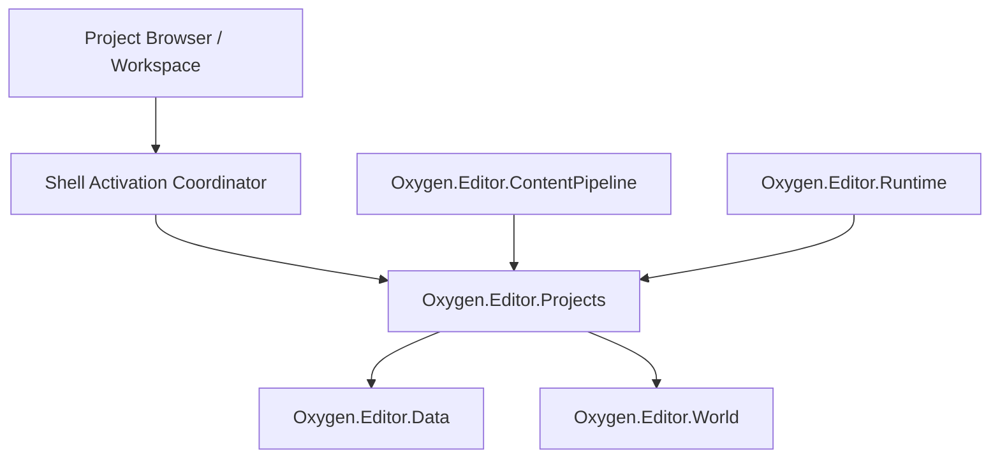

# Project Services LLD

Status: `review`

## 1. Purpose

Define the V0.1 project service layer: project metadata, project validation,
project context, project settings, content roots, recent-project integration,
and project-level cook scope policy.

This LLD owns project facts and policy. It does not own Project Browser UI,
workspace UI, content pipeline execution, engine mounts, or native interop.

## 2. PRD Traceability

| ID | Coverage |
| --- | --- |
| `REQ-002` | Project open/create services support Project Browser workflows and invalid project classification. |
| `REQ-003` | Project state exposes enough persisted context for workspace restoration. |
| `REQ-017` | Project content roots and authoring mounts provide the source identity basis for assets. |
| `REQ-018` | Project policy can identify descriptor/cooked roots for later pipeline milestones. |
| `REQ-019` | Project cook scope is defined as policy, not hardcoded in UI. |
| `REQ-022` | Project workflows return typed results to the caller. |
| `REQ-024` | Project load/save failures expose useful diagnostics. |

## 3. Architecture Links

- `ARCHITECTURE.md` sections 5, 6, 7, 8, 13, 15.
- `DESIGN.md` sections 3, 4.1, 4.5, 5.4.
- `PROJECT-LAYOUT.md` ownership for `Oxygen.Editor.Projects`,
  `Oxygen.Editor.ProjectBrowser`, `Oxygen.Editor.ContentPipeline`,
  `Oxygen.Editor.Data`, `Oxygen.Editor.World`, and `Oxygen.Assets`.
- `project-workspace-shell.md` for activation workflow.
- `content-pipeline.md` for import/cook execution.
- `diagnostics-operation-results.md` for result and diagnostic contracts.

## 4. Current Baseline

Current project behavior is split across:

- `Oxygen.Editor.ProjectBrowser.ProjectBrowserService`: template copy,
  known locations, recent project enumeration, create/open entry points,
  Project Browser settings.
- `Oxygen.Editor.Projects.ProjectManagerService`: loads/saves `Project.oxy`,
  stores `CurrentProject`, loads/saves scenes, creates scenes.
- `Oxygen.Editor.Projects.ProjectInfo`: persisted project metadata including
  stable `Id`, name, category, thumbnail, authoring mounts, and local folder
  mounts.
- `Oxygen.Editor.World.IProject` and `IProjectInfo`: shared project-domain
  abstractions consumed by world editor code.
- `Oxygen.Editor.Data.ProjectUsageService`: recent project records, last opened
  scene, and content browser state.

Baseline strengths:

- Project identity is stable through a GUID.
- Project manifests already persist authoring mounts.
- A default `Content` authoring mount is created when missing.
- Recent project usage exists in persistent state.
- Unit tests already cover key `ProjectManagerService` project/scene load
  paths. They do not yet cover project creation, validation classification,
  recent-project stale-state classification, or active-context replacement.

Baseline gaps:

- Create/open/load APIs return `bool` or nullable objects and lose failure
  classification.
- `ProjectBrowserService` mixes UI-facing workflow orchestration with project
  service calls and recent/template usage updates.
- `ProjectManagerService.SaveSceneAsync` cooks scenes as a side effect through
  `EngineImportDescriptorCooker`; this belongs to `Oxygen.Editor.ContentPipeline`
  in the target architecture.
- Project settings are not clearly separated from global editor settings and
  Project Browser settings.
- Content root validation does not yet produce a first-class project validation
  report.
- Project cook scope is implicit in current save/cook behavior.
- `IProjectManagerService.CurrentProject` is consumed by downstream modules such
  as WorldEditor, Content Browser, and project asset catalog code.

## 5. Target Design

Project services expose a small set of durable project contracts. UI and
workspace modules call these contracts; they do not inspect project storage
directly for policy decisions.

Target invariants:

1. Project services are the only layer that creates or mutates the active
   project context.
2. Project services classify invalid project states and return typed results.
3. Project services own project policy, not project UI.
4. Project services may define cook scope, but content pipeline executes cook.
5. Project services do not call native interop.
6. A project can be validated without activating the workspace.
7. A loaded project has deterministic authoring roots and a deterministic
   cooked root policy.
8. Active project state is exposed through `IProjectContextService`, not through
   mutable `IProjectManagerService.CurrentProject`.

## 6. Ownership

| Owner | Responsibility |
| --- | --- |
| `Oxygen.Editor.Projects` | project metadata, project validation, active project context, future project settings ownership, authoring/local roots, cook scope policy |
| `Oxygen.Editor.ProjectBrowser` | project discovery UX, create/open request UI, recent-project presentation |
| `Oxygen.Editor.Data` | persistent recent usage, per-project restoration hints, settings storage |
| `Oxygen.Editor.World` | shared project and scene-domain abstractions consumed by authoring features |
| `Oxygen.Editor.ContentPipeline` | descriptor generation, import/cook execution, cooked validation |
| `Oxygen.Editor.Runtime` | engine lifecycle and cooked-root mounts based on project policy |

Required cleanup: `ProjectManagerService` currently performs scene cooking.
That is not part of the target project-service responsibility. ED-M01 does not
need to implement the content pipeline, but any project-service work must avoid
adding new cook behavior here. ED-M07 removes or replaces the existing
scene-save cook side effect through `Oxygen.Editor.ContentPipeline`.

Required service split:

- ED-M01 introduces `IProjectContextService` with read-only `ActiveProject`,
  active-project change notification through `IObservable<ProjectContext?>`,
  activation, and close/unload semantics.
- ED-M01 migrates `CurrentProject` consumers to `IProjectContextService`.
- `IProjectManagerService` is not the public active-project API in the target
  design. During ED-M01 it is removed as a cross-project service contract and
  any remaining implementation is internal to `Oxygen.Editor.Projects`
  persistence code.
- Legacy `EnsureDefaultAuthoringMounts` auto-healing is removed from validation
  paths. Missing or invalid manifest mounts must surface as
  `InvalidContentRoots` instead of being silently repaired.
- `SaveSceneAsync` remains migration debt until ED-M03/ED-M07 replaces scene
  save and cook flow. New ED-M01 APIs must not call that method.

## 7. Data Contracts

### Project Manifest

Persisted as `Project.oxy` at project root.

V0.1 required fields:

- `SchemaVersion`: `1`.
- `Id`: non-empty GUID.
- `Name`: non-empty display name.
- `Category`: project category identity.
- `Thumbnail`: optional project-relative path.
- `AuthoringMounts`: persisted project-relative authoring roots.
- `LocalFolderMounts`: persisted absolute local roots.

Rules:

- `AuthoringMounts` must be explicit in V0.1 project manifests created by the
  editor.
- Missing `SchemaVersion` is invalid for V0.1 projects.
- Any schema version other than `1` returns `UnsupportedVersion`.
- Missing or empty `Id` is invalid.
- Missing or empty `Name` is invalid.
- Missing `AuthoringMounts` is invalid for V0.1 projects.
- Missing project manifest is invalid.
- Project `Location` and `LastUsedOn` remain runtime/persistent-state facts and
  are not serialized into `Project.oxy`.

### Project Identity

Project identity is the manifest `Id`. Display name and path are mutable and
must not be used as stable identity.

### Project Validation Result

Classifies a project folder before activation.

Required fields:

- `ProjectLocation`.
- `OperationId`: correlation ID from the project activation operation.
- optional `ProjectId`.
- optional `ProjectName`.
- `State`: `Valid`, `Missing`, `NotAProject`, `InvalidManifest`,
  `UnsupportedVersion`, `Inaccessible`, or `InvalidContentRoots`.
- diagnostics list.
- normalized authoring mounts, when available.
- recovery hints.

Validation state rules:

- `Missing`: the requested project folder path does not exist.
- `Inaccessible`: the folder or manifest exists but cannot be read because of
  permissions, sharing violation, or equivalent access failure.
- `NotAProject`: the folder is readable but does not contain `Project.oxy`.
- `InvalidManifest`: `Project.oxy` is present but malformed, missing required
  fields, or contains invalid field values.
- `UnsupportedVersion`: `SchemaVersion` is present but is not `1`.
- `InvalidContentRoots`: the manifest is otherwise valid, but one or more
  authoring or local folder roots are missing, duplicated, malformed, outside
  the project root when they must be relative, or otherwise unusable.
- `Valid`: manifest and declared roots pass validation.

### Project Context

Created after successful activation.

Required fields:

- project identity.
- project manifest snapshot.
- project root path.
- authoring roots.
- local folder roots.
- cooked root path policy.
- read-only snapshot projection needed by shell consumers, such as scene
  metadata available at activation time. This is not a live `IProject` reference.
- recent project usage identity, when known.

`ProjectInfo.Location` is a runtime project-context field. `LastUsedOn` belongs
to persistent usage state. Neither is serialized into `Project.oxy`.

Project context change notification is about active project replacement and
close/unload. Scene-list, node, and component mutations do not bubble through
`IProjectContextService`; they flow through document/world authoring channels.

### Project Content Root

Represents an authoring root.

Required fields:

- mount name.
- backing path.
- backing kind: project-relative or local absolute.
- exists flag.
- is writable flag, when cheaply known.

Path rules:

- project-relative authoring mount paths are normalized against project root.
- local folder mount paths are normalized as absolute paths.
- identity comparisons use `StringComparer.OrdinalIgnoreCase` for V0.1.
- display preserves the path casing stored in the manifest or selected by the
  user.
- authoring mounts are immutable through ED-M01 UI. Editable project content
  roots require a later project-settings command and validation workflow.

### Project Cook Scope

Policy object consumed by content pipeline.

V0.1 scope fields:

- project identity.
- project root.
- cooked output root.

Cook scope is scaffolded in ED-M01 so workspace/runtime activation can agree on
project cooked-root policy. Full selected roots, descriptor roots, scene/asset
selection, and pipeline execution are owned by `content-pipeline.md` in ED-M07.
Cook scope is a declarative input. It must not perform cooking.

## 8. Commands, Services, Or Adapters

### Project Validation Service

Validates a project path without mutating active project state.

Required behavior:

- verify folder exists and is accessible.
- verify `Project.oxy` exists.
- parse project manifest.
- validate `SchemaVersion`, `Id`, `Name`, and mounts.
- classify failure without throwing to UI.

### Project Context Service

Creates and owns the active project context.

Required behavior:

- activate a validated project.
- clear or replace previous active project only after the new project loads.
- expose current project context as read-only outside project services.
- expose active-project changes through `IObservable<ProjectContext?>`.
- new subscribers immediately receive the current active context or `null`, then
  subsequent replacement/close notifications.
- support explicit close/unload in ED-M01 so workspace close can clear active
  state deterministically.

### Project Creation Service

Creates a new project from a template.

Required behavior:

- validate destination before writing.
- copy template payload.
- create a complete V0.1 manifest with new `Id`, `Name`, and explicit
  authoring mounts.
- validate the created project before activation.
- clean up only files it created if creation fails before activation.

### Recent Project Adapter

Owns integration with `Oxygen.Editor.Data.ProjectUsageService`.

Required behavior:

- is called by the Shell Activation Coordinator after activation succeeds.
- update recent project only after project activation succeeds.
- preserve last opened scene and content browser state.
- classify stale recent projects during enumeration.
- keep stale entries visible until the user dismisses/removes them or a visible
  result explains their removal.

### Project Cook Scope Provider

Owns project policy for content pipeline inputs.

ED-M01 scope:

- expose project roots and default `.cooked` location as policy.
- do not execute cook.

ED-M07 scope:

- full cook scope details and content pipeline handoff.

## 9. UI Surfaces

Project services own no UI.

Consumers are described by their owning LLDs:

- Project Browser and workspace activation: `project-workspace-shell.md`.
- Settings UI: `settings-architecture.md`.
- Content Browser and asset identity: `content-browser-asset-identity.md`.

Project services must return enough structured data for UI consumers to render
states without parsing exception messages.

## 10. Persistence And Round Trip

### Project Manifest Round Trip

Loading and saving `Project.oxy` must preserve:

- schema version.
- project `Id`.
- project `Name`.
- category.
- thumbnail.
- authoring mounts.
- local folder mounts.

The V0.1 editor owns the manifest it writes. Unknown fields are not part of the
V0.1 contract. If future schema evolution requires extensions, the project
manifest schema must make that explicit.

### Persistent State Round Trip

Persistent editor state stores:

- recent project usage.
- times opened.
- last used date.
- last opened scene.
- content browser state.
- later, workspace layout state where applicable.

Persistent state must not become the source of truth for project manifest
fields.

### Content Roots

Authoring mounts are project facts. Cooked roots are derived policy:

- default cooked root: `<ProjectRoot>/.cooked`.
- content payload root and index structure are owned by content pipeline and
  asset primitives.

## 11. Live Sync / Cook / Runtime Behavior

Project services provide facts to runtime and pipeline services:

- `ProjectContext` provides project identity, project root, authoring roots,
  local folder roots, and cooked-root policy to workspace/runtime consumers.
- `ProjectCookScope` provides the minimal ED-M01 cook-scope record: project
  identity, project root, and cooked output root.

Project services do not:

- start the engine.
- mount cooked roots.
- import assets.
- write cooked indexes.
- call native interop.

The current scene-save cook side effect is migration debt. New project-service
work must not expand it. Content pipeline work owns the replacement.

## 12. Operation Results And Diagnostics

Project service operations return typed operation results or project-specific
result records that can be adapted to operation results.

ED-M01 active result domains:

- `ProjectValidation`.
- `ProjectPersistence`.
- `ProjectTemplate`.
- `ProjectUsage`.
- `ProjectContentRoots`.

Reserved result domain:

- `ProjectSettings` for ED-M04 project-scoped settings work.

Required diagnostics:

- path involved.
- manifest file path, when relevant.
- exception type and message for technical details.
- user-facing summary.
- recovery hint, where known.

Examples:

- missing project folder: "Project folder no longer exists."
- missing manifest: "The selected folder is not an Oxygen project."
- malformed manifest: "Project.oxy is invalid."
- inaccessible path: "The editor cannot access this project folder."
- template copy failure: "Project creation failed while copying template
  files."

## 13. Dependency Rules

Allowed:

- `Oxygen.Editor.ProjectBrowser` may depend on project services contracts.
- `Oxygen.Editor.WorldEditor` may consume current project context.
- `Oxygen.Editor.ContentPipeline` may consume project cook scope policy.
- `Oxygen.Editor.Runtime` may consume project cooked-root policy.
- `Oxygen.Editor.Projects` may depend on `Oxygen.Editor.Data` for project
  persistent state and `Oxygen.Editor.World` for project domain abstractions.

Forbidden:

- `Oxygen.Editor.Projects` must not depend on Project Browser UI.
- `Oxygen.Editor.Projects` must not depend on WorldEditor UI.
- `Oxygen.Editor.Projects` must not depend on native interop.
- `Oxygen.Editor.Projects` must not depend on `Oxygen.Editor.ContentPipeline`.
- `Oxygen.Editor.Projects` must not execute content pipeline operations as new
  behavior.
- Project services must not read WinUI controls, routes, or window objects.

## 14. Validation Gates

ED-M01 project services are complete when:

- valid `Project.oxy` validates without activating workspace.
- missing folder is classified as missing.
- folder without `Project.oxy` is classified as not a project.
- malformed `Project.oxy` is classified as invalid manifest.
- unsupported `SchemaVersion` is classified as unsupported version.
- missing authoring mounts are classified as invalid for V0.1 projects.
- missing or inaccessible authoring roots are classified as invalid content
  roots.
- project activation sets active project only after validation/load succeeds.
- failed activation leaves previous active project unchanged.
- recent project usage updates only after successful activation.
- Project Browser can show failure reason without parsing logs.
- project services expose project root and authoring roots for workspace
  activation.
- `CurrentProject` consumers are migrated to `IProjectContextService`.
- Content Browser and project asset catalog resolve project state from
  `IProjectContextService`, not `IProjectManagerService`.

Straightforward unit tests should cover:

- `ProjectValidationService`: valid manifest, missing folder, missing manifest,
  malformed manifest, unsupported version, invalid content roots.
- `ProjectContextService`: active-project replacement semantics, close/unload,
  and `IObservable<ProjectContext?>` change notification.
- `RecentProjectAdapter`: update ordering and stale project classification.
- `ProjectCookScopeProvider`: project root and cooked output root policy.

## 15. Open Issues

- Exact visual treatment for stale recent-project rows is owned by
  `project-workspace-shell.md` and Project Browser UI. Project services keep the
  classification stable and do not remove stale entries implicitly.
