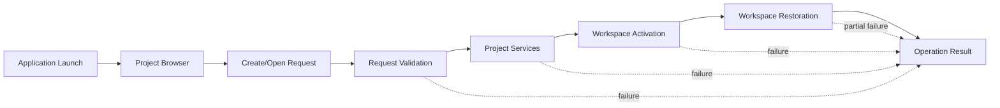
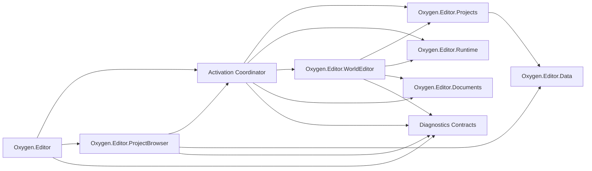

# Project Workspace Shell LLD

Status: `review`

## 1. Purpose

Define the V0.1 startup and project activation shell: Project Browser first,
project create/open workflows, workspace window activation, workspace
restoration, and visible failure behavior.

This LLD owns the user-facing flow across Project Browser and workspace shell
boundaries. It does not own project metadata policy, editor runtime internals,
scene documents, or content pipeline execution.

## 2. PRD Traceability

| ID | Coverage |
| --- | --- |
| `REQ-001` | Project Browser is always the first visible editor experience on normal launch. |
| `REQ-002` | Recent projects, create/open project, invalid project state, and transition to workspace. |
| `REQ-003` | Workspace and recent document/layout restoration after project activation, with visible partial failure. |
| `REQ-022` | User-triggered project workflows expose success/failure results. |
| `REQ-024` | Open/create failures are not silent log-only failures. |
| `SUCCESS-001` | V0.1 starts from Project Browser and reaches an authoring workspace without manual file edits. |

## 3. Architecture Links

- `ARCHITECTURE.md` sections 6, 7, 8, 10, 13, 15.
- `DESIGN.md` sections 3, 4.1, 5.
- `PROJECT-LAYOUT.md` ownership for `Oxygen.Editor`,
  `Oxygen.Editor.ProjectBrowser`, `Oxygen.Editor.Projects`,
  `Oxygen.Editor.Runtime`, `Oxygen.Editor.Documents`, and
  `Oxygen.Editor.Routing`.
- `diagnostics-operation-results.md` for operation result shape and
  presentation rules.
- `project-services.md` for project metadata, content roots, and validation.

## 4. Current Baseline

The current editor already has several pieces worth keeping:

- `Oxygen.Editor.App` starts normal launch by navigating to `/pb/home` in a
  `wnd-pb` window.
- `Oxygen.Editor.ProjectBrowser` provides Home, New, and Open surfaces.
- Project Browser view models call `IProjectBrowserService` and then navigate
  to `/we` in `wnd-we` with target replacement.
- `Oxygen.Editor.Projects.ProjectManagerService` holds the current project in
  memory.
- `Oxygen.Editor.WorldEditor.WorkspaceViewModel` creates the workspace child
  container, workspace routes, initial dock layout, and cooked-root refresh.
- `WindowPlacementService` restores and saves placement keyed by route URL.

The baseline is not yet V0.1-ready:

- Project create/open service calls return `bool`, so failure reason, failure
  domain, and recommended recovery are lost at the UI boundary.
- Several preload and activation failures are logged but not visible in the
  Project Browser.
- Project Browser view models own direct navigation to `/we`, which makes
  workflow ordering hard to audit.
- Engine startup currently happens during application launch before a project
  is selected: `App.OnLaunched` calls `EnsureEngineIsReady`, which initializes
  and starts `IEngineService` before routing to `/pb/home`. That makes Project
  Browser startup depend on runtime health and must be removed from the clean
  ED-M01 flow. Native runtime directory discovery in `Program.Main` can remain
  bootstrap infrastructure.
- Workspace restoration is implicit in route/window services; it is not
  represented as an operation with partial-failure diagnostics.
- Project creation currently mixes template copy, manifest patching, project
  load, recent-project update, and template usage update in one boolean-return
  workflow.
- `WorkspaceViewModel` currently reads `projectManager.CurrentProject`, builds
  the world-editor child container, applies the initial dock route, and refreshes
  cooked roots during navigation. ED-M01 must move project activation and
  restoration ordering above that workspace composition.

ED-M01 replaces these target-architecture violations instead of preserving
compatibility shims:

- `IProjectBrowserService.OpenProjectAsync(IProjectInfo)`.
- `IProjectBrowserService.OpenProjectAsync(string)`.
- `IProjectBrowserService.NewProjectFromTemplate(...)`.

`IProjectBrowserService` is narrowed to Project Browser support services such
as known locations, templates, settings, and recent-project presentation. It no
longer owns open/create activation.

## 5. Target Design

Project activation is a staged workflow with one shell-owned coordinator. The
coordinator receives a create/open request from Project Browser, calls project
services, runs workspace activation, requests workspace restoration, and
publishes one operation result.

The Project Browser is engine-independent. Native runtime directory discovery
belongs to process bootstrap. Engine startup, surface creation, cooked-root
mounts, and scene sync happen only after a project context exists and the
workspace/runtime path needs them.

Target invariants:

1. The Project Browser is always reachable and is the first visible route on
   normal launch.
2. Opening or creating a project does not navigate to the workspace until a
   valid active project context exists.
3. Navigation to workspace is owned by a shell-level activation workflow, not
   scattered across individual Project Browser controls.
4. Workspace restoration is best effort. Critical project activation failure
   blocks workspace entry; non-critical restoration failure allows entry and is
   visible.
5. Project Browser remains usable after a failed open/create attempt.
6. Closing a workspace does not corrupt the active project record or recent
   project state.
7. A failed workspace activation after window creation closes the partially
   created workspace window and returns the visible result to Project Browser.

## 6. Ownership

| Owner | Responsibility |
| --- | --- |
| `Oxygen.Editor` | application bootstrap, Project Browser startup route, shell-level project activation workflow, workspace window activation, native runtime discovery failure routing |
| `Oxygen.Editor.ProjectBrowser` | Project Browser pages, create/open/recent-project UX, request construction, inline project workflow result presentation |
| `Oxygen.Editor.Projects` | project load/create validation and project context creation; no workspace UI and no native interop |
| `Oxygen.Editor.Runtime` | runtime lifecycle and mount preparation requested after workspace activation; no Project Browser UI and no startup dependency for Project Browser |
| `Oxygen.Editor.WorldEditor` | workspace composition, initial workspace routes, dock layout, world-editor child container |
| `Oxygen.Editor.Documents` | recent document restoration contract once a project workspace exists |
| `Oxygen.Editor.Data` | persistent recent project, layout, placement, and workspace-restoration records |
| `diagnostics services` | operation result publication, aggregation, and output/log panel correlation |

## 7. Data Contracts

### Project Activation Request

Represents a user intent from the Project Browser.

Required fields:

- `Mode`: `OpenExisting` or `CreateFromTemplate`.
- `CorrelationId`: stable ID for diagnostics and log correlation.
- `RequestedAt`: timestamp.
- `SourceSurface`: diagnostic-only value identifying the originating Project
  Browser surface: `Home`, `Open`, or `New`.

Open-existing fields:

- `ProjectLocation`.
- Optional `RecentEntryId` from recent project state. This is a recents hint,
  not project identity.

Create-from-template fields:

- `TemplateId` or template location.
- `ProjectName`.
- `ParentLocation`.

### Project Activation Context

Shell-side wrapper created only after project services accept the request. It
references the project-services-owned `ProjectContext`; it does not copy or
fork project facts into a parallel shell model.

Required fields:

- project identity.
- project display name.
- project root path.
- project usage record identity when available.
- project-services-owned project context handle.
- workspace restoration request.

The shell may read identity and display fields for routing and diagnostics. It
must not copy authoring mounts or content-root policy out of the project
context.

### Workspace Restoration Request

Describes restore work after project context exists.

Required fields:

- project identity.
- last workspace route/layout, if any.
- last opened documents, if any.
- window placement key.
- content browser state, if any.

### Workspace Restoration Result

Classifies restoration as:

- `None`: no previous state exists.
- `Complete`: all requested state restored.
- `Partial`: workspace opened, but one or more restore items failed.
- `Failed`: restoration failed before workspace could be shown.

Rules:

- `Failed` blocks workspace entry and closes any partially created workspace
  window.
- `Partial` allows workspace entry and aggregates per-item restore failures into
  the top-level project activation result.
- Each failed restore item also emits a diagnostic record so the output/log
  panel can show details.
- Dock-layout failure is `Partial` when the default workspace layout can be
  shown. If the workspace shell is already created and then found unusable, the
  result is `Failed` and the partially created workspace window is closed.

## 8. Commands, Services, Or Adapters

### Shell Activation Coordinator

Host-level shell service owned by `Oxygen.Editor`. The coordinator survives the
Project Browser to workspace window transition and is reused for each activation
attempt.

Responsibilities:

- accept `ProjectActivationRequest`.
- validate request shape before touching project state.
- call project services to create/load project context.
- invoke Project Creation Service for create-from-template requests and then
  activate the created project in the same workflow.
- update recent project/template usage only after successful project context
  creation.
- navigate from Project Browser to workspace.
- request workspace restoration.
- emit one operation result for the complete workflow.

The coordinator returns a typed operation result, not `bool`.

The coordinator owns recent-project updates. Project Browser view models and
project services do not update recent usage during open/create activation.

### Threading And Cancellation

Activation is asynchronous and cancellable.

Rules:

- file I/O and project validation run asynchronously off the UI-critical path.
- UI dispatcher access is limited to Project Browser state updates, window
  navigation, and result publication to UI-bound stores.
- each activation request carries a cancellation token.
- closing the Project Browser during activation cancels the workflow before
  workspace navigation starts.
- cancellation before project context creation leaves active project state
  unchanged.
- cancellation after workspace window creation closes the partially created
  workspace window and returns a `Cancelled` result where the originating UI
  still exists.
- only one activation attempt can be in progress per host process unless a
  later multi-project design explicitly changes this.

### Project Browser View Models

Project Browser view models construct requests and present results. They do
not decide final workspace navigation once the coordinator exists.

Allowed state:

- currently selected template/recent project/folder.
- local loading state.
- latest operation result for inline presentation.

Disallowed state:

- current project object.
- workspace router details beyond invoking the shell activation coordinator.
- engine service state.
- direct calls to project open/create boolean APIs.

### Workspace Activation Adapter

Owned by shell/workspace boundary.

Responsibilities:

- create or reuse a workspace window.
- activate `/we` only after project services have committed the project context.
- pass a project activation context reference through navigation state or a
  host service that `WorkspaceViewModel` consumes during initialization.
- ensure `WorkspaceViewModel` does not infer activation from a mutable global
  `CurrentProject` before the coordinator commits the context.
- let the workspace build its child container and initial dock route after the
  activation context is available.
- keep Project Browser open on activation failure.
- close a partially created workspace window if activation cannot produce a
  usable workspace shell.

### Workspace Restoration Adapter

Owned by workspace shell and document services.

Responsibilities:

- restore dock layout, content browser state, document tabs, and last selected
  document where possible.
- report partial restore failures as diagnostics.
- never silently discard stored restore data when it fails to apply.

## 9. UI Surfaces

### Project Browser

Project Browser remains a real app surface, not a transient splash screen.

Required V0.1 states:

- empty or loading recent project list.
- recent project available.
- recent project missing/invalid.
- create project validation error.
- create/open in progress.
- create/open failed with visible reason.
- create/open succeeded and workspace transition in progress.

The failed state must keep the user on the Project Browser and allow retry.

### Workspace Activation Failure

If activation fails before workspace navigation, the failure appears in Project
Browser near the attempted operation and in the output/log panel if available.

If activation fails after workspace window creation but before workspace is
usable, the partially created workspace window is closed. The result is
presented in Project Browser. ED-M01 does not introduce a workspace failure
pane for this path.

### Partial Restoration Notice

Partial restore failures are non-blocking notifications. They should be visible
without modal interruption unless the user needs to choose between destructive
recovery paths.

Examples:

- last opened scene no longer exists.
- saved dock layout references a removed pane.
- content browser folder selection points to a missing folder.

## 10. Persistence And Round Trip

Persistent shell state:

- recent projects.
- last opened scene/document per project.
- content browser state per project.
- workspace route/layout state per project.
- Project Browser settings such as last save location and open-view columns.
- window placement through `WindowPlacementService` using a stable shell
  route/window-category key.

Round-trip rules:

1. Recent project entries are updated only after a project is successfully
   loaded or created.
2. Missing recent projects are shown as invalid/stale until the user retries,
   browses to a new location, or removes the entry explicitly.
3. Workspace restore data is versioned or guarded so stale layouts do not crash
   workspace activation.
4. Partial restoration does not overwrite the previous restore record until the
   workspace reaches a stable state.

## 11. Live Sync / Cook / Runtime Behavior

Project workspace shell does not cook assets and does not call native interop.

Runtime involvement in ED-M01 is limited to readiness policy:

- native runtime directory discovery remains process-bootstrap infrastructure.
- engine startup is not part of Project Browser launch.
- runtime startup is triggered by `runtime-integration.md` through the managed
  runtime readiness service when the workspace first needs runtime behavior,
  such as surface/view creation or cooked-root mount. The workspace activation
  adapter may request that readiness step after project context exists; it does
  not call native interop or start the engine directly.
- runtime mount behavior belongs to `runtime-integration.md` and
  `content-pipeline.md`; shell only requests the workspace activation sequence
  that will later trigger those services.

ED-M01 should remove any hard dependency that makes Project Browser launch fail
because the embedded engine cannot start. Runtime failures remain visible, but
they belong to workspace/runtime workflows, not no-project startup.

## 12. Operation Results And Diagnostics

Project activation emits one top-level operation result with child diagnostics
for each stage:

1. request validation.
2. project create/load.
3. recent usage update.
4. workspace navigation.
5. workspace restoration.

Required failure domains:

- `ProjectBrowser`.
- `ProjectValidation`.
- `ProjectPersistence`.
- `ProjectTemplate`.
- `ProjectUsage`.
- `ProjectContentRoots`.
- `WorkspaceActivation`.
- `WorkspaceRestoration`.

The top-level result must answer:

- Did the project become active?
- Did the workspace open?
- Was restoration complete, partial, or skipped?
- What can the user do next?

V0.1 primary actions for activation results:

- `Retry`: repeat the same request.
- `RemoveRecentProject`: remove an invalid or missing recent-project entry.
- `Browse`: choose a different project folder.
- `OpenDetails`: show diagnostics/log details.

## 13. Dependency Rules

Allowed dependency direction:

Forbidden:

- `Oxygen.Editor.ProjectBrowser` must not depend on `Oxygen.Editor.WorldEditor`.
- `Oxygen.Editor.ProjectBrowser` must not reference
  `Oxygen.Editor.WorldEditor` at the project/MSBuild level.
- `Oxygen.Editor.Projects` must not depend on Project Browser UI,
  WorldEditor UI, Runtime UI/lifecycle, or native interop.
- Feature view models must not call native interop directly.
- Workspace activation must not rely on mutable global project state before
  project services have completed the project activation context.

## 14. Validation Gates

ED-M01 is complete when:

- normal launch opens Project Browser first.
- recent project list loads without blocking the UI.
- missing/invalid recent project produces visible state.
- valid recent project opens the workspace.
- valid project selected from Open opens the workspace.
- valid project created from template opens the workspace.
- failed create/open stays in Project Browser and shows a reason.
- Project Browser launch does not initialize or start the embedded engine.
- Project Browser launch path does not inject, reference, or transitively depend
  on `IEngineService`.
- workspace route and window placement restoration run after project activation.
- partial restoration failure is visible and non-fatal.
- no Project Browser project reference depends on WorldEditor internals.
- project activation emits operation results with log correlation.
- cancellation before workspace navigation leaves active project state unchanged.
- half-created workspace failure closes the workspace window and reports the
  result in Project Browser.

Straightforward tests should cover project activation coordinator behavior,
stage ordering, recent-update guarding, create-then-activate behavior,
project result mapping, invalid project classification, restoration result
classification, cancellation, and half-created workspace cleanup. UI automation
should be added where the existing WinUI test infrastructure makes startup-route
validation practical.

## 15. Open Issues

- Exact workspace layout persistence format and versioning are owned by the
  workspace/document LLDs but must be consumable by this flow.
- Mid-session project switching behavior is out of ED-M01 unless explicitly
  pulled forward. V0.1 starts with one active workspace per host process.
