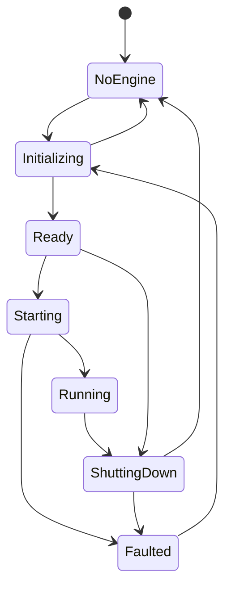

# Runtime Integration LLD

Status: `review`

## 1. Purpose

Define the managed boundary between the WinUI editor and the embedded Oxygen
Engine runtime for ED-M02. This LLD covers runtime lifecycle, native runtime
discovery assumptions, runtime settings, surface leases, engine view lifecycle,
cooked-root mounts, threading, and the validation evidence needed before live
viewport behavior can support later authoring milestones.

This is not the LLD for scene synchronization, content cooking, standalone
runtime validation, or viewport authoring tools. Those later milestones consume
the runtime contracts defined here.

## 2. PRD Traceability

| ID | Coverage |
| --- | --- |
| `REQ-022` | Runtime, surface, view, and settings failures must be visible. |
| `REQ-023` | Runtime diagnostics identify the affected project/document/viewport where known. |
| `REQ-024` | Runtime failures are not log-only. |
| `REQ-025` | Embedded viewport renders the active scene through the live engine. |
| `REQ-027` | Runtime startup and viewport creation are explicit editor workflows. |
| `REQ-028` | Surface/view lifecycle supports one/two/four viewport layouts. |
| `REQ-035` | Runtime settings such as FPS/logging are applied or visibly rejected. |
| `SUCCESS-003` | Live editor viewport presents correctly. |
| `SUCCESS-005` | Runtime presentation is stable enough for later authoring validation. |

## 3. Architecture Links

- `ARCHITECTURE.md`: runtime boundary, threading/frame phases, dependency
  direction, and diagnostics policy.
- `DESIGN.md`: runtime integration LLD ownership and cross-LLD workflow chains.
- `PROJECT-LAYOUT.md`: `Oxygen.Editor.Runtime` owns the managed runtime service;
  `Oxygen.Editor.Interop` owns the C++/CLI bridge.
- `viewport-and-tools.md`: viewport UI consumes this LLD's runtime service and
  surface/view contracts.
- `diagnostics-operation-results.md`: runtime failure domains and operation
  result vocabulary.

## 4. Current Baseline

The current codebase has the core runtime pieces needed for ED-M02:

- `Oxygen.Editor.Runtime` exposes `IEngineService` and `EngineService`.
- `EngineServiceState` models `NoEngine`, `Initializing`, `Ready`, `Starting`,
  `Running`, `ShuttingDown`, and `Faulted`.
- Native runtime discovery is process bootstrap infrastructure, not a Project
  Browser responsibility. The editor now defers engine startup until workspace
  activation/runtime use.
- `WorkspaceViewModel` starts the engine before cooked-root refresh and mounts
  cooked roots from `.cooked/container.index.bin`, with legacy per-mount index
  fallback.
- `IEngineSettings` and `EngineSettingsService` provide startup settings.
  `EngineSettingsExtensions` maps them to the interop engine configuration.
- `IEngineService.TargetFps`, `MaxTargetFps`, and `EngineLoggingVerbosity`
  expose runtime-adjustable settings once the engine is ready/running.
- `ViewportSurfaceRequest`, `ViewportSurfaceKey`, and `IViewportSurfaceLease`
  model logical viewport-to-surface ownership.
- `Viewport.xaml.cs` attaches a `SwapChainPanel` through
  `IEngineService.AttachViewportAsync`, creates a native editor view, resizes
  the surface, and destroys the view before disposing the lease.
- `EngineService` tracks active leases, per-document surface limits, and
  blacklisted/orphaned viewport IDs when native cleanup fails.

Known ED-M02 gaps:

- Runtime operations mostly log failures; they do not consistently publish
  operation results.
- Attach/create/resize completion means "accepted by the managed/native
  boundary", not "a frame has visibly presented"; validation must use visual
  evidence and logs.
- Engine startup is owned by workspace activation today. ED-M02 must make that
  ownership explicit and ensure workspace code does not call mount/surface
  operations before `Running`.
- Surface and view ownership is split between `Oxygen.Editor.Runtime` and
  WorldEditor viewport code. ED-M02 accepts this split but documents the
  invariants that must hold.

## 5. Target Design

ED-M02 target flow:

Target invariants:

1. Project Browser does not start the engine.
2. Workspace activation is the first normal runtime startup trigger.
3. Cooked-root mount, surface attach, resize, view create, and view destroy
   require `EngineServiceState.Running`.
4. Runtime settings may be read/applied only in `Ready` or `Running` states.
5. Feature UI depends on `Oxygen.Editor.Runtime`, not on interop classes except
   for narrow existing view configuration structs until wrapper contracts exist.
6. A surface lease owns the native composition surface reservation for one
   `(document, viewport)` key.
7. An engine view is associated with exactly one viewport surface target while
   it is visible.
8. Disposing a viewport destroys its engine view before releasing the surface
   lease.
9. Native registration failure, cleanup failure, or orphaned viewport IDs must
   not poison future unrelated viewports.
10. UI code must not synchronously block on native frame progress.

## 6. Ownership

| Owner | Responsibility |
| --- | --- |
| `Oxygen.Editor` | Process bootstrap, DI composition, native runtime discovery setup. |
| `Oxygen.Editor.WorldEditor` workspace | Runtime startup trigger during workspace activation; cooked-root refresh request. |
| `Oxygen.Editor.WorldEditor` viewport UI | `SwapChainPanel` ownership, load/unload/size events, initial measured size, engine view request timing. |
| `Oxygen.Editor.Runtime` | Engine lifecycle, settings bridge, surface leases, view calls, input bridge access, runtime diagnostics mapping. |
| `Oxygen.Editor.Interop` | Managed/native bridge calls and native handle abstractions. |
| Oxygen Engine | Frame loop, rendering, content loading, composition, native resource ownership. |

ED-M02 accepts that viewport UI currently creates engine views directly after
surface attachment. Later runtime cleanup may wrap view lifecycle more tightly
inside `Oxygen.Editor.Runtime`, but the ED-M02 invariant is that all native
calls still pass through `IEngineService`.

## 7. Data Contracts

### Runtime State

`EngineServiceState` is the authoritative lifecycle state exposed to managed
editor code.

Allowed ED-M02 transitions:

Rules:

- `InitializeAsync` is idempotent outside transient states.
- `StartAsync` is idempotent for `Starting`/`Running`.
- `ShutdownAsync` is not cancellable and must not run during initialization or
  startup.
- Failed startup transitions to `Faulted`; retry requires re-initialization.

### Runtime Settings Snapshot

Settings inputs:

- startup `IEngineSettings` mapped into editor engine config during
  initialization.
- runtime `TargetFps`.
- runtime native logging verbosity.

Rules:

- Startup settings apply only when a new engine context is created.
- Runtime FPS/logging writes are immediate service calls and may fail if the
  engine is not `Ready`/`Running`.
- Failed settings writes must produce a visible diagnostic in ED-M02 validation.

### Surface Lease

`ViewportSurfaceRequest` contains:

- document ID.
- viewport ID.
- viewport index.
- primary viewport flag.
- optional diagnostic tag.

`ViewportSurfaceKey` is `(DocumentId, ViewportId)`.

`IViewportSurfaceLease` provides:

- `Key`.
- `IsAttached`.
- `AttachAsync`.
- `ResizeAsync`.
- `DisposeAsync`.

Rules:

- A lease is the only managed object allowed to resize or release its native
  surface.
- Re-attaching an already attached lease is a no-op.
- A failed attach removes the reservation when possible.
- A failed native unregister marks the viewport ID orphaned so it is not reused.
- Surface limits are enforced before native registration.

### Engine View

Current ED-M02 view contract:

- Viewport UI creates a view after a surface lease is attached.
- The view config includes name, purpose, compositing target viewport ID,
  initial pixel size, and clear color.
- The native engine returns an engine view ID.
- Viewport UI stores the assigned view ID and destroys it before lease disposal.

Rules:

- No view creation before a surface target exists.
- No view creation before the scene is loaded into the engine.
- A failed view creation must leave the surface lease disposable.
- Destroy failures are logged and surfaced through diagnostics where possible,
  but must not prevent control teardown.

### Cooked Root Mount

ED-M02 mount contract:

- Workspace activation requests cooked-root refresh after runtime is running.
- The preferred mount is the project `.cooked` root when
  `.cooked/container.index.bin` exists.
- Legacy `.cooked/<MountPoint>/container.index.bin` roots are fallback only.
- Missing cooked roots are non-fatal for workspace entry but must be visible in
  logs/diagnostics because assets may not resolve.

## 8. Commands, Services, Or Adapters

ED-M02 service operations:

| Operation | Owner | Completion Meaning |
| --- | --- | --- |
| Runtime initialize | `IEngineService.InitializeAsync` | Engine context created and service is `Ready`. |
| Runtime start | `IEngineService.StartAsync` | Frame loop startup call returned and service is `Running`. |
| Runtime shutdown | `IEngineService.ShutdownAsync` | Engine resources released or service faulted. |
| Apply startup settings | `EngineSettingsExtensions` | Settings copied into config before context creation. |
| Apply FPS/logging | `IEngineService` properties | Native service accepted the value. |
| Attach surface | `AttachViewportAsync` | Native surface registration completed and lease is attached. |
| Resize surface | `IViewportSurfaceLease.ResizeAsync` | Native resize request accepted/queued. |
| Create/destroy view | `CreateViewAsync` / `DestroyViewAsync` | Native view operation returned success or failure. |
| Mount cooked root | `MountProjectCookedRoot` | Engine world accepted the root. |

Frame-presented completion is not exposed as a managed contract in ED-M02. The
detailed ED-M02 validation plan must therefore use visual validation and engine
logs to prove presentation.

## 9. UI Surfaces

ED-M02 runtime UI surfaces:

- Project Browser: no runtime UI; startup failures must not block Project
  Browser visibility.
- Workspace shell: owns the "runtime is starting / failed / cooked roots
  missing" user-visible state.
- Viewport control: owns surface attach/resize failure presentation near the
  viewport when possible.
- Scene editor toolbar/settings surface: owns runtime FPS/logging controls.
- Output/log panel: shows runtime diagnostic details and correlated operation
  result summaries.

## 10. Persistence And Round Trip

Persisted:

- runtime/editor settings through settings services.
- scene document viewport layout metadata through document metadata.
- workspace layout through workspace/persistent state services.

Not persisted:

- engine service state.
- active surface leases.
- native engine view IDs.
- mounted cooked roots.

On restart, workspace/project activation recreates runtime state from project
context, settings, document metadata, and cooked roots.

## 11. Live Sync / Cook / Runtime Behavior

ED-M02 covers runtime readiness and presentation only.

Later consumers:

- `live-engine-sync.md` consumes `Running` state and frame-phase ordering for
  scene mutation sync.
- `content-pipeline.md` consumes cooked-root mount behavior after cook.
- `standalone-runtime-validation.md` consumes runtime/cooked parity evidence.
- `viewport-and-tools.md` consumes surface/view contracts for layout and
  camera validation.

ED-M02 must not add authoring-specific scene mutation semantics here.

## 12. Operation Results And Diagnostics

ED-M02 operation kinds:

- `Runtime.Start`.
- `Runtime.Settings.Apply`.
- `Runtime.Surface.Attach`.
- `Runtime.Surface.Resize`.
- `Runtime.View.Create`.
- `Runtime.View.Destroy`.
- `Runtime.CookedRoot.Mount`.

Failure domains:

- `RuntimeDiscovery` for native DLL/path discovery.
- `RuntimeSurface` for surface attach/resize/release.
- `RuntimeView` for engine view create/destroy/preset failures.
- `AssetMount` for cooked-root mount failures.
- `Settings` for global runtime settings failures.

Minimum ED-M02 rule:

- failures that block visible viewport presentation must produce a visible
  user-facing diagnostic, not only a debug trace.
- non-fatal missing cooked roots may be warning diagnostics.
- teardown failures may be log-only when the UI surface is already being
  destroyed, but must be visible in output/log diagnostics.

## 13. Dependency Rules

Allowed:

- `Oxygen.Editor.WorldEditor` depends on `Oxygen.Editor.Runtime`.
- `Oxygen.Editor.Runtime` depends on `Oxygen.Editor.Interop`.
- `Oxygen.Editor.Runtime` depends on DroidNet hosting/settings abstractions.
- Runtime contracts may use WinUI `SwapChainPanel` while surface attachment is
  explicitly a WinUI integration point.

Forbidden:

- Project Browser must not depend on `IEngineService`.
- Feature UI must not call `Oxygen.Editor.Interop` directly for runtime engine
  operations.
- Runtime services must not depend on WorldEditor UI types.
- Runtime services must not own project cook policy.
- Engine view IDs and native handles must not be persisted.
- UI code must not infer success by parsing engine log text.

## 14. Validation Gates

ED-M02 can be validated when:

- normal launch still starts at Project Browser without initializing or starting
  the engine.
- opening a valid project starts the runtime before workspace cooked-root mount.
- runtime DLL discovery loads native engine DLLs from the engine install runtime
  directory.
- one-pane layout presents the live viewport.
- two-pane layout presents every visible viewport to the correct surface.
- four-pane layout presents every visible viewport to the correct surface.
- resizing panes/windows does not leave stale or blank surfaces.
- closing/reopening a scene releases old document surfaces and creates new
  surfaces without surface-limit leakage.
- runtime FPS/logging settings apply, or the UI shows a diagnostic explaining
  why they could not apply.
- surface/view failure paths produce operation-result or output/log diagnostics
  with the affected document/viewport where known.

Tests are useful for state-machine and lease bookkeeping. Final ED-M02 closure
also requires manual visual validation because frame-presented completion is not
yet a managed contract.

## 15. Open Issues

- Whether a future runtime API should expose "presented frame observed" instead
  of only accepted/staged operation completion.
- Whether engine view lifecycle should move fully behind `Oxygen.Editor.Runtime`
  instead of being coordinated by WorldEditor viewport UI.
- Whether runtime diagnostics should grow a compact workspace status surface in
  addition to output/log panel entries.
