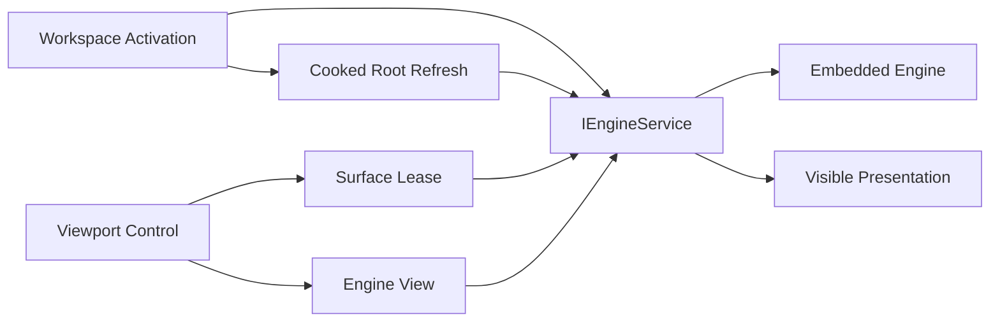
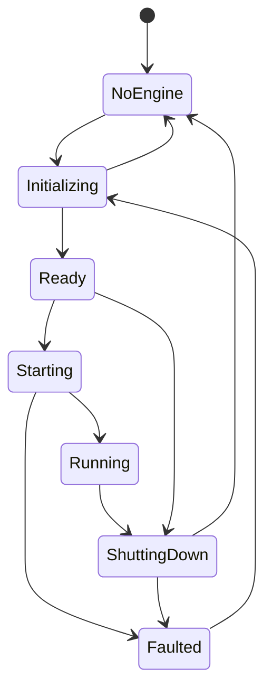

# Runtime Integration LLD

Status: `ED-M07 review-ready`

## 1. Purpose

Define the managed boundary between the WinUI editor and the embedded Oxygen
Engine runtime. This LLD was first reviewed for ED-M02 and is re-reviewed in
ED-M04 only for inspector-driven live-sync completion semantics. It covers
runtime lifecycle, native runtime
discovery assumptions, runtime settings, surface leases, engine view lifecycle,
cooked-root refresh ordering, threading, and the validation evidence needed
before live viewport behavior can support later authoring milestones.

This is not the LLD for scene synchronization, content cooking, standalone
runtime validation, or viewport authoring tools. Those later milestones consume
the runtime contracts defined here.

ED-M07 consumes this LLD only for validated cooked-root mount refresh after
content pipeline cook. Multi-viewport remains deferred and is not reopened by
ED-M07.

## 2. PRD Traceability

| ID | Coverage |
| --- | --- |
| `REQ-025` | Embedded viewport renders the active scene through the live engine. |
| `REQ-027` | Runtime surface/view lifecycle supports the V0.1 single live viewport; multi-viewport is deferred. |
| `REQ-028` | Runtime presentation is routed to the correct editor surface for the supported live viewport. |
| `REQ-030` | Partial: runtime presentation provides the embedded preview path used later for parity validation; full authored-content parity remains ED-M08. |
| `SUCCESS-003` | Live editor viewport presents correctly. |
| `SUCCESS-005` | Runtime presentation is stable enough for later authoring validation. |

ED-M04 consumes this LLD for `REQ-008`, `REQ-022`, `REQ-024`, and `REQ-026`
only to define runtime readiness, rejected runtime setting writes, and sync
completion semantics. ED-M04 does not reopen surface/view lifecycle scope.

## 3. Architecture Links

- `ARCHITECTURE.md`: runtime boundary, threading/frame phases, dependency
  direction, and diagnostics policy.
- `DESIGN.md`: runtime integration LLD ownership and cross-LLD workflow chains.
- `PROJECT-LAYOUT.md`: `Oxygen.Editor.Runtime` owns the managed runtime service;
  `Oxygen.Editor.Interop` owns the C++/CLI bridge.
- `viewport-and-tools.md`: viewport UI consumes this LLD's runtime service and
  surface/view contracts.
- `diagnostics-operation-results.md`: runtime failure domains and operation
  result vocabulary.

## 4. Current Baseline

The current codebase has the core runtime pieces needed for ED-M02:

- `Oxygen.Editor.Runtime` exposes `IEngineService` and `EngineService`.
- `EngineServiceState` models `NoEngine`, `Initializing`, `Ready`, `Starting`,
  `Running`, `ShuttingDown`, and `Faulted`.
- Native runtime discovery is process bootstrap infrastructure, not a Project
  Browser responsibility. The editor now defers engine startup until workspace
  activation/runtime use.
- `WorkspaceViewModel` starts the engine before cooked-root refresh. The
  current cooked-root refresh can mount the project `.cooked` root when
  `.cooked/container.index.bin` exists, with legacy per-mount index fallback.
  ED-M02 documents the runtime ordering and user-visible warning behavior; the
  full cooked-index policy remains `content-pipeline.md` / ED-M07 scope.
- `IEngineSettings` and `EngineSettingsService` provide startup settings.
  `EngineSettingsExtensions` maps them to the interop engine configuration.
- `IEngineService.TargetFps`, `MaxTargetFps`, and `EngineLoggingVerbosity`
  expose runtime-adjustable settings once the engine is ready/running.
- `ViewportSurfaceRequest`, `ViewportSurfaceKey`, and `IViewportSurfaceLease`
  model logical viewport-to-surface ownership.
- `Viewport.xaml.cs` attaches a `SwapChainPanel` through
  `IEngineService.AttachViewportAsync`, creates a native editor view, resizes
  the surface, and destroys the view before disposing the lease.
- `EngineService` tracks active leases, per-document surface limits, and
  blacklisted/orphaned viewport IDs when native cleanup fails.

Known ED-M02 gaps:

- Runtime operations mostly log failures; they do not consistently publish
  operation results.
- Attach/create/resize completion means "accepted by the managed/native
  boundary", not "a frame has visibly presented"; validation must use visual
  evidence and logs.
- Engine startup is owned by workspace activation today. ED-M02 must make that
  ownership explicit and ensure workspace code does not call mount/surface
  operations before `Running`.
- Surface and view ownership is split between `Oxygen.Editor.Runtime` and
  WorldEditor viewport code. ED-M02 accepts this split but documents the
  invariants that must hold.

## 5. Target Design

ED-M02 target flow:

Target invariants:

1. Project Browser does not start the engine.
2. Workspace activation is the first normal runtime startup trigger.
3. Cooked-root mount, surface attach, resize, view create, and view destroy
   require `EngineServiceState.Running`.
4. Runtime settings may be read/applied only in `Ready` or `Running` states.
5. Feature UI depends on `Oxygen.Editor.Runtime`, not on interop classes except
   for narrow existing view configuration structs until wrapper contracts exist.
6. A surface lease owns the native composition surface reservation for one
   `(document, viewport)` key.
7. An engine view is associated with exactly one viewport surface target while
   it is visible.
8. Disposing a viewport destroys its engine view before releasing the surface
   lease.
9. Native registration failure, cleanup failure, or orphaned viewport IDs must
   not poison future unrelated viewports.
10. Surface limits are enforced before native registration and report
    `RuntimeSurface` diagnostics when exceeded.
11. UI code must not synchronously block on native frame progress.

## 6. Threading And Frame Ordering

ED-M02 runtime calls cross the WinUI UI thread, managed async services, and the
native engine frame loop. The ordering contract is:

1. Workspace activation serializes `InitializeAsync` and `StartAsync`.
   Cooked-root refresh is awaited only after the service reaches `Running`.
2. `SwapChainPanel` access and the surface attach entry point originate on the
   UI thread.
3. Runtime services own engine state transitions and reject invalid-state calls
   with diagnostics instead of allowing hidden asserts to be the only signal.
4. Viewport unload cancels pending attach/create/resize work where possible and
   still runs view-destroy and lease-dispose teardown idempotently.
5. Resize requests may be coalesced, but the latest measured viewport size must
   eventually be sent to the runtime while the lease remains active.
6. ED-M02 does not expose a managed "presented frame observed" completion
   signal. Validation therefore uses visual checks and correlated logs.

## 7. Ownership

| Owner | Responsibility |
| --- | --- |
| `Oxygen.Editor` | Process bootstrap, DI composition, native runtime discovery setup. |
| `Oxygen.Editor.WorldEditor` workspace | Runtime startup trigger during workspace activation; cooked-root refresh request. |
| `Oxygen.Editor.WorldEditor` viewport UI | `SwapChainPanel` ownership, load/unload/size events, initial measured size, engine view request timing. |
| `Oxygen.Editor.Runtime` | Engine lifecycle, settings bridge, surface leases, view calls, input bridge access, runtime diagnostics mapping. |
| `Oxygen.Editor.Interop` | Managed/native bridge calls and native handle abstractions. |
| Oxygen Engine | Frame loop, rendering, content loading, composition, native resource ownership. |

ED-M02 accepts that viewport UI currently creates engine views directly after
surface attachment. Later runtime cleanup may wrap view lifecycle more tightly
inside `Oxygen.Editor.Runtime`, but the ED-M02 invariant is that all native
calls still pass through `IEngineService`.

View creation is initiated by viewport UI, but all native view operations are
invoked through `IEngineService.CreateViewAsync` / `DestroyViewAsync`; viewport
UI never calls `Oxygen.Editor.Interop` directly for view lifecycle.

## 8. Data Contracts

### Runtime State

`EngineServiceState` is the authoritative lifecycle state exposed to managed
editor code.

Allowed ED-M02 transitions:

Rules:

- `InitializeAsync` is idempotent outside transient states.
- `StartAsync` is idempotent for `Starting`/`Running`.
- `ShutdownAsync` is not cancellable and must not run during initialization or
  startup.
- Failed startup transitions to `Faulted`; retry requires re-initialization.

### Runtime Settings Snapshot

Settings inputs:

- startup `IEngineSettings` mapped into editor engine config during
  initialization.
- runtime `TargetFps`.
- runtime native logging verbosity.

Rules:

- Startup settings apply only when a new engine context is created.
- Runtime FPS/logging writes are immediate service calls and may fail if the
  engine is not `Ready`/`Running`.
- Failed settings writes must produce a visible diagnostic in ED-M02 validation.

### Surface Lease

`ViewportSurfaceRequest` contains:

- document ID.
- viewport ID.
- viewport index.
- primary viewport flag.
- optional diagnostic tag.

`ViewportSurfaceKey` is `(DocumentId, ViewportId)`.

`IViewportSurfaceLease` provides:

- `Key`.
- `IsAttached`.
- `AttachAsync`.
- `ResizeAsync`.
- `DisposeAsync`.

Rules:

- A lease is the only managed object allowed to resize or release its native
  surface.
- Re-attaching an already attached lease is a no-op.
- A failed attach removes the reservation when possible.
- A failed native unregister marks the viewport ID orphaned so it is not reused.
- Surface limits are enforced before native registration.

### Engine View

Current ED-M02 view contract:

- Viewport UI creates a view after a surface lease is attached.
- The view config includes name, purpose, compositing target viewport ID,
  initial pixel size, and clear color.
- The native engine returns an engine view ID.
- Viewport UI stores the assigned view ID and destroys it before lease disposal.

Rules:

- No view creation before a surface target exists.
- No view creation before the scene is loaded into the engine.
- A failed view creation must leave the surface lease disposable.
- Destroy failures are logged and surfaced through diagnostics where possible,
  but must not prevent control teardown.

### Cooked Root Refresh

ED-M02 mount contract:

- Workspace activation requests cooked-root refresh after runtime is running.
- The refresh uses the existing workspace/runtime mount path. The exact
  cooked-index layout is brownfield behavior until ED-M07 owns content-pipeline
  parity.
- Missing cooked roots are non-fatal for workspace entry but must be visible in
  logs/diagnostics because assets may not resolve.

ED-M07 mount contract:

- ContentPipeline requests runtime refresh only after cooked output validation
  succeeds.
- Brownfield scene save, material save/cook, Content Browser import/cook, and
  catalog-only refresh paths must stop publishing unvalidated cooked-root
  refresh messages; only a validated content-pipeline result may trigger
  runtime mount refresh in ED-M07.
- Workspace/runtime code still owns the actual `IEngineService` calls:
  `UnmountProjectCookedRoot()` followed by `MountProjectCookedRoot(path)`.
- The path passed to runtime is the validated cooked root for the active
  project/mount, not an authored asset path or a browser display path.
- Validated cook-result refresh mounts only the roots carried by that validated
  result. It must not rescan all `.cooked` child directories and accidentally
  mount stale or unrelated cooked output.
- `EditorModule` applies root changes at frame start through its existing
  `AddLooseCookedRoot` / `ClearCookedRoots` path; ED-M07 must not manipulate
  native asset-loader mounts mid-frame.
- Mount refresh failure is reported under `AssetMount` and does not rewrite
  cook success/failure state.

## 9. Commands, Services, Or Adapters

ED-M02 service operations:

| Operation | Owner | Completion Meaning |
| --- | --- | --- |
| Runtime initialize | `IEngineService.InitializeAsync` | Engine context created and service is `Ready`. |
| Runtime start | `IEngineService.StartAsync` | Frame loop startup call returned and service is `Running`. |
| Runtime shutdown | `IEngineService.ShutdownAsync` | Engine resources released or service faulted. |
| Apply startup settings | `EngineSettingsExtensions` | Settings copied into config before context creation. |
| Apply FPS/logging | `IEngineService` properties | Native service accepted the value. |
| Attach surface | `AttachViewportAsync` | Native surface registration completed and lease is attached. |
| Resize surface | `IViewportSurfaceLease.ResizeAsync` | Native resize request accepted/queued. |
| Create/destroy view | `CreateViewAsync` / `DestroyViewAsync` | Native view operation returned success or failure. |
| Refresh cooked roots | workspace through `IEngineService` | Existing cooked roots are mounted or a non-fatal warning is produced. |

Frame-presented completion is not exposed as a managed contract in ED-M02. The
detailed ED-M02 validation plan must therefore use visual validation and engine
logs to prove presentation.

## 10. UI Surfaces

ED-M02 runtime UI surfaces:

- Project Browser: no runtime UI; startup failures must not block Project
  Browser visibility.
- Workspace shell: owns the "runtime is starting / failed / cooked roots
  missing" user-visible state.
- Viewport control: owns surface attach/resize failure presentation near the
  viewport when possible.
- Scene editor toolbar/settings surface: invokes runtime FPS/logging changes,
  publishes `Runtime.Settings.Apply` results, and shows rejected writes inline
  near the control when practical.
- Output/log panel: shows runtime diagnostic details and correlated operation
  result summaries.

Settings failures always appear in the output/log panel. Inline presentation is
required where the scene editor settings surface is visible.

## 11. Persistence And Round Trip

Persisted:

- runtime/editor settings through settings services.
- scene document viewport layout metadata through document metadata.
- workspace layout through workspace/persistent state services.

Not persisted:

- engine service state.
- active surface leases.
- native engine view IDs.
- mounted cooked roots.

On restart, workspace/project activation recreates runtime state from project
context, settings, document metadata, and cooked roots.

## 12. Live Sync / Cook / Runtime Behavior

ED-M02 covers runtime readiness and presentation only.

Later consumers:

- `live-engine-sync.md` consumes `Running` state and frame-phase ordering for
  scene mutation sync.
- `content-pipeline.md` owns full cooked-root mount behavior after cook.
- `standalone-runtime-validation.md` consumes runtime/cooked parity evidence.
- `viewport-and-tools.md` consumes surface/view contracts for layout and
  camera validation.

ED-M02 must not add authoring-specific scene mutation semantics here.

### ED-M04 Inspector-Driven Sync Semantics

ED-M04 adds **no new public surface** to `IEngineService`. It pins the exact
preconditions that the live-sync adapter
([live-engine-sync.md](./live-engine-sync.md)) consumes before invoking
`OxygenWorld` operations.

#### 12.1 Runtime readiness contract

Before any `ISceneEngineSync.<Update*|Attach*|Detach*>` call hits the engine,
the adapter MUST observe **all** of:

| Precondition | Source | Failure classification |
| --- | --- | --- |
| `IEngineService.State == Running` | `EngineService.State` | `SyncOutcome.SkippedNotRunning`, code `OXE.LIVESYNC.NotRunning`. |
| `IEngineService.World is not null` | `EngineService.World` | `SyncOutcome.SkippedNotRunning`, code `OXE.LIVESYNC.NotRunning` (race with shutdown). |
| `IEngineService.State != Faulted` | `EngineService.State` | `SyncOutcome.SkippedNotRunning`, code `OXE.LIVESYNC.RuntimeFaulted`. |
| Scope cancellation token not cancelled | command-supplied `CancellationToken` | `SyncOutcome.Failed`, code `OXE.LIVESYNC.Cancelled`. |

The adapter performs these checks **without** taking any runtime lock other
than reading the `State` snapshot and the `World` reference. It never blocks
waiting for `Running`. Calls to `SyncSceneWhenReadyAsync` (full-scene resync)
remain the only awaiting variant and are reserved for workspace/document
activation, not inspector edits.

#### 12.2 Inspector-side rules

1. Inspector view-models and command services MUST NOT call
   `IEngineService.StartAsync` / `StopAsync` / `RestartAsync`. Engine lifecycle
   stays owned by workspace activation / scene editor controls.
2. Inspector commands MUST NOT subscribe to `IEngineService` state changes to
   retry sync. A skipped sync stays skipped; the next user edit produces the
   next attempt.
3. Inspector commands MUST treat any thrown exception from
   `ISceneEngineSync` as `SyncOutcome.Failed` and continue. They MUST NOT
   re-throw to the UI.

#### 12.3 What "Accepted" means

`SyncOutcome.Accepted` means the engine boundary accepted the call. It does
NOT imply:

- a frame has been presented,
- the cooked geometry/material was resolved,
- the change is visible in the active view.

ED-M04 does not introduce a managed presented-frame completion contract.
Visual confirmation remains a manual validation step.

#### 12.4 Runtime setting writes

Inspector-adjacent runtime setting controls (target FPS, engine logging
verbosity) continue to use `Runtime.Settings.Apply` and the `Settings`
failure domain — unchanged from ED-M02. These do not flow through the
sync adapter and do not produce `OXE.LIVESYNC.*` codes.

## 13. Operation Results And Diagnostics

ED-M02 operation kinds:

- `Runtime.Start`.
- `Runtime.Settings.Apply`.
- `Runtime.Surface.Attach`.
- `Runtime.Surface.Resize`.
- `Runtime.View.Create`.
- `Runtime.View.Destroy`.
- `Runtime.View.SetCameraPreset`.
- `Runtime.CookedRoot.Refresh`.

Failure domains:

- `RuntimeDiscovery` for native DLL/path discovery.
- `RuntimeSurface` for surface attach/resize/release.
- `RuntimeView` for engine view create/destroy/preset failures.
- `AssetMount` for missing or failed cooked-root refresh when it affects
  runtime content availability.
- `Settings` for global runtime settings failures.

Minimum ED-M02 rule:

- failures that block visible viewport presentation must produce a visible
  user-facing diagnostic, not only a debug trace.
- non-fatal missing cooked roots may be warning diagnostics.
- invalid-state runtime settings writes produce `Runtime.Settings.Apply` /
  `Settings` diagnostics, with output/log panel presentation and inline
  presentation near the setting when possible.
- surface-limit rejection produces a `RuntimeSurface` diagnostic with reason
  `LimitExceeded`.
- ED-M02 only specifies that `Runtime.CookedRoot.Refresh` runs after `Running`,
  that missing/unmountable roots produce `AssetMount` warnings, and that the
  workspace remains usable. Cooked-index layout, validation, and refresh after
  cook are owned by `content-pipeline.md` in ED-M07.
- teardown failures may be log-only when the UI surface is already being
  destroyed, but must be visible in output/log diagnostics.

## 14. Dependency Rules

Allowed:

- `Oxygen.Editor.WorldEditor` depends on `Oxygen.Editor.Runtime`.
- `Oxygen.Editor.Runtime` depends on `Oxygen.Editor.Interop`.
- `Oxygen.Editor.Runtime` depends on DroidNet hosting/settings abstractions.
- The surface attach entry point may accept a `SwapChainPanel` passed by the
  WinUI viewport host; runtime contracts otherwise do not depend on feature UI
  modules.

Forbidden:

- Project Browser must not depend on `IEngineService`.
- Feature UI must not call `Oxygen.Editor.Interop` directly for runtime engine
  operations.
- Runtime services must not depend on WorldEditor UI types.
- Runtime services must not own project cook policy.
- Engine view IDs and native handles must not be persisted.
- UI code must not infer success by parsing engine log text.

## 15. Validation Gates

ED-M02 can be validated when:

- normal launch still starts at Project Browser without initializing or starting
  the engine.
- opening a valid project starts the runtime before workspace cooked-root mount.
- runtime DLL discovery loads native engine DLLs from the engine install runtime
  directory.
- one-pane layout presents the live viewport.
- multi-viewport validation is recorded as deferred, not as an ED-M02 gate.
- resizing panes/windows does not leave stale or blank surfaces.
- closing/reopening a scene releases old document surfaces and creates new
  surfaces without surface-limit leakage.
- runtime FPS/logging settings apply, or the UI shows a diagnostic explaining
  why they could not apply.
- an invalid-state or simulated rejected runtime setting write produces a
  visible `Settings` diagnostic.
- surface/view failure paths produce operation-result or output/log diagnostics
  with the affected document/viewport where known.

Tests are useful for state-machine and lease bookkeeping. Final ED-M02 closure
also requires manual visual validation because frame-presented completion is not
yet a managed contract.

## 16. Open Issues

- Whether a future runtime API should expose "presented frame observed" instead
  of only accepted/staged operation completion.
- Engine view lifecycle remains coordinated by WorldEditor viewport code in
  ED-M02. Possible extraction behind a runtime view adapter is post-ED-M02
  cleanup.
- Whether runtime diagnostics should grow a compact workspace status surface in
  addition to output/log panel entries.
