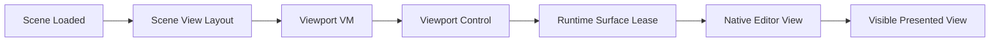

# Viewport And Tools LLD

Status: `review`

## 1. Purpose

Define the ED-M02 viewport design: live embedded viewport presentation for the
scene layouts, editor camera defaults/framing, runtime settings surface, and the
boundary between current stabilization work and later authoring tools.
ED-M08.V1 owns multi-viewport layouts and the camera preview inset; ED-M08.V2
owns viewport state persistence.

Selection highlights, transform gizmos, node icons, picking, and advanced
overlays are planned for ED-M09. They are intentionally not ED-M02 blockers.

## 2. PRD Traceability

| ID            | Coverage                                                                                                                    |
| ------------- | --------------------------------------------------------------------------------------------------------------------------- |
| `REQ-025`     | A live embedded viewport renders the active scene.                                                                          |
| `REQ-027`     | Every scene layout and the camera preview inset are stable (ED-M08.V1).                                                     |
| `REQ-028`     | Each viewport presents to its surface (ED-M08.V1); layout and camera state survive reopening (ED-M08.V2).                   |
| `REQ-030`     | Partial: ED-M02 verifies the active scene is visibly rendered in the embedded viewport; full preview parity remains ED-M08. |
| `SUCCESS-003` | Users can see the scene in the editor viewport.                                                                             |
| `SUCCESS-005` | Live viewport is stable enough for later authoring work.                                                                    |

## 3. Architecture Links

- `runtime-integration.md`: runtime lifecycle, surface leases, engine views,
  settings, and diagnostics.
- `documents-and-commands.md`: later owner of command/selection integration.
- `scene-explorer.md`: later owner of hierarchy selection that viewport tools
  will consume.
- `diagnostics-operation-results.md`: visible viewport/runtime failures.
- `PLAN.md` ED-M02 and ED-M09 split.

## 4. Current Baseline

The current editor has:

- a WorldEditor workspace route with a center renderer outlet.
- `DocumentHostViewModel` and `SceneEditorViewModel` hosting scene documents.
- `SceneEditorViewModel` creates `ViewportViewModel` instances according to
  `SceneViewLayout`.
- layout menus for one, two, three, and four pane variants.
- `Viewport.xaml.cs` attaches `SwapChainPanel` instances to runtime surface
  leases.
- each viewport can create a native editor view after surface attach.
- every viewport clears to one neutral colour.
- camera preset menu entries call runtime view camera preset APIs.
- FPS and logging verbosity controls read/write through `IEngineService`.
- initial layout creation is deferred until `SceneLoadedMessage` to avoid
  creating views before the scene exists in the engine.

Known ED-M02 gaps:

- several later tool concepts are present in UI names/menus but are not
  production-ready authoring tools.
- frame-all/frame-selected commands are not yet explicit user workflows.
- runtime/viewport failures are logged more reliably than they are presented.
- multi-view validation is deferred out of ED-M02.

Three-pane variants are existing UI but are not ED-M02 validation targets unless
the implementation touches them. If they remain exposed, they must not
catastrophically regress; correctness evidence is required only for the
supported single viewport layout in ED-M02.

## 5. Target Design

ED-M02 target viewport flow:

Target invariants:

1. Viewports are created only after the scene is available to the runtime.
2. Each visible viewport has one viewport ID, one surface lease, and at most
   one assigned engine view.
3. Hidden/removed viewports release their engine view and surface lease.
4. Layout changes update viewport metadata before surface/view requests rely on
   index/primary flags.
5. Every layout routes each pane to its own surface.
6. The editor camera is owned by the runtime/editor view, not by scene camera
   authoring data.
7. ED-M02 framing means the default camera observes authored content after
   load; explicit frame commands are ED-M09.
8. Runtime settings controls reflect service state and fail visibly.
9. Viewport UI remains responsive while attach/resize/create work is async.

## 6. Ownership

| State Or Behavior                                   | Owner                                        |
| --------------------------------------------------- | -------------------------------------------- |
| Scene document layout metadata                      | WorldEditor scene document metadata          |
| Viewport collection and layout selection            | `SceneEditorViewModel`                       |
| Viewport identity, index, primary flag, clear color | `ViewportViewModel`                          |
| `SwapChainPanel` lifetime and size events           | `Viewport` WinUI control                     |
| Surface lease                                       | `Oxygen.Editor.Runtime`                      |
| Engine view ID                                      | Runtime result stored by `ViewportViewModel` |
| Runtime camera preset calls                         | `ViewportViewModel` through `IEngineService` |
| Runtime FPS/logging settings                        | Scene editor UI through `IEngineService`     |
| Selection/picking/gizmos                            | ED-M09 LLD scope, not ED-M02                 |

## 7. Data Contracts

### Viewport Layout

`SceneViewLayout` describes the requested pane arrangement, from one to four
panes. ED-M02 validated one pane; ED-M08.V1 qualifies every variant.

### Multi-Viewport Layouts

- Each pane holds one surface lease and one engine view. A layout change
  creates and releases only the panes that change and keeps the surviving
  panes' state.
- Panes are independent: editor camera, view preset, orthographic size,
  camera control mode and viewed scene camera are per pane. A camera piloted
  in one pane moves live wherever it is shown; one pane at a time pilots a
  given camera.
- Each document has one focused pane. Keyboard shortcuts, frame commands,
  Scene Explorer camera commands and Align to View act on it. Pointer input
  goes to the pane under the pointer and focuses it.
- Selecting a camera node shows a camera preview inset in the focused pane,
  rendered through that camera with its framing. It is composed through the
  engine's destination viewport and z-order, is excluded from the host view's
  metering, and hides when the camera is deselected or already viewed by
  the pane.
- The inset is its own engine view that presents nothing alone: it names its
  host view, takes 30% of the host surface in the bottom-right corner, is
  composed as a layer over the host's image, receives no input, and does not
  render while the surface is too small for it.
- A pane owns its view's lifetime and keeps its camera state while it has no
  view. Before a view is released (dock move, document switch, maximize) the
  pane reads the editor camera back; view creation carries the preset,
  editor camera and viewed scene camera, so the new view is correct on its
  first presented frame.
- Maximize is presentation only: the layout and pane indexes are unchanged,
  and the hidden panes release their views but keep their state.

### Viewport Identity

Each viewport has:

- owning document ID.
- stable viewport ID for the current viewport instance.
- zero-based layout index.
- primary viewport flag.
- assigned native view ID, invalid when no view exists.
- neutral clear colour, shared by every pane.

Viewport IDs are runtime/session state and are not persisted as authoring data.

### Camera State

ED-M02 camera state is runtime/editor-view state:

- perspective/default view.
- orthographic preset requests where already exposed.
- initial camera framing generated by the runtime/editor view.

Each viewport also renders, independently, either its editor camera or an
authored scene camera:

- **Look through.** The camera menu lists every node with a perspective or
  orthographic camera (rebuilt when the menu opens). Picking one renders the
  viewport through it with its own projection and aspect policy, so Fixed
  cameras show bars. Picking any editor item returns to the editor camera, which
  kept its pose. The runtime resolves the node by id every frame: a deleted node
  falls back to the editor camera and an undone delete restores the view.
- **Pilot.** While looking through a camera, Pilot Camera makes navigation move
  it. The editor camera takes the camera's world pose and is navigated as usual
  (orbit, fly and pan work for orthographic cameras too); the scene camera
  follows it every frame in its parent's space, and the wheel resizes an
  orthographic camera. When no button or key is held and input pauses, the
  gesture is committed as one undoable transform edit (plus one orthographic
  size edit when the size changed). Stopping the pilot commits first and keeps
  looking through the camera; the editor camera stays at the camera's pose.
- **Align to view.** Align Selected Camera to View (`Ctrl+Shift+F`) moves the
  selected camera to the viewport's editor camera as one undoable edit, and
  takes the view's orthographic size for an orthographic camera when the view is
  orthographic. It requires the viewport to show its editor camera.
- Locked cameras cannot be piloted or aligned.
- Scene Explorer offers Look through camera / Return to editor camera, Pilot
  camera / Stop piloting camera and Align camera to view on a camera node; they
  act on the active (focused) viewport of the active scene document.

### Runtime Settings Surface

ED-M02 viewport-adjacent settings:

- target FPS.
- native logging verbosity.
- simple view/preset menu state where already present.

Controls must not pretend a setting applied if `IEngineService` rejects it.
Rejected writes publish `Runtime.Settings.Apply` / `Settings` diagnostics,
appear in the output/log panel, and appear inline near the control when the
scene editor settings surface is visible.

## 8. Commands, Services, Or Adapters

ED-M02 commands and service calls:

| User/UI Action            | Owner                  | Runtime Interaction                               |
| ------------------------- | ---------------------- | ------------------------------------------------- |
| Open scene document       | document/workspace     | scene sync happens before layout creation.        |
| Restore/change layout     | `SceneEditorViewModel` | create/remove viewport VMs.                       |
| Viewport loaded           | `Viewport` control     | attach surface lease, create engine view, resize. |
| Viewport unloaded/removed | `Viewport` control     | destroy engine view, dispose lease.               |
| Pane/window resized       | `Viewport` control     | debounce and resize surface lease.                |
| Camera preset selected    | `ViewportViewModel`    | call `SetViewCameraPresetAsync`.                  |
| FPS changed               | scene editor UI        | write `IEngineService.TargetFps`.                 |
| Logging verbosity changed | scene editor UI        | write `IEngineService.EngineLoggingVerbosity`.    |

Command-based scene mutation, undoable transform tools, and selection tools are
deferred to ED-M03/ED-M09.

## 9. UI Surfaces

ED-M02 UI surfaces:

- viewport content area.
- viewport toolbar/menus for layout and view presets.
- scene editor FPS/logging controls.
- output/log panel diagnostics.

Failure presentation:

- fatal runtime startup/surface/view failure should be visible near the
  workspace or viewport.
- non-fatal resize/create warnings may be visible in the output/log panel.
- missing cooked roots should be visible as a warning when geometry/material
  assets may not resolve. Full cooked-index and content-pipeline behavior is
  ED-M07 scope.

## 10. Persistence And Round Trip

Persisted:

- per scene, as user-local workspace state (ED-M08.V2, settings architecture
  §5.2): the layout, the focused pane, and each pane's editor camera pose and
  orbit focus, view preset, orthographic size, camera control mode and viewed
  scene camera. Pilot is not restored: the pane reopens looking through the
  camera. A missing camera falls back to the editor camera.
- workspace layout.
- runtime/editor settings through their settings service.

Not persisted:

- viewport IDs.
- assigned engine view IDs.
- active surface leases.
- the maximized pane and the camera preview inset.

Restart behavior:

- opening the project/workspace recreates the runtime.
- opening/restoring a scene recreates viewport VMs.
- each loaded viewport attaches a new surface and creates a new engine view.

## 11. Live Sync / Cook / Runtime Behavior

ED-M02 depends on runtime presentation. It does not own live scene mutation
sync, cooking, or asset import.

Required ordering:

1. Project context is active.
2. Workspace starts runtime.
3. Workspace refreshes cooked roots using the existing runtime mount path.
4. Scene is loaded/synchronized into runtime.
5. Scene editor creates/restores layout.
6. Viewport controls attach surfaces and create views.
7. Viewports resize to measured panel sizes.

If a later step fails, earlier successful state remains valid where possible.
For example, missing cooked roots do not prevent the workspace from opening,
but may prevent asset-backed geometry/materials from rendering. ED-M02 only
requires the warning and ordering; cook orchestration and cooked-index policy
belong to later content-pipeline milestones.

## 12. Operation Results And Diagnostics

ED-M02 viewport operation kinds:

- `Runtime.Surface.Attach`.
- `Runtime.Surface.Resize`.
- `Runtime.View.Create`.
- `Runtime.View.Destroy`.
- `Runtime.Settings.Apply`.
- `Runtime.View.SetCameraPreset`.
- `Viewport.Layout.Change`.

Failure domains:

- `RuntimeSurface`.
- `RuntimeView`.
- `Settings`.
- `WorkspaceRestoration` for restored layout issues.

Diagnostics must include document ID and viewport ID when available. Runtime
view ID should appear only in technical details/logs because it is not stable
authoring identity.

`Viewport.Layout.Change` is a user action, but ED-M02 does not require a
success result for every successful layout switch. Layout failures publish a
result only when the change cannot be applied, restoration fails, or runtime
surface/view work fails.

## 13. Dependency Rules

Allowed:

- WorldEditor viewport UI depends on `Oxygen.Editor.Runtime`.
- Viewport UI may use WinUI controls and `SwapChainPanel`.
- Viewport VM may store runtime-assigned view ID as session state.

Forbidden:

- Viewport UI must not call C++/CLI interop directly.
- Viewport IDs or view IDs must not be serialized into scene authoring data.
- Scene camera components must not be mutated by editor camera navigation,
  except while the user pilots that camera; pilot gestures and Align to view
  reach the document only as undoable authoring edits.
- ED-M02 must not introduce selection/gizmo-specific dependencies.
- Layout changes must not depend on log parsing to decide whether presentation
  succeeded.

## 14. Validation Gates

ED-M02 viewport validation is complete when:

- one-pane scene viewport renders the active scene.
- multi-viewport validation is recorded as deferred, not as an ED-M02 gate.
- the supported live viewport can be correlated to a distinct document/viewport
  ID in logs.
- resizing the workspace or split panes keeps viewports correctly scaled and
  non-overlapping.
- closing/reopening a scene releases old surfaces/views and creates new ones.
- default editor camera observes authored content without clipping the whole
  scene.
- camera preset menu calls do not fault the runtime.
- FPS/logging controls apply or produce visible diagnostics.

Evidence must include manual single-viewport notes or screenshots, logs showing
the document/viewport ID, and targeted tests for pure layout/metadata helpers
where practical.

## 15. Closed V0.1 Decisions

ED-M02 remains the recorded presentation/lifecycle baseline. ED-M09 implements
the interaction contract below and consumes ED-M07A's command/session/diagnostic
mechanism. ED-M08.V1 qualifies every multi-pane layout; until it does, a
crash-prone mode does not qualify as supported.

## 16. V0.1 Viewport Interaction Contract

### Navigation And Focus

Preserve existing Turntable (default), Trackball and Fly modes. Alt+left drag
orbits, Alt+middle drag pans, Alt+right drag dollies; wheel zooms; RMB mouse-look
with WASD/QE moves in fly navigation; Home resets the view. These are the existing
native EditorViewport navigation feature families. Focus/capture routes input
only to the active viewport. Release capture and held keys on focus loss,
document change, publication pause, cancellation and viewport destruction.
Navigation never mutates authored camera components or adds scene undo entries,
except in the explicit pilot mode described in Camera State.

Frame Selected (`F`) frames the combined world bounds of the selected nodes
and their descendants. With no selection, the pane shows a brief notice and the
view is unchanged. Frame All (`Shift+F`) frames all visible scene content.
Framing keeps the view direction, uses a 10% margin with the current
aspect/FOV and moves the editor camera with a short eased transition that
navigation input interrupts; orthographic views resize instead of moving
closer. Nodes without geometry use a default point extent, and an empty scene
frames the origin. Invalid bounds leave the view unchanged with a notice.
Framing moves only the editor camera: while a pane looks through or pilots a
scene camera it is refused with a notice, so it never adds an authored change.
Double-clicking a Scene Explorer node row frames that node in the focused pane;
the scene row frames everything. Rename stays on F2.

### Picking And Selection

Unmodified left click selects the nearest visible pickable geometry or camera/
light icon; Ctrl+click toggles membership and Shift+click adds. Empty-space
click clears selection; a modified empty click changes nothing. A left drag
beyond a small threshold draws a marquee that selects every node with visible
pixels inside it, with the same modifiers; the node nearest its centre becomes
active. Escape ends what is in progress first (a gizmo drag, then a
marquee); with nothing in progress it clears the selection, with no undo
entry. Workspace-hidden nodes are not pickable; locked nodes are selectable
but not manipulable. Picking has no category filter. A viewport pick scrolls
the active Explorer row into view without taking keyboard focus.
SceneExplorer and Inspector consume the same document-scoped selection service.
A gizmo hit takes precedence over object picking; Alt/RMB navigation never
selects objects. Picking results include scene/document/view lifetime and are
ignored if stale. Engine-owned picking/render identity is mapped to authored
node IDs through runtime services; UI does not maintain a second scene database.

Selection highlight follows the same IDs and updates after undo, deletion,
reparent, scene activation and missing-geometry resolution. It is a crisp
screen-space outline of the selected nodes and their descendants, drawn after
post-processing in every editing pane and view mode: accent colour, brighter
for the active node and dimmed where occluded. Each pane's Show menu has a
"Selection outline" toggle, on by default and kept with the pane's state. Camera/light icons
are editor overlays, never authored/cooked geometry. An icon click uses the
same selection operation as a geometry click.

### Transform Tools

The focused pane's left tool rail holds Select (Q), Move (W), Rotate (E) and
Scale (R), then Frame (F); Space cycles the four tools. The keys apply unless
RMB navigation holds them. Move is the default tool, so a selection shows its
gizmo at once. With viewport focus, Delete, Ctrl+D (duplicate in place),
Ctrl+Z and Ctrl+Y (or Ctrl+Shift+Z) run the Scene Explorer's commands for the
document. Locked nodes, and the descendants of selected nodes, get no gizmo.

Provide World/Local space; default World. The pivot is the active
(last-selected) node's origin and orientation for Local, and its world
position with world axes for World. Multi-selection applies one common
world-space delta around that pivot while preserving each target's original
transform. Scale always acts along each target's own axes, whatever the
space: scaling a rotated node along world axes would need shear. A
multi-selection scales each target about its own origin and spreads the
positions from the pivot. The space toggle's tooltip states this.

Gizmo interaction runs natively in the editor module: it hit tests and drags
the handles on the engine's frame, draws them through the per-view overlay,
and reports begin, update, commit and cancel with each target's new local
transform. WorldEditor stays the only writer of the authored scene and
applies those results through the existing command/property session owner:
the first update begins the session and snapshots targets, previews update
authoring without history, release commits one entry, Escape or right-click
restores all before-values. A pane that keeps focus away, or a selection or
scene change, cancels an unfinished drag. Reject non-finite/zero-scale or
nonrepresentable parent-transform results without partial model changes; do
not invent shear or silently approximate a transform the authored model
cannot represent. The drag chip names the rejection.

Alt held when a drag begins duplicates. The drag previews on the originals;
release restores them and creates the copies at the dragged transforms, after
their sources and in their Explorer folders, as one undo entry, and selects
the copies. A cancelled Alt-drag leaves no copy and no history.

Snapping is a toggle in the HUD transform group, off by default: translation
0.25 metre, rotation 15 degrees, scale increment 0.1. Each increment offers
presets (0.01–10 m, 1–90 degrees, 0.01–1) and a custom value. In World space
translation snaps the pivot to the world grid; in Local space it snaps the
applied offset. Rotation and scale snap the applied delta, and Ctrl inverts
snapping for one drag. The toggle, the increments and the space are per-user
editor settings that persist across sessions and projects, never scene render
intent. A narrow pane folds the group into its settings flyout. One snapped
or unsnapped drag still produces one undo entry.

### Overlays And Diagnostics

Required overlays are selection highlight, transform gizmo, camera/light icons,
and the existing grid/origin affordance, each with visibility control. Their state
is view/session metadata; disabling them for parity does not dirty the scene.
Field/tool errors use ED-M07A.3's current revision-scoped diagnostics and existing
operation/output surfaces. Tool rejection leaves before-values intact. No new
validation dashboard or independently scheduled full-scene validation is added.

### ED-M09 Pass/Fail Gates

- [ ] Navigate each existing mode, lose focus during drag/key hold, close/reopen,
      and pause for publication: no stuck input, leaked capture, or authored-camera
      mutation; only the supported single viewport is enabled.
- [ ] Frame selected/all handles multiple transformed parents, tiny/large finite
      bounds, missing geometry, camera/light-only and empty scenes as specified.
- [ ] Picking, Ctrl membership, empty clear, icons, hierarchy and inspector agree
      on selection; stale async results never select a different active scene.
- [ ] Translate/rotate/scale, World/Local, multi-selection, snapping, commit/cancel
      and invalid parent transforms pass through the same command/session path.
      Each gesture has one undo entry and exact before-value restoration.
- [ ] Highlight/icons/gizmo/grid visibility survives expected view operations and
      never changes saved/cooked scene content. Overlay-off captures match M08 state.
- [ ] The PRD's 100-node viewport remains responsive; actual user validation
      records interaction outcomes, not screenshots alone or engine API acceptance.
