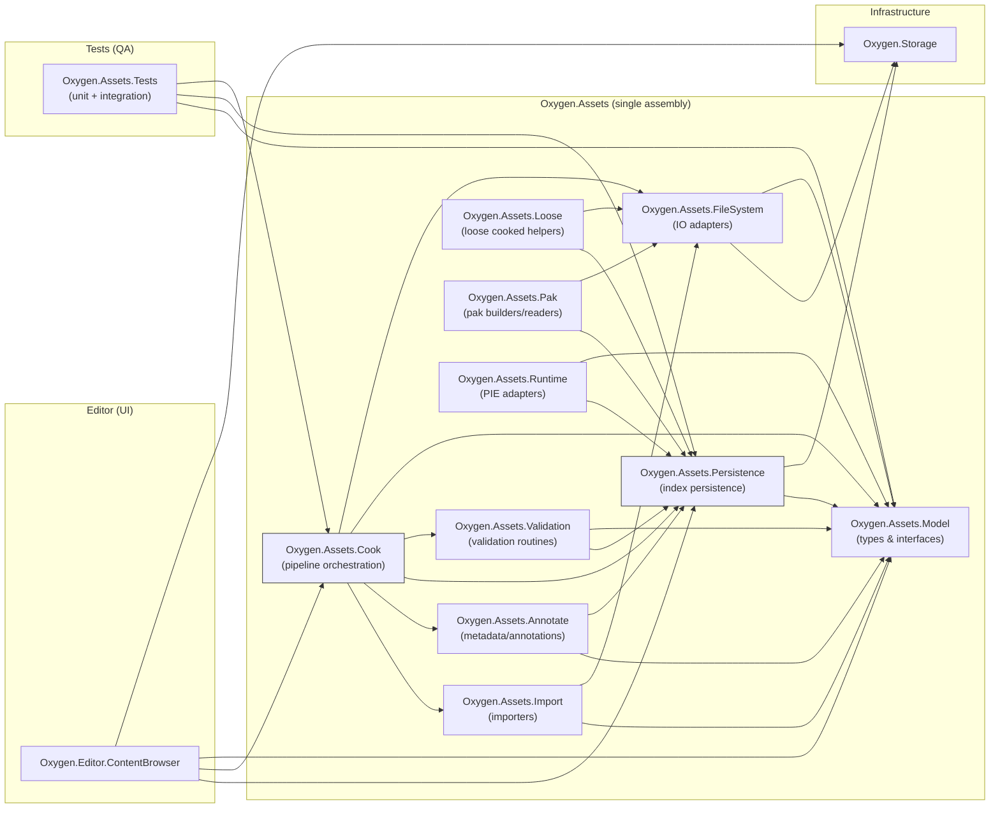

# Content Pipeline Design

This document captures decisions for the asset/content pipeline architecture, the relationship between editor UI and non-UI asset tooling, and a module decomposition diagram (Mermaid) for discussion.

## Roadmap (trackable)

### Phase 1 — Infrastructure

- [X] Rename `projects/Oxygen.Storage` → `projects/Oxygen.Storage` (single commit) and update references
- [X] Verify build & tests; fix any import/reference breaks

### Phase 2 — Assets scaffold

- [ ] Create `projects/Oxygen.Assets` (single assembly) with namespaces: `Model`, `Persistence`, `Validation`, `Import`, `Cook`, `Annotate`, `Loose`, `Pak`, `FileSystem`, `Runtime`
- [ ] Implement minimal DTOs & interfaces in `Oxygen.Assets.Model` (`VirtualPath`, `AssetKey`, `IVirtualPathNormalizer`, `IResourceProvider`, `IAssetKeyMapper`)

### Phase 3 — Persistence & FS adapters

- [ ] Prototype `IContainerIndexReader`/Writer in `Oxygen.Assets.Persistence`
- [ ] Implement `Oxygen.Assets.FileSystem` adapters (use `Oxygen.Storage` for IO)
- [ ] Add index validation helpers in `Oxygen.Assets.Validation`

### Phase 4 — Pipeline and integration

- [ ] Implement `ICookService` skeleton in `Oxygen.Assets.Cook` (async, progress, cancellation)
- [ ] Implement `Oxygen.Assets.Runtime` for deterministic container registration and PIE adapters
- [ ] Create `projects/Oxygen.Editor.ContentBrowser` and wire UI to `Oxygen.Assets` APIs (lookup, diagnostics, cook/validate)

### Phase 5 — Tests, CI, docs

- [ ] Add `Oxygen.Assets.Tests` (unit + integration) covering normalization, index read/write, cook atomic-swap
- [ ] Add CI jobs to run validation and integration tests on `master`
- [ ] Publish a migration guide and update this design doc with implementer notes

## Module decomposition

- `Oxygen.Storage` (infrastructure) — file system abstraction, path normalization, async IO helpers. This is an infra assembly and must not depend on `Oxygen.Assets`.
- `Oxygen.Assets` (single assembly, organized as namespaces):
  - `Oxygen.Assets.Model` — canonical DTOs and minimal interfaces: `VirtualPath`, `AssetKey`, descriptors, `IVirtualPathNormalizer`, `IResourceProvider`, `IAssetKeyMapper`.
  - `Oxygen.Assets.Persistence` — index read/write (`container.index.bin`) and persistence helpers.
  - `Oxygen.Assets.Validation` — validation routines for index and persistence; invoked by pipeline stages and exposed as APIs inside the assembly.
  - `Oxygen.Assets.Import` — importers that convert source formats into intermediate editor assets.
  - `Oxygen.Assets.Cook` — cook pipeline (incremental cook, staging/atomic-swap), dependency-closure enforcement, and pipeline orchestration (import→cook→annotate→loose→pak).
  - `Oxygen.Assets.Annotate` — annotation/metadata enrichment stages used by cook and editors.
  - `Oxygen.Assets.Loose` / `Oxygen.Assets.Pak` — helpers for loose cooked roots and pak container builders/readers.
  - `Oxygen.Assets.FileSystem` — adapters that implement `IResourceProvider` and other IO interfaces using `Oxygen.Storage` (file watchers, pak adapter, etc.).
    - `Oxygen.Assets.Runtime` — runtime registration helpers and adapters used for PIE.

Separate layer:

- `Oxygen.Assets.Tests` — tests (unit + integration) for the combined assembly and integration scenarios.

Notes:

- The editor pipeline is integrated: import → cook → annotate → loose → pak. These stages are expected to work together inside the same assembly; there is no expectation of a single consumer that only wants "loose" and later discards it for pak.
- No separate `Oxygen.Assets.Api` assembly is created unless a clear, demonstrated need arises (lightweight consumers that must avoid pulling persistence/IO). If that need appears later, extract the minimal public interfaces and DTOs into a small package.

-- Editor UI (editor-specific):

- `Oxygen.Editor.ContentBrowser` — Content Browser UI project (views, viewmodels, UI glue). This is an editor assembly and depends on the `Oxygen.Assets.*` non-UI modules and on `Oxygen.Storage` (infrastructure).

- Infrastructure (I/O / filesystem abstractions - no UI):
  - `Oxygen.Storage` — file system abstraction, path normalization, async IO helpers. This assembly is infrastructure and must not depend on `Oxygen.Assets`.

## Mermaid module diagram

