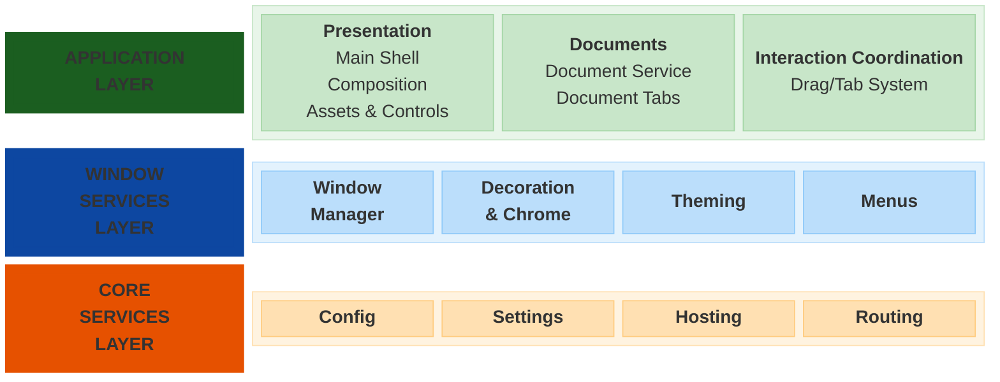

# Aura Design

## Modules

### Main Shell

Provides the primary application shell UI, including the main view and view model that orchestrate
window decorations, appearance settings, document tabs, routing integration, and the main menu. The
shell serves as the top-level container for the application's UI and manages window lifecycle
events.

### Windowing

Coordinates and owns the lifecycle of Aura-managed windows: creation, registration, activation,
deactivation, and closure. The module maintains a thread-safe registry of window contexts and active
window state, publishes window lifecycle events for other Aura services to react to (e.g.,
decoration, theming, routing), and ensures UI operations are marshalled onto the host dispatcher.

It integrates with the DI container to create windows and contexts, consults decoration and
appearance settings to provision the WindowContext with consistent chrome and backdrops based on
window category, and collaborates with routing and drag services to enable features like
route-driven windows and tab tear-out into new windows.

Key public interfaces and types include:

- **`IWindowManagerService`** (`IWindowManagerService.cs`) — High-level coordinator for Aura-managed windows. Exposes methods to register, activate, close and enumerate windows, along with an `IObservable<WindowLifecycleEvent>` stream for lifecycle events.
- **`IWindowFactory`** (`IWindowFactory.cs`) — DI-friendly factory abstraction for creating `Window` instances. Supports generic, keyed, and category-decorated creation flows.
- **`IWindowContextFactory`** (`IWindowContextFactory.cs`) — Factory that creates `WindowContext` objects wrapping a `Window` and its decoration/metadata.
- **`WindowContext`** (`WindowContext.cs`) — Lightweight, observable container for window metadata and state (Id, Window instance, Category, Decorations, MenuSource, activation timestamps).
- **`WindowLifecycleEvent` / `WindowLifecycleEventType`** (`WindowLifecycleEvent.cs`) — Record and enum representing window lifecycle changes (Created, Activated, Deactivated, Closed) used by the manager's event stream.
- **`WindowCategory`** (`src/WindowCategory.cs`) — Canonical set of window categories (Main, Secondary, Document, Tool, Transient, Modal, Frameless, System) and JSON converter to persist/use categories as dictionary keys.
- **`WindowId`** (`Microsoft.UI.WindowId`) — Platform window identifier commonly used as keys in the manager's collections (used via the WinUI `WindowId` type).

### Decoration & Chrome

Responsible for the visual presentation and interactive chrome of Aura-managed windows. This module
provides the configuration model and runtime services to:

- Define per-window decoration configurations (title bar, buttons, border, rounded corners,
  resizability, and menu presence) using an immutable options model and a fluent builder with
  category-based presets and logical validation.
- Apply system-backed material effects (Mica, MicaAlt, Acrylic) and optional backdrops via the
  host's SystemBackdrop integration, with graceful fallback when a particular effect or platform
  capability isn't available.
- Control title bar behavior and appearance (custom title bars via ExtendsContentIntoTitleBar,
  preferred height, icon/title visibility, drag-region behavior), and map decoration options to
  platform presenter settings (resizability, border/title presence, rounded corners) at window
  creation time.
- Integrate with the DI container and window lifecycle events so decorations are applied
  automatically, are serializable for persistence, and degrade safely on error (logged rather than
  throwing).

Key public interfaces and types include:

- **`BackdropKind`** (`BackdropKind.cs`) — Enum defining available backdrop materials (None, Mica, MicaAlt, Acrylic) used by the backdrop service.
- **`DragRegionBehavior`** (`DragRegionBehavior.cs`) — Enum that configures the title bar drag-region behavior (Default, Extended, Custom, None).
- **`WindowDecorationOptions`** (`WindowDecorationOptions.cs`) — Immutable, validated configuration record that captures per-window decoration settings (category, chrome enabled, title bar, buttons, menu, backdrop, borders, rounded corners, resizability).
- **`WindowDecorationBuilder`** (`WindowDecorationBuilder.cs`) — Fluent builder providing presets and customization methods to create and validate `WindowDecorationOptions` for common window categories.
- **`WindowBackdropService`** (`WindowBackdropService.cs`) — Lifecycle-aware service that applies system backdrop materials to windows based on `WindowDecorationOptions`, with graceful fallback and logging.
- **`WindowChromeService`** (`WindowChromeService.cs`) — Lifecycle-aware service that applies title bar chrome and presenter options (ExtendsContentIntoTitleBar, title bar height, buttons, resizability, border/tile visibility, rounded corners) to windows.
- **`TitleBarOptions`** (`TitleBarOptions.cs`) — Immutable title bar options (height, visibility flags, icon path, document tabs, drag behavior).
- **`WindowButtonsOptions`** (`WindowButtonsOptions.cs`) — Immutable options controlling visibility and placement of window control buttons (minimize / maximize / close settings).

### Menus

Menu provider infrastructure (thread-safe per-window menu sources, DI-aware and static providers) so
windows can request and render independent menus resolved by provider ID.

Key public interfaces and types include:

- **`IMenuProvider`** (`IMenuProvider.cs`) — Interface for thread-safe, per-window menu source creation; providers must return unique `IMenuSource` instances for each window.
- **`MenuProvider`** (`MenuProvider.cs`) — Simple, thread-safe provider using a factory function for static menus that do not require DI.
- **`ScopedMenuProvider`** (`ScopedMenuProvider.cs`) — DI-aware menu provider that resolves required services to build menus per-window using the repo's DI container.
- **`MenuOptions`** (`MenuOptions.cs`) — Immutable menu configuration specifying a `MenuProviderId` and `IsCompact` flag; serialized with `MenuOptionsJsonConverter` to persist only provider ID and compact setting.
- **`MenuProviderIds`** (`MenuProviderIds.cs`) — Shared constants for commonly used menu provider IDs (e.g., `App.MainMenu`).

### Settings

Responsible for persistent management of runtime appearance and window-decoration configuration. The
module defines typed settings models and interfaces and exposes specialized settings services built
on top of the project's `SettingsManager` that persist, validate, and supply configuration at
runtime.

Appearance settings include app theme mode, a validated background color string (hex format), and a
font family; these are validated and exposed through a settings service that provides change
notifications and typed access. Window decoration settings persist a category-keyed set of
decoration options and maintain in-code defaults that the service merges with persisted overrides to
compute an "effective" decoration for a given window category. The services surface a
snapshot/update lifecycle and schema metadata, integrate with the DI container, and are consumed by
theming, decoration, and windowing subsystems so UI elements and decoration logic can react to and
persist appearance changes.

Key public interfaces and types include:

- **`ISettingsService<T>`** (`projects/Config`) — Generic, cross-module settings service contract used to access typed settings services; injected as `ISettingsService<IAppearanceSettings>` or `ISettingsService<IWindowDecorationSettings>` by consumers.

- Appearance settings
  - **`IAppearanceSettings`** (`IAppearanceSettings.cs`) — Interface exposing themed properties: `AppThemeMode`, `AppThemeBackgroundColor`, `AppThemeFontFamily`.

- Window decoration settings
  - **`IWindowDecorationSettings`** (`IWindowDecorationSettings.cs`) — Domain-facing interface for decoration settings that exposes category-based overrides and operations (`CategoryOverrides`, `GetEffectiveDecoration`, `SetCategoryOverride`, `RemoveCategoryOverride`).

### Theming

Theming provides application-wide management of visual appearance by integrating user-configured
appearance settings and system theme changes, ensuring a consistent look across windows and chrome.
The module's service determines the effective theme (Light, Dark, or System Default), listens for
changes from the appearance settings store and the operating system, and applies the chosen theme to
window content and AppWindow title bars. It updates application resources so new windows inherit the
correct theme, enables smooth visual transitions when switching themes, and ensures newly-created or
all open windows receive the current theme immediately.

Key public interfaces and types include:

- **`IAppThemeModeService`** (`IAppThemeModeService.cs`) — Interface that provides the ability to apply an ElementTheme to a specific `Window` instance; used to programmatically set the theme for a window's content and title bar.
- **`AppThemeModeService`** (`AppThemeModeService.cs`) — Concrete, lifecycle-aware service which observes `IAppearanceSettings` and system color changes, determines the effective theme, applies it to window content and AppWindow title bars, updates application-level resources for consistent theme inheritance, and enables smooth transitions when themes change.

### Documents & Tabs

This module defines how application documents are represented, managed, and presented inside
Aura-managed windows. Its responsibilities are to provide a small, well-defined boundary for
document metadata and lifecycle operations that the application implements, and to map those
semantics into the TabStrip UI. The module establishes the contract between app logic and UI
behavior: the app raises lifecycle events and exposes operations via `IDocumentService`; the UI
subscribes and reacts to those events to create, update, select, detach/attach, and remove tabs.

The module provides a minimal, app-owned metadata DTO (`IDocumentMetadata`) focused on UI-relevant
properties (stable document identifier, title, icon, dirty state and pin hint). It defines event
argument types that include window context and insertion/selection hints, and supports an
asynchronous veto pattern from `DocumentClosing` so applications may cancel close flows (for example
to prompt the user to save changes). UI presenters (such as `DocumentTabPresenter`) handle event
wiring, translate metadata into TabStrip `TabItem`s, marshal UI updates to the dispatcher, and
forward user interactions (selection, close, detach) back to the document service. Where needed, the
module exposes helpers to convert metadata to UI-friendly items and maintains an internal mapping
between document ids and tab content ids.

The module also coordinates tear-out flows: the app can detach a document (removing it from a host
window) and reattach it to another window, with the event payloads offering index hints and
selection flags so the UI can preserve or restore ordering and selection.

Key public interfaces and types include:

- **`IDocumentService`** (`IDocumentService.cs`) — The application-facing contract used to open, close, attach, detach, select and update documents. Includes lifecycle events applications raise (`DocumentOpened`, `DocumentClosing`, `DocumentClosed`, `DocumentDetached`, `DocumentAttached`, `DocumentMetadataChanged`, `DocumentActivated`) and asynchronous methods that the UI calls in response to user actions (`OpenDocumentAsync`, `CloseDocumentAsync`, `DetachDocumentAsync`, `AttachDocumentAsync`, `UpdateMetadataAsync`, `SelectDocumentAsync`). The interface specifies threading expectations (events may be raised from any thread) and the `DocumentClosing` veto pattern.

- **`IDocumentMetadata`** (`IDocumentMetadata.cs`) — The minimal, app-provided metadata DTO used by Aura for UI rendering and state hints. Contains a stable `DocumentId` plus UI fields: `Title`, `IconUri`, `IsDirty`, and `IsPinnedHint`.

- **`DocumentTabPresenter`** (`DocumentTabPresenter.cs`) — UI presenter that subscribes to `IDocumentService` events for a specific `WindowContext`, updates the TabStrip items (create, update, remove), applies metadata to `TabItem`s, marshals operations to the UI dispatcher, and forwards user interactions (selection changes, close and detach requests) back to `IDocumentService`.

- Event argument types (`DocumentOpenedEventArgs`, `DocumentClosingEventArgs`, `DocumentClosedEventArgs`, `DocumentDetachedEventArgs`, `DocumentAttachedEventArgs`, `DocumentMetadataChangedEventArgs`, `DocumentActivatedEventArgs`) — Strongly typed event payloads that include the originating `WindowContext`, `IDocumentMetadata`, document id, index hints and selection hints, and (for `DocumentClosingEventArgs`) support for registering async veto tasks, and a helper to wait for veto results.

Note: Several helper types exist but are intentionally internal to Aura (not part of the public boundary): `DocumentDescriptor` (internal mapping of document id to UI content id) and `TabItemExtensions` (converts `IDocumentMetadata` into UI-friendly `TabItem` instances and updates tab state). These are used by presenters and controls and are not required to be used by applications directly.

### Drag/Tab System

The Drag/Tab System implements and coordinates cross-window, drag-and-drop behavior for document
tabs and tab strip controls. Its responsibilities include managing the global drag lifecycle
(initiate, move, complete/abort), performing hit-testing and spatial mapping across windows, and
driving visual feedback for drag sessions using a top-level overlay window. The module separates
concerns by delegating behavior to strategies: an in-strip reorder strategy that animates and moves
items within a single tab strip, and a tear-out strategy that handles detached floating tabs and
their overlay previews for cross-window drag interactions.

To integrate with application UI, TabStrip controls register with the coordinator; the coordinator
polls or listens for pointer movement, determines mode transitions using configured thresholds
(reorder vs. tear-out), and coordinates the insertion, removal, and reattachment of tab payloads
across TabStrips. The module also defines payload semantics (stable content identifiers and
shallow-clone semantics) to avoid identity races during asynchronous detach/attach operations,
manages session tokens for overlay visuals, and exposes typed descriptors that applications can use
to supply preview or header bitmaps.

Key public interfaces and types include:

- **`ITabDragCoordinator`** (`src/Drag/ITabDragCoordinator.cs`) — Interface defining the contract for the application-wide drag coordinator that manages drag sessions across registered TabStrip instances.
- **`TabDragCoordinator`** (`src/Drag/TabDragCoordinator.cs`) — Concrete application-wide implementation of `ITabDragCoordinator` that coordinates drag sessions across registered `ITabStrip` instances, manages cursor polling and mode transitions, and invokes strategy implementations to perform reorders and tear-outs.
- **`ITabStrip`** (`src/Drag/ITabStrip.cs`) — Contract TabStrip controls must implement to participate in cross-window drag coordination. Supports hit-testing, insertion/removal, transforms for in-place reordering, requests for preview images, and async insertion/realization handshakes used during cross-window drops. Implemented by the `TabStrip` control in the Assets & Controls module.
- **`TabStripItemSnapshot`, `RealizationResult`, `ExternalDropPreparationResult`** (`src/Drag/ITabStrip.cs`) — Helper types used by the drag coordinator and layout strategies to describe realized containers, insertion handshakes, and snapshot layouts for animation and hit testing. These are nested or related types on `ITabStrip` for API convenience.
- **`IDragPayload`** (`src/Drag/IDragPayload.cs`) — Light-weight model contract used to carry tab metadata across strips and windows. Defines a stable `ContentId`, a `Title`, and a `ShallowClone` method used during tear-out to create a distinct payload reference while preserving the underlying content identity. Implemented by `TabItem` in the Assets & Controls module.
- **`IDragVisualService`** (`src/Drag/IDragVisualService.cs`) — Service for creating and managing the floating overlay used to preview dragged tabs. The concrete `DragVisualService` uses a Win32 layered window so visuals are topmost, non-activating and DPI-aware; the interface exposes session management (start/update/end) and a token handle API.
- **`DragVisualDescriptor`** (`src/Drag/DragVisualDescriptor.cs`) — Observable descriptor used to provide overlay header/preview bitmaps and sizing hints for the drag visual.
- **`DragSessionToken`** (`src/Drag/DragSessionToken.cs`) — Opaque token returned by `IDragVisualService` representing an active overlay session.
- **`DragThresholds`** (`src/Drag/DragThresholds.cs`) — Module-defined constants (initiation, tear-out, swap thresholds) guiding mode transitions and user interaction thresholds.
- **`DragState`** (`src/Drag/DragState.cs`) — Enum describing distinct drag phases (Ready, Reordering, Detached, Attached) used by the coordinator and strategies.
- **`DragContext`** (`src/Drag/DragContext.cs`) — Context object shared between the coordinator and the strategy implementations; exposes the active payload, source and active TabStrip, hotspot offsets, and spatial mapper used for coordinate conversions.
- **`IDragStrategy`** (`src/Drag/IDragStrategy.cs`) — Internal interface for drag mode strategies (reorder and tear-out).

Internal implementation details include concrete strategies (`ReorderStrategy`, `TearOutStrategy`) and the `DragVisualService` implementation. These types encapsulate the algorithmic details of mode transitions, spatial mapping, polling, visual updates, and error-handling but are not required to be used directly by applications.

### Assets & Controls

This module contains the reusable UI controls, data models, and XAML styling used across Aura's
shell and document tabs. It provides the TabStrip control and supporting visuals that map
application document metadata into a consistent tabbed UI, exposes the TabItem data model used by
application code and the drag/tab infrastructure, and supplies lightweight visual containers and
templates that the rest of the system consumes. Controls are intentionally lightweight and focused
on UI responsibilities: rendering, input handling, visual states, and raising well-scoped events
(selection, activation, close, detach/tear-out) for the host application to act upon. The module
also bundles default XAML styles and templates in `Themes/Generic.xaml` to ensure consistent
appearance and template wiring for the tab strip and its item containers.

Key responsibilities include:

- Rendering tabbed document UIs with performant virtualization (ItemsRepeater-based templates) and
  template parts that keep control templates replaceable and testable.
- Exposing a small, stable data model (`TabItem`) that integrates with the drag system via a
  shallow-clone/ContentId contract so tabs can be torn out, reattached, and shared safely across
  windows.
- Implementing a robust tab-strip control that supports selection, activation, pinned items,
  overflow, horizontal scrolling, and rich drag behaviors in coordination with the Drag subsystem.
- Providing typed events and event payloads that surface user intent (close, detach, tear-out,
  preview images, drag completion) while leaving application-level decisions (document close
  confirmation, new window creation) to the host.

- Supplying a public layout contract and pluggable layout manager (`ITabStripLayoutManager`) so
  layout policies and width strategies can be tested or replaced.

Key public interfaces and types include:

- **`TabStrip`** (`src/Controls/Tabs/TabStrip.cs`) — The primary, reusable tab strip control. Renders a dynamic row of tabs, supports single/multiple selection, drag-and-drop, in-strip reordering and tear-out semantics, and raises events for selection, activation, close, detach, drag-image requests, and drag completion. Implements `ITabStrip` (defined in the Drag/Tab System module) to integrate with the Drag/Tab coordinator.
- **`TabStripItem`** (`src/Controls/Tabs/TabStripItem.cs`) — Visual item container used by `TabStrip` (templatable `ContentControl`). Binds to a `TabItem` instance and exposes template parts (icon, header, pin/close buttons), visual state groups, and a `CloseRequested` event.
- **`TabItem`** (`src/Controls/Tabs/TabItem.cs`) — Lightweight data model for a tab. Holds stable metadata (immutable `ContentId`), header, icon, command, and flags (IsPinned, IsClosable, IsSelected). Implements `IDragPayload` (defined in the Drag/Tab System module) and provides a `ShallowClone()` helper used by drag operations to create short-lived payloads without losing content identity.
- **`ITabStripLayoutManager` / `TabStripLayoutManager`** (`src/Controls/Tabs/ITabStripLayoutManager.cs`, `src/Controls/Tabs/TabStripLayoutManager.cs`) — Pluggable layout strategy for computing item widths and layout decisions. The layout manager makes layout decisions independent of the visual tree so tests and alternative policies can be used.
- **Event argument types** (`src/Controls/Tabs/*.cs`) — Strongly-typed event args used by the controls, including `TabSelectionChangedEventArgs`, `TabActivatedEventArgs`, `TabCloseRequestedEventArgs`, `TabDetachRequestedEventArgs`, `TabDragImageRequestEventArgs`, `TabDragCompleteEventArgs`, and `TabTearOutRequestedEventArgs`. These are the communication surfaces by which UI events are surfaced to the host application.
- **`TabWidthPolicy`** (`src/Controls/Tabs/TabWidthPolicy.cs`) — Enum defining policies to control tab width behavior (e.g., preferred width, max width, compact/overflow behavior).
- **`AppIcon`** (`src/Controls/AppIcon/AppIcon.cs`) — Small control used to surface application icons in templates (internal for now; planned to expose system menu integration).
- **`Themes/Generic.xaml`** (`src/Themes/Generic.xaml`) — Resource dictionary that merges default styles and templates for `TabStrip`, `TabStripItem` and `AppIcon`, intended to be consumed by `App` resources so controls render with consistent defaults.

These public types create a focused boundary: the Controls module owns the visual and template aspects of tabbed documents, while the Drag/Tab System module coordinates cross-window behaviors through stable contracts (`ITabStrip`/`IDragPayload` defined in the Drag module, implemented by `TabStrip` and `TabItem` in this module). Applications build on these building blocks to implement document lifecycle, window tear-out, and document-based actions while keeping application logic separate from the UI control implementations.

### Composition

The Composition module provides the integration layer between Aura's window management
infrastructure and the application's dependency injection container. Its responsibilities are to
expose a fluent, type-safe API for registering Aura services with DryIoc, orchestrate mandatory and
optional service registration based on application requirements, and ensure correct service
lifetimes and dependency wiring across all Aura subsystems. The module separates concerns by
treating core window management as mandatory (always registered) while decoration, theming,
settings, and drag capabilities are opt-in features controlled through a configuration builder
pattern.

During application startup, the module's extension method (`WithAura`) accepts an optional
configuration delegate that populates an `AuraOptions` instance with feature flags. The module then
registers mandatory services (window factory, window context factory, and window manager) followed
by conditional registration of optional services based on the configuration. This design allows
applications to pay only for features they use, keeps the registration logic centralized and
testable, and provides clear extension points for custom implementations such as specialized window
factories. The module also provides a helper method (`AddWindow<TWindow>`) to register custom window
types as transient dependencies, ensuring the window factory can resolve and create them on demand.

Key public interfaces and types include:

- **`DependencyInjectionExtensions`** (`DependencyInjectionExtensions.cs`) — Static class providing extension methods on `IContainer` (DryIoc) to register Aura services. The primary method `WithAura(this IContainer, Action<AuraOptions>?)` registers mandatory services and invokes optional service registration based on the provided configuration delegate. Also includes `AddWindow<TWindow>(this IContainer)` to register custom window types as transient for factory resolution.

- **`AuraOptions`** (`AuraOptions.cs`) — Fluent configuration builder used to enable optional Aura features during service registration. Provides methods such as `WithDecorationSettings()`, `WithAppearanceSettings()`, `WithBackdropService()`, `WithChromeService()`, `WithThemeModeService()`, `WithDrag()`, and `WithCustomWindowFactory<TFactory>()` to control which subsystems are registered. Exposes internal properties read by `DependencyInjectionExtensions` to determine registration behavior.

## Architecture Overview

Aura follows a strict 3-layer architecture where each layer depends only on the layers below it:

**Layer Responsibilities:**

- **Application Layer**: User-facing functionality, UI composition, document management, and user interactions
- **Window Services Layer**: Window lifecycle management, visual styling, and per-window services
- **Core Services Layer**: Configuration, settings persistence, application hosting, and routing infrastructure

**Dependency Rules:**

- Application Layer → Window Services Layer → Core Services Layer
- Each layer depends only on layers below it
- No upward or lateral dependencies between layers

## Module Dependencies

This view contains a PlantUML module dependency diagram for the `Aura` project. Render with PlantUML
(local or VS Code PlantUML extension) to view a visual graph.

```plantuml
@startuml
' Enable mixing between components/classes if PlantUML renderer complains (e.g., "Use allowmixing")
allowmixing
title Aura - Module Dependency Diagram

package "Hosting" {
    component "HostingContext" as HostingContext
}

package "Routing" {
    interface "IRouter" as IRouter <<external>>
}

package "Config" {
    interface "IPathFinder" as IPathFinder <<external>>
}

package "Main Shell" {
    component "MainShellViewModel" as MainShellViewModel
    component "MainShellView" as MainShellView
    MainShellView --> MainShellViewModel
}

package "Assets & Controls" {
    component "Themes/Generic.xaml" as GenericStyles
    component "AppIcon" as AppIcon
    component "TabStrip" as TabStrip
    component "TabStripItem" as TabStripItem
    AppIcon --> GenericStyles
    TabStrip --> GenericStyles
    TabStrip --> TabStripItem
    TabStripItem --> GenericStyles
}

package "Composition" {
    component "DependencyInjectionExtensions" as DependencyInjectionExtensions
    component "AuraOptions" as AuraOptions
    DependencyInjectionExtensions --> AuraOptions
        note right of DependencyInjectionExtensions
            Registers services into: `Windowing`, `Decoration & Chrome`, `Settings`, `Theming`, `Drag/Tab System`
                - IWindowFactory -> DefaultWindowFactory (or custom)
                - IWindowContextFactory -> WindowContextFactory
                - IWindowManagerService -> WindowManagerService
                - Optional services enabled via options:
                    - WindowBackdropService, WindowChromeService
                    - IAppThemeModeService -> AppThemeModeService
                    - IDragVisualService -> DragVisualService
                    - ITabDragCoordinator -> TabDragCoordinator
                    - ISettingsService<IAppearanceSettings> -> AppearanceSettingsService
                    - ISettingsService<IWindowDecorationSettings> -> WindowDecorationSettingsService
        end note
}
interface "IContainer" as IContainer

package "Documents & Tabs" {
    interface "IDocumentService" as IDocumentService
    interface "IDocumentMetadata" as IDocumentMetadata
    component "DocumentTabPresenter" as DocumentTabPresenter
    DocumentTabPresenter --> IDocumentService : uses events & commands
    IDocumentService --> IDocumentMetadata : provides
}

package "Drag/Tab System" {
    interface "IDragVisualService" as IDragVisualService
    interface "ITabDragCoordinator" as ITabDragCoordinator
    interface "IDragStrategy" as IDragStrategy
    interface "ITabStrip" as ITabStrip
    component "TabDragCoordinator" as TabDragCoordinator
    component "ReorderStrategy" as ReorderStrategy
    component "TearOutStrategy" as TearOutStrategy
    component "DragVisualService" as DragVisualService
    IDragVisualService <|.. DragVisualService
    ITabDragCoordinator <|.. TabDragCoordinator
    IDragStrategy <|.. ReorderStrategy
    IDragStrategy <|.. TearOutStrategy
    TabDragCoordinator --> IDragStrategy
    TabDragCoordinator --> ITabStrip
    TabDragCoordinator --> IDragVisualService
    TearOutStrategy --> IDragVisualService
    TearOutStrategy -[#red,thickness=2]-> TabDragCoordinator : <color:red>circular
}

package "Decoration & Chrome" {
    component "WindowDecorationBuilder" as WindowDecorationBuilder
    component "WindowBackdropService" as WindowBackdropService
    component "WindowChromeService" as WindowChromeService
    component "WindowDecorationOptions" as WindowDecorationOptions
    component "MenuOptions" as MenuOptions
    component "TitleBarOptions" as TitleBarOptions
    component "WindowButtonsOptions" as WindowButtonsOptions
    WindowDecorationBuilder --> WindowDecorationOptions : builds
    WindowDecorationOptions *-- MenuOptions
    WindowDecorationOptions *-- TitleBarOptions
    WindowDecorationOptions *-- WindowButtonsOptions
}

package "Settings" {
    interface "ISettingsService<IAppearanceSettings>" as IAppearanceSettingsService
    interface "IWindowDecorationSettings" as IWindowDecorationSettings
    component "AppearanceSettingsService" as AppearanceSettingsService
    component "WindowDecorationSettingsService" as WindowDecorationSettingsService
    IAppearanceSettingsService <|.. AppearanceSettingsService
    IWindowDecorationSettings <|.. WindowDecorationSettingsService
}

package "Theming" {
    interface "IAppThemeModeService" as IAppThemeModeService
    component "AppThemeModeService" as AppThemeModeService
    IAppThemeModeService <|.. AppThemeModeService
}

package "Windowing" {
    interface "IWindowFactory" as IWindowFactory
    component "DefaultWindowFactory" as DefaultWindowFactory
    interface "IWindowContextFactory" as IWindowContextFactory
    component "WindowContextFactory" as WindowContextFactory
    interface "IWindowManagerService" as IWindowManagerService
    component "WindowManagerService" as WindowManagerService
    component "WindowContext" as WindowContext
    component "WindowLifecycleEvent" as WindowLifecycleEvent
    component "WindowCategory" as WindowCategory
    IWindowFactory <|.. DefaultWindowFactory
    IWindowContextFactory <|.. WindowContextFactory
    IWindowManagerService <|.. WindowManagerService
    WindowManagerService --> HostingContext
    WindowManagerService --> IWindowContextFactory
    WindowManagerService --> IWindowDecorationSettings
    WindowManagerService --> IRouter
    WindowManagerService --> WindowLifecycleEvent : publishes
    WindowContextFactory --> WindowContext : creates
    WindowContext --> WindowCategory
    WindowLifecycleEvent --> WindowContext
    DefaultWindowFactory --> IWindowManagerService
    DefaultWindowFactory --> IContainer
}

package "Menus" {
    interface "IMenuProvider" as IMenuProvider
    component "MenuProvider" as MenuProvider
    component "ScopedMenuProvider" as ScopedMenuProvider
    component "MenuBuilder" as MenuBuilder <<external>>
    ScopedMenuProvider --> IContainer
    ScopedMenuProvider --> MenuBuilder
    MenuProvider --> MenuBuilder
    IMenuProvider <|.. MenuProvider
    IMenuProvider <|.. ScopedMenuProvider
}

' Cross-package dependencies (declared after packages to avoid ambiguity)
WindowContextFactory --> IMenuProvider : resolves by ProviderId
DocumentTabPresenter --> WindowContext : uses WindowContext (host window)
DragVisualService --> HostingContext
TabDragCoordinator --> HostingContext
TabDragCoordinator --> IWindowManagerService : "creates windows (tear-out)"
WindowBackdropService --> IWindowManagerService
WindowChromeService --> IWindowManagerService
AppThemeModeService --> IAppearanceSettingsService
AppThemeModeService --> IWindowManagerService
AppThemeModeService --> HostingContext
MainShellViewModel --> IWindowManagerService
MainShellViewModel --> IRouter
MainShellViewModel --> IDocumentService
MainShellViewModel --> IAppearanceSettingsService
MainShellViewModel --> ITabDragCoordinator
MainShellViewModel --> MenuBuilder
MainShellViewModel --> IPathFinder
MainShellView --> DocumentTabPresenter : creates and manages
MainShellView --> GenericStyles
MainShellView --> AppIcon
MainShellView --> TabStrip

DependencyInjectionExtensions --> "Windowing"
DependencyInjectionExtensions --> "Decoration & Chrome"
DependencyInjectionExtensions --> "Settings"
DependencyInjectionExtensions --> "Theming"
DependencyInjectionExtensions --> "Drag/Tab System"

@enduml
```

Notes:

- Arrows indicate "depends on / uses". The diagram groups files into logical subsystems (Shell, Composition, Documents, Drag, Windowing, Decoration, Settings, Theming, Menus, Assets).
- The DI/composition package (`DependencyInjectionExtensions`) registers the core services and optional services into these subsystem packages:
  - `Windowing` (`IWindowFactory`, `IWindowContextFactory`, `IWindowManagerService`)
  - `Decoration & Chrome` (`WindowBackdropService`, `WindowChromeService`)
  - `Settings` (`ISettingsService<IAppearanceSettings>`, `ISettingsService<IWindowDecorationSettings>`)
  - `Theming` (`IAppThemeModeService`)
  - `Drag/Tab System` (`IDragVisualService`, `ITabDragCoordinator`)

### Mapping to Code

- `DependencyInjectionExtensions.cs` → DI
  - Registers services into: `Windowing`, `Decoration & Chrome`, `Theming & Settings`, `Drag/Tab System`
- `Windowing/WindowManagerService.cs` → WindowManagerService (WM)
- `Windowing/WindowContextFactory.cs` → WindowContextFactory (WindowContextFactory)
- `Windowing/DefaultWindowFactory.cs` → DefaultWindowFactory (Factory)
- `Decoration/WindowDecorationBuilder.cs` → WindowDecorationBuilder (Builder)
- `Decoration/WindowBackdropService.cs` → WindowBackdropService (Backdrop)
- `Decoration/WindowChromeService.cs` → WindowChromeService (Chrome)
- `Settings/AppearanceSettingsService.cs` → AppearanceSettingsService (AppearanceSettingsService)
- `Settings/WindowDecorationSettingsService.cs` → WindowDecorationSettingsService (WindowDecorationSettingsService)
- `Theming/AppThemeModeService.cs` → AppThemeModeService (AppThemeModeService)
- `Drag/TabDragCoordinator.cs` → TabDragCoordinator (Drag)
- `Drag/DragVisualService.cs` → DragVisualService (Visual)
- `Documents/DocumentTabPresenter.cs` → DocumentTabPresenter (Docs)
- `Decoration/MenuProvider.cs` → MenuProvider (Menu)
- `Decoration/ScopedMenuProvider.cs` → ScopedMenuProvider (ScopedMenu)
- `MainShellViewModel.cs` → MainShellViewModel (Shell)
- `MainShellView.xaml.cs` → MainShellView (ShellView)
- `Controls/AppIcon/AppIcon.xaml` → AppIcon (AppIcon)
- `Controls/Tabs/TabStrip.xaml` → TabStrip (TabStrip)
- `Controls/Tabs/TabStripItem.xaml` → TabStripItem (TabStripItem)
- `projects/Hosting/src/WinUI/HostingContext.cs` → HostingContext (HostingContext)
