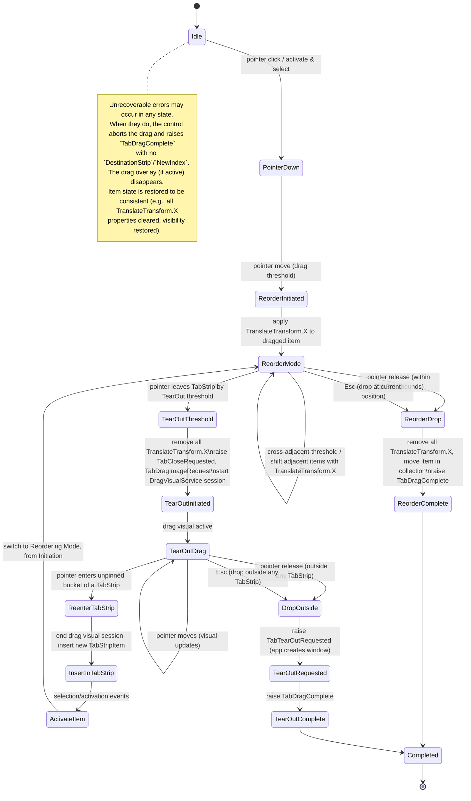
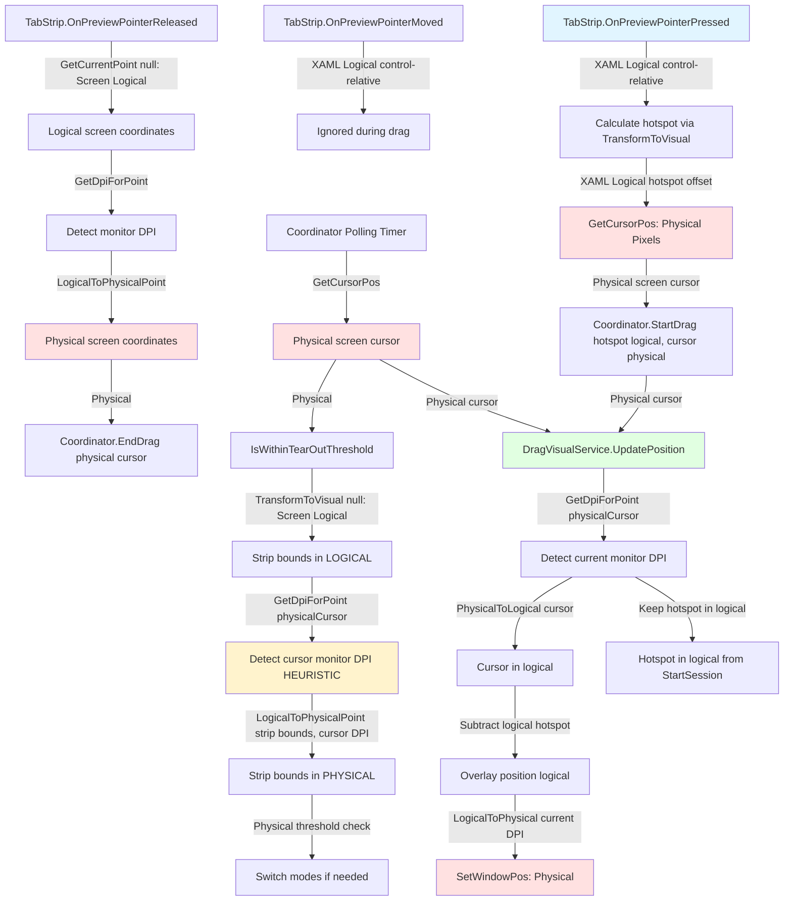

# TabStrip Drag-Drop Specifications

The drag-and-drop behavior in the `TabStrip` control enables intuitive, direct manipulation of `TabStripItem` items
within and across tab strips, including tab strips in other windows.

Its purpose is to support reordering, detachment (TearOut), and reattachment of tabs through pointer gestures, while
preserving logical identity and user context.

This specification defines the interaction model, event surface, and constraints governing drag initiation, visual
feedback, drop targets, and lifecycle coordination.

## Terminology

This specification uses the following terms consistently:

- **Tab** (informal): Generic user-facing concept describing an item in a tab strip.
  In a visual context, this corresponds to a `TabStripItem` in one of the `ItemsRepeater` in a `TabStrip`.
  In a non-visual context, this corresponds to a `TabItem` in the `Items` collection of a `TabStrip`.
- **`TabItem`** (model): The logical data model representing a tab's content and metadata (see `TabItem.cs`).
  All EventArgs use `TabItem` to allow application handlers to work with the model rather than visual controls.
- **`TabStripItem`** (visual control): The visual UI control that renders a single `TabItem` within a `TabStrip`.
- **`TabStrip`** (container): The control that hosts zero or more `TabStripItem` instances.
- **Pinned Tab** (informal): Refers to a `Tab` (informal) that has the `IsPinned` property set to `true`.
- **Unpinned Tab** or **Regular Tab** (informal): Refers to a `Tab` that has the `IsPinned` property set to `true`.
- **Pinned bucket** (informal): Refers to the `ItemsRepeater` in a `TabStrip` that holds the "pinned Tabs".
- **Unpinned bucket** (informal): Refers to the `ItemsRepeater` in a `TabStrip` that holds the "unpinned/regular Tabs".
- **Drag threshold**: Refers to the number of pixels by which the pointer needs to move after the intention to drag is confirmed (e.g. click and hold) to initiate a drag operation.
- **TearOut Threshold**: Refers to the number of pixels by which the pointer needs to be out of a `TabStrip` to consider that the drag should now switch from "Reorder" to "TearOut" mode.
- **Swap Threshold**: Refers to the fraction of a tab item's width that the pointer must cross to trigger a swap with an adjacent item during reordering.

## Behaviors

TabStrip drag/drop is intimately linked with its tab activation behavior. This specification covers
both.

## Tab Activation

Tab activation occurs when a tab is activated via explicit user interaction or programmatically. In
the context of `TabStrip` drag-drop, we only care about pointer-initiated activation (e.g. mouse).

With a pointer (e.g., mouse, touch), tab activation occurs when the user taps or clicks on a tab.
Note that during multiple selection scenarios, clicking a tab to add it to the selection or to
extend the selection up to that tab, will activate the tab as well. But, clicking a tab that is
already selected to exclude it from the selection will not activate the tab.

Because tab dragging will always be initiated with a pointer click, it will always act on an
activated tab, that tab will always be the currently selected item, and in multi-selection
scenarios, initiating the drag will reset the selection to only the tab being dragged.

**Multi-Selection During Drag**: If the application supports multi-selection, any active
multi-selection is cleared when a drag begins. Only the dragged tab remains selected. This ensures a
clear, predictable interaction model: the user is unambiguously dragging a single tab, and can focus
on pointer positioning rather than managing a selection set.

## Drag/Drop

> **NOTE**:
>
> - Pinned tabs cannot be dragged.
> - Dragging a tab into the pinned bucket, does not impact that bucket, and should be visually
>   indicated with a special pointer cursor that represents a 'forbidden/stop/no-way` sign.
> - Dropping a tab into the pinned bucket, is not allowed. If the drag is in "Reordering" mode, the
>   tab is dropped at last valid position. If the drag is in "TearOut" mode, the tab is dropped as
>   if it were out of any `TabStrip`.

We can think of the Drag/Drop operation as two distinct types of interactions:

1. **Reordering**: starts as soon as the tab is dragged within the threshold drag initiation, and
   stop as soon as the pointer leaves the bounds of the `TabStrip` by the TearOut threshold (see
   TearOut below), or the drag completes (successfull drop or not).

   The visual experience is tailored to give the user a feeling of sliding the dragged tab into
   position, and animations are used to show that things slide and fit into place as the drag is
   ongoing and as the drop finally happens.

2. **TearOut**: starts as soon as the tab is dragged out of the `TabStrip` bounds by more than the
   TearOut threshold, and stops as soon as the pointer is within the bounds of a `TabStrip` (the
   original one or another one in a different application window), or the drag completes
   (successfull drop or not). When in "TearOut" mode, entering the legal drop bounds (unpinned
   bucket) of a `TabStrip` should immediately (no threshold) act as if the tab was dropped in the
   `TabStrip`, and switch the mode to "Reordering".

   The visual experience is tailored to give the use a feeling of extracting the tab out of its
   location, freely moving it together with a visual of its content (optional), and then dropping it
   in a new host strip or an existing one. The emphasis is on 'extract' 'free movement' and 'drop'.

A guideline for the implementation is to think `Strategy` pattern, and automatic switching between
`ReorderStrategy` and a `TearOutStrategy` as the conditions to enter/exit the mode become true.

### Esc or Errors during drag/drop

  From the control's perspective, a drag or a drop is always completed — the gesture ends, and the
  pointer is captured/released. `Esc` does not cancel the operation, but instead is interpreted as a
  drop. It is the application's responsibility to handle errors appropriately when they occur inside
  the application. Unrecoverable errors inside the control will abort the operation, the pointer
  will be released, if captured, and the `TabDragComplete` will be triggered even with no target
  `TabStrip` or `NewIndex`. Whenever possible, the control will try to leave its items in a
  consistent state, but does not guarantee that.

### Reordering Flow

From a user experience point of view, here is what happens during a "Reordering" drag/drop
operation:

- **Initial state**: a `TabStripItem` was clicked, is activated and is selected. The item remains
  active and selected through the Reordering flow. We assume the implementation is keeping track of
  which `TabStrip` is currently the subject of this Reordering, and what the target drop index.

- **Drag initiated**: when the drag crosses the drag threshold. Results in the following sequence of
  actions:
  - The dragged item stays in the visual tree at its original position, and a `TranslateTransform.X`
    gets applied to it to keep it positioned under the cursor, with the same offsets as to when it
    was pressed to initiate the drag.
  - The dragged item remains active and selected throughout the drag (so the document content
    doesn't change during reordering).

- **Drag within the `TabStrip`**:
  - The dragged `TabStripItem` follows the cursor, positioned via `TranslateTransform.X` so that the
    **hotspot** (the point where the user clicked) stays under the cursor. This creates the visual
    effect of "holding" the item at the grab point.
  - As the cursor moves horizontally, when it enters by **more than** `SwapThreshold` (fraction of)
    an adjacent item, the item is shifted using smooth ease animations on its `TranslateTransform.X`
    properties to take the spot of the dragged item, and leave its spot empty. This creates the
    impression that items are being pushed aside to make space for the dragged item.
  - The shifted item position prior to the shift, indicate where the dragged item will land if it
    were dropped.
  - If the cursor moves outside the unpinned bucket bounds, no shifting happens, and the current
    visual arrangement stays as-is.

- **Drag out of the `TabStrip`**: at any point in time during the drag operation, the item being
  dragged can leave the `TabStrip` bounds. When this occurs, it will result in a switch from
  "Reordering" mode to "TearOut" mode. The control executes the following sequence:

  1. All `TranslateTransform.X` properties applied to items (dragged item and shifted adjacent
     items) are removed.
  2. `TabCloseRequested` is raised. The application is **expected to** remove the tab's `TabItem`
     from its model/collection; the control does not remove it.
  3. If the handler completes successfully, the drag continues in "TearOut" mode. If the handler
     throws or causes an unrecoverable error, the drag aborts, and `TabDragComplete` is raised with
     `DestinationStrip` = current strip, `NewIndex` = index at which the item was positioned.

- **Drop**: dropping the item over a strip will always happen after the chain of events of "**Drag
  over a `TabStrip`**" has completed. It will:
  1. All `TranslateTransform.X` properties applied to items (dragged item and shifted items) are
     removed.
  2. The dragged item is moved to its new position in the collection.
  3. Release the pointer.
  4. Complete the drag operation and trigger the `TabDragComplete` with `DestinationStrip` = current
     strip, `NewIndex` = index at which the item was dropped (based on the final visual
     arrangement).

### TearOut Flow

From a user experience point of view, here is what happens during a "TearOut" drag/drop operation:

- **Initial state**: a `TabStripItem` has been dragged out of the bounds of its `TabStrip`, and now
  we only have the corresponding `TabItem`.

- **Drag initiated**: when the drag crosses the TearOut threshold. Results in the following sequence
  of actions:
  - Make a `HeaderImage` snapshot of how the `TabStripItem` would render,
  - Raise a `TabDragImageRequest`event to request a `PreviewImage` of the tab content. The
     application may provide a preview via the event args; this is used to enhance the drag visual.
  - Start a new drag session with the `DragVisualService` and keep the `DragSessionToken`.

- **Drag over the Unpinned Bucket of a `TabStrip`**: at any point in time during the drag operation,
  the item being dragged can enter the bounds of a `TabStrip` control, in any same application
  window. If the position of the pointer is over the "Unpinned bucket" of the `TabStrip, the
  following actions will take place:

  - The drag visual session is ended, and the drag visual disappears.
  - A new `TabStripItem` will be added to the `TabStrip`, using the same `TabItem` data as the item
    being dragged. The position of the new item is determined based on where the pointer is
    currently positioned within the `TabStrip`.
  - Once the new item is inserted, it is explicitly activated and selected. Activation events are
    triggered only after layout and visibility are valid. Events related to selection change and
    activation are triggered as usual.
  - The drag operation continues in "Reorderinde Mode", from Initiation, and the pointer is still
    captured.

- **Drop**: because of the two modes of operation, this drop will only happen if the pointer is not
  over the unpinned bucket of any `TabStrip` in the application. It should be considered as a
  request to create a new window and host the dropped tab in a new `TabStrip` in that window. This
  is a complex operation that really does not make sense to be handled by a `TabStrip` control.
  Instead, the control:
  - triggers the `TabTearOutRequested` event, and lets the application easily handle the new window
    creation, and the rest of the operations needed to create a `TabStrip`, add the item to it and
    let it be activated and selected by the control.
  - Complete the drag operation and trigger the `TabDragComplete` with the new `TabStrip` and index
    `0`.

## Pointer Capture & Cross-Window Resilience

- **Capture Scope**: The originating `TabStrip` captures the pointer on the initial `PointerPressed`
  event to track the drag gesture.
- **Capture Release**: Pointer capture is released when the drag completes (on drop), or when the
  gesture is aborted (Esc pressed or unrecoverable error).
- **Cross-Window Dragging**: If the source window closes during an active drag, the pointer capture
  is lost. The `TabDragCoordinator` continues to manage the drag state and visual overlay by polling
  the global cursor position via `GetCursorPos()` and updates the overlay by calling
  `IDragVisualService.UpdatePosition()` until the drag completes or fails.
- **Pointer Delivery Resilience**: Do not assume continuous `PointerMoved` events during
  cross-window drag operations. The coordinator polls the cursor to drive the visual overlay,
  ensuring smooth visual feedback even after pointer capture loss.

## Application Recommendations on TearOut

- Handle `TabCloseRequested` properly from a tabbed document point of view, but in all scenarios,
  the Tab be removed from the `TabStrip`. There is no cancellation of a TearOut, and it is not a
  destructive operation as long as the tab document data model is properly handled by the
  application.

- Consider closing the window (if it makes sense for the application, and in most cases it will)
  when the last item is removed from the `TabStrip` (i.e. Items.Count == 0).

## Events summary

The following table lists the key events raised by `TabStrip` during drag/drop operations, when they are raised, the
suggested EventArgs class name, and the important properties each EventArgs should carry.

| Event | When raised | Suggested EventArgs type | Key EventArgs properties |
|---|---|---:|---|
| `TabDragImageRequest` | When the drag crosses the TearOut threshold and enters TearOut mode. The control requests a document preview to enhance the drag visual. | `TabDragImageRequestEventArgs` | `TabItem Item` · `Windows.Foundation.Size RequestedSize` · `Microsoft.UI.Xaml.Media.ImageSource? PreviewImage` (set by handler) |
| `TabCloseRequested` | When the drag crosses the TearOut threshold (switching from Reordering to TearOut mode). The application is expected to remove the tab from its model/collection. | `TabCloseRequestedEventArgs` | `TabItem Item` |
| `TabDragComplete` | After a drop into a `TabStrip`, or out completes successfully or not — indicates the drag operation finished and the item is "eventually" attached to the destination. | `TabDragCompleteEventArgs` | `TabItem Item` · `TabStrip? DestinationStrip` · `int? NewIndex` |
| `TabTearOutRequested` | When a tab is dropped outside any `TabStrip` — the application should create a new window and host the tab there. | `TabTearOutRequestedEventArgs` | `TabItem Item` · `Windows.Foundation.Point ScreenDropPoint` |

Notes:

- Use the logical model type `TabItem` (see `TabItem.cs`) in EventArgs so handlers can operate on the model rather than
  visual controls.
- There is no cancellation or rejection of a drag or drop operation, and that is why the event args do not contain a
  `Handled` field. We expect most of the events (except for informative ones such as `TabDragComplete`) to be handled at
  one single point of control within the application (recommended).
- Keep `TabDragImageRequest` handlers non-blocking: return a lightweight preview synchronously when possible. If an
  async preview is required, handlers should populate `PreviewImage` quickly with a placeholder that gets filled
  asynchronously.

## Tear-Out Contract & Error Recovery

When the user drops a tab outside any `TabStrip`, the control raises `TabTearOutRequested`. The
application **must** handle this event and create a new window with a new `TabStrip` and host the
dropped `TabItem` there.

**Important Contract**:

- **Handler Responsibility**: The application handler must create the window, add the `TabItem` to a
  `TabStrip`, and manage the lifetime of the new window. If no handler is attached, or the handler
  does nothing, the `TabItem` becomes orphaned (not hosted in any `TabStrip`).
- **Orphaned Items**: Every `TabItem` must exist in exactly one `TabStrip` at all times. If an item
  becomes orphaned (e.g., handler throws or fails to create a window), it is the application's
  responsibility to recover or discard the item.
- **Handler Exceptions**: If the `TabTearOutRequested` handler throws an exception, the control
  catches it, aborts the drag, and raises `TabDragComplete` with `DestinationStrip = null`. The
  application should log the error and attempt recovery (e.g., restoring the item to its original
  `TabStrip` or discarding it).
- **Persistence**: Once `TabTearOutRequested` is raised, the original `TabItem` has been removed
  from its source `TabStrip` (via `TabCloseRequested`). The application must not re-add it to the
  source strip after TearOut failure; instead, create a new `TabItem` or implement a recovery
  strategy suitable for the application.

## State machine diagram

Below is a visual state machine for the TabStrip drag/drop flow. It covers pointer activation,
dragging inside the originating strip, dragging out of the strip (TearOut path), entering another
`TabStrip`, drops, and failure/cancel paths. Event names that the control raises (or expects the
application to handle) are shown on the transitions where they occur.

### Legend / mapping to spec

- Idle — no pointer interaction.
- PointerDown — tab clicked; becomes active and selected. Multi-selection resets to the dragged tab.
- ReorderInitiated — pointer moved beyond drag threshold; enters **Reordering Mode**.
- ReorderMode — pointer remains within TearOut threshold of origin TabStrip. Uses
  `TranslateTransform.X` on dragged item and adjacent items for visual feedback. Crossing adjacent
  items shifts them with smooth animations. No drag visual overlay.
- TearOutThreshold — pointer leaves TabStrip by more than TearOut threshold; switches from
  **Reordering Mode** to **TearOut Mode**. Removes all TranslateTransform properties, raises
  `TabCloseRequested` and `TabDragImageRequest`, starts `DragVisualService` session.
- TearOutInitiated — TearOut mode activated; drag visual overlay (header + optional preview) now
  follows pointer.
- TearOutDrag — drag visual continues; pointer can enter/leave TabStrip bounds. Entering unpinned
  bucket immediately transitions to Reordering Mode.
- ReenterTabStrip — pointer enters unpinned bucket of a TabStrip during TearOut; ends drag visual
  session, inserts item at cursor position, triggers selection/activation events.
- InsertInTabStrip / ActivateItem — new TabStripItem added to destination strip, explicitly
  activated and selected.
- ReorderDrop — pointer released while in Reordering Mode (within TabStrip); removes all
  TranslateTransform properties and moves item to final position, raises `TabDragComplete`.
- DropOutside — pointer released while in TearOut Mode (outside any TabStrip); raises
  `TabTearOutRequested` so app creates window.
- Completed — final state; drag operation finished, all resources cleaned up.
- Unrecoverable errors — can occur from any state; drag aborts, all TranslateTransform properties
  cleared, overlay disappears, `TabDragComplete` raised with no `DestinationStrip`/`NewIndex`.

## Implementation Notes

- **Two-Mode Strategy Pattern**: The implementation should use a strategy pattern with automatic
  switching between `ReorderStrategy` and `TearOutStrategy`:
  - **Reordering Mode** (within threshold): Uses `TranslateTransform.X` on the dragged item and
    adjacent items for lightweight, in-place visual feedback. No overlay; dragging stays contained
    within the source `TabStrip`.
  - **TearOut Mode** (exceeding threshold): Uses `IDragVisualService` to display a floating overlay
    with header and optional preview images. Allows free movement and cross-window drag/drop.

- **Transform Management** (Reordering Mode):
  - Apply `TranslateTransform.X` to dragged item to position it under cursor.
  - Shift adjacent items using `TranslateTransform.X` with smooth animations when drag threshold is
    crossed.
  - Remove all `TranslateTransform.X` properties and commit item position when transitioning to
    TearOut or on drop.

- **Drag Visual Service Session** (TearOut Mode):
  - Session starts when TearOut threshold is exceeded.
  - Session ends when pointer re-enters unpinned bucket of any `TabStrip`.
  - Session must be properly disposed on drop or error.

- **Mode Transition from TearOut to Reordering**:
  - When pointer enters unpinned bucket of a `TabStrip` during TearOut, end the drag visual session.
  - Insert new `TabStripItem` into the destination `TabStrip`.
  - Trigger selection/activation events.
  - Continue in Reordering Mode from Initiation (not from the new item's current state).

- **TabDragCoordinator**: An internal singleton class in the DI container that maintains active drag
  state across all `TabStrip` instances in the same application process.

  Design:
  - Singleton pattern: Only one drag session may exist per process.
  - Maintains state: Currently dragged `TabItem`, source `TabStrip`, hit-test results, and the
    `IDragVisualService` session token.
  - Thread-safety: UI-thread affinity only; no internal locks required (all calls must be from UI
    thread).
  - Resilience: Survives source window closure during cross-window drag by polling the global cursor
    and driving the overlay.
  - The `TabStrip` control should expose dependency properties for injecting the
    `TabDragCoordinator`, similar to how `ILoggerFactory` can be injected into layout managers.
  - Lifecycle: Owns the `IDragVisualService` session and terminates it on successful drop, abort,
    error, or when the coordinator is disposed.
  - Notification: Notifies all `TabStrip` instances in the process of enter/leave/drop events to
    coordinate multi-strip drag operations.

- Cross-window drag image and pointer capture: WinUI 3 doesn't provide one-shot, cross-window custom
  overlays automatically; we must either use native OS drag/drop or manage per-window overlays and
  coordinate them. For same-process windows we can coordinate via an in-process shared service
  `IDragVisualService`.

- A boolean IsDragging read-only DP on TabStripItem for template bindings (so templates can
  animate/hide things).

- A DragImage type/utility to display a floating drag image (Popup/Canvas layered in AppWindow or in
  an overlay in the window origin of the drag, whichever makes more sense and is more idiomatic to
  implement in the context of a WinUI 3 app).

## Error Handling & User Experience

### Unrecoverable Control Errors

Errors originating within the `TabStrip` control or `TabDragCoordinator` that prevent drag
completion (e.g., out of memory, catastrophic service failure):

- **Visual Feedback**:
  - In **Reordering Mode**: All `TranslateTransform.X` properties on dragged and adjacent items are cleared.
  - In **TearOut Mode**: Drag visual overlay disappears immediately.
- **Pointer State**: Pointer capture is released.
- **Item State**: The originally dragged `TabStripItem` is restored to be visible in its original position.
- **Event Raised**: `TabDragComplete` is raised with `DestinationStrip = null` and `NewIndex = null`.
- **Application Recovery**: The application may detect this state via the null `DestinationStrip`
  and implement error logging, retry, or rollback logic as appropriate.

### Application Errors

Errors thrown by application event handlers (`TabDragImageRequest`, `TabCloseRequested`,
`TabTearOutRequested`):

- **Handling**: The control catches these exceptions; the application does not crash.
- **Propagation**: Treated as unrecoverable; the drag aborts (see above).
- **Responsibility**: The application is responsible for error logging and telemetry. Consider
  logging in handlers before raising exceptions.

### Resilience Best Practices

1. **Defensive Handlers**: Handlers should complete quickly and avoid throwing. If async work is
   required (e.g., `TabDragImageRequest` with async preview generation), return a placeholder
   synchronously and fill it asynchronously.
2. **Tear-Out Error Recovery**: If `TabTearOutRequested` handler fails, the application should
   attempt to recover the `TabItem` (e.g., create a fallback window or discard the item gracefully).
3. **State Assertions**: After `TabDragComplete` with `DestinationStrip = null`, verify that all
   related items and windows are in a consistent state.

## The drag visual service

The drag visual service (`IDragVisualService`) is a minimal, process-owned component responsible for
presenting a single floating overlay that follows the pointer during tab drag operations. At most
one drag visual session may exist per application process; attempting to start a new session while
another is active will throw an `InvalidOperationException`. This design ensures simple, robust
session lifetime management and disposal.

### Requirements

| # | Requirement | Notes |
|---|---|---|
| 1 | **Single Active Session** | Only one session per process. `StartSession` throws `InvalidOperationException` if a session exists. |
| 2 | **Session Ownership & Lifecycle** | Service owns all resources; caller holds only the token. Call `EndSession(token)` to complete. Service disposal terminates any active session. |
| 3 | **UI-Thread Affinity** | All API calls must be from the UI thread. Implementations may assume this and avoid internal marshalling. |
| 4 | **Pointer Tracking & Coordinate Contract** | Caller drives overlay via `UpdatePosition(token, screenPoint)` as pointer moves. `screenPoint` is always in **physical screen pixels** (from `GetCursorPos`). Service performs all DPI conversions internally using `GetDpiForPoint(screenPoint)` to detect current monitor DPI, ensuring correct behavior when cursor crosses monitors with different scaling. |
| 5 | **Descriptor Mutability** | Live descriptor obtained via `GetDescriptor(token)` is valid only for session lifetime. Mutations from UI thread auto-update the overlay. |
| 6 | **Click-Through Overlay** | Set `WS_EX_NOACTIVATE` and `WS_EX_TRANSPARENT` on the overlay HWND (via P/Invoke to `SetWindowLongPtr`). Alternatively, set XAML root's `IsHitTestVisible = false` (but may not provide full OS-level click-through). |
| 7 | **Pointer Delivery Resilience** | Do not rely on originating window for pointer events. If events stop (e.g., source window closes), poll global cursor and continue calling `UpdatePosition` until drag completes. |
| 8 | **DPI & Placement** | Service handles mapping physical pixels to AppWindow placement and per-monitor DPI for correct on-screen positioning. |
| 9 | **Layout** | Service measures and arranges overlay: `Width = max(header width, preview width)`, `Height = header height + preview height` (or implementer's choice). |
| 10 | **Cleanup & Resource Management** | Unsubscribe from descriptor notifications and free all resources when `EndSession(token)` is called or service is disposed. |

### Coordinate System & DPI Scaling Architecture

The drag visual system uses **three coordinate spaces**:

1. **XAML Logical Pixels (DIPs)**: WinUI control-relative coordinates (e.g., pointer position within
   TabStrip)
2. **Screen Logical Pixels**: Desktop-relative logical coordinates (96 DPI baseline, returned by
   `TransformToVisual(null)`)
3. **Screen Physical Pixels**: Device-dependent screen coordinates (actual monitor pixels, returned
   by Win32 `GetCursorPos`)

#### Coordinate System Ownership (The Contract)

**TabStrip (XAML Logical Space)**:

- **Owns**: All XAML control-relative coordinates from pointer events (`PointerPressed`,
  `PointerMoved`, `PointerReleased`)
- **Receives**: `PointerRoutedEventArgs.GetCurrentPoint(this)` returns control-relative logical
  pixels
- **Produces**:
  - Hotspot offset (logical pixels, calculated via `TransformToVisual` between header and TabStrip)
  - Screen-relative logical coordinates via `TransformToVisual(null)` which returns
    **desktop-relative DIPs**
- **Conversions**:
  - `OnPreviewPointerReleased`: Converts screen logical → screen physical using
    `Native.LogicalToPhysicalPoint(logicalScreenPoint, dpi)`
  - **CRITICAL**: Must convert to physical before passing to `TabDragCoordinator.EndDrag()` because
    coordinator only accepts physical coordinates

**TabDragCoordinator (Physical Screen Space)**:

- **Owns**: All cross-window, monitor-aware drag coordination in **physical screen pixels**
- **Receives**: Physical screen coordinates from:
  - `StartDrag(hotspot in logical, cursor in physical from GetCursorPos)`
  - `EndDrag(cursor in physical)` — caller MUST convert from logical to physical first
  - Polling timer calls `GetCursorPos()` → physical screen pixels
- **Stores**:
  - `dragStartCursor_` in physical pixels
  - Hotspot in logical pixels (passed to `DragVisualService` which performs its own conversions)
- **Conversions**:
  - `IsWithinTearOutThreshold`: Converts **screen logical** strip bounds (from
    `TransformToVisual(null)`) to **physical** using cursor DPI heuristic
  - **HEURISTIC LIMITATION**: Uses `GetDpiForPoint(physicalCursor)` to convert strip bounds because:
    1. `TransformToVisual(null)` returns **logical** coordinates (not physical)
    2. We need monitor DPI to convert logical → physical
    3. `GetDpiForPoint` requires **physical** coordinates to detect monitor
    4. We use cursor's physical position as proxy to detect "current monitor DPI"
    5. **Works correctly when strip and cursor are on same monitor** (common case)
    6. **May fail when strip is on different monitor than cursor** (rare edge case during
       cross-monitor drag)
- **Guarantees**: All threshold checks happen in physical pixels for consistent behavior across
  monitors

**DragVisualService (Mixed: Receives Physical, Outputs Physical, Uses Logical Internally)**:

- **Owns**: Overlay positioning in physical screen pixels for Win32 `SetWindowPos`
- **Receives**:
  - `StartSession(descriptor, hotspot)`: Hotspot in **logical pixels** (XAML coordinate space)
  - `UpdatePosition(token, screenPoint)`: Cursor in **physical screen pixels** (from `GetCursorPos`)
- **Stores**:
  - Hotspot in logical pixels (never converted during session)
  - Overlay position computed in physical pixels
- **Conversions** (all internal):
  - On **every** `UpdatePosition` call:
    1. `GetDpiForPoint(physicalCursor)` → detect current monitor DPI
    2. `PhysicalToLogicalPoint(physicalCursor, currentDpi)` → cursor in logical
    3. `PhysicalToLogicalPoint(hotspotPhysical, currentDpi)` → hotspot in logical (if stored as
       physical)
    4. OR keep hotspot in logical throughout (simpler)
    5. Compute overlay position: `logicalCursor - logicalHotspot`
    6. `LogicalToPhysicalPoint(overlayLogical, currentDpi)` → physical for Win32
- **Guarantees**: Overlay stays pixel-perfect aligned with cursor across monitors with different DPI
  scaling

#### Data Flow Diagram

**Legend**:

- 🔵 Blue: XAML Logical Space (TabStrip)
- 🔴 Red: Physical Screen Space (Win32, GetCursorPos)
- 🟢 Green: DragVisualService (receives physical, converts internally)
- 🟡 Yellow: Heuristic/Approximation (cursor DPI proxy)

#### Critical Conversion Points

| Location | Input | Output | Method | Notes |
|----------|-------|--------|--------|-------|
| `TabStrip.OnPreviewPointerReleased` | Screen logical (from `GetCurrentPoint(null)`) | Screen physical | `Native.LogicalToPhysicalPoint(point, dpi)` | **MUST** convert before calling `EndDrag`. Use `GetDpiForPoint` on logical point to detect monitor DPI. |
| `TabDragCoordinator.IsWithinTearOutThreshold` | Screen logical strip bounds (from `TransformToVisual(null)`) | Screen physical | `Native.LogicalToPhysicalPoint(point, cursorDpi)` | **HEURISTIC**: Uses cursor DPI to convert strip bounds. Works when strip and cursor are on same monitor. |
| `DragVisualService.UpdatePosition` | Screen physical cursor (from `GetCursorPos`) | Screen physical overlay position | Internal: `PhysicalToLogical` → compute → `LogicalToPhysical` | Service detects current monitor DPI via `GetDpiForPoint(physicalCursor)` and performs all conversions. |

#### Multi-Monitor Behavior & Limitations

**Scenario 1: Drag within single monitor** ✅

- Strip on Monitor A (150% DPI)
- Cursor stays on Monitor A
- Result: All conversions use Monitor A's DPI → **Works perfectly**

**Scenario 2: Drag from Monitor A to Monitor B (cursor moves)** ✅

- Strip on Monitor A (150% DPI), cursor moves to Monitor B (100% DPI)
- `DragVisualService` detects DPI change via `GetDpiForPoint(physicalCursor)` on each update
- Overlay re-scales smoothly to match new monitor → **Works perfectly**

**Scenario 3: Strip spans monitors or strip on different monitor than cursor** ⚠️

- Strip on Monitor A (150% DPI), cursor on Monitor B (100% DPI)
- `IsWithinTearOutThreshold` uses cursor DPI (100%) to convert strip bounds
- Strip bounds calculated with wrong DPI → threshold check may fail
- Result: May incorrectly switch to TearOut mode → **Heuristic limitation**
- **Workaround**: Use `MonitorFromWindow(stripHwnd)` + `GetDpiForMonitor` to get true strip monitor DPI
- **Current Status**: Accepted limitation; rare edge case in practice
