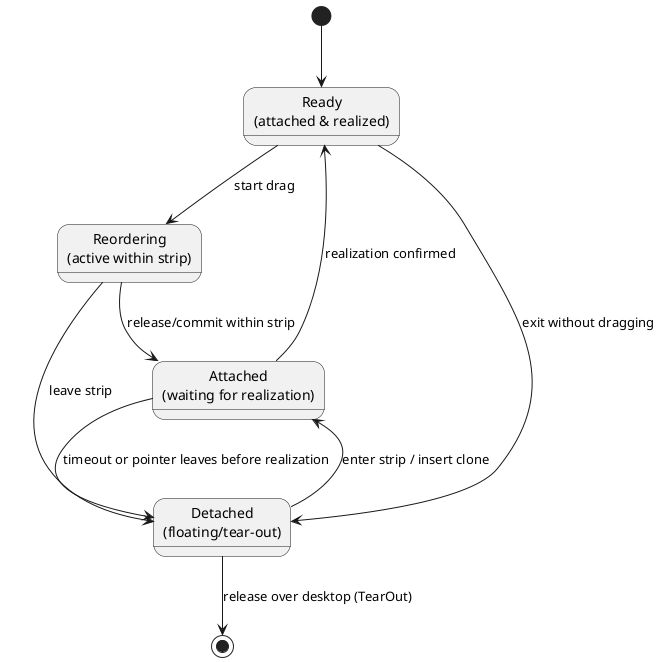

# TabStrip Drag & Drop Implementation Review

## Executive summary

The TabStrip drag-and-drop coordinator is well structured, but the implementation contains a few
critical flaws that make tear-out and drop-back fragile under realistic asynchronous conditions. The
two highest-priority problems are:

- A fundamental object-identity issue when tearing out items (same object instance reused while the
  app removes it asynchronously).
- Premature context updates: the coordinator claims an item is "attached" before the UI
  (ItemsRepeater) has realized the container.

Fixing the identity issue and introducing an explicit, simple state model eliminates most other
symptoms (stale indices, double removals, and brittle edge cases).

---

## Critical issue — object identity & transactional semantics

Problem in one sentence:

When tearing out a tab the coordinator reuses the original tab object while the application removes
that same object asynchronously. If the user drops back before removal completes the coordinator
inserts the same object again, producing duplicate references, broken reference-equality tracking,
and index corruption.

Why this matters:

- The app and the coordinator operate concurrently: app handlers (CloseTab/TearOutTab) mutate the
  Items collection asynchronously, while the coordinator performs insert/remove decisions
  immediately.
- The coordinator also updates its context state (claims "attached") immediately after InsertItemAt,
  even though ItemsRepeater may not yet have produced a realized container. That causes further race
  conditions when the user moves between strips during the realization window.

Root cause (concise):

The implementation assumes single-object semantics and synchronous layout. In reality: removal from
source is async, item realization is async, and collection mutations happen between these phases.
The code uses cached indices and premature context updates, producing races.

---

## Clear, minimal solution (no code changes here — design only)

Goal: eliminate identity races and avoid claiming "attached/ready" before UI confirmation.

Principles:

1. Break top-level reference identity for the dragged payload during tear-out. Use a clone/wrapper
   for coordinator operations.
2. Use content-based equality for collection reconciliation (implement `IEquatable<IDragPayload>`
   based on a stable ContentId), so Items.IndexOf(clone) finds matching content even when references
   differ.
3. Introduce an explicit, minimal state model to avoid premature context updates and enable
   deterministic handling of pending insertions.

State model (simple and explicit):

- Ready — item is attached to a strip, container realized; can start reordering.
- Reordering — actively dragging within a strip.
- Detached — item is torn out (clone created) and floating; not in any strip's collection.
- Attached — the clone (or an item moved by a commit/reorder) has been inserted in a strip's
  Items collection but the container is not yet confirmed realized (this is the WAIT state; only
  after realization does the phase become Ready).

Canonical transitions (user-focused):

Notes:

- The Attached state is intentionally distinct: the clone is already in the strip's Items
  collection, but the coordinator must not claim the tab is "ready for reordering" until the UI has
  produced the container. That separation prevents premature index-based operations.
- The Detached state persists while the user hovers over desktop or moves between strips; it
  represents a stable floating state.

Operational rules (what coordinator must do):

1. On tear-out: call payload.ShallowClone(); use the clone for all subsequent coordinator
   insert/remove operations. Rely on IEquatable(ContentId) for Items.IndexOf.
2. On insertion into a target strip: insert the clone, create a small pending record (target strip,
   clone reference, insertion timestamp), and set phase = Attached. Do not update the coordinator's
   "active strip"/"ready" flag yet.
3. Poll (or observe) the ItemsRepeater snapshots; when the clone or committed change has a
  realized container, clear the pending record and set phase = Ready and update active strip/index.
4. If realization does not complete within a short timeout (recommendation: 500 ms), remove the
   clone using Items.IndexOf(clone) and revert to Detached.
5. If the pointer moves to another strip while Attached and before realization, remove the clone via
  Items.IndexOf(clone) and restart insertion for the new strip (Attached → Detached → Attached
  transition).

Note: the same Attached handshake applies when a reorder is committed inside the same strip. A
reorder commit inserts/moves the item in the Items collection; the coordinator should treat that as
an Attached transition (commit recorded) and only set Ready after the ItemsRepeater reports the
container realized and the visual state matches the logical index. This avoids races where the
collection has changed but the UI hasn't yet produced a realized container for the moved item.

Why this resolves the core issues:

- Cloning prevents the same object instance from existing in multiple logical roles simultaneously.
- Equality-by-Content lets the coordinator and app reconcile items semantically while avoiding
  reference-equality pitfalls.
- Explicit Attached state prevents changing the coordinator's authoritative host until the UI
  confirms readiness.

---

## Secondary issues and concise remediation notes

- Hotspot offsets: initialize defensively (default Point(0,0)) to avoid assertion failures when
  event sequences are unusual.
- Exception handling: do not swallow errors from app handlers silently; ensure coordinator state is
  cleaned up in finally blocks when handlers throw.
- Drop index resolution: centralize final index selection in one method with clear priority
  (strategy result → current context if Ready → -1/failure). Add unit tests.
- Pointer capture: ensure pointer capture is released on all abort paths; propagate abort to
  originating strip if needed.
- Spatial mapper: validate mapper/strip consistency; avoid calling UpdateCurrentStrip(tabStrip:
  null, staleMapper).
- Hit-testing: prefer topmost window/strip by Z-order when multiple strips overlap.
- Polling perf: reduce to 60Hz or early-exit when pointer unchanged; cache per-strip mappers.
- Collection-change suppression: ensure all collection mutations are executed on the UI thread and
  guard reentrancy via a robust pattern, not a fragile flag.

---

## Edge cases to test (high priority)

1. Tear-out then immediate drop-back into the same strip before app removal completes.
2. Rapid enter/leave between multiple strips during Attached phase (pending realization).
3. Source strip window closes during an active drag.
4. Release pointer outside any window (desktop) and app fails to create tear-out window.

---

## Recommendations (priority)

1. Implement payload cloning during tear-out (IDragPayload.ShallowClone) and
   `IEquatable<IDragPayload>` based on ContentId. This is the critical fix.
2. Add explicit phase tracking (Ready, Reordering, Detached, Attached) and enforce the
   Attached→Ready realization handshake.
3. Implement Attached timeout (≈500 ms) and deterministic fallback (remove clone and remain
   Detached).
4. Consolidate drop-index logic and add unit/integration tests covering the edge cases above.
5. Add robust logging for state transitions and timeline tracing to aid debugging.

---

## Conclusion

Fixing object identity and avoiding premature "attached/ready" claims will remove the majority of
observed failures. The rest of the issues (indexing, transforms, polling load) are consequences of
these two root causes and will become straightforward to fix once the coordinator and payload
semantics are clarified.

If you'd like, I can now (with your approval) produce a minimal patch that updates the review to
include any additional project-specific constraints or produce a compact checklist for implementing
the changes in code — but I will not modify any source files unless you explicitly ask.
