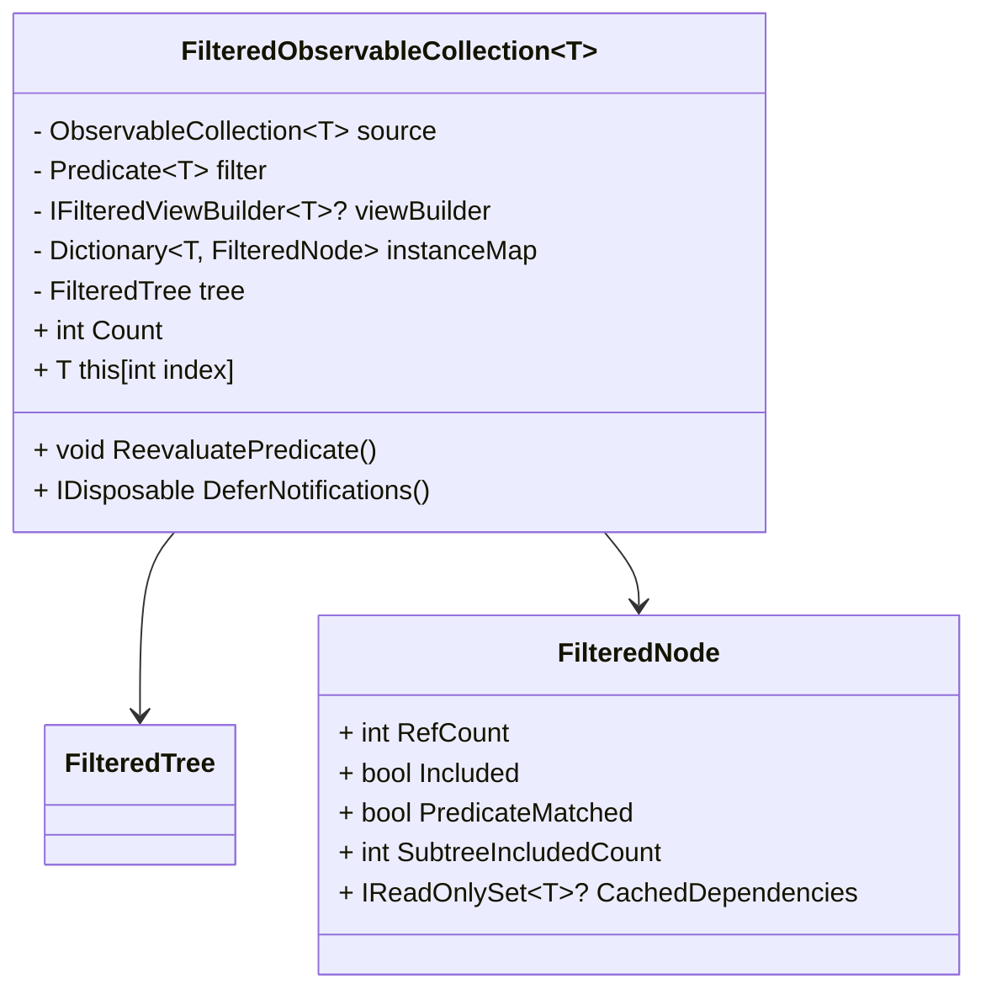
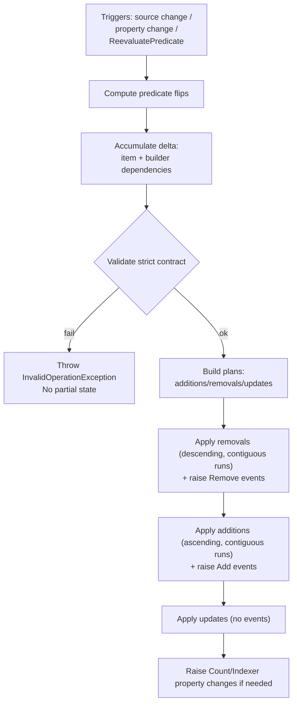

# FilteredObservableCollection — Builder-Driven Delta Filtering (Strict Mode)

This document describes the “strict” builder-driven mode of `FilteredObservableCollection<T>`.

In strict mode, the collection maintains a filtered projection over a source `ObservableCollection<T>` and allows a small “delta builder” (`IFilteredViewBuilder<T>`) to express *dependent inclusions* (for example: include ancestors when a descendant matches). The implementation applies the resulting changes as minimal incremental deltas (adds/removes in contiguous runs) and avoids `Reset` spam during normal operation.

## Goals

- Incremental updates (no full rebuilds for typical changes).
- Stable UI behavior: at every `CollectionChanged` event, `Count` and the indexer reflect the just-applied mutation.
- Support “closure” scenarios that cannot be represented by a stateless predicate alone (lineage, grouping headers, structural scaffolding).
- Strict contract validation: builder mistakes fail loudly.

## Non-goals

- Thread safety.
- Automatically inferring dependencies from the source.
- Supporting builder output that contains value-equal but non-identical objects.

## Public surface

Strict mode is enabled by creating the view with a builder:

```csharp
var view = FilteredObservableCollectionFactory.FromBuilder(
  source,
  predicate,
  viewBuilder,
  options);
```

The builder contract is:

```csharp
public interface IFilteredViewBuilder<T>
{
  IReadOnlySet<T> BuildForChangedItem(T changedItem, bool becameIncluded, IReadOnlyList<T> source);
}
```

## Builder contract (strict)

When `changedItem` flips its predicate result, the collection:

1) applies the trigger’s own reference-count change for `changedItem`, and
2) asks the builder for additional dependent items that should follow that change.

Semantics:

- `becameIncluded == true`: returned items are treated as “also include” dependencies (their refcount is incremented).
- `becameIncluded == false`: returned items are treated as “also exclude” dependencies (their refcount is decremented).

Validation rules:

- Every item returned by the builder MUST be an *exact instance* that exists in the source instance map (reference identity). Returning equal-but-distinct objects is a contract violation.
- The returned set MUST contain no duplicates (use of `IReadOnlySet<T>` implies uniqueness).

Important behavioral note:

- The collection always applies the trigger’s change for `changedItem` independently of the returned set.
- Builders should therefore avoid returning `changedItem` itself (doing so would double-apply the change).

Failure behavior:

- Any contract violation throws `InvalidOperationException`.
- The operation aborts without applying partial mutations.

## Internal model

Internally, the view keeps:

- A reference-identity `instanceMap` from `T` to a node that stores:
  - `RefCount`: inclusion reference count
  - `PredicateMatched`: last predicate result for this node
  - `CachedDependencies`: (optional) cached builder dependencies for “include” transitions
- A `FilteredTree` (order-statistic tree) that represents the source order and supports:
  - `$O(\log n)$` insert/remove
  - `$O(\log n)$` rank/select over the *included* nodes via an augmented `SubtreeIncludedCount`

Conceptually:



## Update pipeline (two-phase, interleaved apply)

To keep UI controls stable, the implementation does not “compute everything then fire events later”. Instead it computes a plan, validates it, then *applies mutations interleaved with events* so that collection state always matches the event stream.

### Phase 1: Plan (compute + validate)

For a batch of triggers (source changes and/or property changes):

1) Evaluate predicate changes (`PredicateMatched`) for the affected items.
2) For each predicate flip:
   - Accumulate a delta entry for the triggering item.
   - Query the builder for dependency items and accumulate their delta entries.
3) Validate:
   - Every delta item exists in `instanceMap`.
   - No refcount underflow (`newRefCount < 0`).
   - Builder outputs are exact instances tracked by the view.

### Phase 2: Do (apply with consistent indices)

The delta is turned into three groups:

- **Removals**: items where `WasIncluded == true` and `IsIncluded == false`
- **Additions**: items where `WasIncluded == false` and `IsIncluded == true`
- **Updates**: refcount changes that do not change inclusion

Application order:

1) Apply removals in descending *filtered* index, grouped into contiguous runs.
2) Apply additions in ascending *source* order, grouped into contiguous runs.
3) Apply updates (no events).

Key invariant:

- For every `NotifyCollectionChangedEventArgs` raised, the mutation is applied *before* raising the event, so `Count` and indexing match what the UI expects.



## Notifications

- Normal operation emits only `Add`/`Remove`/`Move` deltas (grouped into contiguous runs). It does not emit `Reset` for routine changes.
- `DeferNotifications()` is intentionally different: it suppresses intermediate events and then rebuilds on dispose, which may raise a `Reset`.

## When to call ReevaluatePredicate()

Use `ReevaluatePredicate()` when your predicate depends on *external state* that changed (for example, a search string stored on the view model).

- This re-checks the predicate for all source items and applies the required delta incrementally (no full rebuild under normal conditions).

## WinUI 3 example: lineage/ancestor closure + enable/disable filtering

This example shows a typical strict-mode use-case: flatten a tree into a list, then filter by text while keeping ancestor lineage visible for matching descendants.

Key idea:

- Predicate decides which nodes “self-match”.
- Builder adds/removes ancestors as dependencies when a node enters/leaves the match set.

### Model

```csharp
using System.Collections.ObjectModel;
using System.ComponentModel;
using System.Runtime.CompilerServices;
using System.Runtime.InteropServices;
using DroidNet.Collections;

public sealed class TreeNode : INotifyPropertyChanged, IEquatable<TreeNode>
{
  private string name;

  public TreeNode(string name, TreeNode? parent = null)
  {
    this.name = name;
    this.Parent = parent;
  }

  public TreeNode? Parent { get; }

  public string Name
  {
    get => this.name;
    set
    {
      if (this.name == value)
      {
        return;
      }

      this.name = value;
      this.PropertyChanged?.Invoke(this, new PropertyChangedEventArgs(nameof(this.Name)));
    }
  }

  public event PropertyChangedEventHandler? PropertyChanged;

  public bool Equals(TreeNode? other) => ReferenceEquals(this, other);
  public override bool Equals(object? obj) => obj is TreeNode other && this.Equals(other);
  public override int GetHashCode() => RuntimeHelpers.GetHashCode(this);
}

public sealed class AncestorClosureBuilder : IFilteredViewBuilder<TreeNode>
{
  public IReadOnlySet<TreeNode> BuildForChangedItem(TreeNode changedItem, bool becameIncluded, IReadOnlyList<TreeNode> source)
  {
    // Return only dependencies (not changedItem itself).
    var deps = new HashSet<TreeNode>(ReferenceEqualityComparer.Instance);
    for (var p = changedItem.Parent; p is not null; p = p.Parent)
    {
      deps.Add(p);
    }

    return deps;
  }
}
```

### ViewModel (toggle filtering with predicate null/non-null)

```csharp
using System.Collections.ObjectModel;
using System.ComponentModel;
using System.Runtime.CompilerServices;
using DroidNet.Collections;

public sealed class MainViewModel : INotifyPropertyChanged, IDisposable
{
  private readonly ObservableCollection<TreeNode> source;
  private readonly AncestorClosureBuilder builder = new();
  private FilteredObservableCollection<TreeNode>? filtered;

  private string searchText = string.Empty;
  private bool isFilteringEnabled;

  public MainViewModel(ObservableCollection<TreeNode> source)
  {
    this.source = source;
    this.ItemsView = source;
  }

  public event PropertyChangedEventHandler? PropertyChanged;

  public IEnumerable<TreeNode> ItemsView { get; private set; }

  public string SearchText
  {
    get => this.searchText;
    set
    {
      if (this.searchText == value)
      {
        return;
      }

      this.searchText = value;
      this.OnPropertyChanged();

      // External input changed: ask the view to re-check the predicate.
      this.filtered?.ReevaluatePredicate();
    }
  }

  public bool IsFilteringEnabled
  {
    get => this.isFilteringEnabled;
    set
    {
      if (this.isFilteringEnabled == value)
      {
        return;
      }

      this.isFilteringEnabled = value;
      this.OnPropertyChanged();

      this.UpdateFiltering();
    }
  }

  private Predicate<TreeNode>? CurrentPredicate
    => this.IsFilteringEnabled
      ? node => node.Name.Contains(this.SearchText, StringComparison.OrdinalIgnoreCase)
      : null;

  private void UpdateFiltering()
  {
    // Disable
    if (this.CurrentPredicate is null)
    {
      this.filtered?.Dispose();
      this.filtered = null;
      this.ItemsView = this.source;
      this.OnPropertyChanged(nameof(this.ItemsView));
      return;
    }

    // Enable
    this.filtered?.Dispose();

    var opts = new FilteredObservableCollectionOptions();
    opts.ObservedProperties.Add(nameof(TreeNode.Name));

    this.filtered = FilteredObservableCollectionFactory.FromBuilder(
      this.source,
      this.CurrentPredicate,
      this.builder,
      opts);

    this.ItemsView = this.filtered;
    this.OnPropertyChanged(nameof(this.ItemsView));
  }

  public void Dispose()
  {
    this.filtered?.Dispose();
    this.filtered = null;
  }

  private void OnPropertyChanged([CallerMemberName] string? name = null)
    => this.PropertyChanged?.Invoke(this, new PropertyChangedEventArgs(name));
}
```

### WinUI 3 XAML (binding)

```xml
<StackPanel Spacing="8">
  <ToggleSwitch
    Header="Enable filtering"
    IsOn="{x:Bind ViewModel.IsFilteringEnabled, Mode=TwoWay}" />

  <TextBox
    Header="Search"
    Text="{x:Bind ViewModel.SearchText, Mode=TwoWay, UpdateSourceTrigger=PropertyChanged}" />

  <ListView ItemsSource="{x:Bind ViewModel.ItemsView, Mode=OneWay}">
    <ListView.ItemTemplate>
      <DataTemplate x:DataType="local:TreeNode">
        <TextBlock Text="{x:Bind Name}" />
      </DataTemplate>
    </ListView.ItemTemplate>
  </ListView>
</StackPanel>
```

## Practical checklist

- Builders must return *exact source instances*.
- Builders should return only *dependencies* (not the trigger itself).
- Use `ObservedProperties` for item-property-driven filtering.
- Call `ReevaluatePredicate()` when external inputs to the predicate change.
