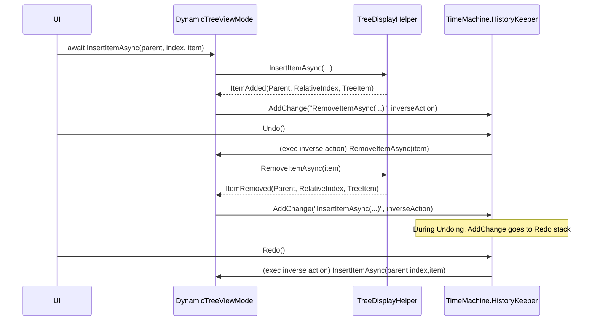
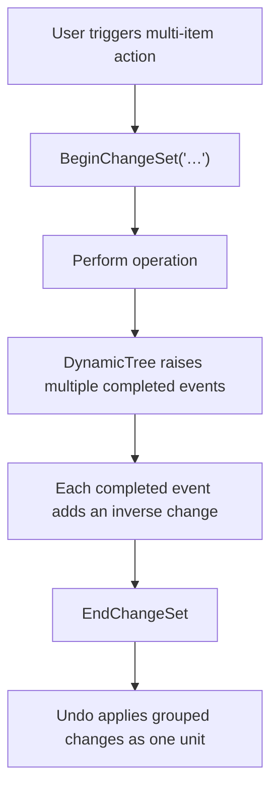

# Undo / Redo for DynamicTree

This document describes how to implement robust Undo/Redo for applications built on top of `DynamicTree` and `DynamicTreeViewModel`.

The guidance here is intentionally strict and event-driven:

- Treat DynamicTree as the *source of truth* for successful mutations.
- Record undo/redo at the **completed mutation events** (`ItemAdded`, `ItemRemoved`, `ItemMoved`).
- Store and replay **logical tree operations** (insert/remove/move), not UI/visual operations.

The examples use `DroidNet.TimeMachine` (the `UndoRedo` / `HistoryKeeper` API), but the same principles apply to any undo engine.

---

## 1. Conceptual Model

DynamicTree operations are asynchronous and may be vetoed (e.g., locked items, invalid parents). This creates a key requirement:

> Only record undo information *after* you know the operation actually happened.

DynamicTree already provides that boundary via events:

- **Veto / validation events** (do not record undo here):
  - `ItemBeingAdded`
  - `ItemBeingRemoved`
  - `ItemBeingMoved`
- **Completed mutation events** (record undo here):
  - `ItemAdded`
  - `ItemRemoved`
  - `ItemMoved`

### 1.1 Why event-driven recording?

When you request a mutation (insert/remove/move), DynamicTree may:

- clamp the requested index,
- auto-expand parents,
- refuse the operation due to constraints,
- transform a batch move plan.

The **completed event args** contain the *actual* parent and index that were used.

---

## 2. Index Semantics (Critical)

DynamicTree uses **child indices**, not visual indices.

### 2.1 Child indices vs `ShownItems` indices

- `ShownItems` is the *visible* flattened list; it depends on expansion/collapse state.
- Mutation event args (`RelativeIndex`, `PreviousIndex`, `NewIndex`) refer to the item's position in its parent’s **children collection** (`ITreeItem.Children`).

**Rule:** Never record `ShownItems.IndexOf(...)` for undo/redo.

### 2.2 Move index semantics (pre-detach insertion point)

For moves/reorders, the destination index is treated as an **insertion point in the target parent’s current children list**, before any moved items are detached.

This matters for same-parent reorders:

- If you remove an item from the list first, its “final index” may shift.
- DynamicTree internally compensates to avoid off-by-one errors.

**Rule:** For undo/redo, prefer `MovedItemInfo.PreviousIndex` and `MovedItemInfo.NewIndex` from the `ItemMoved` event.

---

## 3. Recommended Recording Strategy

### 3.1 Record the *inverse* operation

DynamicTree is imperative: you mutate it with calls like `InsertItemAsync`, `RemoveItemAsync`, `MoveItemAsync`.

For undo/redo, record the inverse operation:

| Completed event | What just happened | Record as the undo action |
|---|---|---|
| `ItemAdded` | item inserted under parent at index | remove that item |
| `ItemRemoved` | item removed from parent at index | insert that item back at that index |
| `ItemMoved` | item moved from old parent/index to new parent/index | move it back to old parent/index |

### 3.2 Let the undo engine build redo automatically

If you use `DroidNet.TimeMachine`, you do **not** need to manually create both “undo” and “redo” actions.

Instead:

1. On each successful mutation, add a “change” that performs the inverse action.
2. When undo runs, the tree mutates again, and your mutation handlers add inverse actions.
3. Because `HistoryKeeper` is in the `Undoing` state, those inverse actions are pushed onto the **redo stack** automatically.

This yields a reliable “record inverse while executing” loop.

---

## 4. Flow Diagrams

### 4.1 Insert → Undo → Redo loop



### 4.2 Batch operation grouping



---

## 5. Implementation Steps

### 5.1 Choose an undo root

Pick an object that represents a “document” or “edit session”. For apps with multiple documents, use a separate root per document.

```csharp
private HistoryKeeper History => UndoRedo.Default[this]; // root = this VM
```

### 5.2 Subscribe to completed mutation events

```csharp
public ProjectTreeViewModel()
{
 this.ItemAdded += this.OnItemAdded;
 this.ItemRemoved += this.OnItemRemoved;
 this.ItemMoved += this.OnItemMoved;
}
```

### 5.3 Record inverse operations (examples)

#### Add → record Remove

```csharp
private void OnItemAdded(object? sender, TreeItemAddedEventArgs e)
{
 this.History.AddChange(
  $"RemoveItemAsync({e.TreeItem.Label})",
  () => this.RemoveItemAsync(e.TreeItem).GetAwaiter().GetResult());
}
```

#### Remove → record Insert

```csharp
private void OnItemRemoved(object? sender, TreeItemRemovedEventArgs e)
{
 this.History.AddChange(
  $"InsertItemAsync({e.TreeItem.Label})",
  () => this.InsertItemAsync(e.RelativeIndex, e.Parent, e.TreeItem).GetAwaiter().GetResult());
}
```

#### Move/Reorder → record move back

```csharp
private void OnItemMoved(object? sender, TreeItemsMovedEventArgs e)
{
 foreach (var move in e.Moves)
 {
  this.History.AddChange(
   $"MoveItemAsync({move.Item.Label})",
   () => this.MoveItemAsync(move.Item, move.PreviousParent, move.PreviousIndex)
    .GetAwaiter().GetResult());
 }
}
```

**Tip:** for batch moves within the same parent, apply ordering carefully to avoid index-shift artifacts. If you use `TimeMachine.ChangeSet`, remember it applies in reverse-add order.

---

## 6. Grouping Multi-step Commands

User commands often cause multiple mutations (and thus multiple events). Presenting those as “one undo step” is typically the desired UX.

Use `HistoryKeeper.BeginChangeSet(key)` / `EndChangeSet()` around the *command*.

Examples that usually warrant a change set:

- Delete multiple selected items
- Paste multiple copied items
- Batch move (drag multiple items)

```csharp
this.History.BeginChangeSet("Remove selected items");
try
{
 await this.RemoveSelectedItems().ConfigureAwait(true);
}
finally
{
 this.History.EndChangeSet();
}
```

**Important:** you still add changes inside event handlers. The change set just groups them.

---

## 7. Visibility & Expansion Pitfalls

Some mutation APIs require items/parents to be visible (shown). For example, moving an item generally requires the item and target parent to be shown.

You have two viable approaches:

### 7.1 Minimal auto-expansion (recommended)

Before replaying a recorded mutation, ensure the required ancestors are expanded so the involved nodes become visible.

Pros:

- Undo/redo is resilient even if users collapsed the tree.
- You do not need to record every expand/collapse action.

Cons:

- Undo may expand nodes as a side effect.

### 7.2 Display-state undo (advanced)

Record expand/collapse operations as undoable actions, restoring the exact display state before mutating.

Pros:

- Undo/redo can restore both model and display state.

Cons:

- More complex; requires explicit “expand/collapse requested” command points.
- Can make the undo stack noisy (users may not want expansion to be undoable).

For most apps, approach **7.1** is the best balance.

---

## 8. Domain Model Synchronization

DynamicTree commonly wraps domain objects with `ITreeItem` adapters. If you have a separate domain model (e.g., `Project -> Scenes -> Entities`), update the domain model at the same time as tree mutations.

Recommended pattern:

- Perform domain model updates inside the completed mutation event handlers.
- Record tree inverse operations, and let those events update the domain model again on undo/redo.

This ensures a single source of truth: “the tree mutation happened” → “domain model is updated” → “undo is recorded”.

---

## 9. Non-tree Commands (Rename, Toggle Flags, Property Changes)

Not all edits are insert/remove/move. Example: rename.

The safest pattern is:

1. Make the ViewModel perform the rename.
2. Record the inverse rename using the undo engine.

```csharp
public void RenameItem(ITreeItem item, string newName)
{
 var oldName = item.Label;
 item.Label = newName;

 this.History.AddChange(
  $"Rename({oldName} → {newName})",
  () => this.RenameItem(item, oldName));
}
```

---

## 10. Checklist & Common Mistakes

### Checklist

- Record undo from `ItemAdded` / `ItemRemoved` / `ItemMoved` only.
- Record indices from event args (child indices), never from `ShownItems`.
- Wrap multi-step commands in a `ChangeSet`.
- Use `try/finally` around `EndChangeSet()`.
- Ensure visibility requirements (expand ancestors) before replaying operations when needed.
- Keep domain model updates aligned with completed tree events.

### Common mistakes

- Recording in `ItemBeing*` events (operation can be vetoed).
- Using `ShownItems` indices.
- Replaying a move when nodes are not visible.
- Undoing batch moves without handling index shifting.

---

## 11. Suggested “starter” integration

For a new consumer, start with:

1. Attach handlers for `ItemAdded`, `ItemRemoved`, `ItemMoved`.
2. Record inverse operations.
3. Add `Undo()` / `Redo()` commands bound to `HistoryKeeper.Undo()` / `Redo()`.
4. Add `ChangeSet` wrapping only for multi-item commands.

This gives a correct baseline, and you can then refine how you want to handle expansion state and domain model synchronization.
