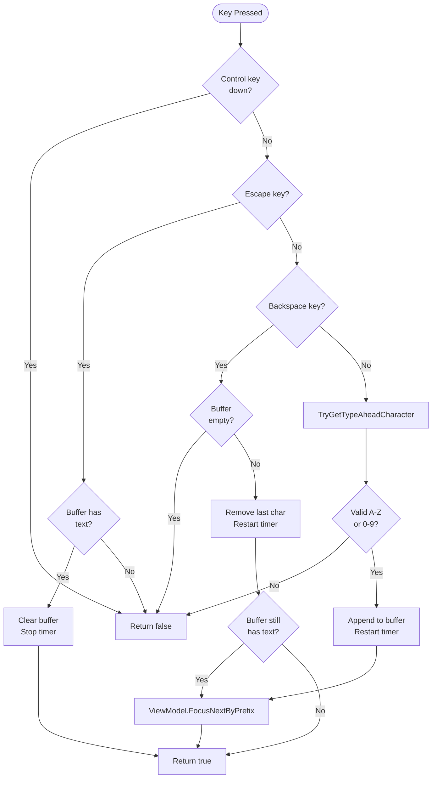
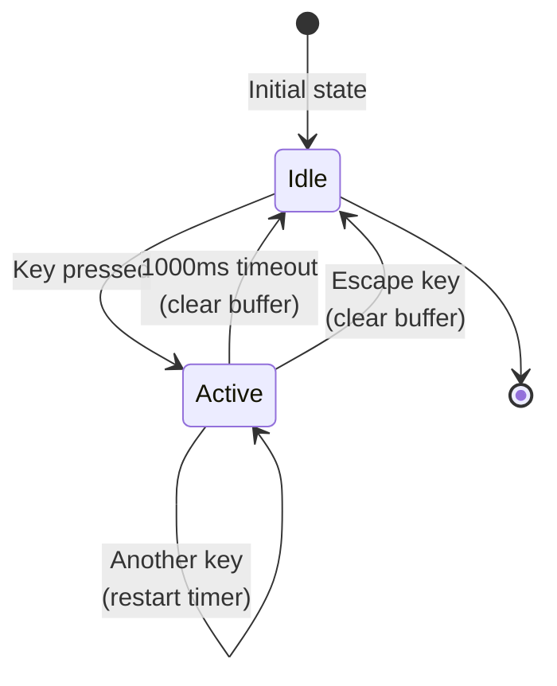
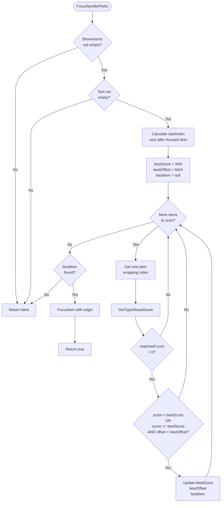
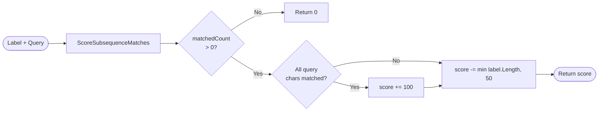
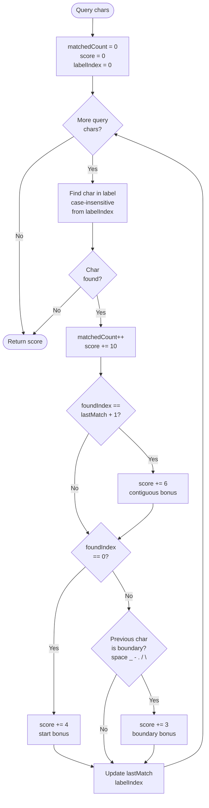
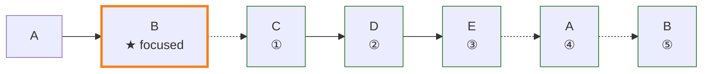
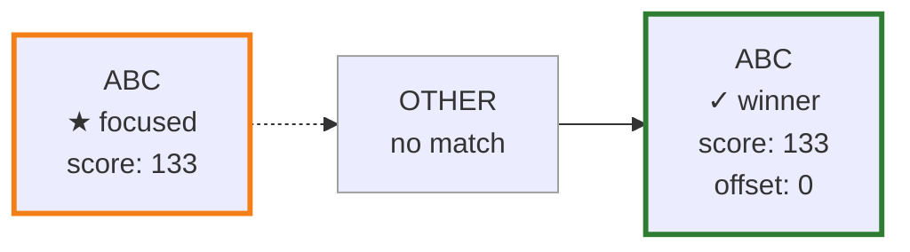

# Typeahead Focus Feature

## Overview

The **typeahead focus** feature enables users to quickly navigate the tree by typing characters. As the user types, the control searches for items with labels matching the typed sequence and focuses the best match. This provides an efficient keyboard-based navigation alternative to arrow keys or mouse selection.

**Key Characteristics:**

- **Incremental matching**: Each keystroke adds to a search buffer and refocuses to the best match
- **Fuzzy subsequence matching**: Supports non-contiguous character matches (e.g., "abc" matches "A_B_C")
- **Smart scoring**: Prefers contiguous matches, word boundaries, and shorter labels
- **Auto-reset buffer**: Clears the search buffer after 1 second of inactivity
- **Wrapping search**: Starts from the currently focused item and wraps around the tree

## User Experience

### Basic Workflow

1. **User types a character** (e.g., "b")
2. **Control updates the search buffer** (buffer = "b")
3. **Control searches all visible items** for matches
4. **Control focuses the best match** and scrolls it into view
5. **Timer starts** (1 second countdown to reset buffer)
6. **User types another character** (e.g., "e")
7. **Buffer updates** (buffer = "be"), timer resets
8. **Control refocuses** to the best match for "be"

### Buffer Management

| Key | Action | Buffer State |
|-----|--------|--------------|
| `A-Z`, `0-9` | Append character to buffer | Character added, timer restarted |
| `Backspace` | Remove last character | Last character removed, timer restarted |
| `Escape` | Clear buffer | Buffer emptied, timer stopped |
| *(1 second idle)* | Auto-reset | Buffer emptied automatically |

### Special Behaviors

| Scenario | Behavior |
|----------|----------|
| **Control key pressed** | Typeahead disabled (Control+key handled by other features) |
| **Shift key pressed** | Typeahead still active (Shift does not affect character input) |
| **No match found** | Focus remains unchanged, buffer retained |
| **Empty buffer + Backspace** | Keystroke not handled (falls through to other handlers) |
| **Empty buffer + Escape** | Keystroke not handled |

## Implementation Architecture

### Control Layer (DynamicTree.cs)

The [DynamicTree.cs](../src/DynamicTree/DynamicTree.cs) control handles keyboard input and maintains the typeahead buffer:

#### State Management

- **Buffer**: Holds typed characters (`typeAheadText`)
- **Timer**: Auto-resets buffer after 1000ms of inactivity (`typeAheadTimer`)
- **Reset Delay**: Configurable timeout (`TypeAheadResetDelay`)

#### Key Handling

Typeahead is triggered from [HandleKeyDown](../src/DynamicTree/DynamicTree.cs#L241) when Control is not pressed.

#### Typeahead Processing Flow

[TryHandleTypeAhead](../src/DynamicTree/DynamicTree.cs#L1233) processes typeahead keys:



#### Supported Keys

- **Letters A-Z**: Converted to uppercase characters
- **Top-row numbers 0-9**: `VirtualKey.Number0` through `VirtualKey.Number9`
- **NumPad numbers 0-9**: `VirtualKey.NumberPad0` through `VirtualKey.NumberPad9`

#### Timer Management

[EnsureTypeAheadTimer](../src/DynamicTree/DynamicTree.cs#L1301) manages the auto-reset timer:



### ViewModel Layer (DynamicTreeViewModel.cs)

The [DynamicTreeViewModel.cs](../src/DynamicTree/DynamicTreeViewModel.cs) performs the actual search and scoring logic:

#### Search and Focus Flow

[FocusNextByPrefix](../src/DynamicTree/DynamicTreeViewModel.cs#L627) searches for the best matching item:



#### Scoring Algorithm

[GetTypeAheadScore](../src/DynamicTree/DynamicTreeViewModel.cs#L732) calculates match quality:



#### Subsequence Matching

[ScoreSubsequenceMatches](../src/DynamicTree/DynamicTreeViewModel.cs#L755) performs fuzzy character matching:



## Scoring Examples

| Query | Label | Match | Score Breakdown | Total |
|-------|-------|-------|-----------------|-------|
| "abc" | "ABC" | ✅ | 3×10 (chars) + 2×6 (contiguous) + 4 (start) + 100 (full) - 3 (length) | **133** |
| "abc" | "A_B_C" | ✅ | 3×10 (chars) + 4 (start) + 2×3 (boundaries) + 100 (full) - 5 (length) | **135** |
| "abc" | "AlphaBetaCode" | ✅ | 3×10 (chars) + 4 (start) + 3 (boundary) + 100 (full) - 50 (max penalty) | **87** |
| "abc" | "XYZ" | ❌ | No match | **0** |

**Winner**: "A_B_C" (135) beats "ABC" (133) due to word boundary bonuses.

## Search Strategy

### Wrapping Order

The search starts **after the currently focused item** and wraps around:



Search order: C → D → E → A → B

### Tie-Breaking

When multiple items have the **same score**, the item **closest to the start of the search** wins (smallest offset):



Query: "ABC" | Scores: [133, 0, 133] | Offsets: [2, -, 0]

**Winner**: Second ABC (offset 0 from start index)

## Usage Patterns

### Example 1: Quick Navigation

**Scenario**: Navigate to "Settings" in a large tree

```text
Tree:
  Projects
  Resources
  Settings
  Tools
```

**User actions**:

1. Press `S` → Focuses "Settings" (or first match starting with S)
2. Press `E` → Refines to "Settings" (buffer = "SE")

### Example 2: Multi-Word Labels

**Scenario**: Navigate to "Project Browser"

```text
Tree:
  Project Setup
  Project Browser
  Project Settings
```

**User actions**:

1. Press `P` → Focuses "Project Setup" (first match)
2. Press `B` → Refocuses to "Project Browser" (matches "PB")

### Example 3: Buffer Reset

**Scenario**: Search interrupted by delay

```text
Tree:
  Alpha
  Beta
  Charlie
```

**User actions**:

1. Press `A` → Focuses "Alpha" (buffer = "A")
2. *(wait 1 second)* → Buffer auto-clears
3. Press `B` → Focuses "Beta" (buffer = "B", not "AB")

### Example 4: Correction with Backspace

**Scenario**: Typo correction

```text
Tree:
  Bootstrap
  Button
```

**User actions**:

1. Press `B` → Focuses "Bootstrap" (buffer = "B")
2. Press `O` → Refocuses to "Bootstrap" (buffer = "BO")
3. Press `X` → No match found, focus unchanged (buffer = "BOX")
4. Press `Backspace` → Removes 'X', refocuses to "Bootstrap" (buffer = "BO")
5. Press `Backspace` → Removes 'O', refocuses to "Bootstrap" (buffer = "B")

### Example 5: Escape to Abort

**Scenario**: User wants to clear search and start over

**User actions**:

1. Press `A`, `B`, `C` → Buffer = "ABC", focused to match
2. Press `Escape` → Buffer cleared, focus unchanged
3. Press `X` → New search starts (buffer = "X")

## Constraints and Limitations

### Current Constraints

| Constraint | Description |
|------------|-------------|
| **Visible items only** | Searches only items currently in `ShownItems` (collapsed children excluded) |
| **Label-based matching** | Uses `ITreeItem.Label` property; ignores other metadata |
| **Case-insensitive** | All matching is case-insensitive |
| **No regex support** | Simple character subsequence matching only |
| **No special characters** | Only A-Z and 0-9 supported (no punctuation, spaces, etc.) |

### Keyboard Conflicts

| Key | Priority | Notes |
|-----|----------|-------|
| **Control+key** | Other features win | Typeahead disabled when Control pressed |
| **Alt+key** | Other features win | Typeahead not invoked with Alt modifier |
| **Shift+key** | Typeahead wins | Shift does not affect character input |
| **Space** | Selection/expansion | Space not captured by typeahead |

### Performance Considerations

| Scenario | Performance | Notes |
|----------|-------------|-------|
| **Small trees (<100 items)** | Instant | Negligible overhead |
| **Medium trees (100-1000 items)** | <1ms | Linear scan acceptable |
| **Large trees (>1000 items)** | 1-5ms | May introduce slight lag on each keystroke |
| **Very large trees (>10,000 items)** | 5-50ms | Noticeable delay possible |

**Optimization**: The linear scan is unavoidable because ShownItems can change dynamically (expansion/filtering). A cached index would require invalidation on every tree mutation.

## Testing Coverage

### Unit Tests

[ViewModelTypeAheadTests.cs](../tests/Models/ViewModelTypeAheadTests.cs) covers:

- **Scoring logic**: Contiguous vs. sparse matches
- **Tie-breaking**: Preference for next match after focus
- **No-match handling**: Focus unchanged, returns false

### UI Tests

[DynamicTreeTypeAheadTests.cs](../tests/UI/Tree/DynamicTreeTypeAheadTests.cs) covers:

- **Keystroke handling**: Actual keyboard input simulation
- **Buffer management**: Backspace, Escape, auto-reset
- **Modifier keys**: Shift does not disable typeahead

## Future Enhancements

### Potential Improvements

| Enhancement | Priority | Complexity | Benefit |
|-------------|----------|------------|---------|
| **Extended characters** | Medium | Low | Support punctuation, spaces (e.g., "proj set" matches "Project Settings") |
| **Visual feedback** | High | Medium | Display current search buffer in UI overlay |
| **Search history** | Low | Medium | Allow up/down arrows to cycle through recent searches |
| **Configurable delay** | Low | Low | Allow apps to customize the 1-second reset timeout |
| **Prefix-only mode** | Low | Low | Option to match only at word starts (disable fuzzy matching) |
| **Sound feedback** | Low | Low | Audio cue on successful match or no-match |

### Visual Feedback Mockup

```text
┌─────────────────────────────────┐
│ Tree Control                    │
├─────────────────────────────────┤
│ ├─ Alpha                        │
│ ├─ Beta       ← focused         │
│ ├─ Charlie                      │
│ └─ Delta                        │
├─────────────────────────────────┤
│ Search: "be"      [Esc to clear]│  ← Overlay showing current buffer
└─────────────────────────────────┘
```

## API Summary

### Control Properties

| Property | Type | Description |
|----------|------|-------------|
| *(none)* | - | Typeahead is always enabled; no opt-out property |

### ViewModel Methods

| Method | Parameters | Returns | Description |
|--------|-----------|---------|-------------|
| `FocusNextByPrefix` | `string text, RequestOrigin origin` | `bool` | Searches for best match, focuses if found |

### Events

Typeahead uses the standard focus events:

| Event | When Fired | Notes |
|-------|------------|-------|
| `FocusedItemChanged` | After successful match | `Origin` = `RequestOrigin.KeyboardInput` |

## Integration with Other Features

### Filtering

- Typeahead searches `ShownItems` (filtered view if active)
- Matching respects current filter predicate
- Hidden items cannot be matched by typeahead

### Selection

- Typeahead changes **focus only**, not selection
- To select after typeahead, user must press `Space` or `Enter`
- Multi-selection (Shift+arrows) not affected by typeahead

### Drag-and-Drop

- Typeahead disabled during drag operations (no keyboard input)

### Clipboard Operations

- Typeahead works independently of cut/copy/paste state
