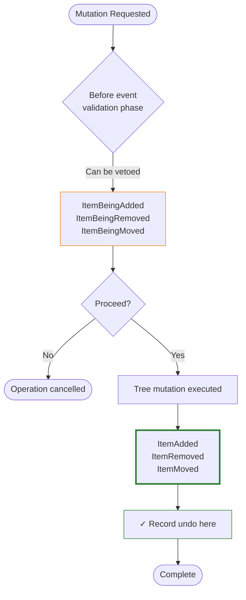
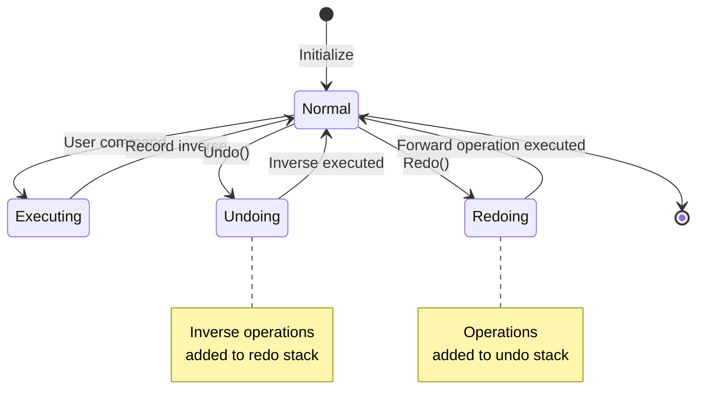
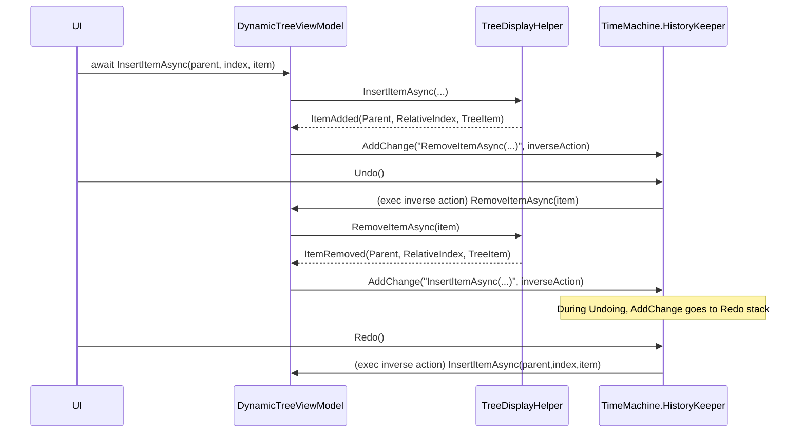
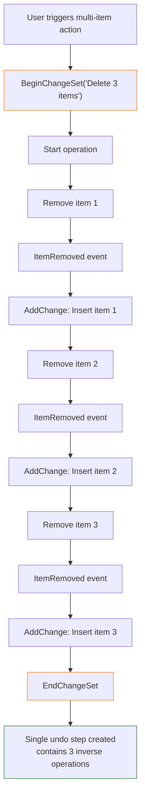
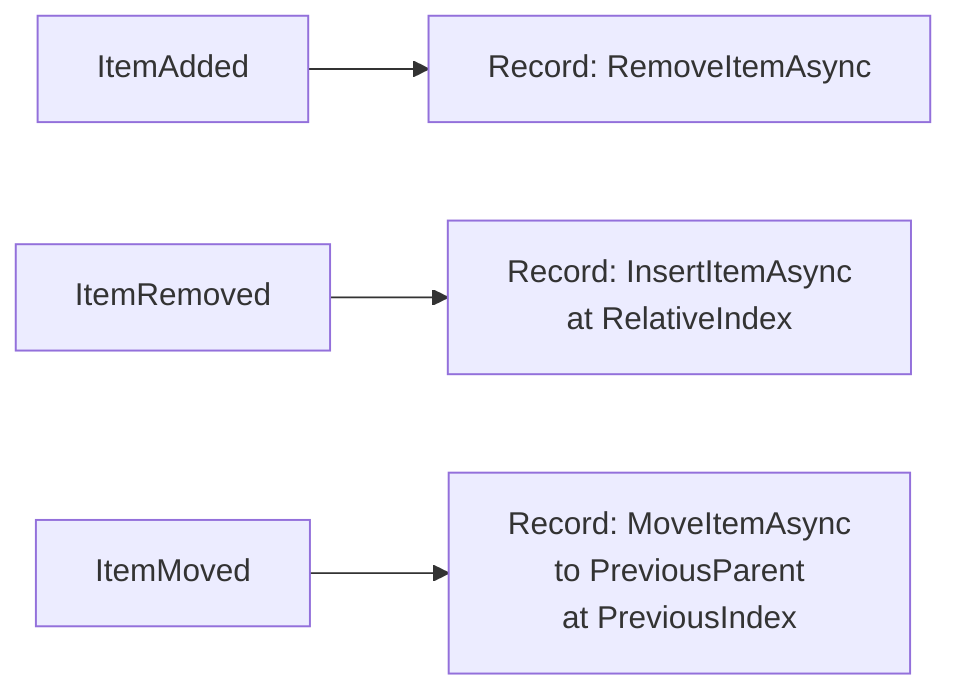
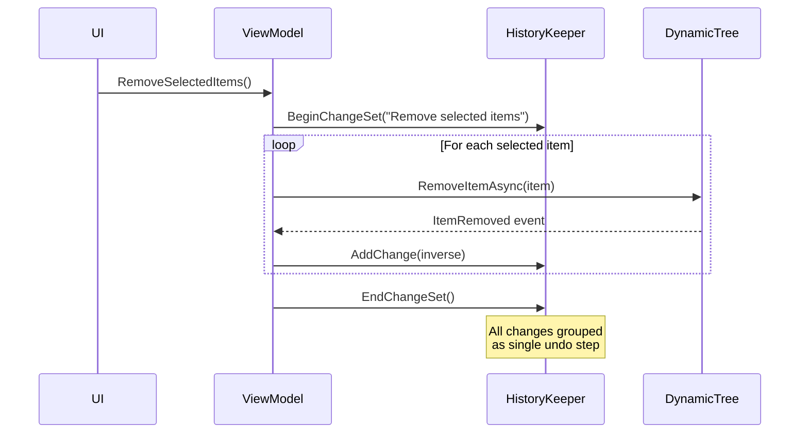
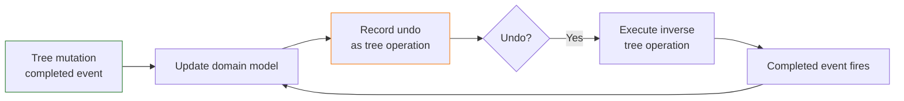
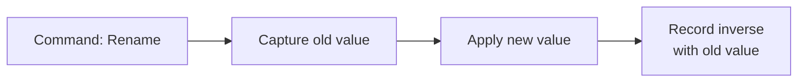

# Undo / Redo for DynamicTree

This document describes how to implement robust Undo/Redo for applications built on top of `DynamicTree` and `DynamicTreeViewModel`.

The guidance here is intentionally strict and event-driven:

- Treat DynamicTree as the *source of truth* for successful mutations.
- Record undo/redo at the **completed mutation events** (`ItemAdded`, `ItemRemoved`, `ItemMoved`).
- Store and replay **logical tree operations** (insert/remove/move), not UI/visual operations.

The examples use `DroidNet.TimeMachine` (the `UndoRedo` / `HistoryKeeper` API), but the same principles apply to any undo engine.

---

## 1. Conceptual Model

DynamicTree operations are asynchronous and may be vetoed (e.g., locked items, invalid parents). This creates a key requirement:

> Only record undo information *after* you know the operation actually happened.

### Event-Driven Recording Strategy

### Event Categories

| Event Type | Phase | Purpose | Record Undo? |
|------------|-------|---------|-------------|
| `ItemBeingAdded` | Before | Validation, veto | ❌ No |
| `ItemBeingRemoved` | Before | Validation, veto | ❌ No |
| `ItemBeingMoved` | Before | Validation, veto | ❌ No |
| `ItemAdded` | After | Confirm completion | ✅ Yes |
| `ItemRemoved` | After | Confirm completion | ✅ Yes |
| `ItemMoved` | After | Confirm completion | ✅ Yes |

### Completed Event Properties

#### TreeItemAddedEventArgs

| Property | Type | Description |
|----------|------|-------------|
| `Parent` | `ITreeItem` | Parent under which item was added |
| `RelativeIndex` | `int` | Child index in `Parent.Children` (not ShownItems index) |
| `TreeItem` | `ITreeItem` | The item that was added |

#### TreeItemRemovedEventArgs

| Property | Type | Description |
|----------|------|-------------|
| `Parent` | `ITreeItem` | Parent from which item was removed |
| `RelativeIndex` | `int` | Child index before removal (use for undo insertion) |
| `TreeItem` | `ITreeItem` | The item that was removed |

#### TreeItemsMovedEventArgs

| Property | Type | Description |
|----------|------|-------------|
| `Moves` | `IReadOnlyList<MovedItemInfo>` | List of move descriptors |
| `IsBatch` | `bool` | True if `Moves.Count > 1` |
| `PrimaryMove` | `MovedItemInfo` | First move in the batch |

#### MovedItemInfo Record

| Property | Type | Description |
|----------|------|-------------|
| `Item` | `ITreeItem` | The moved item |
| `PreviousParent` | `ITreeItem` | Parent before the move |
| `NewParent` | `ITreeItem` | Parent after the move |
| `PreviousIndex` | `int` | Child index before move |
| `NewIndex` | `int` | Child index after move |
| `IsReparenting` | `bool` | True if `PreviousParent != NewParent` |

### 1.1 Why event-driven recording?

When you request a mutation (insert/remove/move), DynamicTree may:

- Clamp the requested index
- Auto-expand parents
- Refuse the operation due to constraints
- Transform a batch move plan

The **completed event args** contain the *actual* parent and index that were used.

### 1.2 Undo/Redo State Machine

---

## 2. Index Semantics (Critical)

DynamicTree uses **child indices**, not visual indices.

### 2.1 Child indices vs `ShownItems` indices

- `ShownItems` is the *visible* flattened list; it depends on expansion/collapse state.
- Mutation event args (`RelativeIndex`, `PreviousIndex`, `NewIndex`) refer to the item's position in its parent’s **children collection** (`ITreeItem.Children`).

**Rule:** Never record `ShownItems.IndexOf(...)` for undo/redo.

### 2.2 Move index semantics (pre-detach insertion point)

For moves/reorders, the destination index is treated as an **insertion point in the target parent’s current children list**, before any moved items are detached.

This matters for same-parent reorders:

- If you remove an item from the list first, its “final index” may shift.
- DynamicTree internally compensates to avoid off-by-one errors.

**Rule:** For undo/redo, prefer `MovedItemInfo.PreviousIndex` and `MovedItemInfo.NewIndex` from the `ItemMoved` event.

---

## 3. Recommended Recording Strategy

### 3.1 Record the *inverse* operation

DynamicTree is imperative: you mutate it with calls like `InsertItemAsync`, `RemoveItemAsync`, `MoveItemAsync`.

For undo/redo, record the inverse operation:

| Completed event | What just happened | Record as the undo action |
|---|---|---|
| `ItemAdded` | item inserted under parent at index | remove that item |
| `ItemRemoved` | item removed from parent at index | insert that item back at that index |
| `ItemMoved` | item moved from old parent/index to new parent/index | move it back to old parent/index |

### 3.2 Let the undo engine build redo automatically

If you use `DroidNet.TimeMachine`, you do **not** need to manually create both “undo” and “redo” actions.

Instead:

1. On each successful mutation, add a “change” that performs the inverse action.
2. When undo runs, the tree mutates again, and your mutation handlers add inverse actions.
3. Because `HistoryKeeper` is in the `Undoing` state, those inverse actions are pushed onto the **redo stack** automatically.

This yields a reliable “record inverse while executing” loop.

---

## 4. Flow Diagrams

### 4.1 Insert → Undo → Redo loop

### 4.2 Batch operation grouping

---

## 5. Implementation Steps

### 5.1 Choose an undo root

Pick an object that represents a "document" or "edit session":

- **Single document apps**: Use the ViewModel instance as the root
- **Multi-document apps**: Use a separate root per document (e.g., per editor window)
- **Shared undo stack**: Use `UndoRedo.Default[rootObject]` to access the `HistoryKeeper`

### 5.2 Subscribe to completed mutation events

Attach handlers to the completed mutation events:

- `ItemAdded`
- `ItemRemoved`
- `ItemMoved`

### 5.3 Event-driven undo recording

#### Inverse Operation Mapping

| Event | Event Args Properties | Record Inverse |
|-------|----------------------|----------------|
| `ItemAdded` | `Parent`, `RelativeIndex`, `TreeItem` | `RemoveItemAsync(TreeItem)` |
| `ItemRemoved` | `Parent`, `RelativeIndex`, `TreeItem` | `InsertItemAsync(Parent, RelativeIndex, TreeItem)` |
| `ItemMoved` | `Moves` (list of `MovedItemInfo`) | For each: `MoveItemAsync(Item, PreviousParent, PreviousIndex)` |

**Batch move note:** For batch moves within the same parent, apply reverse operations in reverse order to avoid index-shift artifacts. `TimeMachine.ChangeSet` applies changes in reverse-add order automatically.

---

## 6. Grouping Multi-step Commands

User commands often cause multiple mutations (and thus multiple events). Presenting those as “one undo step” is typically the desired UX.

Use `HistoryKeeper.BeginChangeSet(key)` / `EndChangeSet()` around the *command*.

Examples that usually warrant a change set:

- Delete multiple selected items
- Paste multiple copied items
- Batch move (drag multiple items)

### Multi-step Command Pattern

#### Commands Requiring ChangeSet

| Command | Why Group |
|---------|----------|
| Delete multiple selected items | Multiple `ItemRemoved` events → single undo |
| Paste multiple items | Multiple `ItemAdded` events → single undo |
| Batch move (drag multiple items) | Multiple `ItemMoved` events → single undo |
| Duplicate subtree | Multiple `ItemAdded` events → single undo |

**Pattern**: Always use `try/finally` to ensure `EndChangeSet()` is called even if the operation throws.

**Important:** You still record inverse operations in event handlers. The `ChangeSet` just groups them into a single undo/redo step.

---

## 7. Visibility & Expansion Pitfalls

Some mutation APIs require items/parents to be visible (shown). For example, moving an item generally requires the item and target parent to be shown.

You have two viable approaches:

### 7.1 Minimal auto-expansion (recommended)

Before replaying a recorded mutation, ensure the required ancestors are expanded so the involved nodes become visible.

Pros:

- Undo/redo is resilient even if users collapsed the tree.
- You do not need to record every expand/collapse action.

Cons:

- Undo may expand nodes as a side effect.

### 7.2 Display-state undo (advanced)

Record expand/collapse operations as undoable actions, restoring the exact display state before mutating.

Pros:

- Undo/redo can restore both model and display state.

Cons:

- More complex; requires explicit “expand/collapse requested” command points.
- Can make the undo stack noisy (users may not want expansion to be undoable).

For most apps, approach **7.1** is the best balance.

---

## 8. Domain Model Synchronization

DynamicTree commonly wraps domain objects with `ITreeItem` adapters. If you have a separate domain model (e.g., `Project → Scenes → Entities`), synchronize updates.

### Synchronization Pattern

### Recommended Strategy

| Layer | Responsibility | When |
|-------|---------------|------|
| **DynamicTree** | Source of truth for mutations | Always mutate tree first |
| **Event handlers** | Synchronize domain model | In `ItemAdded/Removed/Moved` handlers |
| **Undo recording** | Record tree inverse operations | After domain model updated |

**Benefits**:

- Single source of truth: "tree mutation → domain model → undo recorded"
- Undo/redo automatically updates domain model through event handlers
- No risk of desynchronization

### Anti-pattern: Direct Domain Updates

❌ **Don't**: Update domain model directly, then update tree separately

This creates two sources of truth and makes undo/redo error-prone.

---

## 9. Non-tree Commands (Rename, Toggle Flags, Property Changes)

Not all edits are insert/remove/move operations. Property changes require direct recording.

### Recording Property Changes

### Common Non-tree Operations

| Operation | Forward Action | Inverse Action |
|-----------|---------------|----------------|
| **Rename** | `item.Label = newName` | `item.Label = oldName` |
| **Toggle flag** | `item.IsLocked = true` | `item.IsLocked = false` |
| **Change property** | `item.Property = newValue` | `item.Property = oldValue` |
| **Reorder within collection** | Update index | Restore original index |

**Pattern**: Capture the old value before applying the change, then record the inverse operation with the captured value.

---

## 10. Checklist & Common Mistakes

### Checklist

- Record undo from `ItemAdded` / `ItemRemoved` / `ItemMoved` only.
- Record indices from event args (child indices), never from `ShownItems`.
- Wrap multi-step commands in a `ChangeSet`.
- Use `try/finally` around `EndChangeSet()`.
- Ensure visibility requirements (expand ancestors) before replaying operations when needed.
- Keep domain model updates aligned with completed tree events.

### Common mistakes

- Recording in `ItemBeing*` events (operation can be vetoed).
- Using `ShownItems` indices.
- Replaying a move when nodes are not visible.
- Undoing batch moves without handling index shifting.

---

## 11. Suggested “starter” integration

For a new consumer, start with:

1. Attach handlers for `ItemAdded`, `ItemRemoved`, `ItemMoved`.
2. Record inverse operations.
3. Add `Undo()` / `Redo()` commands bound to `HistoryKeeper.Undo()` / `Redo()`.
4. Add `ChangeSet` wrapping only for multi-item commands.

This gives a correct baseline, and you can then refine how you want to handle expansion state and domain model synchronization.
