# DroidNet.Controls.Menus

[](https://www.nuget.org/packages/DroidNet.Controls.Menus/)
[](https://opensource.org/licenses/MIT)

A sophisticated, high-performance menu system for WinUI 3 applications featuring a data-first architecture, pluggable surface model, and lightning-fast interaction patterns. Build your menu hierarchy once with `MenuBuilder` and render it anywhere—from traditional menu bars to cascading flyouts—with consistent behavior powered by a unified interaction controller.

## ✨ Key Features

- **🏗️ Data-First Architecture** – Define menus once with `MenuBuilder`, project anywhere via `IMenuSource`
- **🎭 Surface Abstraction** – Pluggable presentation layer with `IRootMenuSurface` and `ICascadedMenuSurface` contracts
- **🎯 Unified Interaction Model** – Single `MenuInteractionController` coordinates pointer and keyboard across all surfaces
- **🚀 Lightning-Fast Navigation** – Zero-delay hover switching with smart submenu expansion and single-branch policy
- **📊 Cascading Column Architecture** – Hierarchical menu levels rendered via `CascadedColumnsPresenter` and `ColumnPresenter`
- **🔌 Pluggable Hosting** – Abstract `ICascadedMenuHost` with `PopupMenuHost` implementation
- **🪟 Surface Switchers** – Built-in `MenuButton` root surface and `ContextMenu` attached surface share the same menu definition
- **🪟 Space-Swapping Expandable Bar** – `ExpandableMenuBar` toggles between a compact hamburger and full menu bar in place
- **🎨 Consistent Visual Language** – Four-column layout (Icon | Text | Accelerator | State) via custom `MenuItem` control
- **⌨️ Complete Keyboard Support** – Arrow navigation, mnemonics, accelerators, Enter/Space activation, Escape dismissal
- **🔘 Radio Groups & Toggle Items** – Automatic coordination via `MenuServices` with single-selection semantics
- **♿ Accessibility First** – Full automation peer support and screen reader compatibility
- **🧪 Testable Design** – Surface abstraction enables comprehensive unit testing without UI dependencies

## 📦 Installation

```bash
dotnet add package DroidNet.Controls.Menus
```

## 🏗️ Architecture Overview

### The Big Picture

The menu system is built on three foundational layers:

#### 1. Data Layer – What to Show

- **`MenuBuilder`** – Fluent API for constructing hierarchical menu data
- **`MenuItemData`** – Observable data model representing individual items
- **`IMenuSource`** – Bridge exposing items + services for presentation binding
- **`MenuSourceView`** – Lightweight projections of item subsets (for submenus)
- **`MenuServices`** – Lookup dictionary, radio-group coordination, and controller access

#### 2. Surface Layer – Where to Show It

- **`IRootMenuSurface`** – Contract for flat, single-level surfaces (menu bars, toolbars)
- **`ICascadedMenuSurface`** – Contract for hierarchical, multi-column surfaces (dropdowns, flyouts)
- **`IMenuInteractionSurface`** – Base contract with dismissal capabilities
- **`MenuInteractionContext`** – Type-safe context describing root vs. column interactions
- **`MenuLevel`** – Strongly-typed zero-based column level indicator

#### 3. Presentation Layer – How to Render It

- **`MenuItem`** – Templated control rendering the four-column item layout
- **`ExpandableMenuBar`** – Space-swapping root surface that toggles between a hamburger affordance and a full menu bar in-place
- **`MenuBar`** – Horizontal root surface implementing `IRootMenuSurface` (also embedded within `ExpandableMenuBar`)
- **`MenuButton`** – Button-based root surface for menu activation
- **`ContextMenu`** – Attached property for right-click/contextual menus
- **`PopupMenuHost`** – Popup-backed host for hierarchical/cascaded menus

### Class Diagram

```mermaid
flowchart TD
    Input["👆 User Input<br/>(Pointer/Keyboard)"]

    Input --> Controller["🎯 MenuInteractionController"]

    Controller --> ExpandableMenuBar["🪟 ExpandableMenuBar"]
    Controller --> MenuBar["📊 MenuBar"]
    Controller --> MenuButton["🔘 MenuButton"]
    Controller --> ContextMenu["🖱️ ContextMenu"]

    ExpandableMenuBar --> MenuBar

    MenuBar --> PopupMenuHost_MenuBar["🪟 PopupMenuHost (MenuBar)"]
    MenuButton --> PopupMenuHost_MenuButton["🪟 PopupMenuHost (MenuButton)"]
    ContextMenu --> PopupMenuHost_ContextMenu["🪟 PopupMenuHost (ContextMenu)"]

    PopupMenuHost_MenuBar --> Presenter_MenuBar["📑 CascadedColumnsPresenter (MenuBar)"]
    PopupMenuHost_MenuButton --> Presenter_MenuButton["📑 CascadedColumnsPresenter (MenuButton)"]
    PopupMenuHost_ContextMenu --> Presenter_ContextMenu["📑 CascadedColumnsPresenter (ContextMenu)"]

    Presenter_MenuBar --> Columns["🗂️ Column Presenters"]
    Presenter_MenuButton --> Columns
    Presenter_ContextMenu --> Columns
    Columns --> MenuItem["🎨 MenuItem"]

    style Input fill:#f0f0f0,stroke:#333,stroke-width:2px,color:#000
    style Controller fill:#0078d4,stroke:#004578,stroke-width:3px,color:#fff
    style ExpandableMenuBar fill:#ffaa44,stroke:#c26600,stroke-width:2px,color:#000
    style MenuBar fill:#ffb900,stroke:#c87000,stroke-width:2px,color:#000
    style MenuButton fill:#00b294,stroke:#008272,stroke-width:2px,color:#fff
    style ContextMenu fill:#8764b8,stroke:#5c3d8a,stroke-width:2px,color:#fff
    style PopupMenuHost_MenuBar fill:#107c10,stroke:#0b5a0b,stroke-width:2px,color:#fff
    style PopupMenuHost_MenuButton fill:#107c10,stroke:#0b5a0b,stroke-width:2px,color:#fff
    style PopupMenuHost_ContextMenu fill:#107c10,stroke:#0b5a0b,stroke-width:2px,color:#fff
    style Presenter_MenuBar fill:#8764b8,stroke:#5c3d8a,stroke-width:2px,color:#fff
    style Presenter_MenuButton fill:#8764b8,stroke:#5c3d8a,stroke-width:2px,color:#fff
    style Presenter_ContextMenu fill:#8764b8,stroke:#5c3d8a,stroke-width:2px,color:#fff
    style Columns fill:#e3008c,stroke:#a10066,stroke-width:2px,color:#fff
    style MenuItem fill:#d13438,stroke:#942026,stroke-width:2px,color:#fff
```



## 🚀 Quick Start

### 1. Build Your Menu Data

Define your menu hierarchy once using the fluent `MenuBuilder` API:

```csharp
using DroidNet.Controls.Menus;
using CommunityToolkit.Mvvm.ComponentModel;
using Microsoft.UI.Xaml.Controls;

public partial class ShellViewModel : ObservableObject
{
    public ShellViewModel()
    {
        this.AppMenu = new MenuBuilder()
            .AddSubmenu("&File", file => file
                .AddMenuItem("&New Project",
                    command: this.NewProjectCommand,
                    icon: new SymbolIconSource { Symbol = Symbol.Add },
                    acceleratorText: "Ctrl+N")
                .AddMenuItem("&Open…",
                    command: this.OpenCommand,
                    icon: new SymbolIconSource { Symbol = Symbol.OpenFile },
                    acceleratorText: "Ctrl+O")
                .AddSeparator()
                .AddMenuItem("&Save",
                    command: this.SaveCommand,
                    icon: new SymbolIconSource { Symbol = Symbol.Save },
                    acceleratorText: "Ctrl+S")
                .AddSeparator()
                .AddCheckableMenuItem("Auto Save",
                    isChecked: true,
                    icon: new FontIconSource { Glyph = "\uE74E" })
                .AddSeparator()
                .AddMenuItem("E&xit", command: this.ExitCommand))
            .AddSubmenu("&Edit", edit => edit
                .AddMenuItem("Cu&t",
                    command: this.CutCommand,
                    icon: new SymbolIconSource { Symbol = Symbol.Cut },
                    acceleratorText: "Ctrl+X")
                .AddMenuItem("&Copy",
                    command: this.CopyCommand,
                    icon: new SymbolIconSource { Symbol = Symbol.Copy },
                    acceleratorText: "Ctrl+C")
                .AddMenuItem("&Paste",
                    command: this.PasteCommand,
                    icon: new SymbolIconSource { Symbol = Symbol.Paste },
                    acceleratorText: "Ctrl+V"))
            .AddSubmenu("&View", view => view
                .AddSubmenu("&Theme", theme => theme
                    .AddRadioMenuItem("&Light", "AppTheme", isChecked: true)
                    .AddRadioMenuItem("&Dark", "AppTheme")
                    .AddRadioMenuItem("&System Default", "AppTheme"))
                .AddSeparator()
                .AddMenuItem("Zoom &In",
                    command: this.ZoomInCommand,
                    acceleratorText: "Ctrl+Plus")
                .AddMenuItem("Zoom &Out",
                    command: this.ZoomOutCommand,
                    acceleratorText: "Ctrl+Minus"))
            .Build();
    }

    public IMenuSource AppMenu { get; }
}
```

### 2. Use the ExpandableMenuBar (Space-Swapping Root Surface)

`ExpandableMenuBar` keeps the title bar uncluttered by default and swaps the hamburger (☰) for a full `MenuBar` without opening a popup. Bind `IsExpanded` two-way so view models can coordinate window chrome or keyboard shortcuts.

```xml
<StackPanel Orientation="Horizontal" VerticalAlignment="Center">
    <menus:ExpandableMenuBar
        MenuSource="{x:Bind ViewModel.AppMenu}"
        IsExpanded="{x:Bind ViewModel.IsMenuExpanded, Mode=TwoWay}" />
</StackPanel>
```

**Space-swapping flow:**

- Default: the hamburger sits in-line with your app title and window controls.
- Click the hamburger: the glyph disappears, the embedded `MenuBar` materializes in the same space, and the first interactive root item auto-expands.
- Dismissal: invoking a command, pressing `Esc`, or clicking outside collapses back to the hamburger instantly—no light-dismiss overlays.

**Lifecycle hooks:**

- `Expanded` fires when the control finishes expanding. Use it to adjust layout or chrome while the bar is visible.
- `Collapsed` fires after the control returns to the compact state, handing you a `MenuDismissedEventArgs` that explains whether the user used keyboard, pointer, mnemonics, or a programmatic dismissal.

### 3. Use the MenuBar (Traditional Root Surface)

Add a horizontal menu bar implementing `IRootMenuSurface`. The same `MenuBar` instance is embedded inside `ExpandableMenuBar`, so any customization you make here applies there as well.

```xml
<Page
    xmlns="http://schemas.microsoft.com/winfx/2006/xaml/presentation"
    xmlns:x="http://schemas.microsoft.com/winfx/2006/xaml"
    xmlns:menus="using:DroidNet.Controls.Menus">

    <Grid>
        <Grid.RowDefinitions>
            <RowDefinition Height="Auto" />
            <RowDefinition Height="*" />
        </Grid.RowDefinitions>

        <!-- MenuBar: IRootMenuSurface implementation -->
        <menus:MenuBar
            Grid.Row="0"
            MenuSource="{x:Bind ViewModel.AppMenu}"
            ItemInvoked="OnMenuItemInvoked" />

        <!-- Application Content -->
        <ScrollViewer Grid.Row="1">
            <!-- Your content here -->
        </ScrollViewer>
    </Grid>
</Page>
```

### 4. Drive a MenuButton (Alternative Root Surface)

`MenuButton` shares the same interaction controller as `MenuBar` and can optionally switch visual chrome via the `Chrome` property:

```xml
<StackPanel Orientation="Horizontal" Spacing="12">
    <!-- Standard button chrome -->
    <menus:MenuButton
        MenuSource="{x:Bind ViewModel.AppMenu}"
        Content="Main Menu" />

    <!-- Transparent chrome with rounded hover clipping -->
    <menus:MenuButton
        MenuSource="{x:Bind ViewModel.AppMenu}"
        Chrome="Transparent"
        CornerRadius="12">
        <StackPanel Orientation="Horizontal" Spacing="8">
            <FontIcon FontFamily="Segoe Fluent Icons" Glyph="&#xE713;" />
            <TextBlock Text="Quick Actions" />
        </StackPanel>
    </menus:MenuButton>
</StackPanel>
```

### 5. Attach as a Right-Click Context Menu

The `ContextMenu` attached property wires the same menu definition to any `FrameworkElement` without manual resource merges:

```xml
<Border
    Height="180"
    Padding="16"
    Background="{ThemeResource CardBackgroundFillColorDefaultBrush}"
    menus:ContextMenu.MenuSource="{x:Bind ViewModel.AppMenu}">
    <TextBlock Text="Right-click anywhere inside this area" />
</Border>
```

### 6. Use as MenuFlyout (Cascaded Surface)

Need to host the menu inside an existing WinUI flyout pipeline? Reuse the `MenuFlyout` control, which internally uses the flyout host implementation:

```xml
<Border Background="{ThemeResource CardBackgroundFillColorDefaultBrush}">
    <Border.ContextFlyout>
        <menus:MenuFlyout MenuSource="{x:Bind ViewModel.AppMenu}" />
    </Border.ContextFlyout>

    <TextBlock Text="Right-click for menu flyout" />
</Border>
```

### 7. Handle Menu Events

```csharp
private void OnMenuItemInvoked(object sender, MenuItemInvokedEventArgs args)
{
    // Command has already executed; this is for additional UI logic
    if (args.InvokedItem.Text == "Exit")
    {
        Application.Current.Exit();
    }
}
```

## 🏛️ Core Architecture Components

### Data Layer

#### `MenuBuilder`

Fluent API for constructing hierarchical menu data with automatic ID generation and normalization.

**Key Responsibilities:**

- Build `MenuItemData` hierarchies via method chaining
- Generate deterministic, unique identifiers for all items
- Maintain lookup dictionary for fast item resolution
- Expose reusable `IMenuSource` with shared `MenuServices`
- Support dirty tracking for efficient lookup refreshes

**Example:**

```csharp
var menu = new MenuBuilder()
    .AddSubmenu("File", file => file
        .AddMenuItem("New", command: NewCommand)
        .AddSeparator()
        .AddCheckableMenuItem("Auto Save", isChecked: true))
    .Build(); // Returns IMenuSource
```

#### `MenuItemData`

Observable data model representing a menu item with full property support.

**Properties:**

- `Text` – Display text with mnemonic support (`&` prefix)
- `Command` – `ICommand` for invocation
- `Icon` – `IconSource` for visual branding
- `AcceleratorText` – Keyboard shortcut display (e.g., "Ctrl+S")
- `Mnemonic` – Extracted from text for Alt+Key navigation
- `IsEnabled` / `IsInteractive` – State flags
- `IsCheckable` / `IsChecked` – Toggle support
- `IsExpanded` – Submenu expansion state
- `RadioGroupId` – Mutual exclusion group membership
- `SubItems` – Child menu items for hierarchy
- `IsSeparator` – Visual separator flag
- `HasChildren` – Computed property for expansion eligibility

#### `IMenuSource`

Bridge between data and presentation, providing items and services.

```csharp
public interface IMenuSource
{
    ObservableCollection<MenuItemData> Items { get; }
    MenuServices Services { get; }
}
```

**Implementations:**

- `MenuSource` – Primary implementation from `MenuBuilder.Build()`
- `MenuSourceView` – Lightweight projection for submenu rendering

#### `MenuServices`

Central coordination hub providing lookup, radio-group logic, and interaction control.

**Capabilities:**

- Fast item lookup by hierarchical ID via cached dictionary
- Radio group coordination with automatic single-selection
- Shared `MenuInteractionController` instance
- Structured logging support across categories

**API:**

```csharp
public sealed class MenuServices
{
    MenuInteractionController InteractionController { get; }
    bool TryGetMenuItemById(string id, out MenuItemData? menuItem);
    void HandleGroupSelection(MenuItemData item); // Internal use
}
```

### Surface Layer

#### `IMenuInteractionSurface`

Base contract for all menu surfaces providing dismissal capability.

```csharp
public interface IMenuInteractionSurface
{
    void Dismiss(MenuDismissKind kind = MenuDismissKind.Programmatic);
}
```

#### `IRootMenuSurface`

Contract for flat, single-level surfaces (menu bars, toolbars).

**Key Methods:**

- `MenuItemData GetAdjacentItem(item, direction, wrap)` – Navigate horizontally
- `MenuItemData? GetExpandedItem()` – Query current expansion
- `MenuItemData? GetFocusedItem()` – Query keyboard focus
- `bool FocusItem(item, navigationMode)` – Transfer focus
- `bool FocusFirstItem(navigationMode)` – Initial focus
- `void ExpandItem(item, navigationMode)` – Show submenu
- `void CollapseItem(item, navigationMode)` – Hide submenu

**Implementations:** `MenuBar`

#### `ICascadedMenuSurface`

Contract for hierarchical, multi-column surfaces supporting arbitrary nesting depth.

**Key Methods:**

- `MenuItemData GetAdjacentItem(level, item, direction, wrap)` – Navigate within column
- `MenuItemData? GetExpandedItem(level)` – Query column expansion
- `MenuItemData? GetFocusedItem(level)` – Query column focus
- `bool FocusItem(level, item, navigationMode)` – Column-specific focus
- `bool FocusFirstItem(level, navigationMode)` – Initial column focus
- `void ExpandItem(level, item, navigationMode)` – Materialize child column
- `void CollapseItem(level, item, navigationMode)` – Dismiss child column
- `void TrimTo(level)` – Collapse all columns beyond specified level

**Implementations:** Via `ICascadedMenuHost` abstraction

#### `MenuInteractionContext`

Type-safe context describing interaction location (root vs. column).

```csharp
public readonly struct MenuInteractionContext
{
    MenuInteractionContextKind Kind { get; } // Root or Column
    MenuLevel ColumnLevel { get; }           // Zero-based column index
    IRootMenuSurface? RootSurface { get; }
    ICascadedMenuSurface? ColumnSurface { get; }

    static MenuInteractionContext ForRoot(IRootMenuSurface, ICascadedMenuSurface?);
    static MenuInteractionContext ForColumn(MenuLevel, ICascadedMenuSurface, IRootMenuSurface?);
}
```

#### `MenuLevel`

Strongly-typed, zero-based menu level with compile-time safety.

```csharp
public readonly record struct MenuLevel
{
    static readonly MenuLevel First = new(0);
    int Value { get; }
    bool IsFirst { get; }

    static implicit operator int(MenuLevel);
    static explicit operator MenuLevel(int);
    static MenuLevel operator ++(MenuLevel);
    static MenuLevel operator --(MenuLevel);
}
```

### Interaction Layer

#### `MenuInteractionController`

Unified coordination engine managing all menu interactions across surfaces.

**Responsibilities:**

- **Navigation Mode Management** – Automatic switching between `PointerInput` and `KeyboardInput`
- **Focus Management** – Capture on entry, restoration on dismissal
- **Single-Branch Policy** – Only one submenu open per hierarchical level
- **Hover Intelligence** – Instant expansion in submenus, conditional in roots
- **Dismissal Coordination** – Hierarchical collapse with proper focus restoration
- **Event Orchestration** – Centralized handlers for all interaction events

**Key Methods:**

```csharp
public sealed class MenuInteractionController
{
    MenuNavigationMode NavigationMode { get; }

    // Hover lifecycle
    void OnItemHoverStarted(MenuInteractionContext, MenuItemData);
    void OnItemHoverEnded(MenuInteractionContext, MenuItemData);

    // Focus lifecycle
    void OnItemFocusReceived(MenuInteractionContext, MenuItemData, MenuInteractionInputSource);
    void OnItemFocusLost(MenuInteractionContext, MenuItemData);
    void OnGettingFocus(MenuInteractionContext, UIElement? oldFocusedElement);

    // Keyboard navigation
    void OnNavigateRequested(MenuInteractionContext, MenuNavigationDirection);
    void OnExpandRequested(MenuInteractionContext, MenuItemData, MenuInteractionInputSource);

    // Selection and dismissal
    void OnItemInvoked(MenuInteractionContext, MenuItemData, MenuInteractionInputSource);
    void OnRadioGroupSelectionRequested(MenuItemData);
    bool OnDismissRequested(MenuInteractionContext, MenuDismissKind);
    void OnDismissed(MenuInteractionContext);
}
```

**Interaction Patterns:**

1. **Hover Navigation** – Move pointer over items; submenus expand instantly, roots expand when siblings already open
2. **Keyboard Navigation** – Arrow keys traverse; Enter/Space invoke; Escape dismisses
3. **Focus Capture** – First interaction captures original focus owner for restoration
4. **Single Branch** – Expanding an item collapses any previously expanded sibling at that level
5. **Smart Dismissal** – ESC restores focus to anchor item; click-outside restores to original owner

### Presentation Layer

#### `MenuItem`

Custom templated control rendering the four-column item layout for all menu types.

**Four-Column Layout:**

| Icon | Text | Accelerator | State |
|------|------|-------------|-------|
| 💾 | Save | Ctrl+S | |
| | New Project | Ctrl+N | |
| — | — | — | — |
| 💾 | Auto Save | | ✓ |
| ✓ | Show Line Numbers | | |
| 💾 | Wrap Text | Shift+Alt+W | ✓ |
| | More Options | | → |

**Column Specifications:**

1. **Icon** (16×16px) – `IconSource` or left-side checkmark when no icon
2. **Text** – Left-aligned, expandable, supports mnemonics
3. **Accelerator** – Right-aligned keyboard shortcut text
4. **State** – Right-aligned checkmark (✓) or submenu arrow (→)

**Visual States:**

- **Common:** Normal, PointerOver, Pressed, Disabled, Active
- **Decoration:** CheckedNoIcon, CheckedWithIcon, WithChildren, NoDecoration
- **Icon:** HasIcon, NoIcon
- **Accelerator:** HasAcceleator, NoAccelerator
- **Type:** Separator, Item

**Events:**

- `Invoked` – Item clicked/activated
- `SubmenuRequested` – Expand submenu (Right arrow, hover)
- `HoverStarted` / `HoverEnded` – Pointer tracking
- `GotFocus` / `LostFocus` – Focus tracking

**Template Parts:**

- `PART_RootGrid` – Container
- `PART_ContentGrid` – Column host
- `PART_IconPresenter` – `IconSourceElement`
- `PART_TextBlock` – Text with mnemonic
- `PART_AcceleratorTextBlock` – Shortcut display
- `PART_SubmenuArrow` – Right arrow (→)
- `PART_Checkmark` – Check indicator (✓)
- `PART_SeparatorBorder` – Divider line

#### `ExpandableMenuBar`

Space-efficient root surface that keeps a hamburger affordance in compact mode and swaps it for a full `MenuBar` in-place when expanded. The control uses the same `MenuInteractionController` as `MenuBar`, so hover navigation, mnemonics, and focus management behave identically whether the bar is expanded manually or programmatically.

**Behavior highlights:**

- Default state keeps only the hamburger visible in layout—ideal for title bars.
- Expanding hides the hamburger, reveals the embedded `MenuBar`, and automatically expands the first interactive root item for a “lightning start.”
- Dismissing (Escape, outside click, command completion, or code) restores the hamburger instantly without relying on popups or light-dismiss chrome.

**Lifecycle events:**

- `Expanded` – Raised after the control transitions to the full menu bar.
- `Collapsed` – Raised when the control returns to the hamburger state and provides the dismissal reason via `MenuDismissedEventArgs.Kind`.

**Template parts:**

- `PART_RootGrid` – Root container holding both states.
- `PART_HamburgerButton` – The toggle button rendered in compact mode.
- `PART_MenuBarContainer` – Layout slot that hosts the menu bar when expanded.
- `PART_MenuBar` – The embedded `MenuBar` instance that projects the shared `IMenuSource`.

#### `MenuBar`

Horizontal menu bar control implementing `IRootMenuSurface`.

**Features:**

- Horizontal stack panel host for root items
- `ICascadedMenuHost` for submenu materialization
- Automatic focus management via `MenuInteractionController`
- Left/Right arrow navigation between roots
- Down arrow / Enter to expand submenus
- Escape to collapse and restore focus

**Template Parts:**

- `PART_RootItemsPanel` – Horizontal item layout

**Host Strategy:**

Uses pluggable `ICascadedMenuHost` (default: `PopupMenuHost`) to render submenu cascades via `CascadedColumnsPresenter`.

#### `MenuButton`

Root-level button control that exposes `IRootMenuSurface` behavior while retaining the WinUI `Button` template. Instances opt into alternative visual chrome by setting the `Chrome` dependency property:

- `Chrome="Default"` (default) inherits the system button styling.
- `Chrome="Transparent"` removes fill/border while clipping hover/press states to the configured `CornerRadius`.

`MenuButton` automatically loads its resource dictionary; consumers can switch chrome without merging XAML by setting the property at design time or runtime.

#### `MenuFlyout`

Custom flyout surface for context menus and dropdowns.

**Features:**

- Derives from `FlyoutBase` for native WinUI integration
- Creates `CascadedColumnsPresenter` for column rendering
- Supports `RootSurface` binding for menu bar integration
- Automatic dismissal on selection or click-outside
- Configurable `MaxColumnHeight` for tall menus

**API:**

```csharp
public sealed class MenuFlyout : FlyoutBase
{
    IMenuSource? MenuSource { get; set; }
    IRootMenuSurface? RootSurface { get; set; }
    double MaxColumnHeight { get; set; }

    void Dismiss(MenuDismissKind kind = MenuDismissKind.Programmatic);
}
```

#### `CascadedColumnsPresenter`

Multi-column stack renderer for hierarchical menus implementing `ICascadedMenuSurface`.

**Architecture:**

- Maintains ordered list of `ColumnPresenter` instances
- Horizontal `StackPanel` layout with 4px spacing
- Dynamic column materialization on expansion
- Automatic trimming on collapse via `TrimTo(level)`
- Deferred focus handling for async column creation

**Key Methods:**

```csharp
internal void Reset(); // Clear all columns
internal ColumnPresenter AddColumn(List<MenuItemData>, int level, MenuNavigationMode);
internal ColumnPresenter? GetColumn(MenuLevel);
```

#### `ColumnPresenter`

Single vertical column of menu items.

**Features:**

- Vertical `StackPanel` of `MenuItem` controls
- Item-level navigation with wrap support
- Focus management per column
- Expansion state tracking
- Observable collection change handling

**Properties:**

- `IEnumerable<MenuItemData> ItemsSource` – Items to render
- `MenuLevel ColumnLevel` – Zero-based column index
- `IMenuSource? MenuSource` – Data and services
- `MenuInteractionController? Controller` – Interaction coordinator
- `CascadedColumnsPresenter? OwnerPresenter` – Parent presenter

#### `ContextMenu`

Attached behavior that binds a menu definition to any `FrameworkElement` through the `menus:ContextMenu.MenuSource` property. When the element raises a context request (right-click, Shift+F10), the control spins up the appropriate host (`PopupMenuHost` by default) and mirrors the same interaction model used by menu bars and menu buttons.

### Host Abstraction Layer

#### `ICascadedMenuHost`

Pluggable hosting interface decoupling cascade logic from presentation mechanism.

```csharp
internal interface ICascadedMenuHost : IDisposable, ICascadedMenuSurface
{
    event EventHandler? Opening;
    event EventHandler? Opened;
    event EventHandler<MenuHostClosingEventArgs>? Closing;
    event EventHandler? Closed;

    ICascadedMenuSurface Surface { get; }
    FrameworkElement? Anchor { get; }
    IRootMenuSurface? RootSurface { get; set; }
    IMenuSource? MenuSource { get; set; }
    double MaxLevelHeight { get; set; }
    bool IsOpen { get; }

    void ShowAt(MenuItem anchor, MenuNavigationMode);
}
```

**Lifecycle Events:**

- `Opening` → `Opened` → `Closing` (cancellable) → `Closed`

#### `PopupMenuHost`

`Popup`-backed host with sophisticated lifecycle management.

**Features:**

- Uses native `Popup` control for positioning
- Debounced open/close with `DispatcherQueueTimer` (35ms)
- Escape key dismissal via event handlers
- Outside-click dismissal with root pass-through
- Token-based request tracking for async safety
- Automatic state machine: Idle → Opening → Open → Closing → Closed

**Implementation Highlights:**

- `CascadedColumnsPresenter` as popup child
- Configurable `ShouldConstrainToRootBounds = false`
- Custom `IsLightDismissEnabled = false` with manual handling
- Root element input pass-through for menu bar integration

## 🎯 Advanced Usage

### Radio Groups with Automatic Coordination

```csharp
var menu = new MenuBuilder()
    .AddSubmenu("View", view => view
        .AddSubmenu("Theme", theme => theme
            .AddRadioMenuItem("Light", "AppTheme", isChecked: true)
            .AddRadioMenuItem("Dark", "AppTheme")
            .AddRadioMenuItem("System", "AppTheme"))
        .AddSubmenu("Font Size", size => size
            .AddRadioMenuItem("Small", "FontSize")
            .AddRadioMenuItem("Medium", "FontSize", isChecked: true)
            .AddRadioMenuItem("Large", "FontSize")))
    .Build();
```

`MenuServices.HandleGroupSelection` automatically ensures only one item per `RadioGroupId` is checked.

### Dynamic Menu Updates

Menu items are observable and support runtime updates:

```csharp
public void ToggleAutoSave()
{
    if (this.menuServices.TryGetMenuItemById("file.autosave", out var item))
    {
        item.IsChecked = !item.IsChecked;
    }
}

public void EnableAdvancedFeature()
{
    if (this.menuServices.TryGetMenuItemById("tools.advanced", out var item))
    {
        item.IsEnabled = true;
        item.Icon = new SymbolIconSource { Symbol = Symbol.Accept };
    }
}
```

### Custom Icons with IconSource

Support for all WinUI `IconSource` types:

```csharp
.AddMenuItem("Save",
    icon: new SymbolIconSource { Symbol = Symbol.Save })
.AddMenuItem("Custom",
    icon: new BitmapIconSource { UriSource = new Uri("ms-appx:///Assets/icon.png") })
.AddMenuItem("Font",
    icon: new FontIconSource
    {
        Glyph = "\uE713",
        FontFamily = new FontFamily("Segoe Fluent Icons")
    })
.AddMenuItem("Path",
    icon: new PathIconSource { Data = Geometry.Parse("M 0,0 L 10,10") })
```

### Programmatic Menu Control

> ⚠️ **Note:** The current API shown below is the low-level interaction controller interface. A more ergonomic, developer-friendly public API is planned for a future release to simplify common programmatic scenarios.

The **`MenuInteractionController`** is the central coordination point for all menu interactions, including programmatic control. Currently, you can access it through `MenuServices`:

```csharp
// Get the controller from your menu source
var controller = menuSource.Services.InteractionController;

// Create appropriate interaction context
var rootContext = MenuInteractionContext.ForRoot(menuBar, cascadedSurface: null);
var columnContext = MenuInteractionContext.ForColumn(MenuLevel.First, cascadedSurface, menuBar);

// Programmatic focus management
controller.OnItemFocusReceived(rootContext, fileMenuItem, MenuInteractionInputSource.Programmatic);

// Programmatic expansion/collapse
controller.OnExpandRequested(rootContext, fileMenuItem, MenuInteractionInputSource.Programmatic);

// Programmatic item invocation
controller.OnItemInvoked(rootContext, saveMenuItem, MenuInteractionInputSource.Programmatic);

// Navigate programmatically
controller.OnNavigateRequested(rootContext, MenuNavigationDirection.Right);

// Programmatic dismissal with focus restoration
controller.OnDismissRequested(rootContext, MenuDismissKind.Programmatic);

// Radio group selection
controller.OnRadioGroupSelectionRequested(darkThemeMenuItem);
```

**Why the controller approach?**

- ✅ **Unified coordination** – All interactions flow through one point
- ✅ **Consistent behavior** – Same logic as pointer/keyboard interactions
- ✅ **Focus management** – Automatic capture and restoration
- ✅ **Single-branch policy** – Automatic sibling collapse
- ✅ **Navigation mode tracking** – Proper mode switching
- ✅ **Event orchestration** – Triggers all appropriate lifecycle events

**Future API Preview:**

```csharp
// Coming in a future release - simplified API
menuSource.Services.FocusMenuItem("file.new");
menuSource.Services.ExpandMenuItem("edit");
menuSource.Services.InvokeMenuItem("file.save");
menuSource.Services.DismissAll();
```

### Custom Host Factory (Advanced)

Inject custom `ICascadedMenuHost` implementation:

```csharp
// In MenuBar or custom surface
menuBar.HostFactory = () => new MyCustomHost();
```

### Submenu Projection with MenuSourceView

Create lightweight submenu views sharing parent services:

```csharp
// MenuBar does this automatically, but you can too:
var submenuView = new MenuSourceView(
    parentItem.SubItems,
    parentSource.Services);

host.MenuSource = submenuView;
```

## 📝 Complete API Reference

### MenuBuilder Methods

| Method | Signature | Description |
|--------|-----------|-------------|
| `AddMenuItem` | `(string, ICommand?, IconSource?, string?)` | Add command item |
| `AddMenuItem` | `(MenuItemData)` | Add pre-configured item |
| `AddSubmenu` | `(string, Action<MenuBuilder>, IconSource?)` | Add submenu with children |
| `AddSeparator` | `()` | Add visual separator |
| `AddCheckableMenuItem` | `(string, bool, ICommand?, IconSource?, string?)` | Add toggle item |
| `AddRadioMenuItem` | `(string, string, bool, ICommand?, IconSource?, string?)` | Add radio group item |
| `Build` | `()` | Finalize and return `IMenuSource` |

### MenuItemData Properties

| Property | Type | Description |
|----------|------|-------------|
| `Text` | `string` | Display text (use `&` for mnemonics) |
| `Command` | `ICommand?` | Command to execute |
| `Icon` | `IconSource?` | Visual icon |
| `AcceleratorText` | `string?` | Keyboard shortcut display |
| `Mnemonic` | `char?` | Extracted mnemonic character |
| `IsEnabled` | `bool` | Enabled state |
| `IsInteractive` | `bool` | Computed: `!IsSeparator && IsEnabled` |
| `IsCheckable` | `bool` | Can be toggled |
| `IsChecked` | `bool` | Current check state |
| `IsExpanded` | `bool` | Submenu expansion state |
| `RadioGroupId` | `string?` | Radio group membership |
| `SubItems` | `IEnumerable<MenuItemData>` | Child items |
| `IsSeparator` | `bool` | Separator flag |
| `HasChildren` | `bool` | Computed: `SubItems.Any()` |

### MenuServices API

| Member | Type | Description |
|--------|------|-------------|
| `InteractionController` | `MenuInteractionController` | Shared interaction coordinator |
| `TryGetMenuItemById` | `(string, out MenuItemData?)` | Fast ID lookup |

### MenuInteractionController Events

| Method | Parameters | Description |
|--------|-----------|-------------|
| `OnItemHoverStarted` | `(context, item)` | Pointer entered item |
| `OnItemHoverEnded` | `(context, item)` | Pointer left item |
| `OnItemFocusReceived` | `(context, item, source)` | Item received focus |
| `OnItemFocusLost` | `(context, item)` | Item lost focus |
| `OnNavigateRequested` | `(context, direction)` | Arrow key navigation |
| `OnExpandRequested` | `(context, item, source)` | Expand submenu request |
| `OnItemInvoked` | `(context, item, source)` | Item selected |
| `OnDismissRequested` | `(context, kind)` | Dismissal requested |
| `OnDismissed` | `(context)` | Surface dismissed |

### MenuItem Events

| Event | Args | Description |
|-------|------|-------------|
| `Invoked` | `MenuItemInvokedEventArgs` | Item clicked/activated |
| `SubmenuRequested` | `MenuSubmenuRequestEventArgs` | Submenu should open |
| `HoverStarted` | `MenuItemHoverChangedEventArgs` | Pointer entered |
| `HoverEnded` | `MenuItemHoverChangedEventArgs` | Pointer left |

### ExpandableMenuBar Members

| Member | Type | Description |
|--------|------|-------------|
| `MenuSource` | `IMenuSource?` | Shared menu definition rendered by both the hamburger and expanded bar |
| `IsExpanded` | `bool` | Indicates whether the control is currently showing the full menu bar |

### ExpandableMenuBar Events

| Event | Args | Description |
|-------|------|-------------|
| `Expanded` | `EventArgs` | Raised after the control transitions to the expanded state |
| `Collapsed` | `MenuDismissedEventArgs` | Raised after the control collapses; includes the dismissal reason |

### Enumerations

#### `MenuNavigationMode`

- `PointerInput` – Mouse/touch navigation
- `KeyboardInput` – Arrow key navigation
- `Programmatic` – Code-driven navigation

#### `MenuNavigationDirection`

- `Up` / `Down` – Vertical navigation
- `Left` / `Right` – Horizontal navigation

#### `MenuDismissKind`

- `KeyboardInput` – Escape key
- `PointerInput` – Click outside
- `Programmatic` – Code-driven
- `MnemonicExit` – Leaving mnemonic mode

#### `MenuInteractionContextKind`

- `Root` – Root surface (menu bar)
- `Column` – Cascaded column surface

#### `MenuInteractionInputSource`

- `PointerInput` – Mouse/touch
- `KeyboardInput` – Keyboard
- `Programmatic` – Code-driven

#### `MenuButtonChrome`

- `Default` – Standard WinUI button chrome loaded from `DefaultButtonStyle`.
- `Transparent` – Borderless chrome that clips hover/press states to the button's `CornerRadius`.

## 🧪 Testing

The menu system's surface abstraction enables comprehensive testing without UI dependencies.

**Test Coverage:**

- Menu item rendering and visual states (`MenuItemTests`)
- Builder pattern and ID generation (`MenuBuilderTests`)
- Radio group coordination (`MenuServicesTests`)
- Interaction controller navigation (`MenuInteractionControllerTests`)
- Host lifecycle management (`PopupMenuHostTests`)
- Keyboard navigation and mnemonics
- Focus management and restoration
- Accessibility compliance

Run tests:

```bash
dotnet test projects/Controls/Menus/tests/Controls.Menus.UI.Tests.csproj
```

## 🎨 Customization

### Custom MenuItem Template

Override the default `MenuItem` template in `Generic.xaml`:

```xml
<Style TargetType="menus:MenuItem">
    <Setter Property="Template">
        <Setter.Value>
            <ControlTemplate TargetType="menus:MenuItem">
                <!-- Your custom four-column layout -->
            </ControlTemplate>
        </Setter.Value>
    </Setter>
</Style>
```

### Custom Surface Implementation

Implement `IRootMenuSurface` or `ICascadedMenuSurface` for custom presentations:

```csharp
public class CustomMenuSurface : Control, IRootMenuSurface
{
    public void Dismiss(MenuDismissKind kind) { /* ... */ }
    public MenuItemData GetAdjacentItem(MenuItemData item, MenuNavigationDirection direction, bool wrap) { /* ... */ }
    // ... implement remaining members
}
```

### Custom Host Implementation

Implement `ICascadedMenuHost` for alternative hosting strategies:

```csharp
internal class CustomMenuHost : ICascadedMenuHost
{
    public ICascadedMenuSurface Surface { get; }
    public void ShowAt(MenuItem anchor, MenuNavigationMode navigationMode) { /* ... */ }
    // ... implement remaining members
}
```

## 🏗️ Design Principles

### Data-First Philosophy

All menu logic operates on `MenuItemData` hierarchies independent of presentation. This enables:

- **Testability** – Full unit testing without UI instantiation
- **Reusability** – Same data across multiple surface types
- **Maintainability** – Centralized menu definition
- **Performance** – Lightweight data objects with minimal overhead

### Surface Abstraction

The dual surface model (`IRootMenuSurface` / `ICascadedMenuSurface`) provides:

- **Flexibility** – Swap implementations without changing data
- **Consistency** – Unified `MenuInteractionController` regardless of surface
- **Extensibility** – Custom surfaces for domain-specific scenarios
- **Type Safety** – `MenuInteractionContext` prevents root/column confusion

### Single-Branch Policy

Only one submenu chain remains open at each hierarchical level:

- **Visual Clarity** – No competing column stacks
- **Predictable Navigation** – Always one linear path
- **Performance** – Minimal realized UI elements
- **Focus Management** – Unambiguous focus ownership

### Deterministic Identifier Pipeline

`MenuBuilder` generates stable, hierarchical IDs:

- **Fast Lookup** – O(1) item resolution via dictionary
- **Rebuild Safety** – IDs regenerate consistently
- **Hierarchical** – Dot-notation path (e.g., `file.new`, `edit.copy`)
- **Normalized** – Lowercased, sanitized text

## 🤝 Contributing

Contributions are welcome! Please:

1. Open an issue for major changes to discuss the approach
2. Follow existing code patterns and naming conventions
3. Include unit tests for new functionality
4. Update documentation for API changes
5. Ensure all tests pass before submitting PR

## 📄 License

This project is licensed under the MIT License - see the [LICENSE](../../../LICENSE) file for details.

## 🙏 Acknowledgments

Built with:

- [WinUI 3](https://docs.microsoft.com/windows/apps/winui/) – Modern Windows UI framework
- [CommunityToolkit.Mvvm](https://github.com/CommunityToolkit/dotnet) – MVVM infrastructure
- [Microsoft.Extensions.Logging](https://docs.microsoft.com/dotnet/core/extensions/logging) – Logging abstractions

Inspired by:

- Traditional Win32 menu systems with modern UX enhancements
- WPF's commanding infrastructure and data templating
- Web menu systems (VS Code, Electron) with hover navigation

---

**DroidNet.Controls.Menus** – Sophisticated menu architecture for modern Windows applications. 🚀
