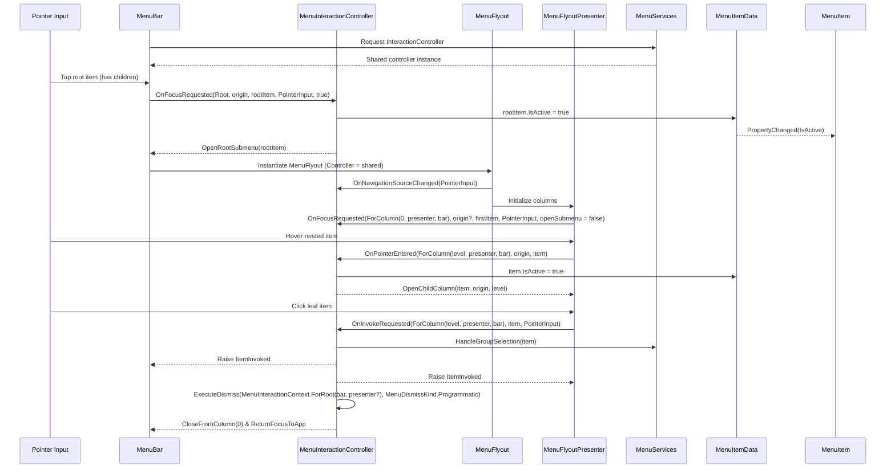
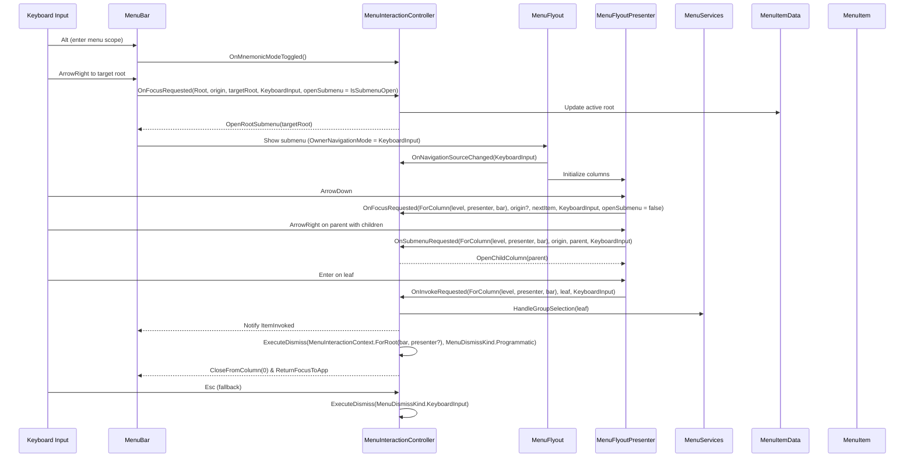
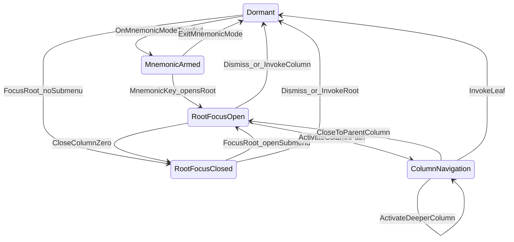

# Menu System Interaction Guide

## Key principles

- **Single writer:** `MenuInteractionController` is the only component that mutates `MenuItemData.IsActive`. Surfaces publish input; the controller resolves the active path and clears it on dismissal.
- **Surface indirection:** `MenuBar`, `MenuFlyout`, and `MenuFlyoutPresenter` implement `IMenuInteractionSurface`, letting the controller drive focus, submenu creation, invocation, and teardown without duplicating view logic.
- **Context-first API:** Every controller call includes a `MenuInteractionContext`. Surfaces must supply themselves when creating the context—`MenuInteractionContext.ForRoot(rootSurface, columnSurface?)` and `MenuInteractionContext.ForColumn(level, columnSurface, rootSurface?)`—so the controller can orchestrate follow-up actions without additional attachment steps.
- **Navigation mode awareness:** Surfaces call `OnNavigationSourceChanged` with `MenuInteractionActivationSource.PointerInput`, `KeyboardInput`, or `Mnemonic`. The resulting `NavigationMode` feeds all downstream focus decisions.

## Actors at a glance

| Actor | Role | Notes |
| --- | --- | --- |
| `MenuItemData` | Data contract | Raises `PropertyChanged`; the controller toggles `IsActive`, `IsChecked`, etc. |
| `MenuItem` | Visual element | Emits hover/invoke/submenu events and reacts to `IsActive` changes with visual states. |
| `MenuServices` | Service hub | Owns the shared controller, supplies lookup data, and coordinates radio-group selection. |
| `MenuInteractionController` | Coordinator | Tracks navigation mode, activates items, requests submenus, invokes items, and dismisses the chain. |
| `MenuBar` | Root surface | Hosts root items, materializes `MenuFlyout`, forwards root events, and respects controller commands. |
| `MenuFlyout` | Flyout host | Shows cascading columns, attaches/detaches the controller, updates navigation mode, and reports closing. |
| `MenuFlyoutPresenter` & `MenuColumnPresenter` | Column surfaces | Implement column-level portions of `IMenuInteractionSurface` and relay hover/invoke/submenu requests. |

## Interaction contexts

| Context | Source | Typical triggers | Controller scope |
| --- | --- | --- | --- |
| `MenuInteractionContext.ForRoot(rootSurface, columnSurface?)` | `MenuBar` | Pointer activation, keyboard navigation, mnemonic selection of roots | Column level `0`; controller closes flyout columns starting at `1` and focuses root containers. |
| `MenuInteractionContext.ForColumn(level, columnSurface, rootSurface?)` | `MenuFlyoutPresenter` / `MenuColumnPresenter` | Hover, submenu expansion, invocation inside a flyout | Column level `level`; controller trims deeper columns (`> level`) and focuses the owning item. |

## Input channels

### Pointer input

1. `MenuBar` receives `PointerEntered` with a submenu already open and calls `OnPointerEntered(MenuInteractionContext.ForRoot(menuBar), origin, item, menuOpen: true)`.
2. Root clicks forward to `OnFocusRequested(MenuInteractionContext.ForRoot(menuBar), origin, rootItem, MenuInteractionActivationSource.PointerInput, openSubmenu: true)`. The controller activates the root, sets `NavigationMode` to pointer input, and asks the bar to open its submenu.
3. `MenuColumnPresenter` reports hover via `OnPointerEntered(MenuInteractionContext.ForColumn(level, presenter, menuBar), origin, item)`, letting the controller move the active path and request a child column when `item.HasChildren`.
4. Column invocations call `OnInvokeRequested` with the column context. The controller applies radio-group logic, raises `Invoke`, and dismisses the chain (`MenuDismissKind.Programmatic`).
5. Pointer dismissal outside the menu calls `OnDismissRequested(MenuInteractionContext.ForRoot(menuBar), MenuDismissKind.PointerInput)`, clearing every active item and returning focus to the bar.

### Keyboard input

#### Root context

- The owning surface updates the navigation source—e.g., `MenuFlyout` calls `OnNavigationSourceChanged(MenuInteractionActivationSource.KeyboardInput)` when displayed from the keyboard.
- Arrow navigation uses `OnFocusRequested(MenuInteractionContext.Root, origin, targetRoot, MenuInteractionActivationSource.KeyboardInput, openSubmenu: IsSubmenuOpen)`, keeping the controller authoritative over focus and submenu lifecycle.
- `Enter`/`Space` on a root with children simply call `OnFocusRequested(..., openSubmenu: true)` to open column 0 under controller control.

#### Column context

- `MenuColumnPresenter` reports focus changes via `OnFocusRequested(MenuInteractionContext.ForColumn(level, presenter, rootSurface), origin?, item, MenuInteractionActivationSource.KeyboardInput, openSubmenu: false)` and requests children through `OnSubmenuRequested` when necessary.
- Navigating left collapses trailing columns via controller-issued `CloseFromColumn(parentLevel + 1)`; hosts follow up by focusing the parent item.
- Invoking a leaf item calls `OnInvokeRequested(MenuInteractionContext.ForColumn(level), item, MenuInteractionActivationSource.KeyboardInput)`.

### Mnemonic mode

1. The application shell toggles mnemonics by calling `OnMnemonicModeToggled(MenuInteractionContext.ForRoot(rootSurface, columnSurface?))`. Entering mode sets `NavigationMode` to keyboard and invokes `ShowMnemonics()` on every attached surface.
2. `OnMnemonicKey(MenuInteractionContext.ForRoot(rootSurface, columnSurface?), char key)` looks up the matching item via `MenuServices`. Items with children trigger the same activation pipeline used for keyboard navigation; command items invoke immediately with `MenuInteractionActivationSource.Mnemonic`.
3. Pressing `Alt` again or otherwise dismissing the menu routes through `OnDismissRequested(MenuInteractionContext.ForRoot(rootSurface, columnSurface?), MenuDismissKind.MnemonicExit)` so mnemonics hide before focus returns.

## Controller API cheat sheet

| Method | Context argument | Typical caller(s) | Effect |
| --- | --- | --- | --- |
| `OnNavigationSourceChanged(source)` | N/A | `MenuBar`, `MenuFlyout` | Updates `NavigationMode`; entering mnemonic mode toggles `mnemonicMode` and shows mnemonics. |
| `OnPointerEntered(context, origin, item, menuOpen)` | Root / column | `MenuBar`, `MenuColumnPresenter` | Activates hovered items (when appropriate) and, if needed, requests a submenu. |
| `OnFocusRequested(context, origin, item, source, openSubmenu)` | Root / column | `MenuBar`, keyboard helpers, column presenters | Activates `item` under keyboard control and optionally opens its submenu. |
| `OnSubmenuRequested(context, origin, item, source)` | Root / column | Column presenters | Forces a submenu open without relying on hover timing. |
| `OnInvokeRequested(context, item, source)` | Root / column | `MenuBar`, column presenters | Applies selection semantics, raises `Invoke`, and dismisses the chain. |
| `OnRadioGroupSelectionRequested(item)` | N/A | `MenuItem` | Delegates to `MenuServices.HandleGroupSelection`. |
| `OnDismissRequested(context, kind)` | Root / column | Any surface | Clears `IsActive`, hides mnemonics, closes surfaces, and returns focus. |
| `OnMnemonicModeToggled(context)` / `OnMnemonicKey(context, key)` | Root | Shell integration | Enters/exits mnemonic mode or activates the matching mnemonic item. |

> **Note:** Programmatic helpers (`RequestSubmenu`, `ActivateItem`, `Dismiss`) remain intentionally disabled. Surfaces should exclusively use the `On*` entry points above so that orchestration lives entirely inside the controller.

## Interaction sequences

### Pointer-driven navigation

### Keyboard-driven navigation

## Controller state machine

### States

| State | Meaning | Representative data |
| --- | --- | --- |
| `Dormant` | No menu path active; controller waits for pointer hover or mnemonic toggle. | `NavigationMode = PointerInput`, `activeByColumn.Count = 0`, `mnemonicMode = false`. |
| `MnemonicArmed` | Mnemonics visible but no root chosen. | `mnemonicMode = true`, `activeByColumn.Count = 0`. |
| `RootFocusClosed` | Root item active, submenu closed. | `activeByColumn[0] = root`, flyout hidden. |
| `RootFocusOpen` | Root active with column 0 visible. | `activeByColumn[0] = root`, additional entries possible. |
| `ColumnNavigation` | Focus inside flyout columns (`level >= 0`). | Top-most key in `activeByColumn` reflects the focused column. |

### Key transitions

| Trigger | From → To | Notes |
| --- | --- | --- |
| `OnMnemonicModeToggled` (enter) | `Dormant → MnemonicArmed` | Shows mnemonics without activating items. |
| `OnMnemonicKey` (root with children) | `MnemonicArmed → RootFocusOpen` | Activates root and opens column 0. |
| `OnMnemonicModeToggled` (exit) / `OnDismissRequested(MnemonicExit)` | `MnemonicArmed → Dormant` | Hides mnemonics and resets state. |
| `OnFocusRequested` (root, `openSubmenu: false`) | `Dormant → RootFocusClosed` | Activates a root without opening a submenu. |
| `OnFocusRequested` (root, `openSubmenu: true`) or `OnPointerEntered` with `menuOpen: true` | `RootFocusClosed → RootFocusOpen` | Opens column 0 and readies column presenters. |
| `ActivateItem` / `OnPointerEntered` (column) | `RootFocusOpen → ColumnNavigation` | Adds or updates the focused column entry. |
| `CloseFromColumn(1)` | `RootFocusOpen → RootFocusClosed` | Flyout closed while keeping the root active. |
| `CloseFromColumn(parentLevel + 1)` | `ColumnNavigation → RootFocusOpen` | User navigated back to a shallower column. |
| `OnInvokeRequested` (leaf) | `ColumnNavigation → Dormant` | Invokes command and dismisses. |
| `OnDismissRequested(*)` | Any → `Dormant` | Universal tear-down path. |

## Surface responsibilities

- **`MenuBar`**: Attaches the shared controller, forwards root events, opens flyouts when instructed, and honors `CloseFromColumn(0)` / `ReturnFocusToApp()` callbacks.
- **`MenuFlyout`**: Provides the controller to `MenuFlyoutPresenter`, updates navigation mode on open, and relays closing through `OnDismissRequested` (currently always `MenuDismissKind.Programmatic` pending richer WinUI close reasons).
- **`MenuFlyoutPresenter`**: Hosts columns, delegates column-level events, and implements the `IMenuInteractionSurface` members relevant to nested items.
- **`MenuColumnPresenter`**: Wraps realized `MenuItem` controls, forwarding hover, submenu, radio selection, and invoke requests to the controller.
- **`MenuServices`**: Supplies the shared controller, exposes lookup data for mnemonics, and applies radio-group coordination.

## Dismissal flow

1. Any surface calls `OnDismissRequested(kind)` (or `Dismiss()`).
2. The controller clears `activeByColumn`, sets all `MenuItemData.IsActive = false`, hides mnemonics when necessary, and resets `NavigationMode` to `PointerInput`.
3. `CloseFromColumn(0)` and `ReturnFocusToApp()` are issued to the root surface, ensuring a predictable teardown order.
4. Current flyout implementation always reports `MenuDismissKind.Programmatic`; refine once WinUI exposes precise close reasons (see TODO in `MenuFlyout.OnFlyoutClosing`).

## Follow-up

- [x] Propagate context-based controller APIs across `MenuBar`, `MenuFlyout`, and `MenuFlyoutPresenter`.
- [ ] Add scenario tests covering pointer navigation, keyboard traversal, mnemonic activation, and dismissal variants.
