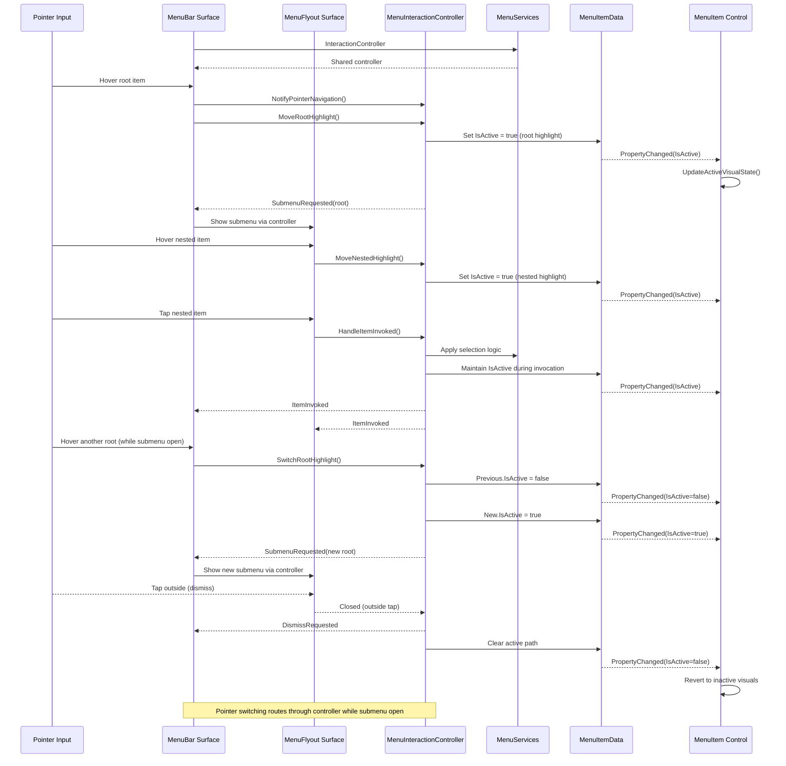
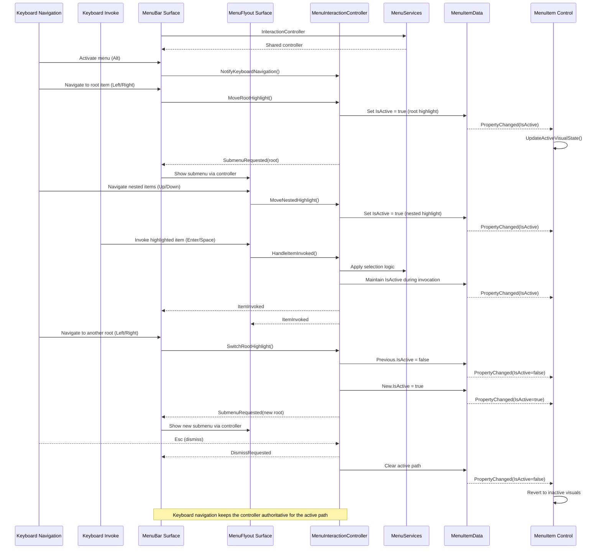
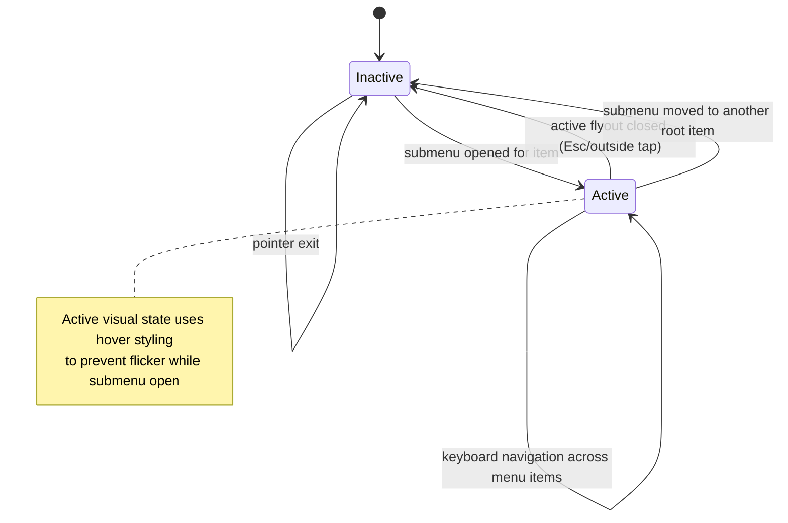
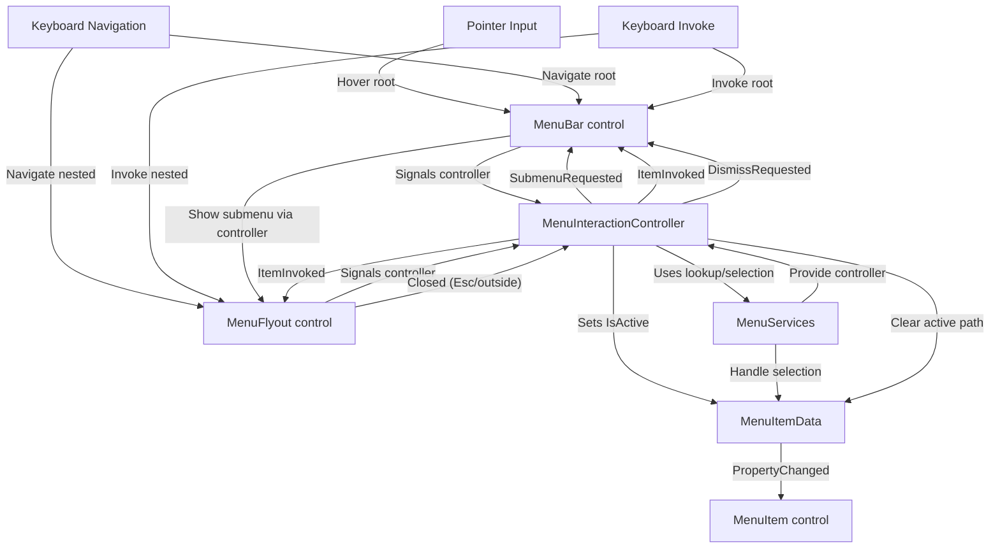

# Menu System Refactor Notes

## Ownership Flow for `IsActive`

Use this section as the single source of truth when refactoring how menu highlights work.

- **Terminology**
  - *Root item*: a top-level menu bar entry (e.g., File, Edit). These are the only items that can open flyouts directly from the bar.
  - *Nested item*: any item inside a flyout (including children and subchildren). They can open cascading submenus but do not live on the bar itself.
  - *Host surface*: either `MenuBar` (roots) or a displayed `MenuFlyout` column (nested).
  - *Interaction controller*: a shared `MenuInteractionController` created and owned by `MenuServices` that tracks the current navigation mode, opens submenus, and owns active-state transitions across every host surface.
- **Authority**: the interaction controller is the single writer for `MenuItemData.IsActive`. Host surfaces publish input signals, the controller resolves the active path, and `MenuItem` instances react via `PropertyChanged`.
- **Observers**: `MenuItem` controls listen to the `PropertyChanged` event and update their visual states accordingly.
- **Pointer interaction model**
  - `PointerEntered` sets hover visuals; host surfaces also notify the controller so it can keep the navigation mode in sync but no `IsActive` change occurs unless a submenu is already open.
  - `PointerPressed/Tapped` on a root item asks the controller to open the submenu, set the root `IsActive = true`, and raise a submenu request that `MenuBar` satisfies.
  - `PointerExited` clears hover visuals only; the controller leaves `IsActive` intact until an explicit dismissal.
  - Pointer taps outside the menu route through the controller-driven dismissal path, which clears `IsSubmenuOpen` and resets all active flags.
- **Keyboard interaction model**
  - **Navigation**
    - When the menu bar is active and no flyout is open, Alt+Left/Right (or custom shortcuts) cycle highlighted roots by telling the controller to move the active index; the controller updates `IsActive` and announces which submenu should appear.
    - When a flyout is open, the arrow keys (Up/Down/Left/Right) flow through `MenuFlyoutPresenter` into the controller, which updates `IsActive` for each nested highlight and raises `SubmenuRequested` for cascading columns.
  - **Invoke**
    - Enter/Space activate whichever item is currently highlighted (root or nested). The controller keeps that item active until the command completes or the menu closes.
    - Alt+Mnemonic and accelerators may jump directly to nested commands; the controller resolves the target item (via `MenuServices` lookup) and marks it active for the duration of the command.
  - **Dismissal** via Esc (or Alt release depending on shell) flows through the controller so it can close presenters and clear the entire active chain.
- **Additional transitions**
  - Switching between root items while a flyout is open is mediated by the controller: it signals the bar to close the previous chain, deactivates its items, and activates the newly highlighted root before reissuing a `SubmenuRequested` event.
  - Closing the active flyout from any path signals the controller to reset its navigation mode, clear every `IsActive` flag, and notify surfaces to revert their visual state.

### Sequence overview (pointer navigation)



### Sequence overview (keyboard navigation)



### State transitions



## Control responsibilities (no new classes)

Refactor within the existing WinUI control model: keep `MenuBar`, `MenuFlyout`, and `MenuItem` as the primary actors, backed by `MenuItemData`. The goal is to clarify ownership without introducing extra view-model classes.

### `MenuItemData` (data contract)

- Continues to carry immutable presentation data plus mutable flags such as `IsActive`, `IsEnabled`, and `IsChecked`.
- Raises `PropertyChanged` so controls stay synchronized with coordinator decisions.
- No additional logic needed; treat it as the canonical data source.

### `MenuItem` (control)

- Owns the template and visual states only; no submenu decision logic.
- Reacts to `ItemData.PropertyChanged` by updating visuals (`UpdateActiveVisualState`, `UpdateInteractionVisualState`).
- Forwards user interactions (pointer enter, invoke, submenu request) to the observing host surface, which immediately relays them to the interaction controller—keep these thin.

### `MenuBar` (host surface)

- Requests the shared `MenuInteractionController` instance from `MenuServices` and stores it alongside its `MenuSource`.
- Listens to `SubmenuRequested` so it can materialize or recycle the active `MenuFlyout` without mutating `MenuItemData` directly.
- Passes the controller instance to the flyout before showing it, keeps container state (`IsSubmenuOpen`, `OpenRootIndex`) in sync with controller callbacks, and ensures dismissal funnels through the controller.

### `MenuFlyout` (host surface)

- Receives the controller reference from `MenuServices` (handed over by `MenuBar`), attaches it to `MenuFlyoutPresenter` columns, and detaches on close without creating new controller instances.
- Forwards nested pointer/keyboard events, `Closed`, and `ItemInvoked` notifications to the controller.
- Avoids writing `MenuItemData` itself; instead, it trusts the controller to update highlights and trigger cascading submenus.

### `MenuInteractionController` (shared coordinator)

- Lives in `Infrastructure`, is constructed and owned by `MenuServices`, and is reused by `MenuBar` plus any active `MenuFlyout` instances.
- Tracks the active navigation mode (`PointerInput` vs `KeyboardInput`), raises `SubmenuRequested`/`ItemInvoked`, and performs every `MenuItemData.IsActive` mutation.
- Publishes a `DismissRequested` event whenever the active chain must close, keeping surfaces in sync regardless of who initiated the dismissal.
- Routes selection work through `MenuServices` for radio-group consistency and exposes helpers (`NotifyPointerNavigation`, `RequestSubmenu`, `HandleItemInvoked`).

### `MenuServices` (lookup + selection helpers)

- Provides stable lookup over the menu hierarchy, centralizes radio-group/toggle coordination, and owns the singleton `MenuInteractionController`.
- Supplies the controller to any host surface through an accessor (e.g., the `InteractionController` property), keeping ownership outside view types.
- Keeps the active path queryable for diagnostics or advanced scenarios.

### Communication highlights

- `MenuBar` and `MenuFlyout` forward pointer/keyboard events into the shared `MenuInteractionController`; neither surface should set `MenuItemData.IsActive` directly.
- The controller sets navigation mode, updates `IsActive`, and raises `SubmenuRequested`/`ItemInvoked` using `MenuServices` as needed for lookup and selection consistency.
- `MenuItem` only listens and reflects the state visually.
- `MenuBar` requests the controller from `MenuServices` once and hands the reference to every flyout it shows so dismissal flows (Esc/outside tap/command completion) land on the controller, which clears every active flag before the bar hides presenters.

## Interaction flow (hover → open → close)



## Class relationships

```mermaid
classDiagram
    class MenuItemData {
        +string Text
        +IconSource? Icon
        +bool IsActive
        +bool IsChecked
        +IEnumerable<MenuItemData> SubItems
    }
    class MenuItem {
        +MenuItemData? ItemData
        +bool ShowSubmenuGlyph
        +void UpdateActiveVisualState()
        +event MenuItemSubmenuEventHandler SubmenuRequested
    }
    class MenuBar {
        -MenuFlyout? activeFlyout
        -MenuItem? activeRootItem
        +MenuInteractionController Controller
        +void AttachController(MenuInteractionController)
        +void ShowSubmenu(MenuSubmenuRequestEventArgs)
        +void CloseActiveFlyout()
    }
    class MenuFlyout {
        +IMenuSource? MenuSource
        +MenuInteractionController? Controller
        +void ShowAt(FrameworkElement, FlyoutShowOptions)
        +event EventHandler<object> Closed
        +event EventHandler<MenuItemInvokedEventArgs> ItemInvoked
    }
    class MenuInteractionController {
        -MenuServices services
        +MenuNavigationMode NavigationMode
        +void NotifyPointerNavigation()
        +void NotifyKeyboardNavigation()
        +void RequestSubmenu(FrameworkElement, MenuItemData, int, MenuNavigationMode)
        +void HandleItemInvoked(MenuItemData)
        +event EventHandler<MenuSubmenuRequestEventArgs> SubmenuRequested
        +event EventHandler<MenuItemInvokedEventArgs> ItemInvoked
    +event EventHandler DismissRequested
    }
    class MenuServices {
        +bool TryGetMenuItemById(string, MenuItemData)
        +IReadOnlyDictionary<string, MenuItemData> GetLookup()
        +void HandleGroupSelection(MenuItemData)
        +MenuInteractionController InteractionController { get }
    }

    MenuBar --> MenuItem : hosts roots
    MenuBar --> MenuInteractionController : uses shared
    MenuFlyout --> MenuInteractionController : uses shared
    MenuServices --> MenuInteractionController : owns lifetime
    MenuInteractionController --> MenuServices : delegates
    MenuInteractionController --> MenuItemData : writes state
    MenuItem --> MenuItemData : binds to
    MenuFlyout --> MenuItemData : renders children
```

## Next Steps Checklist

- [x] Retrieve the shared `MenuInteractionController` from `MenuServices` inside `MenuBar`, remove direct `IsActive` mutations, and handle controller callbacks for submenu lifecycle.
- [x] Ensure `MenuFlyout`/`MenuFlyoutPresenter` attach to the controller supplied by `MenuServices` (via `MenuBar`) and funnel highlight changes through it.
- [x] Centralize `IsActive` writes and dismissal logic inside the controller + `MenuServices`, updating unit tests for radio-group interactions.
- [ ] Add regression tests covering pointer/keyboard navigation, cascading flyouts, and close scenarios.
