# TabStrip Drag-Drop Specifications

The drag-and-drop behavior in the `TabStrip` control enables intuitive, direct
manipulation of `TabStripItem` items within and across tab strips, including
tab strips in other windows.

Its purpose is to support reordering, detachment (tear-out), and reattachment of
tabs through pointer gestures, while preserving logical identity and user
context.

This specification defines the interaction model, event surface, and constraints
governing drag initiation, visual feedback, drop targets, and lifecycle
coordination.

## Terminology

This specification uses the following terms consistently:

- **Tab** or **tab item** (informal): Generic user-facing concept describing an item in a tab strip.
- **`TabItem`** (model): The logical data model representing a tab's content and metadata (see `TabItem.cs`).
  All EventArgs use `TabItem` to allow application handlers to work with the model rather than visual controls.
- **`TabStripItem`** (visual control): The visual UI control that renders a single `TabItem` within a `TabStrip`.
- **`TabStrip`** (container): The control that hosts zero or more `TabStripItem` instances.

Throughout this document:

- "Drag a tab" or "the tab being dragged" refers to user-facing description.
- "`TabItem`" is used in technical sections, event signatures, and application contracts.
- "`TabStripItem`" is used when discussing visual control behavior, layout, or visibility.

## Behaviors

TabStrip drag/drop is intimately linked with its tab activation behavior. This
specification covers both.

## Tab Activation

Tab activation occurs when a tab is activated via explicit user interaction or
programmatically. In the context of `TabStrip` drag-drop, we only care about
pointer-initiated activation (e.g. mouse).

With a pointer (e.g., mouse, touch), tab activation occurs when the user taps or
clicks on a tab. Note that during multiple selection scenarios, clicking a tab
to add it to the selection or to extend the selection up to that tab, will
activate the tab as well. But, clicking a tab that is already selected to
exclude it from the selection will not activate the tab.

Because tab dragging will always be initiated with a pointer click, it will
always act on an activated tab, that tab will always be the currently selected
item, and in multi-selection scenarios, initiating the drag will reset the
selection to only the tab being dragged.

**Multi-Selection During Drag**: If the application supports multi-selection, any
active multi-selection is cleared when a drag begins. Only the dragged tab remains
selected. This ensures a clear, predictable interaction model: the user is
unambiguously dragging a single tab, and can focus on pointer positioning rather
than managing a selection set.

## Drag/Drop

From a user experience point of view, here is what happens during a drag/drop
operation:

- **Initial state**: a `TabStripItem` was clicked, is activated and is selected.

- **Drag initiated**: the `TabStripItem` is hidden, a snapshot of the tab header
  is attached as the drag image. If the application responds to
  `TabDragImageRequest`, a preview of the tab’s document content may be layered
  beneath the header. The space previously allocated for the tab being dragged,
  is still allocated but looks empty.

- **Drag within the `TabStrip`**: While the pointer remains inside the `TabStrip`,
  the dragged `TabStripItem` moves with the pointer. When it crosses the threshold
  of an adjacent item, their positions swap. The dragged item's original space
  remains allocated but appears empty during the operation. On drop, the item
  settles in its new position. **Note**: The item remains active throughout; it
  is not re-activated on drop.

- **Drag out of the `TabStrip`**: at any point in time during the drag
  operation, the item being dragged can leave the `TabStrip` bounds. When this
  occurs, the control executes the following sequence:

  1. `TabDragImageRequest` is raised. The application may provide a document
     preview via the event args; this is used to enhance the drag visual.
  2. `TabCloseRequested` is raised. The application **must** remove the tab's
     `TabItem` from its model/collection; the control does not remove it.
  3. If both handlers complete successfully, the hidden item space becomes
     invalid for subsequent drop operations within this `TabStrip`.

  If either handler throws or causes an unrecoverable error, the drag aborts,
  and `TabDragComplete` is raised with `DestinationStrip = null`.

- **Drag over a `TabStrip`**: at any point in time during the drag operation,
  the item being dragged can enter the bounds of a `TabStrip` control, in any
  same application window. When that happens, the following chain of events will
  be triggered:

  - A new `TabStripItem` will be added to the `TabStrip`, using the same
    `TabItem` data as the item being dragged, but will be hidden. Space in the
    `TabStrip` for the newly added item is allocated, but appears empty. The
    position of the new item is determined based on where the item being dragged
    is currently positioned within the `TabStrip`.
  - Once the new item is inserted, it is explicitly activated and selected.
    Activation events are triggered only after layout and visibility are valid.
    Events related to selection change and activation are triggered as usual.
  - The drag operation continues as if it were "**Drag within the `TabStrip`**`.

- **Drop over a `TabStrip`**: dropping the item over a strip will always happen
  after the chain of events of "**Drag over a `TabStrip`**" has completed. It
  will:
  - Stop attaching a drag image to the pointer.
  - Release the pointer.
  - Complete the drag operation and trigger the `TabDragComplete`.

- **Drop out of any `TabStrip`**: dropping the item outside of any `TabStrip` in
  any application window, should be considered as a request to create a new
  window and host the dropped tab in a new `TabStrip` in that window. This is a
  complex operation that really does not make sense to be handled by a
  `TabStrip` control. Instead, the control:
  - triggers the `TabTearOutRequested` event, and lets the application easily
    handle the new window creation, and the rest of the operations needed to
    create a `TabStrip`, add the item to it and activate it.
  - Complete the drag operation and trigger the `TabDragComplete`.

- **Esc or Errors during drag/drop**: From the control's perspective, a drag or
  a drop is always completed — the gesture ends, and the pointer is
  captured/released. `Esc` does not cancel the operation, but instead is
  interpreted as a drop. It is the application's responsibility to handle errors
  appropriately when they occur inside the application. Unrecoverable errors
  inside the control will abort the operation, the pointer will be released, if
  captured, and the `TabDragComplete` will be triggered even with no target
  `TabStrip` or `NewIndex`.

## Activation & Selection Event Timing

When a hidden `TabStripItem` is inserted over another `TabStrip` during drag:

1. The item is added to the `TabStrip`'s collection but not yet visible.
2. The control performs a layout pass (Measure + Arrange phases).
3. The item is made visible (visibility restored).
4. Selection and activation events are raised in the standard order:
   - `SelectionChanged` (if using `ItemsControl` patterns)
   - Any `TabActivated` or equivalent event

**Important**: Handlers of these events must not modify the `TabStrip`'s collection
or drag state. Such modifications may cause undefined behavior or abort the drag
operation. The application should treat these events as informational during an
active drag, and defer model changes until `TabDragComplete` is raised.

## Pointer Capture & Cross-Window Resilience

- **Capture Scope**: The originating `TabStrip` captures the pointer on the initial
  `PointerPressed` event to track the drag gesture.
- **Capture Release**: Pointer capture is released when the drag completes (on drop),
  or when the gesture is aborted (Esc pressed or unrecoverable error).
- **Cross-Window Dragging**: If the source window closes during an active drag, the
  pointer capture is lost. The `TabDragCoordinator` continues to manage the drag
  state and visual overlay by polling the global cursor position via `GetCursorPos()`
  and updates the overlay by calling `IDragVisualService.UpdatePosition()` until the
  drag completes or fails.
- **Pointer Delivery Resilience**: Do not assume continuous `PointerMoved` events
  during cross-window drag operations. The coordinator polls the cursor to drive the
  visual overlay, ensuring smooth visual feedback even after pointer capture loss.

## Application Recommendations on TearOut

- Handle `TabCloseRequested` properly from a tabbed document point of view, but
  in all scenarios, the tab item must be removed from the `TabStrip`. There is
  no cancellation of a tear-out, and it is not a destructive operation as long
  as the tab document data model is properly handled by the application.

- Consider closing the window (if it makes sense for the application, and in
  most cases it will) when the last item is removed from the `TabStrip` (i.e.
  Items.Count == 0).

## Events summary

The following table lists the key events raised by `TabStrip` during drag/drop
operations, when they are raised, the suggested EventArgs class name, and the
important properties each EventArgs should carry.

| Event | When raised | Suggested EventArgs type | Key EventArgs properties |
|---|---|---:|---|
| `TabDragImageRequest` | When the dragged tab leaves its originating `TabStrip` and the control requests a document preview for the drag image | `TabDragImageRequestEventArgs` | `TabItem Item` · `Windows.Foundation.Size RequestedSize` · `Microsoft.UI.Xaml.Media.ImageSource? PreviewImage` (set by handler) |
| `TabCloseRequested` | When a tab is dragged out of its originating `TabStrip` (tear-out begins). The application is expected to remove the tab from its model/collection. | `TabCloseRequestedEventArgs` | `TabItem Item` |
| `TabDragComplete` | After a drop into a `TabStrip`, or out completes successfully or not — indicates the drag operation finished and the item is "eventually" attached to the destination. | `TabDragCompleteEventArgs` | `TabItem Item` · `TabStrip? DestinationStrip` · `int? NewIndex` |
| `TabTearOutRequested` | When a tab is dropped outside any `TabStrip` — the application should create a new window and host the tab there. | `TabTearOutRequestedEventArgs` | `TabItem Item` · `Windows.Foundation.Point ScreenDropPoint` |

Notes:

- Use the logical model type `TabItem` (see `TabItem.cs`) in EventArgs so
  handlers can operate on the model rather than visual controls.
- There is no cancellation or rejection of a drag or drop operation, and that is
  why the event args do not contain a `Handled` field. We expect most of the
  events (except for informative ones such as `TabDragComplete`) to be handled
  at one single point of control within the application (recommended).
- Keep `TabDragImageRequest` handlers non-blocking: return a lightweight preview
  synchronously when possible. If an async preview is required, handlers should
  populate `PreviewImage` quickly with a placeholder that gets filled
  asynchronously.

## Tear-Out Contract & Error Recovery

When the user drops a tab outside any `TabStrip`, the control raises `TabTearOutRequested`.
The application **must** handle this event and create a new window with a new `TabStrip`
and host the dropped `TabItem` there.

**Important Contract**:

- **Handler Responsibility**: The application handler must create the window, add the
  `TabItem` to a `TabStrip`, and manage the lifetime of the new window. If no handler
  is attached, or the handler does nothing, the `TabItem` becomes orphaned (not hosted
  in any `TabStrip`).
- **Orphaned Items**: Every `TabItem` must exist in exactly one `TabStrip` at all times.
  If an item becomes orphaned (e.g., handler throws or fails to create a window), it is
  the application's responsibility to recover or discard the item.
- **Handler Exceptions**: If the `TabTearOutRequested` handler throws an exception, the
  control catches it, aborts the drag, and raises `TabDragComplete` with `DestinationStrip = null`.
  The application should log the error and attempt recovery (e.g., restoring the item to
  its original `TabStrip` or discarding it).
- **Persistence**: Once `TabTearOutRequested` is raised, the original `TabItem` has been
  removed from its source `TabStrip` (via `TabCloseRequested`). The application must not
  re-add it to the source strip after tear-out failure; instead, create a new `TabItem`
  or implement a recovery strategy suitable for the application.

## State machine diagram

Below is a visual state machine for the TabStrip drag/drop flow. It covers
pointer activation, dragging inside the originating strip, dragging out
of the strip (tear-out path), entering another `TabStrip`, drops, and
failure/cancel paths. Event names that the control raises (or expects the
application to handle) are shown on the transitions where they occur.

```mermaid
stateDiagram-v2
    [*] --> Idle

    Idle --> PointerDown : pointer click / activate & select
    PointerDown --> DragInitiated : pointer move (drag threshold)

    DragInitiated --> DragWithinStrip : pointer inside origin TabStrip
    DragWithinStrip --> DragWithinStrip : cross-adjacent-threshold / swap
    DragWithinStrip --> DragOutOfStrip : pointer leaves origin bounds

    DragOutOfStrip --> RequestDragImage : raise TabDragImageRequest
    DragOutOfStrip --> TabCloseRequested : raise TabCloseRequested (app removes item)

    DragOutOfStrip --> DragOverOtherStrip : pointer enters another TabStrip
    DragOverOtherStrip --> InsertHiddenItem : insert hidden item (allocate space)
    InsertHiddenItem --> ActivateNewItem : selection/activation events
    ActivateNewItem --> DragWithinStrip : continue drag inside destination

    DragWithinStrip --> DropOverStrip : pointer release inside TabStrip
    DropOverStrip --> TabDragComplete : raise TabDragComplete
    TabDragComplete --> Completed

  DragOutOfStrip --> DropOutside : pointer release outside any TabStrip
  DropOutside --> TabTearOutRequested : raise TabTearOutRequested (app creates window)
  %% Tear-out requests are immediately followed by drag completion from the control's perspective
  TabTearOutRequested --> TabDragComplete : app handles new window; control completes drag

  %% Esc does NOT cancel; it is interpreted as a drop at the current pointer location.
  %% Model this as two possible drop transitions depending on pointer location.
  DragInitiated --> DropOverStrip : Esc (interpreted as drop if pointer over TabStrip)
  DragInitiated --> DropOutside : Esc (interpreted as drop if pointer outside any TabStrip)

  %% Unrecoverable internal control errors abort the drag and surface a TabDragComplete
  %% with no target (no "DestinationStrip / NewIndex). Application-level errors
  %% should be handled by the application and do not change the control's
  %% responsibility to complete the drag gesture. The note on the right indicates
  %% that such errors can occur from any state.
  %% Unrecoverable internal errors can occur from any state.
  %% When they do, the control aborts the drag and raises `TabDragComplete`
  %% with no `DestinationStrip`/`NewIndex` (application should handle cleanup).

    Completed --> [*]

  %% Notes as pseudo-states to clarify events
  %% Use unique substate names so Mermaid doesn't coalesce identical substate ids
    state RequestDragImage_wait {
      [*] --> waiting_request
      waiting_request --> [*]
    }
    state TabCloseRequested_event {
      [*] --> tabclose_signaled
      tabclose_signaled --> [*]
    }

    state TabDragComplete_event {
      [*] --> dragcomplete_signaled
      dragcomplete_signaled --> [*]
    }

    state TabTearOutRequested_event {
      [*] --> tearout_signaled
      tearout_signaled --> [*]
    }

    %% Side note: unrecoverable internal errors can occur from any state
    note right of Idle
      Unrecoverable internal errors may occur in any state.
      When they do, the control aborts the drag and raises `TabDragComplete`
      with no `DestinationStrip`/`NewIndex` (application should handle cleanup).
    end note
```



### Legend / mapping to spec

- Idle — no pointer interaction.
- PointerDown — tab clicked; becomes active and selected. Multi-selection resets to the dragged tab.
- DragInitiated — pointer moved beyond drag threshold; drag image attached, tab header hidden in origin.
- DragWithinStrip — pointer remains inside a TabStrip; crossing adjacent thresholds causes visual swapping (reordering).
- DragOutOfStrip — pointer leaves a TabStrip; control requests `TabDragImageRequest` and raises `TabCloseRequested` for origin.
- DragOverOtherStrip / InsertHiddenItem / ActivateNewItem — entering another TabStrip inserts a hidden item, allocates space, and activates it; dragging continues.
- DropOverStrip — release inside a TabStrip; raises `TabDragComplete`, stops attaching drag image, releases pointer.
- DropOutside — release outside any TabStrip; raises `TabTearOutRequested` so the app can create a new window and host the tab.
- Unrecoverable internal errors — internal control error aborts the operation; the pointer is released and `TabDragComplete` is raised with no `DestinationStrip`/`NewIndex`.
- Application errors — application handlers should manage recoverable errors; the control expects handlers to perform appropriate cleanup. The control will still complete the gesture from its perspective.
- Completed — final state after cleanup and events.

## Implementation Notes

- During drag over a `TabStrip`, the inserted (but to be confirmed)
  `TabStripItem` is a fully working item, selected and activated like any other
  item added to the `TabStrip`, but simply not yet permanent, and is hidden as
  if it were dragged. Once the drop is done, it is confirmed. If the drag leaves
  the `TabStrip`, it goes through the same lifecycle as an item that was dragged
  out.

- **TabDragCoordinator**: An internal class registered as a singleton in the DI container that maintains the active
  drag state across all `TabStrip` instances in the same application process.

  Design:
  - Singleton pattern: Only one drag session may exist per process.
  - Maintains state: Currently dragged `TabItem`, source `TabStrip`, hit-test
    results, and the `IDragVisualService` session token.
  - Thread-safety: UI-thread affinity only; no internal locks required (all calls
    must be from UI thread).
  - Resilience: Survives source window closure during cross-window drag by polling
    the global cursor and driving the overlay.
  - The `TabStrip` control should expose dependency properties for injecting the
    `TabDragCoordinator`, similar to how `ILoggerFactory` can be injected into
    layout managers.
  - Lifecycle: Owns the `IDragVisualService` session and terminates it on successful
    drop, abort, error, or when the coordinator is disposed.
  - Notification: Notifies all `TabStrip` instances in the process of enter/leave/drop
    events to coordinate multi-strip drag operations.

- Cross-window drag image and pointer capture: WinUI 3 doesn't provide one-shot,
  cross-window custom overlays automatically; we must either use native OS
  drag/drop or manage per-window overlays and coordinate them. For same-process
  windows we can coordinate via an in-process shared service
  `IDragVisualService`.

- A boolean IsDragging read-only DP on TabStripItem for template bindings (so
  templates can animate/hide things).

- A DragImage type/utility to display a floating drag image (Popup/Canvas
  layered in AppWindow or in an overlay in the window origin of the drag,
  whichever makes more sense and is more idiomatic to implement in the context
  of a WinUI 3 app).

## Error Handling & User Experience

### Unrecoverable Control Errors

Errors originating within the `TabStrip` control or `TabDragCoordinator` that prevent
drag completion (e.g., out of memory, catastrophic service failure):

- **Visual Feedback**: The drag overlay disappears immediately.
- **Pointer State**: Pointer capture is released.
- **Item State**: The originally dragged `TabStripItem` remains in its original position
  (it was hidden; the control restores visibility).
- **Event Raised**: `TabDragComplete` is raised with `DestinationStrip = null` and `NewIndex = null`.
- **Application Recovery**: The application may detect this state via the null `DestinationStrip`
  and implement error logging, retry, or rollback logic as appropriate.

### Application Errors

Errors thrown by application event handlers (`TabDragImageRequest`, `TabCloseRequested`,
`TabTearOutRequested`):

- **Handling**: The control catches these exceptions; the application does not crash.
- **Propagation**: Treated as unrecoverable; the drag aborts (see above).
- **Responsibility**: The application is responsible for error logging and telemetry.
  Consider logging in handlers before raising exceptions.

### Resilience Best Practices

1. **Defensive Handlers**: Handlers should complete quickly and avoid throwing. If async
   work is required (e.g., `TabDragImageRequest` with async preview generation), return
   a placeholder synchronously and fill it asynchronously.
2. **Tear-Out Error Recovery**: If `TabTearOutRequested` handler fails, the application
   should attempt to recover the `TabItem` (e.g., create a fallback window or discard
   the item gracefully).
3. **State Assertions**: After `TabDragComplete` with `DestinationStrip = null`, verify
   that all related items and windows are in a consistent state.

## The drag visual service

The drag visual service (`IDragVisualService`) is a minimal, process-owned
component responsible for presenting a single floating overlay that follows the
pointer during tab drag operations. At most one drag visual session may exist per
application process; attempting to start a new session while another is active
will throw an `InvalidOperationException`. This design ensures simple, robust
session lifetime management and disposal.

### API Definition

All methods must be called from the application's UI thread. The service is
responsible for overlay creation, positioning, and cleanup. Callers interact
with sessions via an opaque token; the session object itself is not exposed.

```csharp
/// <summary>
/// Opaque token representing an active drag visual session.
/// </summary>
public readonly struct DragSessionToken { }

/// <summary>
/// Service for managing a floating overlay during tab drag operations.
/// At most one session may exist per application process.
/// All methods must be called from the UI thread.
/// </summary>
public interface IDragVisualService
{
  /// <summary>
  /// Starts a new drag visual session. Throws InvalidOperationException if a session is already active.
  /// </summary>
  /// <param name="descriptor">Descriptor containing header and optional preview images.</param>
  /// <param name="hotspot">Point within the header image (image-local coordinates) to align under the pointer.</param>
  /// <returns>Opaque token for session operations.</returns>
  /// <exception cref="InvalidOperationException">Thrown if a session is already active.</exception>
  DragSessionToken StartSession(DragVisualDescriptor descriptor, Windows.Foundation.Point hotspot);

  /// <summary>
  /// Updates the overlay position for the given session.
  /// </summary>
  /// <param name="token">Session token.</param>
  /// <param name="screenPoint">Cursor location in screen physical pixels.</param>
  void UpdatePosition(DragSessionToken token, Windows.Foundation.Point screenPoint);

  /// <summary>
  /// Ends the session and releases all associated resources.
  /// </summary>
  /// <param name="token">Session token.</param>
  void EndSession(DragSessionToken token);

  /// <summary>
  /// Gets the live descriptor for the session, allowing mutation of observable properties during the session lifetime.
  /// </summary>
  /// <param name="token">Session token.</param>
  /// <returns>Live descriptor, or null if session not found.</returns>
  DragVisualDescriptor? GetDescriptor(DragSessionToken token);
}

/// <summary>
/// Observable descriptor for drag visual overlay content.
/// </summary>
public sealed class DragVisualDescriptor : ObservableObject
{
  /// <summary>
  /// Required. Snapshot of the tab header (typically a RenderTargetBitmap).
  /// The hotspot parameter in StartSession is relative to this image's coordinate space.
  /// </summary>
  [ObservableProperty]
  public partial Microsoft.UI.Xaml.Media.ImageSource HeaderImage { get; set; }

  /// <summary>
  /// Optional. Larger preview image (e.g., document snapshot) rendered beneath the header.
  /// </summary>
  [ObservableProperty]
  public partial Microsoft.UI.Xaml.Media.ImageSource? PreviewImage { get; set; }
}
```

### Requirements

| # | Requirement | Notes |
|---|---|---|
| 1 | **Single Active Session** | Only one session per process. `StartSession` throws `InvalidOperationException` if a session exists. |
| 2 | **Session Ownership & Lifecycle** | Service owns all resources; caller holds only the token. Call `EndSession(token)` to complete. Service disposal terminates any active session. |
| 3 | **UI-Thread Affinity** | All API calls must be from the UI thread. Implementations may assume this and avoid internal marshalling. |
| 4 | **Pointer Tracking** | Caller drives overlay via `UpdatePosition(token, screenPoint)` as pointer moves. `screenPoint` is always in screen physical pixels. |
| 5 | **Descriptor Mutability** | Live descriptor obtained via `GetDescriptor(token)` is valid only for session lifetime. Mutations from UI thread auto-update the overlay. |
| 6 | **Click-Through Overlay** | Set `WS_EX_NOACTIVATE` and `WS_EX_TRANSPARENT` on the overlay HWND (via P/Invoke to `SetWindowLongPtr`). Alternatively, set XAML root's `IsHitTestVisible = false` (but may not provide full OS-level click-through). |
| 7 | **Pointer Delivery Resilience** | Do not rely on originating window for pointer events. If events stop (e.g., source window closes), poll global cursor and continue calling `UpdatePosition` until drag completes. |
| 8 | **DPI & Placement** | Service handles mapping physical pixels to AppWindow placement and per-monitor DPI for correct on-screen positioning. |
| 9 | **Layout** | Service measures and arranges overlay: `Width = max(header width, preview width)`, `Height = header height + preview height` (or implementer's choice). |
| 10 | **Cleanup & Resource Management** | Unsubscribe from descriptor notifications and free all resources when `EndSession(token)` is called or service is disposed. |

### Implementation Notes

- **Overlay Creation**: Implement the overlay as a lightweight, frameless AppWindow
  (Windows App SDK / WinUI 3) to ensure correct composition, DPI handling, and
  process ownership. The overlay must survive source-window teardown.
- **Coordinate System**: Always use physical screen pixels (from `GetCursorPos`)
  for `UpdatePosition`. The service maps these to AppWindow placement and XAML
  DIPs internally, avoiding ambiguous DPI conversions in the coordinator.
