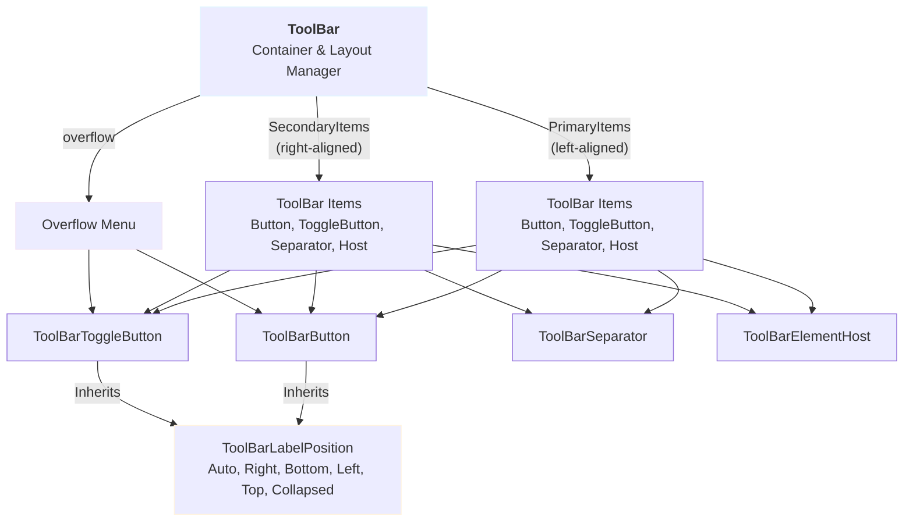

# ToolBar Controls

A professional, composable toolbar system for WinUI 3 applications built with modern layout patterns, responsive density modes, and intelligent overflow management.

## Overview

The ToolBar control suite helps you build application toolbars that adapt to your content and available space. Unlike simple button containers, this system provides:

- **Primary and secondary item arrangement**: Organize buttons into primary (left-aligned) and secondary (right-aligned) sections
- **Intelligent overflow**: Automatically move items to a dropdown menu when space is tight
- **Responsive density**: Toggle between standard and compact modes for space efficiency
- **Flexible label positioning**: Display icons alone, with text, or with text in any direction (right, below, left, or above)
- **Keyboard shortcuts**: Built-in support for key tips (accessibility feature)
- **Integrated logging**: Optional diagnostic logging for troubleshooting

This is purpose-built for application UI and works best as a single, cohesive toolbar at the application level rather than as scattered buttons throughout the interface.

---

## Architecture & Components



### The Pieces

| Component | Purpose | Where to Use |
|-----------|---------|--------------|
| **`ToolBar`** | Container that manages layout, density, and overflow | Root toolbar wrapper; exactly one per application (or one per region) |
| **`ToolBarButton`** | Clickable button styled for toolbars | For actions without state (Save, Delete, etc.) |
| **`ToolBarToggleButton`** | Button with checked/unchecked state | For mode toggles (Bold, Italic, Show Details) |
| **`ToolBarSeparator`** | Visual divider | Between logical groups of buttons |
| **`ToolBarElementHost`** | Wrapper for custom controls | To host ComboBox, DatePicker, or other WinUI controls |
| **`ToolBarLabelPosition`** | Enum controlling label placement | Set on buttons or inherit from parent ToolBar |

---

## Getting Started

### Basic Setup

```xaml
<controls:ToolBar x:Name="MainToolBar" DefaultLabelPosition="Right">
    <controls:ToolBarButton
        Label="Open"
        Icon="{StaticResource OpenFileIcon}"
        Command="{Binding OpenCommand}" />

    <controls:ToolBarButton
        Label="Save"
        Icon="{StaticResource SaveIcon}"
        Command="{Binding SaveCommand}" />

    <controls:ToolBarSeparator />

    <controls:ToolBarToggleButton
        Label="Bold"
        Icon="{StaticResource BoldIcon}"
        IsChecked="{Binding IsBoldEnabled, Mode=TwoWay}" />
</controls:ToolBar>
```

**What you need to know:**
- The `ToolBar` expects `PrimaryItems` to be set (implicitly, via the content property syntax above)
- Each button binds to a command; the toolbar doesn't execute code directly
- `DefaultLabelPosition="Right"` propagates to children unless overridden
- Icons use `IconSource` (FontIconSource, SymbolIconSource, etc.)

### Icon Sources

WinUI provides several icon types. Here's how to use them with ToolBar buttons:

```xaml
<!-- Symbol icons (Windows 11 Segoe MDL2) -->
<controls:ToolBarButton Label="Cut" Icon="{StaticResource CutSymbolIcon}" />

<!-- Font icons for custom symbols -->
<controls:ToolBarButton Label="Home">
    <controls:ToolBarButton.Icon>
        <FontIconSource FontFamily="Segoe MDL2 Assets" Glyph="&#xE10F;" />
    </controls:ToolBarButton.Icon>
</controls:ToolBarButton>

<!-- Image icons -->
<controls:ToolBarButton Label="Picture">
    <controls:ToolBarButton.Icon>
        <BitmapIconSource UriSource="ms-appx:///Assets/Icon.png" />
    </controls:ToolBarButton.Icon>
</controls:ToolBarButton>
```

> **Tip:** Pre-define `IconSource` resources in your App.xaml or a resource dictionary to avoid repetition and enable theming.

---

## Key Concepts

### 1. Primary vs. Secondary Items

The ToolBar separates items into two visual groups to mirror modern UI patterns (like Word or Visual Studio):

```xaml
<controls:ToolBar>
    <!-- Primary items: left-aligned, start here -->
    <controls:ToolBarButton Label="New" Icon="..." Command="..." />
    <controls:ToolBarButton Label="Open" Icon="..." Command="..." />

    <!-- Secondary items: right-aligned, auxiliary actions -->
    <controls:ToolBar.SecondaryItems>
        <controls:ToolBarButton Label="Settings" Icon="..." Command="..." />
        <controls:ToolBarButton Label="Help" Icon="..." Command="..." />
    </controls:ToolBar.SecondaryItems>
</controls:ToolBar>
```

**Why two groups?**
- Primary items are your core, frequently-used actions
- Secondary items are supplementary (settings, help, advanced)
- When overflow happens, primary items are preserved; secondary items overflow first
- This matches user expectations from desktop applications

### 2. Label Positioning (Responsive Text)

Toolbar buttons can display text in five positions or not at all:

| Position | Layout | Use When |
|----------|--------|----------|
| `Auto` | Inherits from parent `ToolBar.DefaultLabelPosition` | Most common; lets the toolbar control density |
| `Right` | Icon on left, label to the right (horizontal) | Standard desktop; readable, space-efficient |
| `Bottom` | Icon on top, label below (vertical) | High icon clarity, compact width |
| `Left` | Label on left, icon on right | Rare; RTL-friendly layouts |
| `Top` | Label above, icon below | Rare; specialized layouts |
| `Collapsed` | Icon only, no label | Very compact; needs strong icon design or tooltips |

```xaml
<!-- All buttons inherit "Right" from parent ToolBar -->
<controls:ToolBar DefaultLabelPosition="Right">
    <controls:ToolBarButton Label="Open" Icon="..." />
    <controls:ToolBarButton Label="Save" Icon="..." />
</controls:ToolBar>

<!-- Override one button to use vertical layout -->
<controls:ToolBar DefaultLabelPosition="Right">
    <controls:ToolBarButton Label="Open" Icon="..." />
    <controls:ToolBarButton Label="AlternateLayout" Icon="..."
                            ToolBarLabelPosition="Bottom" />
</controls:ToolBar>
```

**Practical guidance:**
- `Right` is the default and works well for most toolbars
- Use `Collapsed` only if your icons are self-explanatory (e.g., standard Windows icons) or if you provide tooltips
- Avoid mixing positions within the same toolbar unless you have a strong UX reason (it can feel inconsistent)

### 3. Compact Mode

Compact mode reduces button height, minimum size, and padding. Toggle it globally on the toolbar:

```xaml
<controls:ToolBar IsCompact="False">  <!-- standard mode, 32px min height -->
    <controls:ToolBarButton Label="Open" Icon="..." />
</controls:ToolBar>

<controls:ToolBar IsCompact="True">   <!-- compact mode, 24px min height -->
    <controls:ToolBarButton Label="Open" Icon="..." />
</controls:ToolBar>
```

**When to use:**
- **Standard (IsCompact=false):** Default; comfortable for mouse and touch users
- **Compact (IsCompact=true):** When real estate is precious (mobile/tablet or dense dashboards)

> **Note:** Compact mode affects all buttons in the toolbar. There's no per-button override.

### 4. Overflow & Responsive Behavior

When the toolbar is too narrow to fit all items, the toolbar automatically:
1. Measures all items
2. Hides items that don't fit
3. Shows an overflow button (⋯) in the top-right corner
4. Moves hidden items to a dropdown menu

```xaml
<controls:ToolBar OverflowButtonVisibility="Visible">
    <!-- If items exceed available width, they move to the overflow menu -->
    <controls:ToolBarButton Label="Open" Icon="..." />
    <controls:ToolBarButton Label="Save" Icon="..." />
    <controls:ToolBarButton Label="Print" Icon="..." />
    <!-- etc. -->
</controls:ToolBar>
```

**Behavior details:**
- Primary items are prioritized; secondary items overflow first
- The overflow menu is a standard `MenuFlyout` (same as right-click context menus)
- Overflow items in the menu are displayed as text labels (no icons)
- The overflow button itself is hidden if all items fit (`Visibility.Collapsed`)

> **Diagnostic tip:** If items aren't overflowing when you expect, check that:
>   1. The `ToolBar` has a measured width (it's not in a layout pass with infinite width)
>   2. `OverflowButtonVisibility` is not set to `Collapsed`
>   3. `UpdateOverflow()` has been called (happens automatically on layout changes)

### 5. Keyboard Shortcuts & Key Tips

`ToolBarButton` and `ToolBarToggleButton` support key tips for keyboard-driven workflows:

```xaml
<controls:ToolBar>
    <controls:ToolBarButton Label="Save" KeyTip="S" Command="..." />
    <controls:ToolBarButton Label="Print" KeyTip="P" Command="..." />
</controls:ToolBar>
```

When the user presses `Alt`, the key tips appear as underlined letters. Pressing that letter invokes the button.

> **Note:** Key tip implementation depends on your application's input handling. This control provides the *property* but not the global Alt-key listener. If key tips don't work, you'll need to implement Alt-key detection in your main window or app shell.

---

## Common Patterns

### Pattern 1: Editor Toolbar (Text Formatting)

A toolbar for a text editor with formatting and view options:

```xaml
<controls:ToolBar DefaultLabelPosition="Collapsed" IsCompact="True">
    <!-- File operations -->
    <controls:ToolBarButton Label="New" Icon="{StaticResource NewFileIcon}"
                            Command="{Binding NewCommand}" />
    <controls:ToolBarButton Label="Open" Icon="{StaticResource OpenFileIcon}"
                            Command="{Binding OpenCommand}" />
    <controls:ToolBarButton Label="Save" Icon="{StaticResource SaveIcon}"
                            Command="{Binding SaveCommand}" />

    <controls:ToolBarSeparator />

    <!-- Text formatting -->
    <controls:ToolBarToggleButton Label="Bold" Icon="{StaticResource BoldIcon}"
                                 IsChecked="{Binding IsBold, Mode=TwoWay}" />
    <controls:ToolBarToggleButton Label="Italic" Icon="{StaticResource ItalicIcon}"
                                 IsChecked="{Binding IsItalic, Mode=TwoWay}" />
    <controls:ToolBarToggleButton Label="Underline" Icon="{StaticResource UnderlineIcon}"
                                 IsChecked="{Binding IsUnderline, Mode=TwoWay}" />

    <controls:ToolBarSeparator />

    <!-- View -->
    <controls:ToolBar.SecondaryItems>
        <controls:ToolBarToggleButton Label="Ruler" Icon="{StaticResource RulerIcon}"
                                     IsChecked="{Binding ShowRuler, Mode=TwoWay}" />
    </controls:ToolBar.SecondaryItems>
</controls:ToolBar>
```

**Reasoning:**
- `IsCompact="True"` saves vertical space
- `DefaultLabelPosition="Collapsed"` keeps it tight; icons alone are sufficient for standard text editing commands
- `SecondaryItems` groups less-common view options on the right
- Separators visually group related commands

### Pattern 2: Data Browser Toolbar (Mixed Controls)

A toolbar for searching and filtering data:

```xaml
<controls:ToolBar DefaultLabelPosition="Right">
    <controls:ToolBarButton Label="Refresh" Icon="{StaticResource RefreshIcon}"
                            Command="{Binding RefreshCommand}" />

    <controls:ToolBarSeparator />

    <!-- Custom controls inside the toolbar -->
    <controls:ToolBarElementHost>
        <TextBox PlaceholderText="Search..."
                Width="200"
                Text="{Binding SearchQuery, Mode=TwoWay, UpdateTriggerBehavior=PropertyChanged}" />
    </controls:ToolBarElementHost>

    <controls:ToolBarElementHost>
        <ComboBox x:Name="FilterCombo"
                 ItemsSource="{Binding Filters}"
                 SelectedItem="{Binding ActiveFilter, Mode=TwoWay}" />
    </controls:ToolBarElementHost>

    <controls:ToolBar.SecondaryItems>
        <controls:ToolBarButton Label="Export" Icon="{StaticResource ExportIcon}"
                                Command="{Binding ExportCommand}" />
        <controls:ToolBarButton Label="Settings" Icon="{StaticResource SettingsIcon}"
                                Command="{Binding SettingsCommand}" />
    </controls:ToolBar.SecondaryItems>
</controls:ToolBar>
```

**Key insight:** `ToolBarElementHost` wraps non-button controls (like TextBox or ComboBox) so they respect toolbar spacing and theming.

### Pattern 3: Docking Window with Context-Specific Toolbar

Some applications show different toolbars depending on the active docking window:

```xaml
<!-- In your window/view -->
<Grid>
    <Grid.RowDefinitions>
        <RowDefinition Height="Auto" />
        <RowDefinition Height="*" />
    </Grid.RowDefinitions>

    <!-- Toolbar changes based on the active document/view -->
    <controls:ToolBar Grid.Row="0"
                     ItemsSource="{Binding ActiveView.ToolbarItems}">
    </controls:ToolBar>

    <!-- Main content area -->
    <ContentControl Grid.Row="1" Content="{Binding ActiveView}" />
</Grid>
```

In your ViewModel, switch `ToolbarItems` when the active view changes. The toolbar updates automatically.

---

## Styling & Theming

### Default Visual Appearance

The ToolBar controls use **WinUI theme resources** for colors, so they respect your app's light/dark theme automatically.

- **Background:** Transparent
- **Button normal state:** Transparent background
- **Button hover state:** `ControlFillColorSecondaryBrush` (subtle fill)
- **Button pressed state:** `ControlFillColorTertiaryBrush` (darker fill)
- **Text color:** `TextFillColorPrimaryBrush` (adapts to theme)
- **Separator:** Thin dividing line (color from theme)

### Customizing Visual Style

To override the default appearance, provide a new `Style` in your app resources:

```xaml
<!-- In App.xaml or a merged resource dictionary -->
<Style TargetType="local:ToolBarButton">
    <Setter Property="Background" Value="#F0F0F0" />
    <Setter Property="Padding" Value="8,6" />
    <Setter Property="CornerRadius" Value="2" />
</Style>

<Style TargetType="local:ToolBar">
    <Setter Property="Background" Value="#FAFAFA" />
    <Setter Property="Padding" Value="6" />
</Style>
```

**Common customizations:**
- Change `Padding` to adjust internal spacing
- Change `CornerRadius` for more/less rounded corners
- Change `Background` to add a toolbar background color
- Override `Foreground` to change text/icon color

### Customizing the Template

If styling isn't enough, you can replace the control template. Open `ToolBar.xaml` or `ToolBarButton.xaml` to see the template structure. Key template parts to know:

**ToolBar template parts:**
- `RootGrid` — The outermost grid
- `PrimaryItemsControl` — The `ItemsControl` holding primary items
- `SecondaryItemsControl` — The `ItemsControl` holding secondary items
- `OverflowButton` — The "⋯" button (the `Button` control)
- `OverflowMenuFlyout` — The dropdown menu (`MenuFlyout`)

**ToolBarButton template parts:**
- `RootGrid` — The button's background/border area
- `PartLayoutGrid` — The grid containing icon and label
- `IconPresenter` — The `IconSourceElement` displaying the icon
- `LabelText` — The `TextBlock` displaying the label

To customize, create a new `Style` with a custom `ControlTemplate` and assign it to the control type.

---

## Binding & Data Integration

### Commands & MVVM

Toolbar buttons are command-driven. Bind them to your ViewModel:

```csharp
// ViewModel
public class EditorViewModel
{
    public ICommand SaveCommand { get; } =
        new RelayCommand(() =>
        {
            // Save logic
        });

    public ICommand DeleteCommand { get; } =
        new RelayCommand(
            execute: () => { /* Delete logic */ },
            canExecute: () => SelectedItems.Count > 0
        );
}
```

```xaml
<!-- View -->
<controls:ToolBarButton Label="Save"
                        Command="{Binding SaveCommand}"
                        Icon="{StaticResource SaveIcon}" />

<controls:ToolBarButton Label="Delete"
                        Command="{Binding DeleteCommand}"
                        Icon="{StaticResource DeleteIcon}" />
```

**How it works:**
- When the button is clicked, `Command.Execute()` is called
- When `CanExecute()` returns `false`, the button appears disabled
- The button's visual state updates automatically based on command state

### Observable Collections (Programmatic Items)

You can also bind the entire items collection:

```csharp
public class ToolbarViewModel
{
    public ObservableCollection<object> PrimaryItems { get; } = new();

    public void BuildToolbar()
    {
        PrimaryItems.Add(new ToolBarButton
        {
            Label = "Open",
            Command = OpenCommand
        });
        PrimaryItems.Add(new ToolBarSeparator());
        PrimaryItems.Add(new ToolBarButton
        {
            Label = "Save",
            Command = SaveCommand
        });
    }
}
```

```xaml
<controls:ToolBar PrimaryItems="{Binding PrimaryItems}" />
```

**When to use:**
- When items are dynamic (added/removed at runtime)
- When items depend on permissions or application state
- When building a generic toolbar system

---

## Troubleshooting

### Items Not Appearing

**Symptom:** You added items to the toolbar, but they don't show up.

**Diagnosis checklist:**
1. ✓ Check that items are added to `PrimaryItems` or `SecondaryItems`, not just as child elements (unless using content syntax, which implicitly uses `PrimaryItems`)
2. ✓ Verify the icon (`Icon` property) is not null; null icons cause rendering issues
3. ✓ Check that labels are not empty strings (use spaces if you want invisible text for alignment)
4. ✓ Open the Visual Tree Debugger (`Ctrl+Shift+I` in VS) and inspect whether items are in the tree

**Fix example:**
```xaml
<!-- Wrong: Items added as children but ToolBar doesn't have ItemsSource -->
<controls:ToolBar>
    <controls:ToolBarButton Label="Open" />  <!-- Gets added to PrimaryItems implicitly ✓ -->
</controls:ToolBar>

<!-- Right: Explicit binding -->
<controls:ToolBar PrimaryItems="{Binding Items}">
</controls:ToolBar>
```

### Overflow Button Not Showing

**Symptom:** Even when items are hidden, the overflow button (⋯) doesn't appear.

**Diagnosis:**
1. ✓ Check `OverflowButtonVisibility` — if it's `Collapsed`, set it to `Visible`
2. ✓ Verify the toolbar has a measured width (not in a layout pass with infinite width)
3. ✓ Check that `UpdateOverflow()` is being called (happens automatically on layout changes)

### Labels Not Displaying

**Symptom:** Icons show but text labels are missing.

**Diagnosis:**
1. ✓ Check `IsLabelVisible` — must be `true` for labels to show
2. ✓ Check `ToolBarLabelPosition` — if it's `Collapsed`, labels won't show
3. ✓ Check the `Label` property value; empty strings don't display
4. ✓ Verify the toolbar's `DefaultLabelPosition` is not `Collapsed`

**Fix:**
```xaml
<controls:ToolBar DefaultLabelPosition="Right">
    <controls:ToolBarButton Label="Open"
                            Icon="..."
                            IsLabelVisible="True" />  <!-- Explicit in case inheriting doesn't work -->
</controls:ToolBar>
```

### Buttons Not Responding to Clicks

**Symptom:** Buttons appear but clicking does nothing.

**Diagnosis:**
1. ✓ Check that `Command` is bound and not null
2. ✓ Check `Command.CanExecute()` — if it returns `false`, the button is disabled (grayed out)
3. ✓ Check that the command is not throwing an exception silently (enable logging to confirm)
4. ✓ Verify binding errors by opening the Debug Output window (`Ctrl+Alt+O`)

**Debug example:**
```csharp
// Enable logging to see what's happening
var loggerFactory = new SimpleConsoleLoggerFactory();
toolBar.LoggerFactory = loggerFactory;
```

### Layout Issues (Spacing, Alignment)

**Symptom:** Buttons are too far apart, or labels are misaligned.

**Diagnosis:**
1. ✓ Check `Padding` on the button (default is `6,4`)
2. ✓ Check the `StackPanel` `Spacing` in the ToolBar template (default is `4`)
3. ✓ Check `CornerRadius` if buttons look square instead of rounded

**Customization:**
```xaml
<Style TargetType="local:ToolBarButton">
    <Setter Property="Padding" Value="4,2" />  <!-- Tighter padding -->
</Style>

<!-- Or customize in the toolbar -->
<controls:ToolBar Padding="2">  <!-- Less padding around the whole toolbar -->
    ...
</controls:ToolBar>
```

---

## Performance Considerations

### Overflow Recalculation

The toolbar recalculates overflow whenever:
- The toolbar's width changes (window resize, panel collapse)
- Items are added or removed
- The `IsCompact` property changes

This is generally fast (< 1ms), but with *many* items (50+), you might notice stuttering during rapid resizing.

**Mitigation:**
- Keep item counts reasonable (< 30 items in primary + secondary combined)
- Avoid rapidly toggling `IsCompact` on every frame
- If you have a lot of items, use the overflow menu strategically

### Memory

Each button holds references to:
- Its `Icon` (IconSource)
- Its `Command` (ICommand)
- Dependency property metadata

For typical toolbars (< 20 items), memory impact is negligible.

---

## Advanced Topics

### Custom Elements in the Toolbar

To include controls other than buttons (like TextBox, ComboBox, DatePicker), use `ToolBarElementHost`:

```xaml
<controls:ToolBar>
    <controls:ToolBarButton Label="Open" Icon="..." />

    <controls:ToolBarElementHost>
        <TextBox PlaceholderText="Filter..." Width="150" />
    </controls:ToolBarElementHost>

    <controls:ToolBarElementHost>
        <ComboBox ItemsSource="{Binding Categories}" />
    </controls:ToolBarElementHost>
</controls:ToolBar>
```

`ToolBarElementHost` is a wrapper that:
- Applies toolbar-consistent spacing (margin around the hosted control)
- Respects the toolbar's theme and density
- Allows any WinUI control to sit alongside buttons

### Using ObservableCollection for Dynamic Content

Instead of hard-coding items, bind the entire collection:

```csharp
public class MainViewModel
{
    public ObservableCollection<object> ToolbarItems { get; } = new();

    public MainViewModel()
    {
        BuildToolbar();
    }

    private void BuildToolbar()
    {
        ToolbarItems.Add(new ToolBarButton
        {
            Label = "Open",
            Icon = GetIcon("open"),
            Command = OpenCommand
        });

        ToolbarItems.Add(new ToolBarSeparator());

        ToolbarItems.Add(new ToolBarButton
        {
            Label = "Save",
            Icon = GetIcon("save"),
            Command = SaveCommand
        });
    }

    private void UpdateToolbar(ApplicationState state)
    {
        ToolbarItems.Clear();

        if (state.CanEdit)
        {
            ToolbarItems.Add(new ToolBarButton { ... });
        }

        if (state.CanShare)
        {
            ToolbarItems.Add(new ToolBarButton { ... });
        }
    }
}
```

```xaml
<controls:ToolBar PrimaryItems="{Binding ToolbarItems}" />
```

**Benefits:**
- Toolbar adapts to application state without XAML changes
- Permissions and feature toggles can be baked into item visibility
- Easier to test (construct items in code, verify in unit tests)

### Logging for Diagnostics

Enable diagnostic logging to troubleshoot toolbar behavior:

```csharp
using Microsoft.Extensions.Logging;

// Create a logger factory (use Serilog or another logging framework in production)
ILoggerFactory loggerFactory = new SimpleConsoleLoggerFactory();

// Assign it to the toolbar
toolbar.LoggerFactory = loggerFactory;
```

The toolbar will emit logs for:
- Overflow state changes
- Layout updates
- Item additions/removals
- Label position calculations

This is useful when debugging layout issues or unexpected overflow behavior.

---

## API Reference Summary

### ToolBar

| Property | Type | Default | Notes |
|----------|------|---------|-------|
| `PrimaryItems` | `ObservableCollection<object>` | Empty | Left-aligned items |
| `SecondaryItems` | `ObservableCollection<object>` | Empty | Right-aligned items |
| `IsCompact` | `bool` | `false` | Compact density mode |
| `DefaultLabelPosition` | `ToolBarLabelPosition` | `Right` | Inherited by child buttons |
| `OverflowButtonVisibility` | `Visibility` | `Collapsed` | Show overflow button |
| `LoggerFactory` | `ILoggerFactory?` | `null` | Diagnostic logging |

### ToolBarButton

| Property | Type | Default | Notes |
|----------|------|---------|-------|
| `Icon` | `IconSource` | `null` | Button icon |
| `Label` | `string` | `""` | Button text |
| `IsLabelVisible` | `bool` | `false` | Show/hide label |
| `ToolBarLabelPosition` | `ToolBarLabelPosition` | `Auto` | Label placement (auto-inherits from parent) |
| `KeyTip` | `string` | `null` | Keyboard shortcut hint |
| `IsCompact` | `bool` | `false` | Compact mode (auto-inherited from parent) |
| `Command` | `ICommand` | `null` | MVVM command |
| `CommandParameter` | `object` | `null` | Command parameter |

**Inherits from:** `Button` (standard WinUI button properties like `Click`, `Content`, etc. also available)

### ToolBarToggleButton

Same as `ToolBarButton`, plus:

| Property | Type | Default | Notes |
|----------|------|---------|-------|
| `IsChecked` | `bool` | `false` | Toggle state |

**Events:**
- `Checked` — Fired when toggled to checked state
- `Unchecked` — Fired when toggled to unchecked state

### ToolBarSeparator

A visual divider with minimal configuration. Just add it between logical groups:

```xaml
<controls:ToolBarSeparator />
```

### ToolBarElementHost

Wrapper for custom controls:

| Property | Type | Default | Notes |
|----------|------|---------|-------|
| `Content` | `UIElement` | `null` | The hosted control |

```xaml
<controls:ToolBarElementHost>
    <TextBox ... />
</controls:ToolBarElementHost>
```

### ToolBarLabelPosition (Enum)

```csharp
public enum ToolBarLabelPosition
{
    Auto = 0,      // Inherit from parent ToolBar
    Collapsed = 1, // No label
    Right = 2,     // Label right of icon
    Bottom = 3,    // Label below icon
    Left = 4,      // Label left of icon
    Top = 5        // Label above icon
}
```

---

## Best Practices

| Practice | Reason |
|----------|--------|
| **Limit items to 8–15 per toolbar** | Too many items cause cognitive overload and overflow issues |
| **Use icons + labels in standard layouts** | Improves discoverability; icons alone require strong visual design or training |
| **Group related items with separators** | Makes toolbar structure clear; easier to scan |
| **Put frequent actions in primary items** | Secondary items are for auxiliary/advanced actions |
| **Use commands, not click handlers** | Enables MVVM, testability, and automatic enable/disable based on state |
| **Test with compact mode enabled** | Ensures your toolbar works at different densities |
| **Provide tooltips for compact toolbars** | If using `IsLabelVisible=false`, users need hints on hover |
| **Use `ToolBarLabelPosition="Collapsed"` only for ubiquitous icons** | Standard icons (Save, Delete, Print) are safe; custom icons need labels or tooltips |

---

## See Also

- **WinUI Documentation:** [Button styles and templates](https://learn.microsoft.com/en-us/windows/apps/design/controls/buttons)
- **MVVM Toolkit:** [RelayCommand and ObservableObject](https://github.com/CommunityToolkit/dotnet)
- **Icon Sources:** WinUI's `FontIconSource`, `SymbolIconSource`, `BitmapIconSource`
- **Related Controls:** `CommandBar` (WinUI's standard toolbar control, lighter-weight)

---

## Contributing & Feedback

Found a bug or have a feature request? See the [main repository](../../../) for contribution guidelines.

For questions about usage, check the [examples](#common-patterns) or enable logging to diagnose behavior.
