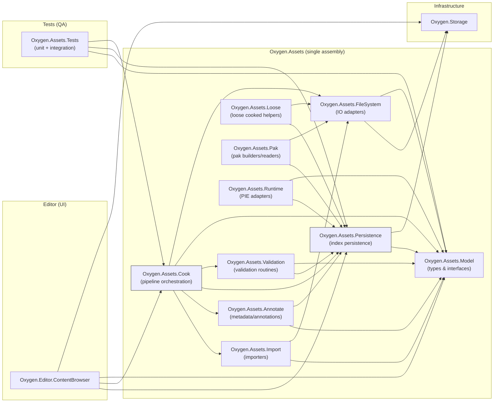

# Content Pipeline Design

This document captures decisions for the asset/content pipeline architecture, the relationship between editor UI and non-UI asset tooling, and a module decomposition diagram (Mermaid) for discussion.

## Roadmap (trackable)

### Phase 1 — Infrastructure

- [X] Rename `projects/Oxygen.Storage` → `projects/Oxygen.Storage` (single commit) and update references
- [X] Verify build & tests; fix any import/reference breaks

### Phase 2 — Assets scaffold

- [X] Create `projects/Oxygen.Assets` (single assembly).
- [X] Keep expanding minimal public contracts:
  - Asset identity is expressed as `asset://{MountPoint}/{Path}` URIs.
  - Asset loading uses `IAssetService` + `IAssetResolver` keyed by URI authority (mount point).
  - Catalog/query contract (`IAssetCatalog`) for *enumeration/search* (separate from load-by-URI).
  - Query scope is explicitly client-controlled via `AssetQueryScope` + `AssetQueryTraversal`.
- [X] Adopt Rx (`System.Reactive`) for catalog change streams.
- [X] Implement initial catalog providers:
  - `GeneratedAssetCatalog` (built-in assets, static snapshot, `Changes = Observable.Empty`).
  - `CompositeAssetCatalog` (merges multiple catalogs and merges `Changes`).
  - `FileSystemAssetCatalog` (enumerates loose assets via `Oxygen.Storage` and ingests changes via watcher/event source).

### Phase 3 — Persistence & FS adapters

- [X] Implement `container.index.bin` persistence compatible with runtime LooseCookedIndex v1
  - Reader (validate header, offsets, string table, entry sizes)
  - Writer (deterministic ordering, stable string table, SHA-256 metadata)
  - Implementation + docs live in `src/Persistence/LooseCooked/V1`
- [ ] Implement validation helpers
  - Verify SHA-256 for descriptors and resource files
  - Enforce invariants (no cross-container deps at pack time)
- [~] Filesystem-backed catalog provider(s)
  - Source/authoring file catalog (what the Content Browser browses under a mounted authoring root)
  - Cooked-content catalog backed by `container.index.bin` (what PIE/runtime mounting uses)
- [ ] Implement an index-backed catalog provider (loose cooked) that enumerates cooked assets via `container.index.bin`
- [ ] Add a pak/index-backed catalog provider (shipping view) that enumerates assets in `.pak` (including embedded browse index)

### Phase 4 — Pipeline and integration

- [ ] Implement `ICookService` skeleton in `Oxygen.Assets.Cook` (async, progress, cancellation)
  - Output layout matches runtime expectations: `assets/**`, `resources/*.table`, `resources/*.data`, `container.index.bin`
  - Deterministic `VirtualPath ⇄ AssetKey` mapping (Asset DB policy)
- [ ] Implement `IPackService` skeleton that produces `.pak` and enforces intra-container deps
- [ ] Implement `Oxygen.Assets.Runtime` for deterministic container registration and PIE adapters
- [ ] Create `projects/Oxygen.Editor.ContentBrowser` and wire UI to `Oxygen.Assets` APIs (lookup, diagnostics, cook/validate)

### Phase 5 — Tests, CI, docs

- [~] Add `Oxygen.Assets.Tests`:
  - Catalog tests exist for Generated/Composite/FileSystem providers.
  - Still needed: persistence (index) read/write tests, validation tests, cook atomic-swap tests.
- [ ] Add CI jobs to run validation and integration tests on `master`
- [ ] Publish a migration guide and update this design doc with implementer notes

## Current status (Dec 2025)

- The durable catalog/query foundation lives in `Oxygen.Assets` and is ready to be consumed by UI code (Content Browser) without duplicating contracts.
- Multiple catalog providers already exist (Generated, Composite, FileSystem) and unit tests are passing.
- Next durable layer to build is persistence + validation (index format, read/write, index-backed catalog), then cook orchestration.

## Taxonomy alignment with the runtime Content subsystem

The engine runtime has an authoritative taxonomy and set of invariants in `Oxygen/Content`.
The editor pipeline must produce artifacts that the runtime can consume *without translation*.

### Runtime source of truth (Oxygen.Content)

The runtime `Oxygen.Content` subsystem provides **read-only access to cooked content** in two container forms:

- **PAK** (`PakFile`) — shipping container.
- **Loose cooked root** (directory) — fast editor iteration.

Runtime invariants that the pipeline must respect:

- **Intra-container dependencies only**: assets/resources may reference only other assets/resources inside the same container.
- **CPU/GPU boundary**: Content ends at *CPU-decoded* state; GPU uploads are handled elsewhere.
- **Runtime does not import source formats**: it consumes only cooked Oxygen formats.

### Identity layers and how they map

The runtime distinguishes editor-facing identity from runtime identity:

- **Virtual path** (editor-facing): canonical string with a leading slash, e.g. `/Content/Materials/Wood.mat`.
- **AssetKey** (runtime-facing): `oxygen::data::AssetKey` is a 128-bit GUID.
- **ResourceKey** (runtime cache key): 64-bit key encoding `(source/container id, resource type, resource index)`.

In `Oxygen.Assets`, we currently use `asset://{MountPoint}/{Path}` URIs as catalog identities.
To align with runtime taxonomy:

- Treat the URI form as a *serialized/editor-friendly representation* of the same namespace as virtual paths.
- Define a deterministic mapping:
  - `asset://Content/Textures/Wood.png` ⇔ `/Content/Textures/Wood.png`
  - `Uri.Authority` ⇔ virtual root segment (`Content`, `Engine`, …)

The runtime loads by `AssetKey` (not by virtual path), so the cook pipeline must also provide a deterministic mapping `VirtualPath ⇄ AssetKey`.

### Cooked container index is the bridge

For **loose cooked** containers, the runtime resolves `VirtualPath → AssetKey` by reading `container.index.bin`.
The index format is defined in `Oxygen/Data/LooseCookedIndexFormat.h` (v1) and includes:

- Header with section offsets + flags.
- Asset entries: `AssetKey`, descriptor relative path, optional virtual path, descriptor size + SHA-256.
- File records for resource tables/data: buffers table/data, textures table/data (with size + SHA-256).

This means the editor-side pipeline (in `Oxygen.Assets`) must treat **LooseCookedIndex v1** as the compatibility target.
If we revise the format, it must be versioned and coordinated with runtime.

## Module decomposition

- `Oxygen.Storage` (infrastructure) — filesystem abstraction, path normalization, async IO helpers. Must not depend on `Oxygen.Assets`.
- `Oxygen.Content` (runtime, C++) — reads cooked content (PAK + loose cooked), loads by `data::AssetKey`, caches by `ResourceKey`, and enforces intra-container deps.
- `Oxygen.Assets` (editor/tooling, C#, single assembly, organized as namespaces):
  - `Oxygen.Assets.Model` — canonical editor/tooling DTOs and minimal interfaces:
    - virtual path normalization rules (canonical `/Mount/...`)
    - stable `AssetKey` ownership (GUID) and mapping `VirtualPath ⇄ AssetKey`
    - catalog/query models (`IAssetCatalog`) for enumeration/search (UI consumption)
  - `Oxygen.Assets.Persistence` — read/write `container.index.bin` compatible with runtime LooseCookedIndex v1.
  - `Oxygen.Assets.Validation` — validation routines for cooked outputs (index integrity, SHA-256 verification, invariants).
  - `Oxygen.Assets.Import` — source importers (editor-only; runtime never imports sources).
  - `Oxygen.Assets.Cook` — cook pipeline producing cooked descriptors + resource tables/data + `container.index.bin`.
  - `Oxygen.Assets.Pack` (logical area; can be a namespace) — pack pipeline producing `.pak` while enforcing intra-container deps.

Separate layer:

- `Oxygen.Assets.Tests` — tests (unit + integration) for the combined assembly and integration scenarios.

Notes:

- The editor pipeline is integrated: import → cook → annotate → loose → pak. These stages are expected to work together inside the same assembly; there is no expectation of a single consumer that only wants "loose" and later discards it for pak.
- No separate `Oxygen.Assets.Api` assembly is created unless a clear, demonstrated need arises (lightweight consumers that must avoid pulling persistence/IO). If that need appears later, extract the minimal public interfaces and DTOs into a small package.

Alignment note:

- The runtime-facing artifacts and invariants are defined by `Oxygen.Content`. The editor-side pipeline must produce cooked outputs (`container.index.bin`, cooked descriptors, resource tables/data, and `.pak`) that the runtime can consume as-is.

## Query/catalog contract (enumeration) — client-controlled scope

`IAssetService.LoadAssetAsync<T>(uri)` answers: “given an asset URI, load it”.

The editor also needs: “given a scope + search criteria, enumerate assets”. That is a *catalog/query* responsibility, and must be separate from resolution.

Key principle: the query API must not assume a single policy like “current folder only”. The *caller* (Content Browser, property editors, import dialogs, etc.) chooses the scope.

### Scope must be flexible

Examples of required scopes:

- Folder selection: show assets under that folder **and all descendants**.
- Project root selection: show the **entire set**, including all mount points.
- “Content” selection: show **project assets only**.
- Mount point selection (e.g., Engine): show only that mount point’s assets.
- Property editors: show **grouped views** (e.g., “frequently used”, “basic shapes”, “all by mount point”).

Therefore, queries take an explicit `AssetQueryScope` describing *where* to search:

- **All** assets (across all mount points).
- **One or more roots** (URI prefixes), with a traversal mode:
  - Self only
  - Immediate children
  - Descendants (recursive)

The roots are expressed using the existing canonical URI format:

- Mount point root: `asset://Content/` or `asset://Engine/`
- Folder root: `asset://Content/Textures/`

### Providers: Loose FS is one provider

Catalog results may be backed by multiple providers:

- Loose filesystem (project Content folder)
- Generated/built-in assets
- PAK/container indexes
- Future: remote registries, derived/generated intermediates, etc.

The catalog contract should not leak the backing provider; it should only expose canonical identities (URIs) and minimal metadata required for listing.

### Minimal API sketch

```csharp
public interface IAssetCatalog
{
  IObservable<AssetChange> Changes { get; }

  Task<IReadOnlyList<AssetRecord>> QueryAsync(
    AssetQuery query,
    CancellationToken cancellationToken = default);
}

public sealed record AssetQuery(AssetQueryScope Scope, string? SearchText = null);

public sealed record AssetRecord(Uri Uri);

public sealed record AssetQueryScope(
  IReadOnlyList<Uri> Roots,
  AssetQueryTraversal Traversal)
{
  public static AssetQueryScope All { get; } = new([], AssetQueryTraversal.All);
}

public enum AssetQueryTraversal
{
  All,
  Self,
  Children,
  Descendants,
}
```

Notes:

- Grouping (for property editors) should be treated as presentation/UX; the query returns a flat set and the UI groups it as needed.
- The catalog may internally use file watchers, indexes, or container metadata; those mechanics are provider-specific.

-- Editor UI (editor-specific):

- `Oxygen.Editor.ContentBrowser` — Content Browser UI project (views, viewmodels, UI glue). This is an editor assembly and depends on the `Oxygen.Assets.*` non-UI modules and on `Oxygen.Storage` (infrastructure).

- Infrastructure (I/O / filesystem abstractions - no UI):
  - `Oxygen.Storage` — file system abstraction, path normalization, async IO helpers. This assembly is infrastructure and must not depend on `Oxygen.Assets`.

## Mermaid module diagram


