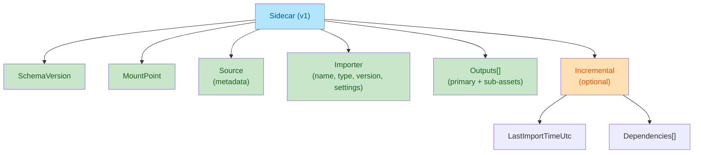

# Import (Oxygen.Assets)

Design specification for the Import module.

## Overview

Goal: unlock the editor with a single user action: **Import (updates runtime data)**.

Internally:

- Import runs **Import → Build** into the dev-friendly loose runtime-compatible layout
- Cook remains a later, optional optimization/minimization step
- Oxygen.Assets has no UI; the editor UI calls into this module and receives progress, diagnostics, and produced artifacts

Related single-source rules:

- Virtual path invariants and normalization are defined in [virtual-paths.md](virtual-paths.md).

## Table of Contents

1. [Foundations](#foundations)
   - [What We Need Immediately](#what-we-need-immediately-editor-unlock)
   - [Principles](#principles)
   - [Recommended Libraries](#recommended-libraries-mvp)
   - [Terminology](#terminology)
   - [Asset Extensions](#canonical-oxygen-asset-extensions-mvp)
2. [Project Structure](#project-structure)
   - [On-Disk Layout](#project-on-disk-layout-proposed)
3. [Architecture & Design](#architecture--design)
   - [High-Level Architecture](#high-level-architecture)
   - [Public API](#public-surface-area-proposed)
   - [Pluggable Importers](#pluggable-importer-model)
4. [Identity & Metadata](#identity--metadata)
   - [Identity Policy](#deterministic-identity-policy-assetkey--virtualpath)
   - [Sidecar Schema](#sidecar-schema-v1)
5. [Implementation](#implementation)
   - [Output Layout](#output-layout-what-import-writes)
   - [MVP Importers](#mvp-importers)
   - [Diagnostics](#diagnostics-and-failure-policy)
   - [Concurrency](#concurrency-and-cancellation)
6. [Quality & Maturity](#quality--maturity)
   - [Versioning](#versioning-and-reproducibility)
   - [Testing](#testing-strategy-what-to-add-first)
7. [Implementation Misalignment Report](#implementation-misalignment-report-2025-12-26)
8. [References](#references)

## Foundations

### What We Need Immediately (editor unlock)

Start with popular formats that are easy to obtain and test from the internet:

| Format | Input Extensions | Output | Notes |
| -------- | -------- | -------- | -------- |
| Images | `.png`, `.jpg`, `.jpeg`, `.tga` | Texture descriptor + payload | Via SixLabors.ImageSharp |
| glTF 2.0 | `.gltf`, `.glb` | Scene + meshes + materials + textures | Via SharpGLTF.Core |

Deliberately defer for later (still pluggable): FBX, USD, EXR, audio codecs, animation retargeting, complex material graphs.

### Principles

| Principle | Description |
| -------- | -------- |
| No wheels reinvented | Use best-in-class .NET libraries where available |
| Deterministic identity | Stable AssetKey ownership and stable VirtualPath to AssetKey mapping |
| Incremental | Re-import only what changed; don't rebuild everything |
| Pluggable | Add importers without touching core pipeline |
| **Source-Centric Editor** | The editor reads Source files + Sidecars. Intermediate files are only for caching expensive derived data. |
| **Cooked for Engine** | Runtime consumes only optimized binary artifacts; it never reads source or intermediate files. |
| Non-UI | Everything async, cancellation-friendly, emits structured diagnostics |

### Recommended Libraries (MVP)

| Library | Purpose | Status | Notes |
| -------- | -------- | -------- | -------- |
| SixLabors.ImageSharp | PNG/JPEG decoding | Added | Pure managed, cross-platform, excellent for editor import and testing |
| SharpGLTF.Core | glTF 2.0 parsing | Added | Reads .gltf/.glb, buffers, images, mesh primitives, transforms, PBR metadata |

Design notes:

- Keep the import layer agnostic to build/cook file formats; produce canonical in-memory representation
- Avoid mandatory native dependencies in the MVP path

### Terminology

| Term | Definition |
| -------- | -------- |
| Source file | Authoring input (e.g., `Wood.png`, `Model.glb`) |
| Imported asset (canonical) | Editor-friendly representation of source's meaning (metadata + dependency graph + stable identity) |
| Built runtime artifact | Runtime-consumable Oxygen formats written to loose layout |
| VirtualPath | Canonical editor-facing string, e.g., `/Content/Textures/Wood.otex` |
| Asset URI | `asset:///Content/Textures/Wood.otex` (maps 1:1 to VirtualPath) |
| AssetKey | Stable 128-bit identifier used by runtime |

### Canonical Oxygen Asset Extensions (MVP)

All Oxygen-produced asset files use unambiguous extensions that start with `o`:

| Extension | Purpose |
| -------- | -------- |
| `.otex` | Texture asset descriptor |
| `.ogeo` | Geometry asset descriptor |
| `.omat` | Material asset descriptor |
| `.oscene` | Scene asset descriptor (glTF/GLB primary output) |

**Rule:** These extensions are used for:

1. **Virtual Paths** (e.g., `/Content/Wood.otex`)
2. **Cooked Artifacts** (e.g., `.cooked/Content/Wood.otex`)
3. **Oxygen-Native Source Files** (e.g., `Content/Materials/Red.omat.json`)

Standard source extensions (`.png`, `.glb`) are preserved in `Content/` but map to one of these canonical extensions in the Virtual File System.

## Project Structure

### Project On-Disk Layout (Proposed)

When working in the editor we use a **loose** layout:

```text
ProjectRoot/
  Project.oxy              # project manifest (includes authoring mount points)
  Content/**               # source assets (user-authored)
  Content/*.import.json    # sidecar metadata
  .imported/Content/**     # imported artifacts (editor-native, disposable)
  .cooked/Content/**       # built artifacts (runtime-ready, canonical)
  .build/
    <Platform>/
      <PakName>.pak        # packaged outputs (later)
```

Path mapping rule:

- For a source at `Content/...`, the mount point is `Content`
- Imported artifacts: `.imported/<MountPoint>/...` (same relative path)
- Built artifacts: `.cooked/<MountPoint>/...` (same relative path)

Example (glTF):

- Source: `Content/Geometry/Cube.glb`
- Sidecar: `Content/Geometry/Cube.glb.import.json`
- Generated Sources: `Content/Geometry/Cube__scene.oscene.json` + sub-assets (`*.omat.json`, `*.otex.json`, `*.ogeo.json`)
- Intermediate: `.imported/Content/Geometry/Cube__mesh__0000.glb` + extracted textures (`*.png`)
- Cooked: `.cooked/Content/Geometry/Cube__scene.oscene` + sub-assets (`*.omat`, `*.otex`, `*.ogeo`)

#### Authoring mount points (Project.oxy)

Authoring mount points are represented in the project manifest (`Project.oxy`) as a `AuthoringMounts` array of
`{ Name, RelativePath }` objects.

MVP requirements:

- `Name` is the mount point token used as the virtual root segment (e.g. `Content` → virtual root `/Content`).
- `RelativePath` is project-relative and uses `/` separators (e.g. `Content`).
- If `AuthoringMounts` is missing or empty, the implicit default is a single mount point: `{ Name: "Content", RelativePath: "Content" }`.

## Architecture & Design

### High-Level Architecture

The editor-visible action triggers **Import → Build**:


Responsibilities:

- `Oxygen.Assets.Import`: Analyzes source files, **generates dependent source files** (if needed), and produces intermediate cache files.
- `Build` (internal): Reads Source and Intermediate files to produce runtime-compatible binary artifacts.
- `Cook` (later): Optional optimization/minimization for packaging

### Public Surface Area (Proposed)

These are minimal contracts intended for editor unlock; they can evolve without breaking the overall model.

```csharp
namespace Oxygen.Assets.Import;

public interface IImportService
{
    Task<ImportResult> ImportAsync(ImportRequest request, CancellationToken cancellationToken = default);
}

public sealed record ImportRequest(
    string ProjectRoot,
    IReadOnlyList<ImportInput> Inputs,
    ImportOptions Options);

public sealed record ImportInput(
  string SourcePath,
    string MountPoint,
    string? VirtualPath = null);

`SourcePath` is **project-relative** and uses `/` separators (e.g. `Content/Textures/Wood.png`). It is the definitive
source identity string used by this module.

public sealed record ImportOptions(
    bool ReimportIfUnchanged = false,
    bool FailFast = false,
    IProgress<ImportProgress>? Progress = null,
    ImportLogLevel LogLevel = ImportLogLevel.Info);

public sealed record ImportResult(
    IReadOnlyList<ImportedAsset> Imported,
    IReadOnlyList<ImportDiagnostic> Diagnostics,
    bool Succeeded);

public enum ImportLogLevel { Debug, Info, Warning, Error }

public sealed record ImportProgress(
    string Stage,
    string? CurrentItem,
    int Completed,
    int Total);

public sealed record ImportDiagnostic(
    ImportDiagnosticSeverity Severity,
    string Code,
    string Message,
    string? SourcePath = null,
    string? VirtualPath = null);

public enum ImportDiagnosticSeverity { Info, Warning, Error }
```

### ImportedAsset (canonical)

Canonical is intentionally not the runtime format. It’s the normalized “meaning” the build step will consume.

```csharp
public sealed record ImportedAsset(
    AssetKey AssetKey,
    string VirtualPath,
    string AssetType,
    ImportedAssetSource Source,
    IReadOnlyList<ImportedDependency> Dependencies,
    object Payload);

public sealed record ImportedAssetSource(
    string SourcePath,
    byte[] SourceHashSha256,
    DateTimeOffset LastWriteTimeUtc);

public sealed record ImportedDependency(
    string Path,
    ImportedDependencyKind Kind);

public enum ImportedDependencyKind
{
    SourceFile,
    Sidecar,
    ReferencedResource,
}
```

Dependency-kind semantics are strict:

- `SourceFile`: any authoring source that import/build depends on (including generated Oxygen-native JSON sources like `*.omat.json`, `*.ogeo.json`, `*.otex.json`, `*.oscene.json`).
- `Sidecar`: only `<Source>.<ext>.import.json`.
- `ReferencedResource`: external referenced files (e.g., `.gltf` → `.bin`, external images).

Payload is intentionally `object` at this stage to keep the MVP flexible; in practice we’ll have strongly typed payloads per importer (e.g., `ImportedTexture`, `ImportedGltfScene`).

### Pluggable Importer Model

### Importer selection

Core uses a registry of importers. An importer advertises what it supports (extensions and/or signature sniffing).

```csharp
public interface IAssetImporter
{
    string Name { get; }
    int Priority { get; } // higher wins when multiple match

    bool CanImport(ImportProbe probe);
    Task<IReadOnlyList<ImportedAsset>> ImportAsync(ImportContext context, CancellationToken cancellationToken);
}

public sealed record ImportProbe(
    string SourcePath,
    string Extension,
    ReadOnlyMemory<byte> HeaderBytes);

public sealed record ImportContext(
    IImportFileAccess Files,
    ImportInput Input,
    AssetIdentityPolicy Identity,
    ImportOptions Options,
    ImportDiagnostics Diagnostics);
```

Key points:

- `CanImport` must be cheap (extension and a small header sniff)
- `ImportAsync` may be expensive (decode/parse)

### Plugin registration

Use `Microsoft.Extensions.DependencyInjection` and keep it simple:

```csharp
public interface IImportPlugin
{
    void Register(ImportPluginRegistration registration);
}

public sealed class ImportPluginRegistration
{
    public void AddImporter(IAssetImporter importer);
}
```

Later, plugins can be discovered via assembly scanning or explicit registration from the editor host.

## Identity & Metadata

### Deterministic Identity Policy (AssetKey + VirtualPath)

This is the most important “works just like that” piece.

### Inputs

- The editor specifies `MountPoint` (e.g., `Content`) and a `SourcePath`.
- The system derives a canonical `VirtualPath` unless one is explicitly provided.

Recommended default mapping:

- Authoring mount root is something like: `{ProjectRoot}/Content/`
- A source file `{ProjectRoot}/Content/Textures/Wood.png` becomes the texture asset:
  - `VirtualPath = /Content/Textures/Wood.otex`
  - `URI = asset:///Content/Textures/Wood.otex`
- A source file `{ProjectRoot}/Content/Geometry/Robot.glb` becomes the scene asset:
  - `VirtualPath = /Content/Geometry/Robot.oscene`
  - `URI = asset:///Content/Geometry/Robot.oscene`

Virtual paths must satisfy the canonical invariants described in [virtual-paths.md](virtual-paths.md).

### AssetKey stability

Do **not** derive AssetKey from file contents only (content changes would change identity and break references).

Instead:

- AssetKey is owned by the project (not derived from content).
- If the source changes, the AssetKey stays the same.

Minimal MVP implementation (matches the project layout):

- Use a **sidecar JSON** alongside the source file as the primary identity store.
- The sidecar moves with the file on rename/move, preserving AssetKey stability across refactors.

Recommended sidecar naming:

- `<SourceFileName>.<ext>.import.json` (e.g. `Cube.glb.import.json`)

Sidecar stores (at minimum):

- `AssetKey` for each produced output (stable)
- `VirtualPath` for each produced output (current)
- `Importer` (name + version + settings)
- `Source` hash + last write time
- produced outputs (primary + sub-assets) and their inter-output references

This yields stable identity “just like that”, makes reimport decisions deterministic, and naturally supports rename/move.

#### AssetKey JSON representation

For JSON (sidecar) serialization, represent `AssetKey` as a **32-character lowercase hex string**.

- Format: `{Part0:x16}{Part1:x16}` (matches the existing runtime-compatible `AssetKey.ToString()` in `Oxygen.Assets`)
- Rationale: avoids `Guid` byte-order ambiguity across languages, stays human-readable, and round-trips cleanly.

### Sidecar Schema (v1)

Sidecar files are JSON and live beside the source. Paths are stored relative to the project root.

Naming convention:

```text
<SourceFileName>.<ext>.import.json
Example: Cube.glb.import.json
```

Schema structure:



Conventions:

- Use **UpperCamelCase** property names (matches the rest of this repo’s JSON style).
- Use `SchemaVersion` (number). **Zero ambiguity**: the schema version is an explicit integer field.
- Use SHA-256 as **lowercase hex** (no `sha256:` prefix) to avoid string parsing ambiguity.
- Treat `AssetKey` as the only true stable identity for referencing across renames/moves.

Parsing policy (robustness):

- Sidecar JSON parsing is **strict**: unknown/unmapped properties are rejected (`UnmappedMemberHandling = Disallow`).
- Therefore, adding new fields is **not** “free-form extensibility”; it is a schema change.
- Schema evolution is handled by updating `SchemaVersion` and updating the reader/writer in lockstep.

Required fields (must exist):

- `SchemaVersion` (number) — currently `1`
- `MountPoint` (string) — e.g. `Content`
- `Source` (object)
  - `RelativePath` (string)
    - The **current** path to the source file, relative to project root.
    - Example: `Content/Textures/Wood.png`
  - `LastWriteTimeUtc` (string, ISO 8601)
  - `Sha256` (string, lowercase hex)
  - `ByteLength` (number)
- `Importer` (object)
  - `Name` (string) — e.g. `Oxygen.Import.ImageTexture`
  - `Type` (string, nullable)
    - Implementation-defined importer type discriminator.
  - `Version` (string) — semantic-ish, e.g. `1.0.0`
  - `Settings` (object)
    - Importer-specific options (round-trippable JSON). Values are stored as JSON values (not only strings).
    - Any change to `Settings` should be treated as “needs reimport/rebuild”, even if the source hash is unchanged.
- `Outputs` (array)
  - each output contains:
    - `Role` (string) — `Primary` or `Sub`
    - `AssetType` (string) — one of: `Texture`, `Geometry`, `Material`, `Scene`
    - `AssetKey` (string) — 32 lowercase hex chars (`{Part0:x16}{Part1:x16}`)
    - `VirtualPath` (string) — e.g. `/Content/Textures/Wood.otex`

Optional fields (implemented):

- `Incremental` (object)
  - `LastImportTimeUtc` (string, ISO 8601)
  - `Dependencies` (array)
    - Each entry contains:
      - `RelativePath` (string)
      - `Kind` (number)
        - Serialized enum value of `ImportedDependencyKind`.
      - `LastWriteTimeUtc` (string, ISO 8601)
      - `Sha256` (string, nullable, lowercase hex)
      - `ByteLength` (number, nullable)

Note: this document previously listed additional optional blocks (e.g., `History`, `Compatibility`, tagging/display metadata). Those are not part of the implemented v1 sidecar schema. If we want them, they must be added via an explicit schema update (and likely a `SchemaVersion` bump), not by “sprinkling extra fields”.

Example (PNG → `.otex`):

```json
{
  "SchemaVersion": 1,
  "MountPoint": "Content",
  "Source": {
    "RelativePath": "Content/Textures/Wood.png",
    "LastWriteTimeUtc": "2025-12-23T19:05:21Z",
    "Sha256": "2b3c0f...",
    "ByteLength": 183042
  },
  "Importer": {
    "Name": "Oxygen.Import.ImageSharpTexture",
    "Type": null,
    "Version": "1.0.0",
    "Settings": {
      "ColorSpace": "Srgb"
    }
  },
  "Outputs": [
    {
      "Role": "Primary",
      "AssetType": "Texture",
      "AssetKey": "d4ce92d53f354d658c9d7f4f8b95a2af",
      "VirtualPath": "/Content/Textures/Wood.otex"
    }
  ]
}
```

### Multiple Assets Per Source (Composite Files)

Some sources (like glTF/GLB) are **Composite Files** that define multiple assets (Scenes, Meshes, Materials, Textures).

#### Strategy: Side-Effect Source Generation

To make these internal assets editable and visible in the Project view, the Importer **generates dependent source files** in the `Content/` folder during import.

**Rules for Generated Sources:**

1. **No Independent Sidecars:** Generated sources (e.g., extracted materials) do **not** have their own `.import.json` sidecars. Their Identity (AssetKey) and Import Settings are managed by the **Parent Source's** sidecar (e.g., `Box.glb.import.json`).
2. **Editable Metadata:** The generated source files (e.g., `.omat.json`, `.otex.json`) contain the asset's editable properties. The Editor modifies these files directly.
3. **Heavy Data Separation:**
   - **Metadata** goes to `Content/` (Generated Source).
   - **Binary Data** (pixel buffers, vertex buffers) goes to `.imported/` (Intermediate).

#### Example: Importing `Box.glb`

Input: `Content/Geometry/Box.glb`

**1. Generated Sources (in `Content/Geometry/`)**

- `Box__scene.oscene.json` (The Scene definition)
- `Box__material__0000.omat.json` (The Material properties)
- `Box__texture__0000.otex.json` (Texture metadata)
- `Box__mesh__0000.ogeo.json` (Mesh metadata: slots, bounds, stats)

**2. Intermediate Artifacts (in `.imported/Content/Geometry/`)**

- `Box__texture__0000.png` (Extracted Image, format preserved from GLB)
- `Box__mesh__0000.glb` (Extracted Geometry, standard container)

**3. Parent Sidecar (`Content/Geometry/Box.glb.import.json`)**

- Stores the AssetKeys for *all* the above.
- Maps the internal GLB indices to these generated files.

#### Summary of Artifact Locations

| Asset Type | Source Location (`Content/`) | Sidecar? | Intermediate (`.imported/`) | Cooked (`.cooked/`) |
| :--- | :--- | :--- | :--- | :--- |
| Composite | `Box.glb` | **Yes** | None (usually) | None (container only) |
| Extracted Scene | `Box__scene.oscene.json` (Generated) | No | None | `Box__scene.oscene` (Binary) |
| Extracted Mat | `Box__material__0000.omat.json` (Generated) | No | None | `Box__material__0000.omat` (Binary) |
| Extracted Tex | `Box__texture__0000.otex.json` (Generated) | No | `Box__texture__0000.png` (Extracted Image) | `Box__texture__0000.otex` (Binary) |
| Extracted Mesh | `Box__mesh__0000.ogeo.json` (Generated) | No | `Box__mesh__0000.glb` (Extracted Geometry) | `Box__mesh__0000.ogeo` (Binary) |

## Implementation

### Output Layout (What Import Writes)

Import produces two output directories, both in loose layout:

| Output Directory | Purpose | Lifecycle | Path Example |
| -------- | -------- | -------- | -------- |
| `.imported/<MountPoint>/**` | **Editor Cache / Metadata** | Wipe and regenerate anytime | `.imported/Content/Geometry/Box__texture__0000.png` |
| `.cooked/<MountPoint>/**` | **Runtime Binary** | PIE/runtime mount truth | `.cooked/Content/Geometry/Box__scene.oscene` |

**1. Source Files (`Content/**`)**

The primary truth for the Editor. Can be external formats (`.png`, `.glb`) or Oxygen-native JSON (`.omat.json`).

- *Note:* Importers may optionally **generate new source files** (e.g., extracting a material from a GLB to `Content/Materials/Red.omat.json`) to allow independent editing.

**2. Intermediate Files (`.imported/**`)**

Optional, editor-readable cache.

- Contains derived data that is expensive to compute or parse (e.g., a JSON Scene Graph extracted from a binary GLB, texture histograms, or thumbnails).
- If the Source file + Sidecar is sufficient for the editor (e.g., a simple `.omat.json`), no intermediate file is needed.
- **Format:** Typically JSON or standard media formats, optimized for Editor consumption.

**3. Cooked Files (`.cooked/**`)**

Binary, engine-ready assets.

- Produced by the **Build** step from Source (and optionally Intermediate) data.
- Format: Binary headers + GPU-ready data (as defined in `runtime-formats.md`).

The build step:

- Reads Source/Intermediate data
- Generates `container.index.bin` under `.cooked/<MountPoint>/`
- Produces any runtime resources/tables
- Both directories use `.otex`, `.ogeo`, `.omat`, `.oscene` extensions (but different content formats)

### MVP Importers

### 1) Texture importer (PNG/JPEG/TGA)

Responsibilities:

- Decode image → canonical pixels + metadata
- Create/update a single texture asset at `VirtualPath`

Selection (MVP):

- Supports `.png`, `.jpg`, `.jpeg`, `.tga` by extension.

VirtualPath (texture asset):

- Output `VirtualPath` must be a canonical absolute virtual path.
- If `ImportInput.VirtualPath` is provided:
  - Use it after validation (`VirtualPath.IsCanonicalAbsolute`).
  - It must end with `.otex`.
- Otherwise derive it from `ImportInput.SourcePath`:
  - Replace the source extension with `.otex` and prefix with `/`.
  - Example: `Content/Textures/Wood.tga` → `/Content/Textures/Wood.otex`.

What import generates (standalone image source):

- Sidecar (identity + incremental): `Content/Textures/Wood.<ext>.import.json`
- Generated texture authoring source (editable metadata): `Content/Textures/Wood.otex.json`
- Intermediate payload snapshot (deterministic): `.imported/Content/Textures/Wood.<ext>`
- Cooked per-asset descriptor: `.cooked/Content/Textures/Wood.otex`
- Cooked per-mount aggregate resources:
  - `.cooked/Content/resources/textures.table`
  - `.cooked/Content/resources/textures.data`

Dependencies (canonical):

- `SourceFile`: the image (`Content/.../Wood.<ext>`) and the authoring source (`Content/.../Wood.otex.json`)
- `Sidecar`: `Content/.../Wood.<ext>.import.json`

Texture authoring source (`*.otex.json`) (MVP essentials):

- Required fields include: `Schema`, `SourceImage`, `ColorSpace`, `TextureType`, `MipPolicy`, `RuntimeFormat`.
- Tool-owned convenience block: `Imported.{Width,Height}`.

Cooked outputs / merge semantics:

- The `resources/textures.*` pair is a per-mount aggregate; cooking a single texture must preserve existing entries.
- The build/cook step performs a read–merge–rewrite of `.table` + `.data`.
- The per-asset `.otex` descriptor references the merged table index.

Current limitations (explicit):

- Texture types: `Texture2D` only.
- Compression: `None` only.
- Runtime format: currently limited to uncompressed RGBA8 (sRGB vs linear selected via `ColorSpace`).

Implementation notes:

- Decode using the project’s chosen image decoding backend (implementation detail) and reject unsupported/corrupt inputs with actionable diagnostics.
- Normalize color space intent via importer settings (e.g., “treat as sRGB” vs “treat as linear”) stored in the source’s sidecar under `Importer.Settings`.
- Keep the MVP build format simple and deterministic (e.g., raw RGBA8 or an uncompressed canonical format), deferring compression/transcoding to later.
- The standalone image workflow uses a generated Oxygen-native authoring source (`*.otex.json`) as the editor-facing build settings surface.

### 2) glTF importer (GLB/GLTF)

Responsibilities:

- Load glTF and extract:
  - meshes and primitives
  - node transforms / scene graph (at least enough for future)
  - materials (PBR metallic-roughness subset)
  - referenced images (embedded or external)
- **Generate dependent source files** (e.g., `.omat.json`, `.otex.json`, `.ogeo.json`) for extracted assets.
- **Write intermediate cache files** (e.g., `.png` for textures, `.glb` for meshes).
- Emit multiple `ImportedAsset` records with deterministic sub-asset virtual paths.

Implementation notes:

- Use SharpGLTF to parse and read buffers.
- Treat external references as dependencies (buffer `.bin`, image files).
- Keep canonical payloads simple and strongly typed.

### Diagnostics and Failure Policy

Diagnostic collection strategy:

- Collect diagnostics rather than throwing for common issues (missing optional texture, unsupported extension)
- Throw only for programmer errors or data corruption in the pipeline
- `FailFast` option lets editor choose between "stop on first error" vs "best effort"

### Concurrency and Cancellation

Requirements:

- `IImportService.ImportAsync` must accept `CancellationToken` and honor it
- Inputs can be processed in parallel (bounded concurrency), but:
  - Sidecar reads/writes must be synchronized per-source
  - Outputs for a single container/build must remain deterministic

Recommendation:

- Import phase: parallelizable per input (bounded)
- Build phase: initially sequential for determinism (parallelizable later with careful ordering)

## Incremental reimport decision (MVP)

Treat an input as “unchanged” only when **all** of the following are unchanged:

- Importer identity: `Importer.Name` + `Importer.Version`
- Importer settings JSON (`Importer.Settings`)
- Source file fingerprint (`Source.Sha256`, `Source.ByteLength`, `Source.LastWriteTimeUtc`)
- All discovered file dependencies (e.g. external `.bin`, external images for `.gltf`): fingerprinted the same way

If any dependency changes, reimport/rebuild is required even when the primary source file hash is unchanged.

## Quality & Maturity

### Versioning and Reproducibility

- Record importer name + version in the import cache.
- If importer version changes, treat affected assets as needing rebuild (even if source hash unchanged).

### Testing Strategy (What to Add First)

Recommended test coverage:

| Test Type | Focus | Examples |
| --------- | ----- | -------- |
| Unit tests: Identity policy | AssetKey stability, sub-asset naming | Stable AssetKey across reimport; stable sub-asset naming for glTF |
| Unit tests: Importer selection | Extension and magic sniffing | Correct importer chosen by signature; priority handling for overlaps |
| Integration tests (mock filesystem) | PNG import, GLB import, determinism | Small PNG → expected artifacts; small GLB → deterministic virtual paths and container index |

## Implementation Misalignment Report (2025-12-26)

This section documents **all known misalignments** between this design document and the current implementation in `Oxygen.Assets` as of 2025-12-26.

For each misalignment:

- **Impact** describes what breaks or becomes unreliable.
- **Recommendation** is an expert call on whether to **update the design** or **fix the implementation**.

### 1) Sidecar importer settings are not actually read from the sidecar schema

#### Design expectation

- Sidecar schema stores importer identity + settings under `Importer.{Name,Version,Settings}`.
- Incremental decisions should treat changes to `Importer.Settings` as “needs reimport/rebuild”.

#### Implementation status

- `SidecarAssetIdentityPolicy` writes a sidecar with shape `Importer: { Name, Type, Version, Settings }` and additional `Incremental` data:
  - [../src/Import/SidecarAssetIdentityPolicy.cs](../src/Import/SidecarAssetIdentityPolicy.cs)
- `ImportSettingsHelper` attempts to read a different JSON shape: a top-level `Settings` dictionary:
  - [../src/Import/ImportSettingsHelper.cs](../src/Import/ImportSettingsHelper.cs)

#### Impact

- Importer settings authored in sidecars (per this design) will not influence importer behavior.
- Import behavior becomes confusing/non-deterministic from a user perspective (“I changed settings in sidecar but nothing changed”).
- It undermines the incremental reimport policy described in this document (because settings changes may not propagate as intended).

#### Recommendation — Fix implementation

- Update `ImportSettingsHelper` to read from the *actual* sidecar schema (`Importer.Settings`) rather than a separate, incompatible schema.
- Keep `Importer.Settings` round-trippable JSON (as it is today) and treat any changes as “needs reimport”.

##### Recommendation addendum — Refactor settings serialization (source-generated System.Text.Json)

- Replace the “settings as a free-form dictionary” approach with **typed settings models** per importer, serialized/deserialized via **source-generated `System.Text.Json` contexts**.
- Make the sidecar schema the **single canonical settings store** and ensure the read/write path is symmetric:
  - Write: `SidecarAssetIdentityPolicy` persists `Importer.Settings`.
  - Read: `ImportSettingsHelper` (or its replacement) reads `Importer.Settings` into the importer’s typed settings model.
- Preserve forward evolution by versioning settings:
  - Keep `Importer.Version` as the importer identity version.
  - Add an importer-specific `SettingsVersion` *inside* `Importer.Settings` (or enforce that the importer’s version implies the settings shape).
- Enforce validation at the importer boundary:
  - Unknown/unsupported settings should produce diagnostics and fall back to defaults (rather than being silently ignored).
  - Invalid values should be rejected with actionable diagnostics.
- UI support: each importer should expose a structured settings description (categories/groups/fields + defaults) so the editor can render “General settings” and importer-specific settings without hard-coded key strings.

##### Design note

- If we want to support additional user-authored settings beyond an importer’s own settings, define them explicitly in this document with a single canonical JSON location (rather than introducing a second, incompatible schema).

### 2) glTF importer does not honor `ImportInput.VirtualPath` for primary output

#### Design expectation

- The system derives a canonical virtual path unless one is explicitly provided via `ImportInput.VirtualPath`.
- For glTF sources, the primary output is conceptually the scene: `/Content/Geometry/Robot.oscene` (example in this doc).

#### Implementation status

- `GltfImporter` generates deterministic output names based on `{stem}__scene`, `{stem}__mesh__0000`, `{stem}__material__0000`, `{stem}__texture__0000` and does not consult `ImportInput.VirtualPath`:
  - [../src/Import/Gltf/GltfImporter.cs](../src/Import/Gltf/GltfImporter.cs)

#### Impact

- Editor callers cannot override the virtual path for the “primary” scene output, even though the public API suggests they can.
- The design’s “default mapping” example (`Robot.glb` → `/Content/Geometry/Robot.oscene`) is not what the current importer produces.

#### Recommendation — Update design + fix implementation (preferred)

`ImportInput.VirtualPath` is a single-string override that fits **single-output** sources well, but it does not scale cleanly to **composite** sources (GLB/GLTF) that produce multiple asset types.

- Update the design to introduce a first-class **Composite Output Destination Layout** for composite importers.
  - The caller (editor UI) specifies destination paths **per output kind** (scene/material/texture/geometry/animation, etc.).
  - Destinations are expressed as project-relative directories (or virtual directories) under the chosen `MountPoint`.
  - The importer applies a deterministic naming policy within each destination, keeping identity stable across reimport.
- In that model, treat `ImportInput.VirtualPath` as:
  - applicable to single-output importers (e.g., standalone PNG → `.otex`), and/or
  - an override for *only* the composite source’s primary output (scene) when explicitly desired.
- Fix the glTF importer implementation to honor the composite destination layout:
  - generated sources (`*.omat.json`, `*.otex.json`, `*.ogeo.json`, `*.oscene.json`) land under the configured destination roots
  - intermediate caches (`.imported/**`) follow the same relative layout for traceability
  - sub-asset virtual paths remain deterministic and stable, but are no longer forced to share a single “primary-name prefix”

This keeps the public API honest (callers can control placement), avoids ad-hoc path hacks, and matches the long-term editor UX where users configure “where scenes go vs where textures go”.

## References

Runtime binary formats are specified in `runtime-formats.md`.
