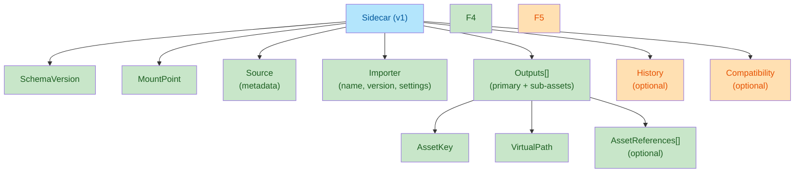

# Import (Oxygen.Assets)

Design specification for the Import module.

## Overview

Goal: unlock the editor with a single user action: **Import (updates runtime data)**.

Internally:

- Import runs **Import → Build** into the dev-friendly loose runtime-compatible layout
- Cook remains a later, optional optimization/minimization step
- Oxygen.Assets has no UI; the editor UI calls into this module and receives progress, diagnostics, and produced artifacts

Related single-source rules:

- Virtual path invariants and normalization are defined in [virtual-paths.md](virtual-paths.md).

## Table of Contents

1. [Foundations](#foundations)
   - [What We Need Immediately](#what-we-need-immediately-editor-unlock)
   - [Principles](#principles)
   - [Recommended Libraries](#recommended-libraries-mvp)
   - [Terminology](#terminology)
   - [Asset Extensions](#canonical-oxygen-asset-extensions-mvp)
2. [Project Structure](#project-structure)
   - [On-Disk Layout](#project-on-disk-layout-proposed)
3. [Architecture & Design](#architecture--design)
   - [High-Level Architecture](#high-level-architecture)
   - [Public API](#public-surface-area-proposed)
   - [Pluggable Importers](#pluggable-importer-model)
4. [Identity & Metadata](#identity--metadata)
   - [Identity Policy](#deterministic-identity-policy-assetkey--virtualpath)
   - [Sidecar Schema](#sidecar-schema-v1)
   - [Multi-Asset Sources](#multiple-assets-per-source)
5. [Implementation](#implementation)
   - [Output Layout](#output-layout-what-import-writes)
   - [MVP Importers](#mvp-importers)
   - [Diagnostics](#diagnostics-and-failure-policy)
   - [Concurrency](#concurrency-and-cancellation)
6. [Quality & Maturity](#quality--maturity)
   - [Versioning](#versioning-and-reproducibility)
   - [Testing](#testing-strategy-what-to-add-first)
7. [References](#references)

## Foundations

### What We Need Immediately (editor unlock)

Start with popular formats that are easy to obtain and test from the internet:

| Format | Input Extensions | Output | Notes |
| -------- | -------- | -------- | -------- |
| Images | `.png`, `.jpg`, `.jpeg`, `.tga` (later) | Texture descriptor + payload | Via SixLabors.ImageSharp |
| glTF 2.0 | `.gltf`, `.glb` | Scene + meshes + materials + textures | Via SharpGLTF.Core |

Deliberately defer for later (still pluggable): FBX, USD, EXR, audio codecs, animation retargeting, complex material graphs.

### Principles

| Principle | Description |
| -------- | -------- |
| No wheels reinvented | Use best-in-class .NET libraries where available |
| Deterministic identity | Stable AssetKey ownership and stable VirtualPath to AssetKey mapping |
| Incremental | Re-import only what changed; don't rebuild everything |
| Pluggable | Add importers without touching core pipeline |
| Runtime-compatible | Outputs (loose layout) produced during Import; runtime never reads source formats |
| Non-UI | Everything async, cancellation-friendly, emits structured diagnostics |

### Recommended Libraries (MVP)

| Library | Purpose | Status | Notes |
| -------- | -------- | -------- | -------- |
| SixLabors.ImageSharp | PNG/JPEG decoding | Added | Pure managed, cross-platform, excellent for editor import and testing |
| SharpGLTF.Core | glTF 2.0 parsing | Added | Reads .gltf/.glb, buffers, images, mesh primitives, transforms, PBR metadata |

Design notes:

- Keep the import layer agnostic to build/cook file formats; produce canonical in-memory representation
- Avoid mandatory native dependencies in the MVP path

### Terminology

| Term | Definition |
| -------- | -------- |
| Source file | Authoring input (e.g., `Wood.png`, `Model.glb`) |
| Imported asset (canonical) | Editor-friendly representation of source's meaning (metadata + dependency graph + stable identity) |
| Built runtime artifact | Runtime-consumable Oxygen formats written to loose layout |
| VirtualPath | Canonical editor-facing string, e.g., `/Content/Textures/Wood.otex` |
| Asset URI | `asset://Content/Textures/Wood.otex` (maps 1:1 to VirtualPath) |
| AssetKey | Stable 128-bit identifier used by runtime |

### Canonical Oxygen Asset Extensions (MVP)

All Oxygen-produced asset files use unambiguous extensions that start with `o`:

| Extension | Purpose |
| -------- | -------- |
| `.otex` | Texture asset descriptor |
| `.ogeo` | Geometry asset descriptor |
| `.omat` | Material asset descriptor |
| `.oscene` | Scene asset descriptor (glTF/GLB primary output) |

Rule: Virtual paths and artifact file names use these extensions. Source extensions (`.png`, `.glb`, etc.) remain only in `Content/**`.

## Project Structure

### Project On-Disk Layout (Proposed)

When working in the editor we use a **loose** layout:

```text
ProjectRoot/
  Project.oxy              # project manifest (includes authoring mount points)
  Content/**               # source assets (user-authored)
  Content/*.import.json    # sidecar metadata
  .imported/Content/**     # imported artifacts (editor-native, disposable)
  .cooked/Content/**       # built artifacts (runtime-ready, canonical)
  Build/
    <Platform>/
      <PakName>.pak        # packaged outputs (later)
```

Path mapping rule:

- For a source at `Content/...`, the mount point is `Content`
- Imported artifacts: `.imported/<MountPoint>/...` (same relative path)
- Built artifacts: `.cooked/<MountPoint>/...` (same relative path)

Example (glTF):

- Source: `Content/Geometry/Cube.glb`
- Sidecar: `Content/Geometry/Cube.glb.import.json`
- Imported: `.imported/Content/Geometry/Cube.oscene` + sub-assets
- Cooked: `.cooked/Content/Geometry/Cube.oscene` + sub-assets

#### Authoring mount points (Project.oxy)

Authoring mount points are represented in the project manifest (`Project.oxy`) as a `MountPoints` array of
`{ Name, RelativePath }` objects.

MVP requirements:

- `Name` is the mount point token used as the virtual root segment (e.g. `Content` → virtual root `/Content`).
- `RelativePath` is project-relative and uses `/` separators (e.g. `Content`).
- If `MountPoints` is missing or empty, the implicit default is a single mount point: `{ Name: "Content", RelativePath: "Content" }`.

## Architecture & Design

### High-Level Architecture

The editor-visible action triggers **Import → Build**:

```mermaid
graph LR
    A["Source Files<br/>(PNG, GLB)"] -->|IImportService| B["Canonical<br/>Imported Assets"]
    B -->|Build Step| C[".imported/<br/>Loose Layout"]
    C -->|Sidecar + Index| D[".cooked/<br/>Runtime-Ready"]
    D -->|Later: Cook| E["Build/Platform<br/>PAK Archive"]
    F["Sidecar JSON<br/>Metadata"] -.->|Identity| A
    style F fill:#b3e5fc,color:#01579b
    style A fill:#c8e6c9,color:#1b5e20
    style B fill:#c8e6c9,color:#1b5e20
    style C fill:#c8e6c9,color:#1b5e20
    style D fill:#c8e6c9,color:#1b5e20
    style E fill:#ffe0b2,color:#e65100
```



Responsibilities:

- `Oxygen.Assets.Import`: What assets does a source file define and what are their stable identities?
- `Build` (internal): Produce runtime-compatible descriptors/resources and container index
- `Cook` (later): Optional optimization/minimization for packaging

### Public Surface Area (Proposed)

These are minimal contracts intended for editor unlock; they can evolve without breaking the overall model.

```csharp
namespace Oxygen.Assets.Import;

public interface IImportService
{
    Task<ImportResult> ImportAsync(ImportRequest request, CancellationToken cancellationToken = default);
}

public sealed record ImportRequest(
    string ProjectRoot,
    IReadOnlyList<ImportInput> Inputs,
    ImportOptions Options);

public sealed record ImportInput(
  string SourcePath,
    string MountPoint,
    string? VirtualPath = null);

`SourcePath` is **project-relative** and uses `/` separators (e.g. `Content/Textures/Wood.png`). It is the definitive
source identity string used by this module.

public sealed record ImportOptions(
    bool ReimportIfUnchanged = false,
    bool FailFast = false,
    IProgress<ImportProgress>? Progress = null,
    ImportLogLevel LogLevel = ImportLogLevel.Info);

public sealed record ImportResult(
    IReadOnlyList<ImportedAsset> Imported,
    IReadOnlyList<ImportDiagnostic> Diagnostics,
    bool Succeeded);

public enum ImportLogLevel { Debug, Info, Warning, Error }

public sealed record ImportProgress(
    string Stage,
    string? CurrentItem,
    int Completed,
    int Total);

public sealed record ImportDiagnostic(
    ImportDiagnosticSeverity Severity,
    string Code,
    string Message,
    string? SourcePath = null,
    string? VirtualPath = null);

public enum ImportDiagnosticSeverity { Info, Warning, Error }
```

### ImportedAsset (canonical)

Canonical is intentionally not the runtime format. It’s the normalized “meaning” the build step will consume.

```csharp
public sealed record ImportedAsset(
    AssetKey AssetKey,
    string VirtualPath,
    string AssetType,
    ImportedAssetSource Source,
    IReadOnlyList<ImportedDependency> Dependencies,
    object Payload);

public sealed record ImportedAssetSource(
    string SourcePath,
    byte[] SourceHashSha256,
    DateTimeOffset LastWriteTimeUtc);

public sealed record ImportedDependency(
    string Path,
    ImportedDependencyKind Kind);

public enum ImportedDependencyKind
{
    SourceFile,
    Sidecar,
    ReferencedResource,
}
```

Payload is intentionally `object` at this stage to keep the MVP flexible; in practice we’ll have strongly typed payloads per importer (e.g., `ImportedTexture`, `ImportedGltfScene`).

### Pluggable Importer Model

### Importer selection

Core uses a registry of importers. An importer advertises what it supports (extensions and/or signature sniffing).

```csharp
public interface IAssetImporter
{
    string Name { get; }
    int Priority { get; } // higher wins when multiple match

    bool CanImport(ImportProbe probe);
    Task<IReadOnlyList<ImportedAsset>> ImportAsync(ImportContext context, CancellationToken cancellationToken);
}

public sealed record ImportProbe(
    string SourcePath,
    string Extension,
    ReadOnlyMemory<byte> HeaderBytes);

public sealed record ImportContext(
    IImportFileAccess Files,
    ImportInput Input,
    AssetIdentityPolicy Identity,
    ImportOptions Options,
    ImportDiagnostics Diagnostics);
```

Key points:

- `CanImport` must be cheap (extension and a small header sniff)
- `ImportAsync` may be expensive (decode/parse)

### Plugin registration

Use `Microsoft.Extensions.DependencyInjection` and keep it simple:

```csharp
public interface IImportPlugin
{
    void Register(ImportPluginRegistration registration);
}

public sealed class ImportPluginRegistration
{
    public void AddImporter(IAssetImporter importer);
}
```

Later, plugins can be discovered via assembly scanning or explicit registration from the editor host.

## Identity & Metadata

### Deterministic Identity Policy (AssetKey + VirtualPath)

This is the most important “works just like that” piece.

### Inputs

- The editor specifies `MountPoint` (e.g., `Content`) and a `SourcePath`.
- The system derives a canonical `VirtualPath` unless one is explicitly provided.

Recommended default mapping:

- Authoring mount root is something like: `{ProjectRoot}/Content/`
- A source file `{ProjectRoot}/Content/Textures/Wood.png` becomes the texture asset:
  - `VirtualPath = /Content/Textures/Wood.otex`
  - `URI = asset://Content/Textures/Wood.otex`
- A source file `{ProjectRoot}/Content/Geometry/Robot.glb` becomes the scene asset:
  - `VirtualPath = /Content/Geometry/Robot.oscene`
  - `URI = asset://Content/Geometry/Robot.oscene`

Virtual paths must satisfy the canonical invariants described in [virtual-paths.md](virtual-paths.md).

### AssetKey stability

Do **not** derive AssetKey from file contents only (content changes would change identity and break references).

Instead:

- AssetKey is owned by the project (not derived from content).
- If the source changes, the AssetKey stays the same.

Minimal MVP implementation (matches the project layout):

- Use a **sidecar JSON** alongside the source file as the primary identity store.
- The sidecar moves with the file on rename/move, preserving AssetKey stability across refactors.

Recommended sidecar naming:

- `<SourceFileName>.<ext>.import.json` (e.g. `Cube.glb.import.json`)

Sidecar stores (at minimum):

- `AssetKey` for each produced output (stable)
- `VirtualPath` for each produced output (current)
- `Importer` (name + version + settings)
- `Source` hash + last write time
- produced outputs (primary + sub-assets) and their inter-output references

This yields stable identity “just like that”, makes reimport decisions deterministic, and naturally supports rename/move.

#### AssetKey JSON representation

For JSON (sidecar) serialization, represent `AssetKey` as a **32-character lowercase hex string**.

- Format: `{Part0:x16}{Part1:x16}` (matches the existing runtime-compatible `AssetKey.ToString()` in `Oxygen.Assets`)
- Rationale: avoids `Guid` byte-order ambiguity across languages, stays human-readable, and round-trips cleanly.

### Sidecar Schema (v1)

Sidecar files are JSON and live beside the source. Paths are stored relative to the project root.

Naming convention:

```text
<SourceFileName>.<ext>.import.json
Example: Cube.glb.import.json
```

Schema structure:



Conventions:

- Use **UpperCamelCase** property names (matches the rest of this repo’s JSON style).
- Use `SchemaVersion` (number). **Zero ambiguity**: the schema version is an explicit integer field.
- Use SHA-256 as **lowercase hex** (no `sha256:` prefix) to avoid string parsing ambiguity.
- Treat `AssetKey` as the only true stable identity for referencing across renames/moves.

Required fields (must exist):

- `SchemaVersion` (number) — currently `1`
- `MountPoint` (string) — e.g. `Content`
- `Source` (object)
  - `RelativePath` (string)
    - The **current** path to the source file, relative to project root.
    - Example: `Content/Textures/Wood.png`
  - `LastWriteTimeUtc` (string, ISO 8601)
  - `Sha256` (string, lowercase hex)
  - `ByteLength` (number)
- `Importer` (object)
  - `Name` (string) — e.g. `Oxygen.Import.ImageSharpTexture`
  - `Version` (string) — semantic-ish, e.g. `1.0.0`
  - `Settings` (object)
    - Importer-specific options (round-trippable JSON).
    - Any change to `Settings` should be treated as “needs reimport/rebuild”, even if the source hash is unchanged.
- `Outputs` (array)
  - each output contains:
    - `Role` (string) — `Primary` or `Sub`
    - `AssetType` (string) — one of: `Texture`, `Geometry`, `Material`, `Scene`
    - `AssetKey` (string) — 32 lowercase hex chars (`{Part0:x16}{Part1:x16}`)
    - `VirtualPath` (string) — e.g. `/Content/Textures/Wood.otex`
    - `AssetReferences` (array, optional)
      - The asset-graph edges for multi-output sources and/or sub-assets (this is where dependencies matter most).
      - Each entry contains:
        - `AssetKey` (string) — the referenced asset
        - `Role` (string, optional) — e.g. `AlbedoTexture`, `NormalTexture`, `Material`

Optional fields (recommended, not required for MVP):

- `Outputs[].DisplayName` (string)
  - Human-facing name; can differ from file name.
- `Outputs[].Tags` (array of strings)
  - Source-control-friendly tags for editor search/organization.
- `History` (object)
  - `CreatedTimeUtc` (string, ISO 8601)
  - `LastImportTimeUtc` (string, ISO 8601)
  - `LastImportResult` (string) — e.g. `Success`, `Failed`, `Cancelled`
  - `LastImportEngineVersion` (string)
- `Compatibility` (object)
  - `EngineMinVersion` (string)
  - `EngineMaxVersion` (string, nullable)

Example (PNG → `.otex`):

```json
{
  "SchemaVersion": 1,
  "MountPoint": "Content",
  "Source": {
    "RelativePath": "Content/Textures/Wood.png",
    "LastWriteTimeUtc": "2025-12-23T19:05:21Z",
    "Sha256": "2b3c0f...",
    "ByteLength": 183042
  },
  "Importer": {
    "Name": "Oxygen.Import.ImageSharpTexture",
    "Version": "1.0.0",
    "Settings": {
      "ColorSpace": "Srgb"
    }
  },
  "Outputs": [
    {
      "Role": "Primary",
      "AssetType": "Texture",
      "AssetKey": "d4ce92d53f354d658c9d7f4f8b95a2af",
      "DisplayName": "Wood",
      "Tags": ["wood", "texture"],
      "VirtualPath": "/Content/Textures/Wood.otex"
    }
  ],
  "History": {
    "CreatedTimeUtc": "2025-12-23T19:05:22Z",
    "LastImportTimeUtc": "2025-12-23T19:05:22Z",
    "LastImportResult": "Success",
    "LastImportEngineVersion": "0.4.0"
  },
  "Compatibility": {
    "EngineMinVersion": "0.4.0",
    "EngineMaxVersion": null
  }
}
```

### Multiple Assets Per Source

Some sources define multiple assets (a glTF scene may produce:

- a scene descriptor asset,
- multiple mesh assets,
- multiple material assets,
- texture assets for embedded images).

Policy (solid recommendation): **single folder, deterministic file names, no ambiguity**.

1) Primary output

- The primary asset is derived from the source file name and uses the canonical Oxygen extension for the importer.
  - Example: `Robot.glb` → `/Content/Geometry/Robot.oscene`

1) Sub-assets (multi-output)

- Sub-assets are placed in the **same virtual directory** as the primary output.
- Sub-asset file names are derived from:
  - the source stem (e.g. `Robot`)
  - a stable kind tag (`mesh`, `mat`, `tex`)
  - a stable numeric index from the source (`0000`, `0001`, …)
  - an optional sanitized display name (for readability)

Canonical pattern:

- `{Stem}__{kind}__{Index4}.{oext}`

Rules:

- `Stem` is the source file name without extension.
- `Index4` is a zero-based index padded to 4 digits.
- `oext` is one of the canonical Oxygen extensions listed above.

Stability rule (important): once a sub-asset has a `VirtualPath` assigned and persisted in the sidecar, it is treated as
authoritative and **must not be recomputed** from display names on reimport. Display names can change without renaming
assets.

Examples (glTF):

- Primary scene: `/Content/Geometry/Robot.oscene`
- Mesh 0: `/Content/Geometry/Robot__mesh__0000.ogeo`
- Material 1: `/Content/Geometry/Robot__mat__0001.omat`
- Image 2: `/Content/Geometry/Robot__tex__0002.otex`

Why this works:

- Deterministic and collision-resistant
- Stable across reimport as long as the source’s ordering for those items is stable
- No extra folders required (keeps “same relative path” promise)

### Deriving output paths (keep sidecar DTOs simple)

To avoid ambiguity and deserialization conflicts, the sidecar **does not store physical output paths**.
Given an output `VirtualPath` of the form `/{MountPoint}/{Path}`:

- Imported artifact project-relative path: `.imported/{MountPoint}/{Path}`
- Cooked artifact project-relative path: `.cooked/{MountPoint}/{Path}`

These are deterministic and derived everywhere.

## Implementation

### Output Layout (What Import Writes)

Import produces two output directories, both in loose layout:

| Output Directory | Purpose | Lifecycle | Path Example |
| -------- | -------- | -------- | -------- |
| `.imported/<MountPoint>/**` | Editor-native, disposable | Wipe and regenerate anytime | `.imported/Content/Geometry/Cube.oscene` |
| `.cooked/<MountPoint>/**` | Runtime-ready, canonical | PIE/runtime mount truth | `.cooked/Content/Geometry/Cube.oscene` |

The build step:

- Generates `container.index.bin` under `.cooked/<MountPoint>/`
- Produces any runtime resources/tables
- Both directories use `.otex`, `.ogeo`, `.omat`, `.oscene` extensions

### MVP Importers

### 1) Texture importer (PNG/JPEG)

Responsibilities:

- Decode image → canonical pixels + metadata
- Create/update a single texture asset at `VirtualPath`
- Produce dependencies: the source image file

Implementation notes:

- Use ImageSharp to decode.
- Normalize color space metadata (sRGB vs linear) via options.
- Don’t over-optimize: the initial Build step can store raw RGBA8 (or a simple uncompressed format) if needed.

### 2) glTF importer (GLB/GLTF)

Responsibilities:

- Load glTF and extract:
  - meshes and primitives
  - node transforms / scene graph (at least enough for future)
  - materials (PBR metallic-roughness subset)
  - referenced images (embedded or external)
- Emit multiple ImportedAssets with deterministic sub-asset virtual paths.

Implementation notes:

- Use SharpGLTF to parse and read buffers.
- Treat external references as dependencies (buffer `.bin`, image files).
- Keep canonical payloads simple and strongly typed.

### Diagnostics and Failure Policy

Diagnostic collection strategy:

- Collect diagnostics rather than throwing for common issues (missing optional texture, unsupported extension)
- Throw only for programmer errors or data corruption in the pipeline
- `FailFast` option lets editor choose between "stop on first error" vs "best effort"

### Concurrency and Cancellation

Requirements:

- `IImportService.ImportAsync` must accept `CancellationToken` and honor it
- Inputs can be processed in parallel (bounded concurrency), but:
  - Sidecar reads/writes must be synchronized per-source
  - Outputs for a single container/build must remain deterministic

Recommendation:

- Import phase: parallelizable per input (bounded)
- Build phase: initially sequential for determinism (parallelizable later with careful ordering)

## Incremental reimport decision (MVP)

Treat an input as “unchanged” only when **all** of the following are unchanged:

- Importer identity: `Importer.Name` + `Importer.Version`
- Importer settings JSON (`Importer.Settings`)
- Source file fingerprint (`Source.Sha256`, `Source.ByteLength`, `Source.LastWriteTimeUtc`)
- All discovered file dependencies (e.g. external `.bin`, external images for `.gltf`): fingerprinted the same way

If any dependency changes, reimport/rebuild is required even when the primary source file hash is unchanged.

## Quality & Maturity

### Versioning and Reproducibility

- Record importer name + version in the import cache.
- If importer version changes, treat affected assets as needing rebuild (even if source hash unchanged).

### Testing Strategy (What to Add First)

Recommended test coverage:

| Test Type | Focus | Examples |
| --------- | ----- | -------- |
| Unit tests: Identity policy | AssetKey stability, sub-asset naming | Stable AssetKey across reimport; stable sub-asset naming for glTF |
| Unit tests: Importer selection | Extension and magic sniffing | Correct importer chosen by signature; priority handling for overlaps |
| Integration tests (mock filesystem) | PNG import, GLB import, determinism | Small PNG → expected artifacts; small GLB → deterministic virtual paths and container index |

## References

Runtime binary formats are specified in `runtime-formats.md`.
