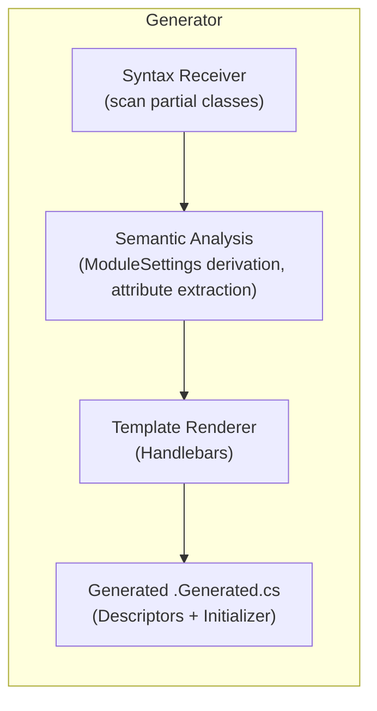

# Oxygen.Editor.Data — Source Generators

This project contains the incremental Roslyn source generator that:

- Generates typed `SettingDescriptor<T>` fields for `ModuleSettings` subclasses by scanning `[Persisted]`-marked properties. Note: nested `ModuleSettings` classes are not supported — the generator reports `OXGNPG104` when `[Persisted]` is used in nested classes.
- Emits a single file-scoped assembly-level module initializer that registers descriptors with `EditorSettingsManager.StaticProvider` at assembly load.
- Preserves metadata (`Display`, `Category`) and validation attributes (DataAnnotations) so the UI and runtime can benefit from compile-time descriptor generation.

See the full specification in `projects/Oxygen.Editor.Data/docs/source-generator.md`.

---

## Technology Stack

- Project type: Roslyn Analyzer/Source Generator
- Target Framework: `netstandard2.0` for the generator; consumes and emits code for `net9.0` projects
- Languages: C# 13
- Roslyn SDK: `Microsoft.CodeAnalysis.CSharp` (analyzer/generator APIs)
- Templates: `Handlebars.Net` (template rendering for generated code)
- Testing: MSTest, Verify.MSTest, Basic.Reference.Assemblies.Net80
- Packaging: Generator is packed as an analyzer (`analyzers/dotnet/cs`) in NuGet packages

---

## Project Architecture

High-level flow:



Notes:

- The generator is implemented as an incremental generator and inspects `TypeDeclarationSyntax` nodes then constructs a semantic model to validate derivation, attributes and types.
- Diagnostics are emitted at compile-time so developers see errors/warnings in the IDE (e.g., `OXGNPG001`, `OXGNPG101`, `OXGNPG104` for nested types). Generation failures are reported via `OXGNPG999` and include just the exception message to keep diagnostics stable for testing.

---

## Getting Started

### Prerequisites

- .NET SDK 9.0+ (for building and running tests)
- `dotnet` CLI

### Build

```powershell
# Build the generator project
dotnet build projects/Oxygen.Editor.Data/Generators/src
```

### Run the Generator Tests

```powershell
dotnet test projects/Oxygen.Editor.Data/Generators/tests
```

### Local usage (as project reference)

To iterate on the generator locally, prefer referencing it as a `ProjectReference` from a test or sample project to avoid packaging.

Test projects in this repo reference the generator like this:

```xml
<ItemGroup>
    <ProjectReference Include="$(ProjectsRoot)\Oxygen.Editor.Data.Generators\src\Oxygen.Editor.Data.Generators.csproj" />
</ItemGroup>
```

Notes:

- Using a `ProjectReference` is convenient during development: the generator runs as an analyzer during build, and you can inspect generated sources directly.
- If you prefer to treat the generator strictly as an analyzer (declare it in the analyzers item), you can set `OutputItemType` for the project reference as shown below:

```xml
<ItemGroup>
    <ProjectReference Include="$(ProjectsRoot)\Oxygen.Editor.Data.Generators\src\Oxygen.Editor.Data.Generators.csproj"
                                        ReferenceOutputAssembly="false" OutputItemType="Analyzer" />
</ItemGroup>
```

- Build and inspect generated files under `obj/<Configuration>/<TargetFramework>/generated` (or use IDE 'Generated Files' view).
- For test verification, the `Generators/tests` project uses snapshot tests to assert generated output; use `dotnet test` to run them.

### Consumption via NuGet (recommended for projects/CI)

1. Pack the generator as an analyzer package (CI or release build):

    ```powershell
    dotnet pack projects/Oxygen.Editor.Data/Generators/src -c Release -o artifacts/packages
    ```

1. Publish to your internal or public NuGet feed (or use a local package source):

    ```powershell
    dotnet nuget push artifacts/packages\Oxygen.Editor.Data.Generators.*.nupkg --source "<your-feed>" --api-key <key>
    ```

1. Add the package to a consuming project via PackageReference (this will automatically register the analyzer/generator with the compilation):

    ```xml
    <ItemGroup>
    <PackageReference Include="Oxygen.Editor.Data.Generators" Version="<version>" />
    </ItemGroup>
    ```

This is the recommended approach for CI and end-user projects because the generator is delivered as a lightweight analyzer package and does not add runtime dependencies to the consuming project.

### Inspecting generated files

- IDE (Visual Studio): Generated source files appear under the 'Generated Files' or 'Analyzers' node while building the project or when the new generator is referenced.
- CLI/Filesystem: After build, the source generator output files are usually placed under:

```text
obj/<Configuration>/<TargetFramework>/generated
```

You should also inspect snapshot tests under `projects/Oxygen.Editor.Data/Generators/tests/Snapshots` to see exact expected generator outputs.

---

## Project Structure

- `src/` — Source for the generator implementation, template files (Handlebars), helper utilities
- `tests/` — Roslyn-based generator tests, snapshot verification
- `Templates/` — Handlebars templates used to render the output sources

Example:

```text
projects/Oxygen.Editor.Data/Generators/
  ├─ src/
  │  ├─ Generators/ (main generator implementation)
  │  ├─ Templates/ (Handlebars templates)
  │  └─ *.csproj
  └─ tests/
     ├─ Snapshot tests (verify generated output)
     └─ Diagnostics tests
```

---

## Key Features

- Generate typed `SettingDescriptor<T>` fields for `[Persisted]` properties
- Preservation of `Display`, `Category`, and validation attributes into `SettingDescriptor<T>` metadata
- Emit a `file static` module initializer to register descriptors at assembly load using `EditorSettingsManager.StaticProvider.Register(...)`
- Helpful diagnostics for incorrect usage (non-partial classes, missing `ModuleName`, non-serializable types)
- Snapshot tests to guarantee exact output and to prevent regressions

---

## Usage Example

Developer code example:

```csharp
public sealed partial class ExampleSettings : ModuleSettings
{
    private new const string ModuleName = "Oxygen.Editor.Data.Example";

    public ExampleSettings() : base(ModuleName) { }

    [Persisted]
    [Display(Name = "Window Position", Description = "The position of the window")]
    [Category("Layout")]
    public Point WindowPosition { get; set; }
}
```

The generator will produce a file `{ExampleSettings}.Generated.cs` containing typed descriptors and register them via a module initializer.

---

## Diagnostics

Errors (block build):

- `SETGEN001` — ModuleSettings class must be `partial`.
- `SETGEN002` — Class must define `private new const string ModuleName`.
- `SETGEN003` — ModuleName must be a compile-time constant.
- `SETGEN103` — Property type must be JSON-serializable by System.Text.Json.

Warnings (allow build):

- `SETGEN101` — Non-public `[Persisted]` property.
- `SETGEN102` — Read-only `[Persisted]` property.
- `SETGEN201` — Validator with no constraints.

Quick diagnostics actions:

- The generator’s tests assert diagnostics; diagnostic messages include suggestions where practical (e.g., suggested code snippet to add `ModuleName`).

---

## Testing

Unit and integration tests exist under `projects/Oxygen.Editor.Data/Generators/tests` and include:

- Snapshot tests: verify generated code text matches the expected output.
- Diagnostics tests: assert specific diagnostic codes and messages are produced when source is invalid.
- Rendering tests: validate that templates render predictors correctly and that snapshot files are stable.

Run the tests:

```powershell
dotnet test projects/Oxygen.Editor.Data/Generators/tests
```

TIP: Snapshot test failures indicate the generator output has changed; update the verified snapshots using test helpers after confirming behavior intentionally changed.

---

## Development Workflow

1. Create a feature branch `feature/<your-branch>`.
2. Add tests for any new behavior (unit snapshot + diagnostics).
3. Run the generator tests locally (`dotnet test projects/Oxygen.Editor.Data/Generators/tests`).
4. Keep code changes small and scoped; do not change code-generation behavior without updating tests.
5. Open a PR with a short description and include snapshot diffs if expected.

---

## Coding Standards

- Follow AeroNet / DroidNet repo conventions: C# 13 language features, nullable enabled, explicit access modifiers, prefer `this.` usage where appropriate.
- Respect pattern and formatting rules; use existing helper utilities and templates where possible.

---

## Contributing

Contributions are welcome! When contributing to the generator:

- Add unit and snapshot tests for new output or diagnostic scenarios.
- Ensure `Handlebars` templates remain consistent and documented.
- Keep generated output deterministic to avoid noisy snapshot diffs.
- Follow PR guidelines: one feature/bug per PR, include tests, and run `dotnet build` and generator tests.

---

## License

The generator is licensed under the MIT License — see the top-level [LICENSE](../../LICENSE) file for details.

---

## Links & References

- Full spec: `projects/Oxygen.Editor.Data/docs/source-generator.md`
- Generator sources: `projects/Oxygen.Editor.Data/Generators/src`
- Generator tests: `projects/Oxygen.Editor.Data/Generators/tests`
*** End Patch
