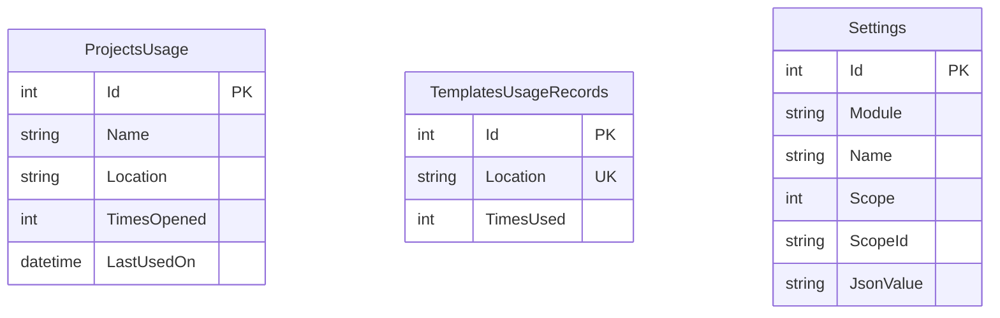

# Oxygen.Editor.Data

[](https://dotnet.microsoft.com/)
[](https://learn.microsoft.com/ef/core/)
[](https://www.sqlite.org/)
[](../../../LICENSE)

**Persistence layer for the Oxygen Editor**, providing data storage and retrieval for editor settings, project usage history, and template usage tracking using Entity Framework Core with SQLite.

## Table of Contents

- [Overview](#overview)
- [Features](#features)
- [Technology Stack](#technology-stack)
- [Architecture](#architecture)
- [Getting Started](#getting-started)
- [Usage Examples](#usage-examples)
- [Data Model](#data-model)
- [API Reference](#api-reference)
- [Database Maintenance](#database-maintenance)
- [Development](#development)
- [Testing](#testing)
- [Contributing](#contributing)
- [License](#license)

## Overview

`Oxygen.Editor.Data` is a self-contained module within the DroidNet monorepo that provides robust data persistence for the Oxygen game editor. It manages:

- **Project Usage Tracking** — Recently opened projects with session restoration
- **Template Usage Tracking** — Template usage history for the new project wizard
- **Module Settings** — Flexible JSON-based configuration storage per editor module

The module uses Entity Framework Core with SQLite for local-first, zero-configuration data storage, optimized for single-user desktop applications with multi-level caching for performance.

## Features

✅ **Recent Projects Management** — Track and display recently used projects with usage statistics
✅ **Template History** — Remember frequently used project templates
✅ **Flexible Settings System** — Store arbitrary module configuration as JSON with type-safe base classes
✅ **Session Restoration** — Save and restore last opened scene and content browser state per project
✅ **Multi-Level Caching** — In-memory caching for high-performance reads
✅ **Change Notifications** — Subscribe to setting changes for reactive UI updates
✅ **EF Core Migrations** — Schema versioning and evolution support
✅ **Design-Time Factory** — Simplified migration workflow with in-memory database support
✅ **Testable Design** — Uses `Testably.Abstractions.IFileSystem` for filesystem operations

## Technology Stack

### Core Technologies

- **.NET 9.0** — Target framework (also targets `net9.0-windows10.0.26100.0`)
- **C# 13** — Language features including primary constructors and collection expressions
- **Entity Framework Core 9.0** — ORM and database abstraction
- **SQLite** — Embedded relational database

### Key Dependencies

| Package | Version | Purpose |
|---------|---------|---------|
| `Microsoft.EntityFrameworkCore` | 9.0+ | Database context and change tracking |
| `Microsoft.EntityFrameworkCore.Sqlite` | 9.0+ | SQLite provider for EF Core |
| `Microsoft.EntityFrameworkCore.Design` | 9.0+ | Design-time tools for migrations |
| `Microsoft.Extensions.Caching.Memory` | 9.0+ | In-memory caching layer |
| `Testably.Abstractions` | Latest | Filesystem abstraction for testing |
| `System.CommandLine` | Latest | CLI parsing for design-time factory |

### Project References

- `DroidNet.Config` — Provides `PathFinder` for database location resolution
- `Oxygen.Editor.Core` — Core editor interfaces and types

## Architecture

### High-Level Design

```text
┌─────────────────────────────────────────────────────────────┐
│                    Application Layer                         │
│  (ViewModels, Controllers, UI Components)                    │
└────────────────┬────────────────────────────────────────────┘
                 │
                 ▼
┌─────────────────────────────────────────────────────────────┐
│                    Service Layer                             │
│  ┌──────────────────┐  ┌──────────────────┐  ┌────────────┐│
│  │EditorSettings    │  │ProjectUsage      │  │TemplateUsage││
│  │Manager           │  │Service           │  │Service       ││
│  └────────┬─────────┘  └────────┬─────────┘  └─────┬──────┘│
│           │                     │                    │        │
│           └─────────────────────┼────────────────────┘        │
│                                 │                             │
│                    ┌────────────▼──────────────┐              │
│                    │  Caching Layer             │              │
│                    │  (MemoryCache/Dictionary)  │              │
│                    └────────────┬──────────────┘              │
└─────────────────────────────────┼───────────────────────────┘
                                  │
                                  ▼
┌─────────────────────────────────────────────────────────────┐
│                  Data Access Layer (EF Core)                 │
│                    PersistentState (DbContext)               │
│  ┌──────────────┐  ┌──────────────┐  ┌──────────────────┐  │
│  │ Settings     │  │ ProjectsUsage│  │ TemplatesUsage   │  │
│  │ (DbSet)      │  │ (DbSet)      │  │ Records (DbSet)  │  │
│  └──────────────┘  └──────────────┘  └──────────────────┘  │
└─────────────────────────────────────┬───────────────────────┘
                                      │
                                      ▼
┌─────────────────────────────────────────────────────────────┐
│                       SQLite Database                        │
│                   PersistentState.db                         │
└─────────────────────────────────────────────────────────────┘
```

### Design Patterns

- **Repository Pattern** — Services abstract data access logic
- **Factory Pattern** — `TemplateUsageService` uses context factory for concurrency safety
- **Cache-Aside** — Services implement read-through caching with manual invalidation
- **Unit of Work** — EF Core DbContext manages transactions and change tracking
- **Data Annotations + Fluent API** — Entity configuration via attributes and conventions
- **Strategy Pattern** — Design-time factory supports multiple database resolution strategies

### Key Components

#### PersistentState (DbContext)

The central EF Core context managing three DbSets:

- `Settings` — Module configuration storage
- `ProjectUsageRecords` — Project history and state
- `TemplatesUsageRecords` — Template usage tracking

#### Service Layer

**EditorSettingsManager** (`IEditorSettingsManager`)

- Generic key-value storage with JSON serialization
- In-memory caching with `ConcurrentDictionary`
- Change notification support

**ProjectUsageService** (`IProjectUsageService`)

- CRUD operations for project usage records
- `IMemoryCache`-based caching
- Validation and cache coherence management

**TemplateUsageService** (`ITemplateUsageService`)

- Template usage tracking and retrieval
- Factory-based context creation for concurrency safety
- Detached entity cloning to avoid tracking conflicts

#### Models

**Base Classes:**

- `ModuleSettings` — Abstract base with `[Persisted]` attribute support
- `WindowedModuleSettings` — Extends `ModuleSettings` with window position/size

**Entities:**

- `ProjectUsage` — Project metadata and session state
- `TemplateUsage` — Template usage statistics
- `ModuleSetting` — Key-value setting storage

## Getting Started

### Prerequisites

- .NET 9.0 SDK or later
- (Optional) EF Core CLI tools: `dotnet tool install --global dotnet-ef`

### Installation

This module is part of the DroidNet monorepo. To use it in your project:

1. **Add project reference:**

   ```xml
   <ItemGroup>
     <ProjectReference Include="$(ProjectsRoot)\Oxygen.Editor.Data\src\Oxygen.Editor.Data.csproj" />
   </ItemGroup>
   ```

2. **Register services in DI container:**

   ```csharp
   // In your host configuration
   services.AddDbContext<PersistentState>(options =>
   {
       var dbPath = pathFinder.GetEditorDataPath() / "PersistentState.db";
       options.UseSqlite($"Data Source={dbPath}");
   });

   services.AddSingleton<IEditorSettingsManager, EditorSettingsManager>();
   services.AddSingleton<IProjectUsageService, ProjectUsageService>();
   services.AddSingleton<ITemplateUsageService>(sp =>
   {
       var cache = sp.GetRequiredService<IMemoryCache>();
       return new TemplateUsageService(() => sp.GetRequiredService<PersistentState>(), cache);
   });
   ```

3. **Apply migrations automatically:**

   ```csharp
   // On application startup
   await using var context = new PersistentState(options);
   await context.Database.MigrateAsync();
   ```

### Quick Example

```csharp
// Track project usage
await projectUsageService.UpdateProjectUsageAsync("MyGame", @"C:\Projects\MyGame");

// Retrieve recent projects
var recentProjects = await projectUsageService.GetMostRecentlyUsedProjectsAsync(10);

// Save a setting
await settingsManager.SaveSettingAsync("Editor", "Theme", "Dark");

// Load a setting with default
var theme = await settingsManager.LoadSettingAsync("Editor", "Theme", "Light");
```

## Usage Examples

### Managing Project Usage

```csharp
// Open a project (tracks usage)
await projectUsageService.UpdateProjectUsageAsync("MyProject", @"C:\Dev\MyProject");

// Get top 5 recent projects
var recent = await projectUsageService.GetMostRecentlyUsedProjectsAsync(5);
foreach (var project in recent)
{
    Console.WriteLine($"{project.Name} - Opened {project.TimesOpened} times");
}

// Update last opened scene (for session restoration)
await projectUsageService.UpdateLastOpenedSceneAsync(
    "MyProject",
    @"C:\Dev\MyProject",
    "Scenes/MainMenu.scene");

// Update content browser state
await projectUsageService.UpdateContentBrowserStateAsync(
    "MyProject",
    @"C:\Dev\MyProject",
    JsonSerializer.Serialize(new { path = "/Assets", filter = "textures" }));

// Rename or move project
await projectUsageService.UpdateProjectNameAndLocationAsync(
    "OldName",
    @"C:\OldPath",
    "NewName",
    @"C:\NewPath");

// Delete usage record
await projectUsageService.DeleteProjectUsageAsync("MyProject", @"C:\Dev\MyProject");
```

### Managing Template Usage

```csharp
// Record template usage (when creating new project)
await templateUsageService.UpdateTemplateUsageAsync(@"C:\Templates\3DGame.template");

// Get recent templates for wizard
var recentTemplates = await templateUsageService.GetMostRecentlyUsedTemplatesAsync(10);

// Check specific template usage
var usage = await templateUsageService.GetTemplateUsageAsync(@"C:\Templates\3DGame.template");
if (usage != null)
{
    Console.WriteLine($"Used {usage.TimesUsed} times, last on {usage.LastUsedOn}");
}
```

### Managing Settings

**Basic settings operations:**

```csharp
// Save primitive types
await settingsManager.SaveSettingAsync(new Oxygen.Editor.Data.Settings.SettingKey<int>("MyModule", "WindowWidth"), 1920);
await settingsManager.SaveSettingAsync(new Oxygen.Editor.Data.Settings.SettingKey<string>("MyModule", "Theme"), "Dark");
await settingsManager.SaveSettingAsync(new Oxygen.Editor.Data.Settings.SettingKey<bool>("MyModule", "EnableFeature"), true);

// Load with type inference
var width = await settingsManager.LoadSettingAsync<int>(new Oxygen.Editor.Data.Settings.SettingKey<int>("MyModule", "WindowWidth"));
var theme = await settingsManager.LoadSettingAsync<string>(new Oxygen.Editor.Data.Settings.SettingKey<string>("MyModule", "Theme"));

// Load with default value
var height = await settingsManager.LoadSettingAsync(new Oxygen.Editor.Data.Settings.SettingKey<int>("MyModule", "WindowHeight"), 1080);
```

**Custom settings class with [Persisted] attributes:**

```csharp
public class EditorSettings : ModuleSettings
{
    [Persisted]
    public string Theme { get; set; } = "Light";

    [Persisted]
    public int AutoSaveInterval { get; set; } = 300; // seconds

    [Persisted]
    public bool ShowLineNumbers { get; set; } = true;

    // Not persisted (no attribute)
    public bool IsDirtyFlag { get; set; }

    public EditorSettings(IEditorSettingsManager manager)
        : base(manager, "Editor")
    {
    }
}

// Usage
var settings = new EditorSettings(settingsManager);
await settings.LoadAsync();

settings.Theme = "Dark";
settings.AutoSaveInterval = 600;

if (settings.IsDirty)
{
    await settings.SaveAsync();
}
```

**Windowed module settings:**

```csharp
public class DockingModuleSettings : WindowedModuleSettings
{
    [Persisted]
    public string LayoutFile { get; set; } = "default.layout";

    public DockingModuleSettings(IEditorSettingsManager manager)
        : base(manager, "Docking")
    {
    }
}

// Usage
var settings = new DockingModuleSettings(settingsManager);
await settings.LoadAsync();

// WindowPosition and WindowSize are automatically persisted
settings.WindowPosition = new Point(100, 100);
settings.WindowSize = new Size(1920, 1080);
settings.LayoutFile = "custom.layout";

await settings.SaveAsync();
```

**Change notifications:**

```csharp
// Subscribe to setting changes using typed SettingKey and IObservable
using var subscription = settingsManager
    .WhenSettingChanged(new Oxygen.Editor.Data.Settings.SettingKey<string>("Editor", "Theme"))
    .Subscribe(evt =>
    {
        var newTheme = evt.NewValue; // typed value already deserialized
        Console.WriteLine($"Theme changed to: {newTheme}");
        // Update UI
    });
```

## Data Model

The persistence layer uses three primary tables. For detailed documentation, see [Data Model Documentation](docs/data-model.md).

### Quick Reference

| Entity | Purpose | Key Fields |
|--------|---------|------------|
| `ProjectUsage` | Project history & state | `Name`, `Location`, `LastUsedOn`, `TimesOpened`, `LastOpenedScene` |
| `TemplateUsage` | Template usage tracking | `Location`, `LastUsedOn`, `TimesUsed` |
| `ModuleSetting` | Module configuration | `SettingsModule`, `Name`, `JsonValue` |

**Entity Relationship:**



## API Reference

### IEditorSettingsManager

```csharp
Task SaveSettingAsync<T>(SettingKey<T> key, T value, SettingContext? settingContext = null, CancellationToken ct = default);
Task<T?> LoadSettingAsync<T>(SettingKey<T> key, SettingContext? settingContext = null, CancellationToken ct = default);
Task<T> LoadSettingAsync<T>(SettingKey<T> key, T defaultValue, SettingContext? settingContext = null, CancellationToken ct = default);
IObservable<SettingChangedEvent<T>> WhenSettingChanged<T>(SettingKey<T> key);
void ClearCache();
```

### IProjectUsageService

```csharp
Task<bool> HasRecentlyUsedProjectsAsync();
Task<IList<ProjectUsage>> GetMostRecentlyUsedProjectsAsync(uint sizeLimit = 10);
Task<ProjectUsage?> GetProjectUsageAsync(string name, string location);
Task UpdateProjectUsageAsync(string name, string location);
Task UpdateContentBrowserStateAsync(string name, string location, string contentBrowserState);
Task UpdateLastOpenedSceneAsync(string name, string location, string lastOpenedScene);
Task UpdateProjectNameAndLocationAsync(string oldName, string oldLocation, string newName, string? newLocation = null);
Task DeleteProjectUsageAsync(string name, string location);
```

### ITemplateUsageService

```csharp
Task<bool> HasRecentlyUsedTemplatesAsync();
Task<IList<TemplateUsage>> GetMostRecentlyUsedTemplatesAsync(int sizeLimit = 10);
Task<TemplateUsage?> GetTemplateUsageAsync(string location);
Task UpdateTemplateUsageAsync(string location);
Task DeleteTemplateUsageAsync(string location);
```

## Database Maintenance

### EF Core Migrations

The project uses Entity Framework Core migrations for schema versioning. For comprehensive migration workflows, see [Database Maintenance Guide](docs/db-maintenance.md).

#### Quick Commands

**Create a migration:**

```powershell
dotnet ef migrations add <Name> `
  --project projects/Oxygen.Editor.Data/src `
  --startup-project projects/Oxygen.Editor.Data/src `
  --framework net9.0 `
  -- --use-in-memory-db
```

**Apply migrations:**

```powershell
dotnet ef database update `
  --project projects/Oxygen.Editor.Data/src `
  --startup-project projects/Oxygen.Editor.Data/src `
  --framework net9.0 `
  -- --mode=dev
```

**List migrations:**

```powershell
dotnet ef migrations list `
  --project projects/Oxygen.Editor.Data/src `
  --startup-project projects/Oxygen.Editor.Data/src
```

### Design-Time Factory

The `DesignTimePersistentStateFactory` supports three database resolution modes:

| Argument | Description |
|----------|-------------|
| `--mode <dev\|real>` | Uses `PathFinder` to resolve database location (default: `dev`) |
| `--use-in-memory-db` | Creates in-memory SQLite database (recommended for migrations) |
| `--db-path <path>` | Explicit path to database file |

Use `--use-in-memory-db` for safe migration generation, then apply to file-based DB for testing.

## Development

### Project Structure

```text
src/
├── Models/                  # Entity definitions
│   ├── ModuleSetting.cs
│   ├── ModuleSettings.cs
│   ├── ProjectUsage.cs
│   ├── TemplateUsage.cs
│   ├── WindowedModuleSettings.cs
│   └── PersistedAttribute.cs
├── Migrations/              # EF Core migrations
│   ├── 20241124075532_InitialCreate.cs
│   └── 20241126135247_AddModuleSetting.cs
├── PersistentState.cs       # DbContext
├── DesignTimePersistentStateFactory.cs
├── EditorSettingsManager.cs
├── ProjectUsageService.cs
├── TemplateUsageService.cs
└── *.csproj

docs/
├── data-model.md            # Detailed data model documentation
└── db-maintenance.md        # EF Core tooling guide

tests/                       # (Future: unit and integration tests)
```

### Building

```powershell
# Build the project
dotnet build projects/Oxygen.Editor.Data/src

# Build with detailed logging
dotnet build projects/Oxygen.Editor.Data/src -v detailed
```

### Code Style

This project follows the DroidNet C# coding standards:

- C# 13 language features enabled
- Nullable reference types enabled
- Implicit usings enabled
- Explicit access modifiers required
- `this.` qualifier for instance members
- StyleCop, Roslynator, and Meziantou analyzers enforced

See [`.github/instructions/csharp_coding_style.instructions.md`](../../.github/instructions/csharp_coding_style.instructions.md) for complete guidelines.

## Testing

### Test Strategy

*Note: Test projects are planned but not yet implemented.*

**Planned coverage:**

- **Unit Tests** — Service layer logic with mocked DbContext
- **Integration Tests** — Full service layer with in-memory SQLite database
- **Migration Tests** — Verify Up/Down migrations apply cleanly

**Test framework:** MSTest with AwesomeAssertions

**Mocking:** Moq for service dependencies, `Testably.Abstractions.Testing` for filesystem

### Running Tests (Future)

```powershell
# Run all tests
dotnet test projects/Oxygen.Editor.Data/tests

# Run with coverage
dotnet test projects/Oxygen.Editor.Data/tests /p:CollectCoverage=true
```

## Contributing

Contributions are welcome! This project follows DroidNet repository conventions.

### Development Workflow

1. **Create a feature branch:**

   ```powershell
   git checkout -b feature/my-feature
   ```

2. **Make changes following coding standards**

3. **Add tests** (when test infrastructure exists)

4. **Create migration if schema changes:**

   ```powershell
   dotnet ef migrations add MyFeature -- --use-in-memory-db
   ```

5. **Build and verify:**

   ```powershell
   dotnet build projects/Oxygen.Editor.Data/src
   ```

6. **Commit and push:**

   ```powershell
   git add .
   git commit -m "feat: add my feature"
   git push origin feature/my-feature
   ```

7. **Create pull request**

### Coding Standards

- Follow `.github/instructions/csharp_coding_style.instructions.md`
- Use descriptive migration names (e.g., `AddTemplateUsageTable`)
- Document public APIs with XML comments
- Keep service methods focused and testable
- Use async/await consistently
- Validate inputs at service boundaries

### Pull Request Guidelines

- Ensure all builds pass
- Update documentation if API changes
- Include migration files with schema changes
- Add tests for new functionality (when infrastructure exists)
- Keep PRs focused on a single concern

## License

This project is licensed under the MIT License. See [LICENSE](../../LICENSE) for details.

---

## Additional Resources

- [Data Model Documentation](docs/data-model.md) — Detailed entity schemas and relationships
- [Database Maintenance Guide](docs/db-maintenance.md) — EF Core tooling and migration workflows
- [DroidNet Repository](https://github.com/abdes/DroidNet) — Parent monorepo
- [Entity Framework Core Docs](https://learn.microsoft.com/ef/core/) — Official EF Core documentation
- [SQLite Documentation](https://www.sqlite.org/docs.html) — SQLite reference
