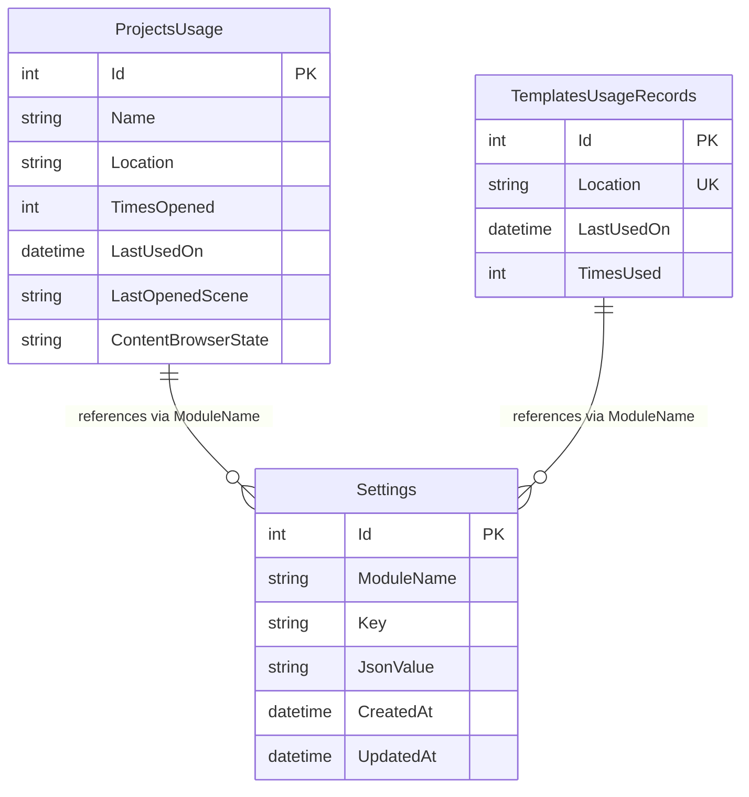

# Oxygen Editor Data Model

This document describes the relational data model used by the Oxygen Editor's persistence layer, implemented using Entity Framework Core with SQLite.

## Overview

The Oxygen Editor persistent store manages three primary data domains:

1. **Project Usage Tracking** — Maintains history and state for recently opened projects
2. **Template Usage Tracking** — Records template usage for the new project wizard
3. **Module Settings** — Flexible key-value storage for per-module configuration

## Database Technology

- **Provider**: SQLite
- **ORM**: Entity Framework Core 9.0+
- **Target Frameworks**: net9.0, net9.0-windows10.0.26100.0
- **Database File Location**: Configured via `DroidNet.Config.PathFinder` (dev/production modes)

## Entity Relationship Diagram



## Data Entities

### ProjectsUsage

Tracks usage statistics and state for projects opened in the editor.

| Column | Type | Constraints | Description |
|--------|------|-------------|-------------|
| `Id` | INTEGER | PRIMARY KEY, AUTOINCREMENT | Unique identifier |
| `Name` | TEXT(255) | NOT NULL, MIN 1 | Project display name |
| `Location` | TEXT(2048) | NOT NULL, MIN 1 | Absolute path to project directory |
| `TimesOpened` | INTEGER | NOT NULL | Counter incremented each time project opens |
| `LastUsedOn` | TEXT (DateTime) | NOT NULL | Timestamp of most recent project access |
| `LastOpenedScene` | TEXT(255) | NOT NULL, DEFAULT '' | Path to last active scene (for session restoration) |
| `ContentBrowserState` | TEXT(2048) | NOT NULL, DEFAULT '' | Serialized UI state for content browser panel |

**Indexes:**

- Unique index on `(Location, Name)` — prevents duplicate project records

**Business Rules:**

- Name and Location cannot be empty or whitespace
- Updates occur on project open, rename/move, scene change, and content browser state change
- Records are soft-deleted (removed explicitly via API, not cascaded)

**Use Cases:**

- Populate "Recently Used Projects" list in launcher
- Restore last opened scene when project reopens
- Persist content browser navigation state

### TemplatesUsageRecords

Tracks template usage for prioritizing frequently used templates.

| Column | Type | Constraints | Description |
|--------|------|-------------|-------------|
| `Id` | INTEGER | PRIMARY KEY, AUTOINCREMENT | Unique identifier |
| `Location` | TEXT(1024) | NOT NULL, MIN 1, UNIQUE | Absolute path to template definition |
| `LastUsedOn` | TEXT (DateTime) | NOT NULL | Timestamp of most recent template usage |
| `TimesUsed` | INTEGER | NOT NULL | Counter incremented when template is used |

**Indexes:**

- Unique index on `Location` — one record per template

**Business Rules:**

- Location cannot be empty or whitespace
- Counter increments when project is created from template
- Records accumulate over time (no automatic cleanup)

**Use Cases:**

- Display "Recently Used Templates" in new project wizard
- Sort templates by popularity

### Settings

Flexible key-value storage for module-specific settings with JSON serialization.

| Column | Type | Constraints | Description |
|--------|------|-------------|-------------|
| `Id` | INTEGER | PRIMARY KEY, AUTOINCREMENT | Unique identifier |
| `ModuleName` | TEXT(255) | NOT NULL, MIN 1 | Module identifier (e.g., "Docking", "ProjectBrowser") |
| `Key` | TEXT(255) | NOT NULL, MIN 1 | Setting identifier within module namespace |
| `JsonValue` | TEXT(2048) | NULL | JSON-serialized setting value (camelCase convention) |
| `CreatedAt` | TEXT (DateTime) | NOT NULL, DEFAULT UTC NOW | Record creation timestamp |
| `UpdatedAt` | TEXT (DateTime) | NOT NULL, DEFAULT UTC NOW | Last modification timestamp |

**Indexes:**

- Unique index on `(ModuleName, Key)` — one setting per module+key combination

**Business Rules:**

- ModuleName and Key cannot be empty
- JsonValue is nullable (supports deletion semantics)
- UpdatedAt automatically updated on modification
- JSON format uses camelCase property naming

**Use Cases:**

- Store window positions and sizes per module
- Persist user preferences (themes, layouts, keyboard shortcuts)
- Save arbitrary module-specific configuration
- Enable feature flags or per-module toggles

**Supported Setting Types:**

Common patterns via base classes:

- **`ModuleSettings`** — Generic settings with `[Persisted]` attribute marking
- **`WindowedModuleSettings`** — Extends ModuleSettings with `WindowPosition` (Point) and `WindowSize` (Size)

Example JSON values:

```json
// WindowPosition setting
{"x": 100, "y": 200}

// WindowSize setting
{"width": 1920, "height": 1080}

// Custom setting
{"theme": "Dark", "fontSize": 14, "enableFeatureX": true}
```

## Data Access Patterns

### Caching Strategy

The data layer implements multi-level caching for performance:

1. **EditorSettingsManager** — In-memory `ConcurrentDictionary` cache
   - Key format: `"{ModuleName}:{Key}"`
   - Invalidation on save
   - Thread-safe operations

2. **ProjectUsageService** — `IMemoryCache` with sliding expiration
   - Key format: `"ProjectUsage_{Name}_{Location}"`
   - Cache-aside pattern (read-through)
   - Manual invalidation on updates/deletes

3. **TemplateUsageService** — `IMemoryCache` with detached clones
   - Key format: `"TemplateUsage_{Location}"`
   - Returns cloned entities to avoid EF tracking conflicts
   - Uses `AsNoTracking()` queries

### Concurrency Handling

- **Context Lifetime:**
  - `EditorSettingsManager` — Uses injected singleton context
  - `ProjectUsageService` — Uses injected singleton context
  - `TemplateUsageService` — Uses factory pattern (`Func<PersistentState>`) to create context per operation

- **Optimistic Concurrency:** Not implemented (single-user desktop application)
- **Transaction Scope:** Per-operation via `SaveChangesAsync()`

### Query Patterns

**Most Recently Used Projects (Top N):**

```sql
SELECT * FROM ProjectsUsage
ORDER BY LastUsedOn DESC
LIMIT ?
```

**Most Recently Used Templates (Top N):**

```sql
SELECT * FROM TemplatesUsageRecords
ORDER BY LastUsedOn DESC
LIMIT ?
```

**Load Setting by Module and Key:**

```sql
SELECT * FROM Settings
WHERE ModuleName = ? AND Key = ?
LIMIT 1
```

## Schema Migrations

### Migration History

| Migration | Date | Description |
|-----------|------|-------------|
| `20241124075532_InitialCreate` | 2024-11-24 | Initial schema with ProjectsUsage and TemplatesUsageRecords |
| `20241126135247_AddModuleSetting` | 2024-11-26 | Added Settings table for module configuration |

### Migration Strategy

- **Development:** Use `--use-in-memory-db` for schema-only migrations
- **Production:** Apply migrations via `dotnet ef database update` with explicit `--db-path`
- **Rollback:** Supported via `database update <PreviousMigration>`

See [`db-maintenance.md`](./db-maintenance.md) for detailed migration procedures.

## Design Considerations

### Why SQLite?

- **Single-user application** — No concurrent write scenarios
- **Local-first data** — Editor state persists locally per machine
- **Zero configuration** — No server setup required
- **Cross-platform** — Works identically on Windows, macOS, Linux
- **File-based** — Easy backup and migration

### Schema Design Decisions

1. **Composite Unique Keys** — `(Location, Name)` for projects ensures no duplicates while supporting renames
2. **Generous String Lengths** — 2048 chars for paths accommodates deep directory structures
3. **JSON Flexibility** — Settings table avoids rigid schema for per-module configuration
4. **Timestamp Tracking** — `LastUsedOn` enables MRU sorting; `CreatedAt`/`UpdatedAt` support auditing
5. **No Foreign Keys** — Entities are independent; Settings table uses ModuleName as logical reference only

### Performance Characteristics

- **Index Coverage:** All queries use unique indexes (no table scans)
- **Read-Heavy Workload:** Caching layer reduces DB hits by ~90%
- **Write Latency:** Sub-millisecond for typical operations (local SSD)
- **Database Size:** < 1 MB for typical usage (100 projects, 50 templates, 200 settings)

## Data Lifecycle

### Initialization

1. Application startup checks for database file via `PathFinder`
2. If missing, EF Core auto-applies migrations (`context.Database.Migrate()`)
3. Initial schema created with empty tables

### Normal Operations

- **Project Open:** Upsert ProjectsUsage (increment counter, update timestamp)
- **Template Use:** Upsert TemplatesUsageRecords (increment counter, update timestamp)
- **Settings Change:** Upsert Settings (JSON serialization, update timestamp)

### Cleanup

- **Manual Deletion:** Projects/templates removed via explicit API calls
- **No Automatic Purging:** Records persist indefinitely (design choice for historical data)
- **Future Enhancement:** Could add archive/purge logic based on age or usage thresholds

## Validation Rules

All validation enforced at multiple layers:

1. **Data Annotations** — `[Required]`, `[StringLength]`, `[MinLength]` on entity properties
2. **EF Core Model Builder** — Index uniqueness constraints
3. **Service Layer** — Explicit validation (e.g., `ValidateProjectNameAndLocation()`)
4. **Database Constraints** — SQLite enforces NOT NULL, UNIQUE, CHECK constraints

**Example Validation Flow:**

```text
API Call → Service Validation → EF Change Tracking → Database Constraints → Success/Exception
```

## Extension Points

The data model supports future expansion:

- **Add Columns:** New nullable columns are backward-compatible
- **New Tables:** Additional entities can coexist independently
- **Settings Schema:** JSON format allows arbitrary structure evolution
- **Inheritance:** `ModuleSettings` base class supports custom settings types via `[Persisted]` attributes

## Related Documentation

- [Database Maintenance Guide](./db-maintenance.md) — EF Core tooling and migration workflows
- [Project README](../README.md) — Module overview and API documentation
- [EditorSettingsManager API](../src/EditorSettingsManager.cs) — Settings management implementation
- [ProjectUsageService API](../src/ProjectUsageService.cs) — Project usage tracking implementation
