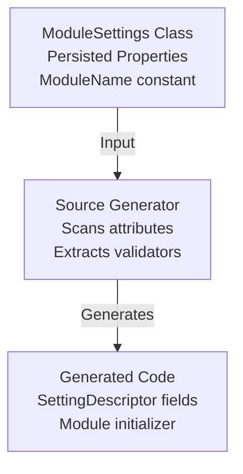

# Settings Descriptor Source Generator Specification

## Table of Contents

1. [Overview](#overview)
2. [Architecture](#architecture)
3. [Input Developer Code and Generated Output](#input-developer-code-and-generated-output)
4. [Generator Requirements](#generator-requirements)
5. [Error Handling](#error-handling)
6. [Testing Strategy](#testing-strategy)
7. [Future Enhancements](#future-enhancements)

## Overview

The Settings Source Generator automatically creates setting descriptors and registration code from properties marked with `[Persisted]` attributes, eliminating boilerplate and ensuring type safety between property declarations and their descriptors.

### Scope & Goals

- Generate typed `SettingDescriptor<T>` fields for all `[Persisted]` properties on `ModuleSettings` subclasses.
- Emit a single file-scoped assembly-level module initializer that registers descriptors for the entire assembly with `EditorSettingsManager.StaticProvider` at assembly load.
- Preserve Display/Category metadata and validation attributes so the app and UI can use them for display and validation.
- Surface helpful diagnostics for common misuses so developers can fix issues quickly.

## Architecture

### Design Principles

1. **Convention over Configuration**: Minimal attributes, maximum inference
2. **Type Safety**: Generated descriptors match property types exactly
3. **Immutability**: Descriptors registered once via module initializer at assembly load
4. **Zero Runtime Cost**: All code generation happens at compile time

### Component Diagram



### Non-goals & Constraints

- The generator does not change runtime serialization behavior - it only generates descriptors that rely on `EditorSettingsManager` at runtime. The generator will not register runtime converters automatically — converters must be registered with the manager or available globally.
- The generator will not process private/internal property accessors; properties with non-public accessors will be emitted but generate a warning and may not be persisted at runtime.
- The generator does not generate UI code nor localizable strings beyond preserving `Display` attributes supplied by the developer.

### Supported Serialization

The generator itself does not perform serialization; it generates descriptors that rely on runtime serialization infrastructure:

- **Runtime Serialization:** `EditorSettingsManager` uses `System.Text.Json` with `JsonSerializerOptions` to serialize and deserialize property values.
- **Type Requirements:** All `[Persisted]` property types must be serializable by `System.Text.Json`, either natively (primitives, standard collections) or via registered custom converters.
- **Custom Converters:** For types requiring custom converters (e.g., `Point`, `Size`), ensure converters are registered in `EditorSettingsManager.JsonSerializerOptions` before settings are saved or loaded.
- **Generator Role:** The generator validates that property types appear serializable and reports `OXGNPG103` if they clearly are not (e.g., delegates, open generics). It does not register converters.

## Input Developer Code and Generated Output

### Developer Code Example

```csharp
public sealed partial class ExampleSettings : ModuleSettings
{
    private new const string ModuleName = "Oxygen.Editor.Data.Example";

    public ExampleSettings() : base(ModuleName) { }

    [Persisted]
    [Display(Name = "Window Position", Description = "The position of the window")]
    [Category("Layout")]
    [PointBounds(0, int.MaxValue, 0, int.MaxValue, ErrorMessage = "Coordinates must be non-negative")]
    public Point WindowPosition { get; set; }

    [Persisted]
    [Display(Name = "Window Size")]
    [Category("Layout")]
    [SizeBounds(1, int.MaxValue, 1, int.MaxValue, ErrorMessage = "Dimensions must be positive")]
    public Size WindowSize { get; set; }
}
```

#### Developer Code Notes

- Make the class `partial` so generated code can merge correctly.
- The generator uses `private new const string ModuleName` to build typed `SettingKey<T>` constants. The name must be a compile-time constant string literal.
- Properties decorated with `[Persisted]` must be `public`, have both getter and setter, and be JSON serializable.

### Generated Code Example

#### File: `ExampleSettings.Generated.cs`

```csharp
// <auto-generated/>
using System.ComponentModel.DataAnnotations;
using System.Drawing;
using Oxygen.Editor.Data.Settings;

namespace Oxygen.Editor.Data.Models;

public sealed partial class ExampleSettings
{
    internal static class Descriptors
    {
        public static readonly SettingDescriptor<Point> WindowPosition = new()
        {
            Key = new SettingKey<Point>(ModuleName, nameof(WindowPosition)),
            DisplayName = "Window Position",
            Description = "The position of the window",
            Category = "Layout",
            Validators = new ValidationAttribute[]
            {
                new PointBoundsAttribute(0, int.MaxValue, 0, int.MaxValue)
                {
                    ErrorMessage = "Coordinates must be non-negative"
                }
            },
        };

        public static readonly SettingDescriptor<Size> WindowSize = new()
        {
            Key = new SettingKey<Size>(ModuleName, nameof(WindowSize)),
            DisplayName = "Window Size",
            Description = null,
            Category = "Layout",
            Validators = new ValidationAttribute[]
            {
                new SizeBoundsAttribute(1, int.MaxValue, 1, int.MaxValue)
                {
                    ErrorMessage = "Dimensions must be positive"
                }
            },
        };
    }
}

    file static class DescriptorsInitializer_{SanitizedAssemblyName}
{
    [System.Runtime.CompilerServices.ModuleInitializer]
    internal static void Initialize()
    {
        EditorSettingsManager.StaticProvider.Register(Oxygen.Editor.Data.Models.ExampleSettings.Descriptors.WindowPosition);
        EditorSettingsManager.StaticProvider.Register(Oxygen.Editor.Data.Models.ExampleSettings.Descriptors.WindowSize);
    }
}
```

#### File and namespace conventions

file static class DescriptorsInitializer_{SanitizedAssemblyName}

- Descriptors are nested in an `internal static class Descriptors` declared within the original partial class so they are discoverable by `ModuleSettings` at runtime.
- The module initializer is `file static` to avoid naming collisions and to make the generated registration run as soon as the assembly loads.

## Generator Requirements

### 1. Class Discovery

**Must:**

- Find all non-abstract classes inheriting from `ModuleSettings`
- Class must be `partial`
- Class must define `private new const string ModuleName`

#### Implementation details

- The incremental source generator inspects `TypeDeclarationSyntax` nodes and builds a semantic model to check for `ModuleSettings` derivation, `partial` modifier, and presence of `ModuleName` constant.
- The generator emits diagnostics on the syntax/semantic nodes so the errors/warnings appear in the IDE.

**Diagnostics:**

- Error if class not partial: `OXGNPG001: ModuleSettings class must be declared partial`
- Error if ModuleName missing: `OXGNPG002: Class must define 'private new const string ModuleName'`
- Error if ModuleName not const: `OXGNPG003: ModuleName must be a compile-time constant`

### 2. Property Scanning

**Must:**

- Find all properties with `[Persisted]` attribute
- Property must be public
- Property must have both getter and setter
- Property type must be serializable

#### Supported property shapes

- Primitive types (string, numeric, bool), structs (e.g., `Point`, `Size`) and collections such as `List<T>` (where T itself is serializable) are supported when `System.Text.Json` can (de)serialize them.
- If a type requires a custom converter, ensure converters are registered in `EditorSettingsManager` `JsonSerializerOptions` or use a serializer wrapper accepted by the manager.

**Diagnostics:**

- Warning if property not public: `OXGNPG101: [Persisted] property must be public`
- Warning if property read-only: `OXGNPG102: [Persisted] property must have a setter`
- Error if type not serializable: `OXGNPG103: Property type must be JSON-serializable`
- Error if `[Persisted]` is used on a property inside a nested `ModuleSettings` class: `OXGNPG104: Nested ModuleSettings classes are not supported`

### 3. Attribute Extraction

#### Display Attribute

```csharp
[Display(Name = "...", Description = "...")]
```

- Extract `Name` → `descriptor.DisplayName`
- Extract `Description` → `descriptor.Description`
- If missing: DisplayName = property name, Description = null

#### Category Attribute

```csharp
[Category("Layout")]
```

- Extract category string → `descriptor.Category`
- If missing: Category = null

#### Validation Attributes

```csharp
[Required(ErrorMessage = "...")]
[Range(1, 100, ErrorMessage = "...")]
[StringLength(50, MinimumLength = 5)]
[PointBounds(0, 1000, 0, 1000, ErrorMessage = "...")]
```

**Must:**

- Preserve all constructor parameters
- Preserve all property initializers (e.g., `ErrorMessage`)
- Generate as array: `new ValidationAttribute[] { ... }`
- Support multiple validators per property

#### Implementation details

- The generator mirrors validator construction by preserving constructor arguments and property initializers (e.g., `ErrorMessage`) into the generated `ValidationAttribute` initializer. It does not attempt to interpret validation semantics at generation time; validation occurs at runtime when `EditorSettingsManager` calls validators during `SaveSettingAsync`.

**Diagnostics:**

- Warning if validator has no parameters: `OXGNPG201: Validator with no constraints has no effect`

### 4. Descriptor Generation

**Rules:**

- Descriptor name = property name
- Descriptor type = `SettingDescriptor<T>` where T = property type
- Key module = `ModuleName` constant
- Key name = `nameof(PropertyName)`
- Descriptors nested in `internal static class Descriptors`

#### Additional descriptor rules

- Generated descriptors include `DisplayName`, `Description`, `Category` and `Validators` from attributes. If Display `Name` or `Description` is not present, the generator uses `nameof(property)` and null respectively.
- When creating the `SettingKey<T>` we generate `new SettingKey<T>(ModuleName, nameof(Property))` to be robust to refactoring.

**Type Mapping:**

```csharp
// Property type → Descriptor type
public string Name { get; set; }
→ SettingDescriptor<string> Name

public Point Position { get; set; }
→ SettingDescriptor<Point> Position

public List<string> Tags { get; set; }
→ SettingDescriptor<List<string>> Tags
```

### 5. Module Initializer Generation

**Must:**

- Create a file-scoped, assembly-unique static class: `file static class DescriptorsInitializer_{SanitizedAssemblyName}`
- Annotate with `[ModuleInitializer]`
- Register all descriptors with `EditorSettingsManager.StaticProvider.Register(...)`
- One initializer file per generated assembly

Implementation details

- The module initializer registers each generated `SettingDescriptor<T>` with `EditorSettingsManager.StaticProvider.Register(...)` so descriptors are available early in the app lifecycle.
- The generator avoids any runtime ordering assumptions: registration is idempotent and thread-safe thanks to `ConcurrentDictionary` usage in the provider.

**Example:**

```csharp
file static class DescriptorsInitializer_YourAssemblyName
{
    [System.Runtime.CompilerServices.ModuleInitializer]
    internal static void Initialize()
    {
        // One Register call per property
        EditorSettingsManager.StaticProvider.Register(ExampleSettings.Descriptors.WindowPosition);
        EditorSettingsManager.StaticProvider.Register(ExampleSettings.Descriptors.WindowSize);
    }
}
```

**Guarantees:**

- Initializer runs before `Main()` entry point
- Descriptors available before any application code runs
- Thread-safe registration via `ConcurrentDictionary`

## Error Handling

### Compilation Errors (Block Build)

The following errors prevent compilation and must be fixed:

- `OXGNPG001`: Class not partial
- `OXGNPG002`: ModuleName constant missing
- `OXGNPG003`: ModuleName not const
- `OXGNPG103`: Property type not serializable
- `OXGNPG104`: Nested ModuleSettings classes are not supported
- `OXGNPG999`: Generic generator failure (catch-all for unexpected errors)

### Warnings (Allow Build)

The following warnings allow compilation but indicate problematic code:

- `OXGNPG101`: Non-public [Persisted] property
- `OXGNPG102`: Read-only [Persisted] property (missing setter)
- `OXGNPG201`: Validator with no constraints has no effect

## Testing Strategy

The generator includes comprehensive test coverage to ensure correctness and catch regressions. Tests are located in `projects/Oxygen.Editor.Data/Generators/tests/`.

### Unit Tests

Generator unit tests use **Roslyn Source Generator test helpers** to validate the code generation pipeline:

**Test Files:**

- `RenderingTests.cs` — Verifies that generated code matches expected output for various property types and attribute combinations.
- `DiagnosticsTests.cs` — Validates that the generator reports correct diagnostics for invalid input.
- `ActivationTests.cs` — Confirms that the module initializer runs and registers descriptors correctly.

**Test Coverage:**

- Primitive types (string, int, bool, etc.)
- Complex types (Point, Size, collections)
- Multiple validators on a single property
- Display and Category attributes
- Generic types and parameterized collections
- Error conditions (non-partial classes, missing ModuleName, non-serializable types)
- Nested and invalid class hierarchies

### Integration Tests

Runtime integration tests verify the full pipeline:

- Descriptors are registered via the module initializer before application code runs.
- Registered descriptors are discoverable by `EditorSettingsManager`.
- Validator attributes are correctly executed during `SaveSettingAsync`.
- Custom `SettingKey<T>` instances match the generated descriptors.

**Test Execution:**

- Run generator tests with: `dotnet test projects/Oxygen.Editor.Data/Generators/tests/Oxygen.Editor.Data.Generators.Tests.csproj`
- Tests use MSTest framework and are integrated into CI/CD pipelines.

## Future Enhancements

The following enhancements are not currently implemented but have been identified as potential improvements for future versions:

### Quick-Fix Code Actions

**Goal:** Improve the developer experience when diagnostics are reported.

- **Partial Keyword:** When `OXGNPG001` is reported, provide a code fix suggestion to automatically add the `partial` keyword to the class declaration.
- **ModuleName Template:** When `OXGNPG002` is reported, suggest inserting a template line: `private new const string ModuleName = "Your.Module.Name";`

### Custom Converter Auto-Registration

**Goal:** Streamline setup for types requiring custom JSON converters.

Currently, custom `JsonConverter` instances must be manually registered with `EditorSettingsManager.JsonSerializerOptions` at runtime. Future versions could:

- Introduce an attribute to mark converter classes for auto-registration.
- Generate registration code in the module initializer.
- Support common types (e.g., `Point`, `Size`, `Vector`) with built-in converters.
