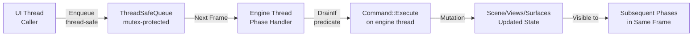
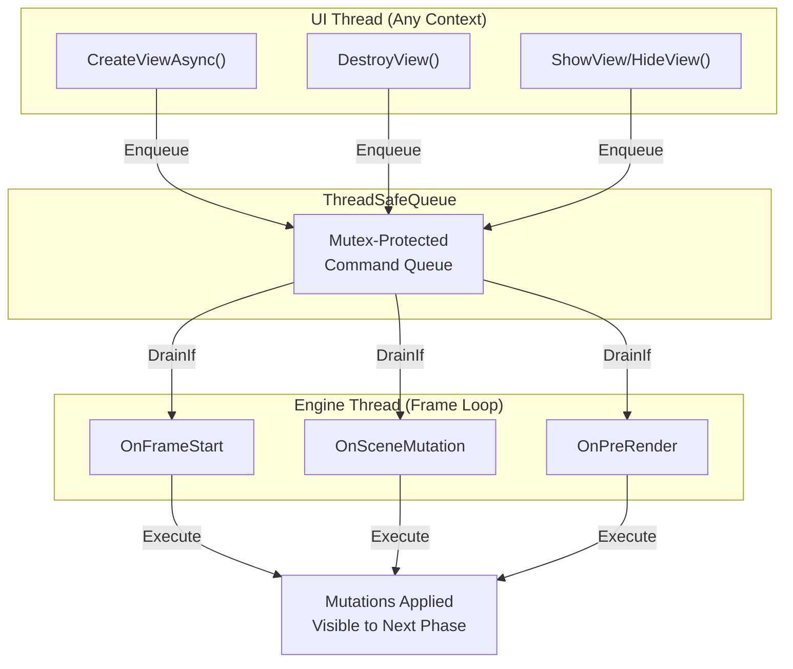

# EditorModule Refactor - Architecture Design

**Version:** 2.1
**Date:** December 7, 2025
**Status:** ✅ Implementation On Track

---

## Executive Summary

This document outlines a comprehensive refactoring of the `EditorModule` to address critical design flaws that cause crashes with multiple surfaces and create maintenance nightmares. The refactored design follows best practices from the MultiView example, introducing clear separation of concerns, explicit lifecycle management, and robust resource handling.

### Current Problems

1. **Monolithic Design**: All view/surface/rendering logic crammed into EditorModule
2. **Unclear Ownership**: Resources scattered across multiple maps with no clear lifecycle
3. **Fragile State Management**: Camera, framebuffer, and view registration mixed together
4. **No View Abstraction**: Views don't exist as first-class entities
5. **Brittle Multi-Surface**: Single shared RenderGraph breaks with multiple surfaces
6. **Implicit Cleanup**: Resource release hidden in scattered cleanup code

### Solution Overview

Introduce **four core abstractions** with clear responsibilities:

- **`EditorView`** - First-class view entity with offscreen rendering resources
- **`ViewRenderer`** - Per-view rendering encapsulation (render passes + graph)
- **`ViewManager`** - Centralized view lifecycle and surface association coordinator
- **`EditorCompositor`** - Surface backbuffer management and composition orchestration

---

## Command System Architecture

The refactored EditorModule uses a **deferred command execution model** to safely coordinate surface/view/scene mutations across thread boundaries and frame phases. This solves a critical problem: the Interop layer (running on the UI thread) must communicate mutations to the engine (running on the engine thread) in a thread-safe, frame-synchronized manner.

### Command Concept

An `EditorCommand` is a deferred mutation operation that:

1. **Encapsulates state change** - Contains all data needed to perform a mutation
2. **Targets a specific phase** - Executes only during its designated frame phase
3. **Executes on engine thread** - Called from within the engine's frame loop
4. **Has no blocking overhead** - Enqueuing is fast; actual work deferred to safe time

### Command Lifecycle



### Phase-Specific Execution

Each command specifies its target phase and is executed only during that phase. The engine drains commands phase-by-phase using predicates:

**Available phases:**

- **`kFrameStart`** - Immediate frame bookkeeping (view creation, destruction, visibility toggle)
- **`kSceneMutation`** - Scene graph changes (node creation, removal, parenting, transform)
- **Future: `kPreRender`, `kCompositing`** - Specialized phases for rendering-specific operations

**Execution ordering within a phase:**

For `kFrameStart`, commands are drained in strict order to prevent race conditions:

1. Destroy commands first (release resources early)
2. Create commands next (reuse released resources)
3. All remaining FrameStart commands

For `kSceneMutation` and other phases, commands are drained in FIFO order matching their insertion sequence.

### Thread Safety Model



**Benefits:**

- ✅ No locks held during command execution
- ✅ No race conditions (commands execute on single thread)
- ✅ Deterministic ordering (FIFO per phase)
- ✅ Caller doesn't block (enqueue is fast)
- ✅ Frame-safe (mutations at well-defined points)

### CommandContext

Every command receives a `CommandContext` during execution containing the scene and future subsystems:

**Critical note:** Pointers in `CommandContext` are volatile (only valid during `Execute()`). Commands must not store pointers beyond their `Execute()` method to prevent dangling pointers if resources are destroyed between frames.

### Built-in Commands

The command system provides a comprehensive set of commands for view and scene graph management:

#### View Management Commands

| Command | Phase | Purpose |
|---------|-------|---------|
| `CreateViewCommand` | kFrameStart | Create new view and register with engine |
| `DestroyViewCommand` | kFrameStart | Destroy view and schedule deferred GPU cleanup |
| `ShowViewCommand` | kSceneMutation | Make hidden view visible and register with FrameContext |
| `HideViewCommand` | kSceneMutation | Make visible view hidden and unregister from FrameContext |

#### Scene Graph Mutation Commands

| Command | Phase | Purpose |
|---------|-------|---------|
| `CreateSceneNodeCommand` | kSceneMutation | Create new scene node with optional callback for native handle |
| `RemoveSceneNodeCommand` | kSceneMutation | Remove scene node from tree and clean up |
| `ReparentSceneNodeCommand` | kSceneMutation | Change parent of a node with optional world transform preservation |
| `RenameSceneNodeCommand` | kSceneMutation | Rename a scene node |
| `SetLocalTransformCommand` | kSceneMutation | Update position, rotation, and scale of a node |
| `UpdateTransformsForNodesCommand` | kSceneMutation | Batch update transforms for multiple nodes |

#### Scene Content Commands

| Command | Phase | Purpose |
|---------|-------|---------|
| `CreateBasicMeshCommand` | kSceneMutation | Create basic geometric shapes (cube, sphere, plane, etc.) |
| `SetVisibilityCommand` | kSceneMutation | Toggle node visibility in scene rendering |

### Command Extension Pattern

Custom domain-specific commands can be implemented by inheriting from `EditorCommand`:

- Specify target phase in constructor
- Implement mutation logic in `Execute(CommandContext&)`
- Enqueue via `editor_module->Enqueue()`
- Execute synchronously during target phase
- Results immediately visible to subsequent phases

Example use case: Creating a custom game object with specific components, applying batch physics updates, or custom editor operations.

---

## Architectural Principles

### 1. Separation of Concerns

```text
EditorModule (Frame Lifecycle Orchestrator)
    ├── ViewManager (View Lifecycle & Association)
    │   └── EditorView[] (Offscreen Rendering Resources)
    │       └── ViewRenderer (Per-View Rendering)
    ├── EditorCompositor (Backbuffer Management & Composition)
    ├── SurfaceRegistry (Surface Lifecycle - UNCHANGED)
    └── Scene/Commands (Scene Management - UNCHANGED)
```

### 2. Explicit Lifecycle States

Every view progresses through well-defined states:

```cpp
enum class ViewState {
    kCreating,      // Resources being allocated
    kReady,         // Fully initialized, can render
    kHidden,        // Not rendering but resources retained
    kReleasing,     // Resources being freed
    kDestroyed      // Fully cleaned up
};
```

### 3. Phase-Specific Responsibilities

| Phase | EditorModule | ViewManager | EditorView | EditorCompositor |
|-------|--------------|-------------|------------|------------------|
| **FrameStart** | Drain kFrameStart commands (destroy → create → other), process surface lifecycle, make FrameContext available to ViewManager | OnFrameStart receives FrameContext, registers views; FinalizeViews applies visibility state updates | N/A | Update backbuffer framebuffers for resized surfaces |
| **SceneMutation** | Drain kSceneMutation commands, set scene | Register/update active views with FrameContext | Update camera, create offscreen resources | N/A |
| **PreRender** | Coordinate view preparation | N/A | Configure renderer with offscreen textures | N/A |
| **Render** | N/A | N/A | N/A (handled by Renderer) | N/A |
| **Compositing** | Orchestrate composition, mark surfaces presentable | N/A | Provide offscreen textures for composition | Blit view textures to surface backbuffers |

### 4. Resource Ownership Model

```text
EditorView owns:
    - ViewRenderer (rendering state)
    - Camera SceneNode (scene entity)
    - Offscreen render textures (color, depth)
    - Offscreen framebuffer (render target)
    - ViewId (registration token)

ViewManager owns:
    - Collection of EditorView instances
    - View-to-Surface associations
    - View visibility state
    - Transient frame context (only during OnFrameStart)

EditorCompositor owns:
    - Surface backbuffer framebuffers (one per surface)
    - Backbuffer depth textures (for surfaces needing depth)
    - Composition command recording
    - Resource state transitions for backbuffers

EditorModule owns:
    - ThreadSafeQueue<EditorCommand> (command queue)
    - ViewManager
    - EditorCompositor
    - Scene
    - SurfaceRegistry reference
```

---

## Core Components

### 1. EditorView

**Responsibility**: Encapsulate all state and resources for a single view.

**Key Features:**

- Owns camera, textures, framebuffer, and per-view renderer
- Explicit lifecycle states (Creating → Ready → Hidden → Releasing → Destroyed)
- Phase hooks that align with frame execution: Initialize, OnSceneMutation, OnPreRender, Composite
- Deferred GPU resource cleanup (safely scheduled, not immediate)
- Customizable render graphs (shared or dedicated)

**Key Design Decisions:**

- **Self-contained offscreen resources**: Views own only their offscreen render targets (color, depth textures and framebuffer)
- **Context-based initialization**: Rendering context provided to views with Graphics/Recorder/Surface references (RAII-friendly pattern)
- **Phase pointer safety**: Phase-specific pointers (like CommandRecorder) cleared after their phase to prevent misuse
- **Explicit state machine**: ViewState enum tracks lifecycle progression through well-defined states
- **Deferred cleanup**: GPU resources scheduled for safe deletion, never destroyed immediately during frame
- **Render graph flexibility**: Render graphs can be shared across views or per-view customized
- **Autonomous self-registration**: Views self-register with FrameContext during OnSceneMutation phase, getting ViewId assigned by engine

### 2. ViewRenderer

**Responsibility**: Encapsulate per-view rendering logic (passes + graph execution).

**Key Features:**

- Owns and manages render passes (DepthPrePass, ShaderPass, TransparentPass)
- Persistent pass objects created once and reused every frame
- Configurable with textures and rendering parameters
- Registers resolver (to get camera) and render graph factory with engine Renderer

**Key Design Decisions:**

- **Pass lifecycle**: Create render passes once during configuration, reuse every frame (avoids allocation overhead)
- **Configuration stability**: Offscreen textures can be updated (e.g., on surface resize), but pass objects persist
- **Registration tracking**: Tracks where the renderer is registered for clean deregistration
- **Graph execution**: Executes either default passes or custom render graph via factory

### 3. EditorCompositor

**Responsibility**: Manage surface backbuffer framebuffers and orchestrate composition of views to surfaces.

**Key Features:**

- Owns framebuffers wrapping swapchain backbuffers (one per surface per swapchain image)
- Provides composition utility operations: fullscreen blitting and regional blitting
- Manages backbuffer resource state transitions (CopyDest → Present)
- Tracks backbuffer framebuffer lifecycle

**Key Design Decisions:**

- **Surface-centric ownership**: Owns framebuffers and resources associated with each surface's backbuffer
- **Composition operations**: Stateless utility methods for blitting view textures to backbuffer regions
- **Resource state management**: Handles necessary state transitions and synchronization for backbuffer resources
- **Stateless logic**: Composition methods are simple and state-independent, allowing reuse across different scenarios
- **Follows MultiView pattern**: Integrates the OffscreenCompositor concept but as an owned component within EditorModule

### 4. ViewManager

**Responsibility**: Coordinate view lifecycle, surface associations, and visibility.

**Key Features:**

- Centralized view registry as single source of truth
- Bidirectional view ↔ surface mapping for efficient lookups
- Visibility management (show/hide while retaining resources)
- Bulk cleanup operations (e.g., when surface is invalidated)
- Thread-safe operations (views can be created from any thread)

**Key Design Decisions:**

- **Centralized registry**: Single authoritative source for all view information
- **Thread Safety**: Protected by internal mutex to allow operations from non-engine threads
- **Persistent ViewIds**: ViewIds are stable and map 1:1 to Engine ViewIds
- **Bidirectional mapping**: Fast lookups in both directions (view→surface and surface→views)
- **Hidden vs destroyed**: Distinguished states allow resource retention for hidden views, cleanup for destroyed views
- **Async creation**: `CreateViewAsync()` with callback allows non-blocking view creation from Interop layer

---

## Refactored EditorModule

**Responsibility**: Orchestrate frame lifecycle phases and delegate specialized operations to subsystems. Acts as the command hub for thread-safe mutations from the Interop layer.

**Key Features:**

- Implements EngineModule interface with phase-specific hooks (OnFrameStart, OnSceneMutation, OnPreRender, OnRender, OnCompositing)
- Owns ThreadSafeQueue for deferred command execution
- Manages surface lifecycle (registration, resizing, destruction)
- Coordinates view lifecycle through ViewManager
- Orchestrates composition through EditorCompositor
- Provides public API for Interop layer (CreateViewAsync, DestroyView, ShowView, HideView, Enqueue, etc.)
- Manages scene and command queue
- Enables thread-safe mutations via command system

**New Responsibilities** (vs current design):

- Orchestrate frame lifecycle phases
- Drain and execute commands in phase-specific order
- Provide command queueing for thread-safe mutations
- Coordinate ViewManager lifecycle (OnFrameStart, FinalizeViews)
- Delegate to ViewManager for view operations
- Manage surface lifecycle (unchanged)
- Provide public API to Interop layer

**Removed Responsibilities** (delegated):

- Direct camera management → EditorView
- Direct render graph management → ViewRenderer
- Direct view-to-surface tracking → ViewManager
- Direct backbuffer management → EditorCompositor

---

## Registration Orchestration

### Understanding Registration Responsibilities

Registration happens at **two levels** with **clear orchestration**:

#### 1. FrameContext Registration (View Identification)

**Initial Registration (OnFrameStart):**

- **Who:** `CreateViewCommand::Execute()` calls `ViewManager::CreateViewNow()`
- **When:** During `OnFrameStart` phase (while FrameContext is active)
- **What:** Immediately registers view with FrameContext and gets initial `ViewId`
- **Result:** View tracked by engine with ViewId, viewport, and scissor rect

**Per-Frame Updates (OnSceneMutation):**

- **Who:** `EditorView` via `view->OnSceneMutation()`
- **When:** During `OnSceneMutation()` phase on every frame
- **What:** Calls `frame_context.UpdateView()` to refresh viewport, scissor, and visibility state
- **Result:** Engine has latest view parameters for rendering

#### 2. Renderer Registration (Render Hooks)

- **Who:** `EditorModule` orchestrates, `EditorView` executes via `ViewRenderer`
- **When:** During `OnSceneMutation()` after view's per-frame update
- **What:** EditorModule calls `view->RegisterViewForRendering(renderer)` which delegates to `ViewRenderer::RegisterWithEngine()`
- **Result:** Renderer has resolver lambda (to get camera) and render graph factory

#### Key Flow Sequence

1. **OnFrameStart**: `CreateViewCommand` executes → `CreateViewNow()` → Initial FrameContext registration (gets ViewId)
2. **OnSceneMutation**: For each registered view → `UpdateView()` with current viewport/scissor
3. **OnSceneMutation**: For each registered view → `RegisterViewForRendering()` (renderer hooks)
4. **OnRender**: Renderer calls resolver to get camera, executes render graph to offscreen texture
5. **OnCompositing**: Compositor blits offscreen textures to surface backbuffers

#### Why This Pattern?

- **Separation of Concerns**: FrameContext manages view identity/viewport, Renderer manages rendering hooks
- **Orchestration Clarity**: EditorModule drives the sequence but doesn't do the work
- **View Autonomy**: Views control their own registration and update details
- **Phase Safety**: Operations occur in correct phases with valid context
- **Testability**: Each step can be tested independently
- **Thread Safety**: Command system allows UI thread to queue operations without blocking

---

## Data Flow & Interactions

### View Creation Flow

```text
[UI Thread] → editor_module->CreateViewAsync(config, callback)
    ↓ Enqueues CreateViewCommand with target phase = kFrameStart
    ↓ Returns immediately

--- Next Frame: OnFrameStart Phase ---

[Engine Thread] EditorModule::OnFrameStart()
    ↓ Make FrameContext available to ViewManager (OnFrameStart call)
    ↓ Drain kFrameStart commands (destroy → create → other)
    ↓ CreateViewCommand::Execute() runs on engine thread
    ↓
[EditorModule] → ViewManager::CreateViewNow()
    ↓
[ViewManager] → new EditorView(config) → ViewId assigned
    ↓
[EditorView] → state = kCreating
    ↓ RegisterView(FrameContext) called immediately
    ↓ ViewId registered with FrameContext (engine tracks view)
    ↓
[EditorModule] ViewManager::FinalizeViews() (after command draining)
    ↓ Clears transient FrameContext reference
    ↓
[Callback invoked on engine thread] callback(true, view_id)
    ↓ Returns to Interop, which marshals result to UI thread

--- Same Frame: OnSceneMutation Phase ---

[EditorModule] → Drain kSceneMutation commands
    ↓
[EditorModule] → ViewManager::GetAllRegisteredViews()
    ↓
[For each visible view] → EditorView::SetRenderingContext(ctx)
    ↓ Provides frame context, graphics, and recorder
    ↓
[EditorView] → EditorView::Initialize(scene) // First time only
    ↓ Creates camera node, positions it
[EditorView] → EditorView::OnSceneMutation() // Every frame
    ↓ Updates camera viewport/aspect
    ↓ Creates offscreen render textures (if needed)
    ↓ Creates offscreen framebuffer (if needed)
    ↓ RegisterView() or UpdateView() with FrameContext
    ↓ Registers resolver lambda with Renderer
    ↓ state = kReady
[EditorView] → EditorView::ClearPhaseRecorder() // After mutation phase
    ↓ Clears recorder pointer (no longer valid)

--- Same Frame: OnPreRender Phase ---

[EditorModule] EnsureFramebuffers() → Compositor creates backbuffer framebuffers
    ↓
[EditorModule] → ViewManager::GetAllRegisteredViews()
    ↓
[For each view] → EditorView::OnPreRender(renderer)
    ↓ Configure ViewRenderer with offscreen textures
```

### Rendering Flow (Per Frame)

```text
OnFrameStart:
    [EditorModule] Make FrameContext available to ViewManager
    [EditorModule] Drain kFrameStart commands
        [CreateViewCommand::Execute()] → Create view, register with FrameContext
        [DestroyViewCommand::Execute()] → Destroy view, release resources
        [ShowViewCommand::Execute() // if targeting kFrameStart]
        [HideViewCommand::Execute() // if targeting kFrameStart]
    [EditorModule] ViewManager::FinalizeViews() (clears FrameContext ref)
    [EditorModule] Process surface lifecycle (registration, destruction, resize)
        [Compositor] → ReleaseSurfaceResources(resized_surface)
        [Surface] → Resize()
        [ViewManager] → OnSurfaceResized() (notify views)
    [EditorModule] Set scene in FrameContext
    [EditorModule] SyncSurfacesWithFrameContext (add/remove surfaces)

OnSceneMutation:
    [EditorModule] Drain kSceneMutation commands
        [Custom SceneNodeCommand::Execute()] → Mutate scene graph
        [ShowViewCommand::Execute() // if targeting kSceneMutation]
        [HideViewCommand::Execute() // if targeting kSceneMutation]
    [EditorModule] → For each registered view:
        [EditorView] → SetRenderingContext(ctx with FrameContext, graphics)
        [EditorView] → Initialize(scene) // First time only
        [EditorView] → OnSceneMutation()
            - Update camera
            - Ensure offscreen resources (textures, framebuffer)
            - RegisterView() or UpdateView() with FrameContext
            - Register resolver + graph with Renderer
        [EditorView] → ClearPhaseRecorder()

OnPreRender:
    [EditorModule] EnsureFramebuffers()
        [Compositor] Create backbuffer framebuffers for all surfaces
    [EditorModule] → For each registered view:
        [EditorView] → SetRenderingContext(ctx)
        [EditorView] → OnPreRender(renderer)
            [ViewRenderer] → Configure(offscreen_color_tex, offscreen_depth_tex)
        [EditorView] → ClearPhaseRecorder()

OnRender:
    [Engine Renderer] → For each registered view:
        Calls resolver lambda → gets camera node
        Calls render graph factory →
            [ViewRenderer::Render()] executes passes to offscreen textures
            Results: View color and depth textures populated

OnCompositing:
    [EditorModule] → Compositor::OnCompositing()
        [Compositor] → For each surface:
            Get backbuffer framebuffer from current swapchain slot
            Acquire command recorder
            TrackBackbufferFramebuffer(recorder, framebuffer)
            [EditorModule] → For each view targeting this surface:
                [EditorView] → Composite(recorder, backbuffer_viewport)
                    [Compositor] → CompositeToRegion() or CompositeFullscreen()
                        Blit view's offscreen color texture → backbuffer region
            TransitionBackbufferToPresent(recorder, backbuffer)
    [EditorModule] Mark surfaces presentable
```

### View Destruction Flow

```text
[UI Thread] → editor_module->DestroyView(view_id)
    ↓ Enqueues DestroyViewCommand with target phase = kFrameStart
    ↓ Returns immediately

--- Next Frame: OnFrameStart Phase ---

[Engine Thread] EditorModule::OnFrameStart()
    ↓ Make FrameContext available to ViewManager
    ↓ Drain kFrameStart commands (destroy commands processed first)
    ↓ DestroyViewCommand::Execute() runs on engine thread
    ↓
[ViewManager] → Lookup view by view_id
    ↓
[EditorView] → ReleaseResources()
    ↓ state = kReleasing
    ↓ UnregisterFromFrameContext()
    ↓ UnregisterFromRenderer() (remove resolver/graph from Renderer)
    ↓ Schedule deferred GPU resource release (textures, framebuffer)
    ↓ Detach camera from scene
    ↓ state = kDestroyed
    ↓
[ViewManager] → Mark view for removal in destroyed_views_ set
    ↓
[EditorModule] ViewManager::FinalizeViews()
    ↓ Processes destroyed views and removes them from registry
    ↓ std::unique_ptr<EditorView> destroyed (entry removed)
    ↓ GPU resources released (on next frame when in-flight work completes)
```

---

## Multi-Surface Scenarios

### Scenario 1: Three Panels (Left, Center, Right)

```cpp
// Interop creates three views
auto left_view = editor_module->CreateView("LeftPanel", "scene_view");
auto center_view = editor_module->CreateView("CenterPanel", "main_view");
auto right_view = editor_module->CreateView("RightPanel", "debug_view");

// Attach to surfaces
editor_module->AttachViewToSurface(left_view, left_surface);
editor_module->AttachViewToSurface(center_view, center_surface);
editor_module->AttachViewToSurface(right_view, right_surface);

// Each view:
// - Has its own camera positioned differently
// - Renders to its own offscreen texture
// - Composites to its assigned surface's backbuffer
// - Uses default solid render graph
```

### Scenario 2: PiP + Wireframe Overlay

```cpp
// Main view
auto main_view = editor_module->CreateView("MainView", "editor");
editor_module->AttachViewToSurface(main_view, main_surface);

// PiP wireframe in top-right corner
auto pip_view = editor_module->CreateView("PiPView", "wireframe_pip");
editor_module->AttachViewToSurface(pip_view, main_surface); // Same surface!

// Custom render graph for wireframe
auto wireframe_graph = std::make_shared<WireframeRenderGraph>();
editor_module->SetViewRenderGraph(pip_view, wireframe_graph);

// Compositing phase:
// - main_view composites fullscreen
// - pip_view composites to top-right region (25% size)
// Both views write to the same surface backbuffer
```

### Scenario 3: Surface Resize

```text
[Surface Resize Detected in OnFrameStart]
    ↓
[EditorModule] Process resize via SurfaceRegistry
    ↓
[EditorModule] Clear surface_framebuffers_[surface]
    ↓
[EditorModule] Surface->Resize()
    ↓
[ViewManager] Get views for resized surface
    ↓
[For each view] → EditorView::OnSceneMutation()
    ↓ Detects size mismatch
    ↓ Releases old textures/framebuffer (deferred)
    ↓ Creates new textures matching new size
    ↓ Updates camera aspect ratio
    ↓ state remains kReady
```

---

## Key Improvements Over Old Design

| Aspect | Current | Refactored |
|--------|---------|------------|
| **View Concept** | None - views implicit in surface mapping | `EditorView` first-class entity |
| **Resource Ownership** | Scattered maps, unclear lifecycle | Clear ownership: Views (offscreen), Compositor (backbuffers) |
| **Multi-Surface** | Shared RenderGraph, breaks | Per-view ViewRenderer + Compositor, scales |
| **Lifecycle** | Implicit cleanup in scattered code | Explicit states + phase hooks |
| **Compositing** | Direct to backbuffer in Render | Offscreen render + Compositor blits in Compositing phase |
| **Backbuffer Management** | Mixed with view logic | Centralized in EditorCompositor |
| **Flexibility** | Single global graph | Per-view customizable graphs |
| **Testability** | Monolith, hard to test | Components easily mockable |
| **Maintenance** | 700-line God class | Clean separation, 4 focused components |

---

## Document References

This architecture is part of a comprehensive design suite:

- **Architecture Design** (this document) - Overall structure, components, and patterns
- **Flow Diagrams** - Lifecycle flows, phase diagrams, and sequence interactions
- **API Specification** - Public API methods, examples, and migration guide
- **Extensibility Guide** - Future enhancements and implementation patterns
- **Design Summary** - Executive overview and implementation status
