# EditorModule Refactor - Flow Diagrams

**Version:** 2.0
**Date:** December 6, 2025
**Status:** ✅ Implementation Complete

---

## 1. View Lifecycle State Machine

---

## 2. Frame Lifecycle - Phase by Phase

### OnFrameStart Phase

### OnSceneMutation Phase

### OnPreRender Phase

### OnRender Phase

```mermaid
sequenceDiagram
    participant EM as EditorModule
    participant VM as ViewManager
    participant FC as FrameContext
    participant R as Renderer
    participant VR as ViewRenderer

    Note over EM: PHASE: Render

    EM->>FC: GetSurfaces()
    FC-->>EM: surfaces[]

    loop For each surface
        EM->>EM: Get cached framebuffer[backbuffer_index]

        EM->>VM: GetViewsForSurface(surface)
        VM-->>EM: view_ids[]

        loop For each view_id
            EM->>FC: SetViewOutput(view_id, framebuffer)
        end
    end

    Note over R: Renderer now executes for each registered view

    loop For each registered ViewId
        R->>R: Call resolver → get camera
        R->>R: Prepare scene frame
        R->>VR: Call graph_factory(view_id, render_ctx, recorder)
        VR->>VR: Execute passes (depth, shader, transparent)
        VR-->>R: Complete
    end
```

### OnCompositing Phase

---

## 3. Multi-Surface Scenario: Three Editor Panels

**Key Points:**

- Each view has independent camera, resources, and renderer
- Each view renders to its own offscreen texture
- Each view composites fullscreen to its assigned surface
- Views can have different render graphs (wireframe vs solid)

---

## 4. PiP Scenario: Main View + Wireframe Overlay

**Key Points:**

- Two views attached to same surface
- Compositing happens in order (main first, PiP overlays)
- PiP uses smaller offscreen resolution (optimization)
- Each view has different camera position and render graph

---

## 5. Surface Resize Flow

---

## 6. View Destruction Flow

---

## 7. View Visibility Control (Register/Unregister)

> **Note:** The implementation uses `RegisterView()`/`UnregisterView()` for visibility control, not separate `ShowView()`/`HideView()` methods.

**Key Points:**

- Unregistered views keep all resources (textures, framebuffer, camera)
- Unregistered views are NOT included in rendering pipeline
- Register/Unregister is fast - no resource allocation/deallocation
- Use for temporary visibility toggles (debug overlays, etc.)

---

## 8. Resource State Tracking (Compositor)

**Critical Pattern:**

1. **Begin tracking** - Tell recorder initial state when first touching resource
2. **Require state** - Transition to needed state (insert barriers)
3. **Flush barriers** - Execute transitions before operation
4. **Perform operation** - Copy, render, etc.
5. **Restore state** - Return to neutral state for next frame
6. **Flush again** - Ensure restoration complete

This prevents stale state assumptions across frames!

---

## 9. View Creation → Destruction Lifecycle

**Timeline Events:**

- **Frame 0**: CreateView() called, state=kCreating
- **Frame 1**: Initialize() + OnSceneMutation(), state=kReady, rendering starts
- **Frame 5**: HideView(), unregister from FC/Renderer, keep resources
- **Frame 7**: ShowView(), re-register with FC/Renderer, resume rendering
- **Frame 10**: DestroyView(), unregister, schedule GPU deferred release, state=kReleasing
- **Frame 11**: ProcessDestroyedViews(), EditorView destroyed

---

## Summary

These flow diagrams illustrate:

✅ **Clear phase responsibilities** - Each phase has specific tasks
✅ **Explicit state transitions** - No implicit state changes
✅ **Resource lifecycle** - From creation through deferred destruction
✅ **Multi-surface coordination** - Multiple views and surfaces interact cleanly
✅ **Compositing pattern** - Offscreen render + blit to backbuffer
✅ **Error resilience** - Graceful handling of surface/view invalidation

All flows follow the proven patterns from MultiView while supporting the editor's dynamic view management requirements.
