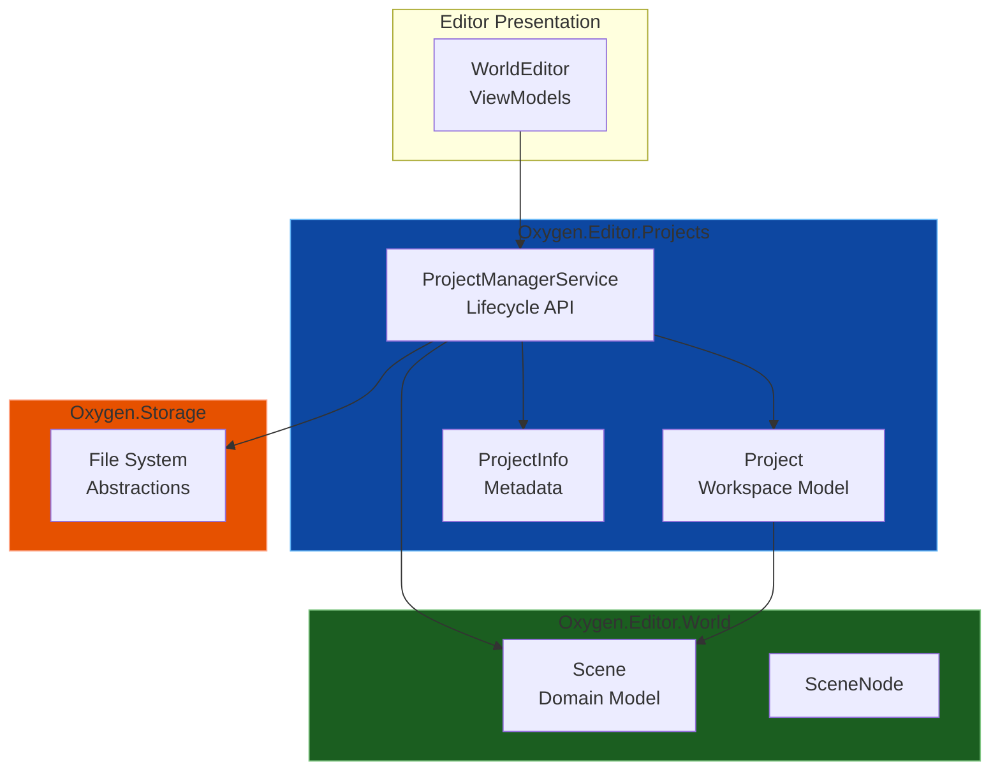
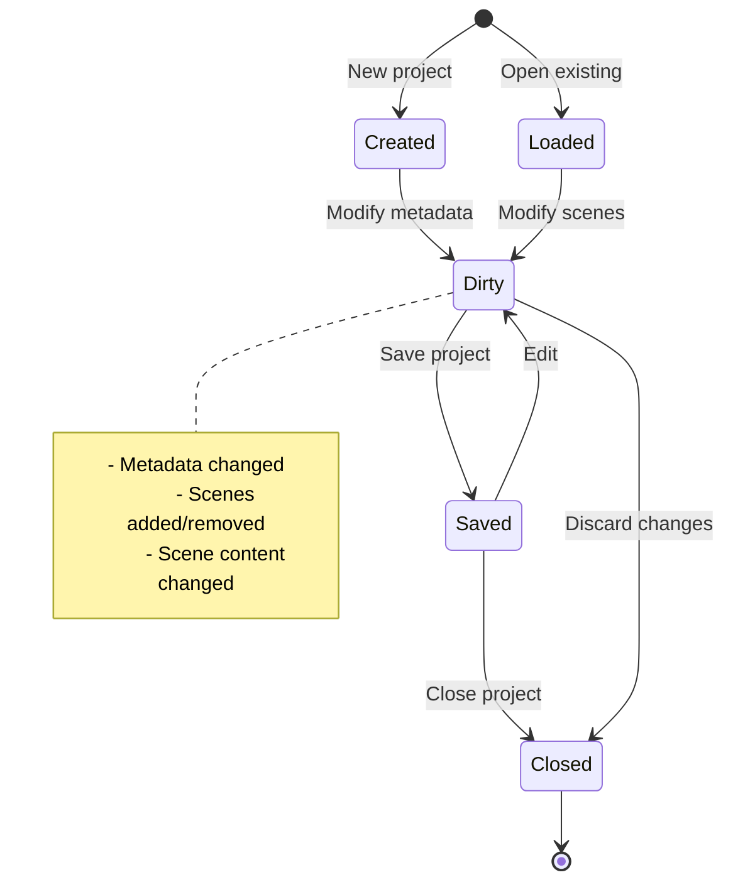

# Oxygen.Editor.Projects

## Overview

The **Oxygen.Editor.Projects** module provides workspace and project file management for the Oxygen Editor. It handles loading and saving project metadata (`Project.oxy`), discovering scene files, and orchestrating persistence of editor world scenes to disk.

This module sits **above** the `Oxygen.Editor.World` domain model, providing file I/O, project lifecycle management, and workspace-level operations.

## Purpose

The Projects module exists to:

1. **Manage Project Manifest** - Load and save `Project.oxy` (project metadata)
2. **Persist Scenes** - Serialize/deserialize world scenes to/from scene JSON files
3. **Track Project Metadata** - Project name, category, thumbnail, last-used time, mount points
4. **Provide Lifecycle APIs** - High-level service for project operations
5. **Enable Multi-Scene Projects** - Discover and manage scene files within a project folder

## Technology Stack

| Technology | Version | Purpose |
| ---------- | ------- | ------- |
| **.NET** | 9.0 (Windows 10.0.26100.0) | Target framework |
| **C#** | 13 (preview) | Language with nullable reference types |
| **System.Linq.Async** | Latest | Async LINQ operations |
| **Microsoft.Extensions.Logging** | Latest | Logging abstractions |

## Architecture

### Module Relationships



### Core Components

| Component | Purpose | Key Responsibilities |
| --------- | ------- | -------------------- |
| **`ProjectManagerService`** | High-level project API | Create, open, save, close projects |
| **`Project`** | Workspace model | Metadata, scene references, serialization |
| **`ProjectInfo`** | Project metadata | Name, version, author, timestamps |
| **`IProjectManagerService`** | Service interface | Abstraction for DI and testing |

## Core Concepts

### Project Structure

An **Oxygen Project** is a workspace containing:

```text
Project.oxy            ← Project manifest (metadata + mount points)
├── Scenes/
│   ├── Main.scene       ← Scene files
│   ├── Menu.scene
│   └── Level1.scene
├── Assets/                   ← (Future: Assets, prefabs, etc.)
└── ProjectSettings/          ← (Future: Build settings, etc.)
```

**Project Manifest** (`Project.oxy`):

- Project-wide metadata (name, version, author)
- Unique project ID (GUID)
- Authoring mount points (`AuthoringMounts`: `Name` + project-relative `RelativePath`)

Notes:

- Scene files are **discovered** by enumerating the `Scenes/` folder (currently `*.scene`). They are not listed in `Project.oxy`.
- `AuthoringMounts` are persisted in `Project.oxy` and define project-local authoring mounts (e.g., `Content -> Content/`).

### Project Lifecycle



### ProjectManagerService Responsibilities

1. **Project Creation**
   - Generate new project with metadata
   - Create initial scene
   - Save to disk

2. **Project Loading**
   - Deserialize `.oxyproj` file
   - Validate project structure
   - Discover scene files

3. **Scene Management**
   - Load scenes from JSON
   - Save scenes to JSON
   - Track open/active scenes

4. **Persistence**
   - Save project metadata
   - Save individual scenes
   - Handle save-all operations

## File Formats

### Project File Format

**File Name**: `Project.oxy`

```json
{
  "Id": "8f2b2b16-3a4a-4f39-9f2c-2d9f3a1b2c3d",
  "Name": "MyGame",
  "Category": "C44E7604-B265-40D8-9442-11A01ECE334C",
  "Thumbnail": "Media/Preview.png",
  "AuthoringMounts": [
    {
      "Name": "Content",
      "RelativePath": "Content"
    }
  ]
}
```

- `Id` - Non-empty GUID (project identity)
- `Name` - Project display name
- `Category` - Project category identifier
- `Thumbnail` - Optional project thumbnail path
- `AuthoringMounts` - Authoring mounts (`Name` + project-relative `RelativePath`)

**Compatibility:**

- If `AuthoringMounts` is missing/empty, the loader defaults it to a single mount: `Content -> Content`.

### Scene File Format

Scene files are JSON and are serialized/deserialized by `Oxygen.Editor.World.Serialization.SceneSerializer`.
This module treats scenes as **lazy-loaded**:

- Project load discovers scene files and loads minimal scene metadata.
- `LoadSceneAsync` loads the full scene graph (nodes/components).

See [World README](../Oxygen.Editor.World/README.md).

## Usage

### Loading an Existing Project

```csharp
var service = serviceProvider.GetRequiredService<IProjectManagerService>();

// 1) Load project metadata (Project.oxy) from a project folder
var projectInfo = await service.LoadProjectInfoAsync(
  projectFolderPath: @"C:\Projects\MyGame",
  cancellationToken: ct);

// 2) Load the project and discover scene files
var ok = await service.LoadProjectAsync(projectInfo!);
var project = service.CurrentProject;
```

### Loading Scenes

```csharp
// Scenes are discovered on project load.
var scene = project!.Scenes[0];

// Load full scene graph for one scene (replaces that entry in project.Scenes)
var loaded = await service.LoadSceneAsync(scene);
```

### Saving Changes

```csharp
// Save project metadata back to Project.oxy
await service.SaveProjectInfoAsync(project!.ProjectInfo);

// Save a scene back to Scenes/<name>.scene
await service.SaveSceneAsync(loaded!);
```

## Design Patterns

### Service Pattern

`ProjectManagerService` provides high-level facade over file I/O and serialization

### Repository Pattern

Projects act as containers/references to scenes (repository of scene files)

### Metadata Separation

Project metadata is separated from scene content for modularity

### Async-First

All I/O operations are async for UI responsiveness

## Dependencies

### Project References

- **`Oxygen.Editor.World`** - Domain models (Scene, SceneNode, etc.)
- **`Oxygen.Storage`** - File system abstractions (`IStorageProvider`, `IFolder`, `IDocument`)

### NuGet Packages

- `Microsoft.Extensions.Logging.Abstractions` - Logging
- `System.Linq.Async` - Async LINQ support

## Thread Safety

⚠️ **Not intrinsically thread-safe** - Designed for use on the UI thread.

**Recommendations:**

- Call `ProjectManagerService` methods from **UI thread**
- Use async/await to prevent blocking
- Scene modifications should occur on UI thread (property bindings)

## Error Handling

Common exceptions:

| Exception | Cause | Mitigation |
| --------- | ----- | ---------- |
| **FileNotFoundException** | Project/scene file missing | Validate paths, handle gracefully |
| **JsonException** | Malformed JSON, missing required fields | Validate project files, repair if possible |
| **UnauthorizedAccessException** | Insufficient permissions | Check file system permissions |
| **IOException** | File locked, disk full | Retry logic, user notification |

## Validation

### Project Validation

- **`Id` must be non-empty GUID** - Enforced on deserialization
- **`Name` must be non-empty** - Validated by `ProjectInfo`
- **Scene paths must be relative** - Prevent absolute path issues
- **Scene files must exist** - Optional validation on load

### Scene Path Resolution

- Paths in `.oxyproj` are **relative** to project directory
- Service resolves to absolute paths for loading
- Normalization handles different path separators

## Future Enhancements

### Planned Features

- **Asset Management** - Track textures, models, shaders in project
- **Prefab System** - Reusable scene node templates
- **Build Settings** - Platform-specific build configurations
- **Project Templates** - Starter projects (2D, 3D, VR, etc.)
- **Recent Projects** - MRU list with metadata
- **Auto-Save** - Periodic background saves
- **Backup/Versioning** - Automatic backups, version history

### Extensibility Points

- Custom project metadata via extension properties
- Pluggable serialization formats (e.g., binary, YAML)
- Custom scene loaders (e.g., import from Unity, Unreal)

## Testing

Unit tests should cover:

- **Project creation** - Valid metadata, file creation
- **Project loading** - Deserialization, validation
- **Scene management** - Add, remove, save scenes
- **Error handling** - Missing files, invalid JSON
- **Path resolution** - Relative path handling

Unit tests in this module use mocks around `Oxygen.Storage` abstractions.

## Design Principles

1. **Separation from World** - Projects manage files, World defines data
2. **Observable Metadata** - `ProjectInfo` implements `INotifyPropertyChanged`
3. **Lazy Scene Loading** - Don’t fully load all scene graphs upfront
4. **Relative Paths** - Projects are relocatable
5. **Async I/O** - Non-blocking file operations

## Related Documentation

- [Oxygen.Editor.World](../Oxygen.Editor.World/README.md) - Domain models for scenes
- [Oxygen.Editor.Runtime](../Oxygen.Editor.Runtime/README.md) - Engine integration
- [Oxygen.Storage](../Oxygen.Storage/) - File system abstractions

## License

Distributed under the MIT License. See accompanying `LICENSE` file or visit
[https://opensource.org/licenses/MIT](https://opensource.org/licenses/MIT).

---

**SPDX-License-Identifier**: MIT
