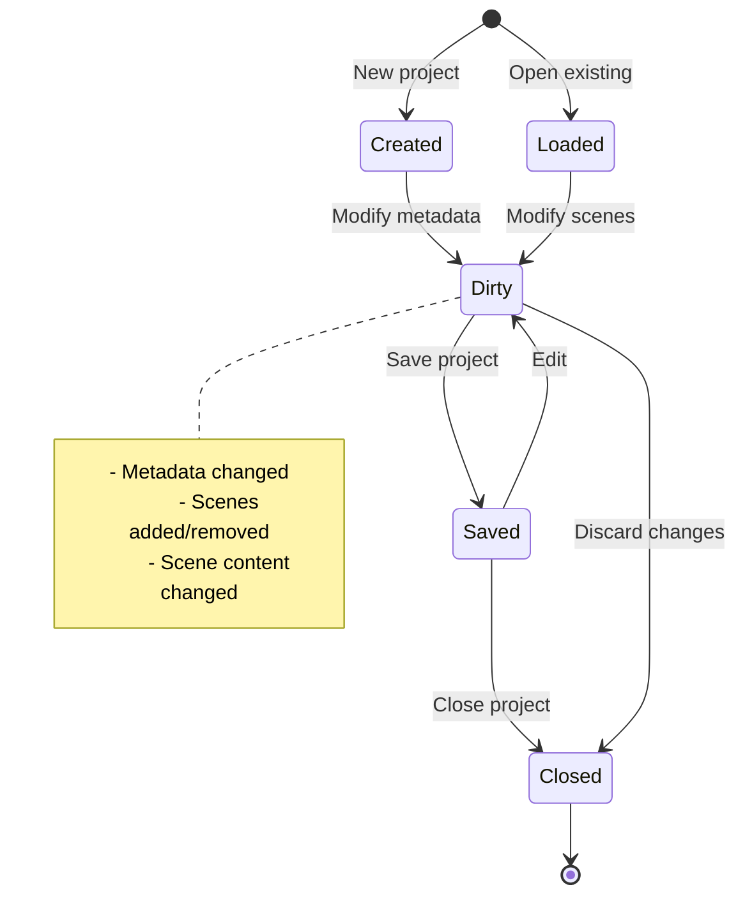

# Oxygen.Editor.Projects

## Overview

The **Oxygen.Editor.Projects** module provides workspace and project file management for the Oxygen Editor. It handles the creation, loading, and saving of editor projects ( `.oxyproj` files), managing project metadata, and orchestrating the persistence of world scenes to disk.

This module sits **above** the `Oxygen.Editor.World` domain model, providing file I/O, project lifecycle management, and workspace-level operations.

## Purpose

The Projects module exists to:

1. **Manage Project Files** - Create, load, and save `.oxyproj` workspace files
2. **Persist Scenes** - Serialize/deserialize world scenes to/from JSON files
3. **Track Project Metadata** - Project name, version, author, creation date, etc.
4. **Provide Lifecycle APIs** - High-level service for project operations
5. **Enable Multi-Scene Projects** - Manage collections of scene files within a project

## Technology Stack

| Technology | Version | Purpose |
|-----------|---------|---------|
| **.NET** | 9.0 (Windows 10.0.26100.0) | Target framework |
| **C#** | 13 (preview) | Language with nullable reference types |
| **System.Linq.Async** | Latest | Async LINQ operations |
| **Microsoft.Extensions.Logging** | Latest | Logging abstractions |

## Architecture

### Module Relationships


### Core Components

| Component | Purpose | Key Responsibilities |
|-----------|---------|---------------------|
| **`ProjectManagerService`** | High-level project API | Create, open, save, close projects |
| **`Project`** | Workspace model | Metadata, scene references, serialization |
| **`ProjectInfo`** | Project metadata | Name, version, author, timestamps |
| **`IProjectManagerService`** | Service interface | Abstraction for DI and testing |

## Core Concepts

### Project Structure

An **Oxygen Project** is a workspace containing:

```
MyGame.oxyproj         ← Project file (metadata + scene list)
├── Scenes/
│   ├── Main.scene.json       ← Scene files
│   ├── Menu.scene.json
│   └── Level1.scene.json
├── Assets/                   ← (Future: Assets, prefabs, etc.)
└── ProjectSettings/          ← (Future: Build settings, etc.)
```

**Project File** (`.oxyproj`):
- Project-wide metadata (name, version, author)
- List of scenes (file paths relative to project root)
- Unique project ID (GUID)
- References `Oxygen.Editor.World` scenes by path

### Project Lifecycle



### ProjectManagerService Responsibilities

1. **Project Creation**
   - Generate new project with metadata
   - Create initial scene
   - Save to disk

2. **Project Loading**
   - Deserialize `.oxyproj` file
   - Validate project structure
   - Discover scene files

3. **Scene Management**
   - Load scenes from JSON
   - Save scenes to JSON
   - Track open/active scenes

4. **Persistence**
   - Save project metadata
   - Save individual scenes
   - Handle save-all operations

## File Formats

### Project File Format

**File Extension**: `.oxyproj`

**Example**:
```json
{
  "Id": "8f2b2b16-3a4a-4f39-9f2c-2d9f3a1b2c3d",
  "Name": "MyGame",
  "Version": "1.0.0",
  "Author": "Game Developer",
  "Created": "2025-01-15T10:30:00Z",
  "Modified": "2025-01-20T14:45:00Z",
  "Scenes": [
    {
      "Path": "Scenes/Main.scene.json",
      "Name": "Main Scene"
    },
    {
      "Path": "Scenes/Menu.scene.json",
      "Name": "Menu"
    }
  ]
}
```

**Required Fields:**
- `Id` - Non-empty GUID (project identity)
- `Name` - Project display name

**Optional Fields:**
- `Version`, `Author`, `Created`, `Modified`
- `Scenes` - Array of scene references

### Scene File References

Projects do **not** embed scene content - they reference scene files:

```json
{
  "Scenes": [
    {
      "Path": "Scenes/Main.scene.json",  ← Relative path from project root
      "Name": "Main Scene"                ← Display name (optional)
    }
  ]
}
```

**Scene files** are managed by `Oxygen.Editor.World` serialization - see [World README](../Oxygen.Editor.World/README.md).

## Usage

### Creating a New Project

```csharp
var service = serviceProvider.GetRequiredService<IProjectManagerService>();

var projectInfo = new ProjectInfo
{
    Name = "MyGame",
    Author = "Developer",
    Version = "1.0.0"
};

var project = await service.CreateProjectAsync(
    path: @"C:\Projects\MyGame\MyGame.oxyproj",
    info: projectInfo,
    cancellationToken: ct
);
```

### Loading an Existing Project

```csharp
var project = await service.LoadProjectAsync(
    path: @"C:\Projects\MyGame\MyGame.oxyproj",
    cancellationToken: ct
);
```

### Loading Scenes

```csharp
// Load specific scene
var scene = await service.LoadSceneAsync(
    project,
    scenePath: "Scenes/Main.scene.json",
    cancellationToken: ct
);

// Load all scenes
var allScenes = await service.LoadAllScenesAsync(project, ct);
```

### Saving Changes

```csharp
// Save single scene
await service.SaveSceneAsync(project, scene, ct);

// Save project metadata
await service.SaveProjectAsync(project, ct);

// Save all (project + all open scenes)
await service.SaveAllAsync(project, ct);
```

### Closing a Project

```csharp
await service.CloseProjectAsync(project, saveChanges: true, ct);
```

## Design Patterns

### Service Pattern
`ProjectManagerService` provides high-level facade over file I/O and serialization

### Repository Pattern
Projects act as containers/references to scenes (repository of scene files)

### Metadata Separation
Project metadata is separated from scene content for modularity

### Async-First
All I/O operations are async for UI responsiveness

## Dependencies

### Project References
- **`Oxygen.Editor.World`** - Domain models (Scene, SceneNode, etc.)
- **`Oxygen.Editor.Storage`** - File system abstractions (IFileSystem)

### NuGet Packages
- `Microsoft.Extensions.Logging.Abstractions` - Logging
- `System.Linq.Async` - Async LINQ support

## Thread Safety

⚠️ **Not intrinsically thread-safe** - Designed for use on the UI thread.

**Recommendations:**
- Call `ProjectManagerService` methods from **UI thread**
- Use async/await to prevent blocking
- Scene modifications should occur on UI thread (property bindings)

## Error Handling

Common exceptions:

| Exception | Cause | Mitigation |
|-----------|-------|------------|
| **FileNotFoundException** | Project/scene file missing | Validate paths, handle gracefully |
| **JsonException** | Malformed JSON, missing required fields | Validate project files, repair if possible |
| **UnauthorizedAccessException** | Insufficient permissions | Check file system permissions |
| **IOException** | File locked, disk full | Retry logic, user notification |

## Validation

### Project Validation

- **`Id` must be non-empty GUID** - Enforced on deserialization
- **`Name` must be non-empty** - Validated by `ProjectInfo`
- **Scene paths must be relative** - Prevent absolute path issues
- **Scene files must exist** - Optional validation on load

### Scene Path Resolution

- Paths in `.oxyproj` are **relative** to project directory
- Service resolves to absolute paths for loading
- Normalization handles different path separators

## Future Enhancements

### Planned Features
- **Asset Management** - Track textures, models, shaders in project
- **Prefab System** - Reusable scene node templates
- **Build Settings** - Platform-specific build configurations
- **Project Templates** - Starter projects (2D, 3D, VR, etc.)
- **Recent Projects** - MRU list with metadata
- **Auto-Save** - Periodic background saves
- **Backup/Versioning** - Automatic backups, version history

### Extensibility Points
- Custom project metadata via extension properties
- Pluggable serialization formats (e.g., binary, YAML)
- Custom scene loaders (e.g., import from Unity, Unreal)

## Testing

Unit tests should cover:
- **Project creation** - Valid metadata, file creation
- **Project loading** - Deserialization, validation
- **Scene management** - Add, remove, save scenes
- **Error handling** - Missing files, invalid JSON
- **Path resolution** - Relative path handling

Use `Testably.Abstractions.Testing` for mocking file system.

## Design Principles

1. **Separation from World** - Projects manage files, World defines data
2. **Observable Metadata** - `ProjectInfo` implements `INotifyPropertyChanged`
3. **Lazy Scene Loading** - Don't load all scenes upfront
4. **Relative Paths** - Projects are relocatable
5. **Async I/O** - Non-blocking file operations

## Related Documentation

- [Oxygen.Editor.World](../Oxygen.Editor.World/README.md) - Domain models for scenes
- [Oxygen.Editor.Runtime](../Oxygen.Editor.Runtime/README.md) - Engine integration
- [Oxygen.Editor.Storage](../Oxygen.Editor.Storage/) - File system abstractions

## License

Distributed under the MIT License. See accompanying `LICENSE` file or visit
[https://opensource.org/licenses/MIT](https://opensource.org/licenses/MIT).

---

**SPDX-License-Identifier**: MIT
