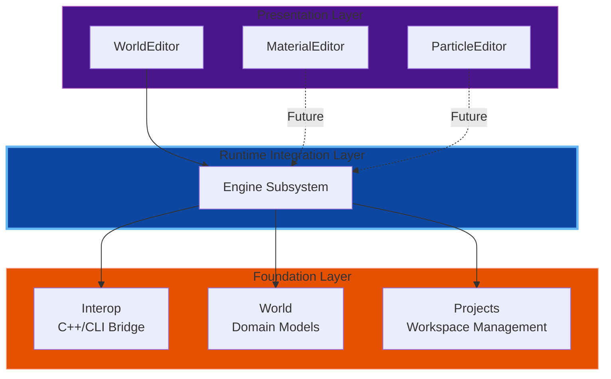
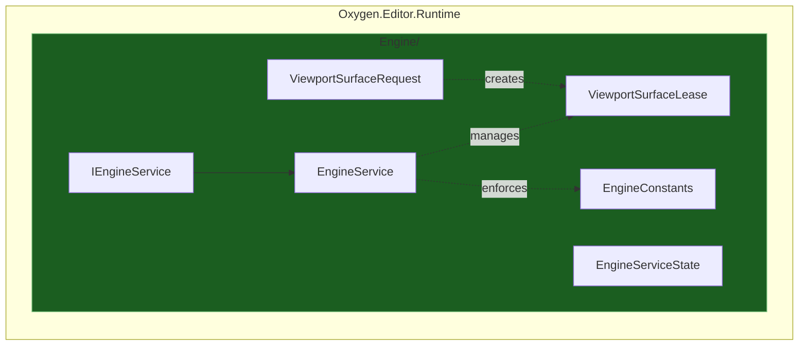
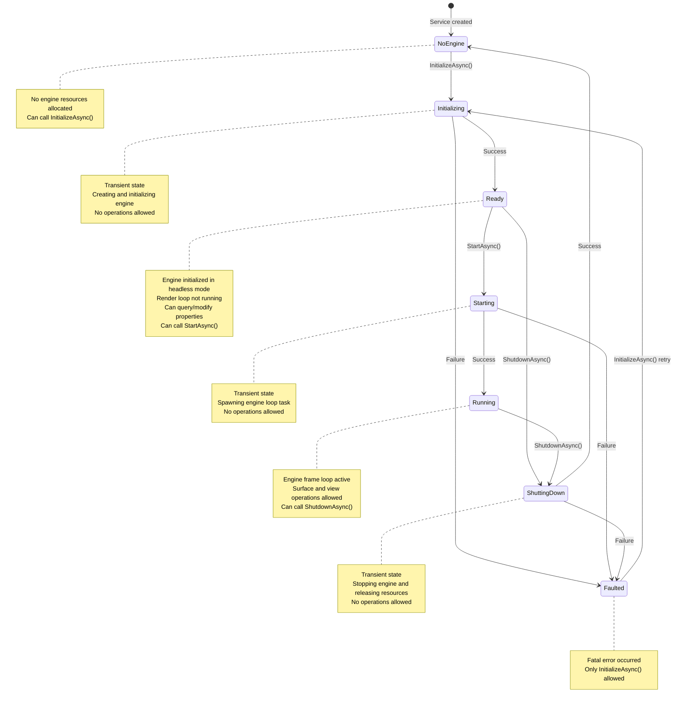
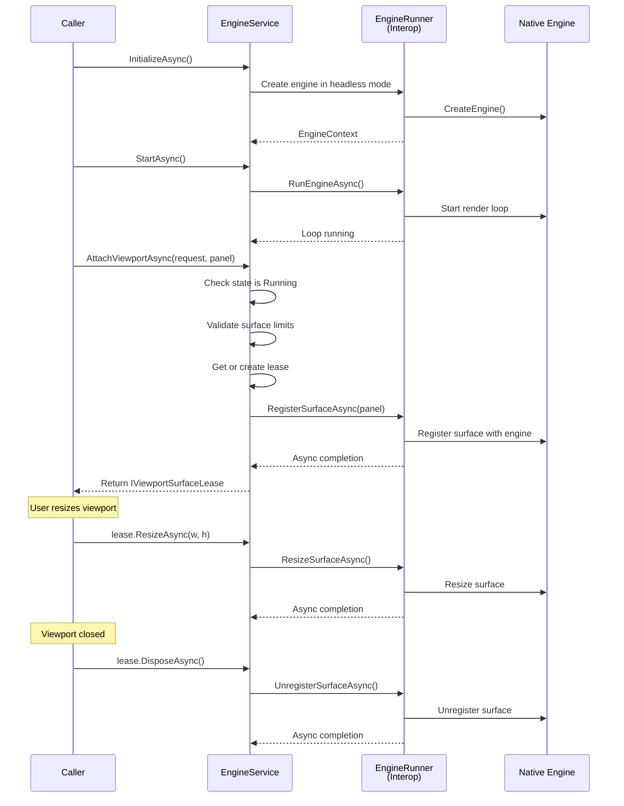
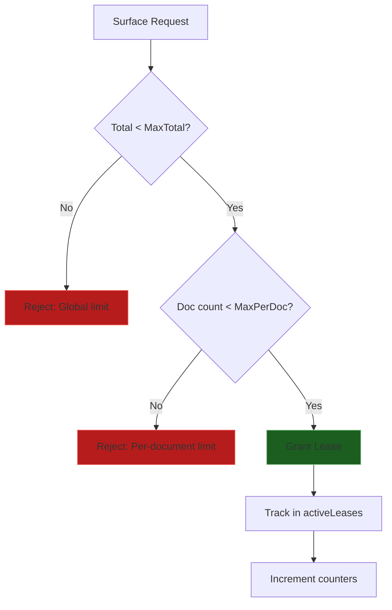

# Oxygen.Editor.Runtime

## Overview

The **Oxygen.Editor.Runtime** module provides the infrastructure layer that bridges the managed .NET editor with the native Oxygen Engine. It serves as the runtime integration layer for all editor types, managing engine lifecycle and viewport rendering surfaces.

This module sits between the editor UI layer and the lower-level components, providing high-level services that editor features can consume.

## Purpose

The Runtime module exists to:

1. **Manage Engine Lifecycle** - Initialize, start, stop, and configure the embedded native engine
2. **Arbitrate Rendering Surfaces** - Allocate and manage viewport surfaces across multiple editor documents
3. **Provide View Management** - Create, show, hide, and destroy views in the native engine
4. **Provide Editor Services** - Expose a clean, high-level API for editor features to consume

By centralizing these concerns, we achieve:

- **Reusability** across different editor types (World Editor, Material Editor, Particle Editor, etc.)
- **Clear separation** between UI concerns and engine integration
- **Testability** through well-defined interfaces
- **Resource Safety** via surface limits and lease patterns

## Architecture

### Module Layering

The Runtime module occupies the integration layer between presentation and the native engine:

### Core Components

The module's Engine subsystem consists of:

## Engine Subsystem

### Responsibilities

1. **Lifecycle Management**: Initialize, start, and shutdown the native engine
2. **Viewport Surface Management**: Provide and manage rendering surfaces attached to WinUI SwapChainPanels
3. **Resource Arbitration**: Enforce surface allocation limits
4. **Engine Configuration**: Manage engine settings (target FPS, logging verbosity)
5. **Engine Access**: Provide a world instance for querying and mutating the engine world
6. **View Management**: Create, destroy, show, and hide editor views in the native engine

### Engine Lifecycle State Machine

### Surface Leasing Model

Viewports acquire rendering surfaces through a resource lease pattern. The EngineService manages surface attachment, resizing, and cleanup. The engine must be in the Running state before surfaces can be attached:

### Surface Limits

Resource constraints are enforced to prevent exhaustion:

**Surface Limits:**

- Maximum total surfaces: 8 (defined in `EngineConstants.MaxTotalSurfaces`)
- Maximum surfaces per document: 4 (defined in `EngineConstants.MaxSurfacesPerDocument`)

## Design Patterns

### Lease Pattern

- Viewports don't directly own resources
- Resources released automatically on dispose
- Prevents resource leaks

### Singleton Service (EngineService)

- One engine instance per application
- Globally accessible via DI
- Manages shared state (surfaces, lifecycle)

## Threading Model

The Runtime module operates across **two distinct threading domains**: the editor UI thread (where WinUI operations must occur) and the managed editor code space (any thread for queries and configuration).

### Thread Domains and Thread Safety

| Component | Thread Affinity | Safety Mechanism |
|-----------|----------------|------------------|
| **EngineService** (queries/config) | UI thread only for surface ops | `HostingContext.Dispatcher` validation in surface attachment |
| **EngineService** (lifecycle/properties) | UI thread | Single-threaded access via gates |
| **EngineRunner** (Interop) | UI thread | Delegates to engine via C++/CLI bridge |
| **WinUI SwapChainPanel** | UI thread only | WinUI framework requirement |

### Design Rationale

**Surface Operations (AttachViewportAsync)** require the UI thread because they:

1. Accept a `SwapChainPanel` parameter (WinUI component)
2. Must compute DPI-aware dimensions based on `XamlRoot.RasterizationScale`
3. Marshal the panel to a native COM pointer for engine registration
4. Interact with the WinUI dispatcher context

**Lifecycle and Configuration** operations enforce UI thread access to ensure:

1. Consistent state transitions without race conditions
2. Serialized access to the engine runner instance
3. Safe coordination between initialization, starting, and shutdown

### Asynchronous Operations

While surface attachment and engine operations occur on the UI thread, they are exposed as `async` / `ValueTask` methods to allow non-blocking UI updates. The underlying implementation delegates to the `EngineRunner` (C++/CLI) which communicates with the native engine asynchronously.

## Performance Considerations

### Resource Limits

- Cap total surfaces (prevents memory exhaustion)
- Cap per-document surfaces (prevents single document monopoly)
- Fail fast on limit violation

### Explicit Lifecycle Management

- Engine is created during `InitializeAsync()` in headless mode (no render loop yet)
- Engine loop starts explicitly via `StartAsync()` - not automatic
- Requires explicit `StartAsync()` call before attaching viewports
- Caller must coordinate initialization and startup explicitly

## Dependencies

### Project References

- `Oxygen.Editor.Interop` - C++/CLI bridge to native engine
- `Oxygen.Editor.World` - World domain models (Scene, SceneNode, Transform, components)
- `Oxygen.Editor.Projects` - Project/workspace management (Project, ProjectInfo)
- `DroidNet.Hosting.WinUI` - UI thread context management

### NuGet Packages

- `Microsoft.WindowsAppSDK` - WinUI integration
- `Microsoft.Extensions.DependencyInjection` - Service registration
- `Microsoft.Extensions.Logging` - Diagnostic logging

## Future Enhancements

### Planned Features

- **Lazy Engine Loop Start**: Automatically start the engine frame loop when the first viewport surface is attached, rather than requiring explicit `StartAsync()` call
- **Engine Loop Auto-Tuning**: Dynamically adjust engine behavior based on rendering workload
  - Pause render loop when no views are active (conserve CPU/GPU)
  - Resume render loop when views become active
- **Synchronization Subsystem**: Monitor and propagate editor model changes to the engine
  - Domain model property observation
  - Batched change application for performance
  - Active/passive synchronization modes
- **Bidirectional Sync**: Engine → Editor updates (physics, animations)
- **Play Mode Sync**: Different behavior during play/simulate
- **Undo/Redo Integration**: Command pattern for synchronization
- **Prefab Support**: Template-instance synchronization
- **Network Sync**: Multi-user collaborative editing

### Extensibility Points

- Pluggable synchronization implementations
- Custom surface allocation strategies
- Alternative engine backends via `IEngineService`

## Design Principles

1. **Separation of Concerns**: Lifecycle, surfaces, and views managed distinctly
2. **Interface-Based Design**: `IEngineService` and `IViewportSurfaceLease` abstractions
3. **Resource Safety**: Lease pattern prevents surface leaks
4. **Thread Safety**: UI thread requirements enforced at boundaries
5. **Async/Await**: Modern async patterns for non-blocking operations

## Related Documentation

- [Oxygen.Editor.Interop](../Oxygen.Editor.Interop/README.md) - Platform bridge layer
- [Oxygen.Editor.World](../Oxygen.Editor.World/) - World domain models
- [Oxygen.Editor.Projects](../Oxygen.Editor.Projects/) - Project workspace management

## License

Distributed under the MIT License. See accompanying `LICENSE` file or visit
[https://opensource.org/licenses/MIT](https://opensource.org/licenses/MIT).

---

**SPDX-License-Identifier**: MIT
