# Oxygen.Editor.Runtime

## Overview

The **Oxygen.Editor.Runtime** module provides the infrastructure layer that bridges the managed .NET editor with the native Oxygen Engine. It serves as the runtime integration layer for all editor types, managing engine lifecycle, viewport rendering surfaces, and synchronizing world domain models with the running engine.

This module sits between the editor UI layer and the lower-level components, providing high-level services that editor features can consume.

## Purpose

The Runtime module exists to:

1. **Manage Engine Lifecycle** - Initialize, start, stop, and configure the embedded native engine
2. **Arbitrate Rendering Surfaces** - Allocate and manage viewport surfaces across multiple editor documents
3. **Synchronize Game Objects** - Keep world domain models (scenes, nodes, components) in sync with the running engine
4. **Provide Editor Services** - Expose a clean, high-level API for editor features to consume

By centralizing these concerns, we achieve:
- **Reusability** across different editor types (World Editor, Material Editor, Particle Editor, etc.)
- **Clear separation** between UI concerns and engine integration
- **Testability** through well-defined interfaces
- **Performance** via batching and intelligent synchronization

## Architecture

### Module Layering

The Runtime module occupies the integration layer between presentation and platform:

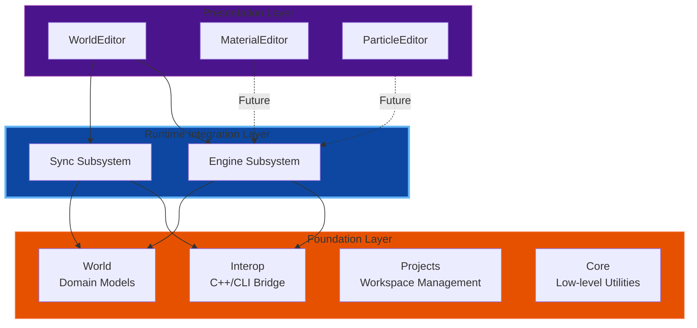

### Core Components

The module is organized into two primary subsystems:

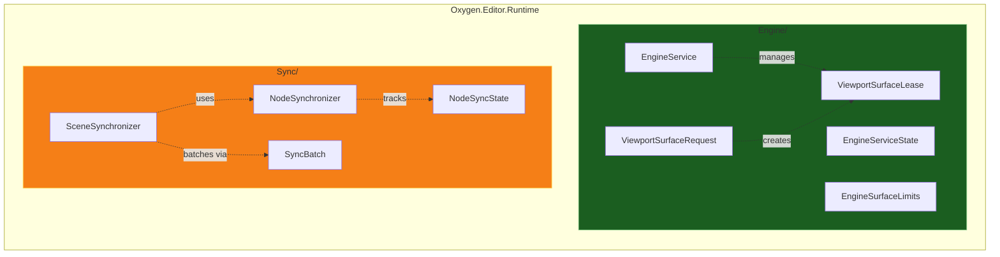

## Engine Subsystem

### Responsibilities

1. **Lifecycle Management**: Initialize, run, and shutdown the native engine
2. **Surface Allocation**: Provide rendering surfaces to viewports
3. **Resource Arbitration**: Enforce limits on surface allocation
4. **Configuration**: Manage engine settings (FPS, logging, etc.)
5. **Thread Safety**: Ensure UI-thread-bound operations are safe

### Engine Lifecycle State Machine

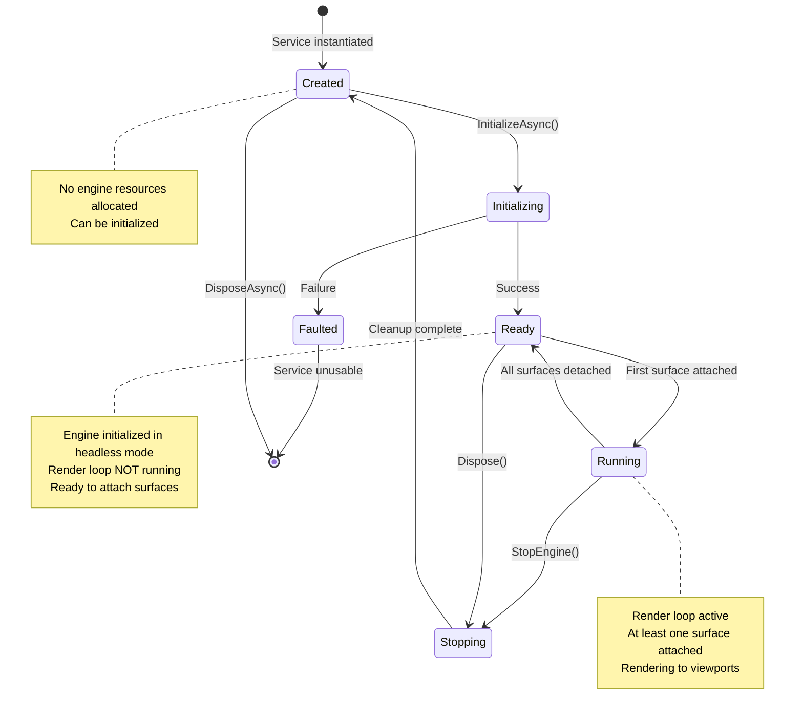

### Surface Leasing Model

Viewports acquire rendering surfaces through a resource lease pattern, with operations queued and processed by the EditorModule:

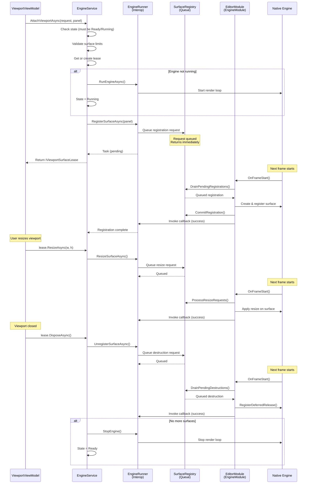

### Surface Limits

Resource constraints are enforced to prevent exhaustion:

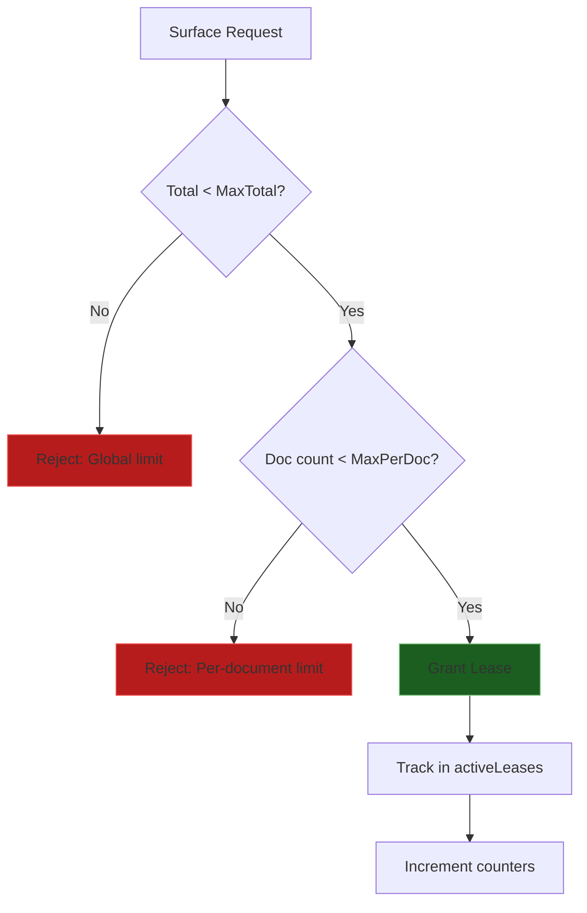

**Default Limits:**
- Maximum total surfaces: 16 (configurable)
- Maximum surfaces per document: 4 (configurable)

## Sync Subsystem

### Responsibilities

1. **Change Observation**: Monitor property changes on domain models
2. **Translation**: Convert editor model changes to engine API calls
3. **Batching**: Coalesce rapid changes for performance
4. **Throttling**: Prevent overwhelming the engine with updates
5. **Lifecycle Management**: Handle component add/remove/update
6. **State Tracking**: Know which nodes are synchronized

### Synchronization Architecture

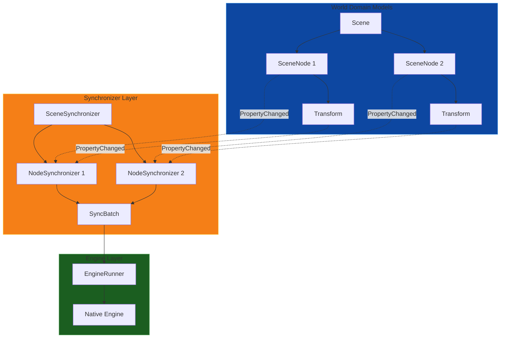

### Synchronization Flow

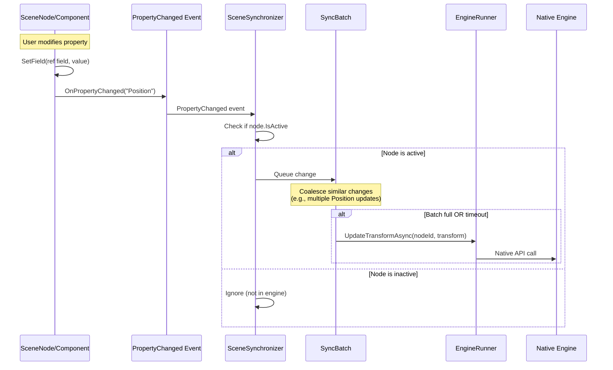

### Node Synchronization States

A SceneNode can be in different sync states:

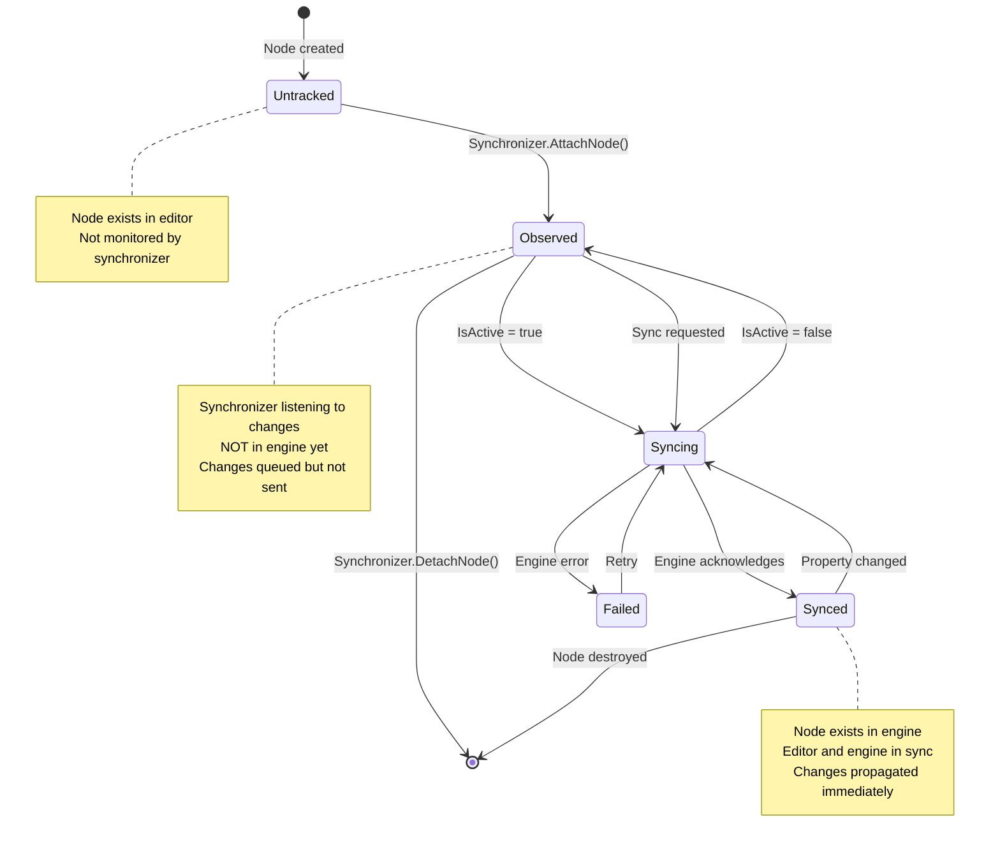

### Batching Strategy

To optimize performance, the synchronizer batches changes:

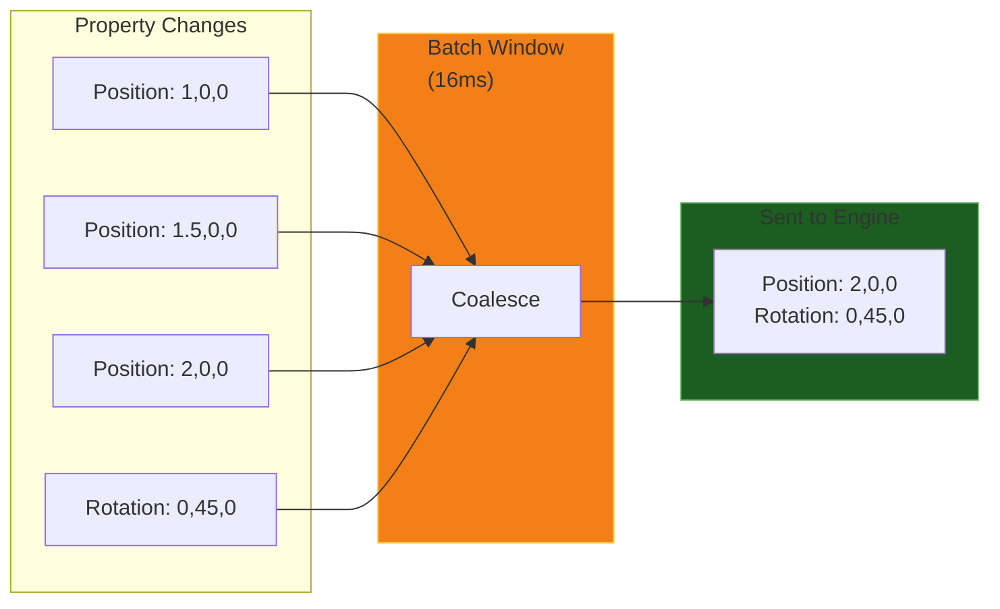

**Batching Rules:**
- Batch window: One frame (~16ms at 60 FPS)
- Coalesce: Later values override earlier ones for same property
- Flush: On frame boundary or when batch reaches size limit
- Priority: Critical changes (e.g., IsActive) may bypass batch

### Synchronization Modes

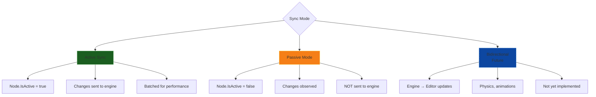

## Design Patterns

### Observable Pattern
- Domain models implement `INotifyPropertyChanged`
- Synchronizers subscribe to property change events
- Decouples models from sync logic

### Lease Pattern
- Viewports don't directly own resources
- Resources released automatically on dispose
- Prevents resource leaks

### Singleton Service (EngineService)
- One engine instance per application
- Globally accessible via DI
- Manages shared state (surfaces, lifecycle)

### Per-Document Synchronizer
- Each Scene has its own SceneSynchronizer
- Independent lifecycles
- Isolated failure domains

## Threading Model

The Runtime module operates across **three distinct threading domains**: the editor UI thread, the managed editor space (any thread), and the native engine threads (main thread and render thread pools). The critical bridge between these domains is the **EditorModule**, a native C++ engine module that ensures all engine operations happen at the correct frame cycle phase.

### Thread Domains and Boundaries

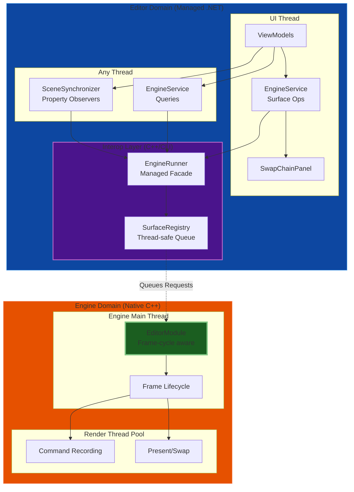

### EditorModule: The Phase-Aware Bridge

The **EditorModule** is a native C++ `EngineModule` that runs **inside the engine** as part of its frame lifecycle. This design provides:

1. **Thread Safety**: All engine state mutations occur on the engine's main thread
2. **Phase Awareness**: Operations execute at the correct frame cycle phase
3. **Clean Separation**: Editor threads never directly touch engine internals
4. **Asynchronous Queuing**: Editor operations are queued and processed by the module

**Key Characteristics:**
- **Priority**: `kModulePriorityHighest` - Runs before other modules
- **Phases**: Participates in `kFrameStart` and `kCommandRecord`
- **Ownership**: Owns the `SurfaceRegistry` for thread-safe surface management

### Frame Cycle Integration

The EditorModule processes editor requests at specific phases of each engine frame:

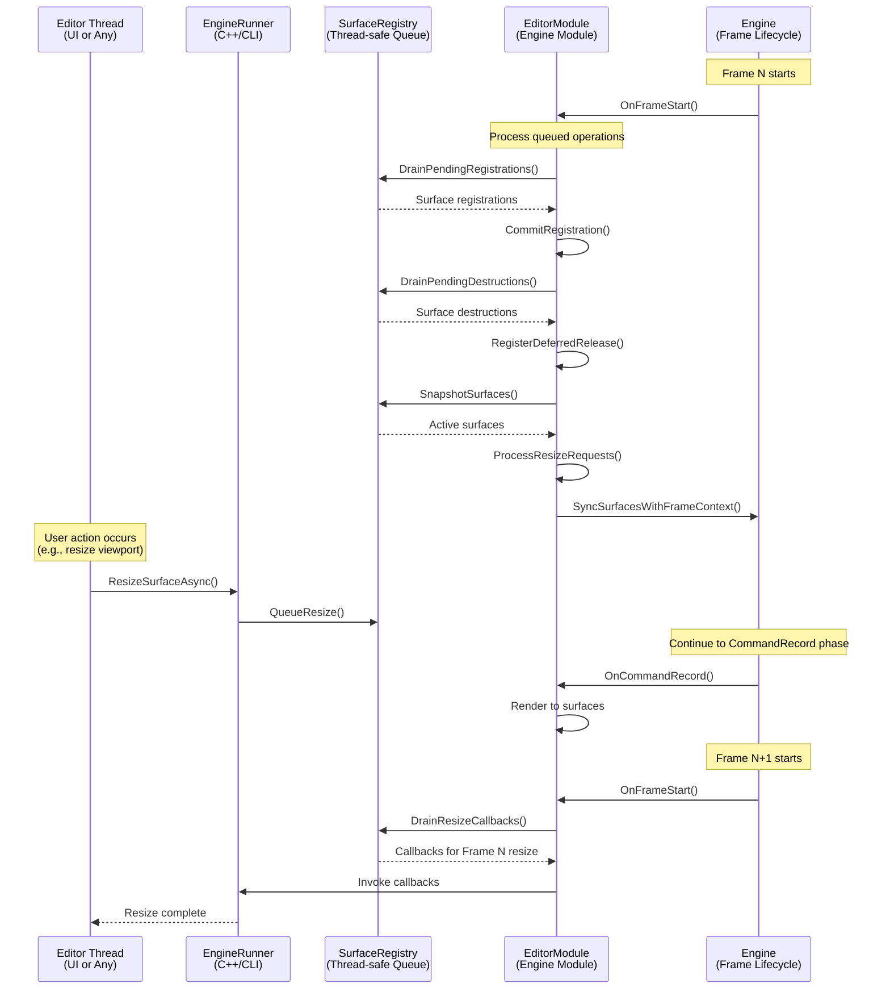

### Phase-Specific Processing

The EditorModule operates in two key phases:

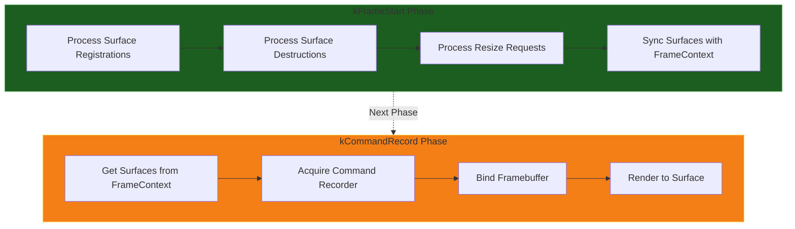

**kFrameStart Phase:**
1. **Drain Queues**: Pull pending operations from `SurfaceRegistry`
2. **Commit Registrations**: Add new surfaces to the engine
3. **Defer Destructions**: Queue surface cleanup for safe deferred release
4. **Apply Resizes**: Execute resize operations on the engine thread
5. **Sync Frame Context**: Update the frame's surface list

**kCommandRecord Phase:**
1. **Iterate Surfaces**: Process each surface registered in the frame
2. **Acquire Recorder**: Get a command recorder for the graphics queue
3. **Create Framebuffer**: Set up rendering target
4. **Record Commands**: Clear and render to the surface

### Thread-Safe Communication Pattern

Operations from editor threads are queued and deferred to the appropriate engine phase:

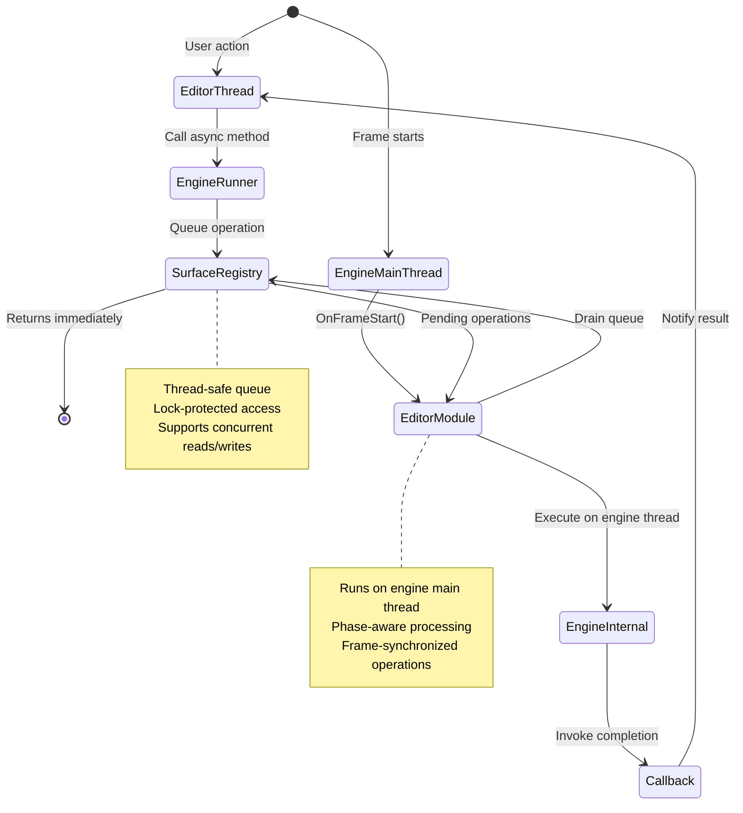

### Thread Safety Guarantees

| Component | Thread Affinity | Safety Mechanism |
|-----------|----------------|------------------|
| **EngineService** (queries) | Any thread | Internal locks, immutable state |
| **EngineService** (surface ops) | UI thread only | `HostingContext.Dispatcher` check |
| **SceneSynchronizer** | Any thread | Queues to `EditorModule` |
| **SurfaceRegistry** | Any thread | Mutex-protected queues |
| **EditorModule** | Engine main thread | Engine phase system |
| **EngineRunner** | Any thread → queue | Delegates to `SurfaceRegistry` |
| **WinUI SwapChainPanel** | UI thread only | WinUI requirement |

### Why This Design?

**Problem**: The editor UI and domain models live on managed .NET threads, but the engine requires all state mutations to happen on its own main thread at specific frame phases.

**Solution**: The EditorModule acts as a **phase-aware adapter**:

1. **Editor threads** call `EngineRunner` methods (e.g., `RegisterSurfaceAsync()`)
2. **EngineRunner** queues the request in the thread-safe `SurfaceRegistry`
3. **EditorModule** drains the queue during `OnFrameStart()` on the engine main thread
4. **Operations execute** safely within the engine's frame lifecycle
5. **Callbacks** notify the editor thread of completion

**Benefits:**
- ✅ **No race conditions**: Engine state only mutated on engine thread
- ✅ **No frame tearing**: Operations synchronized with frame boundaries
- ✅ **Editor simplicity**: Editor code remains async/await, unaware of engine phases
- ✅ **Clean separation**: Editor and engine threading models are independent

## Performance Considerations

### Batching
- Coalesce rapid property changes (e.g., dragging)
- Flush on frame boundaries
- Reduces interop overhead

### Throttling
- Limit update frequency for high-churn properties
- Use debouncing for Transform updates
- Prevent engine overload

### Resource Limits
- Cap total surfaces (prevents memory exhaustion)
- Cap per-document surfaces (prevents single document monopoly)
- Fail fast on limit violation

### Lazy Activation
- Engine starts only when first surface attached
- Engine stops when all surfaces detached
- Conserves resources when no viewports open

## Dependencies

### Project References
- `Oxygen.Editor.Interop` - C++/CLI bridge to native engine
- `Oxygen.Editor.World` - World domain models (Scene, SceneNode, Transform, components)
- `Oxygen.Editor.Projects` - Project/workspace management (Project, ProjectInfo)
- `DroidNet.Hosting.WinUI` - UI thread context management

### NuGet Packages
- `Microsoft.WindowsAppSDK` - WinUI integration
- `Microsoft.Extensions.DependencyInjection` - Service registration
- `Microsoft.Extensions.Logging` - Diagnostic logging

## Future Enhancements

### Planned Features
- **Bidirectional Sync**: Engine → Editor updates (physics, animations)
- **Play Mode Sync**: Different behavior during play/simulate
- **Undo/Redo Integration**: Command pattern for synchronization
- **Prefab Support**: Template-instance synchronization
- **Network Sync**: Multi-user collaborative editing

### Extensibility Points
- Custom synchronizer implementations via `ISceneSynchronizer`
- Pluggable batching strategies
- Alternative engine backends via `IEngineService`

## Design Principles

1. **Separation of Concerns**: Engine and Sync are distinct subsystems
2. **Interface-Based Design**: Depend on abstractions, not concretions
3. **Observable Models**: Models remain pure, synchronizers observe
4. **Resource Safety**: Leases prevent resource leaks
5. **Performance First**: Batching and throttling are core design elements

## Related Documentation

- [Oxygen.Editor.Interop](../Oxygen.Editor.Interop/README.md) - Platform bridge layer
- [Oxygen.Editor.World](../Oxygen.Editor.World/) - World domain models
- [Oxygen.Editor.Projects](../Oxygen.Editor.Projects/) - Project workspace management
- [Synchronization Design](./docs/sync-design.md) - Detailed sync architecture
- [Surface Management](./docs/surface-management.md) - Detailed surface allocation

## License

Distributed under the MIT License. See accompanying `LICENSE` file or visit
[https://opensource.org/licenses/MIT](https://opensource.org/licenses/MIT).

---

**SPDX-License-Identifier**: MIT
