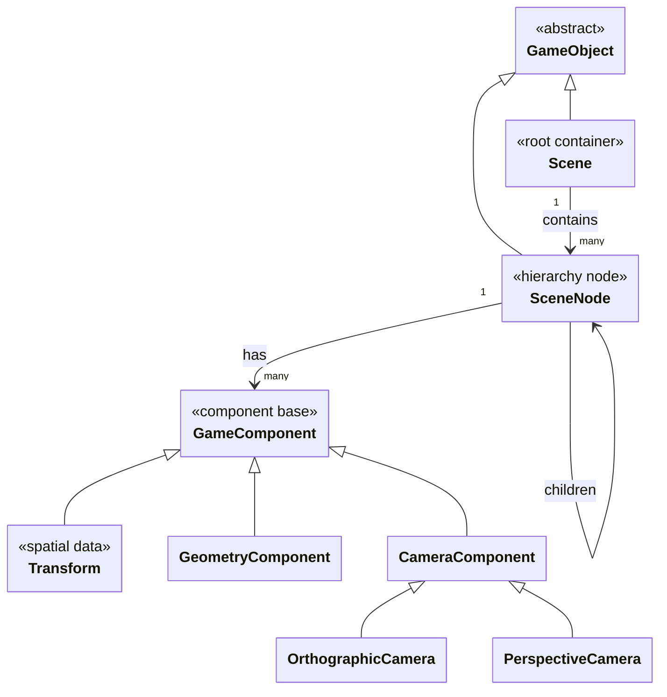
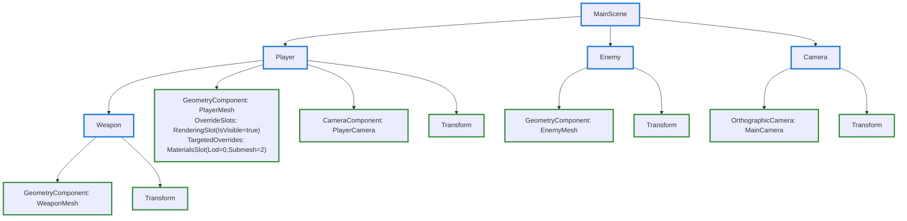

# Oxygen.Editor.World

## Overview

**Oxygen.Editor.World** is the domain model for game world entities in Oxygen Editor. It defines scenes, hierarchical nodes, and extensible component-based entities, supporting property change notification and robust JSON serialization.

**Key attributes:**

- Pure domain model: no UI, engine, or I/O dependencies
- In-memory only: supports property change notification and JSON round-tripping

## Purpose

This module provides:

- **World Entities:** Scene, SceneNode, Transform, and extensible component hierarchy
- **Hierarchical Composition:** Parent-child trees of nodes, with circular reference protection
- **Component Pattern:** Extensible, polymorphic components (Transform, Geometry, Camera, etc.)
- **Property Overrides via Slots:** Flexible override system using slots, supporting global, component-level, and targeted overrides (e.g., per LOD/submesh)
- **Observability:** `INotifyPropertyChanged` for UI/data binding and runtime sync
- **Serialization:** JSON-based, with type discriminators and round-trip support

## Technology Stack

| Technology                        | Version                        | Purpose                  |
|------------------------------------|--------------------------------|--------------------------|
| .NET                              | 9.0 (Windows 10.0.26100.0)     | Target framework         |
| C#                                | 13 (preview, nullable enabled) | Language                 |
| Microsoft.Extensions.Logging      | Latest                         | Logging abstractions     |
| System.Numerics                   | Built-in                       | Vector3 for Transform    |

## Architecture

### Domain Model Structure



### Key Classes

| Class                | Purpose                        | Features                                      |
|----------------------|-------------------------------|-----------------------------------------------|
| `GameObject`         | Base for all entities         | `INotifyPropertyChanged`, `Id`, `Name`, validation, override slots |
| `Scene`              | Root container                | RootNodes, AllNodes, project reference, JSON  |
| `SceneNode`          | Hierarchical entity           | Components, flags, parent/child, override slots, circular protection |
| `GameComponent`      | Base for components           | `INotifyPropertyChanged`, Node reference, polymorphic serialization, override slots |
| `Transform`          | Spatial component             | LocalPosition, LocalRotation, LocalScale      |
| `GeometryComponent`  | Geometry asset reference      | AssetReference, targeted overrides            |
| `CameraComponent`    | Camera base                   | Near/Far plane, concrete types                |
| `OrthographicCamera` | Orthographic camera           | OrthographicSize, Near/Far plane              |
| `PerspectiveCamera`  | Perspective camera            | FieldOfView, AspectRatio, Near/Far plane      |
| `Category`           | Project categorization        | Enum-style, not for nodes/entities            |

## Core Concepts

### GameObject Base Class

All entities inherit from `GameObject`:

- Unique `Guid Id` (init-only)
- Observable properties: `INotifyPropertyChanged` + `INotifyPropertyChanging`
- Name validation: required, non-empty string
- Override slots: for property overrides (global/component/targeted)

### Scene Hierarchy

```text
Scene
├── SceneNode ("Player")
│   ├── Transform
│   ├── GeometryComponent
│   └── CameraComponent
├── SceneNode ("Enemy")
│   ├── Transform
│   └── SceneNode ("Weapon")
│       └── Transform
└── SceneNode ("Camera")
    └── OrthographicCamera
```

- `Scene.RootNodes`: Collection of root-level nodes
- `Scene.AllNodes`: Flattened node tree
- `SceneNode.Components`: Always includes Transform; supports others
- `SceneNode.Flags`: Compact enum for visibility, shadow, selection, static, etc.
- Parent/child relationships, circular reference protection

### Component System

- Entity-Component pattern: each `SceneNode` has a collection of `GameComponent`
- **Transform** is mandatory
- Components are polymorphic (`[JsonDerivedType]`), registered for serialization
- Components reference their owning node
- Override slots: component-level and targeted (e.g., for geometry LODs/submeshes)

#### Extensibility

Add new components by subclassing `GameComponent` and registering with serializer:

```csharp
public partial class MeshRenderer : GameComponent
{
    public string MeshPath { get; set; } = string.Empty;
    // Register in static constructor
}
```

Register:

```csharp
[JsonDerivedType(typeof(MeshRenderer), "MeshRenderer")]
public abstract partial class GameComponent : ScopedObservableObject, INamed, IPersistent<ComponentData>
```

Add to node:

```csharp
node.Components.Add(new MeshRenderer { MeshPath = "models/character.glb" });
```

### Property Change Notifications

- All domain objects implement `INotifyPropertyChanged`
- Used for UI binding, runtime sync, dirty tracking

```csharp
private Vector3 localPosition;
public Vector3 LocalPosition
{
    get => this.localPosition;
    set => _ = this.SetProperty(ref this.localPosition, value);
}
```

### Slots System

The Slots system provides a flexible, extensible mechanism for property overrides at multiple levels of the world model. Slots are observable containers for overridable properties, enabling fine-grained control over rendering, materials, LOD, and lighting.

| Concept                | Description |
|------------------------|-------------|
| **`OverrideSlot`**       | Abstract base for all slot types. Supports property change notification and serialization. Can be attached to `GameObject` (global), `GameComponent` (component-level), or `GeometryOverrideTarget` (targeted overrides). |
| **`OverridableProperty<T>`** | Value type representing a property with a default and optional override value. Used within slots to encapsulate override semantics. |
| **Slot Types**         | See table below for built-in slot types. |
| **Targeted Overrides** | `GeometryOverrideTarget` allows slots to be scoped to specific LODs/submeshes for per-part customization. |
| **Usage Patterns**     | Slots are hydrated/dehydrated for persistence. Factories and registration patterns ensure extensibility. Query or create slots using `GetOrCreateSlot<T>()`. |

#### Built-in Slot Types

| Slot Type            | Purpose/Overrides                | Typical Scope                |
|----------------------|----------------------------------|------------------------------|
| `LevelOfDetailSlot`  | LOD selection policy (distance, fixed, screen space error) | GeometryComponent |
| `LightingSlot`       | Shadow casting/receiving         | GeometryComponent, GameObject |
| `RenderingSlot`      | Visibility, rendering flags      | GeometryComponent, GameObject |
| `MaterialsSlot`      | Material assignment              | GeometryOverrideTarget        |

#### Example Usage

```csharp
// Attach a material override to a specific submesh
var target = new GeometryOverrideTarget { LodIndex = 0, SubmeshIndex = 2 };
var matSlot = new MaterialsSlot();
matSlot.Material.Uri = new Uri("assets/materials/metal.mat");
target.OverrideSlots.Add(matSlot);
```

Slots enable designers and tools to override properties at any level of the scene graph, supporting advanced workflows like per-object rendering tweaks, dynamic LOD, and context-sensitive material assignment.

### SceneNode LINQ Extensions

The module provides LINQ-style extension methods for traversing and querying scene node hierarchies:

- `DescendantsAndSelf()`: Enumerates the node and all its descendants (depth-first).
- `Descendants()`: Enumerates all descendant nodes.
- `AncestorsAndSelf()`: Enumerates the node and all its ancestors (closest parent first).
- `Ancestors()`: Enumerates all ancestor nodes.
- `FindByPath(scene, path)`: Finds a node by a path expression (supports exact names, `*`, and `**` wildcards).

These extensions simplify tree navigation, path-based queries, and hierarchical operations on scenes and nodes.

## JSON Serialization

### Scene Format

Scenes serialize to JSON with custom converters:

- Circular references via `IProject` injection
- Polymorphic components via `[JsonDerivedType]`
- Required fields: Scene requires `IProject`, Node requires `Scene`

#### Example Scene JSON

```json
{
  "Name": "MainScene",
  "Id": "f47ac10b-58cc-4372-a567-0e02b2c3d479",
  "RootNodes": [
    {
      "Name": "Player",
      "Id": "550e8400-e29b-41d4-a716-446655440000",
      "IsActive": true,
      "Components": [
        {
          "$type": "Transform",
          "Name": "Transform",
          "LocalPosition": {
            "x": 0.0,
            "y": 1.0,
            "z": 0.0
          },
          "LocalRotation": {
            "x": 0.0,
            "y": 0.0,
            "z": 0.0,
            "w": 1.0
          },
          "LocalScale": {
            "x": 1.0,
            "y": 1.0,
            "z": 1.0
          }
        },
        {
          "$type": "GeometryComponent",
          "Name": "PlayerMesh",
          "GeometryUri": "asset:///Engine/Generated/BasicShapes/Cube",
          "OverrideSlots": [
            {
              "$type": "RenderingSlot",
              "IsVisible": { "Value": true }
            }
          ],
          "TargetedOverrides": [
            {
              "LodIndex": 0,
              "SubmeshIndex": 0,
              "OverrideSlots": [
                {
                  "$type": "MaterialsSlot",
                  "Material": { "Uri": "asset:///Engine/Generated/Materials/Default" }
                }
              ]
            }
          ]
        },
        {
          "$type": "PerspectiveCamera",
          "Name": "PlayerCamera",
          "NearPlane": 0.1,
          "FarPlane": 1000.0
        }
      ],
      "Children": [
        {
          "Name": "Weapon",
          "Id": "c0a80101-0000-0000-0000-000000000001",
          "IsActive": true,
          "Components": [
            {
              "$type": "Transform",
              "Name": "Transform",
              "LocalPosition": {
                "x": 0.5,
                "y": 0.0,
                "z": 0.0
              },
              "LocalRotation": {
                "x": 0.0,
                "y": 0.0,
                "z": 0.0,
                "w": 1.0
              },
              "LocalScale": {
                "x": 1.0,
                "y": 1.0,
                "z": 1.0
              }
            },
            {
              "$type": "GeometryComponent",
              "Name": "WeaponMesh",
              "GeometryUri": "asset:///Engine/Generated/BasicShapes/Plane"
            }
          ]
        }
      ]
    },
    {
      "Name": "Enemy",
      "Id": "550e8400-e29b-41d4-a716-446655440001",
      "IsActive": true,
      "Components": [
        {
          "$type": "Transform",
          "Name": "Transform",
          "LocalPosition": {
            "x": 10.0,
            "y": 0.0,
            "z": 0.0
          },
          "LocalRotation": {
            "x": 0.0,
            "y": 0.0,
            "z": 0.0,
            "w": 1.0
          },
          "LocalScale": {
            "x": 1.0,
            "y": 1.0,
            "z": 1.0
          }
        },
        {
          "$type": "GeometryComponent",
          "Name": "EnemyMesh",
          "GeometryUri": "asset:///Engine/Generated/BasicShapes/Sphere"
        }
      ]
    },
    {
      "Name": "Camera",
      "Id": "550e8400-e29b-41d4-a716-446655440002",
      "IsActive": true,
      "Components": [
        {
          "$type": "Transform",
          "Name": "Transform",
          "LocalPosition": {
            "x": 0.0,
            "y": 5.0,
            "z": -10.0
          },
          "LocalRotation": {
            "x": 0.0,
            "y": 0.0,
            "z": 0.0,
            "w": 1.0
          },
          "LocalScale": {
            "x": 1.0,
            "y": 1.0,
            "z": 1.0
          }
        },
        {
          "$type": "OrthographicCamera",
          "Name": "MainCamera",
          "NearPlane": 0.1,
          "FarPlane": 1000.0,
          "OrthographicSize": 10.0
        }
      ]
    }
  ]
}
```

#### Scene Graph



### Custom JSON Converters

- `Scene.SceneJsonConverter`: Requires `IProject` for deserialization
- `SceneNode.SceneNodeConverter`: Requires `Scene`, ensures Transform is present
- `GameComponent.Vector3JsonConverter`: Serializes `System.Numerics.Vector3` as `{x, y, z}`

## Design Patterns

- **Observable:** All entities are reactive (`INotifyPropertyChanged`)
- **Composite:** SceneNode trees (parent/child, descendants/ancestors)
- **Component:** Behavior via composition, not inheritance
- **Immutable Identity:** `Id` is `init`-only, stable across lifecycle

## Dependencies

- **No project references** (pure domain model)
- NuGet: `Microsoft.Extensions.Logging.Abstractions`
- Framework: `System.Numerics` (Vector3, Quaternion)

## Thread Safety

⚠️ **Not thread-safe** — domain models are single-threaded.
Property change events fire on the calling thread; synchronizers must handle cross-thread marshaling.

## Extensibility

### Adding New Components

1. **Define Component Class**:

   ```csharp
   public partial class MeshRenderer : GameComponent
   {
       public string MeshPath { get; set; } = string.Empty;
   }
   ```

2. **Register with JSON Serializer**:

   ```csharp
   [JsonDerivedType(typeof(MeshRenderer), "MeshRenderer")]
   public abstract partial class GameComponent : ScopedObservableObject, INamed, IPersistent<ComponentData>
   ```

3. **Add to SceneNode**:

   ```csharp
   node.Components.Add(new MeshRenderer { MeshPath = "models/character.glb" });
   ```

## Testing

Unit tests should cover:

- Property change notifications (events fire)
- JSON round-tripping (serialize/deserialize)
- Component lifecycle (add/remove, hydrate/dehydrate)
- Transform math (Vector3/Quaternion operations)
- Validation (name requirements, required properties)

## Related Documentation

- [Oxygen.Editor.Runtime](../Oxygen.Editor.Runtime/README.md): Synchronizes world models with engine
- [Oxygen.Editor.Projects](../Oxygen.Editor.Projects/): Manages workspace and project files

## License

Distributed under the MIT License. See [LICENSE](../../LICENSE) or [opensource.org/licenses/MIT](https://opensource.org/licenses/MIT).
