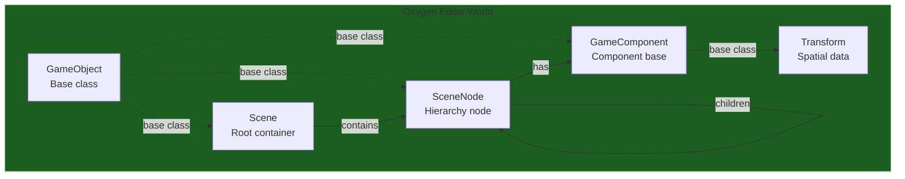

# Oxygen.Editor.World

## Overview

The **Oxygen.Editor.World** module provides the core domain model for game world entities in the Oxygen Editor. It defines the fundamental building blocks for scenes, hierarchical nodes, and component-based entities that make up game worlds.

This module is a **pure domain model** with no UI dependencies, no engine coupling, and no I/O logic. It focuses solely on in-memory representation of game world structures with support for property change notification and JSON serialization.

## Purpose

The World module exists to:

1. **Define World Entities** - Scene, SceneNode, Transform, and component hierarchy
2. **Enable Hierarchical Composition** - Trees of scene nodes with parent-child relationships
3. **Support Component Pattern** - Extensible component system (Transform, future: Physics, Rendering, etc.)
4. **Provide Observability** - `INotifyPropertyChanged` for UI binding and synchronization
5. **Enable Serialization** - JSON-based persistence with polymorphic component support

## Technology Stack

| Technology | Version | Purpose |
|-----------|---------|---------|
| **.NET** | 9.0 (Windows 10.0.26100.0) | Target framework |
| **C#** | 13 (preview) | Language with nullable reference types |
| **Microsoft.Extensions.Logging** | Latest | Logging abstractions |

## Architecture

### Domain Model Structure



### Key Classes

| Class | Purpose | Key Features |
|-------|---------|--------------|
| **`GameObject`** | Base class for all game entities | `INotifyPropertyChanged`, `Id`, `Name`, validation |
| **`Scene`** | Root container for a scene | Node collection, project reference, JSON serialization |
| **`SceneNode`** | Hierarchical scene entity | Components, `IsActive` flag, parent/child, disposable |
| **`GameComponent`** | Base for all components | Node reference, polymorphic serialization |
| **`Transform`** | Spatial component | Position, rotation, scale (Vector3) |
| **`Category`** | Node categorization | Enum-style categories (Actor, Prop, UI, etc |
|.) |

## Core Concepts

### GameObject Base Class

All world entities inherit from `GameObject`:

**Provides:**
- **Unique Identity**: `Guid Id` property
- **Observable Properties**: `INotifyPropertyChanged` + `INotifyPropertyChanging`
- **Name Validation**: Required, non-empty string name
- **Helpers**: `SetField<T>()` and `ValidateAndSetField<T>`() for property setters

### Scene Hierarchy

```
Scene
├── SceneNode ("Player")
│   ├── Transform
│   ├── [Future: Renderer]
│   └── [Future: Physics]
├── SceneNode ("Enemy")
│   ├── Transform
│   └── SceneNode ("Weapon")  ← Nested hierarchy
│       └── Transform
└── SceneNode ("Camera")
    └── Transform
```

**Key Properties:**
- `Scene.Nodes`: Collection of root-level scene nodes
- `SceneNode.Components`: Collection of components (Transform is always present)
- `SceneNode.IsActive`: Whether node participates in runtime (synced to engine)

### Component System

Components follow the **Entity-Component pattern**:

- Each `SceneNode` has a collection of `GameComponent` instances
- **Transform** is mandatory - automatically added on construction
- Components are **polymorphic** - serialized with type discriminators
- Components have a reference back to their owning `SceneNode`

**Extensibility:**
```csharp
// Current
[JsonDerivedType(typeof(Transform), "Transform")]
[JsonDerivedType(typeof(GameComponent), "Base")]
public partial class GameComponent(SceneNode node) : GameObject

// Future: Add new components
[JsonDerivedType(typeof(MeshRenderer), "MeshRenderer")]
[JsonDerivedType(typeof(RigidbodyComponent), "Rigidbody")]
```

### Property Change Notifications

All domain objects implement `INotifyPropertyChanged`:

**Purpose:**
- **UI Binding**: WPF/WinUI data binding
- **Runtime Sync**: `Oxygen.Editor.Runtime` observes changes to sync with engine
- **Dirty Tracking**: Editors can detect unsaved changes

**Pattern:**
```csharp
private Vector3 position;

public Vector3 Position
{
    get => this.position;
    set => _ = this.SetField(ref this.position, value);  // Raises PropertyChanged
}
```

## JSON Serialization

### Scene Format

Scenes serialize to JSON with **custom converters** that handle:
- Circular references via `IProject` injection
- Polymorphic components via `[JsonDerivedType]`
- Required fields (Scene requires `IProject`, Node requires `Scene`)

**Example Scene JSON:**
```json
{
  "Name": "MainScene",
  "Id": "f47ac10b-58cc-4372-a567-0e02b2c3d479",
  "IsActive": false,
  "Nodes": [
    {
      "Name": "Player",
      "Id": "550e8400-e29b-41d4-a716-446655440000",
      "IsActive": true,
      "Components": [
        {
          "$type": "Transform",
          "Name": "Transform",
          "Id": "6ba7b810-9dad-11d1-80b4-00c04fd430c8",
          "Position": { "x": 0.0, "y": 1.0, "z": 0.0 },
          "Rotation": { "x": 0.0, "y": 0.0, "z": 0.0 },
          "Scale": { "x": 1.0, "y": 1.0, "z": 1.0 }
        }
      ]
    }
  ]
}
```

### Custom JSON Converters

**`Scene.SceneJsonConverter`**:
- Requires `IProject` to construct deserialized scenes
- Handles per-scene context

**`SceneNode.SceneNodeConverter`**:
- Requires `Scene` to construct deserialized nodes
- Ensures Transform component always present
- Sets `IsActive` state post-construction

**`GameComponent.Vector3JsonConverter`**:
- Serializes `System.Numerics.Vector3` as `{x, y, z}`

## Design Patterns

### Observable Pattern
All entities implement `INotifyPropertyChanged` for reactive programming

### Composite Pattern
`SceneNode` can contain child nodes forming trees

### Component Pattern
Behavior added to nodes via composition, not inheritance

### Immutable Identity
`GameObject.Id` is `init`-only - stable across lifecycle

## Dependencies

### Project References
- **None** - Pure domain model

### Nuget Packages
- `Microsoft.Extensions.Logging.Abstractions` - Logging interfaces

### Framework Dependencies
- `System.Numerics` - Vector3 for Transform

## Thread Safety

⚠️ **Not thread-safe** - Domain models are designed for single-threaded access.

**Synchronization Responsibility:**
- **UI Thread**: ViewModels modify domain objects
- **Engine Thread**: `Oxygen.Editor.Runtime.Sync` observes changes and queues to engine via `EditorModule`

Property change events fire on the **calling thread** - synchronizers must handle cross-thread marshaling.

## Extensibility

### Adding New Components

1. **Define Component Class**:
   ```csharp
   public partial class MeshRenderer(SceneNode node) : GameComponent(node)
   {
       private string meshPath = string.Empty;

       public string MeshPath
       {
           get => this.meshPath;
           set => _ = this.SetField(ref this.meshPath, value);
       }
   }
   ```

2. **Register with JSON Serializer**:
   ```csharp
   [JsonDerivedType(typeof(MeshRenderer), "MeshRenderer")]
   public partial class GameComponent(SceneNode node) : GameObject
   ```

3. **Add to Scene Nodes**:
   ```csharp
   node.Components.Add(new MeshRenderer(node) { MeshPath = "models/character.glb" });
   ```

### Adding New Node Types

Currently `SceneNode` is monomorphic. To add specialized nodes:
- Inherit from `SceneNode`
- Register with `Scene` converter
- Handle serialization type discriminators

## Testing

Unit tests should cover:
- **Property change notifications** - Verify events fire
- **JSON round-tripping** - Serialize and deserialize
- **Component lifecycle** - Add/remove components
- **Transform math** - Validate Vector3 operations
- **Validation** - Name requirements, required properties

## Related Documentation

- [Oxygen.Editor.Runtime](../Oxygen.Editor.Runtime/README.md) - Synchronizes world models with engine
- [Oxygen.Editor.Projects](../Oxygen.Editor.Projects/) - Manages workspace and project files

## License

Distributed under the MIT License. See accompanying `LICENSE` file or visit
[https://opensource.org/licenses/MIT](https://opensource.org/licenses/MIT).

---

**SPDX-License-Identifier**: MIT
