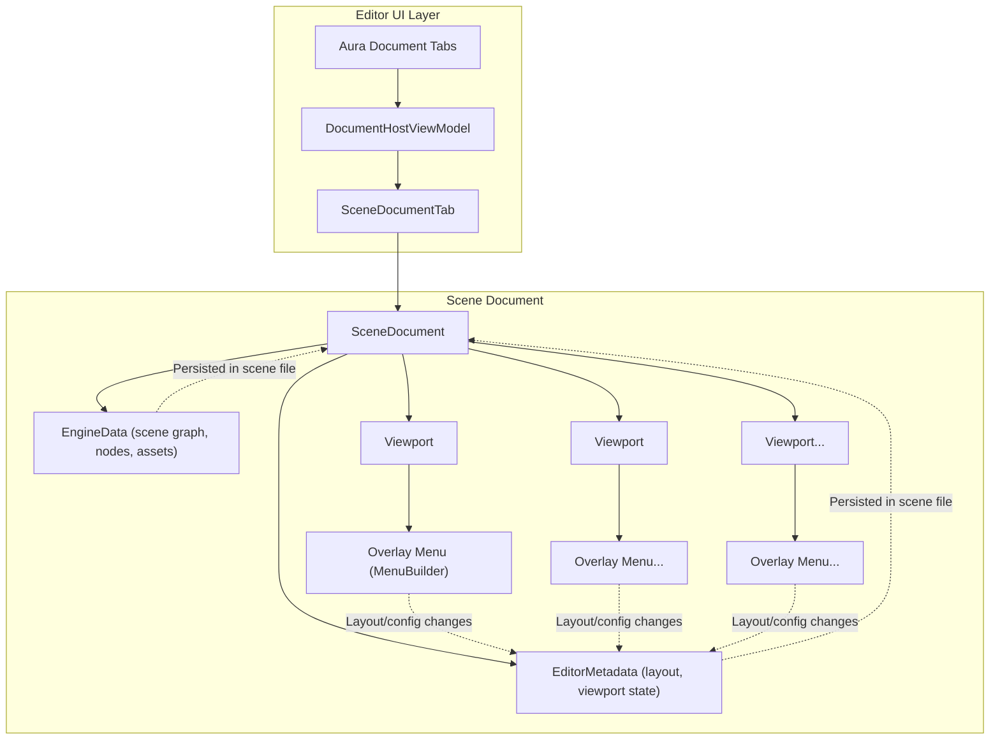

# World Editor Scene Document & Viewport Management

This document describes the architecture for managing scene documents and viewports in the WorldEditor, using Aura document tabs and overlay menus for viewport configuration. Rendering integration is out of scope for this plan.

## Architecture Overview

## Key Concepts

- **Aura Document Tabs**: Used for managing open scene documents in the editor UI.
- **Overlay Menu (MenuBuilder)**: Each viewport has an overlay button that opens a menu for layout and configuration changes.
- **EditorMetadata**: Stores layout and viewport state, persisted in the scene file, separate from engine data.
- **SceneDocument**: Manages its own viewports and layout, reading/writing editor metadata.

## Implementation Steps

1. Define supported viewport layouts and editor metadata structure for scene files.
2. Refactor `SceneDocument` to manage layouts, viewports, and editor metadata.
3. Integrate overlay menu (MenuBuilder) into each viewport for layout/configuration changes.
4. Ensure all editor state is persisted in the scene file, separate from engine data.

## Further Considerations

- Keep this document up to date as implementation progresses.
- Document any changes to scene file format and editor metadata.
