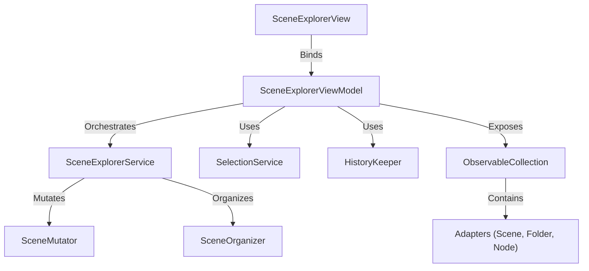

# Scene Explorer Redesign

## 1. Executive Summary

The Scene Explorer is a critical component of the World Editor, providing a hierarchical view of the Scene. The current implementation suffers from "God Class" bloating in the ViewModel, complex coupling between Scene Graph (Model) and Explorer Layout (UI), and a lack of robust features like Drag & Drop and Undo/Redo.

This redesign proposes a clean, SOLID architecture that separates concerns, leverages the `DynamicTree` control's capabilities (as seen in the Demo App), and treats the Explorer Layout as a strict overlay on the Scene Graph.

## 2. Core Concepts

### 2.1. The Dual Hierarchy

The Scene Explorer must reconcile two hierarchies:

1. **Scene Graph (Model)**: The physical transformation hierarchy.
    - Source of Truth: `Scene.RootNodes` and `SceneNode.Children`.
    - Determines world position and transformation inheritance.
2. **Explorer Layout (UI)**: The visual organization.
    - Source of Truth: `Scene.ExplorerLayout` (JSON-serializable list of `ExplorerEntryData`).
    - Allows grouping nodes into **Folders**.
    - **Constraint**: The Layout is an *overlay*. It cannot violate the Scene Graph. A Folder exists *within* a specific scope (Root or a specific Parent Node). It can only contain nodes that belong to that scope.

### 2.2. Folders as UI Artifacts

- Folders do not exist in the Scene Graph.
- Folders do not affect transformations.
- Folders are purely for organizing lists of children in the UI.
- **Rule**: If Node A is in Folder F, and Folder F is "inside" Node B, then Node A *must* be a child of Node B in the Scene Graph.

## 3. Architecture

The new design adopts a layered architecture:



### 3.1. SceneExplorerViewModel (The Orchestrator)

- **Responsibility**: UI Logic, Command handling, Selection management, Interaction with `DynamicTree`.
- **Inheritance**: `DynamicTreeViewModel`.
- **Key Dependencies**:
  - `ISceneExplorerService`: Facade for all model/layout operations.
  - `ISelectionService`: Shared selection state.
  - `IHistoryKeeper`: Undo/Redo stack.
  - `IClipboardService`: Copy/Paste.
- **Key Properties**:
  - `SceneAdapter Scene`: The root of the tree.
  - `SelectionMode`: Configured to Multiple.
- **Events**: Handles `ItemMoved`, `ItemRemoved`, `ItemRenamed` (from `DynamicTreeViewModel`).

### 3.2. SceneExplorerService (The Business Logic)

- **Responsibility**: Encapsulates complex operations that involve both Scene Graph and Layout.
- **Methods**:
  - `CreateNode(parent, name)`
  - `CreateFolder(parent, name)`
  - `MoveItem(item, newParent, index)`: Handles "Move Node to Node", "Move Node to Folder", "Move Folder to Folder".
  - `DeleteItems(items)`
  - `RenameItem(item, newName)`
- **Logic**:
  - When moving a Node to a Folder, it checks if that Folder is in a different Scene Parent. If so, it performs a **Reparent** (Scene Mutation) *and* a **Layout Update**.
  - Ensures atomicity of operations for Undo/Redo.

### 3.3. Adapters (The View Model Wrappers)

Adapters should be lightweight and focused on exposing data to the View.

- **`SceneAdapter`**: The root.
- **`SceneNodeAdapter`**: Wraps `SceneNode`.
  - **Interfaces**: `ITreeItem`, `ICanBeCloned`.
  - **Lazy Loading**: Delegates loading children to a helper or service.
  - **Properties**: `Name`, `IsVisible`, `IsLocked`, `Components`.
  - **Cloning**: `CloneSelf()` returns a new adapter with the same properties but no connections.
- **`FolderAdapter`**: Wraps `ExplorerEntryData` (type=Folder).
  - **Interfaces**: `ITreeItem`, `ICanBeCloned`.
  - **Properties**: `Name`.
  - **Children**: Can contain `SceneNodeAdapter` or `FolderAdapter`.
  - **Cloning**: `CloneSelf()` returns a new folder adapter.

## 4. Detailed Design & Best Practices

### 4.1. Drag & Drop (The "Move" Operation)

Following the Demo App, we leverage `DynamicTreeViewModel.ItemMoved`.

1. **User Action**: Drags Item A to Item B.
2. **Tree Control**: Updates UI, fires `ItemMoved`.
3. **ViewModel**:
    - Receives `ItemMoved(item, oldParent, newParent, newIndex)`.
    - Calls `SceneExplorerService.MoveItem(item, newParent, newIndex)`.
4. **Service**:
    - Analyzes the move.
    - **Case 1: Node -> Node**: Reparent in Scene Graph. Remove from old Layout location. Add to new Layout location (defaulting to end or specific index).
    - **Case 2: Node -> Folder**:
        - Find the "Scene Parent" of the target Folder.
        - If different from Node's current parent -> Reparent in Scene Graph.
        - Update Layout: Move `ExplorerEntryData` to the Folder's children list.
    - **Case 3: Folder -> Folder**: Update Layout only.
    - **Validation**: Prevent cycles, prevent moving Folder into itself.
5. **Undo/Redo**: The Service returns an `IChange` or records it directly to History.

### 4.2. Copy / Cut / Paste

The `DynamicTree` control provides built-in support for Copy/Cut/Paste via the `ICanBeCloned` interface.

1. **Internal Copy/Paste**:
   - **Mechanism**: `DynamicTreeViewModel` handles the clipboard state.
   - **Requirement**: Adapters must implement `ICanBeCloned`.
   - **Process**:
     - `Copy`: Calls `CloneSelf()` on selected items. Stores clones in internal clipboard.
     - `Paste`: Reconstructs hierarchy from clones and inserts them into the target.
   - **Scene Logic**: When a `SceneNodeAdapter` is pasted, the `SceneExplorerService` must be notified to create the corresponding `SceneNode` in the Scene Graph (cloning the underlying model data).

2. **External Copy/Paste (Future)**:
   - JSON serialization is used for persisting scenes to disk or potentially for text-based clipboard operations, but is distinct from the internal tree copy/paste mechanism.

### 4.3. Undo/Redo (TimeMachine Integration)

We must strictly follow the `TimeMachine` patterns for robust undo/redo.

- **HistoryKeeper**: Use `UndoRedo.Default[SceneExplorerViewModel]` (or shared root).
- **Async Support**: All operations should support `ApplyAsync`.
- **Pattern**:
  - **Do**: Perform the operation immediately (e.g., `Service.MoveItem`).
  - **Record**: Add an `IChange` to `HistoryKeeper` that knows how to *undo* the operation.
  - **Undo**: The `IChange` implementation restores the previous state and records a *redo* change.

**Example (Async Move)**:

```csharp
// In ViewModel.OnItemMoved
await this.service.MoveItemAsync(item, newParent);
this.History.AddChange("Move Item", async () => {
    await this.service.MoveItemAsync(item, oldParent); // Undo
    this.History.AddChange("Redo Move", async () => {
         await this.service.MoveItemAsync(item, newParent); // Redo
    });
});
```

### 4.4. Filtering & Typeahead

- **Filtering**: Implemented in `DynamicTreeViewModel`.
  - `FilterText` property.
  - `FilterPredicate`: Checks `Label` (Name) and potentially Component types (e.g., "Light", "Camera").
- **Typeahead**: Built-in to `DynamicTree`.

### 4.5. Synchronization

Instead of full "Reconciliation" on every change, we use granular updates:

- **Model -> View**: Listen to `Scene` events (`NodeAdded`, `NodeRemoved`). Update Adapters accordingly.
- **View -> Model**: User actions trigger Service calls, which update Model.

## 5. Implementation Plan

### Phase 1: Refactor Adapters

1. Create `SceneNodeAdapter` (replacing `LayoutNodeAdapter` logic).
   - Implement `ICanBeCloned`.
2. Create `FolderAdapter` (simplified).
   - Implement `ICanBeCloned`.
3. Ensure Adapters implement `ITreeItem` correctly and support lazy loading via a provider or internal logic that respects the Layout/Scene merge.

### Phase 2: Implement SceneExplorerService

1. Extract logic from `SceneMutator` and `SceneOrganizer`.
2. Implement `MoveItem` with the complex "Reparent vs Layout Move" logic.
3. Implement `Create/Delete` operations.
4. Ensure all operations generate `IChange` objects for History.

### Phase 3: Update ViewModel

1. Strip down `SceneExplorerViewModel`.
2. Remove direct `SceneOrganizer` calls.
3. Implement `OnItemMoved` to call Service.
4. Implement `Cut/Copy/Paste` commands using Service and `ICanBeCloned`.
5. Integrate `HistoryKeeper` for all operations.

### Phase 4: View Updates

1. Ensure `DynamicTree` bindings are correct.
2. Update DataTemplates for new Adapters.
3. Verify Drag/Drop behavior matches Demo App.

## 6. Open Questions & Solutions

- **Q: How to persist Folder expansion?**
  - **A**: `ExplorerEntryData` has `IsExpanded`. Update this property when TreeItem expands/collapses.
- **Q: What happens to Folders when their parent Node is deleted?**
  - **A**: They are deleted. Folders are part of the Layout *of* that Node.
- **Q: Can I have a Folder with the same name as a Node?**
  - **A**: Yes, but unique IDs are used internally. Visual ambiguity is a user problem, but we can add validation if needed.

## 7. Scene Loading Strategy

The loading process is critical for correctly overlaying the Layout on the Scene Graph.

### 7.1. The Algorithm

1. **Load Layout**: Iterate through `Scene.ExplorerLayout`.
   - **Folder Entry**: Create `FolderAdapter`. Recursively load children.
   - **Node Entry**:
     - Find `SceneNode` by ID (Optimize: Use a Dictionary lookup, not `AllNodes.FirstOrDefault`).
     - If found: Create `SceneNodeAdapter`. Recursively load children defined in the *Layout Entry*.
     - If not found (Orphaned Layout Entry): Discard or mark as error.

2. **Handle Orphans (Graph-First Fallback)**:
   - After loading the Layout, identify any `SceneNode` in `Scene.RootNodes` (and their descendants) that was *not* visited.
   - Add these "Orphaned Nodes" to the Root of the Adapter Tree (or their correct Scene Parent if the parent is visible).
   - *Note*: This ensures that if the Layout is out of sync (e.g., node added via script), it still appears in the Explorer.

### 7.2. Optimization

- **Pre-indexing**: Before loading, build a `Dictionary<Guid, SceneNode>` of all nodes in the scene to make lookups O(1).
- **Lazy Loading**: `FolderAdapter` and `SceneNodeAdapter` should support `LoadChildren` on demand, but for the initial implementation, eager loading of the visible tree might be simpler given the Layout dependency.

## 8. Migration Checklist

Use this checklist to track progress and ensure feature parity.

### Core Infrastructure

- [x] **Adapters**: Implement `SceneNodeAdapter` and `FolderAdapter` with `ITreeItem`.
- [x] **Service**: Create `SceneExplorerService` skeleton.
- [x] **Service**: Implement `SceneExplorerService` methods (Move, Create, Delete).
- [ ] **ViewModel**: Refactor `SceneExplorerViewModel` to use the new Service.

### Loading & Display

- [x] **Load Scene**: Correctly load a scene with existing Folders and Nodes.
- [ ] **Fallback**: Correctly display nodes that are in the Scene Graph but missing from the Layout.
- [ ] **Expansion**: Restore `IsExpanded` state from `ExplorerEntryData`.
- [ ] **Selection**: Support Multi-selection.

### Operations (with Undo/Redo)

- [ ] **Create Node**: Add new node to Root or selected Parent.
- [ ] **Create Folder**: Add new folder.
- [ ] **Rename**: Rename Node (sync to Scene) and Folder (sync to Layout).
- [ ] **Delete**: Remove Node (sync to Engine) and Folder (remove children or move to parent?).
  - *Decision*: Deleting a Folder deletes its content (Standard Explorer behavior).

### Drag & Drop (The Complex Part)

- [ ] **Node -> Node**: Reparent in Scene Graph.
- [ ] **Node -> Folder**:
  - [ ] Visual move in Layout.
  - [ ] Logic check: Does this require a Scene Graph reparent? (Is Folder's scope different from Node's current parent?)
- [ ] **Folder -> Folder**: Move in Layout.
- [ ] **Reordering**: Support inserting at specific index.

### Advanced Features

- [ ] **Copy/Paste**: JSON serialization of Subtrees (Nodes + Layout).
- [ ] **Filtering**: Filter by Name and Type.
- [ ] **Typeahead**: Quick navigation by typing.

## 10. UI Specification

The `SceneExplorerView` will be structured as a vertical stack with three main sections: Filter Panel, Tree View, and Command Toolbar.

### 10.1. Visual Layout Sketch

```text
+---------------------------------------------------------------+
| [Filter Icon v] [ Search Nodes...                   ] [ X ]   |  <-- Filter Panel
+---------------------------------------------------------------+
| v Scene (Root)                                                |  <-- Tree Panel
|   > Folder A                                                  |
|   v Folder B                                                  |
|     > Node 1                                                  |
|     > Node 2                                                  |
|   > Node 3                                                    |
|                                                               |
|                                                               |
|                                                               |
|                                                               |
+---------------------------------------------------------------+
| [ + Node ] [ + Folder ] [ Delete ] | [ Expand ] [ Collapse ]  |  <-- Bottom Toolbar
+---------------------------------------------------------------+
```

### 10.2. Component Details

#### A. Filter Panel (Top)

- **Filter Menu Button** (`MenuButton`):
  - Icon: Filter (`&#xE71C;`)
  - Dropdown Menu: Checkboxes for "Light", "Camera", "Geometry", "Audio".
- **Search Box** (`TextBox`):
  - Placeholder: "Filter by name..."
  - Behavior: Updates `ViewModel.FilterText` on property change.
- **Clear Button** (`ToolBarButton`):
  - Icon: Cancel (`Symbol.Cancel`)
  - Action: Clears text and resets filter checkboxes.

#### B. Tree Panel (Center)

- **Control**: `DynamicTree`
- **Border**: Thin border (`CardStrokeColorDefaultBrush`) with rounded corners.
- **Templates**:
  - **Scene**: Icon + "Scene Name"
  - **Folder**: Folder Icon (Open/Closed state) + "Folder Name"
  - **Node**: Entity Icon (based on components) + "Node Name"
- **Interaction**:
  - **Drag & Drop**: Visual feedback for reordering and reparenting.
  - **In-Place Edit**: Double-click to rename.
  - **Context Menu**: Right-click for Cut/Copy/Paste, Delete, Rename, Create Child.

#### C. Bottom Toolbar (Bottom)

- **Control**: `dnc:ToolBar`
- **Primary Items**:
  1. **New Node** (`AddEntityCommand`):
     - Icon: Add (`Symbol.Add`)
     - Tooltip: "Create a new node under selected parent"
  2. **New Folder** (`CreateFolderFromSelectionCommand`):
     - Icon: FolderAdd (`&#xE8F4;`)
     - Tooltip: "Group selected items into a new folder"
  3. **Delete** (`RemoveSelectedItemsCommand`):
     - Icon: Delete (`Symbol.Delete`)
     - Tooltip: "Delete selected items"
  4. **Separator**
  5. **Expand All** (`ExpandAllCommand`):
     - Icon: ExpandAll (`&#xE8A9;` or similar)
     - Tooltip: "Expand all items"
  6. **Collapse All** (`CollapseAllCommand`):
     - Icon: CollapseAll (`&#xE8AA;` or similar)
     - Tooltip: "Collapse all items"

### 10.3. Keyboard Shortcuts

#### Built-in (Handled by DynamicTree)

These are provided out-of-the-box by the `DynamicTree` control and do not need re-implementation, but should be verified:

- **F2**: Rename selected item.
- **Delete**: Delete selected items.
- **Ctrl+C**: Copy (via `ICanBeCloned`).
- **Ctrl+X**: Cut (via `ICanBeCloned`).
- **Ctrl+V**: Paste (via `ICanBeCloned`).
- **Arrow Keys**: Navigation (Up/Down/Left/Right).
- **Enter**: Toggle expansion state (if configured).

#### Scene Explorer Specific (To Implement)

These must be bound to commands in the `SceneExplorerViewModel`:

- **Ctrl+G**: Group selected items into a new folder.
- **Ctrl+Shift+E**: Expand All (Recursive).
  - *Behavior*: Expands the selected node and all its descendants. If nothing is selected, expands the entire tree.
- **Ctrl+Shift+W**: Collapse All (Recursive).
  - *Behavior*: Collapses the selected node and all its descendants. If nothing is selected, collapses the entire tree.
- **Ctrl+Z**: Undo (Global Application Shortcut, handled by `TimeMachine`).
- **Ctrl+Y**: Redo (Global Application Shortcut, handled by `TimeMachine`).

## 11. References

These files serve as the "Gold Standard" for implementation patterns:

- **Tree Control Demo (Best Practices)**:
  - ViewModel: `projects\Controls\DemoApp\Tree\ProjectLayoutViewModel.cs`
  - View: `projects\Controls\DemoApp\Tree\ProjectLayoutView.xaml`
- **Cloning Interface**:
  - `projects\Controls\DynamicTree\src\DynamicTreeItem\ICanBeCloned.cs`
- **Undo/Redo Documentation**:
  - `projects\TimeMachine\README.md`
