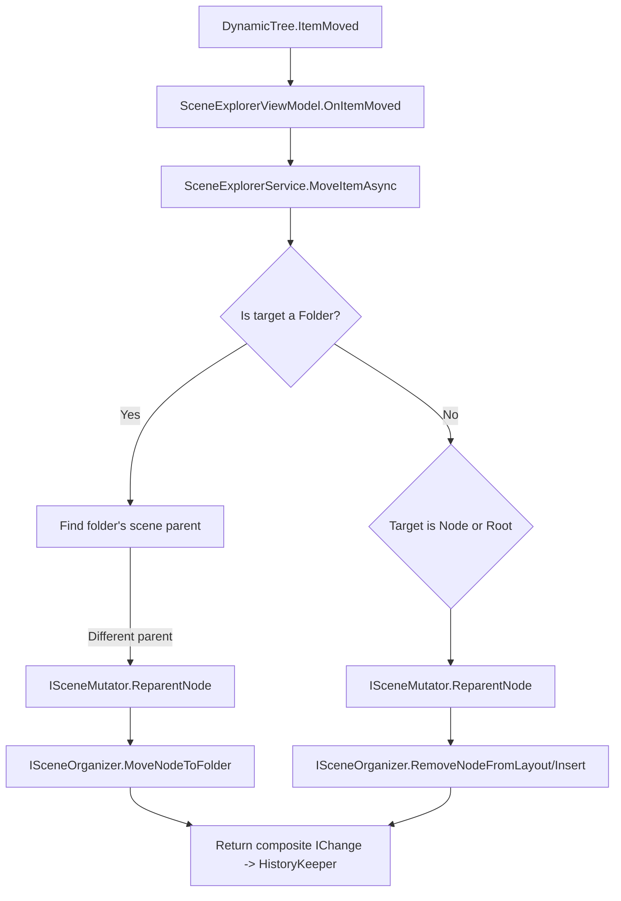

# Scene Explorer Operations — Specification & Roadmap

Status: Draft

This document inventories and specifies all operations currently implemented in the Scene Explorer, categorizes them into UI interactions, layout (organizer) operations, and scene mutations (mutator), and proposes a roadmap and best-practice recommendations for missing or improved behavior.

Relevant sources

- Service and orchestration: [SceneExplorerService.cs](projects/Oxygen.Editor.World/src/SceneExplorer/Services/SceneExplorerService.cs#L1-L200)
- Layout/Organizer: [ISceneOrganizer.cs](projects/Oxygen.Editor.World/src/SceneExplorer/Operations/ISceneOrganizer.cs#L1-L120), [SceneOrganizer.cs](projects/Oxygen.Editor.World/src/SceneExplorer/Operations/SceneOrganizer.cs#L1-L200)
- Mutations/Graph: [ISceneMutator.cs](projects/Oxygen.Editor.World/src/SceneExplorer/Operations/ISceneMutator.cs#L1-L120), [SceneMutator.cs](projects/Oxygen.Editor.World/src/SceneExplorer/Operations/SceneMutator.cs#L1-L200)
- UI and VM entry points: [SceneExplorerViewModel.cs](projects/Oxygen.Editor.World/src/SceneExplorer/SceneExplorerViewModel.cs#L1-L160), [SceneExplorerView.xaml](projects/Oxygen.Editor.World/src/SceneExplorer/SceneExplorerView.xaml#L1-L140)
- Adapters and layout items: [SceneAdapter.cs](projects/Oxygen.Editor.World/src/SceneExplorer/SceneAdapter.cs#L1-L200), [SceneNodeAdapter.cs](projects/Oxygen.Editor.World/src/SceneExplorer/SceneNodeAdapter.cs#L1-L120), [FolderAdapter.cs](projects/Oxygen.Editor.World/src/SceneExplorer/FolderAdapter.cs#L1-L160), [LayoutItemAdapter.cs](projects/Oxygen.Editor.World/src/SceneExplorer/LayoutItemAdapter.cs#L1-L200)

Goal

- Provide a precise, machine-readable human-facing specification of supported operations, inter-dependencies between layers, failure modes, undo/redo expectations, and recommended best practices and tests.

Audience

- Editor developers, code reviewers, and QA engineers.

Terminology

- UI Action: interaction initiated by a human via the UI (clicks, drag & drop, keyboard).
- Layout operation (Organizer): operations that change the explorer's layout model (folders, ordering). These MUST NOT mutate the runtime scene graph.
- Mutation operation (Mutator): operations that mutate the runtime scene graph (scene nodes, parent/child relationships).
- Engine sync: asynchronous calls that apply model changes to the running engine (spawning resources, attaching/detaching render objects).

High-level inventory

- UI interactions (implemented): Create node, Create folder, Rename, Delete, Drag & Drop move, Cut/Copy/Paste (basic), Select, Expand/Collapse, Undo/Redo, Multi-select moves, Keyboard accelerators (Del, Ctrl+Z, Ctrl+Y).
- Layout operations (implemented): CreateFolder, MoveFolderToParent, RemoveFolder (promote children optional), MoveNodeToFolder, RemoveNodeFromFolder, RemoveNodeFromLayout, CloneLayout, GetExpandedFolderIds, ReconcileLayoutAsync, EnsureLayoutContainsNodes, BuildFolderOnlyLayout, FilterTopLevelSelectedNodeIds.
- Mutation operations (implemented): CreateNodeAtRoot, CreateNodeUnderParent, RemoveNode, RemoveHierarchy, ReparentNode, ReparentHierarchies.

Detailed specifications

Separation of responsibilities

- SceneExplorerService orchestrates operations and is the single place where UI events map to organizer and mutator calls. See [SceneExplorerService.cs](projects/Oxygen.Editor.World/src/SceneExplorer/Services/SceneExplorerService.cs#L1-L200).
- ISceneMutator is synchronous, modifies the scene model (graph), returns a change record for engine-sync callers to act upon. See [ISceneMutator.cs](projects/Oxygen.Editor.World/src/SceneExplorer/Operations/ISceneMutator.cs#L1-L120).
- ISceneOrganizer manipulates the explorer layout only and exposes reconciliation features for adapters. See [ISceneOrganizer.cs](projects/Oxygen.Editor.World/src/SceneExplorer/Operations/ISceneOrganizer.cs#L1-L120).

## UI Interactions (entry/exit contracts)

Create Node (UI)

- Initiator: `AddEntity` command in `SceneExplorerViewModel`.
- Summary: VM creates a `SceneNode` + `SceneNodeAdapter` to update UI, `OnItemAdded` triggers `SceneExplorerService.AddNodeAsync`.
- Service behavior: uses `ISceneMutator.CreateNodeAtRoot` or `CreateNodeUnderParent`, may call `sceneOrganizer.MoveNodeToFolder` if created in a folder, and issues engine sync if `SceneNodeChangeRecord.RequiresEngineSync == true`.
- Failure modes: invalid parent, unresolved scene (service throws InvalidOperationException or returns null), engine sync failures should be logged and propagated or retried by the engine-sync subsystem.

Create Folder (UI)

- Initiator: `CreateFolder` command in VM.
- Summary: VM inserts a `FolderAdapter`, then `SceneExplorerService.CreateFolderAsync` calls `sceneOrganizer.CreateFolder` to mutate layout.
- Postcondition: `Scene.ExplorerLayout` contains the new folder entry and the method returns the folder id.

Rename (UI)

- Initiator: Rename dialog in view or `RenameSelected` command.
- Behavior: For nodes, set `SceneNode.Name`; for folders, set `FolderAdapter.Label` and call `sceneOrganizer.RenameFolder` if scene present.

Delete (UI)

- Initiator: `RemoveSelectedItems`.
- Behavior: For nodes: `sceneMutator.RemoveNode` (returns change record), `sceneEngineSync.RemoveNodeAsync` if engine sync required, then `sceneOrganizer.RemoveNodeFromLayout`. For folders: `sceneOrganizer.RemoveFolder(folderId, promote: false, scene)`.
- Undo: VM registers insertion undo for removed items.

Move / Drag & Drop

- Initiator: Drag & drop in `DynamicTree`.
- Behavior: `OnItemMoved` handles moves in batches; `SceneExplorerService.UpdateMovedItemsAsync` loops moves and calls `MoveItemAsync` which decides:
  - If moving to Scene root or another node => use `ISceneMutator` to reparent (CreateNodeAtRoot/CreateNodeUnderParent) and `ISceneOrganizer.RemoveNodeFromLayout`.
  - If moving to a Folder => ensure lineage, reparent to folder parent as necessary, then `ISceneOrganizer.MoveNodeToFolder`.
- Lineage validation: Implemented by `SceneOrganizer.IsNodeUnderFolderLineage` to prevent invalid placements that violate scene graph hierarchy.

Copy / Cut / Paste

- Current behavior: VM uses adapter-level `CloneSelf()` and pastes clones via normal Insert flow. Note: `SceneNodeAdapter.CloneSelf()` returns an adapter referencing the same payload — this is shallow and ambiguous for copy semantics.

---

## UI Operations — Complete Catalog (MUST / Nice-to-have / Cool)

This section refines supported and recommended UI operations, classifies each operation by priority, and states precise contracts, constraints, and expected semantics (scope: Single / Multi / Folder / Scene).

### MUST (required for a robust editor)

- Select / Deselect
  - Scope: Single, Multi
  - Description: Select items; multi-selection supported via `SelectionMode.Multiple`. Selection changes must emit `SceneNodeSelectionChangedMessage`.
  - Constraints: Selection must respect `IsLocked` or other access controls; operations that require unlocked items must check selection.
  - Undo: not applicable.
  - UI binding: Not a command; selection is a UI state change. Expose selection via VM properties/events (`SelectionModel`, `SceneNodeSelectionChangedMessage`).

- Expand / Collapse (Folders & Nodes)
  - Scope: Single (per-folder/node)
  - Description: Toggle expansion state; expansion persisted in `ExplorerEntryData.IsExpanded` and used by `GetExpandedFolderIds` and `ReconcileLayoutAsync(preserveNodeExpansion:true)`.
  - Constraints: UI must provide efficient iteration to collect expanded IDs (use adapter cache as implemented by `SceneAdapter.GetExpandedFolderIds`).
  - UI binding: Prefer event-driven (double-click or toggle icon) handled by adapter; no RelayCommand required. Expose methods on VM if external callers need to expand/collapse programmatically.

- Create Node
  - Scope: Single
  - Description: Create a new scene node under current selection or root; create adapter then call service to add to scene; must return a `SceneNodeChangeRecord` with engine-sync flag.
  - Constraints: Only allowable when a valid scene is resolved; parents must be compatible; name validation via `ValidateItemName`.
  - Undo: Add inverse (remove); must restore layout and engine state.
  - UI binding: MUST be a `RelayCommand` (e.g., `AddEntityCommand`) with `CanExecute` bound to `CanAddEntity()` to handle selection validation and enable/disable state.
  - VM API method: Provide a public `AddEntityAsync(ITreeItem? parent = null, string? name = null)` to allow programmatic creation and to be called by the generated command handler.

  Redesign mapping / Service contract:

  - The UI MUST call `SceneExplorerService.AddEntityAsync(ITreeItem? parent = null, string? name = null)` instead of interacting directly with the `ISceneMutator`/`ISceneOrganizer`. The service will:
    - Validate the parent and name.
    - Call `ISceneMutator.CreateNodeAtRoot` or `CreateNodeUnderParent`.
    - If created in a folder, call `ISceneOrganizer.MoveNodeToFolder`.
    - Return a `SceneNodeChangeRecord` and an `IChange` suitable for `HistoryKeeper` registration.

  Acceptance tests (examples):

  - Create node at root when no selection: asserts a new `SceneNode` exists in `Scene.RootNodes`, a minimal `SceneNodeChangeRecord` is returned, and an `IChange` undo restores previous state.
  - Create node under parent node: asserts `SceneNode.Parent` is set, layout unchanged unless a folder is selected (then layout updated).

- Create Folder
  - Scope: Single (under folder / node / root)
  - Description: Create an explorer-only folder; call organizer `CreateFolder` which returns `LayoutChangeRecord`.
  - Constraints: Parent must be single selection (root/folder/node); folder IDs are stable and returned to caller.
  - Undo: Remove folder and restore previous layout snapshot.
  - UI binding: SHOULD be a `RelayCommand` (`CreateFolderCommand`) because it is user-invoked via toolbar/context menu and has an easy `CanExecute` condition; the command should call a VM API `CreateFolderAsync(ITreeItem parent, string name)` to perform the operation.

  Redesign mapping / Service contract:

  - The UI MUST call `SceneExplorerService.CreateFolderAsync(ITreeItem parent, string name)`; this method returns the `Guid` of the created folder and an `IChange` for undo. The `ISceneOrganizer` remains authoritative for layout-only operations; `CreateFolderAsync` delegates to it and does not mutate the scene graph.

  Acceptance tests (examples):

  - Create folder at root and under a node: asserts layout updated, folder id stable, and undo restores previous layout.

- Rename
  - Scope: Single
  - Description: Rename nodes or folders; update scene model or layout respectively.
  - Constraints: Check `IsLocked` and perform input validation. Do not trigger engine sync for folder renames.
  - Undo: Add inverse rename.
  - UI binding: SHOULD be exposed as a `RelayCommand` (`RenameSelectedCommand`) that triggers a dialog in the View. Also provide `RenameItemAsync(ITreeItem item, string newName)` on the VM for programmatic and testable invocation (this method already exists).

- Delete / Remove
  - Scope: Single, Multi
  - Description: Delete selected nodes and/or folders. For nodes, call `sceneMutator.RemoveNode` (or `RemoveHierarchy`) then `sceneOrganizer.RemoveNodeFromLayout`. For folders, call `RemoveFolder` with appropriate promotion behavior.
  - Constraints: Confirm destructive actions if multiple or if nodes have dependent runtime resources; locked items cannot be deleted.
  - Atomicity: Multi-delete should be transactional from the user's perspective: either complete or fail with partial rollback/clear explanation.
  - Undo: Restore nodes and layout entries; ensure engine state is restored upon undo.
  - UI binding: MUST be a `RelayCommand` (`RemoveSelectedItemsCommand`) with `CanExecute` that inspects `HasUnlockedSelectedItems`. Also expose a public `DeleteItemsAsync(IEnumerable<ITreeItem> items)` API method on the service/VM for programmatic deletion (already present in the service).

- Move (Drag & Drop)
  - Scope: Single, Multi
  - Description: Dragging items may cause layout changes (move into folder), reparenting (move to another node/root), or folder reparent operations.
  - Constraints: Must enforce lineage constraints (`IsNodeUnderFolderLineage`), prevent moving a node into its own descendant, and prevent cross-scene moves unless explicitly supported.
  - Atomicity: Multi-item moves are a single logical operation; maintain relative order where applicable.
  - Undo: Move back to original parent(s) and indices.
  - UI binding: Not a single RelayCommand—drag & drop is handled by the `DynamicTree` control and results in `ItemMoved` events. The VM should provide a public `MoveItemAsync(ITreeItem item, ITreeItem newParent, int index)` method (which exists via `SceneExplorerService.MoveItemAsync`) to be invoked by the service; expose a thin VM wrapper for testability.

  Redesign mapping / Service contract:

  - The `ItemMoved` event MUST be handled by `SceneExplorerViewModel` and forwarded to `SceneExplorerService.MoveItemAsync(ITreeItem source, ITreeItem targetParent, int index)` (or a batch variant for multi-moves). `MoveItemAsync` is responsible for:
    - Resolving the effective scene parent for folders.
    - Validating lineage and preventing cycles.
    - Calling `ISceneMutator.ReparentNode` when the move requires a model change.
    - Calling `ISceneOrganizer.MoveNodeToFolder` or `MoveFolderToParent` for layout updates.
    - Returning a composite `IChange` that records old/new parent and indices for undo/redo.

  Failure and atomicity tests:

  - Multi-item move that includes ancestor+descendant in selection: ensure the service filters top-level selected nodes and moves them atomically; on engine-sync failure mid-transaction, changes are rolled back.
  - Attempt to move node into its own descendant: service rejects the operation with `InvalidOperationException` and no partial changes are applied.

- Cut / Copy / Paste
  - Scope: Single, Multi
  - Description: Cut = remove and place into clipboard (move); Copy = clone into clipboard (duplicate semantics). Paste inserts clones into the target parent using the normal add flow.
  - Constraints: Clipboard must store serializable deep-copy or an operation that will produce an independent node (unique IDs) on paste. Shallow clones are insufficient; the spec recommends implementing a deep-duplicate operation in the service layer (see Roadmap).
  - Undo: Paste and cut should be undoable. Cut should be redoable (i.e., re-cut then paste or vice versa).
  - UI binding: Expose `CutCommand`, `CopyCommand`, `PasteCommand` as `RelayCommand`s with proper `CanExecute` logic (`CanCut`, `CanCopy`, `CanPaste`). Implement copy/cut/paste logic in VM and call into a VM `PasteAsync(ITreeItem parent)` method for programmatic use.

  Redesign mapping / Service contract:

  - `Copy` MUST store a deep-serializable representation of the selected nodes in an internal clipboard. `Paste` MUST call `SceneExplorerService.CopyPasteAsync(IEnumerable<ClipboardEntry> entries, ITreeItem targetParent, int? index = null)` which:
    - Calls `SceneMutator.CloneNodeDeep` for each entry, creating independent nodes with new GUIDs.
    - Inserts layout entries via `ISceneOrganizer` (insertion index optional but recommended for deterministic behavior).
    - Returns a single composite `IChange` that can undo the paste (remove created nodes and layout entries).

  Acceptance tests:

  - Copy/paste single node: new node exists with different GUID, components deep-cloned, and undo removes it.
  - Copy/paste hierarchy: subtree preserved and unique IDs assigned.

- Duplicate (friendly name: Duplicate / Ctrl+D)
  - Scope: Single (Nice-to-have) but MUST for good UX
  - Description: Deeply duplicate a node (payload and components), insert sibling copy, and ensure unique names / ids. Prefer `DuplicateNodeAsync` service API.
  - Constraints: Should be a single atomic operation from model to engine sync.
  - Undo: Remove duplicated node(s).
  - UI binding: SHOULD be a `RelayCommand` (`DuplicateCommand`) which calls a VM API `DuplicateNodeAsync(Guid sourceNodeId, ITreeItem? parent)`. Since duplication requires model-level cloning, implement in service/mutator layer and return new node id for adapter mapping.

  Redesign mapping / Service contract:

  - `DuplicateCommand` maps to `SceneExplorerService.DuplicateNodeAsync(Guid sourceNodeId, ITreeItem? parent, string? newName = null)`. The service uses `SceneMutator.CloneNodeDeep` and returns the new node id(s) and an `IChange` for undo/redo.

  Acceptance tests:

  - Duplicate node with components: new node is a deep copy (distinct GUIDs), undo removes duplicated node, redo re-creates it with expected properties.

- Undo / Redo
  - Scope: Global
  - Description: Full undo/redo stack for user operations; changes are grouped for batch moves.
  - Constraints: Ensure that undo operations properly sequence organizer and mutator calls to restore both layout and runtime graph correctly.
  - UI binding: Expose `UndoCommand` and `RedoCommand` as `RelayCommand`s (or use existing `UndoRedo.Default` helpers). Also provide public `UndoAsync()` / `RedoAsync()` VM methods for programmatic control.

  Redesign mapping / Service contract:

  - All operations that change model or layout MUST either return an `IChange` or the `SceneExplorerService` MUST push an `IChange` to the `HistoryKeeper` after successful completion. Composite operations MUST return composite `IChange`s that sequence the organizer and mutator undos in the correct order (mutator undo may need to run before organizer undo in some cases; the order must be documented per operation).

  Test coverage for history:

  - Move (model + layout) is undone by invoking the composite `IChange`; verify scene graph and layout exactly match pre-move state.
  - Engine-sync failure after operation but before `IChange` registration: service must either record a compensating `IChange` or prevent registration until sync completes successfully; tests must verify visible UIs are consistent.

- Keyboard accelerators & Context menu
  - Scope: Global / Contextual
  - Description: Keybindings for Delete, Undo/Redo, Rename, Cut/Copy/Paste, Duplicate; context menu for node/folder actions.
  - Constraints: Commands must be disabled when action not permitted (locked, no selection, invalid parent).
  - UI binding: Keyboard accelerators should invoke the generated `RelayCommand`s. Context menu items should bind to commands where possible; otherwise call VM methods. Ensure all commands expose `CanExecute` state for enable/disable UI feedback.

- Selection-based Bulk Actions
  - Scope: Multi
  - Description: Operations act on filtered top-level selected IDs (`FilterTopLevelSelectedNodeIds`) to avoid duplicating work on children.
  - Constraints: Preserve hierarchy semantics (do not operate on both ancestor and descendant simultaneously).
  - UI binding: Bulk actions are exposed as `RelayCommand`s that operate over `GetSelectedItems()`; ensure commands accept no-arg invocation and use VM helper methods to enumerate top-level IDs.

### NICE TO HAVE (improves productivity)

- Frame/Focus in Scene View
  - Scope: Single
  - Description: Center or frame the selected node(s) in the 3D scene viewport.
  - Integration: Requires a message or router to the Scene View component (e.g., send a FrameRequestMessage).

- Add / Remove Component (inspector-driven)
  - Scope: Single
  - Description: Expose add/remove components from node context; can be executed from explorer or inspector.
  - Constraints: Changing components may require engine sync and must be undoable.

- Move Up / Move Down (within same parent or folder)
  - Scope: Single
  - Description: Change ordering within a parent list to control render or UX order.
  - Implementation: Organizer should support index-based insertion.

- Inline Multi-rename
  - Scope: Multi
  - Description: Batch rename pattern (name + index token) for selected nodes.

- Quick Duplicate & Offset (duplicate and nudge transform)
  - Scope: Single
  - Description: Duplicate and move transform slightly for level-editing workflows.

### COOL IF TIME ALLOWS (delighters & advanced features)

- Group / Prefab creation from selection
  - Scope: Multi
  - Description: Create a reusable prefab or group from selection, store reference, and allow instantiation.

- Drag to Scene to instantiate (placement)
  - Scope: Single
  - Description: Drag an adapter from explorer into scene viewport to spawn a runtime instance with placement preview.

- Cross-scene copy/transfer with dependency resolution
  - Scope: Single/Multi
  - Description: Copy nodes across scenes with automatic asset and reference handling.

- Tagging, filtering, and advanced search
  - Scope: Scene-wide
  - Description: Apply tags/filters to quickly find and operate on nodes.

---

Constraints & Contracts (global)

- Locking & Access Control: All UI actions MUST respect `IsLocked` or other permissioning. Attempting a forbidden action should keep the action disabled and show a clear reason if attempted.

- Atomicity & Transactional Semantics: Multi-item operations (move, delete, paste) MUST be grouped as single logical transactions for undo/redo. When engine sync fails mid-transaction, the system should either roll back the model change or present a recoverable error and offer retry/rollback operations.

- Staleness Handling: UI flows must resolve stale references by ID where possible (as `MoveItemAsync` does); however cross-scene references should be rejected unless explicitly supported.

- Lineage Rules: Moves into folders must respect folder->node lineage constraints (`IsNodeUnderFolderLineage`). The organizer must validate and the UI should prevent invalid drop targets.

- Accessibility & Keyboard Navigation: All actions should be accessible via keyboard and have sufficient focus management to support screen readers and non-mouse workflows.

- Observability: All user-initiated operations should emit consistent logs and metrics for debugging and telemetry.

Testing guidance (UI)

- For each MUST operation, implement UI-level tests that simulate user actions and assert resulting model state, layout state, undo/redo behavior, and that engine sync calls are invoked when expected.
- For multi-item moves/deletes, write tests that cover conflicting selection shapes (ancestors + descendants), and ensure `FilterTopLevelSelectedNodeIds` semantics hold.
- Add integration tests that tie `SceneExplorerService`, `ISceneMutator`, and `ISceneOrganizer` to validate end-to-end behavior.

## Layout (Organizer) operations — contract & invariants

APIs (primary)

- `CreateFolder(Guid? parentFolderId, string name, Scene scene, Guid? folderId = null, Guid? parentNodeId = null)` — create folder under root, folder, or node.
- `MoveNodeToFolder(Guid nodeId, Guid folderId, Scene scene)` — remove node entry(s) and insert into folder; validates lineage.
- `RemoveNodeFromFolder(Guid nodeId, Guid folderId, Scene scene)` — remove node entry from specific folder.
- `RemoveNodeFromLayout(Guid nodeId, Scene scene)` — remove all references to node across layout.
- `MoveFolderToParent(Guid folderId, Guid? newParentFolderId, Scene scene)` — reparent folder.
- `RemoveFolder(Guid folderId, bool promoteChildrenToParent, Scene scene)` — remove folder with optional promotion.
- `RenameFolder(Guid folderId, string newName, Scene scene)` — rename folder entry.
- `InsertNodeIntoParentAtIndex(Guid nodeId, Guid? parentFolderId, int index, Scene scene)` — insert node layout entry at a specific index under a folder or root (recommended for deterministic paste/reorder operations).
- `ReconcileLayoutAsync(SceneAdapter, Scene, layout, ILayoutContext, bool preserveNodeExpansion)` — reconcile adapter tree to layout.

Invariants

- Organizer must not mutate runtime graph (`Scene.RootNodes` or `SceneNode.Parent`).

- Ensure layout entries are normalized (children lists non-null) to allow safe in-place updates.

## Mutator operations — contract & semantics

APIs (primary)

- `CreateNodeAtRoot(SceneNode newNode, Scene scene)` — adds node to root, detach from prior parent.
- `CreateNodeUnderParent(SceneNode newNode, SceneNode parentNode, Scene scene)` — sets parent, removes from root if needed.
- `RemoveNode(Guid nodeId, Scene scene)` — remove node and detach it from any parent.
- `RemoveHierarchy(Guid rootNodeId, Scene scene)` — detach hierarchy root.
- `ReparentNode(Guid nodeId, Guid? oldParentId, Guid? newParentId, Scene scene)` — reparent node, manages root membership.
- `ReparentHierarchies(IEnumerable<Guid> nodeIds, Guid? newParentId, Scene scene)` — bulk reparent.
- `CloneNodeDeep(SceneNode sourceNode, Guid? parentOverride, Scene scene)` — create a deep copy of a node and its components, remap internal references to new GUIDs, and return a `SceneNodeChangeRecord` for the created node(s). This helper is required by Copy/Paste and Duplicate flows.

Change records

- `SceneNodeChangeRecord` includes `OperationName`, `AffectedNode`, `OldParentId`, `NewParentId`, `RequiresEngineSync`, and flags for root node additions/removals. Consumers (SceneExplorerService) call engine sync when `RequiresEngineSync == true`.

Recommended composite change type:

- `CompositeIChange` — a composite `IChange` type that contains ordered sub-changes for organizer and mutator operations. Use this for atomic operations that touch both layout and model (for example, reparent + folder-move). A `CompositeIChange` should implement `ApplyAsync` and `RevertAsync`, specifying the order in which sub-changes are applied and reverted.

Edge cases & failure modes

Edge cases & failure modes

This section enumerates common failure modes, the *required* behavior of the `SceneExplorerService`, `ISceneMutator`, and `ISceneOrganizer`, and concrete test expectations. Each failure case includes: detection, immediate reaction, how errors are surfaced to the UI, and undo/rollback semantics.

- Stale object graphs / missing nodes
  - Detection: The service resolves node and folder IDs against the current `Scene` dictionary; missing IDs indicate stale references.
  - Behavior: The operation MUST fail fast with `InvalidOperationException` (or a typed `StaleReferenceException` if available). For non-destructive queries (e.g., layout reconciliation), missing nodes should be logged and the layout should keep orphans in a visible "Orphaned" area (configurable). For destructive operations (move/delete), the operation must abort with no partial side-effects.
  - UI: Show an actionable error message: "Operation failed: item no longer exists in the scene." Offer a "Refresh Explorer" button if reconciliation is possible.
  - Tests: Simulate stale id on `MoveItemAsync` and assert no model changes are applied and `InvalidOperationException` is thrown.

- Non-existent target folder or invalid parent
  - Detection: Organizer lookups return null when folder id / parent not found.
  - Behavior: Throw `InvalidOperationException` with a clear message. Do not perform partial layout or model changes; any attempted mutator call must be rolled back.
  - UI: Display error: "Target folder not found." (Consider adding 'Report' action if problem is persistent.)
  - Tests: Attempt to move node into deleted folder; assert exception and no layout/model change.

- Permission / Lock violation (IsLocked)
  - Detection: `IsLocked` flags on nodes or scene-level permission checks before executing modifying APIs.
  - Behavior: `SceneExplorerService` must reject operations and return `OperationCanceledException` or `UnauthorizedAccessException` depending on API conventions and expose `CanExecute=false` in the UI when possible to prevent attempted actions.
  - UI: Disable offending commands; if the user forces the action, display a message: "Item is locked or not editable." Offer a link to documentation or the locker ID.
  - Tests: Mark node as locked and assert that `RemoveSelectedItems` and `AddEntityAsync` are disallowed by `CanExecute` and throw when forcibly invoked.

- Engine-sync failure (partial mutation applied)
  - Detection: Mutator returns `SceneNodeChangeRecord.RequiresEngineSync == true`, then `_sceneEngineSync` async call fails (exceptions or timeout).
  - Required behavior:
    - Prefer consistency: if the engine-sync fails, the `SceneExplorerService` MUST either roll back the model/layout changes (if feasible) or leave the model in a safe, well-documented "pending sync" state.
    - The service must log the error, show a friendly message with options: Retry, Rollback, or Keep Local (advanced).
    - The service must not register the operation as a completed `IChange` in `HistoryKeeper` until engine sync succeeds or a deterministic compensating `IChange` is recorded for later recovery.
  - UI: Display a non-blocking error balloon with retry and rollback actions. If rollback succeeds, notify the user. If rollback fails, escalate to a modal with diagnostic info.
  - Tests: Simulate engine-sync throwing an exception after mutator returns change; assert service either rolls back or records pending state and exposes retry API; assert `HistoryKeeper` has no completed entry until resolved.

- Partial failure in batch operations (multi-move, multi-delete)
  - Detection: During a batched operation some items succeed while others fail (validation or engine sync).
  - Required behavior: Operations MUST be atomic from the user's perspective. The service must attempt to either:
    1) Make the entire batch succeed (recommended), or
    2) On failure, rollback changes already applied as part of the batch and report a single failure to the user describing which items failed and why.
  - Implementation note: Use transaction-like semantics — record the inverse operations and apply them in reverse order on failure.
  - Tests: Simulate a multi-delete where the second item fails on engine sync; assert the first item's deletion is rolled back and the final state equals the initial state.

- Invalid lineage / cycle prevention
  - Detection: Attempted move where target parent is descendant of source.
  - Behavior: Reject immediately and throw `InvalidOperationException` with message "Cannot move an item into its descendant." No model/layout changes.
  - Tests: Attempt moving parent into descendant; assert exception and no side effects.

- Name collisions / uniqueness violations
  - Detection: Duplicate names in a parent's child list when name uniqueness is enforced.
  - Behavior: If the system enforces unique names, the service must either auto-resolve (append suffix) or reject with a clear message based on configuration. Provide `RenameResolutionPolicy` (AutoResolve | Reject) in the API or service settings.
  - Tests: Duplicate name scenario under both policies; assert expected behavior.

- Clipboard serialization or clone failures
  - Detection: Serialization exceptions or CloneNodeDeep failure (null refs, missing resources).
  - Behavior: The `Copy` operation should fail early and show an error. `Paste` should validate the clipboard before mutating the scene. On failure, surface an error and ensure no partial nodes are created.
  - Tests: Corrupted clipboard entry; `Paste` must not create partial nodes and must return an error.

- Timeouts and cancellation
  - Detection: Long-running operations such as `ReconcileLayoutAsync`, engine-sync, or huge copy/paste may take long.
  - Behavior: All public long-running async APIs must accept `CancellationToken`. If a token cancels, operations must abort promptly, roll back partial changes, and throw `OperationCanceledException`. The UI should present progress and allow cancel.
  - Tests: Provide a cancel after a partial batch and assert rollback or partial-no-op and OperationCanceledException is thrown.

- Unexpected exceptions and telemetry
  - Detection: Uncaught exceptions in service/mutator/organizer pipeline.
  - Behavior: Catch unexpected exceptions at service boundaries, log with sufficient diagnostic context (IDs, operation name, user action trace), and surface a generic friendly message "An unexpected error occurred while performing X. See diagnostics for details." Do not leak stack traces to users. Send telemetry with anonymized context.
  - Tests: Throw from mutator internals and assert service catches, logs, and surfaces safe error to UI.

Failure handling semantics summary

- Always prefer fail-fast validation before mutating model or layout (validate IDs, lineage, locks, permissions, and name policies).
- Do not register `IChange` in `HistoryKeeper` until the operation reaches a durable state (model+layout applied and engine sync succeeded, or a documented pending state has been recorded with compensating change semantics).
- Batch operations must be atomic: implement compensating rollbacks and use reverse-ordered application of undo when required.
- Expose retry and rollback actions in the UI for engine-sync failures and provide clear user instructions.

Additions to testing guidance

- Add tests that simulate engine-sync failures and assert rollback behavior.
- For each operation's acceptance tests, include negative tests that simulate the failure modes listed above and assert no partial side effects remain.


Quality & Test Matrix

- Unit tests (recommended):

  - Mutator: create at root, create under parent, remove node, remove hierarchy, reparent node and confirm root list membership and parent relationships.

  - Organizer: create folder in root/folder/node, move node to folder (valid & invalid lineage), remove folder with/without promotion, clone layout equality and deep copy semantics.

  - Service integration: add node -> mutator + engine sync invoked; move node across folder -> organizer + mutator paths.

  - ViewModel: undo/redo tests for add/move/delete/rename; cut/copy/paste expected behavior when `CloneSelf()` is shallow vs deep.

Roadmap & Recommended Additions

- Add `DuplicateNodeAsync(Guid nodeId, ITreeItem parent, string? newName = null)` to make deep node duplication explicit. The mutator should provide a `CloneNode` helper that clones components and assigns new GUIDs.

New required Service APIs (recommended)

- `Task<(Guid newNodeId, SceneNodeChangeRecord change, IChange historyChange)> DuplicateNodeAsync(Guid sourceNodeId, ITreeItem? parent = null, string? newName = null)` — deep-clone a node and return the new node id plus change records.
- `Task<IChange> CopyPasteAsync(IEnumerable<ClipboardEntry> entries, ITreeItem targetParent, int? index = null)` — paste deep-cloned entries and returns a composite `IChange`.
- `Task<Guid> CreateFolderAsync(ITreeItem parent, string name)` — create a UI folder and return its id (and the service should produce an `IChange` on completion).
- `Task<IChange> AddEntityAsync(ITreeItem? parent = null, string? name = null)` — create a scene node and return an `IChange` for history registration.
- `Task<IChange> MoveItemAsync(ITreeItem source, ITreeItem targetParent, int index)` — move an item (or folder) and return an `IChange` representing the operation for undo/redo.
- `Task<IChange> CopyOrDuplicateAsync(...)` — any helper overloads for clipboard operations depending on project conventions.

- Introduce explicit index-based ordering APIs for `ISceneOrganizer` to support deterministic insert-at-index and move-up/move-down actions.

- Add integration tests that run headless through the `SceneExplorerService` to cover complex flows: move-to-folder (lineage compliance), folder removal with child promotion, undo/redo consistency.

- Improve copy/paste: make `ICanBeCloned.CloneSelf()` clearly document or implement deep copy semantics or add a higher-level `CopyNodeAsync` that performs an engine-safe duplication.

- Add transactional/multi-scene move prevention or an explicit `CopyThenRemove` operation for cross-scene transfers with clear user confirmation.

Implementation & C# idioms (recommendations)

- Keep change-records immutable (records are used already) and small; prefer value-style records as done currently (`SceneNodeChangeRecord`).

- Favor ArgumentNullException.ThrowIfNull for public method parameter validation (already used in mutator/organizer); prefer consistent exception types across layers.

- Use `CancellationToken` on long-running public async APIs like `ReconcileLayoutAsync`, `SceneEngineSync` operations, and scene load to be responsive and testable.

- Prefer explicit, test-friendly side-effect boundaries: mutator synchronous + organizer synchronous, `SceneExplorerService` orchestrates async engine sync and marks points for retries.

Short code illustration: safe engine-sync pattern (recommended)

```csharp
// From a service method
var change = _mutator.ReparentNode(id, oldParent, newParent, scene);
if (change.RequiresEngineSync)
{
    try
    {
        await _sceneEngineSync.ReparentNodeAsync(id, change.NewParentId, ct).ConfigureAwait(false);
    }
    catch (Exception ex)
    {
        _logger.LogError(ex, "Engine sync failed during ReparentNode");
        // Consider compensating action or surface friendly error to the user
        throw;
    }
}
```

Checklist before merging a new operation

- Is the operation mapped to a UI intent and vice-versa?
- Does it have a clear separation: layout-only vs graph mutation vs engine sync?
- Are change records emitted with sufficient context for undo/redo and engine sync?
- Are unit tests and integration tests added for normal, boundary, and failure modes?

Appendix — Quick file pointers

- Service orchestration: [SceneExplorerService.cs](projects/Oxygen.Editor.World/src/SceneExplorer/Services/SceneExplorerService.cs#L1-L200)
- Organizer core: [SceneOrganizer.cs](projects/Oxygen.Editor.World/src/SceneExplorer/Operations/SceneOrganizer.cs#L1-L200)
- Mutator core: [SceneMutator.cs](projects/Oxygen.Editor.World/src/SceneExplorer/Operations/SceneMutator.cs#L1-L200)
- ViewModel wiring & undo: [SceneExplorerViewModel.cs](projects/Oxygen.Editor.World/src/SceneExplorer/SceneExplorerViewModel.cs#L1-L120)

## Redesign Integration

Summary

- The `REDESIGN.md` document has shaped a layered architecture for the Scene Explorer: thin ViewModel + `SceneExplorerService` orchestration + `ISceneMutator` for model changes + `ISceneOrganizer` for layout-only changes + adapters for view-layer items. This section records explicit decisions, augmented flows, UI sketches, and migration steps derived from the redesign.

Explicit design decisions (actions taken to integrate)

- Decision: Adopt `SceneExplorerService` as the canonical facade for all Explorer operations. All complex operations must be implemented there (Create, Delete, Move, Rename, Duplicate, Copy/Paste) and not spread across ad-hoc ViewModel code. (Priority: HIGH)
- Decision: Implement deep-copy semantics for Copy/Cut/Paste and Duplicate via service-level APIs (`DuplicateNodeAsync`, `CopyPasteAsync`) and `SceneMutator.CloneNodeDeep` helpers — `ICanBeCloned.CloneSelf()` remains for UI-only cloning but not for final model duplication. (Priority: HIGH)
- Decision: Composite operations that touch both layout and model (for example: Node -> Folder moves that require reparenting) must be represented as single transactional `IChange` entries to `HistoryKeeper` for atomic undo/redo. (Priority: HIGH)
- Decision: Folders are UI artifacts only. They never become scene nodes. Any layout change that would violate the folder's scene scope must be rejected or applied as a model reparent + layout update coordinated by the service. (Priority: MEDIUM)
- Decision: Defer advanced features that require viewport integration (e.g., Drag-to-Scene instantiate/placement) to a later phase; document as deferred. (Priority: LOW)

Augmented flows

- Drag & Drop (service-driven): `DynamicTree.ItemMoved` -> `SceneExplorerViewModel.OnItemMoved` -> `SceneExplorerService.MoveItemAsync` -> analyze target (Folder / Node / Root) -> call mutator and/or organizer -> composite `IChange` recorded to `HistoryKeeper` -> engine sync invoked when `SceneNodeChangeRecord.RequiresEngineSync`.
- Copy / Paste: `Copy` stores a serialized deep-copy representation; `Paste` calls `SceneExplorerService.CopyPasteAsync` which uses `SceneMutator.CloneNodeDeep` to create new nodes with new GUIDs and then inserts layout entries via `ISceneOrganizer`.
- Duplicate: `Ctrl+D` maps to `SceneExplorerService.DuplicateNodeAsync` which performs model-level deep-clone + layout insertion and returns new node id(s).

UI sketches and flow diagrams

ASCII Tree sketch (for UI reviews):

```text
+---------------------------------------------------------------+
| [Filter Icon v] [ Search Nodes...                   ] [ X ]   |  <-- Filter Panel
+---------------------------------------------------------------+
| v Scene (Root)                                                |  <-- Tree Panel
|   > Folder A                                                  |
|   v Folder B                                                  |
|     > Node 1                                                  |
|     > Node 2                                                  |
|   > Node 3                                                    |
|                                                               |
|                                                               |
+---------------------------------------------------------------+
| [ + Node ] [ + Folder ] [ Delete ] | [ Expand ] [ Collapse ]  |  <-- Bottom Toolbar
+---------------------------------------------------------------+
```

Mermaid flow for Drag & Drop (implementation reference):



Keyboard additions (explicit)

- `Ctrl+D` -> Duplicate (calls `SceneExplorerService.DuplicateNodeAsync`)
- `Ctrl+G` -> Group selected into new folder (`CreateFolderFromSelectionCommand`)
- `Ctrl+Shift+E` -> Expand All
- `Ctrl+Shift+W` -> Collapse All

Testing matrix updates

- Add integration tests for `SceneExplorerService` covering these flows: create -> duplicate -> move into folder -> undo/redo; copy/paste deep clone semantics; move-to-folder lineage enforcement and error cases.
- Add unit tests for `CloneNodeDeep` and index-based organizer APIs (insert-at-index, move up/down).
- Add UI-level tests asserting expansion is preserved when `ReconcileLayoutAsync(preserveNodeExpansion:true)` is used.

Migration checklist (redesign-driven)

1. Adapters: Ensure `SceneNodeAdapter` and `FolderAdapter` implement `ICanBeCloned` and clarify `CloneSelf()` semantics. (Done/Work Item)
2. Service: Implement/refactor `SceneExplorerService` as the central facade and move complex logic from `SceneExplorerViewModel` into it. (Work Item)
3. ViewModel: Thin the `SceneExplorerViewModel` so it delegates to the service, wires `ItemMoved` to `MoveItemAsync`, and records composite `IChange`s. (Work Item)
4. View: Update templates and `DynamicTree` bindings to use new adapters and command bindings. (Work Item)

Open items & ignores

- Deferred: "Drag to Scene to instantiate (placement)" — this feature requires scene viewport placement UX and is deferred to a subsequent phase (documented here so product teams can prioritize later).

If anything in this redesign integration was intentionally omitted above, note it here: none (all actionable redesign items were merged into this spec; one advanced feature was deferred and listed above).
