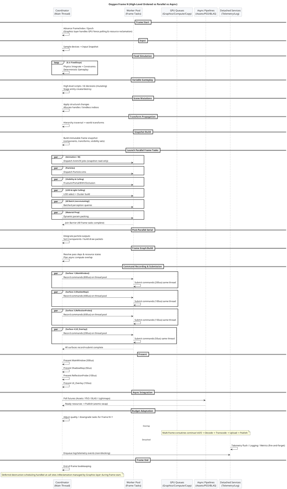
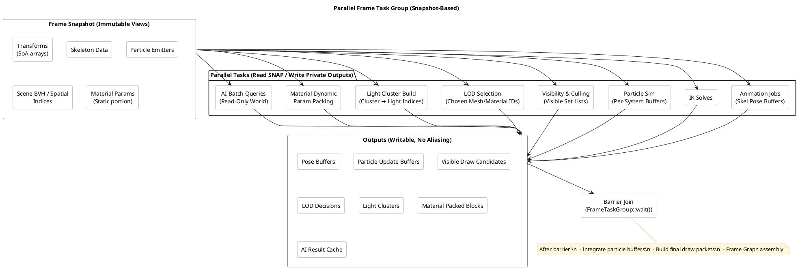
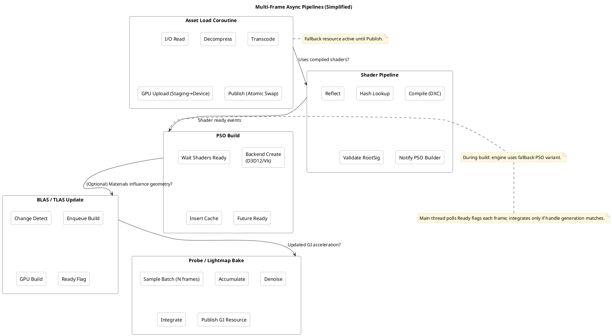
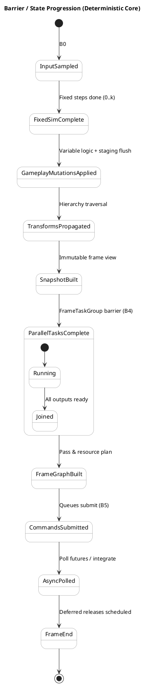

# Async Engine Frame Orchestration (Oxygen Example)

This README consolidates the guidance from the discussion: how Oxygen classifies
engine loop tasks across synchronous ordered phases, structured parallel
(coroutine) execution, multi‑frame async pipelines, and detached background
services. It includes decision heuristics, concrete timelines, barrier
contracts, coroutine lifetime tiers, adaptive scheduling, and PlantUML diagrams
you can render directly.

## ⚠️ TODO: Subsystem Integration Audit

**CRITICAL**: Ensure all foundational subsystems are properly integrated into
the AsyncEngine frame orchestration lifecycle. Each subsystem must be called at
the appropriate phase/barrier with clear ownership and lifecycle management:

### Subsystems Requiring Integration Review

- **Graphics Layer**: ✅ Partially integrated (frame start/end, low-level
  resource management) - **VERIFY** foundational services (ResourceRegistry,
  DescriptorAllocator, DeferredReclaimer) are properly orchestrated
- **Render Graph**: ❓ **AUDIT NEEDED** - Verify render graph assembly, pass
  orchestration, and resource transition planning occur in correct phases
- **Scene System**: ❓ **AUDIT NEEDED** - Verify scene graph updates, component
  queries, and spatial indexing are called at correct phases
- **Asset/Content Systems**: ❓ **AUDIT NEEDED** - Ensure AssetLoader,
  ShaderManager, and content streaming integrate with async pipelines (Category
  C)
- **Input System**: ❓ **AUDIT NEEDED** - Verify input sampling occurs in ordered
  phase with proper snapshot creation
- **Audio System**: ❓ **AUDIT NEEDED** - Determine if audio updates belong in
  ordered or parallel phases
- **Physics System**: ❓ **AUDIT NEEDED** - Ensure physics integration occurs in
  deterministic ordered phase
- **Networking System**: ❓ **AUDIT NEEDED** - Verify network packet processing
  occurs in ordered phase for authoritative state
- **Platform Layer**: ❓ **AUDIT NEEDED** - Ensure window management, device
  enumeration properly coordinated
- **Logging/Diagnostics**: ✅ Correctly designed as detached (Category D)

### Action Items

1. **Map each subsystem** to the appropriate task category (A-D) based on
   determinism and frame dependency requirements
2. **Identify integration points** where each subsystem's main APIs should be
   called during frame execution
3. **Verify ownership model** - distinguish between foundational services
   (Graphics, Platform) vs. application modules
4. **Document lifecycle contracts** - startup/shutdown ordering, resource
   dependencies, barrier synchronization
5. **Ensure proper abstraction boundaries** - foundational subsystems should not
   depend on application-level modules

### Integration Principles

- **Foundational Subsystems** (Graphics Layer, Platform, Core): Provide
  low-level services consumed by application modules; managed directly by
  AsyncEngine coordinator
- **Application Modules** (Render Graph, Gameplay, UI): Consume foundational
  services via ModuleContext; orchestrate high-level logic; managed by module
  system
- **Cross-cutting Concerns** (Logging, Metrics): Detached services with
  fire-and-forget semantics

---

## 1. Decision Heuristics (Classification Axes)

For any task, evaluate:

- Determinism requirement: strict / soft / none
- Frame dependency: needed this frame / next frame / eventual
- Authoritative mutable state touched? (Y/N) or read‑only snapshot
- Latency sensitivity: critical path / near-path / background
- Hazard scope: GPU sync, global handles, memory lifetime, networking
- Ordering graph complexity vs. benefit of parallelization

Rule of thumb (Decision Matrix):

```text
If (needs deterministic simulation OR mutates authoritative shared state) AND (result needed this frame)
 => Synchronous Ordered (Category A)
Else if (result needed this frame) AND (can operate on immutable snapshot)
 => Structured Parallel (Category B)
Else if (result improves quality but tolerates ≥1 frame latency)
 => Async Ordered Across Frames (Category C)
Else
 => Detached / Opportunistic (Category D)
```

Adaptive overrides: degrade B→C or skip when over budget; upgrade C tasks when
GPU/CPU idle.

---

## 2. Task Classification & Engine-Subsystem Dynamics

**KEY PRINCIPLE**: Distinguish between **Foundational Subsystem Services**
(Graphics, Platform, Core) and **Application Module Logic** (Gameplay,
Rendering, UI). Foundational services are orchestrated directly by the
AsyncEngine coordinator, while application modules consume services via
ModuleContext injection.

### A. Must Be Synchronous & Strictly Ordered

**WHO**: AsyncEngine coordinator calls foundational subsystems directly;
application modules execute in deterministic sequence.

Frame start sequencing that ensures determinism & hazard-free state:

- **Graphics Layer Integration**: Frame index/epoch advance, fence polling &
  deferred destruction retirement
- **Platform Layer Integration**: Input device sampling (produce immutable
  snapshot for frame)
- **Physics Subsystem Integration**: Fixed timestep simulation loop (0..N
  steps): integration, constraints
- **Application Module Execution**: Deterministic gameplay logic mutating
  authoritative state
- **Scene System Integration**: Structural mutations (spawn/despawn, reparent,
  handle allocations)
- **Scene System Integration**: Transform hierarchy propagation (parent→child)
- **Networking Subsystem Integration**: Packet application & authoritative
  reconciliation
- **Engine State Management**: Random seed management, frame counters
- **Render Graph Module**: Frame graph/render pass dependency & resource
  transition planning (consumes Graphics Layer services)
- **Graphics Layer Integration**: Global descriptor/bindless table publication,
  low-level resource state transitions, queue submission ordering

**Subsystem Ownership**: Graphics Layer provides foundational services
(ResourceRegistry, DescriptorAllocator, GPU sync). Render Graph consumes these
services to orchestrate high-level rendering. Engine coordinator ensures proper
calling sequence but delegates implementation to subsystem APIs.

Note: Deferred destruction draining (after fence signal) is handled internally
by the Graphics Layer during frame start.

### B. Synchronous Outcome, Parallelizable (Barriered Structured Concurrency)

**WHO**: Application modules and engine services execute on thread pool workers;
consume foundational subsystem services via immutable snapshots.

Parallel (workers / coroutines) on an immutable snapshot; join before consumers:

- **Application Logic**: Animation pose evaluation & IK
- **Application Logic**: Blend shapes / morph target weights
- **Application Logic**: Particle system simulation (per system) producing
  private buffers
- **Application Logic**: AI batch evaluation & pathfinding queries (read-only
  world snapshot)
- **Render Graph Module**: Visibility & culling (frustum, portal, BVH,
  occlusion) - consumes Scene/Graphics services
- **Render Graph Module**: LOD selection & impostor decisions - consumes Scene
  services
- **Render Graph Module**: Light clustering / tiled or clustered light culling
  (CPU portion) - consumes Graphics services
- **Render Graph Module**: Material dynamic parameter baking / uniform block
  packing - consumes Graphics services
- **Render Graph Module**: Command list recording per pass / bucket (if inputs
  immutable) - consumes Graphics services
- **Render Graph Module**: Multi-surface command recording (parallel recording
  with immediate submission per surface) - consumes Graphics services
- **Graphics Layer Services**: GPU upload staging population (writes into
  reserved sub‑allocations)
- **Graphics Layer Services**: Occlusion query reduction from prior frame

**Subsystem Integration Pattern**: Render Graph and other application modules
access foundational services (Graphics Layer, Scene, Platform) through read-only
snapshot APIs. No direct mutation of subsystem state allowed during parallel
execution.

### C. Async Ordered Across Frames (Deferred Pipelines)

**WHO**: Foundational subsystems and application modules manage async pipelines
internally; engine polls readiness and integrates results when available.

Produce results integrated on readiness in a future frame; relative ordering vs
dependents enforced:

- **Content Subsystem**: Asset streaming: I/O → decompress → transcode → GPU
  upload → publish swap
- **Graphics Layer**: Low-level shader compile & bytecode caching (foundational
  service)
- **Render Graph Module**: High-level Pipeline State Object (PSO) build & cache
  insertion (consumes Graphics Layer)
- **Graphics Layer**: Low-level acceleration structure (BLAS/TLAS) builds /
  refits (foundational service)
- **Render Graph Module**: Progressive GI: lightmap / probe / irradiance volume
  baking & denoise (consumes Graphics Layer)
- **Scene Subsystem**: Navigation mesh generation or updates
- **Render Graph Module**: Procedural geometry (terrain tiles, impostors)
  regeneration (consumes Graphics/Scene services)
- **Graphics Layer**: GPU readbacks (timings, screenshots, async compute
  results) (foundational service)

**Subsystem Integration Pattern**: Graphics Layer provides low-level async
services. Render Graph and other application modules implement high-level async
pipelines that consume Graphics Layer services. Engine coordinator polls
completion status each frame and triggers integration when resources are ready.
Handle/generation validation prevents stale completions.

### D. Fully Async Detached / Opportunistic

**WHO**: Cross-cutting utility services with fire-and-forget semantics; no frame
synchronization or subsystem integration required.

No determinism or latency requirement; fire‑and‑forget with safe queues:

- **Diagnostics Services**: Telemetry aggregation & upload
- **Diagnostics Services**: Logging sink flush (main thread only enqueues)
- **Diagnostics Services**: Metrics & profiling export
- **Platform Services**: Crash dump symbolization
- **Graphics Services**: Background defragmentation / compaction planning
- **Editor Services**: Asset DB indexing, code scanning (editor-only)
- **Platform Services**: Cloud sync / workshop publishing

**Subsystem Integration Pattern**: Engine enqueues work to lock-free queues;
detached services process asynchronously with their own lifecycle management.
Graceful shutdown ensures completion or cancellation.

### E. Should NOT Be Detached (Common Mistakes)

**CRITICAL**: These operations MUST remain in synchronized phases to maintain
subsystem integrity and avoid race conditions:

- **Graphics Layer Violations**: GPU resource destruction needing fence
  validation
- **Graphics Layer Violations**: Bindless descriptor table mutations (must be
  atomic in ordered phase)
- **Scene Subsystem Violations**: ECS structural changes mid‑frame without
  barrier
- **Platform Subsystem Violations**: Input device state writes outside input
  sampling phase
- **Physics Subsystem Violations**: Broadphase structure modifications outside
  fixed-step window
- **Render Graph Violations**: Frame graph mutation during parallel command
  recording

**Anti-Pattern Warning**: Never move foundational subsystem state mutations or
high-level module orchestration to detached execution. This violates ownership
models and creates undefined behavior.

### F. Conditionally Async (Adaptive Scheduling)

Can shift category based on load:

- High-resolution animation retargeting
- Expensive AI planning (time-slice over frames)
- Particle collision refinement passes
- High-precision SDF / AO / GI updates

---

## 3. Frame Timeline (Narrative)

1. Frame Start & Epoch Maintenance
2. Input Sample (atomic snapshot)
3. Fixed Simulation (0..k loops)
4. Variable Gameplay (authoritative logic)
5. Structural Scene Mutations applied
6. Transform Propagation
7. Build Immutable Snapshot (component/transforms view)
8. Launch Parallel Frame Task Group (Category B jobs)
9. Barrier Join
10. Post-Parallel Serial Integration (particle merges, sorting)
11. Frame Graph / Render Pass Assembly
12. Command Recording & Submission (parallel per surface with immediate
    submission pipeline)
13. Present (synchronous sequential presentation of all surfaces)
14. Async Pipeline Poll & Publish (Category C readiness)
15. Budget Adaptation decisions for next frame
16. End-of-frame bookkeeping

Note: Deferred destruction scheduling happens at call sites and reclamation is
managed by the Graphics layer internally during frame start, eliminating the
need for a dedicated engine-level deferred destruction phase.

---

## 4. Barrier Contract (Core States)

| Barrier | Ensures | Upstream | Downstream |
|---------|---------|----------|------------|
| B0 | Stable input snapshot | OS/Input | Simulation |
| B1 | Deterministic physics state | FixedSim | Variable gameplay |
| B2 | Structural integrity | Gameplay | Transform propagation |
| B3 | Complete world transforms | Transforms | Parallel tasks |
| B4 | All parallel outputs ready | Workers | Frame graph build |
| B5 | Valid command lists & resource states | Recording | GPU submission |
| B6 | Ready async resources published | Pipelines | Future frame consumers |

---

## 5. Coroutine Lifetime Tiers

| Tier | Scope | Usage | Cancellation |
|------|-------|-------|--------------|
| FrameScoped | Single frame | Category B frame tasks | Auto at frame end barrier |
| MultiFrame Pipeline | Until resource ready or handle destroyed | Category C | Handle generation check / shutdown |
| Detached Service | Whole session | Category D services | Engine shutdown flush |

Design Rules:

- No raw detached coroutine without an ownership token
- Continuations that touch authoritative state must hop to coordinator thread
- Generation+epoch guards before publishing results

---

## 6. Data Snapshot Patterns

- Double-buffer authoritative vs. render snapshot
- Immutable SoA arrays for transforms, skeleton joints, component subsets
- Versioned handles / generation counters to detect stale async completions
- Indirect draw argument buffers built from snapshot then pointer-swapped

---

## 7. GPU Queue Overlap Principles

- Parallel CPU build of Frame N+1 while GPU executes Frame N
- Async compute passes scheduled via frame graph with explicit barriers
- Copy queue handles uploads & readbacks; publication occurs only after fence
- Command list recording parallelizable if resource states & descriptors
  immutable for duration
- Multi-surface rendering with parallel command recording and immediate
  submission per surface

---

## 8. Adaptive Budget Management

Monitor CPU frame time, GPU idle %, and queue depths:

- Over budget: degrade / defer IK refinement, particle collisions, GI updates,
  SDF precision
- Under budget (spare GPU or CPU): schedule extra probe updates, higher LOD, or
  prefetch assets
- Provide hysteresis to avoid oscillation (time-window averaging)

---

## 9. Implementation Guidelines (Practical)

### Core Engine-Subsystem Integration Patterns

**Subsystem Service Injection**: Foundational subsystems (Graphics Layer, Scene,
Platform) expose low-level service interfaces consumed by application modules
(Render Graph, Gameplay, UI) via ModuleContext dependency injection. Engine
coordinator manages subsystem lifecycle but delegates implementation to
subsystem APIs.

**Frame Context Propagation**: Pass frame-scoped context containing `{
FrameIndex, Epoch, SubsystemSnapshots*, TaskGroup*, BudgetStats }` to both
subsystems and application modules for coordinated execution.

**Subsystem Snapshot APIs**: Each foundational subsystem provides immutable
snapshot creation for parallel consumption:
`GraphicsLayer::CreateFrameSnapshot()`, `Scene::CreateWorldSnapshot()`,
`Platform::CreateInputSnapshot()`.

### Task Management Patterns

**FrameTaskGroup**: RAII object capturing a latch / countdown; launching tasks
registers them; `wait()` at barrier B4.

**Snapshot Build**: Allocate contiguous arrays / views; store pointer in
per-frame context struct `{ FrameIndex, Epoch, Snapshot*, TaskGroup*,
BudgetStats }`.

**Multi-Surface Rendering**: Parallel command recording with immediate
submission pipeline; each surface records and submits on thread pool workers,
followed by synchronous sequential presentation.

### Subsystem-Owned Async Pipelines

**Async Asset Pipeline**: State machine (Missing → Loading → Ready → Failed).
Publish step atomically swaps underlying resource pointer leaving external
handle stable.

**Resource Lifetime**: Epoch-based reclamation: only retire resources whose last
used GPU fence signaled and epoch difference ≥ N.

**Descriptor Table**: Allow parallel allocation (lock-free bump) but stage a
versioned publication step (monotonic version bump) in ordered phase.

**Cancellation**: Each pipeline coroutine holds a `CancellationToken` tied to
the handle; check before commit/publish.

### Cross-Cutting Services

**Logging & Telemetry**: Lock-free MPSC ring → background flush thread; frame
never blocks.

**Fallback Variants**: Provide low-cost placeholders (pink texture, generic
material, basic PSO) to avoid stalling on async readiness.

### Subsystem Integration Contracts

**Startup Sequence**: Platform → Graphics → Scene → Content → Application
Modules (dependency order)

**Shutdown Sequence**: Reverse of startup; ensure all async pipelines complete
or cancel gracefully

**Service Discovery**: ModuleContext provides typed service access:
`context.GetService<IGraphicsLayer>()`, `context.GetService<ISceneSystem>()`

**Error Propagation**: Subsystem failures propagate through service interfaces;
engine coordinator handles degraded operation modes

---

## 10. PlantUML Diagrams

Render these with your PlantUML toolchain. (They intentionally use dark theme
colors; adjust as needed.)

### 10.1 Frame Sequence



### 10.2 Parallel Task Group



### 10.3 Async Pipelines



### 10.4 Barrier / State Progression



---

## 11. Quick Reference (Cheat Sheet)

### Task Categories by Engine-Subsystem Integration

| Category | Examples | Integration Point | Subsystem Responsibility |
|----------|----------|-------------------|-------------------------|
| A Ordered | Input sampling, physics, scene mutations, transforms, frame graph, submission | Strict main thread sequence | **Engine → Subsystem**: Direct calls to foundational APIs |
| B Parallel (Barrier) | Animation, particles, culling, LOD, light clustering, material prep | Joined at B4 before frame graph | **Module → Subsystem**: Service consumption via snapshots |
| C Async Multi-Frame | Asset load, shader/PSO build, BLAS/TLAS, GI bake, navmesh | Polled each frame; publish after readiness & generation check | **Subsystem → Engine**: Internal pipelines polled by coordinator |
| D Detached | Telemetry, logging flush, metrics, editor indexing | Fire-and-forget; graceful shutdown flush | **Service → Engine**: Independent lifecycle, enqueue-only interface |

### Subsystem Ownership Model

| Layer | Examples | Managed By | Access Pattern |
|-------|----------|------------|----------------|
| **Foundational** | Graphics Layer, Platform, Scene, Physics, Content | AsyncEngine Coordinator | Direct API calls in ordered phases |
| **Application** | Render Graph, Gameplay Modules, UI Systems | Module Manager | Service injection via ModuleContext |
| **Cross-Cutting** | Logging, Telemetry, Diagnostics | Independent Services | Lock-free queues, detached execution |

---

## 12. Next Steps / Possible Enhancements

- Implement `FrameTaskGroup` utility (RAII + debug tracing of outstanding jobs)
- Add budget manager module emitting downgrade decisions (profiling integrated)
- Introduce generation/epoch validator wrapper for async publish actions
- Provide fallback PSO & material registry for zero-stall rendering
- Scriptable policy to shift tasks between categories based on heuristics

---

## 13. License

Subject to the root project license.

---

## 14. Changelog

- Initial version: Consolidated async orchestration guidelines & diagrams.

---
End of document.

---

## Simulator Build & Run (Scaffold)

The CMake target `Oxygen.AsyncEngine.Simulator` provides a lightweight synthetic
frame loop using existing Oxygen subsystems (logging, OxCo thread pool, Clap
CLI). It currently:

- Implements ordered phases (frame start → frame end) with synthetic sleep-based
  work.
- Launches a set of synthetic parallel tasks (Animation, Particles, Culling,
  LOD) using structured coroutines with OxCo nursery for proper cancellation.
- Simulates multi-frame async jobs (asset load, shader compile) with slice-based
  progression and readiness logging.
- Implements multi-surface rendering with parallel command recording, immediate
  submission pipeline, and synchronous presentation.
- Provides a CLI option `--frames/-f` to select number of frames (default 5).

### Build

The example is included by enabling examples in the root build (ensure
`Examples/AsyncEngine` subdirectory is processed). After configuring via
existing project presets, build the target.

Executable name pattern: `Oxygen.AsyncEngine.Simulator`.

### Run

Examples:

```text
Oxygen.AsyncEngine.Simulator --frames 10
Oxygen.AsyncEngine.Simulator -f 120
```

The simulator configures four example surfaces with different rendering costs:

- **MainWindow**: 800us record, 200us submit, 300us present
- **ShadowMap**: 400us record, 100us submit, 50us present
- **ReflectionProbe**: 600us record, 150us submit, 100us present
- **UI_Overlay**: 200us record, 50us submit, 150us present

Each surface executes its record→submit pipeline in parallel on thread pool
workers, followed by sequential synchronous presentation.

### Planned Enhancements

- Add Chrome trace JSON export of phases, parallel spans, async job lifetimes.
- Introduce adaptive budgeting and downgrade logic.
- Determinism harness comparing phase/task ordering hashes across runs.
- GPU queue emulation lane & overlap metrics.
- Dynamic surface management (add/remove surfaces at runtime).
- Surface dependency tracking and optimal presentation order.
