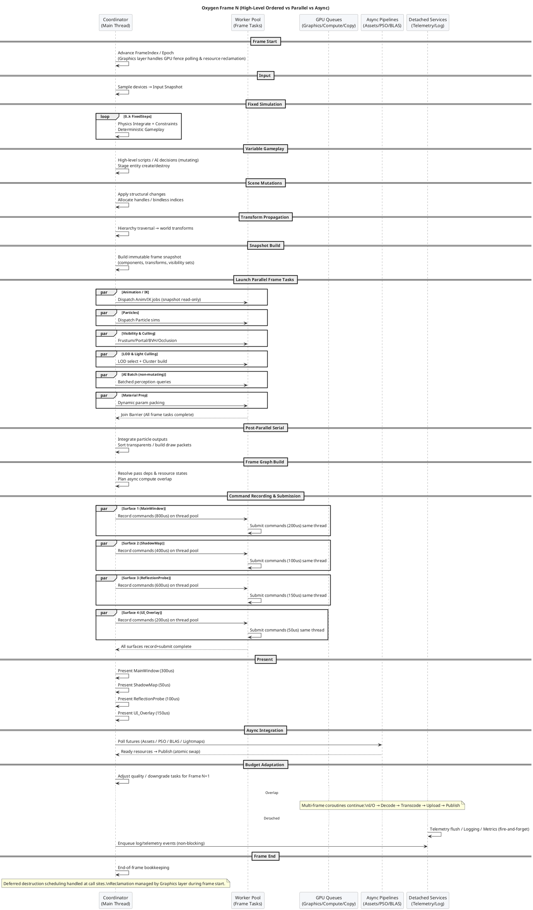
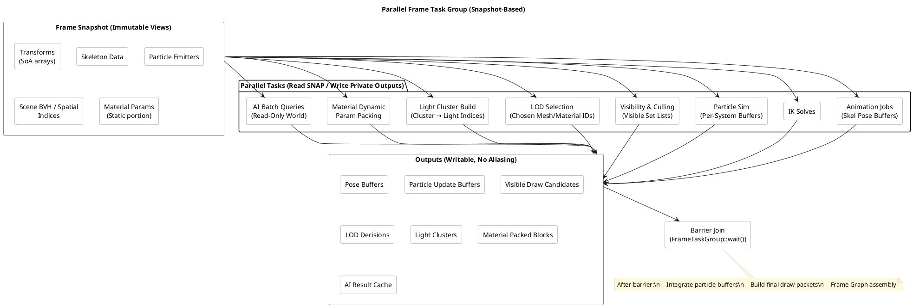
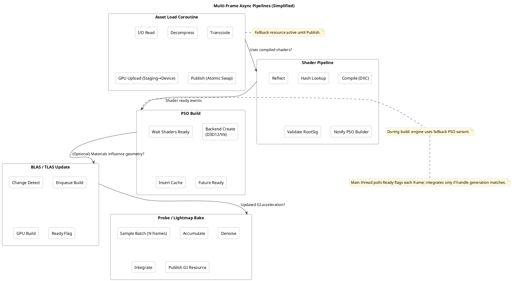
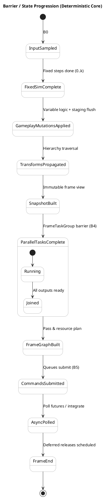

# Async Engine Frame Orchestration (Oxygen Example)

This README consolidates the guidance from the discussion: how Oxygen classifies engine loop tasks across synchronous ordered phases, structured parallel (coroutine) execution, multi‑frame async pipelines, and detached background services. It includes decision heuristics, concrete timelines, barrier contracts, coroutine lifetime tiers, adaptive scheduling, and PlantUML diagrams you can render directly.

---

## 1. Decision Heuristics (Classification Axes)

For any task, evaluate:

- Determinism requirement: strict / soft / none
- Frame dependency: needed this frame / next frame / eventual
- Authoritative mutable state touched? (Y/N) or read‑only snapshot
- Latency sensitivity: critical path / near-path / background
- Hazard scope: GPU sync, global handles, memory lifetime, networking
- Ordering graph complexity vs. benefit of parallelization

Rule of thumb (Decision Matrix):

```text
If (needs deterministic simulation OR mutates authoritative shared state) AND (result needed this frame)
 => Synchronous Ordered (Category A)
Else if (result needed this frame) AND (can operate on immutable snapshot)
 => Structured Parallel (Category B)
Else if (result improves quality but tolerates ≥1 frame latency)
 => Async Ordered Across Frames (Category C)
Else
 => Detached / Opportunistic (Category D)
```

Adaptive overrides: degrade B→C or skip when over budget; upgrade C tasks when GPU/CPU idle.

---

## 2. Task Classification

### A. Must Be Synchronous & Strictly Ordered

Frame start sequencing that ensures determinism & hazard-free state:

- Frame index / epoch advance (fence polling & deferred destruction retirement handled by Graphics layer)
- Input sampling (produce immutable snapshot for frame)
- Fixed timestep simulation loop (0..N steps): physics integration, constraints
- Deterministic gameplay logic mutating authoritative state
- Scene graph structural mutations (spawn/despawn, reparent, handle allocations)
- Transform hierarchy propagation (parent→child)
- Network packet application & authoritative reconciliation
- Random seed management
- Frame graph / render pass dependency & resource transition planning
- Global descriptor/bindless table publication, resource state transitions, queue submission ordering

Note: Deferred destruction draining (after fence signal) is handled internally by the Graphics layer during frame start.

### B. Synchronous Outcome, Parallelizable (Barriered Structured Concurrency)

Parallel (workers / coroutines) on an immutable snapshot; join before consumers:

- Animation pose evaluation & IK
- Blend shapes / morph target weights
- Particle system simulation (per system) producing private buffers
- AI batch evaluation & pathfinding queries (read-only world)
- Visibility & culling (frustum, portal, BVH, occlusion)
- LOD selection & impostor decisions
- Light clustering / tiled or clustered light culling (CPU portion)
- Material dynamic parameter baking / uniform block packing
- Command list recording per pass / bucket (if inputs immutable)
- Multi-surface command recording (parallel recording with immediate submission per surface)
- GPU upload staging population (writes into reserved sub‑allocations)
- Occlusion query reduction from prior frame

### C. Async Ordered Across Frames (Deferred Pipelines)

Produce results integrated on readiness in a future frame; relative ordering vs dependents enforced:

- Asset streaming: I/O → decompress → transcode → GPU upload → publish swap
- Shader compile & reflection (fallback variant until ready)
- Pipeline State Object (PSO) build & cache insertion
- Acceleration structure (BLAS/TLAS) builds / refits
- Progressive GI: lightmap / probe / irradiance volume baking & denoise
- Navigation mesh generation or updates
- Procedural geometry (terrain tiles, impostors) regeneration
- GPU readbacks (timings, screenshots, async compute results)

### D. Fully Async Detached / Opportunistic

No determinism or latency requirement; fire‑and‑forget with safe queues:

- Telemetry aggregation & upload
- Logging sink flush (main thread only enqueues)
- Metrics & profiling export
- Crash dump symbolization
- Background defragmentation / compaction planning
- Editor indexing (asset DB, code scanning)
- Cloud sync / workshop publishing

### E. Should NOT Be Detached (Common Mistakes)

- GPU resource destruction needing fence validation
- Bindless descriptor table mutations (must be atomic in ordered phase)
- ECS structural changes mid‑frame without barrier
- Input device state writes outside input sampling phase
- Physics broadphase structure modifications outside fixed-step window

### F. Conditionally Async (Adaptive Scheduling)

Can shift category based on load:

- High-resolution animation retargeting
- Expensive AI planning (time-slice over frames)
- Particle collision refinement passes
- High-precision SDF / AO / GI updates

---

## 3. Frame Timeline (Narrative)

1. Frame Start & Epoch Maintenance
2. Input Sample (atomic snapshot)
3. Fixed Simulation (0..k loops)
4. Variable Gameplay (authoritative logic)
5. Structural Scene Mutations applied
6. Transform Propagation
7. Build Immutable Snapshot (component/transforms view)
8. Launch Parallel Frame Task Group (Category B jobs)
9. Barrier Join
10. Post-Parallel Serial Integration (particle merges, sorting)
11. Frame Graph / Render Pass Assembly
12. Command Recording & Submission (parallel per surface with immediate submission pipeline)
13. Present (synchronous sequential presentation of all surfaces)
14. Async Pipeline Poll & Publish (Category C readiness)
15. Budget Adaptation decisions for next frame
16. End-of-frame bookkeeping

Note: Deferred destruction scheduling happens at call sites and reclamation is managed by the Graphics layer internally during frame start, eliminating the need for a dedicated engine-level deferred destruction phase.

---

## 4. Barrier Contract (Core States)

| Barrier | Ensures | Upstream | Downstream |
|---------|---------|----------|------------|
| B0 | Stable input snapshot | OS/Input | Simulation |
| B1 | Deterministic physics state | FixedSim | Variable gameplay |
| B2 | Structural integrity | Gameplay | Transform propagation |
| B3 | Complete world transforms | Transforms | Parallel tasks |
| B4 | All parallel outputs ready | Workers | Frame graph build |
| B5 | Valid command lists & resource states | Recording | GPU submission |
| B6 | Ready async resources published | Pipelines | Future frame consumers |

---

## 5. Coroutine Lifetime Tiers

| Tier | Scope | Usage | Cancellation |
|------|-------|-------|--------------|
| FrameScoped | Single frame | Category B frame tasks | Auto at frame end barrier |
| MultiFrame Pipeline | Until resource ready or handle destroyed | Category C | Handle generation check / shutdown |
| Detached Service | Whole session | Category D services | Engine shutdown flush |

Design Rules:

- No raw detached coroutine without an ownership token
- Continuations that touch authoritative state must hop to coordinator thread
- Generation+epoch guards before publishing results

---

## 6. Data Snapshot Patterns

- Double-buffer authoritative vs. render snapshot
- Immutable SoA arrays for transforms, skeleton joints, component subsets
- Versioned handles / generation counters to detect stale async completions
- Indirect draw argument buffers built from snapshot then pointer-swapped

---

## 7. GPU Queue Overlap Principles

- Parallel CPU build of Frame N+1 while GPU executes Frame N
- Async compute passes scheduled via frame graph with explicit barriers
- Copy queue handles uploads & readbacks; publication occurs only after fence
- Command list recording parallelizable if resource states & descriptors immutable for duration
- Multi-surface rendering with parallel command recording and immediate submission per surface

---

## 8. Adaptive Budget Management

Monitor CPU frame time, GPU idle %, and queue depths:

- Over budget: degrade / defer IK refinement, particle collisions, GI updates, SDF precision
- Under budget (spare GPU or CPU): schedule extra probe updates, higher LOD, or prefetch assets
- Provide hysteresis to avoid oscillation (time-window averaging)

---

## 9. Implementation Guidelines (Practical)

**FrameTaskGroup**: RAII object capturing a latch / countdown; launching tasks registers them; `wait()` at barrier B4.
**Snapshot Build**: Allocate contiguous arrays / views; store pointer in per-frame context struct `{ FrameIndex, Epoch, Snapshot*, TaskGroup*, BudgetStats }`.
**Multi-Surface Rendering**: Parallel command recording with immediate submission pipeline; each surface records and submits on thread pool workers, followed by synchronous sequential presentation.
**Async Asset Pipeline**: State machine (Missing → Loading → Ready → Failed). Publish step atomically swaps underlying resource pointer leaving external handle stable.
**Resource Lifetime**: Epoch-based reclamation: only retire resources whose last used GPU fence signaled and epoch difference ≥ N.
**Descriptor Table**: Allow parallel allocation (lock-free bump) but stage a versioned publication step (monotonic version bump) in ordered phase.
**Cancellation**: Each pipeline coroutine holds a `CancellationToken` tied to the handle; check before commit/publish.
**Logging & Telemetry**: Lock-free MPSC ring → background flush thread; frame never blocks.
**Fallback Variants**: Provide low-cost placeholders (pink texture, generic material, basic PSO) to avoid stalling on async readiness.

---

## 10. PlantUML Diagrams

Render these with your PlantUML toolchain. (They intentionally use dark theme colors; adjust as needed.)

### 10.1 Frame Sequence



### 10.2 Parallel Task Group



### 10.3 Async Pipelines



### 10.4 Barrier / State Progression



---

## 11. Quick Reference (Cheat Sheet)

| Category | Examples | Integration Point |
|----------|----------|-------------------|
| A Ordered | Input sampling, physics, scene mutations, transforms, frame graph, submission | Strict main thread sequence |
| B Parallel (Barrier) | Animation, particles, culling, LOD, light clustering, material prep | Joined at B4 before frame graph |
| C Async Multi-Frame | Asset load, shader/PSO build, BLAS/TLAS, GI bake, navmesh | Polled each frame; publish after readiness & generation check |
| D Detached | Telemetry, logging flush, metrics, editor indexing | Fire-and-forget; graceful shutdown flush |

---

## 12. Next Steps / Possible Enhancements

- Implement `FrameTaskGroup` utility (RAII + debug tracing of outstanding jobs)
- Add budget manager module emitting downgrade decisions (profiling integrated)
- Introduce generation/epoch validator wrapper for async publish actions
- Provide fallback PSO & material registry for zero-stall rendering
- Scriptable policy to shift tasks between categories based on heuristics

---

## 13. License

Subject to the root project license.

---

## 14. Changelog

- Initial version: Consolidated async orchestration guidelines & diagrams.

---
End of document.

---

## Simulator Build & Run (Scaffold)

The CMake target `Oxygen.AsyncEngine.Simulator` provides a lightweight synthetic frame loop using existing Oxygen subsystems (logging, OxCo thread pool, Clap CLI). It currently:

- Implements ordered phases (frame start → frame end) with synthetic sleep-based work.
- Launches a set of synthetic parallel tasks (Animation, Particles, Culling, LOD) using structured coroutines with OxCo nursery for proper cancellation.
- Simulates multi-frame async jobs (asset load, shader compile) with slice-based progression and readiness logging.
- Implements multi-surface rendering with parallel command recording, immediate submission pipeline, and synchronous presentation.
- Provides a CLI option `--frames/-f` to select number of frames (default 5).

### Build

The example is included by enabling examples in the root build (ensure `Examples/AsyncEngine` subdirectory is processed). After configuring via existing project presets, build the target.

Executable name pattern: `Oxygen.AsyncEngine.Simulator`.

### Run

Examples:

```text
Oxygen.AsyncEngine.Simulator --frames 10
Oxygen.AsyncEngine.Simulator -f 120
```

The simulator configures four example surfaces with different rendering costs:

- **MainWindow**: 800us record, 200us submit, 300us present
- **ShadowMap**: 400us record, 100us submit, 50us present
- **ReflectionProbe**: 600us record, 150us submit, 100us present
- **UI_Overlay**: 200us record, 50us submit, 150us present

Each surface executes its record→submit pipeline in parallel on thread pool workers, followed by sequential synchronous presentation.

### Planned Enhancements

- Add Chrome trace JSON export of phases, parallel spans, async job lifetimes.
- Introduce adaptive budgeting and downgrade logic.
- Determinism harness comparing phase/task ordering hashes across runs.
- GPU queue emulation lane & overlap metrics.
- Dynamic surface management (add/remove surfaces at runtime).
- Surface dependency tracking and optimal presentation order.
