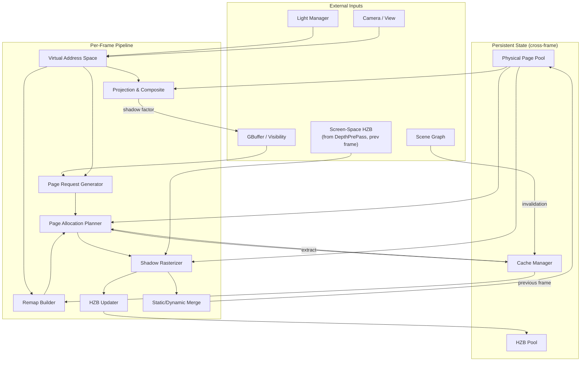
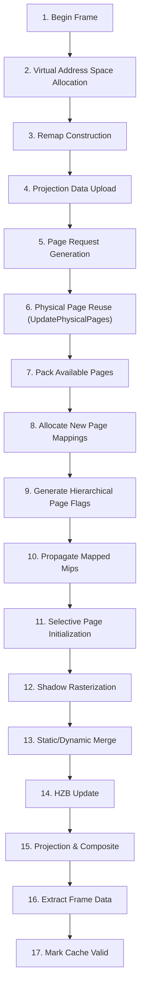
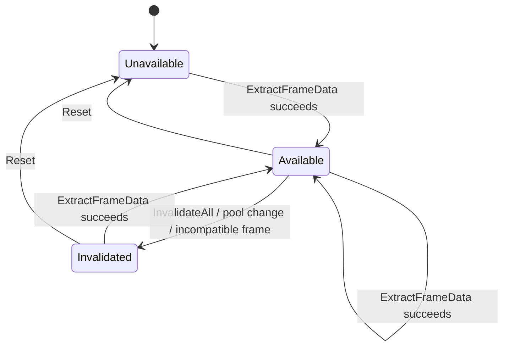
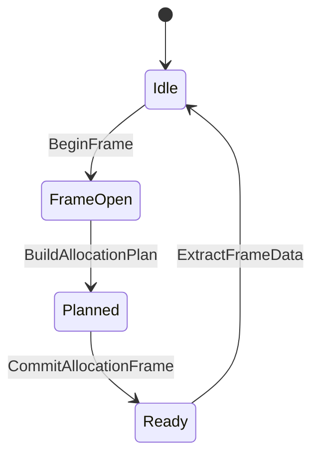
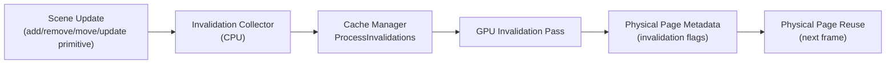
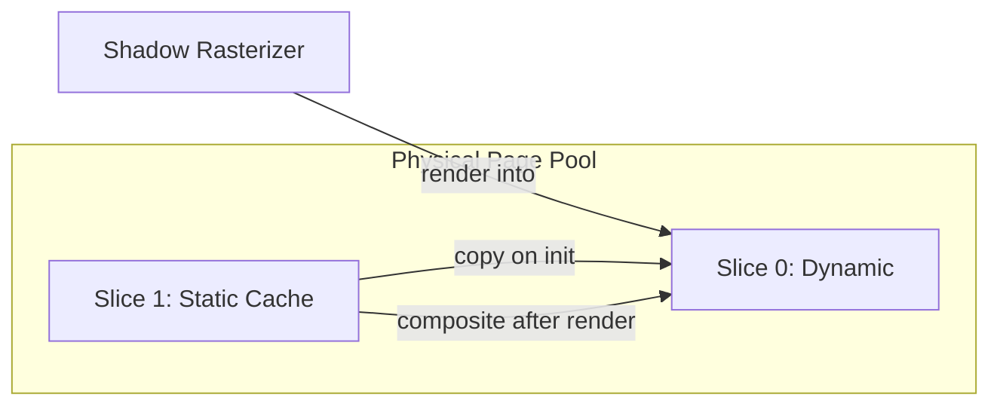
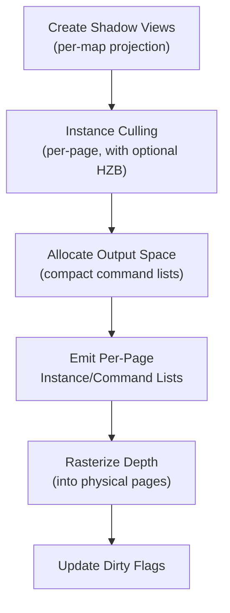
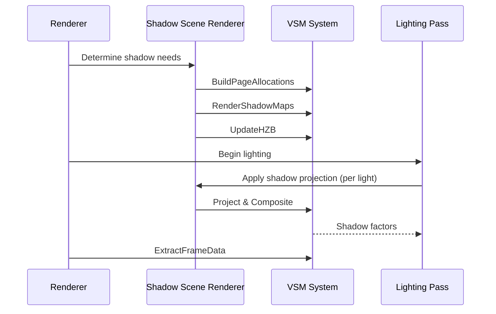

# Virtual Shadow Map Architecture

Status: `active — architecture spec`

This document is the authoritative architecture specification for the virtual shadow map (VSM) system in the Oxygen renderer. It defines module boundaries, ownership contracts, data flows, and integration surfaces. It is not an implementation plan.

Cross-references:

- `VsmPhysicalPoolAndAddressSpaceImplementationPlan.md` — implementation plan for pool and address-space modules
- `VsmCacheManagerAndPageAllocationImplementationPlan.md` — implementation plan for cache manager and page allocation

---

## 1. Overview

The VSM system replaces conventional fixed-resolution shadow maps with a virtualized, page-based shadow architecture. Each shadow-casting light owns a virtual shadow map: a sparse virtual page table backed by a shared physical page pool. Only pages that are visible from the camera and overlap the light's influence are allocated and rendered each frame.

Key properties:

- **Consistent shadow quality** — shadow resolution adapts to screen-space pixel density, not to a fixed cascade count or atlas slot size.
- **Temporal caching** — rendered shadow pages persist across frames. Only pages that are invalidated by scene changes or newly requested are re-rendered.
- **Unified light support** — directional lights use multi-level clipmaps; point and spot lights use cube-face or single-projection virtual maps. All share the same physical pool.
- **Demand-driven allocation** — the physical page pool is a fixed-size budget. Pages are allocated on demand, reused across frames, and evicted when no longer needed.

---

## 2. System Topology



---

## 3. Module Boundaries and Ownership

Each module has a single owner and well-defined contracts. No module may reach into another module's internal state.

### 3.1 Physical Page Pool Manager

**Ownership:** persistent physical shadow-depth texture array, derived HZB texture, and the persistent backing resource for physical page metadata.

**Responsibilities:**

- Create, resize, and dispose the shadow-depth texture array and the derived HZB texture.
- Create, resize, and dispose the persistent physical page metadata backing resource used by cache/page-management passes.
- Manage pool slice layout (dynamic slice, optional static-cache slice).
- Expose pool identity for compatibility checking across frames.
- Validate pool configuration and report explicit compatibility results, including the requirement that each slice has a square page grid.
- Convert between linear physical page indices and tiled (x, y, slice) coordinates.

**Does not own:** page-table mappings, allocation decisions, extracted cache state, CPU cache bookkeeping, or rendering.

**Snapshot lifetime contract:** Pool snapshots (`VsmPhysicalPoolSnapshot`,
`VsmHzbPoolSnapshot`) carry `shared_ptr` handles to the pool's persistent GPU
resources. Copying a snapshot extends the GPU resource lifetime through shared
ownership. Consumers **must not** hold snapshots across pool resets — a stale
snapshot will prevent the GPU resources from being released even after the pool
manager calls `Reset()`. Snapshots are intended to be short-lived, per-frame
value objects.

### 3.2 Virtual Address Space

**Ownership:** per-frame virtual shadow map ID allocation and layout publication.

**Responsibilities:**

- Allocate contiguous virtual IDs for each shadow-casting light per frame.
- Publish local-light layouts (single-page or multi-level) and directional clipmap layouts.
- Compute per-frame virtual page-table entry count.
- Produce copyable frame snapshots for cache manager consumption.
- Build previous-to-current virtual ID remap tables using stable remap keys.

**Does not own:** physical pages, cache state, or GPU resources.

**Contract:** virtual state is rebuilt every frame from scratch. Virtual IDs are not stable across frames — cross-frame identity is tracked through explicit remap keys.

### 3.3 Cache Manager

**Ownership:** persistent cross-frame cache state and current-frame allocation orchestration.

**Responsibilities:**

- Store previous-frame extracted data (page table, physical page metadata, virtual frame snapshot).
- Track cache-data availability (unavailable, available, invalidated).
- Track current-frame build stage (idle, frame-open, planned, ready).
- Accept page requests for the current frame.
- Orchestrate the page allocation planner.
- Publish the current-frame allocation package for downstream consumers.
- Extract current-frame data at end of frame for next-frame reuse.
- Process explicit invalidation requests (targeted or whole-cache).
- Manage per-light cache entries with frame-state tracking.
- Retain unreferenced cache entries for a configurable age.
- Own the CPU-side cache bookkeeping associated with retained entries, per-map continuity, and previous-frame extraction.

**Does not own:** physical pool resources, virtual ID allocation, page request generation, shadow rendering, HZB computation, or lighting projection.

### 3.4 Page Allocation Planner

**Ownership:** pure CPU allocation logic.

**Responsibilities:**

- Consume previous-frame data, current-frame remap table, and page requests.
- Decide per-page: reuse existing mapping, evict stale mapping, allocate new physical page, or reject (exhausted).
- Produce initialization work list (which pages need clearing or static-slice copy).
- Report explicit failure reasons for rejected requests.
- Aggregate allocation statistics (reuse count, allocation count, eviction count, rejection count).

**Contract:** deterministic and independently testable. No GPU access. No side effects beyond the returned plan.

### 3.5 Page Request Generator

**Ownership:** screen-space page marking.

**Responsibilities:**

- Sample the GBuffer (or visibility buffer) to determine which virtual shadow pages are visible from the camera at each pixel.
- Mark coarse pages for broad coverage.
- Prune requests against the light grid to avoid marking pages for lights that do not affect the visible scene.
- Produce the per-frame page request set consumed by the cache manager.

### 3.6 Shadow Rasterizer

**Ownership:** per-page shadow depth rendering.

**Responsibilities:**

- Cull mesh instances against allocated shadow pages using the current page table and the optional screen-space HZB (see §3.10).
- Generate compact per-page draw command lists.
- Rasterize shadow depth into physical pages in the shadow-depth texture array.
- Mark rendered pages as dirty in physical page metadata.
- Track primitive visibility for reveal detection (newly visible primitives force re-render).

### 3.7 HZB Updater

**Ownership:** per-page hierarchical Z-buffer maintenance.

**Responsibilities:**

- Select dirty or newly allocated pages for HZB rebuild.
- Build per-page HZB mip chain from the shadow-depth texture.
- Consume the finalized page-management/dirty-flag products needed for HZB rebuild.
- Support selective rebuild (only touched pages, not the entire pool).

### 3.8 Static/Dynamic Merge

**Ownership:** two-slice page content management.

**Responsibilities:**

- When static caching is enabled, manage two array slices: dynamic (slice 0) and static cached (slice 1).
- After shadow rendering, merge the static slice into the dynamic slice for pages that were re-rendered.
- Select pages for merge based on dirty flags and static-cache validity.

### 3.9 Projection and Composite

**Ownership:** shadow factor generation for the lighting pass.

**Responsibilities:**

- Project screen-space pixels into virtual shadow map space to sample shadow depth.
- Support directional clipmaps on an explicit per-light projection path.
- Support local lights through either per-light projection or a one-pass packed mask-bit approach.
- Composite shadow factors into final screen-space shadow masks consumed by the lighting pass.

### 3.10 Screen-Space HZB (Renderer Prerequisite)

**Ownership:** renderer pipeline — **not** a VSM-internal module.

**Produced by:** a `ScreenHzbBuildPass` compute pass dispatched by `ForwardPipeline` immediately after `DepthPrePass` completes and before the VSM orchestrator begins its per-frame stages. This pass performs a hierarchical min-reduce over the `DepthPrePass` depth buffer and writes the result into a persistent screen-resolution HZB pyramid.

**Consumed by:** §3.6 Shadow Rasterizer (Stage 12 instance culling).

**Cross-frame contract:** the Shadow Rasterizer reads the *previous* frame's screen-space HZB, not the current frame's. On frame 0 the HZB is absent and culling falls back to conservative AABB-only testing. From frame 1 onward the previous-frame pyramid is available as a read-only input without stalling the pipeline. The VSM system does not write the screen-space HZB.

**Why separate from §3.7:** §3.7 (HZB Updater) owns the *shadow-space* HZB — a per-physical-page depth pyramid built from the shadow-depth texture array and used for shadow-space coarse occlusion and filtering. The screen-space HZB is a camera-view pyramid built from scene depth and used purely for shadow-caster culling. The two resources are independent, live in different coordinate spaces, and are rebuilt at different points in the frame.

---

## 4. Data Model

### 4.1 Virtual Page Table

Each virtual shadow map is a square grid of pages at one or more mip levels. A directional clipmap is a stack of such grids (one per clip level). The virtual page table maps `(virtual_map_id, mip_level, page_x, page_y)` to a physical page index, or marks the entry as unmapped.

```
PageTableEntry:
  is_mapped       : bool
  physical_page   : PhysicalPageIndex
```

The page table is rebuilt every frame. Previous-frame mappings are carried forward through the reuse pipeline, not by preserving the table itself.

### 4.2 Physical Page Metadata

Each physical page in the pool carries persistent metadata:

```
PhysicalPageMeta:
  flags               : bitfield (allocated, dirty, used_this_frame, view_uncached)
  invalidation_flags  : bitfield (static_invalidated, dynamic_invalidated)
  age                 : uint
  owner_map_id        : VirtualShadowMapId
  owner_mip_level     : uint
  owner_page_address  : (page_x, page_y)
```

This metadata is the primary link between physical content, virtual ownership, cache age, and invalidation state.

### 4.3 Page Flags (Virtual)

Virtual page flags are computed per frame from screen-space analysis:

```
PageFlags:
  allocated           — a physical page is mapped to this virtual page
  dynamic_uncached    — the dynamic content needs re-rendering
  static_uncached     — the static content needs re-rendering
  detail_geometry     — the page contains high-detail geometry
```

### 4.4 Page Rect Bounds

Per-virtual-map bounding rectangles track the active page region to enable early-out in marking and allocation passes.

### 4.5 Projection Data

Per-virtual-map projection data is uploaded each frame:

```
ProjectionData:
  view_matrix
  projection_matrix
  view_origin
  light_type
  clipmap_level        (directional only)
  clipmap_corner_offset (directional only)
```

Previous-frame projection data is retained for invalidation (which operates in previous-frame space).

---

## 5. Per-Frame Pipeline

The VSM system executes a strict per-frame pipeline. Each stage has explicit inputs and outputs. Stages must execute in order.



### Stage 1 — Begin Frame

- Cache manager captures the current seam (pool snapshot, virtual frame, remap table).
- Unreferenced cache entries are aged; entries within the retention window receive new virtual IDs.

### Stage 2 — Virtual Address Space Allocation

- Each shadow-casting light is assigned a contiguous block of virtual IDs.
- Directional lights receive clipmap layouts (one virtual map per clip level).
- Local lights receive either single-page (distant) or multi-level layouts.
- The total page-table entry count is computed.

### Stage 3 — Remap Construction

- For each light with a stable remap key that existed in the previous frame, a previous-to-current virtual ID mapping is generated.
- Clipmap remap includes page-space pan offsets when the clipmap has scrolled.

### Stage 4 — Projection Data Upload

- Per-map projection matrices and light parameters are uploaded to a GPU buffer.
- Previous-frame projection data is retained for invalidation.

### Stage 5 — Page Request Generation

- The GBuffer (and optionally hair/strand buffers) is sampled to determine which virtual pages are needed.
- Coarse pages are marked for broad shadow coverage.
- The light grid is pruned to skip lights that do not affect visible pixels.
- Output: a per-page request flag buffer.

### Stage 6 — Physical Page Reuse

- All physical pages are iterated.
- For each page with valid previous-frame metadata:
  - Map the previous virtual owner to the current virtual ID through the remap table.
  - Apply clipmap page offsets if applicable.
  - Check if the current frame still requests this page.
  - Check invalidation flags.
  - If still valid and requested: preserve the mapping (reuse).
  - Otherwise: move the page to the empty list.

This is the core cache reuse engine.

### Stage 7 — Pack Available Pages

- Compact the empty page list into a contiguous available-page stack.

### Stage 8 — Allocate New Page Mappings

- For each requested page without an existing mapping:
  - Pop a physical page from the available stack.
  - Clear the old owner's page-table entry if the page was previously mapped elsewhere.
  - Create a new page-table entry.
  - Mark the page as both dynamic-uncached and static-uncached.
  - Record metadata (owner, mip, page address).

### Stage 9 — Generate Hierarchical Page Flags

- Build hierarchical (mip-chain) page flags from the leaf-level page flags.
- Used for early-out in coarse culling and rendering.

### Stage 10 — Propagate Mapped Mips

- Propagate mapping information up the mip chain so that coarser levels know which fine-level pages are mapped.

### Stage 11 — Selective Page Initialization

- Only uncached pages are selected for initialization (not the entire pool).
- If the static slice is valid and separate static caching is active: copy the static slice into the dynamic slice.
- Otherwise: clear the page to a known depth value.

### Stage 12 — Shadow Rasterization

- Per-page draw commands are generated through GPU-driven culling:
  1. Cull mesh instances against shadow pages (with optional screen-space HZB occlusion culling against the previous-frame camera depth pyramid; see §3.10).
  2. Allocate output space for visible instance commands.
  3. Emit compact per-page instance/command lists.
  4. Rasterize depth into allocated physical pages.
- Pages rendered this frame are marked dirty in physical metadata.
- Primitive visibility is tracked for reveal detection.

### Stage 13 — Static/Dynamic Merge

- When static caching is enabled, dirty pages have their rendered content merged:
  - Select pages where static cached content must be composited into the dynamic slice.
  - Composite static slice content into the dynamic slice using the fixed `slice1 -> slice0` direction.
  - The physical shadow atlas remains a depth-backed resource; the merge pass must not require UAV access on that atlas.
  - On D3D12, the merge therefore runs through a transient float scratch atlas:
    1. copy the dynamic slice into scratch,
    2. run compute merge against scratch,
    3. copy the merged result back into the dynamic slice.
  - Any refresh of the static slice itself is handled by a separate static-recache path, not by reversing the merge direction.

### Stage 14 — HZB Update

- Select pages for HZB rebuild (dirty, newly allocated, or forced).
- Fold dirty and invalidation flags into physical page metadata during selection.
- Build per-page HZB mip chain.

### Stage 15 — Projection and Composite

- Directional clipmap projection: explicit per-light path sampling the clipmap levels.
- Local light projection: either per-light or one-pass packed mask-bit mode.
  - One-pass: all local lights are projected into a packed mask-bit texture in a single pass, then individual lights are extracted during lighting.
  - Per-light: each light is projected individually into a shadow factor texture.
- Shadow factors are composited into the final screen-space shadow mask.

### Stage 16 — Extract Frame Data

- The current-frame page table, physical page metadata, and virtual frame snapshot are extracted and stored for next-frame reuse.

### Stage 17 — Mark Cache Valid

- The cache is marked as valid, enabling reuse on the next frame.

---

## 6. Cache State Machine

### 6.1 Cache-Data State

Tracks whether previous-frame data is available for reuse.



| State | Meaning |
|---|---|
| Unavailable | No previous frame data exists. Cold start or after reset. |
| Available | Previous frame data is present and eligible for reuse checks. |
| Invalidated | Previous data exists for diagnostics but is not eligible for reuse. |

Ordinary current-frame light-count or raw page-table-count changes are not, by
themselves, an incompatible frame. Once the cache manager publishes
current-frame continuity products, compatibility is derived from the extracted
snapshot and pool contract rather than strict equality with the raw captured
seam page-table count.

### 6.2 Frame-Build State

Tracks the current frame's progress through the allocation pipeline.



| State | Meaning |
|---|---|
| Idle | No frame is being built. |
| FrameOpen | Seam captured; page requests may be submitted. |
| Planned | CPU allocation decisions are finalized. |
| Ready | Current-frame allocation package is published for rendering. |

These two state machines are independent and must transition explicitly.

### 6.3 Per-Light Cache State

Each light has a per-light cache entry tracking:

```
PerLightCacheEntry:
  remap_key           : stable identity across frames
  kind                : local or directional
  previous_frame_state:
    rendered_frame    : last frame this light was actually rendered
    scheduled_frame   : last frame this light was scheduled for render
    is_uncached       : whether previous data is usable
    is_distant        : whether this was flagged as a distant light
  current_frame_state : same fields, built this frame
```

**Transitions:**

- Directional lights invalidate on light-direction change, first-clip-level change, or forced invalidation.
- Local lights invalidate on setup-key change (position, orientation, projection params) when invalidation is allowed.
- Local lights are marked uncached when the previous rendered frame is invalid.
- Explicit `Invalidate()` sets the previous rendered frame to invalid.

### 6.4 Unreferenced Entry Retention

Cache entries for lights not referenced in the current frame can be retained for a configurable number of frames. During retention:

- The entry receives newly allocated virtual IDs for the current frame.
- Physical pages remain alive through remap.
- The retained entry still uploads the current-frame projection/cache continuity data needed for reuse and invalidation.
- After the retention window expires, the entry is evicted and its pages become available.

Implementation note:

- This reassignment is realized through cache-manager-owned current-frame publication products, not by mutating the raw `VsmCacheManagerSeam.current_frame` snapshot after capture. Any phase that has only seam capture plus previous extraction may track retained-entry bookkeeping, but it cannot truthfully claim current-frame virtual-ID reassignment until the cache manager publishes the current-frame allocation package.

---

## 7. Invalidation Architecture

Invalidation is the mechanism by which scene mutations cause cached shadow pages to be re-rendered.

### 7.1 Invalidation Flow



### 7.2 Key Contracts

- **Previous-frame space:** invalidation operates on previous-frame page table and previous-frame projection data, not the current frame. The changed primitive's bounds are projected into previous-frame shadow space.
- **Per-page granularity:** only pages whose virtual extent overlaps the changed primitive's projected bounds are marked.
- **Dedicated GPU pass:** scene invalidation is executed by a dedicated GPU invalidation pass dispatched by the cache manager. That pass writes invalidation bits into previous-frame physical page metadata only.
- **Flag-based:** the reuse/page-management pass consumes those previous-frame invalidation bits and decides whether a mapping remains reusable for the new frame.
- **Scope control:** each invalidation payload specifies whether it targets all virtual maps or a single specific map, and whether it affects static content, dynamic content, or both.
- **Whole-cache invalidation:** the cache manager supports `InvalidateAll` for global state changes (e.g., lighting mode change, pool resize). This marks all previous data as non-reusable.
- **Targeted invalidation:** public targeted invalidation uses the existing seam split and remap keys directly:
  - `InvalidateLocalLights(..., scope, reason)`
  - `InvalidateDirectionalClipmaps(..., scope, reason)`

### 7.3 Static vs. Dynamic Invalidation

When static caching is enabled, invalidation flags distinguish between static and dynamic content:

- A static-only invalidation (e.g., a static mesh was removed) marks the page's static-invalidation flag.
- A dynamic invalidation (e.g., a character moved) marks the dynamic-invalidation flag.
- The initialization pass (Stage 11) uses these flags to determine whether to re-copy from the static slice or fully clear the page.

---

## 8. Directional Light Clipmap

Directional lights use a clipmap structure — a stack of virtual shadow maps at increasing world-space extents, all sharing the same light-space projection direction.

### 8.1 Structure

```
Clipmap:
  level_count          : number of clip levels (e.g. 8–16)
  base_virtual_id      : first virtual map ID (contiguous for all levels)
  per-level:
    world_center       : snapped center in world space
    corner_offset      : origin offset in page space
    depth_range        : near/far in light space
    view_to_clip       : projection matrix
    pages_per_axis     : grid size for this level
```

### 8.2 Clipmap Reuse

Each clip level is evaluated independently for reuse across frames. The page-grid origin of each level is compared to the previous frame's origin to produce a per-level page offset:

- Each level's snapped world center is compared to the previous frame's center for that same level.
- If the delta translates to an integer page offset within the configured bounds, that level is reused with its own offset. Different levels may have different offsets.
- Reuse is rejected for the entire clipmap when:
  - The page offset of any level exceeds the grid bounds.
  - The depth range size changed beyond tolerance for any level.
  - The page world size changed beyond tolerance for any level.
  - The clip level count changed.
  - A forced invalidation occurred.

Reuse rejection causes the entire clipmap to be treated as uncached.

### 8.3 Primitive Reveal Tracking

The clipmap tracks which primitives were rendered in each level. When a primitive transitions from hidden to visible (a "reveal"), the affected pages are forced to re-render even if the cache would otherwise consider them valid. This prevents popping artifacts when geometry scrolls into a cached region.

---

## 9. Local Light Policy

### 9.1 Full vs. Single-Page Allocation

Local lights (point, spot) are classified based on screen footprint:

| Screen Footprint | Allocation | Rendering |
|---|---|---|
| Large (near camera) | Full multi-level virtual map | Rendered every frame when dirty |
| Small (distant) | Single-page virtual map | Subject to budget-limited refresh |

### 9.2 Distant Light Budget

Distant local lights are managed through a priority-based refresh budget:

- Each frame, a fixed budget of distant lights may be re-rendered.
- A priority queue ranks distant lights by factors such as: screen-space importance, time since last render, invalidation urgency.
- Lights selected for refresh are invalidated and rendered this frame.
- Lights not selected keep their cached shadow data and skip rendering.

### 9.3 Point Light Face Updates

Point lights use a cube-map projection (6 faces). Per-face rendering is supported:

- Projection data is generated per face and stored in the cache entry.
- Individual faces can be selectively invalidated and re-rendered.

---

## 10. Static/Dynamic Two-Slice Caching

When enabled, the physical page pool uses two array slices to separate content by update frequency.



### 10.1 Contracts

- **Slice 0 (dynamic):** receives all shadow rasterization output. Contains the composite of static + dynamic geometry for lighting projection.
- **Slice 1 (static cache):** holds a snapshot of static-only geometry. Updated only when static invalidation occurs.
- **Initialization:** when a page is uncached but its static slice is valid, initialization copies from slice 1 to slice 0 instead of clearing. This avoids re-rendering static geometry.
- **Composite direction:** after rendering, the static slice is composited into slice 0 for pages selected for merge. This direction is fixed.
- **Static recache:** refreshing slice 1 is a separate static-recache path, not a reversible merge contract.
- **Fallback:** when static caching is disabled, only slice 0 exists and all pages are fully cleared on allocation.

---

## 11. HZB (Hierarchical Z-Buffer)

Each physical page can have a corresponding HZB mip chain used for occlusion culling during shadow rasterization.

### 11.1 Contracts

- The HZB pool is a separate derived texture managed by the physical page pool manager.
- HZB width and height are derived from the active shadow pool extent and are not independently configurable.
- HZB array size is fixed to `1` in the current architecture; the HZB tracks the active lighting/projection slice and is not independently configurable.
- HZB rebuild is **selective**: only dirty, newly allocated, or explicitly forced pages are rebuilt.
- Dirty/invalidation scratch flags may be folded into persistent physical page metadata during the page-management/HZB-selection path.
- Previous-frame HZB data is available for occlusion culling only when the previous HZB metadata and previous page data remain compatible with the current frame; otherwise HZB culling is disabled.

### 11.2 HZB Build Pipeline


---

## 12. Shadow Rasterization Pipeline

Shadow rasterization is GPU-driven and page-aware. Only allocated, uncached pages receive draw commands.

### 12.1 Pipeline Stages



### 12.2 Contracts

- **View creation:** each virtual map that needs rendering gets a shadow view with projection data. Cache entries are marked as rendered.
- **Instance culling:** mesh instances are tested against each allocated page's virtual extent. The optional HZB provides occlusion culling using previous-frame depth.
- **Compact output:** visible instance commands are packed into per-page lists to minimize draw-call overhead.
- **Dirty tracking:** pages that receive rasterization output are marked dirty in physical metadata, triggering downstream HZB rebuild and merge.
- **Reveal handling:** primitives newly visible this frame (tracked by the clipmap or local-light cache) force rendering regardless of cache validity.
- **Static feedback:** the culling pass records which primitives overlap each page for static invalidation feedback, enabling the CPU to refine future invalidation decisions.

---

## 13. Projection and Composite Pipeline

The projection pipeline converts shadow page content into screen-space shadow factors consumed by the lighting pass.

### 13.1 Directional Light Projection

Directional clipmap projection uses an explicit per-light path:

1. For each screen pixel, determine the appropriate clipmap level based on distance.
2. Transform the world-space position into the clipmap's virtual page space.
3. Look up the page-table entry to find the physical page.
4. Sample the shadow-depth texture and compute the shadow factor.
5. Apply filtering (e.g., SMRT — Shadow Map Ray Tracing for contact-hardening penumbrae).

### 13.2 Local Light Projection

Two modes are supported:

**One-pass packed mask-bit mode:**


- All local lights are projected into a packed bit-mask texture in one pass.
- During the lighting pass, each light's shadow is extracted from the mask bits.
- Efficient when there are many local lights.

**Per-light mode:**

- Each light is projected individually into a shadow factor texture.
- Composited into the final screen mask.
- Simpler but less efficient for many lights.

### 13.3 Filtering and Transmission

- Shadow filtering supports configurable filter kernels and penumbra estimation.
- Transmission (for translucent shadow receivers) uses dedicated sampling paths.

---

## 14. Integration Contracts

### 14.1 Renderer Integration

The VSM system is integrated into the main render frame through the shadow scene renderer, which owns the orchestration boundary between the general shadow setup and VSM-specific passes.



### 14.2 Scene Invalidation

Scene mutations (primitive add/remove/update/move) are collected by the scene graph and delivered to the cache manager outside the shadow rendering frame path. The cache manager processes these using previous-frame data.

### 14.3 Handoff Surface Types

The following types form the stable seam between modules:

| Type | Owner | Consumer |
|---|---|---|
| `VsmPhysicalPoolSnapshot` | Physical Pool Manager | Cache Manager |
| `VsmHzbPoolSnapshot` | Physical Pool Manager | Cache Manager, HZB Updater |
| `VsmVirtualAddressSpaceFrame` | Virtual Address Space | Cache Manager, Page Requests, Projection |
| `VsmVirtualRemapTable` | Remap Builder | Cache Manager, Page Allocation Planner |
| `VsmCacheManagerSeam` | Aggregate | Cache Manager |
| `VsmPageAllocationSnapshot` | Cache Manager | Current-frame publication and previous-frame extraction |
| `VsmPageAllocationFrame` | Cache Manager | Shadow Rasterizer, HZB Updater, Projection |
| `VsmExtractedCacheFrame` | Cache Manager | Page Allocation Planner (next frame) |

---

## 15. Contract Rules

These rules apply across all modules:

1. **Physical pool state is persistent** across frames and may own GPU resources.
2. **Virtual address-space state is rebuilt every frame** and publishes copyable frame snapshots.
3. **Reuse is key-based**, driven by explicit `remap_key` values, not by virtual ID stability.
4. **Duplicate or missing remap keys** are treated as explicit reuse rejection, not silent fallback.
5. **Malformed inputs** are logged and rejected deterministically.
6. **Invalidation operates in previous-frame space**, using previous-frame page tables and projection data.
7. **Page initialization is selective** — only uncached pages are cleared or copied, never the entire pool.
8. **The VSM module must not depend on legacy shadow map symbols or passes.**
9. **GPU resource lifetime** follows pool and cache manager lifecycle, not per-frame allocation.
10. **All state transitions must be explicit** — no implicit "done", no hidden assumptions.
11. **The seam is the single source of truth** for pool and virtual-layout identity; later modules may derive lookup indexes from it but must not introduce a second public identity model.
12. **Data duplication must be explicit and by design** — `VsmPageAllocationSnapshot` is the canonical CPU snapshot contract reused for both current-frame publication and previous-frame extraction.
13. **No disconnected adapter layer** may sit between `VsmCacheManagerSeam` and future cache-manager modules. Public types may add ownership or lifecycle meaning, but they must not merely restate seam identity under new names.
14. **Short-term retained unreferenced entries keep continuity by receiving new current-frame virtual IDs**; this policy lives in the cache manager, not in virtual address-space ownership.
15. **Scene invalidation uses a dedicated GPU invalidation stage** that writes previous-frame physical metadata flags before the next reuse/page-management pass consumes them.
16. **Previous-frame HZB is compatibility-gated**, not universally reusable.

### 15.1 Logging and Contract Enforcement

The VSM architecture treats logging and contract validation as first-class design
requirements, not late polish. New modules and slices must ship with the
diagnostics needed to explain both success-path flow and contract-path failure
from day 1.

Rules:

1. **Module-boundary contract checks are mandatory from the first implementation slice.**
   Validate all published seam inputs when they enter a stage, especially pool
   availability, snapshot readiness, projection completeness, page-index bounds,
   and required renderer/graphics dependencies.
2. **Use `CHECK_*` for non-recoverable runtime contracts.**
   If the stage cannot proceed safely and continuing would hide a programming or
   wiring error, fail fast in all builds.
3. **Use `DCHECK_*` for debug-only internal invariants.**
   Apply these where the public contract should already guarantee correctness and
   the assertion exists to catch regressions during development.
4. **Use always-on `LOG_*` only for actionable diagnostics.**
   This includes malformed inputs, rejected work, compatibility failures,
   invalidation reasons, resource creation failures, enqueue/map failures, and
   other conditions the engine may survive but that indicate broken or degraded
   behavior.
5. **Use `DLOG_*` / `DLOG_SCOPE_*` for routine success-path flow.**
   Stage entry/exit, prepared counts, barrier flush scopes, readback scopes,
   normal state-tracking chatter, and similar hot-path observability belong in
   debug-only logging, not always-on logging.
6. **Do not promote happy-path tracing to always-on logs.**
   The presence of a normal render, cull, transition, or readback path is not
   itself a warning condition.
7. **Scope-log strings must be preformatted at the call site.**
   For `LOG_SCOPE_F` / `DLOG_SCOPE_F`, construct the final string explicitly
   (for example with `fmt::format(...).c_str()`) instead of relying on mixed
   formatting conventions inside the macro.
8. **Warnings must explain deterministic rejection.**
   When the system skips or rejects work, the log must name the reason and the
   key identifiers needed to diagnose it (for example map id, page coordinates,
   pool identity, or compatibility reason).
9. **Logs must preserve ownership boundaries.**
   The module that validates a contract is the module that reports its failure;
   downstream stages must not silently reinterpret or repair invalid upstream
   state.
10. **Validation includes verbose-log review.**
    New VSM tests and GPU lifecycle tests are not considered sufficiently
    validated until they are run at maximum log verbosity and the resulting log
    flow is inspected for sanity, expected ordering, and absence of contradictory
    behavior.

Expected validation pattern for new VSM work:

- run focused tests for the touched slice
- rerun them with maximum verbosity
- confirm the logs show the expected control flow and contract-path diagnostics
- treat malformed or misleading logs as implementation defects, not cosmetic issues

---

## 16. Physical Pool Configuration

### 16.1 Shadow Pool

```
PhysicalPoolConfig:
  page_size_texels     : uint (e.g. 128)
  physical_tile_capacity : uint (total page count across all slices)
  array_slice_count    : uint
  depth_format         : texture format
  slice_roles          : ordered list of slice roles
```

Contracts:

- `slice_roles` is explicit and must match `array_slice_count`.
- `tiles_per_axis` is derived from `physical_tile_capacity / array_slice_count`.
- each slice must have a square page grid; configs that cannot derive a square per-slice layout are invalid.
- static caching is expressed through `slice_roles`, not a separate boolean.

### 16.2 HZB Pool

```
HzbPoolConfig:
  mip_count            : uint
  format               : texture format
```

Derived values:

- `width` and `height` come from the active shadow pool extent
- `array_size` is fixed to `1` and is not caller-configurable
- if no compatible shadow pool is active, the HZB pool cannot be created

### 16.3 Compatibility

When pool configuration changes between frames, the cache manager must detect incompatibility and invalidate all cached data. Compatibility checking considers: page size, total tile capacity, slice count, slice roles, and depth format. Explicit compatibility reasons are reported for diagnostics.

---

## 17. GPU Resource Inventory

| Resource | Type | Lifetime | Owner |
|---|---|---|---|
| Shadow depth texture array | Texture2DArray | Persistent | Physical Pool Manager |
| HZB texture | Texture2D + mip chain | Persistent | Physical Pool Manager |
| Physical page metadata buffer | Structured buffer | Persistent | Physical Pool Manager |
| Page table buffer | Structured buffer | Per-frame | Cache Manager |
| Page flags buffer | Structured buffer | Per-frame | Cache Manager |
| Page rect bounds buffer | Structured buffer | Per-frame | Cache Manager |
| Physical page list buffers | Structured buffer | Per-frame | Cache Manager |
| Dirty page flags buffer | Structured buffer | Per-frame | Cache Manager |
| Projection data buffer | Structured buffer | Per-frame (current + previous retained) | Cache Manager |
| Page request flags buffer | Structured buffer | Per-frame | Page Request Generator |

---

## 18. Glossary

| Term | Definition |
|---|---|
| Virtual shadow map (VSM) | A sparse virtual page table representing one light's shadow. |
| Physical page | A fixed-size tile in the shadow-depth texture array. |
| Page table | Mapping from virtual page coordinates to physical page indices. |
| Clipmap | A stack of virtual shadow maps at increasing world-space extents for directional lights. |
| Remap key | A stable string identity used to match a light across frames for cache reuse. |
| Remap table | A mapping from previous-frame virtual IDs to current-frame virtual IDs. |
| Page request | A flag indicating that a virtual page is needed by the current frame's camera view. |
| Reuse | Preserving a previous-frame physical page mapping for the current frame. |
| Eviction | Releasing a physical page mapping when it is no longer valid or needed. |
| Invalidation | Marking cached pages as needing re-render due to scene changes. |
| HZB | Hierarchical Z-buffer — a mip chain of depth values used for occlusion culling. |
| Static cache slice | A second array slice holding static-geometry-only shadow content. |
| Seam | The stable handoff surface between modules, consisting of snapshot types. |
| Distant light | A local light with a small screen footprint, eligible for budget-limited refresh. |
