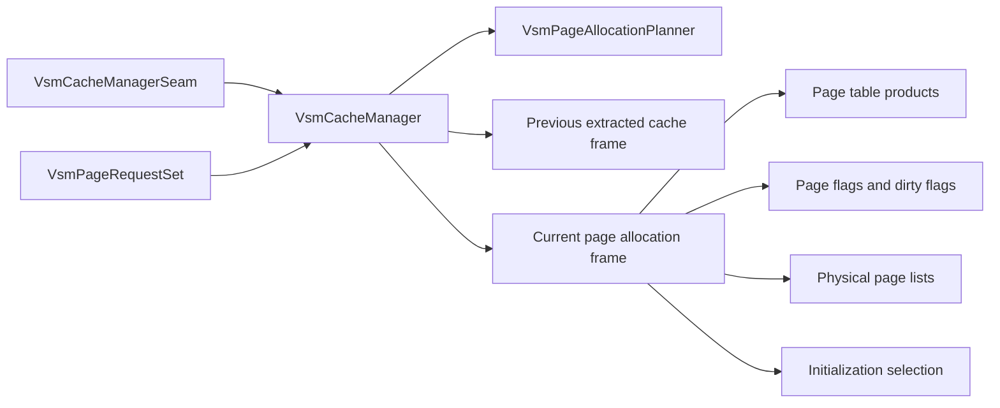

# Cache Manager and Page Allocation Implementation Plan

Status: `planned`
Audience: junior-to-mid C++ engineer implementing the next greenfield VSM slice
Scope: new `VsmCacheManager`, current-frame page-allocation products, previous-frame extraction, manual invalidation hooks, and deterministic allocation/reuse planning

Cross-references:

- `VirtualShadowMapArchitecture.md`
- `VsmPhysicalPoolAndAddressSpaceImplementationPlan.md`
- `UE5-VSM-Source-Analysis.md`

## Summary Tracking

This plan starts after the physical-pool, virtual-address-space, remap, seam, and hardening work is complete.

| Status | Phase | Deliverable | Exit Gate |
| --- | --- | --- | --- |
| ☑ | 0 | Module scaffolding and build wiring | New cache-manager code is wired into the renderer build and test graph cleanly |
| ☑ | 1 | Shared cache and allocation value types | All state, request, and result types have unit tests |
| ☑ | 2 | `VsmCacheManager` persistent lifecycle model | Cache-data state and frame-build state transitions are explicit and validated |
| ☑ | 3 | CPU page-allocation planner | Reuse, eviction, new allocation, and exhaustion paths are fully unit-tested |
| ☑ | 4 | GPU page-allocation working-set resources | Page-table and allocation buffers/textures have backend-backed lifecycle coverage |
| ☑ | 5 | Cache-manager orchestration and planner-backed current-frame commit path | Manager can consume the seam, request set, and planner to publish a current-frame allocation package end-to-end |
| ☑ | 6 | Retained-entry continuity publication | Retained unreferenced entries receive explicit current-frame continuity products without a second identity path |
| ☑ | 7 | Manual invalidation and selective initialization contracts | Invalidated pages stop reusing cleanly and initialization work is explicit |
| ☑ | 8 | Documentation, final verification, and troubleshooting hardening | Stable contracts, strategic logs, and all planned tests pass |

Deferred from earlier phases into later tracked work:

- Retained unreferenced-entry bookkeeping may exist before continuity publication lands, but actual reassignment of current-frame virtual IDs belongs to the dedicated retained-entry continuity phase because that behavior requires cache-manager-owned publication products rather than mutation of the captured seam.

## 1. Purpose

This document is the implementation plan for the next large greenfield VSM chunk:

- persistent cache state
- current-frame page allocation
- previous-to-current physical-page reuse
- current-frame page-table products for later rendering work

The previously completed low-level VSM slice established:

- physical pool ownership and compatibility
- HZB pool ownership
- virtual address-space layout publication
- remap and clipmap reuse contracts
- the seam package the future cache manager will consume

This plan turns those contracts into a real cache and allocation engine.

## 2. Scope and Explicit Non-Goals

### 2.1 In scope

- `VsmCacheManager`
- cache-data availability and invalidation state
- current-frame build state
- previous-frame extraction
- deterministic CPU allocation planning
- current-frame page table, flags, list, and rect-bound products
- backend-backed GPU resource lifetime for those products
- explicit manual invalidation entry points
- previous-frame HZB availability and compatibility gating for downstream users
- selective page initialization bookkeeping
- logging and contract checks from day 1

### 2.2 Explicitly out of scope for this plan

- screen-space page request generation from GBuffer, hair, or visibility buffers
- shadow rasterization into the physical page pool
- HZB build/update passes
- one-pass or per-light lighting projection/composite
- scene-mutation invalidation collectors
- GPU readback feedback loops
- unreferenced-entry aging/LRU policy beyond what is needed for deterministic extraction and invalidation
- static/dynamic slice merge after rendering

Those items are real future work, but they are downstream of a stable cache and allocation engine.

## 3. Build and Test Guide

This plan should be executed against the existing `build-ninja` tree in `Debug`.

Repository root for all commands below:

```powershell
Set-Location H:\projects\DroidNet\projects\Oxygen.Engine
```

### 3.1 Core build commands

```powershell
cmake --build out/build-ninja --config Debug --target oxygen-renderer --parallel 8
cmake --build out/build-ninja --config Debug --target Oxygen.Renderer.VirtualShadows.Tests --parallel 8
cmake --build out/build-ninja --config Debug --target Oxygen.Renderer.VirtualShadows.GpuLifecycle.Tests --parallel 8
```

### 3.2 Core test commands

```powershell
ctest --test-dir out/build-ninja -C Debug --output-on-failure -R "Oxygen.Renderer.VirtualShadows.Tests"
ctest --test-dir out/build-ninja -C Debug --output-on-failure -R "Oxygen.Renderer.VirtualShadows.GpuLifecycle.Tests"
```

### 3.3 Final phase sweep

```powershell
ctest --test-dir out/build-ninja -C Debug --output-on-failure -R "^Oxygen\\.Renderer\\."
```

### 3.4 Minimum completion bar per phase

A phase is not complete until:

- the new code builds in `out/build-ninja`
- the affected VSM tests pass in `Debug`
- the phase checklist can be updated with validation evidence, not assumption

## 4. Source-Grounded Design Inputs

The UE5 analysis establishes the most important architectural facts for this slice.

1. Frame-local working-set building and persistent cache management are separate responsibilities.
2. `UpdatePhysicalPages` is the core reuse engine.
3. New allocation happens only after reuse/eviction decisions are known.
4. Selected-page initialization is downstream of reuse and allocation, not a separate policy system.
5. Previous-frame extraction and cache-valid marking are explicit state transitions.
6. Invalidation operates on previous-frame data, not the current frame page table.
7. HZB update and lighting projection are downstream consumers of current allocation state.
8. Short-term retention of unreferenced cached lights preserves reuse by assigning new current-frame virtual IDs and remapping cached pages forward.
9. Dedicated scene invalidation writes previous-frame physical metadata flags first; current-frame page-table effects happen later during page-management/update.

The plan must preserve those facts without copying UE5 structure mechanically.

## 5. Desired Final Shape

The target composition for this slice is:



Important boundary:

- `VsmCacheManager` owns persistent cross-frame cache state and current-frame allocation orchestration.
- `VsmPageAllocationPlanner` is pure CPU logic and must stay independently testable.
- `VsmPhysicalPagePoolManager` still owns physical resource compatibility and pool lifetime.
- `VsmVirtualAddressSpace` still owns current-frame virtual layout publication.
- HZB update, raster, and projection remain outside this plan.
- This slice must consume the existing seam directly. Do not add a second public adapter layer that re-encodes seam identity under new names.
- For correctness-critical behavior, this slice follows the UE5-proven semantics for previous-frame invalidation and short-term unreferenced-entry retention rather than inventing a new model.

## 6. Recommended File Layout

Do not widen the module surface casually. Only add files when they carry a real ownership or dependency boundary.

Recommended contract-bearing files for this plan:

- `VirtualShadowMaps/VsmCacheManagerTypes.h`
- `VirtualShadowMaps/VsmCacheManagerTypes.cpp`
- `VirtualShadowMaps/VsmCacheManager.h`
- `VirtualShadowMaps/VsmCacheManager.cpp`

Recommended helper files once the CPU planner becomes real logic:

- `VirtualShadowMaps/VsmPageAllocationPlanner.h`
- `VirtualShadowMaps/VsmPageAllocationPlanner.cpp`

Do not create separate placeholder files for invalidation, GPU upload, or extraction unless a later phase proves the split is needed for clarity or dependency control.

When the dedicated GPU invalidation stage becomes real, add it as a concrete implementation file rather than burying it inside unrelated modules.

Recommended tests:

- `Test/VirtualShadow/VsmCacheManagerTypes_test.cpp`
- `Test/VirtualShadow/VsmCacheManagerState_test.cpp`
- `Test/VirtualShadow/VsmPageAllocationPlanner_test.cpp`
- `Test/VirtualShadow/VsmCacheManagerFrameLifecycle_test.cpp`
- `Test/VirtualShadow/VsmCacheManagerGpuResources_test.cpp`
- `Test/VirtualShadow/VsmCacheManagerInvalidation_test.cpp`

Recommended test-target integration:

- keep frequently run CPU-oriented VSM tests under `Oxygen.Renderer.VirtualShadows.Tests`
- keep backend-backed or dedicated VSM scenarios under `Oxygen.Renderer.VirtualShadows.GpuLifecycle.Tests`
- group test cases by architectural component using per-file fixtures derived from shared `VirtualShadow` fixture bases rather than one catch-all suite name

## 7. Naming and State Recommendations

Use the existing namespace:

```cpp
namespace oxygen::renderer::vsm {
}
```

Recommended top-level classes:

- `VsmCacheManager`
- `VsmPageAllocationPlanner`

Recommended foundational types:

- `VsmCacheManagerConfig`
- `VsmCacheManagerFrameConfig`
- `VsmCacheDataState`
- `VsmCacheBuildState`
- `VsmRemapKeyList`
- `VsmPageRequest`
- `VsmPageRequestFlags`
- `VsmPageTableEntry`
- `VsmPhysicalPageMeta`
- `VsmAllocationAction`
- `VsmAllocationFailureReason`
- `VsmPageAllocationDecision`
- `VsmPageAllocationPlan`
- `VsmPageInitializationAction`
- `VsmPageInitializationWorkItem`
- `VsmPageAllocationSnapshot`
- `VsmPageAllocationFrame`
- `VsmExtractedCacheFrame`
- `VsmCacheInvalidationReason`
- `VsmCacheInvalidationScope`
- `VsmLightCacheKind`
- `VsmCacheEntryFrameState`
- `VsmLightCacheEntryState`

### 7.1 Keep cache-data state and frame-build state separate

Do not collapse these into one overloaded enum.

Recommended cache-data state:

```cpp
enum class VsmCacheDataState : std::uint8_t {
  kUnavailable = 0,
  kAvailable = 1,
  kInvalidated = 2,
};
```

Meaning:

- `kUnavailable`: no previous extracted frame exists
- `kAvailable`: previous extracted frame is present and eligible for reuse checks
- `kInvalidated`: previous extracted frame data exists only for diagnostics or teardown, not reuse

Recommended frame-build state:

```cpp
enum class VsmCacheBuildState : std::uint8_t {
  kIdle = 0,
  kFrameOpen = 1,
  kPlanned = 2,
  kReady = 3,
};
```

Meaning:

- `kIdle`: no current frame is being built
- `kFrameOpen`: the seam is captured and requests may be recorded
- `kPlanned`: CPU allocation decisions are finalized
- `kReady`: the current frame allocation package is published for consumers

These two state machines must transition independently and explicitly.

### 7.2 Single-Source-of-Truth and Explicit Duplication Rules

This slice must extend the completed seam, not restate it.

Canonical sources of truth:

- physical pool identity and slice layout come only from `VsmCacheManagerSeam.physical_pool`
- HZB identity and availability come only from `VsmCacheManagerSeam.hzb_pool`
- virtual-map identity, remap keys, and layout class split come only from `VsmCacheManagerSeam.current_frame`
- previous-to-current remap compatibility comes only from `VsmCacheManagerSeam.previous_to_current_remap`

Rules:

1. No public cache-manager type may introduce a second logical identity model for virtual maps.
2. Public targeted invalidation APIs must use the seam's existing split:
   - local-light remap keys
   - directional clipmap remap keys
3. Any lookup maps keyed by remap key may exist only as internal derived indexes.
4. Any duplicated page-allocation data must be explicit and by design:
   - `VsmPageAllocationSnapshot` is the canonical CPU snapshot shape
   - `VsmPageAllocationFrame` owns the current-frame published package and embeds one `snapshot`
   - `VsmExtractedCacheFrame` is the previous-frame extracted copy of that same snapshot contract
5. If a value can be derived directly from the seam, do not restate it in config or another public type.

### 7.3 No disconnected adapter layer

The cache manager may add orchestration state and explicit derived indexes, but it must not introduce a disconnected family of "cache-facing" identity types that merely mirror seam data.

Allowed:

- explicit duplication inside `VsmPageAllocationSnapshot` or `VsmPageAllocationFrame` when that duplication is part of the published contract
- internal lookup tables derived from seam remap keys or page-table ranges
- normalized helper functions that translate seam payloads into planner inputs without changing their logical identity

Not allowed:

- a second public key type for local lights or clipmaps
- config structs that restate pool shape, virtual-layout identity, or remap compatibility inputs
- public "view model" types that duplicate seam contracts without adding ownership or lifecycle meaning

## 8. Component Contracts

### 8.1 `VsmCacheManager`

This class owns the cross-frame cache and the current-frame allocation build.

It is responsible for:

- consuming `VsmCacheManagerSeam`
- tracking cache-data availability
- tracking current-frame build stage
- storing previous extracted page-allocation data
- tracking previous-frame HZB availability separately from general cache-data availability
- retaining unreferenced cache entries for the configured short-term window and assigning current-frame virtual IDs needed for continuity
- accepting page requests for the current frame
- orchestrating reuse, eviction, and new allocation
- publishing current-frame allocation products
- extracting current-frame data for next-frame reuse
- handling explicit invalidation entry points

It is not responsible for:

- generating page requests from renderer visibility or screen-space buffers
- rasterizing shadow pages
- building HZB
- projection/composite into lighting targets
- collecting scene invalidation payloads
- owning the physical pool itself
- owning the virtual address-space allocator itself

### 8.2 `VsmPageAllocationPlanner`

This helper exists because the reuse/allocation algorithm must be deterministic and independently testable.

It is responsible for:

- validating page requests
- applying previous-to-current remap data
- deciding whether a request reuses an existing mapping
- deciding which previous mappings are evicted
- deciding which new physical pages must be allocated
- producing initialization work for dirty or newly allocated pages
- producing explicit failure reasons when the plan cannot satisfy a request

It must remain pure CPU logic.

### 8.3 `VsmPageAllocationFrame`

This is the current-frame working-set package for downstream render work.

It should contain at minimum:

- current frame generation
- pool identity
- current page-table view
- CPU mirror of page mappings for tests
- CPU mirror of physical page metadata for tests and extraction
- GPU resources for page table / flags / lists / rect bounds as needed
- the finalized allocation plan summary
- seam-derived HZB availability needed by downstream HZB/projection users

It must be read-only to consumers once published.

### 8.4 `VsmPageAllocationSnapshot`

This is the canonical CPU snapshot contract for both:

- current-frame published allocation state
- previous-frame extracted cache state

It must contain only copyable, test-friendly data and no policy flags.

The current frame may add GPU handles around that snapshot, but it must not redefine the underlying CPU contract.

Implementation note:

- the canonical snapshot may also carry seam-derived physical-pool compatibility details such as page size, tile capacity, slice count, depth format, and slice roles when those fields are required to validate previous-frame reuse without introducing a second public compatibility payload

## 9. Recommended Public API Shape

Recommended initial shape:

```cpp
class VsmCacheManager {
public:
  explicit VsmCacheManager(Graphics* gfx,
    const VsmCacheManagerConfig& config = {}) noexcept;

  auto Reset() -> void;

  auto BeginFrame(const VsmCacheManagerSeam& seam,
    const VsmCacheManagerFrameConfig& config = {}) -> void;
  auto SetPageRequests(std::span<const VsmPageRequest> requests) -> void;

  [[nodiscard]] auto BuildPageAllocationPlan()
    -> const VsmPageAllocationPlan&;
  [[nodiscard]] auto CommitPageAllocationFrame()
    -> const VsmPageAllocationFrame&;

  auto ExtractFrameData() -> void;
  auto InvalidateAll(VsmCacheInvalidationReason reason) -> void;
  auto InvalidateLocalLights(const VsmRemapKeyList& remap_keys,
    VsmCacheInvalidationScope scope,
    VsmCacheInvalidationReason reason) -> void;
  auto InvalidateDirectionalClipmaps(const VsmRemapKeyList& remap_keys,
    VsmCacheInvalidationScope scope,
    VsmCacheInvalidationReason reason) -> void;

  [[nodiscard]] auto DescribeCacheDataState() const noexcept
    -> VsmCacheDataState;
  [[nodiscard]] auto DescribeBuildState() const noexcept
    -> VsmCacheBuildState;
  [[nodiscard]] auto IsCacheDataAvailable() const noexcept -> bool;
  [[nodiscard]] auto IsHzbDataAvailable() const noexcept -> bool;
  [[nodiscard]] auto GetCurrentFrame() const noexcept
    -> const VsmPageAllocationFrame*;
  [[nodiscard]] auto GetPreviousFrame() const noexcept
    -> const VsmExtractedCacheFrame*;
};
```

Design rules:

- `VsmCacheManagerConfig` must not duplicate pool shape or virtual-frame shape. Those come from the seam and remain single-source-of-truth.
- `VsmCacheManagerFrameConfig` must not smuggle pool identity, remap compatibility, or virtual-layout descriptors around `BeginFrame`. Those arrive only through the seam.
- `BeginFrame` is the only entry point that may capture a new seam.
- short-term retention of unreferenced entries must remain inside `VsmCacheManager`; do not push that policy into `VsmVirtualAddressSpace`
- `SetPageRequests` replaces the full request set for determinism. Do not make it append-only yet.
- `BuildPageAllocationPlan` is pure-orchestrated planning and must not mutate GPU resources.
- `CommitPageAllocationFrame` publishes the current frame and performs any GPU upload/resource work.
- Any published duplication of seam-derived values must be explicit in the owning type and covered by equality/consistency tests.
- `ExtractFrameData` is the only entry point that may transition cache data to reusable `kAvailable`.
- `InvalidateAll`, `InvalidateLocalLights`, and `InvalidateDirectionalClipmaps` must be explicit and logged.
- targeted invalidation must carry explicit scope for `static`, `dynamic`, or `both`
- targeted invalidation must use existing remap keys from the seam, not a second public cache-entry identity type
- the invalidation contract must remain compatible with a later dedicated GPU invalidation stage that writes previous-frame physical metadata flags only
- HZB availability must be tracked separately from generic cache-data availability because previous-frame HZB reuse is compatibility-gated, not implied by cache-data reuse

## 10. Proposed Foundational Types

### 10.1 Request and cache identity

```cpp
struct VsmCacheManagerConfig {
  bool allow_reuse { true };
  bool enable_strict_contract_checks { true };
  std::string debug_name {};

  auto operator==(const VsmCacheManagerConfig&) const -> bool = default;
};

struct VsmCacheManagerFrameConfig {
  bool allow_reuse { true };
  bool force_invalidate_all { false };
  std::string debug_name {};

  auto operator==(const VsmCacheManagerFrameConfig&) const -> bool = default;
};

enum class VsmPageRequestFlags : std::uint8_t {
  kNone = 0,
  kRequired = 1 << 0,
  kCoarse = 1 << 1,
  kStaticOnly = 1 << 2,
};

struct VsmPageRequest {
  VsmVirtualShadowMapId map_id { 0 };
  VsmVirtualPageCoord page {};
  VsmPageRequestFlags flags { VsmPageRequestFlags::kRequired };

  auto operator==(const VsmPageRequest&) const -> bool = default;
};

using VsmPageRequestSet = std::vector<VsmPageRequest>;
using VsmRemapKeyList = std::vector<std::string>;

enum class VsmCacheInvalidationReason : std::uint8_t {
  kNone = 0,
  kExplicitReset = 1,
  kExplicitInvalidateAll = 2,
  kTargetedInvalidate = 3,
  kIncompatiblePool = 4,
  kIncompatibleFrameShape = 5,
};

enum class VsmCacheInvalidationScope : std::uint8_t {
  kDynamicOnly = 0,
  kStaticOnly = 1,
  kStaticAndDynamic = 2,
};

enum class VsmLightCacheKind : std::uint8_t {
  kLocal = 0,
  kDirectional = 1,
};

struct VsmCacheEntryFrameState {
  std::uint64_t rendered_frame { 0 };
  std::uint64_t scheduled_frame { 0 };
  bool is_uncached { false };
  bool is_distant { false };

  auto operator==(const VsmCacheEntryFrameState&) const -> bool = default;
};

struct VsmLightCacheEntryState {
  std::string remap_key {};
  VsmLightCacheKind kind { VsmLightCacheKind::kLocal };
  VsmCacheEntryFrameState previous_frame_state {};
  VsmCacheEntryFrameState current_frame_state {};

  auto operator==(const VsmLightCacheEntryState&) const -> bool = default;
};
```

### 10.2 Current mapping and metadata

```cpp
struct VsmPageTableEntry {
  bool is_mapped { false };
  VsmPhysicalPageIndex physical_page { 0 };

  auto operator==(const VsmPageTableEntry&) const -> bool = default;
};

struct VsmPhysicalPageMeta {
  bool is_allocated { false };
  bool is_dirty { false };
  bool used_this_frame { false };
  bool view_uncached { false };
  bool static_invalidated { false };
  bool dynamic_invalidated { false };
  std::uint32_t age { 0 };
  VsmVirtualShadowMapId owner_id { 0 };
  std::uint32_t owner_mip_level { 0 };
  VsmVirtualPageCoord owner_page {};
  std::uint64_t last_touched_frame { 0 };

  auto operator==(const VsmPhysicalPageMeta&) const -> bool = default;
};
```

### 10.3 Planner results

```cpp
enum class VsmAllocationAction : std::uint8_t {
  kReuseExisting = 0,
  kAllocateNew = 1,
  kInitializeOnly = 2,
  kEvict = 3,
  kReject = 4,
};

enum class VsmAllocationFailureReason : std::uint8_t {
  kNone = 0,
  kInvalidRequest = 1,
  kNoAvailablePhysicalPages = 2,
  kEntryInvalidated = 3,
  kRemapRejected = 4,
  kCacheUnavailable = 5,
};

struct VsmPageAllocationDecision {
  VsmPageRequest request {};
  VsmAllocationAction action { VsmAllocationAction::kReject };
  VsmAllocationFailureReason failure_reason { VsmAllocationFailureReason::kNone };
  VsmPhysicalPageIndex previous_physical_page { 0 };
  VsmPhysicalPageIndex current_physical_page { 0 };

  auto operator==(const VsmPageAllocationDecision&) const -> bool = default;
};

struct VsmPageAllocationPlan {
  std::vector<VsmPageAllocationDecision> decisions {};
  std::uint32_t reused_page_count { 0 };
  std::uint32_t allocated_page_count { 0 };
  std::uint32_t initialized_page_count { 0 };
  std::uint32_t evicted_page_count { 0 };
  std::uint32_t rejected_page_count { 0 };

  auto operator==(const VsmPageAllocationPlan&) const -> bool = default;
};
```

### 10.4 Extracted and published frames

```cpp
struct VsmPageAllocationSnapshot {
  std::uint64_t frame_generation { 0 };
  std::uint64_t pool_identity { 0 };
  bool is_hzb_data_available { false };
  VsmVirtualAddressSpaceFrame virtual_frame {};
  std::vector<VsmLightCacheEntryState> light_cache_entries {};
  std::vector<VsmPageTableEntry> page_table {};
  std::vector<VsmPhysicalPageMeta> physical_pages {};

  auto operator==(const VsmPageAllocationSnapshot&) const -> bool = default;
};

struct VsmPageAllocationFrame {
  VsmPageAllocationSnapshot snapshot {};
  VsmPageAllocationPlan plan {};
  bool is_ready { false };

  auto operator==(const VsmPageAllocationFrame&) const -> bool = default;
};

using VsmExtractedCacheFrame = VsmPageAllocationSnapshot;
```

These types are intentionally plain and test-friendly. GPU handles can be added to `VsmPageAllocationFrame` once Phase 4 reaches the backend-backed layer, but the underlying CPU snapshot contract must remain `VsmPageAllocationSnapshot`.

The live implementation extends this snapshot with seam-derived physical-pool compatibility fields so later lifecycle and planner phases can evaluate previous-frame reuse against the canonical extracted snapshot rather than a parallel identity structure.

## 11. Logging and Contract-Check Rules

These rules apply from Phase 0 onward.

1. Public invalid input must be validated up front.
2. Invalid public input must log a warning and fail deterministically.
3. Impossible internal state transitions must use `CHECK_F` or `DCHECK_F`.
4. Transition logs must be aggregate and high-signal.
5. Log messages must not repeat class names because file names already identify the source.
6. Hot per-page loops must not emit one log line per page in normal operation.

Recommended entry-point behavior:

- config or request-shape errors:
  - `LOG_F(WARNING, ...)`
  - throw `std::invalid_argument` or return an explicit rejection result
- illegal API ordering such as `CommitPageAllocationFrame()` before `BuildPageAllocationPlan()`:
  - `CHECK_F(...)`
- state transitions:
  - `DLOG_F(2, ...)`
- rejection summaries from the planner:
  - `DLOG_F(2, ...)` with counts by action/failure reason

Tests for invalid input and invalid transition behavior must arrive in the same phase as the code.

## 12. Phase-by-Phase Execution Plan

## Phase 0. Module Scaffolding and Build Wiring

Goal:

- create the new cache-manager surface and wire it into the existing VSM build/test graph cleanly

Tasks:

- add `VsmCacheManagerTypes.*`
- add `VsmCacheManager.*`
- defer `VsmPageAllocationPlanner.*` until Phase 3 when it carries real logic
- add non-placeholder tests only
- wire them into the existing VSM test executables
- add contract-check and logging expectations to the phase doc comments from the start

Tests:

- new files compile
- renderer target builds
- VSM contract and GPU lifecycle test targets still build
- no placeholder adapter types or seam-mirroring "view" types are introduced

Exit criteria:

- no placeholder files
- new module files are in the renderer build graph cleanly
- no disconnected public adapter layer exists between `VsmCacheManagerSeam` and `VsmCacheManager`

Validation evidence on 2026-03-24:

- built `oxygen-renderer` in `out/build-ninja` (`Debug`)
- built `Oxygen.Renderer.VirtualShadows.Tests` in `out/build-ninja` (`Debug`)
- built `Oxygen.Renderer.VirtualShadows.GpuLifecycle.Tests` in `out/build-ninja` (`Debug`)
- ran `ctest --test-dir out/build-ninja -C Debug --output-on-failure -R "Oxygen\\.Renderer\\.VirtualShadows\\.Tests|Oxygen\\.Renderer\\.VirtualShadows\\.GpuLifecycle\\.Tests"` with `100% tests passed, 0 tests failed out of 2`

## Phase 1. Shared Cache and Allocation Value Types

Goal:

- establish stable, testable cache-manager contracts before lifecycle or allocation logic becomes large

Tasks:

- implement cache state enums
- implement frame-build state enums
- implement request types and flags
- implement remap-key list type for explicit targeted invalidation
- implement page-table entry and physical-page metadata types
- implement allocation action / failure enums
- implement `to_string(...)` helpers for all public result and state enums
- implement validation helpers for request and remap-key list shapes

Tests:

- default-constructed invalid requests are rejected
- invalid remap-key lists are rejected
- state enums stringify deterministically
- value types preserve configured values exactly
- extracted-frame aliasing rules are explicit and testable at the type level
- config and frame-config types do not restate seam-owned identity or layout payloads

Exit criteria:

- all public cache-manager types exist
- all validation helpers are unit-tested
- no lifecycle logic exists yet

Validation evidence on 2026-03-24:

- built `Oxygen.Renderer.VirtualShadows.Tests` in `out/build-ninja` (`Debug`)
- ran `ctest --test-dir out/build-ninja -C Debug --output-on-failure -R "Oxygen\\.Renderer\\.VirtualShadows\\.Tests|Oxygen\\.Renderer\\.VirtualShadows\\.GpuLifecycle\\.Tests"` with `100% tests passed, 0 tests failed out of 2`

## Phase 2. `VsmCacheManager` Persistent Lifecycle Model

Goal:

- implement explicit cache-data and frame-build state transitions before allocation logic lands

Tasks:

- implement constructor / `Reset`
- implement `BeginFrame`
- implement `DescribeCacheDataState`
- implement `DescribeBuildState`
- implement `IsCacheDataAvailable`
- implement `ExtractFrameData`
- implement whole-cache invalidation
- define compatibility rules between current seam and previous extracted state
- invalidate reusable data when pool identity changes or when the extracted
  snapshot shape is incompatible with the current publication contract
- compute previous-frame HZB availability separately from general cache-data availability

Tests:

- constructor starts at `kUnavailable` + `kIdle`
- `BeginFrame` transitions to `kFrameOpen`
- `ExtractFrameData` from a ready frame transitions cache data to `kAvailable`
- `InvalidateAll` transitions cache data to `kInvalidated`
- incompatible pool identity blocks reuse and invalidates previous data
- ordinary raw seam layout-count changes do not by themselves invalidate reuse
- extraction produces an `VsmExtractedCacheFrame` that preserves the canonical `VsmPageAllocationSnapshot` shape
- `Reset` clears both state machines
- illegal API order fails deterministically
- seam compatibility decisions are derived from the canonical extracted
  snapshot/publication contract rather than duplicated cache-manager identity
  payloads or raw captured page-table-count equality
- retained unreferenced-entry bookkeeping remains explicit without introducing a second public identity model
- HZB availability is false when cache data exists but previous-frame HZB compatibility is not satisfied

Exit criteria:

- lifecycle transitions are explicit and validated
- previous extracted frame storage exists
- logging and contract checks exist for all public transitions

Phase-boundary note:

- Actual reassignment of current-frame virtual IDs for retained unreferenced entries is deferred until the cache manager publishes current-frame allocation products. The raw captured seam does not provide a legal place to mutate or append current-frame virtual layouts without violating the single-source-of-truth rule.

Validation evidence on 2026-03-24:

- built `Oxygen.Renderer.VirtualShadows.Tests` in `out/build-ninja` (`Debug`)
- the build also rebuilt `oxygen-renderer` as part of the contract-target dependency chain
- ran `ctest --test-dir out/build-ninja -C Debug --output-on-failure -R "Oxygen\\.Renderer\\.VirtualShadows\\.Tests|Oxygen\\.Renderer\\.VirtualShadows\\.GpuLifecycle\\.Tests"` with `100% tests passed, 0 tests failed out of 2`

## Phase 3. CPU Page-Allocation Planner

Goal:

- implement deterministic, pure CPU reuse/allocation planning

Tasks:

- introduce `VsmPageAllocationPlanner.*`
- validate page requests
- consume previous extracted frame + current seam + remap table
- implement reuse of compatible, valid mappings
- implement eviction of invalid or non-reusable mappings
- implement new allocation from available physical pages
- implement explicit exhaustion failure reporting
- produce initialization work for newly allocated or invalidated pages
- aggregate decision counts

Tests:

- reusable page mappings are kept when remap and ownership remain valid
- invalidated entries are not reused
- remap-rejected entries produce explicit failure reasons
- new allocation consumes available physical pages deterministically
- allocation exhaustion produces explicit rejection
- one previous page never maps to multiple current requests
- planner output is deterministic across repeated runs

Exit criteria:

- reuse/allocation logic is fully testable without GPU resources
- failure reasons are explicit and deterministic

Phase-boundary note:

- `VsmPageAllocationPlanner` now owns the pure CPU reuse/allocation algorithm directly, but `VsmCacheManager` still does not capture request sets or delegate to the planner until Phase 5. That integration remains deferred explicitly rather than hidden behind placeholder manager behavior.

Validation evidence on 2026-03-24:

- built `Oxygen.Renderer.VirtualShadows.Tests` in `out/build-ninja` (`Debug`)
- built `Oxygen.Renderer.VirtualShadows.GpuLifecycle.Tests` in `out/build-ninja` (`Debug`) after the renderer library surface expanded with `VsmPageAllocationPlanner.*`
- ran `ctest --test-dir out/build-ninja -C Debug --output-on-failure -R "Oxygen\\.Renderer\\.VirtualShadows\\.Tests|Oxygen\\.Renderer\\.VirtualShadows\\.GpuLifecycle\\.Tests"` with `100% tests passed, 0 tests failed out of 2`

## Phase 4. GPU Page-Allocation Working-Set Resources

Goal:

- attach real backend-backed resource lifetime to the current-frame page-allocation package

Tasks:

- add page-table buffer/resource creation
- add page-flag / dirty-flag buffer creation
- add physical page list buffer creation
- add page-rect bounds buffer creation
- add recreation and disposal paths
- keep CPU mirrors available for tests and extraction
- publish the GPU handles through `VsmPageAllocationFrame`

Tests:

- creating a frame package yields non-null handles when graphics is available
- repeated compatible frames preserve reusable working-set resources where intended
- incompatible shape changes recreate working-set resources
- reset/dispose releases handles
- CPU mirrors remain available even when graphics is null

Test style:

- use the offscreen graphics backend harness
- do not require a full render graph

Exit criteria:

- page-allocation frame resource lifetime is correct
- backend-backed tests pass

Validation evidence on 2026-03-24:

- built `oxygen-renderer` in `out/build-ninja` (`Debug`)
- built `Oxygen.Renderer.VirtualShadows.Tests` in `out/build-ninja` (`Debug`)
- built `Oxygen.Renderer.VirtualShadows.GpuLifecycle.Tests` in `out/build-ninja` (`Debug`)
- ran `ctest --test-dir out/build-ninja -C Debug --output-on-failure -R "Oxygen\\.Renderer\\.VirtualShadows\\.Tests|Oxygen\\.Renderer\\.VirtualShadows\\.GpuLifecycle\\.Tests"` with `100% tests passed, 0 tests failed out of 2`

## Phase 5. Cache-Manager Orchestration and Planner-Backed Current-Frame Commit

Goal:

- make the manager consume the seam and publish a current-frame allocation package end-to-end

Tasks:

- implement `SetPageRequests`
- implement `BuildPageAllocationPlan`
- implement `CommitPageAllocationFrame`
- connect the manager to the planner
- publish `GetCurrentFrame`
- preserve previous extracted frame until the next successful extraction
- log aggregate planning summaries

Tests:

- cold-start frame with valid requests produces a ready current frame
- compatible previous extracted frame enables reuse on the next frame
- current frame is not published before planning and commit
- `GetCurrentFrame` and `GetPreviousFrame` reflect the correct lifecycle stage
- plan summaries match the committed frame counts
- the published current frame embeds the canonical `VsmPageAllocationSnapshot` contract without redefining it
- any duplicated seam-derived values published in the frame remain bit-for-bit consistent with the seam snapshot captured at `BeginFrame`

Exit criteria:

- manager works end-to-end with synthetic requests
- current-frame allocation package is stable and testable

Validation evidence on 2026-03-24:

- built `Oxygen.Renderer.VirtualShadows.Tests` in `out/build-ninja` (`Debug`)
- built `Oxygen.Renderer.VirtualShadows.GpuLifecycle.Tests` in `out/build-ninja` (`Debug`)
- ran `ctest --test-dir out/build-ninja -C Debug --output-on-failure -R "Oxygen\\.Renderer\\.VirtualShadows\\.Tests|Oxygen\\.Renderer\\.VirtualShadows\\.GpuLifecycle\\.Tests"` with `100% tests passed, 0 tests failed out of 2`

## Phase 6. Retained-Entry Continuity Publication

Goal:

- publish retained unreferenced-entry continuity products through the cache manager without mutating the captured seam or introducing a second identity model

Tasks:

- retain unreferenced cache entries for the configured short-term window
- assign valid current-frame virtual IDs for retained entries through published cache-manager-owned products
- preserve physical-page continuity for retained entries through remap-compatible publication
- publish the current-frame continuity data needed by future reuse and invalidation consumers
- keep retained-entry bookkeeping explicit and testable without leaking a second public cache identity path

Tests:

- an unreferenced retained entry receives valid current-frame virtual IDs
- retained entries preserve physical-page continuity while within the retention window
- expired retained entries are evicted deterministically
- retained-entry publication remains consistent with remap compatibility and does not mutate the captured seam snapshot

Exit criteria:

- retained-entry current-frame continuity work from Phase 2 is implemented through published frame products
- no second public identity path exists for retained continuity

Validation evidence on 2026-03-24:

- built `Oxygen.Renderer.VirtualShadows.Tests` in `out/build-ninja` (`Debug`)
- built `Oxygen.Renderer.VirtualShadows.GpuLifecycle.Tests` in `out/build-ninja` (`Debug`)
- ran `ctest --test-dir out/build-ninja -C Debug --output-on-failure -R "Oxygen\\.Renderer\\.VirtualShadows\\.Tests|Oxygen\\.Renderer\\.VirtualShadows\\.GpuLifecycle\\.Tests"` with `100% tests passed, 0 tests failed out of 2`

## Phase 7. Manual Invalidation and Selective Initialization Contracts

Goal:

- make invalidation and initialization work explicit and deterministic before later render passes consume them

Tasks:

- implement `InvalidateLocalLights`
- implement `InvalidateDirectionalClipmaps`
- mark invalidated pages in physical-page metadata
- record invalidation scope into explicit `static_invalidated` / `dynamic_invalidated` metadata
- ensure invalidated pages stop reusing even if remap still matches
- publish initialization work through the allocation plan/frame package
- keep initialization selection independent from raster policy
- document how invalidation and initialization interact with cache-data state
- keep the metadata and API shape compatible with the later dedicated GPU invalidation stage used by renderer integration

Tests:

- local-light invalidation affects only matching local-light remap keys
- directional clipmap invalidation affects only matching directional remap keys
- invalidated pages transition to initialization work on the next committed frame
- whole-cache invalidation clears reuse eligibility for all entries
- invalidating after extraction affects the next frame, not the extracted snapshot retroactively
- invalidation logs are aggregate and deterministic

Exit criteria:

- invalidation behavior is explicit and test-covered
- initialization work is a first-class published product

Validation evidence on 2026-03-24:

- built `Oxygen.Renderer.VirtualShadows.Tests` in `out/build-ninja` (`Debug`)
- built `Oxygen.Renderer.VirtualShadows.GpuLifecycle.Tests` in `out/build-ninja` (`Debug`)
- ran `ctest --test-dir out/build-ninja -C Debug --output-on-failure -R "Oxygen\\.Renderer\\.VirtualShadows\\.Tests|Oxygen\\.Renderer\\.VirtualShadows\\.GpuLifecycle\\.Tests"` with `100% tests passed, 0 tests failed out of 2`

## Phase 8. Documentation, Final Verification, and Troubleshooting Hardening

Goal:

- close the loop so this cache/allocation module is ready for later request-generation, raster, and HZB/projection integration work

Tasks:

- update `VirtualShadowMapArchitecture.md` to include the cache manager as an active greenfield module
- add a short `README` note in `VirtualShadowMaps/` only if the file layout meaningfully expands
- verify all log messages stay high-signal and prefix-free
- verify all public entry points perform upfront validation
- verify no new code depends on legacy VSM symbols
- run the broader renderer sweep

Tests:

- all new VSM contract tests pass
- all new VSM GPU lifecycle tests pass
- existing renderer tests still pass
- current code compiles without legacy VSM dependencies

Exit criteria:

- stable contracts
- explicit state transitions
- strategic logging in place
- test suite ready for the next renderer-integration chunk

Validation evidence on 2026-03-24:

- built `Oxygen.Renderer.VirtualShadows.Tests` in `out/build-ninja` (`Debug`)
- built `Oxygen.Renderer.VirtualShadows.GpuLifecycle.Tests` in `out/build-ninja` (`Debug`)
- ran `ctest --test-dir out/build-ninja -C Debug --output-on-failure -R "Oxygen\\.Renderer\\.VirtualShadows\\.Tests|Oxygen\\.Renderer\\.VirtualShadows\\.GpuLifecycle\\.Tests"` with `100% tests passed, 0 tests failed out of 2`
- ran `ctest --test-dir out/build-ninja -C Debug --output-on-failure -R "^Oxygen\\.Renderer\\."` with `100% tests passed, 0 tests failed out of 22`
- audited `src/Oxygen/Renderer/VirtualShadowMaps` and `src/Oxygen/Renderer/Test/VirtualShadow` for legacy-shadow symbol patterns with `rg`; no matches were found

## 13. Recommended Test Strategy

Use four test layers.

### 13.1 Pure value-type tests

For:

- state enums
- request validation
- allocation result types
- metadata structs

These should have zero graphics dependencies.

### 13.2 Lifecycle tests

For:

- cache-data state transitions
- frame-build transitions
- extraction / invalidation ordering
- illegal API ordering

These should remain CPU-only.

### 13.3 Planner tests

For:

- reuse
- eviction
- new allocation
- invalidation effects
- exhaustion behavior

These should remain CPU-only and deterministic.

### 13.4 Backend-backed resource tests

For:

- working-set resource creation
- reuse versus recreation
- disposal
- handle publication

These should use the offscreen graphics backend harness.

## 14. Junior Dev Execution Rules

Follow these rules while implementing.

1. Do not start with GPU buffers. Start with types, state machines, and CPU planner contracts.
2. Do not collapse cache-data state and frame-build state into one enum.
3. Do not put the full reuse/allocation algorithm directly in `VsmCacheManager.cpp`. Isolate it in `VsmPageAllocationPlanner`.
4. Do not let invalidation semantics hide inside implicit side effects. Make invalidation an explicit API and explicit metadata state.
5. Do not replace the architecture's dedicated GPU invalidation model with a CPU-only shortcut.
6. Do not add HZB build logic to this slice. HZB update is downstream.
7. Do not add raster or projection policy to this slice.
8. Do not depend on legacy VSM symbols "temporarily". That path becomes permanent technical debt.
9. Do not land new public entry points without matching validation and tests.

## 15. Final Deliverables Checklist

This implementation work is complete only when all of the following are true.

- `VsmCacheManager` exists in new greenfield files
- cache-data state and frame-build state are explicit and independently queryable
- previous-frame extraction exists
- current-frame allocation planning exists
- current-frame allocation package exists
- any duplicated allocation data is explicit and built around the canonical `VsmPageAllocationSnapshot`
- any published duplicated identity data is explicitly seam-derived and consistency-tested
- no second public cache-entry identity model exists alongside seam remap keys
- invalidation is explicit and test-covered
- initialization work is explicit and test-covered
- GPU working-set resources are backend-tested
- no new code depends on the legacy VSM path
- the next chunks can consume this module without reopening its core design

## 16. One-Sentence Summary

Build the next VSM slice as a deterministic, test-first `VsmCacheManager` plus a pure CPU page-allocation planner that consumes the existing seam, owns explicit cache/build state transitions, and publishes current-frame page-allocation products for later renderer integration.
