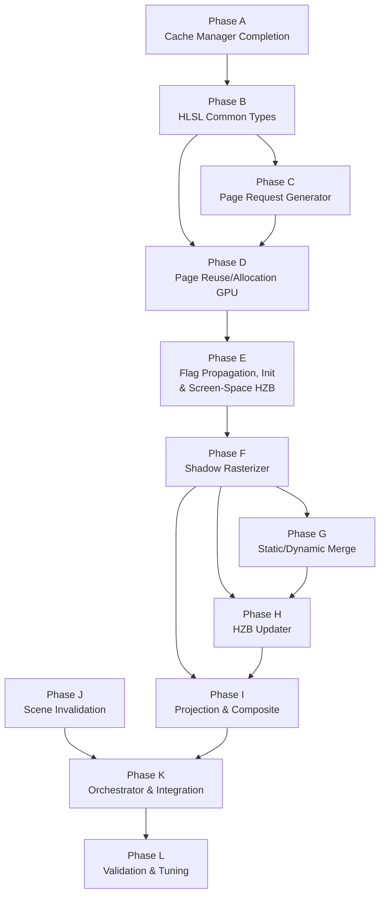

# Virtual Shadow Map — Remaining Implementation Plan

Status: `planned`
Audience: engineer implementing VSM rendering pipeline stages
Scope: all work required to bring the VSM system from its current CPU-side cache/allocation engine to a fully functional shadow rendering pipeline

Cross-references:

- `VirtualShadowMapArchitecture.md` — authoritative architecture spec
- `VsmCacheManagerAndPageAllocationImplementationPlan.md` — completed cache-manager/allocation plan (Phases 0–8 done)
- `VsmShadowRasterizerImplementationPlan.md` — active Phase F sub-plan

CPU-GPU ABI Guidelines

- keep rich CPU cache/state in CPU-only structs/classes,
- expose page tables/flags as packed scalar GPU buffers,
- use dedicated shader payload structs for projection data,
- only share a struct across CPU/GPU when it is already a small, ABI-stable POD record

---

## 1. Current State

The following modules are implemented; statuses below reflect their current
validation state:

| Module | Architecture § | Status | Key Files |
| ------ | -------------- | ------ | --------- |
| Physical Page Pool Manager | §3.1 | ✅ Complete | `VsmPhysicalPagePoolManager.h/.cpp`, `VsmPhysicalPagePoolTypes.h/.cpp`, `VsmPhysicalPageAddressing.h/.cpp`, `VsmPhysicalPoolCompatibility.h/.cpp` |
| Virtual Address Space | §3.2 | ✅ Complete | `VsmVirtualAddressSpace.h/.cpp`, `VsmVirtualAddressSpaceTypes.h/.cpp`, `VsmVirtualClipmapHelpers.h/.cpp`, `VsmVirtualRemapBuilder.h/.cpp` |
| Cache Manager | §3.3 | ✅ Complete | `VsmCacheManager.h/.cpp`, `VsmCacheManagerSeam.h`, `VsmCacheManagerTypes.h/.cpp` |
| Page Allocation Planner | §3.4 | ✅ Complete | `VsmPageAllocationPlanner.h/.cpp`, `VsmPageAllocationSnapshotHelpers.h` |
| Shader ABI Contracts | §4.1–§4.5 | ✅ Complete | `VsmShaderTypes.h`, `Shaders/Renderer/Vsm/Vsm*.hlsli` |

Test coverage: 22 test files across CPU and GPU lifecycle suites.

The remaining phases below explicitly own the current forward gaps from the
implemented cache/allocation slice:

- dedicated GPU invalidation instead of today's CPU-queued planning-copy bridge
- current and previous-frame projection-data publication/upload
- scene-mutation invalidation workloads
- static-slice recache work, distinct from the fixed `slice1 -> slice0` merge
- distant-local-light refresh budgeting
- point-light per-face update scheduling
- translucent-receiver transmission sampling paths

### What Exists in Renderer Infrastructure (Already Usable)

| Component | Class / File | Relevance |
| --------- | ----------- | --------- |
| Shadow coordination | `ShadowManager` | Currently conventional-only; VSM extends via new policy |
| Pipeline orchestration | `ForwardPipeline`, `RenderingPipeline` | Coroutine-based pass registration |
| Depth input | `DepthPrePass` | Produces screen depth for page request generation and screen-space HZB |
| Screen-space HZB | `ScreenHzbBuildPass` (new) | Renderer-level min-reduce pyramid over `DepthPrePass` output; consumed by VSM Stage 12 instance culling |
| Compute pass base | `ComputeRenderPass` | Base class for VSM compute passes |
| Graphics pass base | `GraphicsRenderPass` | Base class for VSM raster passes |
| Forward lighting shader | `ForwardDirectLighting.hlsli` | Calls `ComputeShadowVisibility()`; swap point for VSM |
| Scene observer system | `ISceneObserver`, `SceneObserverSyncModule` | Mutation dispatch for invalidation |
| Render graph factory | `Renderer::RegisterViewRenderGraph()` | Per-view render graph composition |

---

## 2. Remaining Work — Summary

| Status | Phase | Deliverable | Exit Gate |
| ------ | ----- | ----------- | --------- |
| ☑ | A | Cache-manager plan completion (Phase 8) | Completed in `VsmCacheManagerAndPageAllocationImplementationPlan.md` |
| ☑ | B | VSM HLSL common types and page-table structures | ABI types exist, CPU ↔ GPU parity is verified, and runtime VSM shaders compile through the build-time shader bake |
| ☑ | C | Page Request Generator pass | Compute pass produces correct page request flags for test scenes with depth and clustered-light inputs |
| ☑ | D | Physical page reuse and allocation GPU passes | GPU passes implement stages 6–8 (reuse, pack, allocate) |
| ☑ | E | Page flag propagation, initialization, and screen-space HZB passes | Stages 9–11 plus renderer-level `ScreenHzbBuildPass`; hierarchical flags, mapped-mip propagation, selective page init, and screen-space HZB available for Phase F culling |
| ☐ | F | Shadow Rasterizer pass | GPU-driven per-page shadow depth rendering with culling |
| ☐ | G | Static/Dynamic Merge pass | Composite static slice into dynamic slice for dirty pages |
| ☐ | H | HZB Updater pass | Selective per-page hierarchical Z-buffer rebuild |
| ☐ | I | Projection and Composite pass | Screen-space shadow factor generation for directional + local lights |
| ☐ | J | Scene invalidation integration | Scene observer → cache manager invalidation pipeline |
| ☐ | K | VSM orchestrator and renderer integration | Wire all passes into ForwardPipeline; ShadowManager VSM policy path |
| ☐ | L | End-to-end validation and performance tuning | Full frame renders correct shadows; profiling and budget tuning |

---

## 3. Phase Details

### Phase A — Cache-Manager Plan Completion

**Architecture ref:** wrap-up of `VsmCacheManagerAndPageAllocationImplementationPlan.md` Phase 8

**Status:** completed on 2026-03-24 through the dedicated cache-manager/allocation plan.

**Deliverables:**

- [x] Verify all existing VSM tests pass (`Oxygen.Renderer.VirtualShadows.Tests` + `GpuLifecycle.Tests`)
- [x] Review strategic `LOG_F` / `LOG_SCOPE_F` placements in cache manager and planner for production diagnostics
- [x] Document troubleshooting guide in `VirtualShadowMaps/README.md`
- [x] Close Phase 8 in the existing implementation plan

**Exit gate:** All tests green, README updated, Phase 8 marked ☑.

---

### Phase B — VSM HLSL Common Types and Page-Table Structures

**Architecture ref:** §4.1 (Virtual Page Table), §4.2 (Physical Page Metadata), §4.3 (Page Flags)

**Status:** completed on 2026-03-24.

**Deliverables:**

- [x] Create `Shaders/Renderer/Vsm/VsmCommon.hlsli` — shared constants (page size, max mip levels, flag bits)
- [x] Create `Shaders/Renderer/Vsm/VsmPageTable.hlsli` — `PageTableEntry` struct, page-table lookup functions
- [x] Create `Shaders/Renderer/Vsm/VsmPhysicalPageMeta.hlsli` — physical page metadata struct matching CPU layout
- [x] Create `Shaders/Renderer/Vsm/VsmPageFlags.hlsli` — virtual page flag definitions and accessors
- [x] Verify CPU ↔ GPU struct layout parity (same sizes, same field offsets) via static assertions or a validation test
- [x] Create `Shaders/Renderer/Vsm/VsmProjectionData.hlsli` — per-map projection data struct (§4.5)
- [x] Define the CPU ↔ GPU projection-data contract needed for both current-frame projection and retained previous-frame invalidation data

**Exit gate:** Runtime VSM shaders that consume the shared HLSL headers compile through the build-time shader bake; struct sizes match CPU counterparts.

Validation evidence on 2026-03-24:

- added `src/Oxygen/Renderer/VirtualShadowMaps/VsmShaderTypes.h`
- added `src/Oxygen/Graphics/Direct3D12/Shaders/Renderer/Vsm/VsmCommon.hlsli`
- added `src/Oxygen/Graphics/Direct3D12/Shaders/Renderer/Vsm/VsmPageTable.hlsli`
- added `src/Oxygen/Graphics/Direct3D12/Shaders/Renderer/Vsm/VsmPageFlags.hlsli`
- added `src/Oxygen/Graphics/Direct3D12/Shaders/Renderer/Vsm/VsmPhysicalPageMeta.hlsli`
- added `src/Oxygen/Graphics/Direct3D12/Shaders/Renderer/Vsm/VsmProjectionData.hlsli`
- added aggregate contract shader `src/Oxygen/Graphics/Direct3D12/Shaders/Renderer/Vsm/VsmContracts_CS.hlsl`
- kept the contract shader out of the runtime engine shader catalog because it is not a renderer pass and is not part of the Phase B exit gate
- added fixture-based parity coverage in `src/Oxygen/Renderer/Test/VirtualShadow/VsmShaderTypes_test.cpp`
- verified `src/Oxygen/Graphics/Direct3D12/Shaders/CMakeLists.txt` bakes `shaders.bin` as an `ALL` build target and makes `oxygen-graphics-direct3d12` depend on that bake
- verified `src/Oxygen/Graphics/Direct3D12/Tools/ShaderBake/Bake.cpp` compiles the runtime shader catalog declared in `src/Oxygen/Graphics/Direct3D12/Shaders/EngineShaderCatalog.h`
- built `oxygen-renderer`, `Oxygen.Renderer.VirtualShadows.Tests`, and `Oxygen.Renderer.VirtualShadows.GpuLifecycle.Tests` in `out/build-ninja` (`Debug`)
- ran `ctest --test-dir out/build-ninja -C Debug --output-on-failure -R "Oxygen\\.Renderer\\.VirtualShadows\\.Tests|Oxygen\\.Renderer\\.VirtualShadows\\.GpuLifecycle\\.Tests"` with `100% tests passed, 0 tests failed out of 2`

---

### Phase C — Page Request Generator Pass

**Architecture ref:** §3.5, stage 5

**Status:** completed on 2026-03-24.

**Deliverables:**

- [x] Create `VsmPageRequestGeneratorPass` inheriting `ComputeRenderPass`
- [x] HLSL compute shader: `Shaders/Renderer/Vsm/VsmPageRequestGenerator.hlsl`
  - Sample depth buffer at each pixel
  - Reconstruct world position
  - For each active VSM (directional clipmap levels + local lights), compute virtual page coordinate
  - Set `kRequired` flag in page request buffer
  - Mark coarse pages for broad coverage
- [x] Input bindings: depth texture, projection data buffer, virtual address space layout
- [x] Output binding: page request flag buffer (one entry per virtual page table slot)
- [x] Light-grid pruning: skip lights not affecting visible pixels (integrate with `LightCullingPass` cluster data)
- [x] Unit test: validate page request output for known screen configurations

**Dependencies:** Phase B (HLSL types)

**Exit gate:** Compute pass produces correct page request flags for a test scene with depth and light data.

Validation evidence on 2026-03-24:

- implemented `src/Oxygen/Renderer/Passes/Vsm/VsmPageRequestGeneratorPass.h/.cpp`
- implemented `src/Oxygen/Graphics/Direct3D12/Shaders/Renderer/Vsm/VsmPageRequestGenerator.hlsl`
- wired the shader through `src/Oxygen/Graphics/Direct3D12/Shaders/EngineShaderCatalog.h`
- added CPU-side request math coverage in `src/Oxygen/Renderer/Test/VirtualShadow/VsmPageRequestGeneration_test.cpp`
- added GPU/live-render-context execution coverage in `src/Oxygen/Renderer/Test/VirtualShadow/VsmPageRequestGeneratorPass_test.cpp`
- the GPU pass tests now execute against a renderer-owned off-screen frame session via `Renderer::BeginOffscreenFrame(...)`, so Phase C no longer relies on friend-based test-only seams
- built `oxygen-renderer`, `Oxygen.Renderer.VirtualShadows.Tests`, and `Oxygen.Renderer.VirtualShadows.GpuLifecycle.Tests` in `out/build-ninja` (`Debug`)
- ran `ctest --test-dir out/build-ninja -C Debug --output-on-failure -R "Oxygen\\.Renderer\\.VirtualShadows\\.Tests|Oxygen\\.Renderer\\.VirtualShadows\\.GpuLifecycle\\.Tests"` with `100% tests passed, 0 tests failed out of 2`
- ran focused high-verbosity GPU validation with `out\\build-ninja\\bin\\Debug\\Oxygen.Renderer.VirtualShadows.GpuLifecycle.Tests.exe -v 9 --gtest_filter=VsmPageRequestGeneratorGpuTest.*`

---

### Phase D — Physical Page Reuse and Allocation GPU Passes

**Architecture ref:** §5 stages 6–8

**Status:** completed on 2026-03-24.

The cache manager already computes allocation decisions on the CPU. This phase uploads those decisions to the GPU and applies them.

**Deliverables:**

- [x] GPU upload path: upload `VsmPageAllocationPlan` decisions (page table entries, physical page metadata) to GPU buffers
- [x] Compute pass `VsmPageReuse.hlsl` — apply reuse decisions: write page-table entries for reused pages, clear entries for evicted pages (stage 6)
- [x] Compute pass `VsmPackAvailablePages.hlsl` — compact empty-page list into contiguous stack (stage 7)
- [x] Compute pass `VsmAllocateNewPages.hlsl` — assign available physical pages to requested-but-unmapped virtual pages (stage 8)
- [x] Create `VsmPageManagementPass` class orchestrating these three sub-dispatches
- [x] Verify page-table buffer state after each stage via GPU readback test

**Dependencies:** Phase B, Phase C (page requests feed allocation)

**Exit gate:** Given a CPU allocation plan, GPU page-table buffer correctly reflects reuse/evict/allocate decisions.

Validation evidence on 2026-03-24:

- implemented `src/Oxygen/Renderer/Passes/Vsm/VsmPageManagementPass.h/.cpp`
- implemented `src/Oxygen/Graphics/Direct3D12/Shaders/Renderer/Vsm/VsmPageReuse.hlsl`
- implemented `src/Oxygen/Graphics/Direct3D12/Shaders/Renderer/Vsm/VsmPackAvailablePages.hlsl`
- implemented `src/Oxygen/Graphics/Direct3D12/Shaders/Renderer/Vsm/VsmAllocateNewPages.hlsl`
- implemented `src/Oxygen/Graphics/Direct3D12/Shaders/Renderer/Vsm/VsmPageManagementDecisions.hlsli`
- extended `VsmPageAllocationFrame` publication with the shared physical-page metadata buffer so stages 6–8 consume the committed cache-manager products directly
- stage 7 now packs available pages in ascending physical-page order so GPU allocation consumes the same deterministic order chosen by the CPU planner
- added GPU readback coverage in `src/Oxygen/Renderer/Test/VirtualShadow/VsmPageManagementPass_test.cpp`
- tightened GPU publication coverage in `src/Oxygen/Renderer/Test/VirtualShadow/VsmPhysicalPagePoolGpuLifecycle_test.cpp` and `src/Oxygen/Renderer/Test/VirtualShadow/VsmCacheManagerGpuResources_test.cpp`
- built `oxygen-renderer`, `Oxygen.Renderer.VirtualShadows.Tests`, and `Oxygen.Renderer.VirtualShadows.GpuLifecycle.Tests` in `out/build-ninja` (`Debug`)
- ran focused high-verbosity validation:
  - `out\\build-ninja\\bin\\Debug\\Oxygen.Renderer.VirtualShadows.GpuLifecycle.Tests.exe -v 9 --gtest_filter=VsmPageReuseStageGpuTest.ReuseStagePublishesCurrentFrameMappingForReusablePages`
  - `out\\build-ninja\\bin\\Debug\\Oxygen.Renderer.VirtualShadows.GpuLifecycle.Tests.exe -v 9 --gtest_filter=VsmPackAvailablePagesGpuTest.PackStageCompactsUnallocatedPagesIntoAscendingStack`
  - `out\\build-ninja\\bin\\Debug\\Oxygen.Renderer.VirtualShadows.GpuLifecycle.Tests.exe -v 9 --gtest_filter=VsmAllocateNewPagesGpuTest.AllocateStagePublishesMixedReuseAndFreshMappings`
- ran `ctest --test-dir out/build-ninja -C Debug --output-on-failure -R "Oxygen\\.Renderer\\.VirtualShadows\\.Tests|Oxygen\\.Renderer\\.VirtualShadows\\.GpuLifecycle\\.Tests"` with `100% tests passed, 0 tests failed out of 2`

---

### Phase E — Page Flag Propagation, Initialization, and Screen-Space HZB Passes

**Architecture ref:** §5 stages 9–11; §3.10 (screen-space HZB)

**Status:** completed on 2026-03-25.

**Deliverables:**

- [x] Compute pass `VsmGenerateHierarchicalFlags.hlsl` — build mip-chain page flags from leaf flags (stage 9)
- [x] Compute pass `VsmPropagateMappedMips.hlsl` — propagate mapping info up the mip chain (stage 10)
- [x] `VsmPageInitializationPass` — selective page init (stage 11) using explicit shadow-texture clear/copy commands against the physical pool:
  - For uncached pages with valid static slice: copy static slice → dynamic slice
  - For uncached pages without static slice: clear to max depth
  - Skip already-cached pages
- [x] Create `VsmPageFlagPropagationPass` and `VsmPageInitializationPass` classes
- [x] `ScreenHzbBuildPass` — renderer-level compute pass dispatched by `ForwardPipeline` immediately after `DepthPrePass`, before the VSM orchestrator:
  - Compute shader `ScreenHzbBuild.hlsl`: hierarchical min-reduce over `DepthPrePass` depth buffer
  - Persistent ping-pong HZB pyramid texture (owned by `ForwardPipeline`, not VSM)
  - Previous frame's pyramid retained as a read-only input for the next frame's Phase F instance culling
  - Frame 0: no HZB available (culling falls back to AABB-only)
- [x] Unit tests verifying hierarchical flag correctness and selective initialization behavior
- [x] Unit test verifying screen-space HZB min values are correct for a known depth buffer

**Dependencies:** Phase D (page-table must be finalized before flag propagation)

**Exit gate:** Hierarchical flags correct for multi-level maps; initialization clears/copies only uncached pages; screen-space HZB pyramid is available and readable by Phase F instance culling.

Validation evidence on 2026-03-25:

- implemented `src/Oxygen/Renderer/Passes/Vsm/VsmPageFlagPropagationPass.h/.cpp`
- implemented `src/Oxygen/Renderer/Passes/Vsm/VsmPageInitializationPass.h/.cpp`
- implemented `src/Oxygen/Graphics/Direct3D12/Shaders/Renderer/Vsm/VsmGenerateHierarchicalFlags.hlsl`
- implemented `src/Oxygen/Graphics/Direct3D12/Shaders/Renderer/Vsm/VsmPropagateMappedMips.hlsl`
- implemented `src/Oxygen/Graphics/Direct3D12/Shaders/Renderer/Vsm/VsmPageHierarchyDispatch.hlsli`
- implemented `src/Oxygen/Renderer/Passes/ScreenHzbBuildPass.h/.cpp`
- implemented `src/Oxygen/Graphics/Direct3D12/Shaders/Renderer/ScreenHzbBuild.hlsl`
- registered `ScreenHzbBuildPass` in `src/Oxygen/Renderer/Pipeline/ForwardPipeline.cpp` immediately after `DepthPrePass`
- added GPU coverage in `src/Oxygen/Renderer/Test/VirtualShadow/VsmPageLifecyclePasses_test.cpp`
- added GPU coverage in `src/Oxygen/Renderer/Test/VirtualShadow/ScreenHzbBuildPass_test.cpp`
- built `oxygen-renderer`, `Oxygen.Renderer.VirtualShadows.Tests`, and `Oxygen.Renderer.VirtualShadows.GpuLifecycle.Tests` in `out/build-ninja` (`Debug`)
- ran focused high-verbosity HZB validation with `out\\build-ninja\\bin\\Debug\\Oxygen.Renderer.VirtualShadows.GpuLifecycle.Tests.exe -v 9 --gtest_filter=ScreenHzbBuildGpuTest.*`
- ran `ctest --test-dir out/build-ninja -C Debug --output-on-failure -R "Oxygen\\.Renderer\\.VirtualShadows\\.Tests|Oxygen\\.Renderer\\.VirtualShadows\\.GpuLifecycle\\.Tests"` with `100% tests passed, 0 tests failed out of 2`

---

### Phase F — Shadow Rasterizer Pass

**Architecture ref:** §3.6, §12, stage 12

**Execution note:** this phase is now decomposed in
`VsmShadowRasterizerImplementationPlan.md`. Parent Phase F remains incomplete
until that sub-plan's slices are validated. Current sub-plan status:
`F0`, `F1`, and `F2` complete with validation evidence on `2026-03-25`; `F3`
is the next active slice.

**Deliverables:**

- [ ] Create `VsmShadowRasterizerPass` on top of the shared depth-only raster
  path (`DepthPrePass`)
- [ ] Shadow view creation: generate per-map shadow projection from `VsmProjectionData`
  - Directional clipmaps use per-level views
  - Point lights publish and schedule per-face views without widening the public remap-key API
- [ ] Instance culling compute shader `VsmInstanceCulling.hlsl`:
  - Test mesh instance bounds against each allocated page's virtual extent
  - Screen-space HZB occlusion culling using previous-frame camera depth pyramid (see architecture §3.10); absent on frame 0, available from frame 1 onward
  - Output: compact per-page draw command lists
- [ ] Shadow depth rasterization shaders:
  - Vertex shader: transform to shadow-page clip space
  - Pixel shader: depth-only output to physical page in shadow texture array
- [ ] Dirty flag update: mark rendered pages dirty in physical page metadata
- [ ] Primitive reveal tracking: flag newly visible primitives for forced re-render
- [ ] Static-slice recache path: render static-only content into slice 1 for pages selected by static invalidation without reversing the merge contract
- [ ] Static invalidation feedback: record primitive-to-page overlap information needed to refine later scene invalidation
- [ ] Render target setup: bind shadow depth texture array at correct physical page coordinates

**Dependencies:** Phase E (pages must be initialized before rasterization; screen-space HZB produced in Phase E must be available for instance culling)

**Exit gate:** Shadow depth is correctly rasterized into physical pages for a test scene with known geometry, including point-light face selection and static-recache routing when enabled.

Validation evidence through `F2` on `2026-03-25`:

- `VsmShadowRasterizerPass` now submits baseline depth draws into the physical
  VSM dynamic slice for prepared page jobs, with page-local viewport/scissor
  and view constants
- `VsmShadowRasterizerPass` now dispatches GPU instance culling over active
  shadow-caster partitions, compacts per-page indirect draw commands, and
  consumes previous-frame screen HZB when available
- `VsmPhysicalPagePoolManager` now registers VSM pool resources on creation and
  unregisters them on recreate/reset/destruction so per-page DSV creation obeys
  the renderer resource-registry contract
- built `Oxygen.Graphics.Common.Commander.Tests`,
  `Oxygen.Renderer.GpuTimelineProfiler.Tests`,
  `Oxygen.Renderer.VirtualShadowGpuLifecycle.Tests`, and
  `Oxygen.Renderer.Oxygen.Renderer.VirtualShadows.Tests.Tests` in
  `out/build-ninja` (`Debug`)
- ran `ctest --test-dir out/build-ninja -C Debug --output-on-failure -R "Oxygen\\.Graphics\\.Common\\.Commander\\.Tests|Oxygen\\.Renderer\\.GpuTimelineProfiler\\.Tests|VsmShadowRaster|VsmPhysicalPagePoolGpuLifecycle"` with `100% tests passed, 0 tests failed out of 17`
- ran
  `out\\build-ninja\\bin\\Debug\\Oxygen.Graphics.Common.Commander.Tests.exe -v 9`
- ran
  `out\\build-ninja\\bin\\Debug\\Oxygen.Renderer.GpuTimelineProfiler.Tests.exe -v 9`
- ran
  `out\\build-ninja\\bin\\Debug\\Oxygen.Renderer.VirtualShadowGpuLifecycle.Tests.exe --gtest_filter=VsmPhysicalPagePoolGpuLifecycleTest.*:VsmShadowRasterizerPassGpuTest.* -v 9`
- ran
  `out\\build-ninja\\bin\\Debug\\Oxygen.Renderer.Oxygen.Renderer.VirtualShadows.Tests.Tests.exe --gtest_filter=VsmShadowRasterJobsTest.* -v 9`
- max-verbosity logs were sane for the integrated `F2` slice: pool resource
  registration, prepare summary, `prepared instance culling`, counted-indirect
  execute summary, previous-frame HZB availability, and resource unregister on
  reset/destruction all appeared in the expected order
- the compact-draw GPU test verified indirect count/command buffers before
  confirming that only the expected physical pages received depth writes
- the HZB GPU test verified the previous-frame screen-depth pyramid was visible
  to the VSM compute path and culled the page to zero indirect draws
- extra probe note: standalone
  `ScreenHzbBuildGpuTest.PreviousFrameOutputTracksPriorPyramidAcrossFrames`
  still throws an SEH access violation during its own seed-depth setup when run
  directly at `-v 9`, so it is not being used as Phase F evidence
- Phase F remains `in_progress` because GPU instance culling, static recache,
  reveal tracking, invalidation feedback, and point-light face routing are
  still pending in `F3` and `F4`

---

### Phase G — Static/Dynamic Merge Pass

**Architecture ref:** §3.8, §10, stage 13

**Deliverables:**

- [ ] Create `VsmStaticDynamicMergePass` inheriting `ComputeRenderPass`
- [ ] Compute shader `VsmStaticDynamicMerge.hlsl`:
  - For each dirty page: composite static slice (slice 1) into dynamic slice (slice 0)
  - Selection based on dirty flags and static-cache validity
- [ ] Keep static recache separate from merge; this phase must consume static-slice results, not turn merge into a reverse refresh path
- [ ] Support optional disable when static caching is off (single-slice mode)
- [ ] Unit test verifying merge direction and dirty-page selection

**Dependencies:** Phase F (dirty flags set during rasterization)

**Exit gate:** After merge, dynamic slice contains correct composite of static + dynamic shadow content.

---

### Phase H — HZB Updater Pass

**Architecture ref:** §3.7, §11, stage 14

**Deliverables:**

- [ ] Create `VsmHzbUpdaterPass` inheriting `ComputeRenderPass`
- [ ] Compute shader `VsmHzbBuild.hlsl`:
  - Select dirty/newly-allocated/forced pages for HZB rebuild
  - Build per-page HZB mip chain from shadow depth texture
  - Fold dirty/invalidation scratch flags into persistent physical page metadata
- [ ] Selective rebuild: only touched pages, not entire pool
- [ ] HZB top-level build for coarse occlusion queries
- [ ] Integration test: verify HZB mip chain correctness after shadow rasterization

**Dependencies:** Phase F (shadow depth must exist before HZB build), Phase G (merge before HZB)

**Exit gate:** HZB mip chain is correct for dirty pages; previous-frame HZB is usable for next-frame culling.

---

### Phase I — Projection and Composite Pass

**Architecture ref:** §3.9, §13, stage 15

**Deliverables:**

- [ ] Create `VsmProjectionPass` (compute or full-screen graphics pass)
- [ ] Directional clipmap projection shader `VsmDirectionalProjection.hlsl`:
  - Determine clipmap level from pixel distance
  - Transform world position → virtual page space
  - Page-table lookup → physical page
  - Sample shadow depth, compute shadow factor
  - Apply filtering (SMRT / PCF / penumbra estimation)
- [ ] Local light projection — implement one of:
  - **One-pass packed mask-bit mode** `VsmLocalLightProjectionPacked.hlsl`
  - **Per-light mode** `VsmLocalLightProjectionPerLight.hlsl`
  - (Start with per-light for simplicity; optimize to packed later)
- [ ] Shadow factor composite into screen-space shadow mask texture
- [ ] Transmission sampling path for translucent receivers using the VSM page-table lookup path
- [ ] Create `VsmShadowHelpers.hlsli` — replacement for conventional `ShadowHelpers.hlsli` with VSM page-table sampling
- [ ] Swap `ComputeShadowVisibility()` in `ForwardDirectLighting.hlsli` to call VSM path when VSM is active

**Dependencies:** Phase F (shadow depth), Phase H (HZB for optional quality), Phase B (page-table structures)

**Exit gate:** Screen-space shadow factors match expected output for test scenes with directional and local lights, and VSM transmission paths are wired for translucent receivers.

---

### Phase J — Scene Invalidation Integration

**Architecture ref:** §7, §14.2

**Deliverables:**

- [ ] Create `VsmSceneInvalidationCollector` implementing `ISceneObserver`
  - Subscribe to `kLightChanged | kTransformChanged` mutations
  - Map affected scene nodes to VSM remap keys
  - Queue targeted invalidation payloads
- [ ] GPU invalidation pass `VsmInvalidation.hlsl`:
  - Project changed primitive bounds into previous-frame shadow space
  - Mark invalidation bits in previous-frame physical page metadata
  - Respect scope control (static, dynamic, or both)
- [ ] Create `VsmInvalidationPass` class
- [ ] Wire collector into `SceneObserverSyncModule` registration
- [ ] Feed queued invalidations through `VsmCacheManager::InvalidateLocalLights()` / `InvalidateDirectionalClipmaps()`
- [ ] Consume raster feedback records so static-geometry mutations can refine page-level invalidation beyond remap-key routing alone
- [ ] Test: add/remove/move a mesh → verify only affected pages are invalidated

**Dependencies:** Scene observer system (exists), cache manager invalidation APIs (exist)

**Exit gate:** Scene-driven invalidation correctly marks affected pages; unaffected cached pages remain valid.

---

### Phase K — VSM Orchestrator and Renderer Integration

**Architecture ref:** §14.1, §5 (full 17-stage pipeline)

**Deliverables:**

- [ ] Create `VsmShadowRenderer` orchestrator class coordinating the full per-frame pipeline:
  1. `BeginFrame()` — cache manager seam capture
  2. Virtual address space allocation
  3. Remap construction
  4. Current and retained previous-frame projection data upload/publication
  5. Page request generation (Phase C pass)
  6. Page management (Phase D passes)
  7. Flag propagation + initialization (Phase E passes)
  8. Shadow rasterization (Phase F pass)
  9. Static/dynamic merge (Phase G pass)
  10. HZB update (Phase H pass)
  11. Projection and composite (Phase I pass)
  12. Extract frame data
  13. Mark cache valid
- [ ] Extend `ShadowManager` with `DirectionalShadowImplementationPolicy::kVirtualShadowMap` enum value
- [ ] Add VSM code path in `ShadowManager::PublishForView()` delegating to `VsmShadowRenderer`
- [x] Register `ScreenHzbBuildPass` in `ForwardPipeline` immediately after `DepthPrePass` (renderer-level, independent of VSM toggle)
- [ ] Register VSM passes in `ForwardPipeline` between `ScreenHzbBuildPass` and forward lighting
- [ ] Wire `VsmProjectionPass` output (shadow mask) into forward lighting shader inputs
- [ ] Implement feature toggle: conventional ↔ VSM shadow selection (config-driven, not runtime toggle initially)
- [ ] Coroutine integration: make VSM orchestration compatible with `ForwardPipeline`'s coroutine model
- [ ] Implement distant-local-light refresh budgeting and scheduling per architecture §9.2, including the cached-skip path for lights not selected this frame
- [ ] Implement point-light per-face update scheduling and projection upload flow without introducing a second public cache identity model

**Dependencies:** All previous phases (C–J)

**Exit gate:** A scene renders end-to-end with VSM-based shadows through the forward pipeline; projection data, distant-light scheduling, and point-light face updates are wired; conventional path still works when VSM is disabled.

---

### Phase L — End-to-End Validation and Performance Tuning

**Architecture ref:** all sections

**Deliverables:**

- [ ] Create a VSM example/demo scene (extend existing `LightBench` or `RenderScene` example)
- [ ] Visual regression tests: compare VSM output against reference images
- [ ] Performance profiling:
  - Measure per-stage GPU time using existing timestamp system
  - Profile physical page utilization vs. budget
  - Profile page request generation cost
  - Identify hot paths for optimization
- [ ] Budget tuning:
  - Physical pool size defaults
  - Distant-light refresh budget (§9.2)
  - Unreferenced-entry retention window
  - HZB rebuild selectivity
- [ ] Multi-light stress test: many local lights with varying screen footprints
- [ ] Clipmap scrolling test: camera movement causing clipmap pan with correct reuse
- [ ] Static-cache test: static geometry changes correctly trigger static invalidation path
- [ ] Transmission validation: translucent receivers use the VSM transmission path without regressing opaque shadow results

**Dependencies:** Phase K (full pipeline operational)

**Exit gate:** VSM produces correct, performant shadows across representative scenes; no visual artifacts from caching, reuse, or invalidation.

---

## 4. Dependency Graph



Phase J (scene invalidation) can proceed in parallel with Phases C–I since it targets the CPU-side observer → cache manager path, which already exists.

---

## 5. Build and Test Commands

All commands assume repository root: `H:\projects\DroidNet\projects\Oxygen.Engine`

### Existing targets (completed foundation and remaining phases)

```powershell
cmake --build out/build-ninja --config Debug --target oxygen-renderer --parallel 8
cmake --build out/build-ninja --config Debug --target Oxygen.Renderer.VirtualShadows.Tests --parallel 8
cmake --build out/build-ninja --config Debug --target Oxygen.Renderer.VirtualShadows.GpuLifecycle.Tests --parallel 8
ctest --test-dir out/build-ninja -C Debug --output-on-failure -R "Oxygen.Renderer.VirtualShadows.Tests|Oxygen.Renderer.VirtualShadows.GpuLifecycle.Tests"
```

### New targets (Phases B+)

New pass classes will be added to the `oxygen-renderer` target. New HLSL shaders will be added to the existing shader compilation pipeline. Test targets will be extended as new passes are added.

---

## 6. File Layout Guidance

### HLSL shaders

```text
src/Oxygen/Graphics/Direct3D12/Shaders/Renderer/Vsm/
├── VsmCommon.hlsli
├── VsmPageTable.hlsli
├── VsmPhysicalPageMeta.hlsli
├── VsmPageFlags.hlsli
├── VsmProjectionData.hlsli
├── VsmPageRequestGenerator.hlsl
├── VsmPageReuse.hlsl
├── VsmPackAvailablePages.hlsl
├── VsmAllocateNewPages.hlsl
├── VsmGenerateHierarchicalFlags.hlsl
├── VsmPropagateMappedMips.hlsl
├── VsmPageInitialization.hlsl
├── VsmInstanceCulling.hlsl
├── VsmShadowDepth_VS.hlsl
├── VsmShadowDepth_PS.hlsl
├── VsmStaticDynamicMerge.hlsl
├── VsmHzbBuild.hlsl
├── VsmDirectionalProjection.hlsl
├── VsmLocalLightProjection.hlsl
├── VsmInvalidation.hlsl
└── VsmShadowHelpers.hlsli
```

### Screen-space HZB shader (renderer-level, not VSM-internal)

```text
src/Oxygen/Graphics/Direct3D12/Shaders/Renderer/
└── ScreenHzbBuild.hlsl            ← min-reduce over DepthPrePass output
```

### C++ pass classes

```text
src/Oxygen/Renderer/Passes/Vsm/
├── VsmPageRequestGeneratorPass.h/.cpp
├── VsmPageManagementPass.h/.cpp
├── VsmPageFlagPropagationPass.h/.cpp
├── VsmPageInitializationPass.h/.cpp
├── VsmShadowRasterizerPass.h/.cpp
├── VsmStaticDynamicMergePass.h/.cpp
├── VsmHzbUpdaterPass.h/.cpp
├── VsmProjectionPass.h/.cpp
└── VsmInvalidationPass.h/.cpp
```

### Screen-space HZB pass (renderer-level, not VSM-internal)

```text
src/Oxygen/Renderer/Passes/
└── ScreenHzbBuildPass.h/.cpp      ← owned by ForwardPipeline, runs after DepthPrePass
```

### Orchestrator

```text
src/Oxygen/Renderer/VirtualShadowMaps/
├── VsmShadowRenderer.h/.cpp          (new — orchestrator)
└── VsmSceneInvalidationCollector.h/.cpp  (new — scene observer)
```

---

## 7. Risk Notes

1. **GPU-driven culling complexity** — Phase F (shadow rasterizer) is the most complex GPU pass. It is now split into `VsmShadowRasterizerImplementationPlan.md`; keep parent Phase F status incomplete until every slice there is validated.
2. **Shader compilation pipeline** — Verify HLSL compilation infrastructure supports compute shaders in the `Vsm/` subdirectory before Phase B work begins.
3. **CPU ↔ GPU struct parity** — Must be enforced from Phase B onward; drifts here cause silent corruption.
4. **Performance budget** — Physical pool size and page request generation cost are the primary tuning knobs. Phase L must establish baselines before optimization.
5. **Conventional shadow coexistence** — The conventional shadow path must remain functional throughout; never break it while adding VSM.
