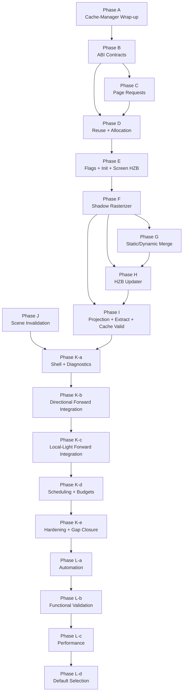

# Virtual Shadow Map - Remaining Implementation Plan

Status: `in_progress`
Audience: engineer implementing and validating the VSM renderer path
Scope: repository-backed plan for the remaining work between the current VSM
runtime and the full architecture in
`design/VirtualShadowMapArchitecture.md`

Review basis on `2026-03-30`:

- this plan was reconciled against the code currently present under
  `src/Oxygen/Renderer`, `src/Oxygen/Graphics/Direct3D12/Shaders/Renderer/Vsm`,
  and the active test targets declared in
  `src/Oxygen/Renderer/Test/CMakeLists.txt`
- stale references to non-existent VSM sub-plans were removed from this
  document
- history-heavy notes were collapsed into concise implementation and evidence
  summaries; git history remains the detailed change log
- this review did not rerun builds or tests; `completed` status below relies on
  code present in the repository plus previously recorded validation already
  captured in this plan and the test surface

Cross-references:

- `design/VirtualShadowMapArchitecture.md` - authoritative architecture spec
- `src/Oxygen/Renderer/VirtualShadowMaps/README.md` - runtime notes and
  troubleshooting

Implementation execution rules

- Architecture is binding. No phase may deviate from
  `VirtualShadowMapArchitecture.md` without explicit user approval recorded
  first.
- When a bug is found in an active slice, fix it inside the approved design if
  at all possible. Do not default to rollback or legacy fallback.
- No shortcuts, no parallel legacy path, and no hacks that satisfy a test while
  violating the architecture.
- Checklist state is mandatory process state:
  - `[ ]` means incomplete
  - `[x]` means implemented and supported by explicit validation evidence
- If build or test execution is not rerun in a later review, phase status must
  remain grounded in the last explicit evidence recorded here.

CPU-GPU ABI guidelines

- keep rich CPU cache and orchestration state in CPU-only structs and classes
- expose page tables and flags as packed scalar GPU buffers
- use dedicated shader payload structs for projection data
- only share a struct across CPU and GPU when it is already a small ABI-stable
  POD record

---

## 1. Current State

### Implemented runtime surface

| Slice | Architecture Ref | Status | Key Files |
| ----- | ---------------- | ------ | --------- |
| Physical page pool manager | §3.1 | `complete` | `VsmPhysicalPagePoolManager.h/.cpp`, `VsmPhysicalPagePoolTypes.h/.cpp`, `VsmPhysicalPageAddressing.h/.cpp`, `VsmPhysicalPoolCompatibility.h/.cpp` |
| Virtual address space | §3.2 | `complete` | `VsmVirtualAddressSpace.h/.cpp`, `VsmVirtualAddressSpaceTypes.h/.cpp`, `VsmVirtualClipmapHelpers.h/.cpp`, `VsmVirtualRemapBuilder.h/.cpp` |
| Cache manager | §3.3 | `complete` | `VsmCacheManager.h/.cpp`, `VsmCacheManagerTypes.h/.cpp`, `VsmCacheManagerSeam.h` |
| Page allocation planner | §3.4 | `complete` | `VsmPageAllocationPlanner.h/.cpp`, `VsmPageAllocationSnapshotHelpers.h` |
| Shader ABI contracts | §4.1-§4.5 | `complete` | `VsmShaderTypes.h`, `Shaders/Renderer/Vsm/Vsm*.hlsli` |
| Scene invalidation slice | §7, §14.2 | `complete` | `VsmSceneInvalidationCollector.h/.cpp`, `VsmSceneInvalidationCoordinator.h/.cpp`, `VsmInvalidationPass.h/.cpp` |
| Renderer-owned VSM shell | §14.1 | `in_progress` | `VsmShadowRenderer.h/.cpp`, `ForwardPipeline.cpp`, `ShadowManager.cpp`, `Renderer.cpp` |
| Directional forward-lighting hookup | §13, §14.1 | `in_progress` | `ShadowHelpers.hlsli`, `ForwardDirectLighting.hlsli`, `VsmFrameBindings.h/.hlsli` |
| Local-light forward-lighting hookup | §13, §14.1 | `not_started` | no renderer-forward consumption yet |

### Implemented validation surface

- Dedicated stage executables exist for Stages 1-11:
  - `Oxygen.Renderer.VsmBeginFrame.Tests`
  - `Oxygen.Renderer.VsmVirtualAddressSpace.Tests`
  - `Oxygen.Renderer.VsmRemap.Tests`
  - `Oxygen.Renderer.VsmProjectionRecords.Tests`
  - `Oxygen.Renderer.VsmPageRequests.Tests`
  - `Oxygen.Renderer.VsmPageReuse.Tests`
  - `Oxygen.Renderer.VsmAvailablePages.Tests`
  - `Oxygen.Renderer.VsmPageMappings.Tests`
  - `Oxygen.Renderer.VsmHierarchicalFlags.Tests`
  - `Oxygen.Renderer.VsmMappedMips.Tests`
  - `Oxygen.Renderer.VsmPageInitialization.Tests`
- Dedicated later-stage executables also exist:
  - `Oxygen.Renderer.VsmShadowRasterization.Tests`
  - `Oxygen.Renderer.VsmStaticDynamicMerge.Tests`
  - `Oxygen.Renderer.VsmShadowHzb.Tests`
  - `Oxygen.Renderer.VsmShadowProjection.Tests`
  - `Oxygen.Renderer.VsmFrameExtraction.Tests`
  - `Oxygen.Renderer.VsmCacheValidity.Tests`
- Integration coverage exists in:
  - `Oxygen.Renderer.VirtualShadowGpuLifecycle.Tests`
  - `Oxygen.Renderer.VirtualShadowSceneObserver.Tests`
  - `Oxygen.Renderer.ShadowManagerPolicy.Tests`

### Open architecture discrepancies that still need explicit remediation

- The live renderer path still has a known directional Stage 5 -> Stage 15
  correctness gap. The strongest current bridge regression remains
  `VsmShadowRendererBridgeGpuTest.ExecutePreparedViewShellMatchesAnalyticFloorShadowClassificationForTwoBoxes`.
- The VSM forward path currently supports only the primary directional
  candidate; additional directional candidates remain unpublished for VSM
  shading.
- The normal forward shader does not yet consume local-light VSM output.
- Distant-local-light refresh budgeting and point-light per-face scheduling from
  architecture §9.2-§9.3 are not implemented in the live renderer path.
- The `detail_geometry` page-flag bit exists in the shader contract, but there
  is still no real-input producer in Oxygen that drives that bit from live
  renderer data.
- Transmission sampling for translucent receivers from architecture §13.3 does
  not yet have an owning renderer phase.

---

## 2. Remaining Work - Summary

| Phase | Status | Exit Gap |
| ----- | ------ | -------- |
| A | `complete` | historical cache-manager wrap-up already landed |
| B | `complete` | ABI contracts exist and dedicated parity coverage exists |
| C | `complete` | Stage 5 request generation exists and dedicated coverage exists |
| D | `complete` | Stages 6-8 page management exists and dedicated coverage exists |
| E | `complete` | Stages 9-11 and screen HZB exist and dedicated coverage exists |
| F | `in_progress` | Stage 12 exists, but the live renderer artifact has not yet been ruled out at the Stage 12 boundary |
| G | `complete` | Stage 13 exists and dedicated coverage exists |
| H | `complete` | Stage 14 exists and dedicated coverage exists |
| I | `complete` | Stage 15 plus extraction and cache-valid continuity coverage exist |
| J | `complete` | scene-observer -> cache-manager -> GPU invalidation slice exists |
| K-a | `in_progress` | live shell exists, but late-frame RenderDoc replay is still unstable (`DXGI_ERROR_DEVICE_HUNG`), so the Stage 15 diagnostic is not yet manually signed off |
| K-b | `in_progress` | directional VSM forward path exists in code, but end-to-end manual validation and full directional support are still incomplete |
| K-c | `not_started` | no local-light forward consumption yet |
| K-d | `not_started` | no distant-light refresh budget or point-light face scheduling yet |
| K-e | `not_started` | renderer hardening and architecture gap closure still outstanding |
| L-a | `not_started` | no repeatable automation harness yet |
| L-b | `not_started` | no scene matrix or screenshot-validation flow yet |
| L-c | `not_started` | no measured performance baseline yet |
| L-d | `not_started` | no shipping defaults chosen from measured evidence yet |

---

## 3. Phase Details

### Phase A - Cache-Manager Plan Completion

**Architecture ref:** wrap-up of the already-landed cache-manager/allocation
foundation

**Status:** `complete`

Checklist:

- [x] Verify the existing VSM foundation tests pass
- [x] Review strategic diagnostics in cache manager and planner
- [x] Document troubleshooting guidance in `src/Oxygen/Renderer/VirtualShadowMaps/README.md`
- [x] Fold the cache-manager/allocation completion state into the active VSM plan

Implementation summary:

- The CPU-side cache manager, planner, pool compatibility logic, and retained
  extraction path are all present in `src/Oxygen/Renderer/VirtualShadowMaps`.

Evidence summary:

- CPU foundation tests exist in `Oxygen.Renderer.VirtualShadows.Tests` and the
  dedicated Stage 1-4 executables.
- This review confirmed the implementation files and test targets still exist,
  but did not rerun them.

---

### Phase B - VSM HLSL Common Types and Page-Table Structures

**Architecture ref:** §4.1-§4.5

**Status:** `complete`

Checklist:

- [x] Create `VsmCommon.hlsli`
- [x] Create `VsmPageTable.hlsli`
- [x] Create `VsmPhysicalPageMeta.hlsli`
- [x] Create `VsmPageFlags.hlsli`
- [x] Verify CPU <-> GPU struct layout parity
- [x] Create `VsmProjectionData.hlsli`
- [x] Define the CPU <-> GPU projection-data contract for current-frame and
  previous-frame use

Implementation summary:

- Shared VSM ABI files exist under
  `src/Oxygen/Graphics/Direct3D12/Shaders/Renderer/Vsm`.
- CPU contract types exist in
  `src/Oxygen/Renderer/VirtualShadowMaps/VsmShaderTypes.h`.

Evidence summary:

- Dedicated parity coverage exists in `VsmShaderTypes_test.cpp`.
- Runtime shaders are wired through
  `src/Oxygen/Graphics/Direct3D12/Shaders/EngineShaderCatalog.h`.

---

### Phase C - Page Request Generator Pass

**Architecture ref:** §3.5, Stage 5

**Status:** `complete`

Checklist:

- [x] Create `VsmPageRequestGeneratorPass`
- [x] Implement `VsmPageRequestGenerator.hlsl`
- [x] Bind depth, projection data, and virtual layout inputs
- [x] Bind one request-flag buffer entry per virtual page-table slot
- [x] Integrate clustered light-grid pruning when available
- [x] Add request-generation coverage for known screen configurations

Implementation summary:

- Runtime pass exists in
  `src/Oxygen/Renderer/Passes/Vsm/VsmPageRequestGeneratorPass.h/.cpp`.
- Shader exists in
  `src/Oxygen/Graphics/Direct3D12/Shaders/Renderer/Vsm/VsmPageRequestGenerator.hlsl`.
- CPU-side request math exists in
  `src/Oxygen/Renderer/VirtualShadowMaps/VsmPageRequestGeneration.h/.cpp`.

Evidence summary:

- Dedicated Stage 5 coverage exists in `Oxygen.Renderer.VsmPageRequests.Tests`.
- Supporting policy coverage exists in `Oxygen.Renderer.VsmBasic.Tests`.

---

### Phase D - Physical Page Reuse and Allocation GPU Passes

**Architecture ref:** §5, Stages 6-8

**Status:** `complete`

Checklist:

- [x] Upload `VsmPageAllocationPlan` decisions into GPU-visible buffers
- [x] Implement `VsmPageReuse.hlsl` for Stage 6
- [x] Implement `VsmPackAvailablePages.hlsl` for Stage 7
- [x] Implement `VsmAllocateNewPages.hlsl` for Stage 8
- [x] Create `VsmPageManagementPass`
- [x] Add GPU readback coverage for page-table state after each stage

Implementation summary:

- Runtime orchestrator exists in
  `src/Oxygen/Renderer/Passes/Vsm/VsmPageManagementPass.h/.cpp`.
- Stage shaders exist in the VSM shader directory.

Evidence summary:

- Dedicated Stage 6-8 coverage exists in:
  - `Oxygen.Renderer.VsmPageReuse.Tests`
  - `Oxygen.Renderer.VsmAvailablePages.Tests`
  - `Oxygen.Renderer.VsmPageMappings.Tests`

---

### Phase E - Page Flag Propagation, Initialization, and Screen-Space HZB

**Architecture ref:** §3.7, §3.10, Stages 9-11

**Status:** `complete`

Checklist:

- [x] Implement `VsmGenerateHierarchicalFlags.hlsl`
- [x] Implement `VsmPropagateMappedMips.hlsl`
- [x] Implement `VsmPageInitializationPass` using explicit clear and copy
  commands against the physical pool
- [x] Create `VsmPageFlagPropagationPass` and `VsmPageInitializationPass`
- [x] Create `ScreenHzbBuildPass` and dispatch it from `ForwardPipeline`
  immediately after `DepthPrePass`
- [x] Add correctness coverage for hierarchical flags, mapped-mip propagation,
  selective initialization, and screen-space HZB

Implementation summary:

- Runtime passes exist in:
  - `src/Oxygen/Renderer/Passes/Vsm/VsmPageFlagPropagationPass.h/.cpp`
  - `src/Oxygen/Renderer/Passes/Vsm/VsmPageInitializationPass.h/.cpp`
  - `src/Oxygen/Renderer/Passes/ScreenHzbBuildPass.h/.cpp`
- The page-initialization phase is command-driven; there is no standalone
  `VsmPageInitialization.hlsl`.

Evidence summary:

- Dedicated Stage 9-11 coverage exists in:
  - `Oxygen.Renderer.VsmHierarchicalFlags.Tests`
  - `Oxygen.Renderer.VsmMappedMips.Tests`
  - `Oxygen.Renderer.VsmPageInitialization.Tests`
- Screen HZB coverage exists in `Oxygen.Renderer.ScreenHzb.Tests`.

Review note:

- The real-input producer for the `detail_geometry` flag is still missing. That
  is tracked later as a remaining architecture discrepancy and does not reopen
  this already-landed Stage 9-11 slice by itself.

---

### Phase F - Shadow Rasterizer Pass

**Architecture ref:** §3.6, §12, Stage 12

**Status:** `in_progress`

Checklist:

- [x] Create `VsmShadowRasterizerPass` on top of the shared depth-only raster
  path
- [x] Route shadow views from `VsmProjectionData`
- [x] Implement `VsmInstanceCulling.hlsl`
- [x] Reuse the shared depth-only raster path for shadow depth output
- [x] Publish rendered-page dirty results and fold them into physical metadata
- [x] Track primitive reveals for forced re-render
- [x] Support static-slice recache rendering into slice 1
- [x] Record static primitive-to-page feedback for later invalidation
- [x] Bind the physical shadow texture array at the correct page coordinates
- [ ] Add a stage-fed live-scene regression that proves the full static-recache
  producer chain at the Stage 12 boundary itself, not only through downstream
  Stage 13/15 behavior
- [ ] Keep Phase F open until the known live directional Stage 5 -> 15 artifact
  is ruled out at the Stage 12 boundary

Implementation summary:

- Runtime pass exists in
  `src/Oxygen/Renderer/Passes/Vsm/VsmShadowRasterizerPass.h/.cpp`.
- Supporting Stage 12 job and routing code exists in:
  - `src/Oxygen/Renderer/VirtualShadowMaps/VsmShadowRasterJobs.h/.cpp`
  - `src/Oxygen/Renderer/VirtualShadowMaps/VsmProjectionRouting.h/.cpp`
  - `src/Oxygen/Graphics/Direct3D12/Shaders/Renderer/Vsm/VsmInstanceCulling.hlsl`
  - `src/Oxygen/Graphics/Direct3D12/Shaders/Renderer/Vsm/VsmPublishRasterResults.hlsl`

Evidence summary:

- Dedicated Stage 12 coverage exists in
  `Oxygen.Renderer.VsmShadowRasterization.Tests`.
- Bridge coverage exists in `Oxygen.Renderer.VirtualShadowGpuLifecycle.Tests`.

Blocking note:

- The renderer-owned live shell still has a known directional correctness issue,
  so Phase F cannot be closed even though the core Stage 12 pass is implemented.

---

### Phase G - Static/Dynamic Merge Pass

**Architecture ref:** §3.8, §10, Stage 13

**Status:** `complete`

Checklist:

- [x] Create `VsmStaticDynamicMergePass`
- [x] Implement `VsmStaticDynamicMerge.hlsl`
- [x] Keep static recache separate from the fixed `slice1 -> slice0` merge
- [x] Support optional disable when static caching is off
- [x] Add coverage for merge direction and dirty-page selection

Implementation summary:

- Runtime pass exists in
  `src/Oxygen/Renderer/Passes/Vsm/VsmStaticDynamicMergePass.h/.cpp`.
- The merge keeps the shadow pool depth-backed and uses a transient float
  scratch atlas rather than turning the shadow atlas into a UAV resource.

Evidence summary:

- Dedicated Stage 13 coverage exists in
  `Oxygen.Renderer.VsmStaticDynamicMerge.Tests`.

---

### Phase H - HZB Updater Pass

**Architecture ref:** §3.7, §11, Stage 14

**Status:** `complete`

Checklist:

- [x] Create `VsmHzbUpdaterPass`
- [x] Implement `VsmHzbBuild.hlsl`
- [x] Rebuild only touched pages
- [x] Publish previous-frame HZB availability for next-frame culling
- [x] Add HZB correctness coverage after shadow rasterization

Implementation summary:

- Runtime pass exists in
  `src/Oxygen/Renderer/Passes/Vsm/VsmHzbUpdaterPass.h/.cpp`.
- Cache-manager continuity publication for HZB availability is present.

Evidence summary:

- Dedicated Stage 14 coverage exists in `Oxygen.Renderer.VsmShadowHzb.Tests`.

---

### Phase I - Projection and Composite Pass

**Architecture ref:** §3.9, §13, Stages 15-17

**Status:** `complete`

Checklist:

- [x] Publish current-frame projection records through the cache manager
- [x] Create `VsmProjectionPass`
- [x] Implement `VsmDirectionalProjection.hlsl`
- [x] Implement local-light projection via `VsmLocalLightProjectionPerLight.hlsl`
- [x] Publish a per-view screen-space shadow mask
- [x] Create `VsmShadowHelpers.hlsli`
- [x] Add focused cache-manager, projection, extraction, and cache-validity
  coverage

Implementation summary:

- Runtime pass exists in
  `src/Oxygen/Renderer/Passes/Vsm/VsmProjectionPass.h/.cpp`.
- Stage 15 helper and ABI files exist in:
  - `VsmProjectionTypes.h`
  - `VsmShadowHelpers.hlsli`
  - `VsmDirectionalProjection.hlsl`
  - `VsmLocalLightProjectionPerLight.hlsl`

Evidence summary:

- Dedicated Stage 15-17 coverage exists in:
  - `Oxygen.Renderer.VsmShadowProjection.Tests`
  - `Oxygen.Renderer.VsmFrameExtraction.Tests`
  - `Oxygen.Renderer.VsmCacheValidity.Tests`

Review note:

- This phase only establishes the standalone Stage 15-17 path. Normal
  forward-lighting consumption remains Phase K.

---

### Phase J - Scene Invalidation Integration

**Architecture ref:** §7, §14.2

**Status:** `complete`

Checklist:

- [x] Extend `VsmCacheManager` invalidation state to match the architecture
  contract
- [x] Track rendered primitive history needed to resolve scene mutations back to
  cached entries
- [x] Track recently removed primitives so stale slot reuse cannot corrupt
  invalidation targeting
- [x] Build a prepared invalidation workload from scene changes plus static
  raster feedback
- [x] Create `VsmSceneInvalidationCollector` implementing `ISceneObserver`
- [x] Implement `VsmInvalidation.hlsl`
- [x] Create `VsmInvalidationPass`
- [x] Wire the collector directly to the active `Scene` observer lifecycle
- [x] Feed queued invalidations through cache-manager invalidation workflows
- [x] Consume raster feedback to refine page-level invalidation for static
  geometry
- [x] Add coverage for add, remove, and move invalidation behavior

Implementation summary:

- The complete invalidation slice exists in:
  - `VsmSceneInvalidationCollector.h/.cpp`
  - `VsmSceneInvalidationCoordinator.h/.cpp`
  - `VsmInvalidationPass.h/.cpp`
  - `VsmInvalidation.hlsl`
  - `VsmCacheManager.h/.cpp`

Evidence summary:

- Scene observer coverage exists in
  `Oxygen.Renderer.VirtualShadowSceneObserver.Tests`.
- Cache-manager invalidation coverage exists in
  `Oxygen.Renderer.VirtualShadows.Tests`.
- GPU invalidation coverage exists in
  `Oxygen.Renderer.VirtualShadowGpuLifecycle.Tests`.

Review correction:

- The previous parent checkbox for extending cache-manager invalidation state
  was stale. The implementation is present and the task is now marked complete.

---

### Phase K - VSM Orchestrator and Renderer Integration

**Architecture ref:** §14.1, full Stages 1-17

**Execution rule:** each K subphase needs both automated evidence and a manual
engine checkpoint. No K subphase may be marked complete without both.

#### Phase K-a - VSM Orchestrator Shell and Shadow-Mask Diagnostics

**Status:** `in_progress`

Task checklist:

- [x] `K-a.1` Policy and lifetime plumbing
- [x] `K-a.2` Per-view VSM input capture
- [x] `K-a.3` Real renderer execution seam
- [x] `K-a.4` Stage 5 -> Stage 6 bridge
- [x] `K-a.5` End-to-end C-J shell execution
- [ ] `K-a.6` Stage 15 diagnostic publication and manual validation
- [ ] Stabilize the live engine run enough to complete the manual
  `Virtual Shadow Mask` checkpoint without the current D3D12 device-removal
  failure
- [ ] Produce a replay-safe late-frame RenderDoc capture recipe for the VSM
  shell path; captures that can emit thumbnails but still fail replay with
  `DXGI_ERROR_DEVICE_HUNG` do not satisfy the K-a evidence gate
- [x] Validate the repo-owned RenderScene RenderDoc analysis workflow against a
  replay-safe late-frame capture before using it as K-a baseline evidence
- [ ] Re-enable or replace the disabled analytic bridge GPU gate in
  `VsmShadowRendererBridge_test.cpp`; the current source compiles out
  `ExecutePreparedViewShellMatchesAnalyticFloorShadowClassificationForTwoBoxes`
  under `#if 0`, so that named exit criterion is not presently runnable
- [ ] Keep the phase open until
  `VsmShadowRendererBridgeGpuTest.ExecutePreparedViewShellMatchesAnalyticFloorShadowClassificationForTwoBoxes`
  is green and the manual diagnostic is rerun

Implementation summary:

- The live VSM shell exists in
  `src/Oxygen/Renderer/VirtualShadowMaps/VsmShadowRenderer.h/.cpp`.
- `ForwardPipeline.cpp` executes the VSM shell after screen HZB and light
  culling.
- `Renderer.cpp` publishes per-view VSM bindings, including the Stage 15 mask
  slots.
- The debug path for `Virtual Shadow Mask` is present through
  `ShaderDebugMode::kVirtualShadowMask` and the forward debug shader.

Evidence summary:

- Bridge and lifecycle coverage exists in
  `Oxygen.Renderer.VirtualShadowGpuLifecycle.Tests`.
- Directional policy routing coverage exists in
  `Oxygen.Renderer.ShadowManagerPolicy.Tests`.
- Repo-owned RenderDoc UI analysis now exists in:
  - `Examples/RenderScene/AnalyzeRenderDocCapture.py`
  - `Examples/RenderScene/AnalyzeRenderDocPassFocus.py`
  - `Examples/RenderScene/AnalyzeRenderDocEventFocus.py`
  - `Examples/RenderScene/AnalyzeRenderDocStage15Masks.py`
- The replay-safe capture
  `out/build-ninja/analysis/k_a_baseline/k_a_vsm_40frames_frame10.rdc`
  was validated with that workflow on `2026-03-30`, producing:
  - `k_a_vsm_40frames_frame10_analysis_report.txt`
  - `k_a_vsm_40frames_frame10_pass_focus_report.txt`
  - `k_a_vsm_40frames_frame10_event_focus_report.txt`
  - `k_a_vsm_40frames_frame10_stage15_masks_report.txt`

Blocking note:

- Manual K-a sign-off remains invalid because earlier manual acceptance was
  later contradicted by live renderer evidence.
- The current late-frame CLI capture attempt is not valid K-a evidence:
  `script_capture_late_frame15.rdc` can emit a thumbnail, but replay/open on
  the same machine can fail with `DXGI_ERROR_DEVICE_HUNG`.
- The replayable RenderScene capture
  `k_a_vsm_40frames_frame10.rdc` now proves the live shell reaches
  `VsmProjectionPass` and publishes both Stage 15 mask textures through the
  repo-owned RenderDoc UI workflow, but it does not remove the manual sign-off
  requirement and it does not make the disabled analytic bridge test passable.

#### Phase K-b - Directional-Light VSM Forward-Lighting Integration

**Status:** `in_progress`

Task checklist:

- [x] Publish a directional-only Stage 15 VSM shadow mask separately from the
  diagnostic screen shadow mask
- [x] Extend the per-view VSM bindings ABI so the forward shader can access
  both masks
- [ ] Publish directional `ShadowInstanceMetadata` with validated
  `implementation_kind = kVirtual` semantics for every directional candidate
  the VSM path intends to support,
- [x] Switch `ShadowManager` view publication to the VSM directional shadow
  product when the VSM policy is selected
- [x] Route forward directional shadow visibility through the VSM directional
  mask for `implementation_kind = kVirtual`, while preserving the conventional
  path for `implementation_kind = kConventional`
- [ ] Keep directional debug modes (`DirectLightingFull`, `DirectLightGates`,
  `DirectBrdfCore`) manually inspectable under both policies
- [x] Add focused automated tests for directional publication and split Stage 15
  output routing
- [ ] Rerun and record manual checkpoints for both `vsm` and `conventional`
  directional policies after the live-shell directional regression is fixed

Implementation summary:

- Directional VSM forward shading is wired through
  `src/Oxygen/Graphics/Direct3D12/Shaders/Renderer/ShadowHelpers.hlsli` and
  `src/Oxygen/Graphics/Direct3D12/Shaders/Forward/ForwardDirectLighting.hlsli`.
- `ShadowManager.cpp` publishes VSM directional metadata on the VSM policy
  path, but today only the primary directional candidate is marked virtual.

Evidence summary:

- Directional policy coverage exists in
  `Oxygen.Renderer.ShadowManagerPolicy.Tests`.
- Projection-output coverage exists in
  `Oxygen.Renderer.VsmShadowProjection.Tests` and
  `Oxygen.Renderer.VirtualShadowGpuLifecycle.Tests`.

Blocking note:

- End-to-end directional closure is still blocked by the live shell Stage 5 ->
  Stage 15 regression and missing manual sign-off.

#### Phase K-c - Local-Light VSM Forward-Lighting Integration

**Status:** `not_started`

Task checklist:

- [ ] Wire local-light projection and composite output from `VsmProjectionPass`
  into the normal forward-lighting path
- [ ] Publish and consume the local-light VSM records needed by the forward
  shader without inventing a second public cache identity model
- [ ] Preserve the non-VSM path for local lights when VSM is not selected
- [ ] Implement transmission sampling for translucent receivers per
  architecture §13.3 without regressing opaque receiver results

Implementation note:

- The standalone Stage 15 local-light path already exists in the projection
  pass. K-c owns the first normal forward-lighting consumption of that data.
- Unless the user directs otherwise, the first shipped local-light forward path
  should continue from the current per-light projection mode; packed mask-bit
  mode remains optional follow-on work, not a prerequisite to start K-c.

#### Phase K-d - Point-Light Scheduling and Distant-Light Refresh Budgeting

**Status:** `not_started`

Task checklist:

- [ ] Implement distant-local-light refresh budgeting and scheduling per
  architecture §9.2, including the cached-skip path for lights not selected
  this frame
- [ ] Implement point-light per-face update scheduling
- [ ] Implement point-light projection upload flow without introducing a second
  public cache identity model
- [ ] Keep renderer and orchestrator naming aligned with the final scheduling,
  refresh, and projection semantics

#### Phase K-e - VSM Policy Hardening and Full Renderer Stabilization

**Status:** `not_started`

Task checklist:

- [ ] Finalize config-driven conventional <-> VSM selection behavior for the
  supported light classes
- [ ] Verify conventional shadows still work when VSM is disabled
- [ ] Harden coroutine sequencing, extraction, and per-view state transitions
  for the full integrated path
- [ ] Close any remaining renderer-owned integration gaps needed for Phase L
- [ ] Add a real-input producer for the `detail_geometry` page-flag bit, or
  explicitly ratify removing that flag from the architecture and shader
  contract before Phase L starts

Implementation note:

- The `detail_geometry` bit is currently present in the shader ABI and test
  surface but not in live renderer production data. That mismatch must be
  resolved explicitly before Phase L treats the implementation as architecture
  complete.

---

### Phase L-a - Validation Automation and Workflow Foundation

**Architecture ref:** all sections

**Status:** `not_started`

Checklist:

- [ ] Extend the `RenderScene` example and/or a companion automation harness so
  a scripted run can:
  - mount or select a cooked scene deterministically
  - apply a named validation profile before load and capture
  - position the test camera and drive deterministic playback
  - warm up, capture, and shut down without interactive input
  - emit captures, metrics, and logs to a predictable output folder
- [ ] Add automation helpers for scene orchestration, screenshot capture, demo
  control, and run metadata capture
- [ ] Define canonical VSM validation profiles for:
  - conventional baseline
  - default VSM functional validation
  - VSM debug capture
  - VSM stress and performance capture
- [ ] Document the workflow for local and CI-like validation runs

---

### Phase L-b - Functional Validation

**Architecture ref:** all sections

**Status:** `not_started`

Checklist:

- [ ] Define the validation-scene contract for VSM image-based testing
- [ ] Build the functional scene matrix around scenario targets first, then
  bind each target to the best existing or new scene with a large receiver
- [ ] Exclude the current `cubes`, `instancing`, `multi-script`, and
  `proc-cubes` scenes from the primary screenshot set unless they are revised
  to include a large receiver
- [ ] Add purpose-built scenes where the repository lacks the right scenario,
  including:
  - `vsm-point-light-face-courtyard`
  - `vsm-transmission-courtyard`
- [ ] Add visual regression coverage for the selected scene matrix
- [ ] Cover at least:
  - directional clipmap traversal and reuse
  - local-light and point-light face selection
  - static and dynamic invalidation behavior
  - transmission behavior on translucent receivers

---

### Phase L-c - Performance Characterization and Tuning

**Architecture ref:** all sections

**Status:** `not_started`

Checklist:

- [ ] Measure per-stage GPU time with the existing timestamp system across the
  Phase L-b scene matrix
- [ ] Capture utilization and workload metrics per scene and profile
- [ ] Add at least one explicit stress characterization run anchored on
  `physics_domains_vsm_benchmark` and a many-local-light scene if needed
- [ ] Identify hot paths and perform only measurement-backed tuning
- [ ] Record before and after evidence for every tuning change

---

### Phase L-d - Budget Tuning and Default Selection

**Architecture ref:** all sections, especially architecture §9.2

**Status:** `not_started`

Checklist:

- [ ] Select default budgets and settings from validated functional and
  performance evidence, including:
  - physical pool size
  - distant-local-light refresh budget
  - unreferenced-entry retention window
  - HZB rebuild selectivity
  - any validation profiles introduced in Phase L-a
- [ ] Define scene classes and target envelopes for those defaults
- [ ] Verify the selected defaults preserve Phase L-b correctness while meeting
  Phase L-c performance expectations
- [ ] Document rationale, tradeoffs, and fallback profiles

---

## 4. Dependency Graph



Phase J can be implemented and validated independently of the later renderer
integration work, but K-a must wire it into the live shell before the VSM path
can be considered architecture-complete.

---

## 5. Build and Test Commands

All commands assume repository root:
`H:\projects\DroidNet\projects\Oxygen.Engine`

Core build:

```powershell
cmake --build out/build-ninja --config Debug --target oxygen-renderer --parallel 8
```

Representative dedicated VSM stage targets:

```powershell
cmake --build out/build-ninja --config Debug --target `
  Oxygen.Renderer.VsmBeginFrame.Tests `
  Oxygen.Renderer.VsmVirtualAddressSpace.Tests `
  Oxygen.Renderer.VsmRemap.Tests `
  Oxygen.Renderer.VsmProjectionRecords.Tests `
  Oxygen.Renderer.VsmPageRequests.Tests `
  Oxygen.Renderer.VsmPageReuse.Tests `
  Oxygen.Renderer.VsmAvailablePages.Tests `
  Oxygen.Renderer.VsmPageMappings.Tests `
  Oxygen.Renderer.VsmHierarchicalFlags.Tests `
  Oxygen.Renderer.VsmMappedMips.Tests `
  Oxygen.Renderer.VsmPageInitialization.Tests `
  Oxygen.Renderer.VsmShadowRasterization.Tests `
  Oxygen.Renderer.VsmStaticDynamicMerge.Tests `
  Oxygen.Renderer.VsmShadowHzb.Tests `
  Oxygen.Renderer.VsmShadowProjection.Tests `
  Oxygen.Renderer.VsmFrameExtraction.Tests `
  Oxygen.Renderer.VsmCacheValidity.Tests `
  Oxygen.Renderer.VirtualShadowGpuLifecycle.Tests `
  Oxygen.Renderer.VirtualShadowSceneObserver.Tests `
  Oxygen.Renderer.ShadowManagerPolicy.Tests `
  --parallel 8
```

Representative CTest sweep:

```powershell
ctest --test-dir out/build-ninja -C Debug --output-on-failure -R `
  "Oxygen\\.Renderer\\.(Vsm.*|VirtualShadowGpuLifecycle|VirtualShadowSceneObserver|ShadowManagerPolicy)\\.Tests"
```

Review note:

- The commands above reflect the current target surface. They were not rerun as
  part of this documentation review.

---

## 6. File Layout Guidance

### HLSL shaders

```text
src/Oxygen/Graphics/Direct3D12/Shaders/Renderer/Vsm/
├── VsmCommon.hlsli
├── VsmPageTable.hlsli
├── VsmPhysicalPageMeta.hlsli
├── VsmPageFlags.hlsli
├── VsmProjectionData.hlsli
├── VsmPageRequestProjection.hlsli
├── VsmPageRequestFlags.hlsli
├── VsmPageManagementDecisions.hlsli
├── VsmPageHierarchyDispatch.hlsli
├── VsmInvalidationWorkItem.hlsli
├── VsmRasterPageJob.hlsli
├── VsmIndirectDrawCommand.hlsli
├── VsmPageRequestGenerator.hlsl
├── VsmPageReuse.hlsl
├── VsmPackAvailablePages.hlsl
├── VsmAllocateNewPages.hlsl
├── VsmGenerateHierarchicalFlags.hlsl
├── VsmPropagateMappedMips.hlsl
├── VsmInstanceCulling.hlsl
├── VsmPublishRasterResults.hlsl
├── VsmStaticDynamicMerge.hlsl
├── VsmHzbBuild.hlsl
├── VsmDirectionalProjection.hlsl
├── VsmLocalLightProjectionPerLight.hlsl
├── VsmInvalidation.hlsl
└── VsmShadowHelpers.hlsli
```

Notes:

- Page initialization is implemented by explicit clear and copy commands in
  `VsmPageInitializationPass.cpp`; there is no standalone
  `VsmPageInitialization.hlsl`.
- The current local-light projection shader is
  `VsmLocalLightProjectionPerLight.hlsl`; there is no generic
  `VsmLocalLightProjection.hlsl` in the repository today.

### Renderer-owned VSM passes

```text
src/Oxygen/Renderer/Passes/Vsm/
├── VsmPageRequestGeneratorPass.h/.cpp
├── VsmInvalidationPass.h/.cpp
├── VsmPageManagementPass.h/.cpp
├── VsmPageFlagPropagationPass.h/.cpp
├── VsmPageInitializationPass.h/.cpp
├── VsmShadowRasterizerPass.h/.cpp
├── VsmStaticDynamicMergePass.h/.cpp
├── VsmHzbUpdaterPass.h/.cpp
└── VsmProjectionPass.h/.cpp
```

### Screen-space HZB prerequisite

```text
src/Oxygen/Renderer/Passes/ScreenHzbBuildPass.h/.cpp
src/Oxygen/Graphics/Direct3D12/Shaders/Renderer/ScreenHzbBuild.hlsl
```

### Orchestrator and renderer seam

```text
src/Oxygen/Renderer/VirtualShadowMaps/
├── VsmShadowRenderer.h/.cpp
├── VsmSceneInvalidationCollector.h/.cpp
└── VsmSceneInvalidationCoordinator.h/.cpp
```

---

## 7. Risk Notes

1. The live directional renderer path is not yet proven end-to-end. Keep K-a
   and K-b open until the current Stage 5 -> Stage 15 regression is fixed and
   manual checkpoints are rerun.
2. Stage 12 must be validated at its own boundary. Do not let downstream
   projection behavior hide rasterizer defects or static-recache gaps.
3. CPU <-> GPU struct parity remains a hard contract. Any drift here is silent
   corruption, not a normal bug.
4. The architecture is still ahead of the implementation in three places:
   primary-directional-only forward support, missing real-input
   `detail_geometry`, and missing transmission support for translucent
   receivers.
5. Conventional shadow behavior must remain functional throughout K and L.
   VSM work is not allowed to break the conventional path while the integrated
   renderer remains in transition.
