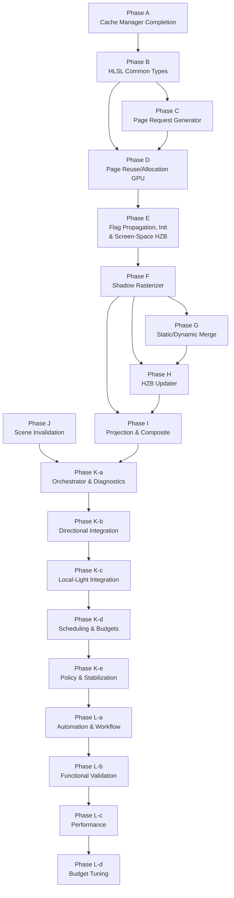

# Virtual Shadow Map — Remaining Implementation Plan

Status: `in_progress`
Audience: engineer implementing VSM rendering pipeline stages
Scope: all work required to bring the VSM system from its current CPU-side cache/allocation engine to a fully functional shadow rendering pipeline

Cross-references:

- `VirtualShadowMapArchitecture.md` — authoritative architecture spec
- `VsmCacheManagerAndPageAllocationImplementationPlan.md` — completed cache-manager/allocation plan (Phases 0–8 done)
- `VsmShadowRasterizerImplementationPlan.md` — active Phase F sub-plan

Implementation execution rules

- Architecture is binding. No phase may deviate from `VirtualShadowMapArchitecture.md` without the user's explicit approval recorded first.
- When a bug is found in an in-progress slice, the response must be professional and architecture-compliant: investigate the bug, identify the failing contract, and fix it within the approved design if at all possible.
- Do not declare that an entire slice must be reverted just because a bug was found. Reversion is a last-resort recovery action, not a default response.
- No turning back to shortcuts, no parallel legacy path, and no hacks to satisfy a test while violating the architecture.
- Every active phase or subphase must have its execution plan written in this document with explicit checklist items.
- Checklist state is mandatory process state: `[ ]` means incomplete, `[x]` means completed, and the checkboxes must be updated immediately as work progresses.
- If context is compacted or a session is interrupted, this document remains the source of truth for the next executable task and its current completion state.
- String conversion and logging conventions are binding:
  - do not invent local `ToString` helpers
  - if a type needs string conversion support, define an ADL-visible free `to_string(...)` with the type
  - when using `LOG_*` / `DLOG_*`, pass the typed value directly and let the logging adapters resolve `to_string`; do not pre-stringify with `nostd::to_string` or `oxygen::to_string`

CPU-GPU ABI Guidelines

- keep rich CPU cache/state in CPU-only structs/classes,
- expose page tables/flags as packed scalar GPU buffers,
- use dedicated shader payload structs for projection data,
- only share a struct across CPU/GPU when it is already a small, ABI-stable POD record

---

## 1. Current State

The following modules are implemented; statuses below reflect their current
validation state:

| Module | Architecture § | Status | Key Files |
| ------ | -------------- | ------ | --------- |
| Physical Page Pool Manager | §3.1 | ✅ Complete | `VsmPhysicalPagePoolManager.h/.cpp`, `VsmPhysicalPagePoolTypes.h/.cpp`, `VsmPhysicalPageAddressing.h/.cpp`, `VsmPhysicalPoolCompatibility.h/.cpp` |
| Virtual Address Space | §3.2 | ✅ Complete | `VsmVirtualAddressSpace.h/.cpp`, `VsmVirtualAddressSpaceTypes.h/.cpp`, `VsmVirtualClipmapHelpers.h/.cpp`, `VsmVirtualRemapBuilder.h/.cpp` |
| Cache Manager | §3.3 | ✅ Complete | `VsmCacheManager.h/.cpp`, `VsmCacheManagerSeam.h`, `VsmCacheManagerTypes.h/.cpp` |
| Page Allocation Planner | §3.4 | ✅ Complete | `VsmPageAllocationPlanner.h/.cpp`, `VsmPageAllocationSnapshotHelpers.h` |
| Shader ABI Contracts | §4.1–§4.5 | ✅ Complete | `VsmShaderTypes.h`, `Shaders/Renderer/Vsm/Vsm*.hlsli` |

Stage-suite refactor status on `2026-03-27`:

- shared harnesses now live in `src/Oxygen/Renderer/Test/VirtualShadow/VirtualShadowStageCpuHarness.h`
  and `src/Oxygen/Renderer/Test/VirtualShadow/VirtualShadowStageGpuHarness.h`
- the shared CPU harness now exposes mixed-frame and directional/local entry-resolution helpers
  through `MakeFrame(...)`, `ResolveLocalEntryIndex(...)`, and
  `ResolveDirectionalEntryIndex(...)` so Stage 2 suites assert published frame contracts from
  real directional/local layout inputs instead of ad hoc setup
- the shared CPU harness now also drives Stage 3 remap construction from real previous/current
  frame snapshots through `MakeFrame(...)`, `MakeLocalFrame(...)`, and `MakeDirectionalFrame(...)`;
  only malformed-input rejection tests mutate those published snapshots after real construction
- the shared live-scene harness now lives in
  `src/Oxygen/Renderer/Test/VirtualShadow/VirtualShadowLiveSceneHarness.h` and drives real
  two-box lighting scenes through the dedicated Stage 1-11 executables
- the shared live-scene harness now rotates test lights from the engine's
  `oxygen::space::move::Forward` basis instead of an ad hoc `-Z` basis, so
  spotlight and directional live-scene targets match engine transform reality
- the shared GPU harness now exposes paged-light request and entry-resolution helpers through
  `MakePageRequests(...)` and `ResolvePageTableEntryIndex(...)` so stage suites do not duplicate
  page-request assembly or hardcode page-table slots
- Stage 2 virtual-address-allocation coverage now lives in the dedicated
  `VsmVirtualAddressSpace` test program; helper/value-only virtual-address-space coverage now lives
  outside the Stage 2 executable
- Stage 3 remap-construction coverage now lives in the dedicated `VsmRemap` test program
- Stage 4 projection-record publication coverage now lives in the dedicated
  `VsmProjectionRecords` test program; shader ABI and cache lifecycle helpers remain outside the
  Stage 4 executable
- Stage 5 page-request generation coverage now lives in the dedicated `VsmPageRequests` test
  program; CPU-side request-routing and request-merging policy coverage now lives in `VsmBasic`
  and does not count as Stage 5 completion evidence
- Stage 6 physical-page reuse coverage now lives in the dedicated `VsmPageReuse` test program
- Stage 7 available-page packing coverage now lives in the dedicated `VsmAvailablePages` test
  program
- Stage 8 new-page-mapping coverage now lives in the dedicated `VsmPageMappings` test program
- Stage 9 hierarchical-flag coverage now lives in the dedicated `VsmHierarchicalFlags` test
  program
- Stage 10 mapped-mip propagation coverage now lives in the dedicated `VsmMappedMips` test
  program
- Stage 11 selective-page-initialization coverage now lives in the dedicated
  `VsmPageInitialization` test program
- the dedicated Stage 1-4 executables now each include live real-scene validation:
  Stage 1 checks frame-start/reset behavior against extracted real-scene history; Stage 2 checks
  multi-page directional clipmap publication from the real scene; Stage 3 checks exact
  previous-driven clipmap remap offsets across a real camera pan; Stage 4 checks scene-derived
  projection-record publication for directional clipmaps and paged local spot lights
- the dedicated Stage 6 executable now includes live real-scene validation for:
  stable directional reuse, directional clipmap pan reuse, moved-caster invalidation seeding,
  and retained unreferenced paged-spotlight continuity using a real depth-derived spotlight
  target and a Stage 5 CPU oracle configured to match the no-light-culling bridge path
- the dedicated Stage 9 executable now includes live real-scene validation for:
  fresh directional clipmap propagation, mixed paged-local-light propagation across two real spot
  lights, and moved-caster directional refresh propagation; those tests compare the Stage 9
  hierarchical bits against a CPU model built from the actual Stage 8 outputs
- Stage 9 review found one upstream non-Stage-9 validation gap: `detail_geometry` still has no
  real-input producer in Oxygen, so the dedicated Stage 9 live-scene suite validates exact
  propagation of the real Stage 8 leaf-state bits currently produced today rather than a dormant
  synthetic-only bit path
- the dedicated Stage 10 executable now includes live real-scene validation for:
  fresh directional clipmap mapped-descendant propagation, mixed paged-local-light mapped-mip
  propagation across two real spot lights, mixed directional-plus-local propagation in the same
  frame, stable reuse-only propagation, and moved-caster directional refresh propagation; those
  tests compare the final `kMappedDescendant` state and preserved Stage 9 bits against a CPU model
  built from the actual Stage 8 page tables and page flags
- dedicated semantic stage suites now exist for begin-frame, virtual-address allocation,
  remap construction, projection-record publication, page-request generation, physical-page reuse,
  available-page packing, new-page mapping, hierarchical page flags, mapped-mip propagation,
  selective page initialization, shadow rasterization, static/dynamic merge, HZB update,
  projection/composite, frame extraction, and cache validity
- renderer test `CMakeLists.txt` now uses logical target names `VsmVirtualAddressSpace`,
  `VsmRemap`, `VsmProjectionRecords`, `VsmPageRequests`, `VsmPageReuse`, `VsmAvailablePages`,
  `VsmPageMappings`, `VsmHierarchicalFlags`, `VsmMappedMips`, `VsmPageInitialization`,
  `VirtualShadows`, and
  `VirtualShadowGpuLifecycle`;
  `m_gtest_program(...)` expands them to
  `Oxygen.Renderer.VsmVirtualAddressSpace.Tests`,
  `Oxygen.Renderer.VsmRemap.Tests`,
  `Oxygen.Renderer.VsmProjectionRecords.Tests`,
  `Oxygen.Renderer.VsmPageRequests.Tests`,
  `Oxygen.Renderer.VsmPageReuse.Tests`,
  `Oxygen.Renderer.VsmAvailablePages.Tests`,
  `Oxygen.Renderer.VsmPageMappings.Tests`,
  `Oxygen.Renderer.VsmHierarchicalFlags.Tests`,
  `Oxygen.Renderer.VsmMappedMips.Tests`,
  `Oxygen.Renderer.VsmPageInitialization.Tests`,
  `Oxygen.Renderer.VirtualShadows.Tests`, and
  `Oxygen.Renderer.VirtualShadowGpuLifecycle.Tests`

Validation evidence on `2026-03-27`:

- built `Oxygen.Renderer.VsmBeginFrame.Tests`, `Oxygen.Renderer.VsmVirtualAddressSpace.Tests`,
  `Oxygen.Renderer.VsmRemap.Tests`, `Oxygen.Renderer.VsmProjectionRecords.Tests`,
  `Oxygen.Renderer.VsmBasic.Tests`, and
  `Oxygen.Renderer.VirtualShadows.Tests` in
  `out/build-ninja` (`Debug`)
- reran the dedicated Stage 1 executable
  `out\\build-ninja\\bin\\Debug\\Oxygen.Renderer.VsmBeginFrame.Tests.exe`
  and `33 tests from 4 test suites` passed
- reran the dedicated Stage 2 executable
  `out\\build-ninja\\bin\\Debug\\Oxygen.Renderer.VsmVirtualAddressSpace.Tests.exe`
  and `8 tests from 4 test suites` passed
- reran the dedicated Stage 3 executable
  `out\\build-ninja\\bin\\Debug\\Oxygen.Renderer.VsmRemap.Tests.exe`
  and `29 tests from 5 test suites` passed
- reran the dedicated Stage 4 executable
  `out\\build-ninja\\bin\\Debug\\Oxygen.Renderer.VsmProjectionRecords.Tests.exe`
  and `2 tests from 1 test suite` passed
- Stage 5 review and boundary rewrite used the UE5 reference-comparison rule through a subagent
  audit before moving Stage 5 ownership into its dedicated executable
- reran the supporting helper coverage moved out of Stage 2 with
  `out\\build-ninja\\bin\\Debug\\Oxygen.Renderer.VsmBasic.Tests.exe --gtest_filter=VsmVirtualAddressSpaceTypesTest.*`
  and `2 tests from 1 test suite` passed
- built `Oxygen.Renderer.VsmPageRequests.Tests`, `Oxygen.Renderer.VsmBasic.Tests`,
  `Oxygen.Renderer.VirtualShadowGpuLifecycle.Tests`, and
  `Oxygen.Renderer.VirtualShadows.Tests` in `out/build-ninja` (`Debug`) after the Stage 5
  executable split
- reran the Stage 5 helper-policy coverage moved out of functional ownership with
  `out\\build-ninja\\bin\\Debug\\Oxygen.Renderer.VsmBasic.Tests.exe --gtest_filter=VsmPageRequestPolicyTest.*`
  and `7 tests from 1 test suite` passed
- reran the dedicated Stage 5 executable
  `out\\build-ninja\\bin\\Debug\\Oxygen.Renderer.VsmPageRequests.Tests.exe`
  and it now reports `3 tests from 1 test suite` passing
- built `Oxygen.Renderer.VsmPageReuse.Tests` in `out/build-ninja` (`Debug`)
- reran the dedicated Stage 6 executable
  `out\\build-ninja\\bin\\Debug\\Oxygen.Renderer.VsmPageReuse.Tests.exe`
  and `4 tests from 1 test suite` passed
- Stage 7 review and boundary rewrite used the UE5 reference-comparison rule through a subagent
  audit before moving Stage 7 ownership into its dedicated executable
- built `Oxygen.Renderer.VsmAvailablePages.Tests` in `out/build-ninja` (`Debug`)
- reran the dedicated Stage 7 executable
  `out\\build-ninja\\bin\\Debug\\Oxygen.Renderer.VsmAvailablePages.Tests.exe`
  and `3 tests from 1 test suite` passed
- Stage 8 review and boundary rewrite used the UE5 reference-comparison rule through a subagent
  audit before moving Stage 8 ownership into its dedicated executable
- built `Oxygen.Renderer.VsmPageMappings.Tests` in `out/build-ninja` (`Debug`)
- reran the dedicated Stage 8 executable
  `out\\build-ninja\\bin\\Debug\\Oxygen.Renderer.VsmPageMappings.Tests.exe`
  and `3 tests from 1 test suite` passed
- Stage 9 review and boundary rewrite used the UE5 reference-comparison rule through a subagent
  audit before moving Stage 9 ownership into its dedicated executable
- built `Oxygen.Renderer.VsmHierarchicalFlags.Tests` in `out/build-ninja` (`Debug`)
- reran the dedicated Stage 9 executable
  `out\\build-ninja\\bin\\Debug\\Oxygen.Renderer.VsmHierarchicalFlags.Tests.exe`
  and `3 tests from 1 test suite` passed
- Stage 10 review and boundary rewrite used the UE5 reference-comparison rule through a subagent
  audit before moving Stage 10 ownership into its dedicated executable
- built `Oxygen.Renderer.VsmMappedMips.Tests` in `out/build-ninja` (`Debug`)
- reran the dedicated Stage 10 executable
  `out\\build-ninja\\bin\\Debug\\Oxygen.Renderer.VsmMappedMips.Tests.exe`
  and `5 tests from 1 test suite` passed
- Stage 11 review and extraction-semantics validation used the UE5 reference-comparison rule
  through a subagent audit before changing runtime extraction or executable ownership
- built `Oxygen.Renderer.VsmPageInitialization.Tests` and
  `Oxygen.Renderer.VirtualShadowGpuLifecycle.Tests` in `out/build-ninja` (`Debug`)
- fixed a real Stage 11 engine bug by switching end-of-frame extraction from stale CPU-only
  snapshot publication to recorder-queued GPU readback finalized at the next `BeginFrame()` so
  stable cached frames preserve the real previous-frame physical-page metadata and do not
  reinitialize pages spuriously
- reran the dedicated Stage 11 executable
  `out\\build-ninja\\bin\\Debug\\Oxygen.Renderer.VsmPageInitialization.Tests.exe`
  and `3 tests from 1 test suite` passed
- reran supporting propagation smoke with
  `out\\build-ninja\\bin\\Debug\\Oxygen.Renderer.VirtualShadowGpuLifecycle.Tests.exe --gtest_filter=VsmPageFlagPropagationGpuTest.*`
  and `1 test from 1 test suite` passed
- reran focused neighboring propagation coverage with
  `out\\build-ninja\\bin\\Debug\\Oxygen.Renderer.VirtualShadowGpuLifecycle.Tests.exe --gtest_filter=VsmPageFlagPropagationGpuTest.*`
  and `1 test from 1 test suite` passed
- reran the shared-harness Stage 4 executable after the light-orientation harness fix:
  `out\\build-ninja\\bin\\Debug\\Oxygen.Renderer.VsmProjectionRecords.Tests.exe`
  and `2 tests from 1 test suite` passed
- fixed a real live-scene infrastructure bug in the Stage 5 harness by restoring the shared
  two-box depth texture back to `Common` after the standalone depth prepass recorder; this removed
  the D3D12 `RESOURCE_BARRIER_BEFORE_AFTER_MISMATCH` error that had been corrupting the Stage 5
  handoff into the live shell
- rewrote the failing Stage 5 live-scene directional oracle to build expected visible samples from
  the actual rasterized depth texture copied into an `R32Float` texture and read back from the
  same frame instead of analytic box/floor raycasts, and reran
  `out\\build-ninja\\bin\\Debug\\Oxygen.Renderer.VsmPageRequests.Tests.exe --gtest_filter=VsmPageRequestLiveSceneTest.DirectionalTwoBoxScenePublishesUploadedProjectionRecordsAndExpectedRequestFlags`
- aligned the Stage 5 live-scene oracle with the exact cached inverse view-projection matrix used
  by the runtime pass constants so the CPU reference no longer recomputes a separate inverse
- after the depth-state fix plus the real-depth oracle rewrite, the dedicated Stage 5 directional
  live-scene regression now passes; the previous extra request at page-table index `54` was caused
  by test-side defects rather than a remaining Stage 5 runtime mismatch
- the dedicated Stage 5 executable now contains:
  - a real two-box directional live-scene regression that takes input through Stages 1-5 and
    asserts uploaded projection records plus decoded request flags from the runtime GPU path
  - a real-depth multi-level local-light request-footprint regression
  - a real-depth directional clip-level request-footprint regression
- built `Oxygen.Renderer.VirtualShadows.Tests` and
  `Oxygen.Renderer.VirtualShadowGpuLifecycle.Tests` in `out/build-ninja` (`Debug`)
- Stage 3 review and rewrite used the UE5 reference-comparison rule through a subagent audit
  before changing executable boundaries or test scenarios
- ran focused GPU stage-suite validation before the Stage 11 executable split with
  `out\\build-ninja\\bin\\Debug\\Oxygen.Renderer.VirtualShadowGpuLifecycle.Tests.exe --gtest_filter=VsmPageRequestGeneratorGpuTest.*:VsmPhysicalPageReuseTest.*:VsmAvailablePagePackingTest.*:VsmNewPageMappingTest.*:VsmHierarchicalPageFlagsTest.*:VsmMappedMipPropagationTest.*:VsmSelectivePageInitializationTest.*:VsmShadowRasterizerPassGpuTest.*:VsmStaticDynamicMergePassGpuTest.*:VsmHzbUpdaterPassGpuTest.*:VsmProjectionPassGpuTest.*`
- reran the full CPU binary `out\\build-ninja\\bin\\Debug\\Oxygen.Renderer.VirtualShadows.Tests.exe`
  with `63 tests from 14 test suites` passing
- reran the refactored bottom-stage GPU suites individually after switching them onto the shared
  harness:
  - `VsmProjectionPassGpuTest.*`
  - `VsmHzbUpdaterPassGpuTest.*`
  - `VsmStaticDynamicMergePassGpuTest.*`
  - `VsmShadowRasterizerPassGpuTest.*`
  - `VsmPageRequestGeneratorGpuTest.*` (historical evidence before the Stage 5 executable split)
- strengthened the Stage 15 dedicated suite so
  `VsmProjectionPassGpuTest.DirectionalProjectionPassCompositesRasterizedMultiPageShadowMaskFromRealGeometry`
  now drives projection from a rasterized two-page directional scene with real geometry through the
  shared GPU harness instead of seeded shadow pages
- strengthened the Stage 14 dedicated suite so
  `VsmHzbUpdaterPassGpuTest.RebuildsDirtyPageMipsFromRasterizedMultiPageDirectionalScene`
  now rebuilds page HZB data from rasterized multi-page directional geometry through the shared GPU
  harness instead of seeded shadow pages alone
- corrective Stage 14 refactor update on `2026-03-28`:
  - the stale synthetic `VsmHzbUpdaterPass_test.cpp` ownership suite was removed
  - Stage 14 now lives in the dedicated executable
    `Oxygen.Renderer.VsmShadowHzb.Tests`
  - real Stage 14 ownership is now in
    `src/Oxygen/Renderer/Test/VirtualShadow/VsmShadowHzb_test.cpp`
  - the dedicated suite validates exact HZB mip-chain reconstruction from real Stage 13
    directional and local-light inputs, plus preserved-HZB continuity on a reused frame
  - UE5 reference comparison and local shader review confirmed that invalidation flags are already
    consumed earlier by raster-result publication; Stage 14 itself clears the remaining
    rebuild-selection state (`dirty` and `view_uncached`) rather than newly clearing invalidation
    bits
  - validation in `out\\build-ninja`:
    - `Oxygen.Renderer.VsmShadowHzb.Tests.exe`: `3 tests from 1 test suite` passed
    - `Oxygen.Renderer.VsmShadowHzb.Tests.exe --gtest_repeat=3`: `9/9` passed
    - `Oxygen.Renderer.VirtualShadowGpuLifecycle.Tests.exe --gtest_filter=VsmProjectionPassGpuTest.DirectionalProjectionPassCompositesRasterizedMultiPageShadowMaskFromRealGeometry`:
      `1/1` passed
- tightened the Stage 5 dedicated suite so `VsmPageRequestGeneratorPass_test.cpp` now reuses the
  shared GPU harness float-texture upload and mip-readback helpers instead of carrying a private
  texture-upload path for request-generation depth inputs
- reran the dedicated Stage 5 suite with
  `out\\build-ninja\\bin\\Debug\\Oxygen.Renderer.VirtualShadowGpuLifecycle.Tests.exe --gtest_filter=VsmPageRequestGeneratorGpuTest.*`
  and `9 tests from 1 test suite` passed
- tightened the Stage 12 dedicated suite so `VsmShadowRasterizerPass_test.cpp` now reuses the
  shared GPU harness buffer, texture, mip-readback, and raw-buffer readback helpers instead of
  carrying a private duplicate mini-fixture
- reran the dedicated Stage 12 suite with
  `out\\build-ninja\\bin\\Debug\\Oxygen.Renderer.VirtualShadowGpuLifecycle.Tests.exe --gtest_filter=VsmShadowRasterizerPassGpuTest.*`
  and `7 tests from 1 test suite` passed
- superseded historical Stage 11 lifecycle coverage has been replaced by the dedicated
  `Oxygen.Renderer.VsmPageInitialization.Tests` executable; selective initialization ownership no
  longer lives in `VirtualShadowGpuLifecycle`
- historical evidence before the Stage 10 executable split:
  `VsmMappedMipPropagationTest.MarksMappedDescendantsAcrossRequestedLeafAndParentPages`
  passed in the lifecycle binary and originally proved mapped-descendant propagation across a
  three-level multi-page paged-light scenario with two requested leaf pages and one directly
  requested parent page through the shared GPU harness request/index helpers instead of hardcoded
  page-table slots
- historical evidence before the Stage 9 executable split:
  `VsmHierarchicalPageFlagsTest.BuildsAllocatedAndUncachedFlagsAcrossRequestedLeafAndAncestorPages`
  passed in the lifecycle binary and originally proved hierarchical
  allocated/dynamic-uncached/static-uncached propagation across a three-level paged-light
  scenario through the shared GPU harness request/index helpers instead of hardcoded page-table
  slots
- reran focused bottom-stage GPU validation with
  `out\\build-ninja\\bin\\Debug\\Oxygen.Renderer.VirtualShadowGpuLifecycle.Tests.exe --gtest_filter=VsmProjectionPassGpuTest.*:VsmHzbUpdaterPassGpuTest.*:VsmStaticDynamicMergePassGpuTest.*:VsmShadowRasterizerPassGpuTest.*:VsmPageRequestGeneratorGpuTest.*`
  and `29 tests from 5 test suites` passed
- reran the focused bridge regression
  `out\\build-ninja\\bin\\Debug\\Oxygen.Renderer.VirtualShadowGpuLifecycle.Tests.exe --gtest_filter=VsmShadowRendererBridgeGpuTest.ExecutePreparedViewShellMatchesAnalyticFloorShadowClassificationForTwoBoxes`
  after removing embedded Stage 5 assertions from that test, and the remaining failure is now
  isolated to Stage 15 floor probes that remain lit
- reran the full GPU binary `out\\build-ninja\\bin\\Debug\\Oxygen.Renderer.VirtualShadowGpuLifecycle.Tests.exe`
  and it now reports exactly one failure out of `46 tests from 9 test suites`:
  `VsmShadowRendererBridgeGpuTest.ExecutePreparedViewShellMatchesAnalyticFloorShadowClassificationForTwoBoxes`
- corrective status update on `2026-03-28`:
  - the previous stage-pass claims above were only validated in `out/build-ninja` and were too
    broad
  - the shared local-light Stage 6-10 regressions were then traced to a test-side previous-frame
    seed bug: those suites were extracting the prior frame immediately after
    `RunTwoBoxPageRequestBridge(...)`, before the GPU page-management stages had materialized the
    page table and physical metadata required for reuse
  - the shared live-scene harness now seeds those suites through
    `PrimeTwoBoxExtractedFrame(...)`, which runs a real previous frame through the live shell and
    publishes an extracted cache frame before the Stage 6-10 current frame begins
  - after that correction, a full `out/build-ninja` rerun of all dedicated Stage 1-11 executables
    is green:
    - Stage 1 `Oxygen.Renderer.VsmBeginFrame.Tests.exe`: `33 tests from 4 test suites`
    - Stage 2 `Oxygen.Renderer.VsmVirtualAddressSpace.Tests.exe`: `8 tests from 4 test suites`
    - Stage 3 `Oxygen.Renderer.VsmRemap.Tests.exe`: `29 tests from 5 test suites`
    - Stage 4 `Oxygen.Renderer.VsmProjectionRecords.Tests.exe`: `2 tests from 1 test suite`
    - Stage 5 `Oxygen.Renderer.VsmPageRequests.Tests.exe`: `3 tests from 1 test suite`
    - Stage 6 `Oxygen.Renderer.VsmPageReuse.Tests.exe`: `4 tests from 1 test suite`
    - Stage 7 `Oxygen.Renderer.VsmAvailablePages.Tests.exe`: `3 tests from 1 test suite`
    - Stage 8 `Oxygen.Renderer.VsmPageMappings.Tests.exe`: `3 tests from 1 test suite`
    - Stage 9 `Oxygen.Renderer.VsmHierarchicalFlags.Tests.exe`: `3 tests from 1 test suite`
    - Stage 10 `Oxygen.Renderer.VsmMappedMips.Tests.exe`: `5 tests from 1 test suite`
    - Stage 11 `Oxygen.Renderer.VsmPageInitialization.Tests.exe`: `3 tests from 1 test suite`
  - `out\\build-ninja\\bin\\Debug\\Oxygen.Renderer.VirtualShadowGpuLifecycle.Tests.exe` was also
    rerun after the seed-path fix and still reports exactly one failure out of
    `46 tests from 9 test suites`:
    `VsmShadowRendererBridgeGpuTest.ExecutePreparedViewShellMatchesAnalyticFloorShadowClassificationForTwoBoxes`
  - a later `2026-03-28` live-scene timing fix then changed the shared
    `VirtualShadowLiveSceneHarness` to rotate sequential offscreen frames across a 3-slot ring
    instead of pinning every step to `Slot { 0 }`; that removed the test-side inline-staging
    timing hazard behind the `RingBufferStaging.cpp:294` warnings in the multi-frame Stage 6-11
    suites
  - recorded evidence after the slot-rotation fix in `out/build-ninja`:
    - `out\\build-ninja\\bin\\Debug\\Oxygen.Renderer.VsmPageReuse.Tests.exe`: `4 tests from 1 test suite`
    - `out\\build-ninja\\bin\\Debug\\Oxygen.Renderer.VsmAvailablePages.Tests.exe`: `3 tests from 1 test suite`
    - `out\\build-ninja\\bin\\Debug\\Oxygen.Renderer.VsmPageMappings.Tests.exe`: `3 tests from 1 test suite`
    - `out\\build-ninja\\bin\\Debug\\Oxygen.Renderer.VsmHierarchicalFlags.Tests.exe`: `3 tests from 1 test suite`
    - `out\\build-ninja\\bin\\Debug\\Oxygen.Renderer.VsmMappedMips.Tests.exe`: `5 tests from 1 test suite`
    - `out\\build-ninja\\bin\\Debug\\Oxygen.Renderer.VsmPageInitialization.Tests.exe`: `3 tests from 1 test suite`
    - `out\\build-ninja\\bin\\Debug\\Oxygen.Renderer.VsmAvailablePages.Tests.exe --gtest_filter=VsmAvailablePagePackingLiveSceneTest.StablePagedSpotLightScenePacksOnlyUnusedPagesAfterLocalReuse --gtest_repeat=10`: all `10/10` iterations passed without `-v`
    - `out\\build-ninja\\bin\\Debug\\Oxygen.Renderer.VsmAvailablePages.Tests.exe --gtest_repeat=3`: all `9/9` executions passed as combined-suite runs
    - `out\\build-ninja\\bin\\Debug\\Oxygen.Renderer.VsmHierarchicalFlags.Tests.exe --gtest_filter=VsmHierarchicalPageFlagsLiveSceneTest.AddedSpotLightsMatchCpuHierarchicalPropagationAcrossMixedLocalLayouts --gtest_repeat=10`: all `10/10` iterations passed without `-v`
    - `out\\build-ninja\\bin\\Debug\\Oxygen.Renderer.VsmPageInitialization.Tests.exe --gtest_repeat=3`: all `9/9` executions passed as combined-suite runs
  - `out/build-asan-vs` was not rerun after the seed-path correction and therefore remains
    unvalidated here by owner instruction not to use that build tree
- Stage 5 completion evidence is now satisfied:
  - `out\\build-ninja\\bin\\Debug\\Oxygen.Renderer.VsmPageRequests.Tests.exe` passes with
    `3 tests from 1 test suite`
  - `out\\build-ninja\\bin\\Debug\\Oxygen.Renderer.VsmBasic.Tests.exe --gtest_filter=VsmPageRequestPolicyTest.*`
    passes with `7 tests from 1 test suite`
- full GPU validation is still blocked by the known live-shell failure
  `VsmShadowRendererBridgeGpuTest.ExecutePreparedViewShellMatchesAnalyticFloorShadowClassificationForTwoBoxes`;
  after removing embedded Stage 5 assertions from that bridge test, the remaining failure is Stage
  15 floor probes that remain lit, so the overall test-refactor slice cannot be marked complete yet

The remaining phases below explicitly own the current forward gaps from the
implemented cache/allocation slice:

- dedicated GPU invalidation instead of today's CPU-queued planning-copy bridge
- current and previous-frame projection-data publication/upload
- scene-mutation invalidation workloads
- static-slice recache work, distinct from the fixed `slice1 -> slice0` merge
- distant-local-light refresh budgeting
- point-light per-face update scheduling
- translucent-receiver transmission sampling paths

### What Exists in Renderer Infrastructure (Already Usable)

| Component | Class / File | Relevance |
| --------- | ----------- | --------- |
| Shadow coordination | `ShadowManager` | Currently conventional-only; VSM extends via new policy |
| Pipeline orchestration | `ForwardPipeline`, `RenderingPipeline` | Coroutine-based pass registration |
| Depth input | `DepthPrePass` | Produces screen depth for page request generation and screen-space HZB |
| Screen-space HZB | `ScreenHzbBuildPass` (new) | Renderer-level min-reduce pyramid over `DepthPrePass` output; consumed by VSM Stage 12 instance culling |
| Compute pass base | `ComputeRenderPass` | Base class for VSM compute passes |
| Graphics pass base | `GraphicsRenderPass` | Base class for VSM raster passes |
| Forward lighting shader | `ForwardDirectLighting.hlsli` | Calls `ComputeShadowVisibility()`; swap point for VSM |
| Scene observer system | `ISceneObserver`, `Scene` | Mutation dispatch for invalidation |
| Render graph factory | `Renderer::RegisterViewRenderGraph()` | Per-view render graph composition |

---

## 2. Remaining Work — Summary

| Status | Phase | Deliverable | Exit Gate |
| ------ | ----- | ----------- | --------- |
| ☑ | A | Cache-manager plan completion (Phase 8) | Completed in `VsmCacheManagerAndPageAllocationImplementationPlan.md` |
| ☑ | B | VSM HLSL common types and page-table structures | ABI types exist, CPU ↔ GPU parity is verified, and runtime VSM shaders compile through the build-time shader bake |
| ☑ | C | Page Request Generator pass | Compute pass produces correct page request flags for test scenes with depth and clustered-light inputs |
| ☑ | D | Physical page reuse and allocation GPU passes | GPU passes implement stages 6–8 (reuse, pack, allocate) |
| ☑ | E | Page flag propagation, initialization, and screen-space HZB passes | Stages 9–11 plus renderer-level `ScreenHzbBuildPass`; hierarchical flags, mapped-mip propagation, selective page init, and screen-space HZB available for Phase F culling |
| ☑ | F | Shadow Rasterizer pass | GPU-driven per-page shadow depth rendering with culling |
| ☑ | G | Static/Dynamic Merge pass | Dirty-page static depth is merged into the lighting-visible dynamic slice through `VsmStaticDynamicMergePass` |
| ☑ | H | HZB Updater pass | Selective per-page hierarchical Z-buffer rebuild and current/previous-frame HZB availability publication for reuse gating |
| ☑ | I | Projection and Composite pass | Standalone screen-space shadow factor generation for directional + local lights |
| ☑ | J | Scene invalidation integration | Scene observer → cache manager invalidation pipeline |
| ☐ | K-a | VSM orchestrator shell and shadow-mask diagnostics | Engine runs the full VSM pass chain and exposes Stage 15 output for manual validation |
| ☐ | K-b | Directional-light VSM forward-lighting integration | Directional/sun shadows render end-to-end through the normal forward path |
| ☐ | K-c | Local-light VSM forward-lighting integration | Local-light VSM shadows render end-to-end through the normal forward path |
| ☐ | K-d | Point-light scheduling and distant-light refresh budgeting | Point-light face updates and distant-light refresh budgets execute correctly in-engine |
| ☐ | K-e | VSM policy hardening and full renderer stabilization | Conventional and VSM policies both work; renderer integration is stable enough for Phase L |
| ☐ | L-a | Validation automation and workflow foundation | Automated RenderScene/demo control, capture, CVar setup, and workflow docs exist for repeatable VSM validation |
| ☐ | L-b | Functional validation | VSM renders correct results across representative existing and purpose-built scenes |
| ☐ | L-c | Performance characterization and tuning | Per-stage timings and utilization baselines are measured; major hot paths are characterized and tuned |
| ☐ | L-d | Budget tuning and default selection | Shipping-oriented VSM budgets/defaults are chosen from validated functional + performance evidence |

---

## 3. Phase Details

### Phase A — Cache-Manager Plan Completion

**Architecture ref:** wrap-up of `VsmCacheManagerAndPageAllocationImplementationPlan.md` Phase 8

**Status:** completed on 2026-03-24 through the dedicated cache-manager/allocation plan.

**Deliverables:**

- [x] Verify all existing VSM tests pass (`Oxygen.Renderer.VirtualShadows.Tests` + `GpuLifecycle.Tests`)
- [x] Review strategic `LOG_F` / `LOG_SCOPE_F` placements in cache manager and planner for production diagnostics
- [x] Document troubleshooting guide in `VirtualShadowMaps/README.md`
- [x] Close Phase 8 in the existing implementation plan

**Exit gate:** All tests green, README updated, Phase 8 marked ☑.

---

### Phase B — VSM HLSL Common Types and Page-Table Structures

**Architecture ref:** §4.1 (Virtual Page Table), §4.2 (Physical Page Metadata), §4.3 (Page Flags)

**Status:** completed on 2026-03-24.

**Deliverables:**

- [x] Create `Shaders/Renderer/Vsm/VsmCommon.hlsli` — shared constants (page size, max mip levels, flag bits)
- [x] Create `Shaders/Renderer/Vsm/VsmPageTable.hlsli` — `PageTableEntry` struct, page-table lookup functions
- [x] Create `Shaders/Renderer/Vsm/VsmPhysicalPageMeta.hlsli` — physical page metadata struct matching CPU layout
- [x] Create `Shaders/Renderer/Vsm/VsmPageFlags.hlsli` — virtual page flag definitions and accessors
- [x] Verify CPU ↔ GPU struct layout parity (same sizes, same field offsets) via static assertions or a validation test
- [x] Create `Shaders/Renderer/Vsm/VsmProjectionData.hlsli` — per-map projection data struct (§4.5)
- [x] Define the CPU ↔ GPU projection-data contract needed for both current-frame projection and retained previous-frame invalidation data

**Exit gate:** Runtime VSM shaders that consume the shared HLSL headers compile through the build-time shader bake; struct sizes match CPU counterparts.

Validation evidence on 2026-03-24:

- added `src/Oxygen/Renderer/VirtualShadowMaps/VsmShaderTypes.h`
- added `src/Oxygen/Graphics/Direct3D12/Shaders/Renderer/Vsm/VsmCommon.hlsli`
- added `src/Oxygen/Graphics/Direct3D12/Shaders/Renderer/Vsm/VsmPageTable.hlsli`
- added `src/Oxygen/Graphics/Direct3D12/Shaders/Renderer/Vsm/VsmPageFlags.hlsli`
- added `src/Oxygen/Graphics/Direct3D12/Shaders/Renderer/Vsm/VsmPhysicalPageMeta.hlsli`
- added `src/Oxygen/Graphics/Direct3D12/Shaders/Renderer/Vsm/VsmProjectionData.hlsli`
- added aggregate contract shader `src/Oxygen/Graphics/Direct3D12/Shaders/Renderer/Vsm/VsmContracts_CS.hlsl`
- kept the contract shader out of the runtime engine shader catalog because it is not a renderer pass and is not part of the Phase B exit gate
- added fixture-based parity coverage in `src/Oxygen/Renderer/Test/VirtualShadow/VsmShaderTypes_test.cpp`
- verified `src/Oxygen/Graphics/Direct3D12/Shaders/CMakeLists.txt` bakes `shaders.bin` as an `ALL` build target and makes `oxygen-graphics-direct3d12` depend on that bake
- verified `src/Oxygen/Graphics/Direct3D12/Tools/ShaderBake/Bake.cpp` compiles the runtime shader catalog declared in `src/Oxygen/Graphics/Direct3D12/Shaders/EngineShaderCatalog.h`
- built `oxygen-renderer`, `Oxygen.Renderer.VirtualShadows.Tests`, and `Oxygen.Renderer.VirtualShadowGpuLifecycle.Tests` in `out/build-ninja` (`Debug`)
- ran `ctest --test-dir out/build-ninja -C Debug --output-on-failure -R "Oxygen\\.Renderer\\.VirtualShadows\\.Tests|Oxygen\\.Renderer\\.VirtualShadows\\.GpuLifecycle\\.Tests"` with `100% tests passed, 0 tests failed out of 2`

---

### Phase C — Page Request Generator Pass

**Architecture ref:** §3.5, stage 5

**Status:** completed on 2026-03-24.

**Deliverables:**

- [x] Create `VsmPageRequestGeneratorPass` inheriting `ComputeRenderPass`
- [x] HLSL compute shader: `Shaders/Renderer/Vsm/VsmPageRequestGenerator.hlsl`
  - Sample depth buffer at each pixel
  - Reconstruct world position
  - For each active VSM (directional clipmap levels + local lights), compute virtual page coordinate
  - Set `kRequired` flag in page request buffer
  - Mark coarse pages for broad coverage
- [x] Input bindings: depth texture, projection data buffer, virtual address space layout
- [x] Output binding: page request flag buffer (one entry per virtual page table slot)
- [x] Light-grid pruning: skip lights not affecting visible pixels (integrate with `LightCullingPass` cluster data)
- [x] Unit test: validate page request output for known screen configurations

**Dependencies:** Phase B (HLSL types)

**Exit gate:** Compute pass produces correct page request flags for a test scene with depth and light data.

Validation evidence on 2026-03-24:

- implemented `src/Oxygen/Renderer/Passes/Vsm/VsmPageRequestGeneratorPass.h/.cpp`
- implemented `src/Oxygen/Graphics/Direct3D12/Shaders/Renderer/Vsm/VsmPageRequestGenerator.hlsl`
- wired the shader through `src/Oxygen/Graphics/Direct3D12/Shaders/EngineShaderCatalog.h`
- added CPU-side request math coverage in `src/Oxygen/Renderer/Test/VirtualShadow/VsmPageRequestGeneration_test.cpp`
- added GPU/live-render-context execution coverage in `src/Oxygen/Renderer/Test/VirtualShadow/VsmPageRequestGeneratorPass_test.cpp`
- the GPU pass tests now execute against a renderer-owned off-screen frame session via `Renderer::BeginOffscreenFrame(...)`, so Phase C no longer relies on friend-based test-only seams
- built `oxygen-renderer`, `Oxygen.Renderer.VirtualShadows.Tests`, and `Oxygen.Renderer.VirtualShadowGpuLifecycle.Tests` in `out/build-ninja` (`Debug`)
- ran `ctest --test-dir out/build-ninja -C Debug --output-on-failure -R "Oxygen\\.Renderer\\.VirtualShadows\\.Tests|Oxygen\\.Renderer\\.VirtualShadows\\.GpuLifecycle\\.Tests"` with `100% tests passed, 0 tests failed out of 2`
- ran focused high-verbosity GPU validation with `out\\build-ninja\\bin\\Debug\\Oxygen.Renderer.VirtualShadowGpuLifecycle.Tests.exe -v 9 --gtest_filter=VsmPageRequestGeneratorGpuTest.*`

---

### Phase D — Physical Page Reuse and Allocation GPU Passes

**Architecture ref:** §5 stages 6–8

**Status:** completed on 2026-03-24.

The cache manager already computes allocation decisions on the CPU. This phase uploads those decisions to the GPU and applies them.

**Deliverables:**

- [x] GPU upload path: upload `VsmPageAllocationPlan` decisions (page table entries, physical page metadata) to GPU buffers
- [x] Compute pass `VsmPageReuse.hlsl` — apply reuse decisions: write page-table entries for reused pages, clear entries for evicted pages (stage 6)
- [x] Compute pass `VsmPackAvailablePages.hlsl` — compact empty-page list into contiguous stack (stage 7)
- [x] Compute pass `VsmAllocateNewPages.hlsl` — assign available physical pages to requested-but-unmapped virtual pages (stage 8)
- [x] Create `VsmPageManagementPass` class orchestrating these three sub-dispatches
- [x] Verify page-table buffer state after each stage via GPU readback test

**Dependencies:** Phase B, Phase C (page requests feed allocation)

**Exit gate:** Given a CPU allocation plan, GPU page-table buffer correctly reflects reuse/evict/allocate decisions.

Validation evidence on 2026-03-24:

- implemented `src/Oxygen/Renderer/Passes/Vsm/VsmPageManagementPass.h/.cpp`
- implemented `src/Oxygen/Graphics/Direct3D12/Shaders/Renderer/Vsm/VsmPageReuse.hlsl`
- implemented `src/Oxygen/Graphics/Direct3D12/Shaders/Renderer/Vsm/VsmPackAvailablePages.hlsl`
- implemented `src/Oxygen/Graphics/Direct3D12/Shaders/Renderer/Vsm/VsmAllocateNewPages.hlsl`
- implemented `src/Oxygen/Graphics/Direct3D12/Shaders/Renderer/Vsm/VsmPageManagementDecisions.hlsli`
- extended `VsmPageAllocationFrame` publication with the shared physical-page metadata buffer so stages 6–8 consume the committed cache-manager products directly
- stage 7 now packs available pages in ascending physical-page order so GPU allocation consumes the same deterministic order chosen by the CPU planner
- added GPU readback coverage in `src/Oxygen/Renderer/Test/VirtualShadow/VsmPageManagementPass_test.cpp`
- tightened GPU publication coverage in `src/Oxygen/Renderer/Test/VirtualShadow/VsmPhysicalPagePoolGpuLifecycle_test.cpp` and `src/Oxygen/Renderer/Test/VirtualShadow/VsmCacheManagerGpuResources_test.cpp`
- built `oxygen-renderer`, `Oxygen.Renderer.VirtualShadows.Tests`, and `Oxygen.Renderer.VirtualShadowGpuLifecycle.Tests` in `out/build-ninja` (`Debug`)
- ran focused high-verbosity validation:
  - `out\\build-ninja\\bin\\Debug\\Oxygen.Renderer.VirtualShadowGpuLifecycle.Tests.exe -v 9 --gtest_filter=VsmPageReuseStageGpuTest.ReuseStagePublishesCurrentFrameMappingForReusablePages`
  - `out\\build-ninja\\bin\\Debug\\Oxygen.Renderer.VirtualShadowGpuLifecycle.Tests.exe -v 9 --gtest_filter=VsmPackAvailablePagesGpuTest.PackStageCompactsUnallocatedPagesIntoAscendingStack`
  - `out\\build-ninja\\bin\\Debug\\Oxygen.Renderer.VirtualShadowGpuLifecycle.Tests.exe -v 9 --gtest_filter=VsmAllocateNewPagesGpuTest.AllocateStagePublishesMixedReuseAndFreshMappings`
- ran `ctest --test-dir out/build-ninja -C Debug --output-on-failure -R "Oxygen\\.Renderer\\.VirtualShadows\\.Tests|Oxygen\\.Renderer\\.VirtualShadows\\.GpuLifecycle\\.Tests"` with `100% tests passed, 0 tests failed out of 2`
- Stage 7 ownership was later moved onto the dedicated
  `Oxygen.Renderer.VsmAvailablePages.Tests` executable with live-scene validation and the old
  synthetic `VsmPackAvailablePagesGpuTest` ownership was removed from
  `VsmPageManagementPass_test.cpp`
- Stage 8 ownership was later moved onto the dedicated
  `Oxygen.Renderer.VsmPageMappings.Tests` executable with live-scene validation and the old
  synthetic `VsmAllocateNewPagesGpuTest` ownership was removed along with
  `VsmPageManagementPass_test.cpp`
- Stage 9 ownership was later moved onto the dedicated
  `Oxygen.Renderer.VsmHierarchicalFlags.Tests` executable with live-scene validation and the old
  lifecycle-binary `VsmHierarchicalPageFlagsTest` ownership was removed; the remaining
  `VsmPageFlagPropagationGpuTest` coverage in `VsmPageLifecyclePasses_test.cpp` now validates
  mapped-descendant propagation only and no longer counts as Stage 9 ownership evidence
- Stage 10 ownership was later moved onto the dedicated
  `Oxygen.Renderer.VsmMappedMips.Tests` executable with live-scene validation and the old
  lifecycle-binary `VsmMappedMipPropagationTest` ownership was removed; the remaining
  `VsmPageFlagPropagationGpuTest` coverage in `VsmPageLifecyclePasses_test.cpp` stays as
  supporting pass-level smoke coverage only and no longer counts as Stage 10 ownership evidence

---

### Phase E — Page Flag Propagation, Initialization, and Screen-Space HZB Passes

**Architecture ref:** §5 stages 9–11; §3.10 (screen-space HZB)

**Status:** completed on 2026-03-25.

**Deliverables:**

- [x] Compute pass `VsmGenerateHierarchicalFlags.hlsl` — build mip-chain page flags from leaf flags (stage 9)
- [x] Compute pass `VsmPropagateMappedMips.hlsl` — propagate mapping info up the mip chain (stage 10)
- [x] `VsmPageInitializationPass` — selective page init (stage 11) using explicit shadow-texture clear/copy commands against the physical pool:
  - For uncached pages with valid static slice: copy static slice → dynamic slice
  - For uncached pages without static slice: clear to max depth
  - Skip already-cached pages
- [x] Create `VsmPageFlagPropagationPass` and `VsmPageInitializationPass` classes
- [x] `ScreenHzbBuildPass` — renderer-level compute pass dispatched by `ForwardPipeline` immediately after `DepthPrePass`, before the VSM orchestrator:
  - Compute shader `ScreenHzbBuild.hlsl`: hierarchical min-reduce over `DepthPrePass` depth buffer
  - Persistent ping-pong HZB pyramid texture (owned by `ForwardPipeline`, not VSM)
  - Previous frame's pyramid retained as a read-only input for the next frame's Phase F instance culling
  - Frame 0: no HZB available (culling falls back to AABB-only)
- [x] Unit tests verifying hierarchical flag correctness and selective initialization behavior
- [x] Unit test verifying screen-space HZB min values are correct for a known depth buffer

**Dependencies:** Phase D (page-table must be finalized before flag propagation)

**Exit gate:** Hierarchical flags correct for multi-level maps; initialization clears/copies only uncached pages; screen-space HZB pyramid is available and readable by Phase F instance culling.

Validation evidence on 2026-03-25:

- implemented `src/Oxygen/Renderer/Passes/Vsm/VsmPageFlagPropagationPass.h/.cpp`
- implemented `src/Oxygen/Renderer/Passes/Vsm/VsmPageInitializationPass.h/.cpp`
- implemented `src/Oxygen/Graphics/Direct3D12/Shaders/Renderer/Vsm/VsmGenerateHierarchicalFlags.hlsl`
- implemented `src/Oxygen/Graphics/Direct3D12/Shaders/Renderer/Vsm/VsmPropagateMappedMips.hlsl`
- implemented `src/Oxygen/Graphics/Direct3D12/Shaders/Renderer/Vsm/VsmPageHierarchyDispatch.hlsli`
- implemented `src/Oxygen/Renderer/Passes/ScreenHzbBuildPass.h/.cpp`
- implemented `src/Oxygen/Graphics/Direct3D12/Shaders/Renderer/ScreenHzbBuild.hlsl`
- registered `ScreenHzbBuildPass` in `src/Oxygen/Renderer/Pipeline/ForwardPipeline.cpp` immediately after `DepthPrePass`
- added GPU coverage in `src/Oxygen/Renderer/Test/VirtualShadow/VsmPageLifecyclePasses_test.cpp`
- added GPU coverage in `src/Oxygen/Renderer/Test/VirtualShadow/ScreenHzbBuildPass_test.cpp`
- built `oxygen-renderer`, `Oxygen.Renderer.VirtualShadows.Tests`, and `Oxygen.Renderer.VirtualShadowGpuLifecycle.Tests` in `out/build-ninja` (`Debug`)
- ran focused high-verbosity HZB validation with `out\\build-ninja\\bin\\Debug\\Oxygen.Renderer.VirtualShadowGpuLifecycle.Tests.exe -v 9 --gtest_filter=ScreenHzbBuildGpuTest.*`
- ran `ctest --test-dir out/build-ninja -C Debug --output-on-failure -R "Oxygen\\.Renderer\\.VirtualShadows\\.Tests|Oxygen\\.Renderer\\.VirtualShadows\\.GpuLifecycle\\.Tests"` with `100% tests passed, 0 tests failed out of 2`

---

### Phase F — Shadow Rasterizer Pass

**Architecture ref:** §3.6, §12, stage 12

**Status:** in_progress on `2026-03-28`.

**Execution note:** this phase is now decomposed in
`VsmShadowRasterizerImplementationPlan.md`. The dedicated Stage 12 executable
and the `F0` through `F4` slices have focused validation evidence, but parent
Phase F is not closed yet: a live renderer capture still shows semantically
wrong page-aligned floor shadow artifacts in the downstream Stage 12→15 path,
and the fully stage-fed live static-recache producer chain is still only
partially proven at the Stage 12 boundary. Full renderer-wide VSM
orchestration remains parent Phase `K`.

**Deliverables:**

- [x] Create `VsmShadowRasterizerPass` on top of the shared depth-only raster
  path (`DepthPrePass`)
- [x] Shadow view routing: consume per-map shadow projection data from `VsmProjectionData`
  - Directional clipmaps use per-level views
  - Point-light per-face projections route into shared local-light map regions without widening the public remap-key API
- [x] Instance culling compute shader `VsmInstanceCulling.hlsl`:
  - Test mesh instance bounds against each allocated page's virtual extent
  - Screen-space HZB occlusion culling using previous-frame camera depth pyramid (see architecture §3.10); absent on frame 0, available from frame 1 onward
  - Output: compact per-page draw command lists
- [x] Shadow depth rasterization path:
  - Reuse the shared depth-only raster shaders through `DepthPrePass`
  - Write depth into the physical shadow texture array with per-page DSV,
    viewport/scissor, and counted indirect replay
- [x] Dirty flag update: publish rendered-page dirty results needed by later merge/HZB selection and fold them into physical page metadata at the downstream stage boundary
- [x] Primitive reveal tracking: flag newly visible primitives for forced re-render
- [x] Static-slice recache path: render static-only content into slice 1 for pages selected by static invalidation without reversing the merge contract
- [x] Static invalidation feedback: record primitive-to-page overlap information needed to refine later scene invalidation
- [x] Render target setup: bind shadow depth texture array at correct physical page coordinates

**Dependencies:** Phase E (pages must be initialized before rasterization; screen-space HZB produced in Phase E must be available for instance culling)

**Exit gate:** Shadow depth is correctly rasterized into physical pages for a test scene with known geometry, including point-light face selection and static-recache routing when enabled.

Validation evidence through `F4` on `2026-03-26`:

- `VsmShadowRasterizerPass` now submits baseline depth draws into the physical
  VSM dynamic slice for prepared page jobs, with page-local viewport/scissor
  and view constants
- `VsmShadowRasterizerPass` now dispatches GPU instance culling over active
  shadow-caster partitions, compacts per-page indirect draw commands, and
  consumes previous-frame screen HZB when available
- `VsmShadowRasterizerPass` now routes static-only page jobs into the static
  slice, publishes rendered-page dirty flags plus physical-page metadata
  updates, forces rerender for newly visible primitives, and records
  static primitive/page feedback for later invalidation refinement
- `VsmPageRequestProjection` plus the new `VsmProjectionRouting` helpers now
  support routed subregions inside one owning virtual map, allowing point-light
  cube faces to share one local-light cache identity while retaining distinct
  page-request and raster routes
- `BuildShadowRasterPageJobs` now resolves the matching point-light face route
  per prepared page, rejects overlapping routes deterministically, and preserves
  the selected face-local page for raster crop math
- `VsmCacheManager` now publishes and extracts visible shadow primitives plus
  static primitive/page feedback into the retained frame snapshot
- `VsmPhysicalPagePoolManager` now registers VSM pool resources on creation and
  unregisters them on recreate/reset/destruction so per-page DSV creation obeys
  the renderer resource-registry contract
- built `Oxygen.Renderer.VirtualShadowGpuLifecycle.Tests` and
  `Oxygen.Renderer.VirtualShadows.Tests` in
  `out/build-ninja` (`Debug`)
- ran `ctest --test-dir out/build-ninja -C Debug --output-on-failure -R "Oxygen\\.Renderer\\.VirtualShadowGpuLifecycle\\.Tests|Oxygen\\.Renderer\\.Oxygen\\.Renderer\\.VirtualShadows\\.Tests\\.Tests"` with `100% tests passed, 0 tests failed out of 2`
- ran `out\\build-ninja\\bin\\Debug\\Oxygen.Renderer.VirtualShadowGpuLifecycle.Tests.exe --gtest_filter=VsmShadowRasterizerPassGpuTest.*:VsmPhysicalPagePoolGpuLifecycleTest.* -v 1`
- ran `out\\build-ninja\\bin\\Debug\\Oxygen.Renderer.VirtualShadows.Tests.exe --gtest_filter=VsmCacheManagerOrchestrationTest.* -v 1`
- ran `out\\build-ninja\\bin\\Debug\\Oxygen.Renderer.VirtualShadowGpuLifecycle.Tests.exe --gtest_filter=VsmShadowRasterizerPassGpuTest.*:VsmPhysicalPagePoolGpuLifecycleTest.* -v 9`
- ran `out\\build-ninja\\bin\\Debug\\Oxygen.Renderer.VirtualShadows.Tests.exe --gtest_filter=VsmCacheManagerOrchestrationTest.* -v 9`
- ran `out\\build-ninja\\bin\\Debug\\Oxygen.Renderer.VirtualShadows.Tests.exe --gtest_filter=VsmPageRequestGenerationTest.*:VsmShadowRasterJobsTest.* -v 9`
- ran `out\\build-ninja\\bin\\Debug\\Oxygen.Renderer.VirtualShadowGpuLifecycle.Tests.exe --gtest_filter=VsmPageRequestGeneratorGpuTest.*:VsmShadowRasterizerPassGpuTest.* -v 1`
- ran `out\\build-ninja\\bin\\Debug\\Oxygen.Renderer.VirtualShadowGpuLifecycle.Tests.exe --gtest_filter=VsmPageRequestGeneratorGpuTest.*:VsmShadowRasterizerPassGpuTest.* -v 9`
- low-verbosity logs were clean: no warnings, no failures, and no
  `Reusing partition ... without observed retirement` staging warning
- max-verbosity logs were sane for the integrated `F3` slice: the static
  recache test logged `static_pages=1` during prepare and `static_feedback=1`
  during culling/execute, the HZB path logged
  `previous_hzb_available=true`, the reveal path logged
  `reveal_candidates=1`, and the cache-manager path logged visible-primitive
  plus static-feedback publication before extraction
- max-verbosity logs were sane for the new point-face path: the routed test
  logged `prepare map_count=2 prepared_pages=1 ... routed_pages=1 cube_face_pages=1`
  before counted-indirect execution, the routed physical page received depth,
  and the neighboring page stayed at the cleared depth
- max-verbosity CPU routing logs only emitted the expected contract-path
  warnings for intentionally invalid inputs (`missing projection route` and
  `overlapping projection routes`)
- the GPU tests verified indirect count/command buffers, dynamic dirty flag
  publication, physical-page metadata updates, static-only depth writes into
  slice `1`, point-light face routing into a shared local-light map, and
  reveal-forced rerender behavior
- extra probe note: standalone
  `ScreenHzbBuildGpuTest.PreviousFrameOutputTracksPriorPyramidAcrossFrames`
  still throws an SEH access violation during its own seed-depth setup when run
  directly at `-v 9`, so it is not being used as Phase F evidence
- corrective status update on `2026-03-28`:
  - Stage 12 ownership now lives in the dedicated
    `Oxygen.Renderer.VsmShadowRasterization.Tests` executable through
    `VsmShadowRasterJobs_test.cpp`,
    `VsmShadowRasterizationLiveScene_test.cpp`, and
    `VsmShadowRasterizerPass_test.cpp`
  - the first live Stage 12 refactor was too broad: it tried to prove current
    Stage 12 behavior by reading `GetPreviousFrame()` after
    `ExecutePreparedViewShell(...)`, which is the wrong boundary because
    extraction happens later
  - the current dedicated Stage 12 suite now stops at Stage 12 through
    `RunTwoBoxShadowRasterizationStage(...)` and reads current-frame dirty
    flags, physical metadata, rasterized depth, visible primitive history, and
    static feedback directly
  - ASan then exposed a real engine-side offscreen-view lifetime defect:
    `Renderer::OffscreenFrameSession::SetCurrentView(...)` stored raw pointers
    to caller-owned `ResolvedView` temporaries, and
    `VsmProjectionPass` could resume against dead stack memory in
    `VsmShadowRasterizerPassGpuTest.ExecuteRasterizedDirectionalPagesProjectLocalizedShadowMaskInsteadOfPageWideDarkening`
  - `Renderer::OffscreenFrameSession` now owns copies of the active resolved
    and prepared view snapshots and rebinds those pointers after moves
  - recorded evidence in `out/build-ninja`:
    - built `Oxygen.Renderer.VsmShadowRasterization.Tests`
    - ran `Oxygen.Renderer.VsmShadowRasterization.Tests.exe` with
      `13 tests from 3 test suites` passing
    - ran
      `Oxygen.Renderer.VsmShadowRasterization.Tests.exe --gtest_filter=VsmShadowRasterizerPassGpuTest.ExecuteRasterizedDirectionalPagesProjectLocalizedShadowMaskInsteadOfPageWideDarkening --gtest_repeat=5`
      and all `5/5` executions passed
    - built `Oxygen.Renderer.VirtualShadowGpuLifecycle.Tests`
    - ran
      `VsmProjectionPassGpuTest.DirectionalProjectionPassCompositesRasterizedMultiPageShadowMaskFromRealGeometry`
      and it passed
    - ran
      `VsmShadowRendererBridgeGpuTest.ExecutePreparedViewShellProjectsLocalizedDirectionalMaskForRasterizedCasters`
      and it passed
  - remaining validation delta:
    - the fully stage-fed live static-recache producer chain is still not
      proven at the Stage 12 boundary
    - the user-provided live renderer capture still shows incorrect final floor
      shadows, so Phase F remains `in_progress`

---

### Phase G — Static/Dynamic Merge Pass

**Architecture ref:** §3.8, §10, stage 13

**Status:** completed on 2026-03-26.

**Deliverables:**

- [x] Create `VsmStaticDynamicMergePass` inheriting `ComputeRenderPass`
- [x] Compute shader `VsmStaticDynamicMerge.hlsl`:
  - For each dirty page: composite static slice (slice 1) into dynamic slice (slice 0)
  - Selection based on dirty flags and static-cache validity
- [x] Keep static recache separate from merge; this phase must consume static-slice results, not turn merge into a reverse refresh path
- [x] Support optional disable when static caching is off (single-slice mode)
- [x] Unit test verifying merge direction and dirty-page selection

**Dependencies:** Phase F (dirty flags set during rasterization)

**Exit gate:** After merge, dynamic slice contains correct composite of static + dynamic shadow content.

Validation evidence on 2026-03-26:

- implemented `src/Oxygen/Renderer/Passes/Vsm/VsmStaticDynamicMergePass.h/.cpp`
- implemented `src/Oxygen/Graphics/Direct3D12/Shaders/Renderer/Vsm/VsmStaticDynamicMerge.hlsl`
- wired the pass into `src/Oxygen/Renderer/CMakeLists.txt`, `src/Oxygen/Renderer/Test/CMakeLists.txt`, and `src/Oxygen/Graphics/Direct3D12/Shaders/EngineShaderCatalog.h`
- added focused GPU coverage in `src/Oxygen/Renderer/Test/VirtualShadow/VsmStaticDynamicMergePass_test.cpp`
- kept the physical shadow pool as a depth-backed non-UAV resource and merged through a dedicated float scratch atlas inside `VsmStaticDynamicMergePass`, so Phase G stays compatible with the existing raster/depth contract
- revalidated the shadow-pool contract in `src/Oxygen/Renderer/Test/VirtualShadow/VsmPhysicalPagePoolGpuLifecycle_test.cpp`
- built `oxygen-renderer`, `Oxygen.Renderer.VirtualShadows.Tests`, and `Oxygen.Renderer.VirtualShadowGpuLifecycle.Tests` in `out/build-ninja` (`Debug`)
- ran focused high-verbosity validation:
  - `out\\build-ninja\\bin\\Debug\\Oxygen.Renderer.VirtualShadowGpuLifecycle.Tests.exe -v 9 --gtest_filter=VsmCacheManagerGpuResourcesTest.CommitPublishesNonNullWorkingSetBuffersWithExpectedDescriptors`
  - `out\\build-ninja\\bin\\Debug\\Oxygen.Renderer.VirtualShadowGpuLifecycle.Tests.exe -v 9 --gtest_filter=VsmStaticDynamicMergePassGpuTest.*`
- ran `ctest --test-dir out/build-ninja -C Debug --output-on-failure -R "Oxygen\\.Renderer\\.Oxygen\\.Renderer\\.VirtualShadows\\.Tests\\.Tests|Oxygen\\.Renderer\\.VirtualShadowGpuLifecycle\\.Tests"` with `100% tests passed, 0 tests failed out of 2`

Stage-suite refactor evidence on 2026-03-28:

- dedicated Stage 13 ownership now lives in `src/Oxygen/Renderer/Test/VirtualShadow/VsmStaticDynamicMergeLiveScene_test.cpp`
  and `src/Oxygen/Renderer/Test/VirtualShadow/VsmStaticDynamicMergePass_test.cpp` through the
  `VsmStaticDynamicMerge` executable declared in `src/Oxygen/Renderer/Test/CMakeLists.txt`
- fixed a real Stage 13 continuity bug in `src/Oxygen/Renderer/VirtualShadowMaps/VsmCacheManager.cpp`:
  fully reused extracted frames now carry forward `rendered_primitive_history` and
  `static_primitive_page_feedback` so Stage 13 receives valid continuity inputs
- fixed a real Stage 13 harness bug in
  `src/Oxygen/Renderer/Test/VirtualShadow/VirtualShadowLiveSceneHarness.h`: manual primitive
  invalidation overrides now append to scene-derived invalidations instead of replacing them
- Stage 13 dedicated real-scene scenarios now cover:
  - stable directional and local continuity across fully reused frames
  - dynamic-only invalidation for directional and local lights with dirty-page min-depth merge
  - static-invalidated directional and local frames where dirty pages must leave the dynamic slice unchanged
- built `Oxygen.Renderer.VsmStaticDynamicMerge.Tests` in `out/build-ninja` (`Debug`)
- ran `out\\build-ninja\\bin\\Debug\\Oxygen.Renderer.VsmStaticDynamicMerge.Tests.exe` with
  `7 tests from 2 suites` passed
- ran `out\\build-ninja\\bin\\Debug\\Oxygen.Renderer.VsmStaticDynamicMerge.Tests.exe --gtest_repeat=3`
  with `21/21` test executions passed
- ran `out\\build-ninja\\bin\\Debug\\Oxygen.Renderer.VsmStaticDynamicMerge.Tests.exe --gtest_filter=VsmStaticDynamicMergeLocalLiveSceneTest.StaticInvalidatedSpotLightSceneLeavesDynamicSliceUnchangedAcrossDirtyPages --gtest_repeat=5`
  with `5/5` executions passed

---

### Phase H — HZB Updater Pass

**Architecture ref:** §3.7, §11, stage 14

**Status:** completed on 2026-03-26.

**Deliverables:**

- [x] Create `VsmHzbUpdaterPass` inheriting `ComputeRenderPass`
- [x] Compute shader `VsmHzbBuild.hlsl`:
  - Select dirty/newly-allocated/forced pages for HZB rebuild
  - Build per-page HZB mip chain from shadow depth texture
  - Fold dirty/invalidation scratch flags into persistent physical page metadata
- [x] Selective rebuild: only touched pages, not entire pool
- [x] HZB top-level build for coarse occlusion queries
- [x] Integration test: verify HZB mip chain correctness after shadow rasterization

**Dependencies:** Phase F (shadow depth must exist before HZB build), Phase G (merge before HZB)

**Exit gate:** HZB mip chain is correct for dirty pages; previous-frame HZB is usable for next-frame culling.

Validation evidence on 2026-03-26:

- implemented `src/Oxygen/Renderer/Passes/Vsm/VsmHzbUpdaterPass.h/.cpp`
- implemented `src/Oxygen/Graphics/Direct3D12/Shaders/Renderer/Vsm/VsmHzbBuild.hlsl`
- wired the pass and shader into `src/Oxygen/Renderer/CMakeLists.txt`, `src/Oxygen/Renderer/Test/CMakeLists.txt`, and `src/Oxygen/Graphics/Direct3D12/Shaders/EngineShaderCatalog.h`
- extended cache-manager continuity publication via `VsmCacheManager::PublishCurrentFrameHzbAvailability(...)` and `is_hzb_data_available` propagation across extract/reuse gating
- added focused GPU coverage in `src/Oxygen/Renderer/Test/VirtualShadow/VsmHzbUpdaterPass_test.cpp`
- kept the documented compact selected-page-list architecture and fixed the implementation bug by giving each dispatch a stable pass-constants CBV slice inside `VsmHzbUpdaterPass`, rather than changing Stage 14 semantics
- built `oxygen-renderer` and `Oxygen.Renderer.VirtualShadowGpuLifecycle.Tests` in `out/build-ninja` for both `Debug` and `Release`
- ran focused high-verbosity validation:
  - `out\\build-ninja\\bin\\Debug\\Oxygen.Renderer.VirtualShadowGpuLifecycle.Tests.exe -v 9 --gtest_filter=VsmHzbUpdaterPassGpuTest.RebuildsDirtyPageMipsSelectivelyAndClearsConsumedDirtyState`
  - `out\\build-ninja\\bin\\Release\\Oxygen.Renderer.VirtualShadowGpuLifecycle.Tests.exe -v 9 --gtest_filter=VsmHzbUpdaterPassGpuTest.RebuildsDirtyPageMipsSelectivelyAndClearsConsumedDirtyState`
  - `out\\build-ninja\\bin\\Debug\\Oxygen.Renderer.VirtualShadows.Tests.exe -v 9 --gtest_filter=VsmCacheManagerOrchestrationTest.CurrentFrameHzbAvailabilityRequiresExplicitPublicationBeforeExtraction`
  - `out\\build-ninja\\bin\\Debug\\Oxygen.Renderer.VirtualShadows.Tests.exe -v 9 --gtest_filter=VsmCacheManagerOrchestrationTest.PublishedCurrentFrameHzbAvailabilityEnablesNextFrameReuseGating`
  - `out\\build-ninja\\bin\\Debug\\Oxygen.Renderer.VirtualShadows.Tests.exe -v 9 --gtest_filter=VsmCacheManagerFrameLifecycleTest.CacheManagerHzbAvailabilityIsCompatibilityGated`

---

### Phase I — Projection and Composite Pass

**Architecture ref:** §3.9, §13, stage 15

**Status:** completed on 2026-03-26.

**Deliverables:**

- [x] Extend cache-manager frame publication with current-frame projection records retained on extract via `VsmCacheManager::PublishProjectionRecords(...)`
- [x] Create standalone `VsmProjectionPass` (`ComputeRenderPass`) for low-level Stage 15 screen-space projection/composite work
- [x] Directional clipmap projection shader `VsmDirectionalProjection.hlsl`:
  - reconstruct world position from scene depth
  - project into virtual page space using `VsmPageRequestProjection`
  - resolve physical pages through the page table
  - sample the dynamic shadow slice and composite into a screen-space shadow mask
- [x] Local light projection in per-light mode via `VsmLocalLightProjectionPerLight.hlsl`
- [x] Shadow factor composite into a per-view screen-space shadow mask texture published by `VsmProjectionPass`
- [x] Create `VsmShadowHelpers.hlsli` — shared projection/page-table sampling helpers for the low-level Stage 15 shaders
- [x] Focused tests that validate outputs/effects rather than altering internals:
  - cache-manager lifecycle test for projection-record publication/extraction
  - GPU projection-pass tests for directional and local-light shadow mask outputs

Phase-scope note:

- Forward-lighting consumption of the Stage 15 shadow mask remains Phase `K`.
- This phase does **not** wire `ComputeShadowVisibility()` to VSM yet.
- Translucent-receiver transmission sampling remains deferred until the renderer-integration phase that actually consumes the shadow mask.

**Dependencies:** Phase F (shadow depth), Phase H (HZB for optional quality), Phase B (page-table structures)

**Exit gate:** Standalone Stage 15 screen-space shadow factors match expected output for test scenes with directional and local lights; projection records are published on the committed cache frame and retained on extract.

Validation evidence on 2026-03-26:

- implemented `src/Oxygen/Renderer/Passes/Vsm/VsmProjectionPass.h/.cpp`
- implemented `src/Oxygen/Graphics/Direct3D12/Shaders/Renderer/Vsm/VsmDirectionalProjection.hlsl`
- implemented `src/Oxygen/Graphics/Direct3D12/Shaders/Renderer/Vsm/VsmLocalLightProjectionPerLight.hlsl`
- implemented `src/Oxygen/Graphics/Direct3D12/Shaders/Renderer/Vsm/VsmShadowHelpers.hlsli`
- added shared projection ABI ownership in `src/Oxygen/Renderer/VirtualShadowMaps/VsmProjectionTypes.h`
- extended cache-manager continuity publication with `VsmCacheManager::PublishProjectionRecords(...)`
- added cache-manager lifecycle coverage in `src/Oxygen/Renderer/Test/VirtualShadow/VsmCacheManagerFrameLifecycle_test.cpp`
- added focused GPU coverage in `src/Oxygen/Renderer/Test/VirtualShadow/VsmProjectionPass_test.cpp`
- built `oxygen-renderer`, `Oxygen.Renderer.VirtualShadows.Tests`, and `Oxygen.Renderer.VirtualShadowGpuLifecycle.Tests` in `out/build-ninja` (`Debug`)
- ran focused high-verbosity validation:
  - `out\\build-ninja\\bin\\Debug\\Oxygen.Renderer.VirtualShadows.Tests.exe -v 9 --gtest_filter=VsmCacheManagerFrameLifecycleTest.ProjectionRecordsArePublishedIntoCurrentFrameAndRetainedOnExtraction`
  - `out\\build-ninja\\bin\\Debug\\Oxygen.Renderer.VirtualShadowGpuLifecycle.Tests.exe -v 9 --gtest_filter=VsmProjectionPassGpuTest.DirectionalProjectionPassBuildsScreenShadowMaskFromMappedVirtualPage`
  - `out\\build-ninja\\bin\\Debug\\Oxygen.Renderer.VirtualShadowGpuLifecycle.Tests.exe -v 9 --gtest_filter=VsmProjectionPassGpuTest.LocalProjectionPerLightPassBuildsScreenShadowMaskFromMappedVirtualPage`
  - `out\\build-ninja\\bin\\Debug\\Oxygen.Renderer.VirtualShadowGpuLifecycle.Tests.exe -v 9 --gtest_filter=VsmProjectionPassGpuTest.*`

Stage-suite refactor evidence on 2026-03-28:

- added dedicated Stage 15 executable `VsmShadowProjection` in
  `src/Oxygen/Renderer/Test/CMakeLists.txt`
- added dedicated live-scene Stage 15 suite
  `src/Oxygen/Renderer/Test/VirtualShadow/VsmShadowProjection_test.cpp`
  with:
  - `DirectionalTwoBoxSceneMatchesCpuProjectionFromRealStageInputs`
  - `DirectionalTwoBoxLiveShellMatchesIsolatedProjectionAtAnalyticFloorProbes`
  - `DirectionalTwoBoxLiveShellDarkensKnownAnalyticShadowBand`
  - `PagedSpotLightTwoBoxSceneMatchesCpuProjectionFromRealStageInputs`
- extended
  `src/Oxygen/Renderer/Test/VirtualShadow/VirtualShadowLiveSceneHarness.h`
  with Stage 15 real-input helpers so the dedicated suite consumes actual
  Stage 1-14 products instead of seeded projection/page-table data
- removed stale Stage 15 analytic/mask ownership from
  `src/Oxygen/Renderer/Test/VirtualShadow/VsmShadowRendererBridge_test.cpp`;
  `VirtualShadowGpuLifecycle` now keeps supporting bridge/orchestrator coverage
  instead of duplicating Stage 15 correctness oracles
- built `Oxygen.Renderer.VsmShadowProjection.Tests` and
  `Oxygen.Renderer.VirtualShadowGpuLifecycle.Tests` in `out/build-ninja`
- ran `out\\build-ninja\\bin\\Debug\\Oxygen.Renderer.VsmShadowProjection.Tests.exe`
  with `4 tests from 1 test suite` passing
- added dedicated Stage 16 executable `VsmFrameExtraction` in
  `src/Oxygen/Renderer/Test/CMakeLists.txt`
- added dedicated live-scene Stage 16 suite
  `src/Oxygen/Renderer/Test/VirtualShadow/VsmFrameExtraction_test.cpp`
  with:
  - `DirectionalTwoBoxLiveShellPublishesReusableExtractedSnapshot`
  - `StaticDirectionalContinuityPersistsAcrossConsecutiveExtractedFrames`
  - `PagedSpotLightLiveShellExtractsLocalProjectionAndMappedPages`
  - `NextBridgeBeginFrameFinalizesQueuedExtractionWithoutDroppingPreviousSnapshot`
- built `Oxygen.Renderer.VsmFrameExtraction.Tests`,
  `Oxygen.Graphics.Common.ReadbackTracker.Tests`,
  `Oxygen.Graphics.Headless.ReadbackManager.Tests`, and
  `Oxygen.Renderer.VirtualShadowGpuLifecycle.Tests` in `out/build-ninja`
- ran `out\\build-ninja\\bin\\Debug\\Oxygen.Renderer.VsmFrameExtraction.Tests.exe`
  with `4 tests from 1 test suite` passing
- the first full lifecycle rerun after the Stage 16 split exposed a real shared readback-lifetime
  defect rather than a Stage 16 oracle problem:
  `VsmShadowRendererBridgeGpuTest.PrepareViewPublishesDirectionalClipmapPanAfterCameraTranslation`
  aborted with `buffer readback await failed ... error=kTicketNotFound`
- fixed that defect in the shared readback path:
  - `ReadbackTracker::OnFrameStart(...)` no longer retires same-slot tracked tickets before the
    owning readback object releases them
  - D3D12 and headless readback managers now explicitly forget completed tickets on reset
- ran `out\\build-ninja\\bin\\Debug\\Oxygen.Graphics.Common.ReadbackTracker.Tests.exe`
  with `13 tests from 1 test suite` passing
- ran `out\\build-ninja\\bin\\Debug\\Oxygen.Graphics.Headless.ReadbackManager.Tests.exe`
  with `24 tests from 12 test suites` passing
- reran full
  `out\\build-ninja\\bin\\Debug\\Oxygen.Renderer.VirtualShadowGpuLifecycle.Tests.exe`
  and observed `24 tests from 5 test suites` passing
- added dedicated Stage 17 executable `VsmCacheValidity` in
  `src/Oxygen/Renderer/Test/CMakeLists.txt`
- replaced the old synthetic CPU-only Stage 17 ownership in
  `src/Oxygen/Renderer/Test/VirtualShadow/VsmCacheValidity_test.cpp`
  with the dedicated live-scene suite:
  - `PageRequestBridgeLeavesCacheUnavailableUntilExtractionCompletes`
  - `DirectionalExtractionMarksCacheValidAndEnablesNextFrameReuse`
  - `ExplicitInvalidateClearsCacheValidityUntilFreshExtractionRestoresIt`
  - `PagedSpotLightExtractionMarksCacheValidAndEnablesLocalReuse`
- built `Oxygen.Renderer.VsmCacheValidity.Tests`,
  `Oxygen.Renderer.VirtualShadows.Tests`, and
  `Oxygen.Renderer.VirtualShadowGpuLifecycle.Tests` in `out/build-ninja`
- ran `out\\build-ninja\\bin\\Debug\\Oxygen.Renderer.VsmCacheValidity.Tests.exe`
  with `4 tests from 1 test suite` passing
- ran
  `out\\build-ninja\\bin\\Debug\\Oxygen.Renderer.VsmCacheValidity.Tests.exe --gtest_repeat=3`
  with all `12/12` executions passing
- reran `out\\build-ninja\\bin\\Debug\\Oxygen.Renderer.VirtualShadows.Tests.exe`
  with `49 tests from 10 test suites` passing
- reran `out\\build-ninja\\bin\\Debug\\Oxygen.Renderer.VirtualShadowGpuLifecycle.Tests.exe`
  with `24 tests from 5 test suites` passing

Corrective status note on 2026-03-28:

- Stages 15, 16, and 17 dedicated coverage are now green under their own executables, but the
  broader VSM refactor remains `in_progress` because the user-provided live renderer capture still
  shows incorrect final floor-shadow continuity across the Stage 12→15 path

---

### Phase J — Scene Invalidation Integration

**Architecture ref:** §7, §14.2

**Deliverables:**

- [ ] Extend `VsmCacheManager` invalidation state to match the architecture contract
  - [x] Extend `VsmCacheManager` invalidation state to match the architecture contract
  - Track per-light rendered primitive history needed to translate scene mutations into affected cached entries
  - Track recently removed primitives so stale slot reuse cannot corrupt invalidation targeting
  - Build a prepared invalidation workload from scene changes plus static raster feedback instead of relying on ad hoc remap-key calls alone
- [x] Create `VsmSceneInvalidationCollector` implementing `ISceneObserver`
  - Subscribe to relevant mutation events
  - Resolve affected renderable nodes into invalidation workload inputs
  - Queue scene-driven invalidation records without mutating cache state immediately
- [x] GPU invalidation pass `VsmInvalidation.hlsl`:
  - Project changed primitive bounds into previous-frame shadow space
  - Mark invalidation bits in previous-frame physical page metadata
  - Respect scope control (static, dynamic, or both)
- [x] Create `VsmInvalidationPass` class
- [x] Wire collector directly into the active `Scene` observer registration
  - Use `FrameContext` / render-context scene knowledge to bind the collector to the current scene
  - Handle scene switches by unregistering from the old scene and registering on the new one
  - Do not change `SceneObserverSyncModule` for VSM-specific needs
- [x] Feed queued invalidations through the cache-manager invalidation workflow
  - Preserve the existing targeted remap-key APIs for explicit callers
  - Route scene-driven invalidation through the prepared workload path required by the architecture
- [x] Consume raster feedback records so static-geometry mutations can refine page-level invalidation beyond remap-key routing alone
- [x] Test: add/remove/move a mesh → verify only affected pages are invalidated

Phase-scope note:

- Phase `J` delivers the standalone scene-observer → cache-manager → GPU invalidation slice through `VsmSceneInvalidationCoordinator`, `VsmSceneInvalidationCollector`, `VsmCacheManager::BuildInvalidationWork(...)`, and `VsmInvalidationPass`.
- It intentionally uses direct `Scene` observer registration and does **not** modify `SceneObserverSyncModule`.
- Renderer-wide orchestration of this slice inside the future VSM shadow backend remains Phase `K`.

**Dependencies:** Scene observer system (exists), cache manager invalidation APIs (exist)

**Exit gate:** Scene-driven invalidation correctly marks affected pages; unaffected cached pages remain valid.

Validation evidence on 2026-03-26:

- implemented direct-scene observer owner:
  - `src/Oxygen/Renderer/VirtualShadowMaps/VsmSceneInvalidationCoordinator.h/.cpp`
- implemented scene-mutation collector and scene-facing history/binding records:
  - `src/Oxygen/Renderer/VirtualShadowMaps/VsmSceneInvalidationCollector.h/.cpp`
- extended cache-manager invalidation state and workload preparation:
  - `src/Oxygen/Renderer/VirtualShadowMaps/VsmCacheManager.h/.cpp`
  - `src/Oxygen/Renderer/VirtualShadowMaps/VsmCacheManagerTypes.h`
  - `src/Oxygen/Renderer/VirtualShadowMaps/VsmShaderTypes.h`
- implemented standalone GPU invalidation stage:
  - `src/Oxygen/Renderer/Passes/Vsm/VsmInvalidationPass.h/.cpp`
  - `src/Oxygen/Graphics/Direct3D12/Shaders/Renderer/Vsm/VsmInvalidation.hlsl`
  - `src/Oxygen/Graphics/Direct3D12/Shaders/Renderer/Vsm/VsmInvalidationWorkItem.hlsli`
- built incrementally in `out/build-ninja` (`Debug`):
  - `cmake --build out/build-ninja --config Debug --target oxygen-renderer Oxygen.Renderer.VirtualShadowSceneObserver.Tests Oxygen.Renderer.VirtualShadows.Tests --parallel 8`
  - `cmake --build out/build-ninja --config Debug --target oxygen-renderer Oxygen.Renderer.VirtualShadowGpuLifecycle.Tests Oxygen.Renderer.VirtualShadowSceneObserver.Tests Oxygen.Renderer.VirtualShadows.Tests --parallel 8`
- ran focused high-verbosity validation:
  - `out\\build-ninja\\bin\\Debug\\Oxygen.Renderer.VirtualShadowSceneObserver.Tests.exe -v 9 --gtest_filter=VsmSceneObserverIntegrationTest.DirectSceneObserverRegistrationDeliversSceneMutationsIntoCollectorDrains`
  - `out\\build-ninja\\bin\\Debug\\Oxygen.Renderer.VirtualShadowSceneObserver.Tests.exe -v 9 --gtest_filter=VsmSceneObserverIntegrationTest.DirectSceneObserverRebindingStopsDeliveringOldSceneMutations`
  - `out\\build-ninja\\bin\\Debug\\Oxygen.Renderer.VirtualShadows.Tests.exe -v 9 --gtest_filter=VsmSceneInvalidationCollectorTest.DrainPrimitiveInvalidationRecordsMergesTransformAndDestroyIntoSortedOutput`
  - `out\\build-ninja\\bin\\Debug\\Oxygen.Renderer.VirtualShadows.Tests.exe -v 9 --gtest_filter=VsmSceneInvalidationCollectorTest.DrainLightInvalidationRequestsAggregatesAndDeduplicatesRemapKeysByLightKind`
  - `out\\build-ninja\\bin\\Debug\\Oxygen.Renderer.VirtualShadows.Tests.exe -v 9 --gtest_filter=VsmSceneInvalidationCollectorTest.ResetClearsPublishedStateAndPendingSceneMutations`
  - `out\\build-ninja\\bin\\Debug\\Oxygen.Renderer.VirtualShadows.Tests.exe -v 9 --gtest_filter=VsmCacheManagerFrameLifecycleTest.RenderedPrimitiveHistoryAndStaticFeedbackArePublishedIntoCurrentFrameAndRetainedOnExtraction`
  - `out\\build-ninja\\bin\\Debug\\Oxygen.Renderer.VirtualShadows.Tests.exe -v 9 --gtest_filter=VsmCacheManagerInvalidationTest.BuildInvalidationWorkResolvesPreviousFrameHistoryAndStaticFeedbackIntoProjectionScopedItems`
  - `out\\build-ninja\\bin\\Debug\\Oxygen.Renderer.VirtualShadows.Tests.exe -v 9 --gtest_filter=VsmCacheManagerInvalidationTest.BuildInvalidationWorkMergesDuplicatePrimitiveInvalidationsPerProjection`
  - `out\\build-ninja\\bin\\Debug\\Oxygen.Renderer.VirtualShadows.Tests.exe -v 9 --gtest_filter=VsmCacheManagerInvalidationTest.BuildInvalidationWorkRejectsUnusableWorldBoundingSpheresAndLogsWarning`
  - `out\\build-ninja\\bin\\Debug\\Oxygen.Renderer.VirtualShadows.Tests.exe -v 9 --gtest_filter=VsmCacheManagerInvalidationTest.SceneLightInvalidationRequestsApplyThroughCoordinatorAndExistingTargetedApis`
  - `out\\build-ninja\\bin\\Debug\\Oxygen.Renderer.VirtualShadows.Tests.exe -v 9 --gtest_filter=VsmCacheManagerInvalidationTest.ScenePrimitiveInvalidationsFlowFromCoordinatorIntoPreparedGpuWorkload`
  - `out\\build-ninja\\bin\\Debug\\Oxygen.Renderer.VirtualShadowGpuLifecycle.Tests.exe -v 9 --gtest_filter=VsmInvalidationPassGpuTest.MarksOnlyOverlappedMappedPagesAndLeavesOtherPagesUntouched`
  - `out\\build-ninja\\bin\\Debug\\Oxygen.Renderer.VirtualShadowGpuLifecycle.Tests.exe -v 9 --gtest_filter=VsmInvalidationPassGpuTest.RespectsScopeFlagsAndIgnoresUnmappedOrOutOfRangeWorkItems`

---

### Phase K — VSM Orchestrator and Renderer Integration

**Architecture ref:** §14.1, §5 (full 17-stage pipeline)

**Execution note:** Phase K is intentionally split into self-contained engine-runnable subphases. Each subphase must end with:

- automated validation appropriate to its scope, and
- a manual whole-engine checkpoint the user can inspect by running the engine.

The split below does not reduce automated validation requirements. It only makes renderer integration checkpoints smaller and easier to inspect manually.

#### Phase K-a — VSM Orchestrator Shell and Shadow-Mask Diagnostics

**Goal:** wire the existing standalone VSM stages into the real renderer path without yet changing the normal forward-lighting result.

**K-a execution rules:**

- This subphase is orchestration-only. It must not change the normal forward-lighting result yet.
- Do not deviate from the approved architecture:
  - no `SceneObserverSyncModule` dependency or API change
  - no node-handle storage inside `SceneNodeImpl`
  - no fake VSM mode or alternate legacy execution path
- Reuse the standalone Phase C-J passes as they are. K-a is about real renderer wiring, not redesigning those stages.

**Architecture scope check for K-a:**

- K-a must cover the full renderer-owned orchestration chain from Stage 1 through Stage 17, even though the normal lighting pass must not yet consume the result.
- The `ScreenHzbBuildPass` remains a renderer prerequisite owned by `ForwardPipeline`; it is not re-owned by VSM.
- Stage 4 current/previous projection publication, Stage 16 extraction, and Stage 17 cache-valid publication are mandatory K-a work items. They must not be silently folded away into vague "orchestration" wording.
- Phase J's direct-`Scene` invalidation path must be wired into the live renderer-owned shell in K-a. Standalone invalidation tests are not enough; the active-scene observer lifecycle must participate in the real renderer path.
- The manual engine-visible result for K-a is the Stage 15 screen-space shadow mask only. Forward-lighting consumption remains strictly Phase K-b / K-c work.

**K-a task breakdown:**

- [x] `K-a.1` Policy and lifetime plumbing
  - Hook points:
    - `RendererConfig`
    - `ShadowManager`
    - example selection path (`RenderScene` / `DemoShell`)
  - Primary files:
    - `src/Oxygen/Config/RendererConfig.h`
    - `src/Oxygen/Renderer/ShadowManager.h`
    - `src/Oxygen/Renderer/ShadowManager.cpp`
    - `src/Oxygen/Renderer/VirtualShadowMaps/VsmShadowRenderer.h`
    - `src/Oxygen/Renderer/VirtualShadowMaps/VsmShadowRenderer.cpp`
  - Required outcome:
    - `DirectionalShadowImplementationPolicy::kVirtualShadowMap` is selectable
    - `ShadowManager` owns one renderer-owned `VsmShadowRenderer` when that policy is active
    - normal conventional rendering remains available
  - Required evidence:
    - targeted build
    - policy selection visible in logs
  - Stop condition:
    - no live renderer pass execution yet; this task ends once ownership and selection are correct

- [x] `K-a.2` Per-view VSM input capture
  - Hook points:
    - `ShadowManager::PublishForView()`
    - `VsmShadowRenderer::PrepareView(...)`
    - active-scene handoff from the live renderer path
  - Primary files:
    - `src/Oxygen/Renderer/ShadowManager.cpp`
    - `src/Oxygen/Renderer/VirtualShadowMaps/VsmShadowRenderer.h`
    - `src/Oxygen/Renderer/VirtualShadowMaps/VsmShadowRenderer.cpp`
  - Required outcome:
    - capture only the per-view data already produced by the renderer:
      - view constants
      - shadow caster bounds
      - visible receiver bounds
      - light data already published by `LightManager`
      - frame-sequence / slot inputs needed by the cache-manager seam
      - the current active `Scene` needed by the Phase J direct-scene invalidation coordinator
    - do not change scene ownership semantics
    - do not invent new scene-node identity rules
  - Required evidence:
    - focused log/contract checks
    - no change to forward-lighting output
  - Stop condition:
    - captured inputs are sufficient to start the renderer-owned VSM shell, but nothing has been executed yet

- [x] `K-a.3` Real renderer execution seam
  - Hook point:
    - `ForwardPipeline::Impl::RunScenePasses(...)`
  - Primary files:
    - `src/Oxygen/Renderer/Pipeline/ForwardPipeline.cpp`
    - `src/Oxygen/Renderer/VirtualShadowMaps/VsmShadowRenderer.h`
    - `src/Oxygen/Renderer/VirtualShadowMaps/VsmShadowRenderer.cpp`
  - Required outcome:
    - execute the renderer-owned VSM shell after `ScreenHzbBuildPass` and `LightCullingPass`, before forward shading
    - keep the shell coroutine-compatible with `ForwardPipeline`
    - no VSM result is consumed by normal lighting in this subphase
    - the live seam passes the current view depth texture needed by Stage 5 / Stage 15
  - Required evidence:
    - targeted build
    - pass-order logs showing the VSM shell executes in the live renderer
  - Stop condition:
    - the live pipeline enters the VSM shell, even if downstream orchestration work is still stubbed or incomplete

- [x] `K-a.4` Stage 5 to Stage 6 bridge
  - Architecture stages covered:
    - Stage 4 `Projection Data Upload`
    - Stage 5 `Page Request Generation`
    - bridge into the CPU planner used by Stage 6-8
  - Primary files:
    - `src/Oxygen/Renderer/VirtualShadowMaps/VsmShadowRenderer.cpp`
    - `src/Oxygen/Renderer/VirtualShadowMaps/VsmCacheManager.h`
    - `src/Oxygen/Renderer/VirtualShadowMaps/VsmCacheManager.cpp`
    - `src/Oxygen/Renderer/Passes/Vsm/VsmPageRequestGeneratorPass.h`
    - `src/Oxygen/Renderer/Passes/Vsm/VsmPageRequestGeneratorPass.cpp`
  - Task checklist:
    - [x] Carry `scene::NodeHandle` through the CPU-side renderer shadow-candidate snapshots used by the live VSM path
    - [x] Document that live VSM remap identity is derived from `scene::NodeHandle`, not from `SceneNodeImpl`, names, or transient light ordering
    - [x] Keep node-validity checks debug-only and compile the entire validation path out in release builds
    - [x] Publish current-frame projection data and retained previous-frame projection data to the passes that need them
    - [x] Bridge the Stage 5 GPU page-request output into the existing CPU page-planning path without changing architecture
    - [x] If readback is required, name it honestly and keep it scoped to this bridge
    - [x] Preserve honest semantics in names if any field/method rename is needed while completing the bridge
  - Required evidence:
    - focused orchestration test proving page requests actually affect downstream allocation/commit
    - high-verbosity executable run if the first attempt fails
  - Stop condition:
    - Stage 6-8 can only start once this bridge is proven to feed real request data into the planner
  - Validation evidence on 2026-03-26:
    - added `VsmShadowRenderer::ExecutePageRequestReadbackBridge(...)` in `src/Oxygen/Renderer/VirtualShadowMaps/VsmShadowRenderer.h/.cpp`
    - current-frame projection records are published during the bridge commit, and retained previous-frame projection publication remains covered by `VsmCacheManagerFrameLifecycleTest.ProjectionRecordsArePublishedIntoCurrentFrameAndRetainedOnExtraction`
    - added focused GPU orchestration coverage in `src/Oxygen/Renderer/Test/VirtualShadow/VsmShadowRendererBridge_test.cpp`
    - wired the new GPU test into `src/Oxygen/Renderer/Test/CMakeLists.txt`
    - built:
      - `cmake --build out/build-ninja --config Debug --target oxygen-renderer Oxygen.Renderer.VirtualShadowGpuLifecycle.Tests Oxygen.Renderer.VirtualShadows.Tests --parallel 8`
    - ran with high verbosity:
      - `out\\build-ninja\\bin\\Debug\\Oxygen.Renderer.VirtualShadowGpuLifecycle.Tests.exe -v 9 --gtest_filter=VsmShadowRendererBridgeGpuTest.PageRequestReadbackBridgeCommitsAllocationFrameFromGpuRequests`
      - `out\\build-ninja\\bin\\Debug\\Oxygen.Renderer.VirtualShadows.Tests.exe -v 9 --gtest_filter=VsmCacheManagerFrameLifecycleTest.ProjectionRecordsArePublishedIntoCurrentFrameAndRetainedOnExtraction`

- [x] `K-a.5` End-to-end C-J shell execution
  - Architecture stages covered:
    - Stage 1 `Begin Frame`
    - Stage 2 `Virtual Address Space Allocation`
    - Stage 3 `Remap Construction`
    - Stage 6 `Physical Page Reuse`
    - Stage 7 `Pack Available Pages`
    - Stage 8 `Allocate New Page Mappings`
    - Stage 9 `Generate Hierarchical Page Flags`
    - Stage 10 `Propagate Mapped Mips`
    - Stage 11 `Selective Page Initialization`
    - Stage 12 `Shadow Rasterization`
    - Stage 13 `Static/Dynamic Merge`
    - Stage 14 `HZB Update`
    - Stage 15 `Projection and Composite`
    - Stage 16 `Extract Frame Data`
    - Stage 17 `Mark Cache Valid`
  - Primary files:
    - `src/Oxygen/Renderer/VirtualShadowMaps/VsmShadowRenderer.h`
    - `src/Oxygen/Renderer/VirtualShadowMaps/VsmShadowRenderer.cpp`
    - `src/Oxygen/Renderer/ShadowManager.cpp`
  - Required outcome:
    - the renderer-owned shell runs the approved stage order:
      1. begin frame
      2. virtual address space allocation
      3. remap construction
      4. projection publication
      5. active-scene observer sync / invalidation intake
      6. request generation
      7. page management
      8. flag propagation
      9. initialization
      10. rasterization
      11. static/dynamic merge
      12. HZB update
      13. projection/composite
      14. frame extraction
      15. cache-valid publication
    - the active scene is observed directly through the Phase J coordinator path:
      - bind to the current scene
      - rebind on scene switch
      - stop observing old scenes
      - drain collected mutations into the cache manager before GPU invalidation executes
    - no `SceneObserverSyncModule` API or ownership changes are allowed in order to achieve this
    - names in code must match those semantics exactly
  - Task checklist:
    - [x] Publish current-frame scene light remap bindings from the live directional/local-light layouts before draining scene mutation inputs
    - [x] Add a renderer-owned primitive-history conduit that carries `scene::NodeHandle` from scene-prep/render-item extraction into the VSM shell without changing `SceneNodeImpl` ownership semantics
    - [x] Drain direct-`Scene` mutation inputs in the live renderer path and apply light invalidation requests before `BeginFrame()`
    - [x] Build primitive invalidation GPU work after `BeginFrame()` on the live renderer path
    - [x] Feed the Phase J invalidation-pass metadata output into the Stage 6-8 live frame package without changing the cache-manager architecture or overloading `physical_page_meta_buffer` semantics
    - [x] Run the existing Stage 6-15 passes in the approved order from the live shell and publish current-frame projection records / rendered primitive history / static feedback into the cache manager
    - [x] Extract frame data and publish current-frame HZB availability only after the Stage 14/15 results are actually available
    - [x] Keep all debug-only node-validity / handle-validity checks fully compiled out in release builds
  - Required evidence:
    - targeted orchestration tests
    - existing individual pass tests still passing
    - high-verbosity executable runs for any failing orchestration test before changing semantics
  - Stop condition:
    - the shell executes end-to-end for the current view and publishes retained state for the next frame
  - Validation evidence on 2026-03-26:
    - live-shell orchestration now runs on the active `ForwardPipeline` recorder via `VsmShadowRenderer::ExecutePreparedViewShell(...) -> co::Co<>`, so pass execution stays in-band with the real renderer path instead of using a side recorder contract
    - the live shell now builds the current virtual frame, constructs the current seam, publishes scene light remap bindings, drains direct-`Scene` mutation inputs, applies targeted light invalidation requests, and only then opens the cache-manager frame in `src/Oxygen/Renderer/VirtualShadowMaps/VsmShadowRenderer.cpp`
    - the live shell now also builds primitive invalidation workload only after `BeginFrame()` on that same path
    - `src/Oxygen/Renderer/VirtualShadowMaps/VsmCacheManagerTypes.h` now gives `VsmPageAllocationFrame` an explicit optional `physical_page_meta_seed_buffer`, preserving the meaning of `physical_page_meta_buffer` as the current-frame output metadata buffer
    - `src/Oxygen/Renderer/Passes/Vsm/VsmPageManagementPass.cpp` plus `src/Oxygen/Graphics/Direct3D12/Shaders/Renderer/Vsm/VsmPageReuse.hlsl`, `VsmAllocateNewPages.hlsl`, and `VsmPageManagementDecisions.hlsli` now merge invalidation bits from that optional seed buffer into Stage 6 and Stage 8 metadata writes instead of overloading the output buffer contract
    - `src/Oxygen/Renderer/VirtualShadowMaps/VsmCacheManager.h/.cpp` now expose `PublishPhysicalPageMetaSeedBuffer(...)` as the explicit current-frame publication seam for optional invalidation metadata seed input, preserving the meaning of `physical_page_meta_buffer` as the current-frame output metadata buffer
    - `src/Oxygen/Renderer/VirtualShadowMaps/VsmShadowRenderer.h/.cpp` now thread that seed explicitly through `ExecutePageRequestReadbackBridge(...)` instead of hiding it in renderer-owned side state, and the bridge now accepts both `Idle` and already-open `FrameOpen` cache-manager states so the live shell can feed Stage 6-8 in the same frame it opened
    - `src/Oxygen/Renderer/Passes/Vsm/VsmShadowRasterizerPass.h/.cpp` now publish rendered primitive history records for main-view-visible shadow casters using `VsmRenderedPrimitiveHistoryRecord`, with primitive identity derived from draw metadata and scene identity preserved through the carried `scene::NodeHandle` / transform handle inputs rather than any `SceneNodeImpl` back-reference
    - `src/Oxygen/Renderer/Test/ShadowManager_policy_test.cpp` now proves the prepared live-shell view captures renderer-owned scene primitive history from scene-prep render items without changing scene ownership semantics:
      - `out\\build-ninja\\bin\\Debug\\Oxygen.Renderer.ShadowManagerPolicy.Tests.exe -v 9 --gtest_filter=ShadowManagerPolicyTest.VsmPublishCapturesPerViewInputsIntoPreparedState`
    - `src/Oxygen/Renderer/Test/VirtualShadow/VsmShadowRasterizerPass_test.cpp` now proves the rasterizer publishes rendered primitive history for revealed visible primitives:
      - `out\\build-ninja\\bin\\Debug\\Oxygen.Renderer.VirtualShadowGpuLifecycle.Tests.exe -v 9 --gtest_filter=VsmShadowRasterizerPassGpuTest.ExecuteRevealForcesPreviouslyOccludedDrawsAndPublishesVisiblePrimitives`
    - `src/Oxygen/Renderer/VirtualShadowMaps/VsmProjectionRouting.cpp` and `src/Oxygen/Graphics/Direct3D12/Shaders/Renderer/Vsm/VsmPageRequestGenerator.hlsl` now keep directional clipmap routing level-aware on both CPU and GPU so live directional projection records address the correct page-table slice instead of collapsing every clip level onto level 0
    - `src/Oxygen/Renderer/VirtualShadowMaps/VsmShadowRenderer.cpp` now runs the real Stage 6-15 shell in order on the active renderer recorder:
      - Stage 6-8 page management
      - Stage 9-11 page flag propagation / initialization
      - Stage 12 rasterization
      - Stage 13 static/dynamic merge
      - Stage 14 HZB update
      - Stage 15 projection
      - publication of rendered primitive history / static feedback / projection output into the cache manager and current view bindings
      - extraction only after projection and current-frame HZB publication
    - `src/Oxygen/Renderer/Passes/Vsm/VsmStaticDynamicMergePass.cpp` and `src/Oxygen/Renderer/Passes/Vsm/VsmProjectionPass.cpp` now register externally supplied GPU resources before creating bindless views for them, so the live shell no longer fails at runtime when those passes consume cache-manager-owned buffers/textures
    - `src/Oxygen/Renderer/Passes/Vsm/VsmProjectionPass.cpp` now tracks shared live-shell inputs from `Common` before requiring the pass-local states they need, matching the recorder contract used by the preceding VSM passes and avoiding conflicting initial-state tracking on the same command recorder
    - the focused live-shell orchestration test in `src/Oxygen/Renderer/Test/VirtualShadow/VsmShadowRendererBridge_test.cpp` now proves the shell reaches Stage 15, extracts the ready frame, and leaves a published screen shadow mask:
      - `out\\build-ninja\\bin\\Debug\\Oxygen.Renderer.VirtualShadowGpuLifecycle.Tests.exe -v 9 --gtest_filter=VsmShadowRendererBridgeGpuTest.ExecutePreparedViewShellRunsStageSixThroughProjectionAndExtractsReadyFrame`
    - the focused bridge tests now prove both bridge contracts remain valid under the live shell implementation:
      - allocation-frame commit from GPU requests:
        - `out\\build-ninja\\bin\\Debug\\Oxygen.Renderer.VirtualShadowGpuLifecycle.Tests.exe -v 9 --gtest_filter=VsmShadowRendererBridgeGpuTest.PageRequestReadbackBridgeCommitsAllocationFrameFromGpuRequests`
      - explicit metadata-seed publication into the committed current frame:
        - `out\\build-ninja\\bin\\Debug\\Oxygen.Renderer.VirtualShadowGpuLifecycle.Tests.exe -v 9 --gtest_filter=VsmShadowRendererBridgeGpuTest.PageRequestReadbackBridgePublishesInvalidationMetadataSeedIntoCommittedCurrentFrame`
    - built:
      - `cmake --build out/build-ninja --config Debug --target oxygen-renderer Oxygen.Renderer.VirtualShadowGpuLifecycle.Tests oxygen-examples-renderscene --parallel 8`
      - `cmake --build out/build-ninja --config Debug --target oxygen-renderer Oxygen.Renderer.VirtualShadowGpuLifecycle.Tests --parallel 8`
      - `cmake --build out/build-ninja --config Debug --target Oxygen.Renderer.VirtualShadowGpuLifecycle.Tests --parallel 8`
      - `cmake --build out/build-ninja --config Debug --target oxygen-examples-renderscene --parallel 8`
    - live-shell rasterizer resource-registry hardening:
      - `src/Oxygen/Renderer/Passes/Vsm/VsmShadowRasterizerPass.cpp` now uses explicit `RegisterResourceIfNeeded(...)` / `UnregisterResourceIfPresent(...)` helpers for pass-owned dynamic buffers instead of raw `ResourceRegistry::Register(...)` calls, matching the lifecycle contract already used by the other VSM passes and preventing timing-sensitive duplicate registration aborts in `EnsurePageJobBuffer(...)`
      - focused validation:
        - `cmake --build out/build-ninja --config Debug --target oxygen-renderer Oxygen.Renderer.VirtualShadowGpuLifecycle.Tests oxygen-examples-renderscene --parallel 8`
        - `out\\build-ninja\\bin\\Debug\\Oxygen.Renderer.VirtualShadowGpuLifecycle.Tests.exe -v 9 --gtest_filter=VsmShadowRasterizerPassGpuTest.*:VsmShadowRendererBridgeGpuTest.ExecutePreparedViewShellRunsStageSixThroughProjectionAndExtractsReadyFrame`
    - the previous 2026-03-27 manual diagnostic acceptance was invalidated later the same day after the user reported that the Stage 15 mask and the corresponding forward VSM shadows were wrong; that acceptance must not be counted as completion evidence

- [ ] `K-a.6` Stage 15 diagnostic publication
  - Hook points:
    - `src/Oxygen/Renderer/Renderer.cpp`
    - `Renderer::UpdateCurrentViewVirtualShadowFrameBindings(...)`
    - `ViewFrameBindings`
    - `VsmFrameBindings`
    - existing debug shader / render-panel mode
  - Primary files:
    - `src/Oxygen/Renderer/Renderer.cpp`
    - `src/Oxygen/Renderer/Types/ViewFrameBindings.h`
    - `src/Oxygen/Renderer/Types/VsmFrameBindings.h`
    - `src/Oxygen/Graphics/Direct3D12/Shaders/Renderer/ViewFrameBindings.hlsli`
    - `src/Oxygen/Graphics/Direct3D12/Shaders/Renderer/VsmFrameBindings.hlsli`
    - existing debug-view files already wired for `Virtual Shadow Mask`
  - Required outcome:
    - Stage 15 screen-space shadow mask is published into an engine-visible binding
    - the existing debug path can display that mask in the running engine
    - normal forward-lighting result remains intentionally unchanged
  - Required evidence:
    - manual engine validation of the `Virtual Shadow Mask` diagnostic
    - targeted build
  - Stop condition:
    - K-a is not complete until this manual checkpoint is passed
  - Validation evidence available so far:
    - built:
      - `cmake --build out/build-ninja --config Debug --target oxygen-graphics-direct3d12_shaders oxygen-examples-demoshell oxygen-examples-renderscene Oxygen.Renderer.VirtualShadowGpuLifecycle.Tests --parallel 8`
      - `cmake --build out/build-ninja --config Debug --target Oxygen.Renderer.VirtualShadowGpuLifecycle.Tests --parallel 8`
      - `cmake --build out/build-ninja --config Debug --target oxygen-examples-demoshell oxygen-examples-renderscene --parallel 8`
    - ran:
      - `out\\build-ninja\\bin\\Debug\\Oxygen.Renderer.VirtualShadowGpuLifecycle.Tests.exe -v 9 --gtest_filter=VsmShadowRendererBridgeGpuTest.ExecutePreparedViewShellRunsStageSixThroughProjectionAndExtractsReadyFrame`
      - `out\\build-ninja\\bin\\Debug\\Oxygen.Renderer.VirtualShadowGpuLifecycle.Tests.exe -v 9 --gtest_filter=VsmShadowRendererBridgeGpuTest.ExecutePreparedViewShellReusesProjectionShadowMaskAcrossConsecutiveFrames`
    - runtime publication logs now print both:
      - `virtual_shadow_frame_slot`
      - `screen_shadow_mask_slot`
    - state contract hardening:
      - `VsmProjectionPass` shadow-mask texture now rests in `ShaderResource` state between frames, matching the pass final state and the next-frame tracking assumption
      - `VsmProjectionPass` now creates its persistent per-view shadow-mask texture in `Common`, tracks `has_current_output` explicitly, and only resumes tracking from `ShaderResource` after a real Stage 15 output has been produced, aligning the live shell with the `ScreenHzbBuildPass` persistent-texture contract
      - `VsmShadowHelpers.hlsli`, `VsmDirectionalProjection.hlsl`, `VsmLocalLightProjectionPerLight.hlsl`, and `VsmProjectionPass.cpp` now carry an explicit `page_table_entry_count` contract so Stage 15 projection rejects out-of-range page-table accesses without changing the projection-geometry architecture, and both projection shaders now pass that argument in the correct position
      - `Renderer::RepublishCurrentViewBindings(...)` now publishes a provisional top-level `ViewFrameBindings` payload before `ShadowManager::PublishForView(...)` on full republish, so the prepared VSM base view constants capture a valid bindless view-frame bindings slot for Stage 12 rasterization
      - `ShadowManager::PublishForView(...)` now asserts that the bindless view-frame bindings slot is valid on the VSM path in Debug builds only
      - `VsmShadowRasterizerPass.cpp` now registers and unregisters pass-owned dynamic buffers through explicit `RegisterResourceIfNeeded(...)` / `UnregisterResourceIfPresent(...)` helpers, so timing-sensitive live reruns cannot hit `ResourceRegistry::Register(...)` aborts when `EnsurePageJobBuffer(...)` or sibling allocation paths recreate those resources
      - `src/Oxygen/Renderer/VirtualShadowMaps/VsmCacheManager.cpp` now registers cache-manager-owned working-set buffers (`PageTable`, `PageFlags`, `DirtyFlags`, `PhysicalPageList`, `PageRectBounds`) when created and unregisters them on recreation, reset, and destruction, so downstream live-shell passes can safely create descriptors for scene-switch / frame-shape-recreated working sets without hitting `ResourceRegistry` “resource not found” failures
      - `src/Oxygen/Renderer/Upload/UploadHelpers.cpp` now hardens the shared `EnsureBufferAndSrv(...)` first-create path with `RegisterResourceIfNeeded(...)`, and `src/Oxygen/Renderer/Upload/RingBufferStaging.cpp` now uses the same explicit register/unregister-if-present contract for staging-buffer recreation and deferred release, so live scene-prep geometry upload and shared upload buffers no longer rely on raw duplicate-sensitive `ResourceRegistry::Register(...)` calls
      - `src/Oxygen/Renderer/Passes/SkyAtmosphereLutComputePass.cpp` now hardens `EnsurePassConstantsBuffers()` with `RegisterResourceIfNeeded(...)`, so the unified atmosphere constants buffer no longer depends on a raw duplicate-sensitive `ResourceRegistry::Register(...)` call during live reruns
      - `src/Oxygen/Renderer/Passes/AutoExposurePass.cpp` now hardens all pass-owned buffer registration paths with `RegisterResourceIfNeeded(...)`, and `ReleasePassConstantsBuffer()` now unregisters the pass constants buffer before resetting it, so auto-exposure no longer depends on raw duplicate-sensitive `ResourceRegistry::Register(...)` calls or leaked registry ownership
      - `src/Oxygen/Renderer/Passes/Vsm/VsmInvalidationPass.cpp` no longer finalizes its physical-page metadata output buffer to a permanent `Common` state at the end of Stage 5 invalidation work, so the live shell can legally hand that buffer forward as the Stage 6 metadata-seed SRV without tripping the resource-state tracker on `Common -> ShaderResource`
      - `src/Oxygen/Renderer/VirtualShadowMaps/VsmCacheManager.h/.cpp` now expose `AbortFrame()` as the non-destructive failure-unwind path for a live-shell frame transaction; it restores `kIdle`, preserves the previous extracted frame, marks retained cache data invalidated for the next retry, and avoids the incorrect `Reset()` contract that would have dropped extracted continuity
      - `src/Oxygen/Renderer/VirtualShadowMaps/VsmShadowRenderer.cpp` now wraps the live-shell body in exception cleanup: if any pass fails after `BeginFrame()`, it calls `cache_manager_.AbortFrame()`, clears transient VSM view bindings, and rethrows the original error so the next frame cannot hit the follow-on `BeginFrame requires idle build state` contract abort
      - `src/Oxygen/Renderer/Passes/Vsm/VsmPageInitializationPass.cpp` now bounds Stage 11 depth-clear submissions to fixed-size rect batches (`kMaxClearRectsPerCall = 64`) instead of emitting one scene-scale `ClearDepthStencilView` rect array, because live engine runs showed a size-dependent driver-side stack-cookie / buffer-overrun failure after large request bursts; this keeps the architecture unchanged while removing the oversized single-call contract
      - `src/Oxygen/Renderer/VirtualShadowMaps/VsmPageAllocationPlanner.cpp` is now explicitly slice-aware: dynamic requests allocate and reuse only dynamic-slice physical pages, static-only requests allocate and reuse the static slice when it exists, and legacy previous-frame mappings that point a dynamic request at the static slice are evicted and reallocated into the dynamic slice instead of being silently carried forward into Stage 12/15
      - `src/Oxygen/Renderer/Passes/Vsm/VsmPageRequestGeneratorPass.cpp` is now capacity-aware for live scene growth: the projection buffer/upload buffer and request-flags buffer/clear buffer are re-created when `max_projection_count` or `max_virtual_page_count` grows, instead of continuing to record GPU copies into stale undersized allocations after a smaller-scene run
      - `src/Oxygen/Renderer/VirtualShadowMaps/VsmShadowRenderer.cpp` now publishes directional projection records with the full directional clipmap `level_count` instead of hard-coding `1`, matching the tested projection-record contract and allowing Stage 15 to sample non-zero directional clip levels in the live renderer
      - `src/Oxygen/Renderer/Passes/Vsm/VsmShadowRasterizerPass.cpp` now applies the same directional shadow raster depth-bias policy used by the conventional directional path instead of inheriting the zero-bias `DepthPrePass` defaults, because renewed live evidence showed the Stage 15 mask and forward VSM shadows were still wrong even after the directional `level_count` fix
    - targeted validation added:
      - `out\\build-ninja\\bin\\Debug\\Oxygen.Renderer.VirtualShadowGpuLifecycle.Tests.exe -v 9 --gtest_filter=VsmProjectionPassGpuTest.*`
      - `out\\build-ninja\\bin\\Debug\\Oxygen.Renderer.VirtualShadowGpuLifecycle.Tests.exe -v 9 --gtest_filter=VsmProjectionPassGpuTest.*:VsmShadowRendererBridgeGpuTest.ExecutePreparedViewShellRunsStageSixThroughProjectionAndExtractsReadyFrame`
      - `cmake --build out/build-ninja --config Debug --target oxygen-renderer Oxygen.Renderer.ShadowManagerPolicy.Tests Oxygen.Renderer.VirtualShadowGpuLifecycle.Tests oxygen-examples-renderscene --parallel 8`
      - `out\\build-ninja\\bin\\Debug\\Oxygen.Renderer.ShadowManagerPolicy.Tests.exe -v 9 --gtest_filter=ShadowManagerPolicyTest.VsmPublishCapturesPerViewInputsIntoPreparedState`
      - `out\\build-ninja\\bin\\Debug\\Oxygen.Renderer.VirtualShadowGpuLifecycle.Tests.exe -v 9 --gtest_filter=VsmShadowRendererBridgeGpuTest.ExecutePreparedViewShellRunsStageSixThroughProjectionAndExtractsReadyFrame`
      - `out\\build-ninja\\bin\\Debug\\Oxygen.Renderer.VirtualShadowGpuLifecycle.Tests.exe -v 9 --gtest_filter=VsmShadowRasterizerPassGpuTest.*:VsmShadowRendererBridgeGpuTest.ExecutePreparedViewShellRunsStageSixThroughProjectionAndExtractsReadyFrame`
      - `cmake --build out/build-ninja --config Debug --target Oxygen.Renderer.GeometryUploader.Tests Oxygen.Renderer.RingBufferStaging.Tests Oxygen.Renderer.AtlasBuffer.Tests --parallel 8`
      - `cmake --build out/build-ninja --config Debug --target Oxygen.Renderer.VirtualShadowGpuLifecycle.Tests --parallel 8`
      - `out\\build-ninja\\bin\\Debug\\Oxygen.Renderer.GeometryUploader.Tests.exe -v 9 --gtest_filter=GeometryUploaderUploadTest.DirtyEntrySubmitsVertexAndIndexUploadsWhenPresent`
      - `out\\build-ninja\\bin\\Debug\\Oxygen.Renderer.GeometryUploader.Tests.exe -v 9 --gtest_filter=GeometryUploaderLifecycleTest.EnsureFrameResourcesIsIdempotentWithinFrame`
      - `out\\build-ninja\\bin\\Debug\\Oxygen.Renderer.GeometryUploader.Tests.exe -v 9 --gtest_filter=GeometryUploaderEdgeTest.RepeatedEnsureNoUnboundedTicketGrowth`
      - `out\\build-ninja\\bin\\Debug\\Oxygen.Renderer.RingBufferStaging.Tests.exe -v 9 --gtest_filter=RingBufferStagingEdgeTest.EnsureCapacity_GrowsBuffer:RingBufferStagingTest.EnsureCapacity_UnMapOnGrowth`
      - `out\\build-ninja\\bin\\Debug\\Oxygen.Renderer.AtlasBuffer.Tests.exe -v 9 --gtest_filter=AtlasBuffer.EnsureCapacityGrowth`
      - `out\\build-ninja\\bin\\Debug\\Oxygen.Renderer.VirtualShadowGpuLifecycle.Tests.exe -v 9 --gtest_filter=VsmCacheManagerGpuResourcesTest.CommitPublishesNonNullWorkingSetBuffersWithExpectedDescriptors`
      - `out\\build-ninja\\bin\\Debug\\Oxygen.Renderer.VirtualShadowGpuLifecycle.Tests.exe -v 9 --gtest_filter=VsmCacheManagerGpuResourcesTest.WorkingSetRecreationRebindsRegisteredBuffersForDownstreamPasses`
      - `out\\build-ninja\\bin\\Debug\\Oxygen.Renderer.VirtualShadowGpuLifecycle.Tests.exe -v 9 --gtest_filter=VsmCacheManagerGpuResourcesTest.ResetDropsReusableWorkingSetBuffers`
      - `out\\build-ninja\\bin\\Debug\\Oxygen.Renderer.VirtualShadows.Tests.exe -v 9 --gtest_filter=VsmCacheManagerStateTest.CacheManagerAbortFrameRestoresIdleStateAndPreservesPreviousExtraction`
      - `out\\build-ninja\\bin\\Debug\\Oxygen.Renderer.VirtualShadows.Tests.exe -v 9 --gtest_filter=VsmPageAllocationPlannerTest.PlannerUsesClearDepthInitializationWhenOnlyStaticContentIsInvalidated`
      - `out\\build-ninja\\bin\\Debug\\Oxygen.Renderer.VirtualShadows.Tests.exe -v 9 --gtest_filter=VsmPageAllocationPlannerTest.PlannerRoutesStaticOnlyRequestsIntoStaticSliceWhenStaticSliceExists`
      - `out\\build-ninja\\bin\\Debug\\Oxygen.Renderer.VirtualShadows.Tests.exe -v 9 --gtest_filter=VsmPageAllocationPlannerTest.PlannerRejectsDynamicRequestsBeforeSpillingIntoStaticSliceCapacity`
      - `out\\build-ninja\\bin\\Debug\\Oxygen.Renderer.VirtualShadows.Tests.exe -v 9 --gtest_filter=VsmPageAllocationPlannerTest.PlannerEvictsLegacyDynamicMappingsThatPointIntoTheStaticSlice`
      - `out\\build-ninja\\bin\\Debug\\Oxygen.Renderer.VirtualShadowGpuLifecycle.Tests.exe -v 9 --gtest_filter=VsmAllocateNewPagesGpuTest.AllocateStageAcceptsInvalidationSeedBufferFromTheSameRecorder`
      - `out\\build-ninja\\bin\\Debug\\Oxygen.Renderer.VirtualShadowGpuLifecycle.Tests.exe -v 9 --gtest_filter=VsmPageInitializationGpuTest.InitializationPassClearsOnlySelectedDynamicPages`
      - `out\\build-ninja\\bin\\Debug\\Oxygen.Renderer.VirtualShadowGpuLifecycle.Tests.exe -v 9 --gtest_filter=VsmPageInitializationGpuTest.InitializationPassClearsLargeRectBatchesWithoutTouchingUntargetedPages`
      - `out\\build-ninja\\bin\\Debug\\Oxygen.Renderer.VirtualShadowGpuLifecycle.Tests.exe -v 9 --gtest_filter=\"VsmPageRequestGeneratorGpuTest.ExecuteReallocatesProjectionAndRequestBuffersWhenSceneCapacityGrows\"`
      - `out\\build-ninja\\bin\\Debug\\Oxygen.Renderer.VirtualShadowGpuLifecycle.Tests.exe -v 9 --gtest_filter=VsmPageRequestGeneratorGpuTest.ExecutePublishesExpectedMultiPageFlagsForARealDepthField`
      - `out\\build-ninja\\bin\\Debug\\Oxygen.Renderer.VirtualShadowGpuLifecycle.Tests.exe -v 9 --gtest_filter=VsmProjectionPassGpuTest.DirectionalProjectionPassMapsDistinctPagesToExpectedScreenQuadrants`
      - `out\\build-ninja\\bin\\Debug\\Oxygen.Renderer.VirtualShadowGpuLifecycle.Tests.exe -v 9 --gtest_filter=VsmProjectionPassGpuTest.DirectionalProjectionPassSamplesNonZeroClipLevelWhenProjectionCarriesFullLevelCount`
      - `out\\build-ninja\\bin\\Debug\\Oxygen.Renderer.VirtualShadowGpuLifecycle.Tests.exe -v 9 --gtest_filter=VsmShadowRendererBridgeGpuTest.ExecutePreparedViewShellRunsStageSixThroughProjectionAndExtractsReadyFrame`
      - `out\\build-ninja\\bin\\Debug\\Oxygen.Renderer.VirtualShadowGpuLifecycle.Tests.exe -v 9 --gtest_filter=VsmShadowRasterizerPassGpuTest.PrepareResourcesBuildsPreparedPagesAndRegistersPass:VsmShadowRasterizerPassGpuTest.ExecuteCompactsOpaqueShadowCasterDrawsPerPageAndRasterizesExpectedPages:VsmShadowRasterizerPassGpuTest.ExecuteRoutesSharedMapPointLightFacesToMatchingProjectionView`
      - `cmake --build out/build-ninja --config Debug --target oxygen-renderer oxygen-examples-renderscene --parallel 8`
    - attempted but not counted as validation evidence:
      - `out\\build-ninja\\bin\\Debug\\Oxygen.Renderer.VirtualShadowGpuLifecycle.Tests.exe -v 9 --gtest_filter=VsmShadowRendererBridgeGpuTest.ExecutePreparedViewShellRemainsStableAcrossManyConsecutiveFrames`
      - this long-running stability test was blocked/killed and is not part of the completion evidence
    - invalidated manual checkpoint on 2026-03-27:
      - the earlier acceptance of the simple two-cube `Virtual Shadow Mask` checkpoint was wrong
      - the user later reported, correctly, that the Stage 15 mask was semantically wrong and that the forward VSM shadows matched that wrong mask
      - this invalidates the earlier manual acceptance for both `K-a.6` and any downstream `K-b` manual evidence derived from that same result
    - corrected status on 2026-03-27 after further live verification:
      - the later `level_count` runtime fix in `src/Oxygen/Renderer/VirtualShadowMaps/VsmShadowRenderer.cpp` was real, but it did not resolve the live directional-mask bug in the engine
      - the earlier focused Stage 15 GPU tests were too synthetic to refute the user's live evidence because they mostly exercised identity or single-page routing and did not validate multi-page directional projection against a known world-space shadow footprint
      - the Stage 5 page-request GPU coverage had the same weakness: it proved single-sample publication and growth/light-grid contracts, but it did not yet validate a multi-pixel depth field against a known multi-page request footprint
      - `src/Oxygen/Renderer/Test/VirtualShadow/VsmPageRequestGeneratorPass_test.cpp` now contains `ExecutePublishesExpectedMultiPageFlagsForARealDepthField`, which validates the Stage 5 GPU request generator against a 4x4 depth field and a known 2x2 page layout using the CPU page-request builder as the reference model
      - `src/Oxygen/Renderer/Test/VirtualShadow/VsmProjectionPass_test.cpp` now contains `DirectionalProjectionPassMapsDistinctPagesToExpectedScreenQuadrants`, a stronger regression that verifies Stage 15 directional mask output across four distinct mapped pages in a known 2x2 directional layout instead of a single-page synthetic setup
      - focused rasterizer tests still pass after the directional depth-bias correction above, so the runtime fix did not regress the Stage 12 page-preparation contract
      - those stronger isolated tests were still not enough: they did not exercise the full renderer-owned shell with real page-request generation, page management, and projection publication for the same scene that is wrong in the engine
      - current correction in progress on 2026-03-27:
        - the first real depth-backed Stage 5/15 shell regression also exposed a D3D12 scene-depth contract bug: the test helper and the main renderer view depth target were both creating `Format::kDepth32` textures with `is_shader_resource = true` but without `is_typeless = true`
        - both `VsmPageRequestGeneratorPass` and `VsmProjectionPass` bind that depth as an SRV (`R32Float` or depth-derived SRV format), so a non-typeless depth resource can fail or behave incorrectly on the real depth-backed path even while `R32Float` stand-in tests pass
        - the fix being applied is to make sampled depth targets typeless at creation and to keep the VSM depth-SRV view selection explicit per depth format before rerunning the two-box live-shell regression
    - real live-shell regression added on 2026-03-27:
      - `src/Oxygen/Renderer/Test/VirtualShadow/VsmShadowRendererBridge_test.cpp` now contains `VsmShadowRendererBridgeGpuTest.ExecutePreparedViewShellMatchesAnalyticFloorShadowClassificationForTwoBoxes`
      - this regression uses a perspective two-box-over-floor scene, a real renderer-owned `DepthPrePass`, the full `VsmShadowRenderer` shell, analytic CPU visibility / ray-cast classification, and runtime-extracted projection records
      - it intentionally asserts both a Stage 5 contract and a Stage 15 contract for the same live-shell frame instead of asserting only endpoint availability
      - focused validation run:
        - `cmake --build out/build-ninja --config Debug --target Oxygen.Renderer.VirtualShadowGpuLifecycle.Tests --parallel 8`
        - `out\\build-ninja\\bin\\Debug\\Oxygen.Renderer.VirtualShadowGpuLifecycle.Tests.exe -v 9 --gtest_filter=\"VsmShadowRendererBridgeGpuTest.*AnalyticFloor*\"`
      - compile verification update on 2026-03-27:
        - after the bridge test’s DRED diagnostics were rewritten to use the local `LogDredReport(...)` helper instead of the unresolved `oxygen::graphics::d3d12::DebugLayer::PrintDredReport(...)` reference, a full clean rebuild of `Oxygen.Renderer.VirtualShadowGpuLifecycle.Tests` completed successfully
        - command used: `cmake --build out/build-ninja --config Debug --clean-first --target Oxygen.Renderer.VirtualShadowGpuLifecycle.Tests --parallel 8`
        - this confirms the current worktree no longer has the reported bridge-test compile blocker; the remaining failures are runtime/behavioral, not a stale compiler error
      - runtime root-cause fixes applied on 2026-03-27:
        - `src/Oxygen/Graphics/Direct3D12/CommandRecorder.cpp`: `SetRenderTargets(...)` was taking the address of a block-local DSV handle and then calling `OMSetRenderTargets(...)` with a dangling pointer; this was a real backend bug and the focused live-shell device removal stopped reproducing after fixing it
        - `src/Oxygen/Renderer/Test/VirtualShadow/VsmShadowRendererBridge_test.cpp`: the two-box bridge repro itself had also been allocating transient worlds / draw metadata / per-view bindings before `renderer->BeginOffscreenFrame(...)`, which let `BeginFrameServices(...)` reset the same staging provider and corrupt those uploads before the Stage 12 counted indirect draws; moving the offscreen-frame begin earlier removed that bridge-specific hang path and let the test reach its real functional assertions
        - `src/Oxygen/Graphics/Direct3D12/Texture.cpp`: typeless depth resources now resolve `TextureViewDescription.format == Format::kUnknown` back to the texture’s typed depth format before creating a DSV, which is required for `R32_TYPELESS` forward / VSM depth resources and matches the existing SRV / RTV fallback behavior
        - `src/Oxygen/Renderer/Passes/LightCullingPass.cpp`, `src/Oxygen/Renderer/Passes/ScreenHzbBuildPass.cpp`, `src/Oxygen/Renderer/Passes/Vsm/VsmPageRequestGeneratorPass.cpp`, and `src/Oxygen/Renderer/Passes/Vsm/VsmProjectionPass.cpp` now honor `texture.GetDescriptor().initial_state` before falling back to a format-based depth-state heuristic, avoiding the forward renderer `ResourceStateTracker::BeginTrackingResourceState(...)` mismatch where the main scene depth texture was already tracked as `kCommon`
      - focused validation after those fixes:
        - `cmake --build out/build-ninja --config Debug --target Oxygen.Renderer.VirtualShadowGpuLifecycle.Tests --parallel 8`
        - `out\\build-ninja\\bin\\Debug\\Oxygen.Renderer.VirtualShadowGpuLifecycle.Tests.exe --gtest_filter=\"VsmShadowRendererBridgeGpuTest.ExecutePreparedViewShellMatchesAnalyticFloorShadowClassificationForTwoBoxes\"`
        - `out\\build-ninja\\bin\\Debug\\Oxygen.Renderer.VirtualShadowGpuLifecycle.Tests.exe -v 3 --gtest_filter=\"VsmPageRequestGeneratorGpuTest.LightGridPruningKeepsOnlyRequestsForClusterVisibleLocalLights:VsmShadowRendererBridgeGpuTest.ExecutePreparedViewShellProjectsLocalizedDirectionalMaskForRasterizedCasters:VsmShadowRendererBridgeGpuTest.ExecutePreparedViewShellRunsStageSixThroughProjectionAndExtractsReadyFrame:VsmShadowRendererBridgeGpuTest.ExecutePreparedViewShellRemainsStableAcrossManyConsecutiveFrames\"`
        - pass results after the fixes:
          - `VsmPageRequestGeneratorGpuTest.LightGridPruningKeepsOnlyRequestsForClusterVisibleLocalLights`
          - `VsmShadowRendererBridgeGpuTest.ExecutePreparedViewShellProjectsLocalizedDirectionalMaskForRasterizedCasters`
          - `VsmShadowRendererBridgeGpuTest.ExecutePreparedViewShellRunsStageSixThroughProjectionAndExtractsReadyFrame`
          - `VsmShadowRendererBridgeGpuTest.ExecutePreparedViewShellRemainsStableAcrossManyConsecutiveFrames`
      - current result:
        - the focused two-box live-shell regression no longer device-removes the GPU and now runs through to its real assertions
        - FAILS at Stage 5, but the failure is now narrow and concrete: the bridge replay and the live shell both publish one unexpected extra request at page-table index `54`; the remaining expected non-zero indices are `6, 7, 22, 23, 39, 40, 55, 56, 69, 70, 71, 72, 73, 85, 86, 87, 88, 89, 104, 105, 106, 121, 122, 137, 138`
        - FAILS at Stage 15: the live shell still keeps shadowed floor probes fully lit, now reproducing on samples near world-space points `(2.5371408, 0.0, -4.4765062)`, `(2.5846176, 0.0, -4.4486732)`, `(2.6320949, 0.0, -4.4208431)`, and `(2.6795731, 0.0, -4.3930125)` with mask samples of `1.0`
      - scope correction on 2026-03-28:
        - direct UE5 source review showed that `ClipmapCornerRelativeOffset` is integer clipmap metadata used for clipmap-relative page transforms / coarser fallback, not a float sub-page raster/sample phase alignment term
        - the live runtime path should therefore be corrected by restoring directional coarser-clipmap fallback behavior, not by introducing a float `relative_corner_offset` into the projection ABI
      - interpretation:
        - the current live renderer path is still wrong
        - the hang-class failures that prevented real diagnosis are fixed enough for the focused bridge repro and adjacent GPU regressions to run stably
        - the remaining functional failure is no longer “no requests at all”; it is now an evidence-backed Stage 5 semantic mismatch (an extra page-table request at `54`) plus a downstream wrong Stage 15 mask for known floor probes
      - Phase `K-a.6` therefore remains `in_progress`
    - remaining gap:
      - continue the stage-by-stage validation sweep from the beginning of the live VSM chain instead of relying on endpoint-only confidence:
        - Stage 5 now has a real failing live-shell regression, but it still needs to be split into narrower pass-level checks so the exact Stage 5 contract breach is isolated from downstream failures
        - Stages 6-14 still need equivalent known-input/known-output coverage where current tests are mostly lifecycle, allocation, or metadata oriented
      - do not count any manual `Virtual Shadow Mask` rerun as completion evidence until the new two-box live-shell regression is green
      - after the Stage 5+15 live-shell regression is green, rerun the manual `Virtual Shadow Mask` checkpoint against the previously wrong simple directional scene and at least one larger directional scene
      - if live evidence still disagrees after the new Stage 5-focused fixes, continue auditing the remaining directional projection/routing math used by the full shell instead of adding more synthetic-only endpoint tests

**Recommended implementation order:**

1. `K-a.1`
2. `K-a.2`
3. `K-a.3`
4. `K-a.4`
5. `K-a.5`
6. `K-a.6`

Do not start later tasks by broad codebase exploration alone. Each task above already names the first files and hook points to inspect and edit.

**Implementation note:** partial K-a plumbing may exist in the worktree while this subphase is in progress, but K-a is not complete until all tasks above are implemented, the live renderer path runs, docs remain accurate, and the manual diagnostic checkpoint is passed.

**Dependencies:** All previous phases (C–J)

**Manual validation checkpoint:** run the engine with VSM selected and verify that the Stage 15 mask updates plausibly as camera, casters, and light move, while the normal forward-lighting result is intentionally still unchanged.

**Exit gate:** The engine runs the full renderer-owned VSM pass chain end-to-end, the Stage 15 mask is visible through an in-engine diagnostic path, and the orchestration remains architecture-compliant without yet changing the normal forward-lighting result.

#### Phase K-b — Directional-Light VSM Forward-Lighting Integration

**Goal:** consume the Stage 15 mask in the normal forward path for directional/sun lights.

**Deliverables:**

- [x] Wire the directional-light output of `VsmProjectionPass` into the normal forward-lighting shader inputs
- [x] Route the directional/sun shadow path in forward lighting through VSM when the VSM policy is selected
- [x] Keep the conventional directional path intact when VSM is not selected
- [ ] Preserve or improve the existing directional-light diagnostic modes so directional VSM regressions are inspectable in-engine

- [ ] `K-b` Directional-light VSM forward-lighting integration
  - Primary files:
    - `src/Oxygen/Renderer/ShadowManager.h`
    - `src/Oxygen/Renderer/ShadowManager.cpp`
    - `src/Oxygen/Renderer/Types/ShadowFramePublication.h`
    - `src/Oxygen/Renderer/Types/VsmFrameBindings.h`
    - `src/Oxygen/Renderer/Passes/Vsm/VsmProjectionPass.h`
    - `src/Oxygen/Renderer/Passes/Vsm/VsmProjectionPass.cpp`
    - `src/Oxygen/Renderer/VirtualShadowMaps/VsmShadowRenderer.cpp`
    - `src/Oxygen/Graphics/Direct3D12/Shaders/Renderer/ShadowHelpers.hlsli`
    - `src/Oxygen/Graphics/Direct3D12/Shaders/Renderer/VsmFrameBindings.hlsli`
    - `src/Oxygen/Graphics/Direct3D12/Shaders/Forward/ForwardDirectLighting.hlsli`
    - `src/Oxygen/Renderer/Test/ShadowManager_policy_test.cpp`
    - `src/Oxygen/Renderer/Test/VirtualShadow/VsmProjectionPass_test.cpp`
  - Required outcome:
    - when the renderer directional policy is `vsm`, directional/sun lighting in the normal forward shader consumes a directional-only Stage 15 VSM visibility mask instead of conventional CSM metadata
    - the Stage 15 diagnostic publication remains available for the existing `Virtual Shadow Mask` debug mode
    - the conventional directional shadow publication / rasterization / shading path remains unchanged when the renderer directional policy is `conventional`
    - local-light VSM output is not consumed by the normal forward path until Phase `K-c`
    - current validated implementation scope is the primary directional candidate only on the VSM policy path; additional directional candidates are still published in candidate order but remain `implementation_kind = kNone` until follow-up work expands multi-directional VSM shading intentionally
  - Task checklist:
    - [x] publish a directional-only Stage 15 VSM shadow mask separately from the existing diagnostic screen-shadow mask so `K-b` can route directional lighting without pulling in local-light visibility early
    - [x] extend the per-view VSM bindings ABI so the forward shader can access both the directional lighting mask and the existing diagnostic mask
    - [ ] publish directional `ShadowInstanceMetadata` with `implementation_kind = kVirtual` in `LightManager` candidate order when the VSM policy is selected
    - [x] switch `ShadowManager` view publication to the VSM directional shadow product under the VSM policy and stop relying on conventional directional raster plans on that policy path
    - [x] route forward directional shadow visibility through the VSM directional mask for `implementation_kind = kVirtual`, while preserving the current conventional path for `implementation_kind = kConventional`
    - [ ] keep directional debug modes (`DirectLightingFull`, `DirectLightGates`, `DirectBrdfCore`) working and inspectable under both policies
    - [x] add focused tests for VSM directional publication/routing and the split Stage 15 output contract
  - Required evidence:
    - targeted build
    - focused automated tests for `ShadowManager` directional publication routing
    - focused GPU tests for the split VSM projection output contract
    - manual engine validation for both `vsm` and `conventional` directional policies
  - Validation evidence on 2026-03-27:
    - code changes landed in:
      - `src/Oxygen/Renderer/Types/VsmFrameBindings.h`
      - `src/Oxygen/Graphics/Direct3D12/Shaders/Renderer/VsmFrameBindings.hlsli`
      - `src/Oxygen/Renderer/Passes/Vsm/VsmProjectionPass.h`
      - `src/Oxygen/Renderer/Passes/Vsm/VsmProjectionPass.cpp`
      - `src/Oxygen/Graphics/Direct3D12/Shaders/Renderer/Vsm/VsmDirectionalProjection.hlsl`
      - `src/Oxygen/Graphics/Direct3D12/Shaders/Renderer/Vsm/VsmLocalLightProjectionPerLight.hlsl`
      - `src/Oxygen/Renderer/VirtualShadowMaps/VsmShadowRenderer.cpp`
      - `src/Oxygen/Renderer/ShadowManager.h`
      - `src/Oxygen/Renderer/ShadowManager.cpp`
      - `src/Oxygen/Graphics/Direct3D12/Shaders/Renderer/ShadowHelpers.hlsli`
      - `src/Oxygen/Renderer/Renderer.cpp`
      - `src/Oxygen/Renderer/Test/VirtualShadow/VsmProjectionPass_test.cpp`
      - `src/Oxygen/Renderer/Test/ShadowManager_policy_test.cpp`
      - `src/Oxygen/Renderer/Test/VirtualShadow/VsmShadowRendererBridge_test.cpp`
    - targeted build:
      - `cmake --build out/build-ninja --config Debug --target oxygen-examples-renderscene Oxygen.Renderer.ShadowManagerPolicy.Tests Oxygen.Renderer.VirtualShadowGpuLifecycle.Tests --parallel 8`
    - focused automated tests:
      - `out\build-ninja\bin\Debug\Oxygen.Renderer.ShadowManagerPolicy.Tests.exe -v 9 --gtest_filter="ShadowManagerPolicyTest.ConventionalPolicyPublishesConventionalDirectionalProductsAndRasterPlan:ShadowManagerPolicyTest.VsmPublishCapturesPerViewInputsIntoPreparedState"`
      - `out\build-ninja\bin\Debug\Oxygen.Renderer.VirtualShadowGpuLifecycle.Tests.exe -v 9 --gtest_filter="VsmProjectionPassGpuTest.DirectionalProjectionPassBuildsScreenShadowMaskFromMappedVirtualPage:VsmProjectionPassGpuTest.LocalProjectionPerLightPassBuildsScreenShadowMaskFromMappedVirtualPage:VsmShadowRendererBridgeGpuTest.ExecutePreparedViewShellRunsStageSixThroughProjectionAndExtractsReadyFrame"`
      - `out\build-ninja\bin\Debug\Oxygen.Renderer.VirtualShadowGpuLifecycle.Tests.exe -v 9 --gtest_filter=VsmProjectionPassGpuTest.DirectionalProjectionPassMapsDistinctPagesToExpectedScreenQuadrants`
      - `out\build-ninja\bin\Debug\Oxygen.Renderer.VirtualShadowGpuLifecycle.Tests.exe -v 9 --gtest_filter=VsmProjectionPassGpuTest.DirectionalProjectionPassSamplesNonZeroClipLevelWhenProjectionCarriesFullLevelCount`
      - `out\build-ninja\bin\Debug\Oxygen.Renderer.VirtualShadowGpuLifecycle.Tests.exe -v 9 --gtest_filter=VsmShadowRasterizerPassGpuTest.PrepareResourcesBuildsPreparedPagesAndRegistersPass:VsmShadowRasterizerPassGpuTest.ExecuteCompactsOpaqueShadowCasterDrawsPerPageAndRasterizesExpectedPages:VsmShadowRasterizerPassGpuTest.ExecuteRoutesSharedMapPointLightFacesToMatchingProjectionView`
    - invalidated manual evidence:
      - the earlier manual claim that the `Virtual Shadow Mask` diagnostic matched the visible sun-shadow pattern was wrong and must not be counted
      - the corresponding manual claim that the forward VSM directional result was therefore correct must also not be counted
    - root-cause correction landed:
      - the live renderer directional projection-record builder in `src/Oxygen/Renderer/VirtualShadowMaps/VsmShadowRenderer.cpp` had been publishing `level_count = 1` even for higher directional clip levels, while the tested projection-record contract and Stage 15 helper path require the full clipmap level count so non-zero directional clip levels remain valid during sampling
      - `src/Oxygen/Renderer/Test/VirtualShadow/VsmShadowRendererBridge_test.cpp` now asserts the live extracted directional projection records carry a level count greater than their clipmap level
      - `src/Oxygen/Renderer/Passes/Vsm/VsmShadowRasterizerPass.cpp` now applies the same directional shadow raster depth-bias policy as the conventional directional path instead of inheriting zero-bias `DepthPrePass` defaults, because the user-provided live capture still showed a semantically wrong Stage 15 mask and matching wrong forward VSM shadows after the `level_count` fix
    - corrected status on 2026-03-27 after renewed user feedback:
      - the `level_count` correction above was necessary but not sufficient; live engine output still showed a semantically wrong directional mask and correspondingly wrong forward VSM shadows
      - the earlier Stage 15 directional tests were not strong enough to refute that live evidence because they did not validate multi-page directional projection against a known expected mask footprint
      - `src/Oxygen/Renderer/Test/VirtualShadow/VsmProjectionPass_test.cpp` now provides that stronger multi-page directional regression, and `src/Oxygen/Renderer/Test/VirtualShadow/VsmPageRequestGeneratorPass_test.cpp` now provides the matching stronger Stage 5 multi-page request-footprint regression, but those isolated tests still do not cover the full renderer-owned shell
      - `src/Oxygen/Renderer/Test/VirtualShadow/VsmShadowRendererBridge_test.cpp` now contains the first real live-shell directional regression for this bug class, `ExecutePreparedViewShellMatchesAnalyticFloorShadowClassificationForTwoBoxes`, and it currently FAILS in the full shell with:
        - Stage 5 request flags mismatch (`actual non-zero flags: <none>`)
        - Stage 15 shadowed floor probes still lit
  - Remaining gap before Phase `K-b` can be checked complete:
    - fix the failing full-shell Stage 5 regression before treating any Stage 15 or forward-lighting result as trustworthy
    - continue the stage-by-stage validation sweep so the live directional path is covered by expectation-driven regressions from Stage 5 through Stage 15, not only by endpoint or lifecycle checks
    - only after the new two-box live-shell regression is green, rerun and record the previously wrong simple directional scene plus a larger directional scene to confirm the Stage 15 directional mask and forward VSM shadows now match expected lighting
    - if live evidence still disagrees after the Stage 5-focused fixes, continue auditing the remaining directional projection/routing math instead of reopening synthetic-only test loops
    - live validation is currently blocked by a GPU device-removal crash in the engine path; the D3D12 backend diagnostic scope is now the first failing queue/list/swapchain boundary plus a one-shot DRED breadcrumb/page-fault dump, not the later cascade of downstream post-removal COM failures
    - rerun the live renderer with the hardened DRED logging and capture the first failing `HRESULT`, `GetDeviceRemovedReason()`, and breadcrumb chain before making further runtime root-cause claims about the crash
    - expand or explicitly approve the current primary-directional-only VSM publication behavior if multi-directional VSM shading is required for this phase
    - run/record an explicit manual checkpoint for directional debug modes under both `vsm` and `conventional` directional policies
  - Stop condition:
    - with `--directional-shadows vsm`, the normal forward result shows directional/sun shadows from VSM rather than only through the diagnostic view
    - with `--directional-shadows conventional`, the existing directional result remains intact
    - `Virtual Shadow Mask` remains available as a diagnostic and Phase `K-c` remains the first phase allowed to consume local-light VSM output in normal forward shading

**Dependencies:** Phase K-a

**Manual validation checkpoint:** run a simple sun-shadow scene in the engine and verify that directional/sun shadows render through the normal forward path, while the conventional directional path still works when VSM is not selected.

**Exit gate:** Directional/sun shadows render end-to-end through the normal forward pipeline using VSM, with manual engine validation and automated coverage both in place.

#### Phase K-c — Local-Light VSM Forward-Lighting Integration

**Goal:** extend the normal forward path to consume VSM output for non-directional local lights.

**Deliverables:**

- [ ] Wire local-light projection/composite outputs from `VsmProjectionPass` into the normal forward-lighting path
- [ ] Publish and consume the local-light VSM records needed by the forward shader without inventing a second public cache identity model
- [ ] Preserve the non-VSM path for local lights when VSM is not selected

**Dependencies:** Phase K-b

**Manual validation checkpoint:** run a local-light scene in the engine and verify that local-light VSM shadows appear in the normal forward result, not only in a diagnostic view.

**Exit gate:** Local-light VSM shadows render end-to-end through the normal forward path and remain selectable through the same renderer-owned policy surface.

#### Phase K-d — Point-Light Scheduling and Distant-Light Refresh Budgeting

**Goal:** complete the remaining scheduling policy required by the architecture for broad light support.

**Deliverables:**

- [ ] Implement distant-local-light refresh budgeting and scheduling per architecture §9.2, including the cached-skip path for lights not selected this frame
- [ ] Implement point-light per-face update scheduling
- [ ] Implement point-light projection upload flow without introducing a second public cache identity model
- [ ] Ensure the renderer/orchestrator path preserves clear naming that reflects the final semantics of scheduling, refresh, and projection records

**Dependencies:** Phase K-c

**Manual validation checkpoint:** run scenes with many local lights and at least one point light, and verify in-engine that refresh/update behavior is stable and that point-light face updates produce the expected shadowing.

**Exit gate:** Point-light face scheduling and distant-local-light refresh budgeting execute correctly in the real renderer path and remain debuggable through engine-visible diagnostics/logging.

#### Phase K-e — VSM Policy Hardening and Full Renderer Stabilization

**Goal:** finish the renderer integration so Phase L can treat VSM as a real end-to-end renderer path.

**Deliverables:**

- [ ] Finalize the config-driven conventional ↔ VSM selection behavior for the supported light classes
- [ ] Verify conventional shadows still work when VSM is disabled
- [ ] Harden coroutine sequencing, extraction, and per-view state transitions for the full integrated path
- [ ] Close any remaining renderer-owned integration gaps needed for Phase L automation and validation

**Dependencies:** Phase K-d

**Manual validation checkpoint:** run the full engine across representative scenes and verify that both conventional and VSM policies behave correctly, with no renderer-owned integration gaps blocking Phase L.

**Exit gate:** The full renderer path is stable enough for automated Phase L validation: conventional and VSM policies both work, the integrated VSM path is engine-runnable across supported scenarios, and no known Phase K renderer-integration gap remains.

---

### Phase L-a — Validation Automation and Workflow Foundation

**Architecture ref:** all sections

**Deliverables:**

- [ ] Extend the `RenderScene` example and/or companion automation harness so a scripted run can:
  - mount/select a cooked scene source deterministically
  - apply a named CVar/test profile before load and before capture
  - position/select the test camera and deterministic playback path
  - trigger fixed-frame warmup, capture, and shutdown without interactive input
  - emit screen captures, frame metrics, and log bundles into a predictable output folder
- [ ] Add automated test scripts/helpers for Phase L execution:
  - scene selection and mount orchestration
  - screenshot/reference-image capture
  - demo control while running (camera rails, playback sequencing, quit-on-complete)
  - per-run metadata capture for scene name, renderer config, commit/build identity, and active CVar profile
- [ ] Define canonical VSM validation CVar profiles covering at least:
  - conventional shadows baseline
  - VSM default functional validation
  - VSM debug/diagnostic capture
  - VSM stress/performance capture
- [ ] Document the workflow and procedures for Phase L and future renderer validation:
  - scene cooking/mount prerequisites
  - how to execute automated captures locally and in CI-like runs
  - how to regenerate/update reference images
  - how to compare conventional vs. VSM output and interpret diffs
  - how to collect logs/timings/artifacts for regression triage

**Dependencies:** Phase K-e (full pipeline operational enough to drive end-to-end captures)

**Exit gate:** A repeatable, documented automation workflow exists for scene setup, CVar configuration, scripted demo control, screenshot capture, and artifact collection; Phase L-b/L-c/L-d can execute without ad hoc manual setup.

---

### Phase L-b — Functional Validation

**Architecture ref:** all sections

**Deliverables:**

- [ ] Establish and document the validation-scene contract for VSM image-based testing:
  - every primary VSM validation scene must include at least one large, mostly continuous shadow receiver such as a floor, courtyard, road deck, or terrain patch
  - the receiver must be large enough to expose page residency errors, stale-cache artifacts, clipmap seams, and incorrect local-light routing in screen captures
  - scenes without such a receiver are auxiliary only; they may support scripting or stress experiments, but they are not sufficient as primary VSM correctness evidence
- [ ] Build the functional validation matrix around scenario targets first, then bind each target to the best existing scene under `Examples/Content/scenes` that satisfies the large-receiver rule:
  - baseline directional correctness on a simple static receiver/caster setup: `vsm-two-cubes`
    - use for deterministic reference captures of contact placement, shadow extent, and obvious missing/stale-page artifacts on the large floor receiver
  - detailed geometry and self-shadowing projected onto a broad receiver: `bottle-on-box`
    - use for higher-frequency occluder silhouettes, self-shadow continuity on complex geometry, and contact behavior on the large floor receiver
  - dynamic-object invalidation and rerender behavior over a broad receiver: `physics_domains`
    - use for moving casters, stacked bodies, vehicle parts, and other animated/dynamic elements whose shadows are easy to inspect on the large ground plane
  - longer-running camera/traversal coverage with a broad receiver and benchmark-friendly motion: `physics_domains_vsm_benchmark`
    - use for repeatable long-path capture runs that exercise wider view movement, larger coverage, and accumulation of cache/update behavior while keeping a large ground receiver in frame
- [ ] Explicitly exclude the current `cubes`, `instancing`, `multi-script`, and `proc-cubes` scenes from the primary VSM screenshot-validation set unless they are revised to add a large receiver:
  - they can still be reused for auxiliary scripting, content, or stress experiments
  - they are not acceptable as primary VSM correctness evidence in their current form
- [ ] Create purpose-built new validation scenes where the repository lacks the right scenario with a large receiver:
  - `vsm-directional-clipmap-scroll-yard`
    - large courtyard/terrain receiver plus tall, uneven landmarks and a deterministic camera rail
    - validates clipmap panning, reuse, page residency churn, and seam stability across long travel while the receiver keeps artifacts visible
  - `vsm-point-light-face-courtyard`
    - large courtyard receiver with one shadow-casting point light and six asymmetric caster groupings arranged to isolate cube-face coverage
    - validates per-face routing, face-local updates, and neighboring-face isolation using shadows projected onto the shared receiver
  - `vsm-static-dynamic-recache-yard`
    - large plaza receiver with static architecture plus scripted dynamic movers crossing and leaving the receiver
    - validates static recache, merge direction, invalidation scoping, and stale-page rejection where the receiver makes before/after differences obvious
  - `vsm-time-of-day-courtyard`
    - large receiver plus fixed architectural landmarks and scripted solar motion derived from the existing day/night behavior
    - validates directional-light motion, temporal stability, and invalidation/reprojection behavior under continuously changing sun direction while preserving a stable receiver reference
  - `vsm-transmission-courtyard`
    - large receiver with translucent or thin-geometry test assets positioned to cast transmission-relevant shadows onto the receiver
    - validates transmission sampling without regressing opaque receiver results
- [ ] Visual regression coverage:
  - compare VSM output against approved references for each validation scene/camera/CVar profile
  - compare VSM against the conventional shadow path where parity is expected
  - define acceptable-difference rules for cases where filter kernels or cache reuse make exact pixel matches unrealistic
- [ ] Functional scenario checks must explicitly cover:
  - directional clipmap scrolling
  - local-light and point-light face selection
  - static-cache refresh and merge correctness
  - scene invalidation after transform/light changes
  - transmission behavior on translucent receivers
  - absence of obvious artifacts such as missing pages, stale pages, seams, flicker, or incorrect receiver selection

**Dependencies:** Phase K-e, Phase L-a

**Exit gate:** Functional validation passes for the defined scenario matrix using scenes that satisfy the large-receiver rule, required new scenes exist, and reference-image comparisons show acceptable results with no unresolved correctness regressions.

---

### Phase L-c — Performance Characterization and Tuning

**Architecture ref:** all sections, with emphasis on renderer scheduling and timestamp instrumentation

**Deliverables:**

- [ ] Measure per-stage GPU time using the existing timestamp system across the Phase L-b scene matrix, at minimum for:
  - page request generation
  - page management
  - page initialization
  - shadow rasterization
  - static/dynamic merge
  - VSM HZB update
  - projection/composite
- [ ] Capture utilization and workload metrics per scene/profile:
  - physical page pool occupancy and churn
  - page request counts and newly allocated page counts
  - rasterized page counts and per-light/update counts
  - HZB rebuild counts
- [ ] Add at least one explicit stress characterization run using high-pressure content, anchored on `physics_domains_vsm_benchmark` and a new `vsm-many-local-lights-courtyard-stress` scene if the existing benchmark is insufficient for dense local-light overlap
- [ ] Identify and document hot paths, then perform targeted tuning where profiling shows clear payoff
- [ ] Record before/after evidence for any tuning change so later budget work is based on measured behavior rather than intuition

**Dependencies:** Phase K-e, Phase L-a, Phase L-b

**Exit gate:** Representative scene runs have timestamped performance baselines, utilization data, and documented hot-path findings; major regressions are either fixed or explicitly tracked.

---

### Phase L-d — Budget Tuning and Default Selection

**Architecture ref:** all sections, especially architecture §9.2

**Deliverables:**

- [ ] Tune and select default budgets/settings using the validated Phase L-b scenes and Phase L-c measurements:
  - physical pool size defaults
  - distant-local-light refresh budget (§9.2)
  - unreferenced-entry retention window
  - HZB rebuild selectivity
  - any default quality/performance CVar profiles introduced in Phase L-a
- [ ] Define scene classes and target envelopes for the chosen defaults:
  - deterministic small-scene validation
  - dense-instance scenes
  - moving/scenario-mutation scenes
  - large-world clipmap traversal scenes
  - local-light stress scenes
- [ ] Verify the selected defaults preserve Phase L-b functional correctness while producing acceptable Phase L-c timings/utilization
- [ ] Document the rationale for each chosen default and any known tradeoffs or fallback profiles

**Dependencies:** Phase K-e, Phase L-a, Phase L-b, Phase L-c

**Exit gate:** Default VSM budgets and quality profiles are selected from measured evidence, preserve functional correctness across the validation matrix, and are documented well enough to support future regression triage and retuning.

---

## 4. Dependency Graph



Phase J (scene invalidation) can proceed in parallel with Phases C–I since it targets the CPU-side observer → cache manager path, which already exists.

---

## 5. Build and Test Commands

All commands assume repository root: `H:\projects\DroidNet\projects\Oxygen.Engine`

### Existing targets (completed foundation and remaining phases)

```powershell
cmake --build out/build-ninja --config Debug --target oxygen-renderer --parallel 8
cmake --build out/build-ninja --config Debug --target Oxygen.Renderer.VirtualShadows.Tests --parallel 8
cmake --build out/build-ninja --config Debug --target Oxygen.Renderer.VirtualShadowGpuLifecycle.Tests --parallel 8
ctest --test-dir out/build-ninja -C Debug --output-on-failure -R "Oxygen.Renderer.VirtualShadows.Tests|Oxygen.Renderer.VirtualShadowGpuLifecycle.Tests"
```

### New targets (Phases B+)

New pass classes will be added to the `oxygen-renderer` target. New HLSL shaders will be added to the existing shader compilation pipeline. Test targets will be extended as new passes are added.

---

## 6. File Layout Guidance

### HLSL shaders

```text
src/Oxygen/Graphics/Direct3D12/Shaders/Renderer/Vsm/
├── VsmCommon.hlsli
├── VsmPageTable.hlsli
├── VsmPhysicalPageMeta.hlsli
├── VsmPageFlags.hlsli
├── VsmProjectionData.hlsli
├── VsmPageRequestGenerator.hlsl
├── VsmPageReuse.hlsl
├── VsmPackAvailablePages.hlsl
├── VsmAllocateNewPages.hlsl
├── VsmGenerateHierarchicalFlags.hlsl
├── VsmPropagateMappedMips.hlsl
├── VsmPageInitialization.hlsl
├── VsmInstanceCulling.hlsl
├── VsmShadowDepth_VS.hlsl
├── VsmShadowDepth_PS.hlsl
├── VsmStaticDynamicMerge.hlsl
├── VsmHzbBuild.hlsl
├── VsmDirectionalProjection.hlsl
├── VsmLocalLightProjection.hlsl
├── VsmInvalidation.hlsl
└── VsmShadowHelpers.hlsli
```

### Screen-space HZB shader (renderer-level, not VSM-internal)

```text
src/Oxygen/Graphics/Direct3D12/Shaders/Renderer/
└── ScreenHzbBuild.hlsl            ← min-reduce over DepthPrePass output
```

### C++ pass classes

```text
src/Oxygen/Renderer/Passes/Vsm/
├── VsmPageRequestGeneratorPass.h/.cpp
├── VsmPageManagementPass.h/.cpp
├── VsmPageFlagPropagationPass.h/.cpp
├── VsmPageInitializationPass.h/.cpp
├── VsmShadowRasterizerPass.h/.cpp
├── VsmStaticDynamicMergePass.h/.cpp
├── VsmHzbUpdaterPass.h/.cpp
├── VsmProjectionPass.h/.cpp
└── VsmInvalidationPass.h/.cpp
```

### Screen-space HZB pass (renderer-level, not VSM-internal)

```text
src/Oxygen/Renderer/Passes/
└── ScreenHzbBuildPass.h/.cpp      ← owned by ForwardPipeline, runs after DepthPrePass
```

### Orchestrator

```text
src/Oxygen/Renderer/VirtualShadowMaps/
├── VsmShadowRenderer.h/.cpp          (new — orchestrator)
└── VsmSceneInvalidationCollector.h/.cpp  (new — scene observer)
```

---

## 7. Risk Notes

1. **GPU-driven culling complexity** — Phase F (shadow rasterizer) is the most complex GPU pass. It is now split into `VsmShadowRasterizerImplementationPlan.md`; keep parent Phase F status incomplete until every slice there is validated.
2. **Shader compilation pipeline** — Verify HLSL compilation infrastructure supports compute shaders in the `Vsm/` subdirectory before Phase B work begins.
3. **CPU ↔ GPU struct parity** — Must be enforced from Phase B onward; drifts here cause silent corruption.
4. **Performance budget** — Physical pool size and page request generation cost are the primary tuning knobs. Phase L-b must establish functional confidence first, Phase L-c must produce the baselines, and only then should Phase L-d lock defaults.
5. **Conventional shadow coexistence** — The conventional shadow path must remain functional throughout; never break it while adding VSM.
