# Geometry Cooking Architecture Specification

**Date:** 2026-03-02
**Status:** Design / Specification

## 0. Status Tracking

This document is the authoritative architecture reference for geometry
descriptor import, cooking, packaging, and runtime loading in Oxygen.

Current implementation status snapshot:

1. Implemented: `GeometryDescriptorImportJob`, `GeometryPipeline`,
   `BuildGeometryDescriptorRequest`, `AsyncImportService` routing for
   `geometry_descriptor` payload presence, and `BatchCommand` manifest wiring.
2. Implemented: JSON-descriptor-driven import path (`type: "geometry-descriptor"`)
   with full schema validation at both request-build time and job execution.
3. Implemented: Inline buffer cooking path — the job optionally cooks buffer
   chunks (vertex, index, skinning) declared in its own `buffers` array via
   `BufferPipeline` before descriptor finalization begins.
4. Implemented: `GeometryPipeline::FinalizeDescriptorBytes` — patches buffer
   `ResourceIndexT` fields and material `AssetKey` fields into the pre-built
   descriptor byte stream, then optionally hashes the full payload.
5. Implemented: Loose-cooked emission (`.ogeo` descriptors) via
   `AssetEmitter::Emit` with `AssetType::kGeometry` routing.
6. Implemented: Buffer sidecar dependency resolution via `.obuf` sidecar file
   reads (`ResolveBufferSidecarByVirtualPath`), with `container.index.bin`
   index inspection for multi-mount cooked roots.
7. Implemented: Material asset key resolution via virtual path →
   `ResolveMaterialKeyByVirtualPath`, using mounted `container.index.bin`
   entries or deterministic key synthesis for unindexed mounts.
8. Implemented: Procedural mesh support — `BuildProceduralParamBlob` encodes
   typed generator parameters; `GenerateMeshBuffers` produces vertex/index
   data at cook time to derive vertex and index counts for descriptor fields.
9. Implemented: Skinned mesh support — four skinning buffer references
   (`joint_index_ref`, `joint_weight_ref`, `inverse_bind_ref`,
   `joint_remap_ref`) plus optional `skeleton_ref` resolved to `AssetKey`.
10. Implemented: Runtime `LoadGeometryAsset` reads `GeometryAssetDesc` field
    by field (`ScopedAlignment(1)`), dispatches per-LOD `LoadMesh`, and
    registers all buffer and material `AssetKey` dependencies as async resource
    dependencies.
11. Implemented: `GeometryAsset` runtime data container with LOD meshes,
    submesh/material associations, and MeshView accessors.
12. Verification caveat: by execution policy, no local project build was run
    during this documentation pass.

---

## 1. Scope

This specification defines the authoritative architecture for importing,
cooking, packaging, and runtime loading of geometry assets in Oxygen.

In scope:

1. JSON-descriptor-driven imports (`*.geometry.json` via
   `type: "geometry-descriptor"`) — the only import entry point for geometry.
2. Three mesh types per LOD: `standard` (static), `skinned` (skeletal), and
   `procedural` (generator-driven).
3. Inline buffer cooking: vertex, index, and skinning buffers declared in the
   geometry descriptor's `buffers` array are cooked via `BufferPipeline` as
   part of the same import job.
4. External buffer dependency resolution via virtual path → `.obuf` sidecar.
5. Material dependency resolution: each submesh has exactly one `material_ref`
   (canonical virtual path to a `.omat` file) resolved to an `AssetKey`.
6. LOD hierarchy: 1–8 LODs, each with 1–N submeshes, each submesh with 1–N
   mesh views.
7. Descriptor finalization: `GeometryPipeline::FinalizeDescriptorBytes` patches
   `ResourceIndexT` placeholders and material `AssetKey` fields; optionally
   hashes the full byte span.
8. Loose-cooked descriptor emission (`.ogeo`) via `LooseCookedLayout`.
9. Binary format: `GeometryAssetDesc` (256 bytes) +
   `MeshDesc[lod_count]` (145 bytes each, variable tail) in
   `PakFormat_geometry.h`.
10. Runtime loading via `LoadGeometryAsset` and `GeometryAsset`.
11. Manifest batch orchestration with buffer and material dependency ordering.

Out of scope:

1. Mesh processing beyond what the schema declares (no normal/tangent
   re-computation from raw streams in the descriptor-driven path).
2. Animation, morph targets, or blend shapes.
3. LOD selection algorithms (LOD selection is the renderer's responsibility).
4. Collision or navigation mesh generation from render geometry.
5. Physics or audio occlusion geometry.
6. Texture import (handled by the texture pipeline).
7. Material authoring (handled by the material pipeline).

---

## 2. Hard Constraints

1. Geometry import implementation MUST use the `ImportJob → Pipeline`
   architecture. No bypass path or ad-hoc inline runner.
2. The only import entry point is `type: "geometry-descriptor"` — there is no
   standalone CLI `geometry` command. All geometry imports go through the batch
   manifest path.
3. The only job class for geometry descriptor imports is
   `GeometryDescriptorImportJob`.
4. The only pipeline class for geometry descriptor finalization is
   `GeometryPipeline`.
5. All binary serialization/deserialization MUST use `oxygen::serio`
   (no raw byte arithmetic for new logic).
6. Buffer resource indices in the serialized descriptor MUST be initialized to
   `kNoResourceIndex` in `PrepareGeometryDescriptor` and patched by
   `GeometryPipeline::FinalizeDescriptorBytes` using `MeshBufferBindings`. No
   resource index value must be hard-coded into the pre-built descriptor bytes.
7. Material `AssetKey` fields in `SubMeshDesc` are embedded during
   `PrepareGeometryDescriptor` (resolved at cook time) and are NOT re-patched
   by `FinalizeDescriptorBytes` unless supplied as `MaterialKeyPatch` entries.
8. Content hashing uses the full finalized byte span (all struct types) and
   MUST NOT be computed when `with_content_hashing` is false.
9. `GeometryAssetDesc`, `MeshDesc`, `SubMeshDesc`, and `MeshViewDesc` binary
   layouts MUST NOT be modified without incrementing `kGeometryAssetVersion`
   and updating the `static_assert(sizeof(...))` guards.
10. Runtime content code MUST NOT depend on demo/example code.
11. Schema MUST be validated twice: once in `BuildGeometryDescriptorRequest`
    (tooling path) and once inside `GeometryDescriptorImportJob::ExecuteAsync`
    (job path). Both use the same embedded `kGeometryDescriptorSchema`.
12. Buffer sidecar resolution MUST check for multiple matches across mounted
    cooked roots and emit `geometry.buffer.sidecar_ambiguous` if more than one
    candidate path is found.
13. Pre-built bounds are authoritative. All-zero bounds are valid and MUST NOT
    be treated as absent or missing.
14. Procedural mesh parameter blobs MUST be serialized with `ScopedAlignment(1)`
    using `serio::Writer`. `GenerateMeshBuffers` is called only to derive
    vertex/index counts at cook time; it is executed again at runtime for
    actual buffer population.
15. `kImplicitBufferViewName` (`"__all__"`) is the only valid `view_ref` for
    procedural submesh views. Any other value MUST be rejected at cook time.

---

## 3. Repository Analysis Snapshot (Pre-Documentation Baseline)

The following facts were confirmed during the documentation pass:

| Fact | Evidence |
| --- | --- |
| Geometry import is descriptor-only | No `GeometryCommand.cpp` in `ImportTool`; no `ImportFormat` value matching geometry; routing discriminant is `request.geometry_descriptor.has_value()` |
| Route discriminant is request payload presence | `src/Oxygen/Cooker/Import/AsyncImportService.cpp` (`const bool is_geometry_descriptor_request = request.geometry_descriptor.has_value()`) |
| Manifest job type exists | `src/Oxygen/Cooker/Import/ImportManifest.cpp`: `if (job_type == "geometry-descriptor")` |
| Schema is embedded | `src/Oxygen/Cooker/Import/Internal/ImportManifest_schema.h` (`kGeometryDescriptorSchema`) |
| Binary format is locked | `src/Oxygen/Data/PakFormat_geometry.h` (`GeometryAssetDesc`, `static_assert(sizeof(...))==256`; `MeshDesc`, `static_assert(sizeof(...))==145`; `SubMeshDesc`, `static_assert(sizeof(...))==108`; `MeshViewDesc`, `static_assert(sizeof(...))==16`) |
| Loose cooked layout for geometry | `src/Oxygen/Cooker/Loose/LooseCookedLayout.h` (`kGeometryDescriptorExtension = ".ogeo"`, `GeometryDescriptorRelPath()`, `GeometryVirtualPath()`) |
| Buffer sidecar reader exists | `src/Oxygen/Cooker/Import/Internal/Jobs/GeometryDescriptorImportJob.cpp` (`ResolvedBufferSidecar`, `ResolveBufferSidecarByVirtualPath`) |
| Material key resolver exists | `src/Oxygen/Cooker/Import/Internal/Jobs/GeometryDescriptorImportJob.cpp` (`ResolveMaterialKeyByVirtualPath`) |
| Index inspection for mounts | `src/Oxygen/Cooker/Import/Internal/Jobs/GeometryDescriptorImportJob.cpp` (`LoadMountedInspections`, `MountedInspection`, `lc::Inspection`) |
| Inline buffer cooking via BufferPipeline | `src/Oxygen/Cooker/Import/Internal/Jobs/GeometryDescriptorImportJob.cpp` (`BufferImportSubmitter`, `BufferPipeline`, `CacheLocalBufferResults`) |
| Runtime loader for geometry exists | `src/Oxygen/Content/Loaders/GeometryLoader.h` (`LoadGeometryAsset`, `LoadMesh`) |
| Runtime geometry asset container | `src/Oxygen/Data/GeometryAsset.h` (`GeometryAsset`, `Mesh`, `SubMesh`, `MeshView`) |
| Procedural mesh generators known | `src/Oxygen/Data/ProceduralMeshes.h` (`GenerateMeshBuffers`, generator types) |
| Example descriptor schema | `src/Oxygen/Cooker/Import/Schemas/oxygen.geometry-descriptor.schema.json` |
| JSON schema shipped | `src/Oxygen/Cooker/Import/Schemas/oxygen.geometry-descriptor.schema.json` |
| Concurrency defaults | `src/Oxygen/Cooker/Import/ImportConcurrency.h` (`geometry: workers=1, queue_capacity=16`; `buffer: workers=2, queue_capacity=64`) |

---

## 4. Decision

Geometry assets are **resource-kind assets** (not first-class scene assets).
They are referenced by virtual path and `AssetKey` from scene nodes. A geometry
asset bundles one or more LOD mesh descriptors. Each LOD encodes: vertex/index
buffer `ResourceIndexT` references, submesh-to-material `AssetKey` bindings, and
per-submesh mesh-view ranges.

One import entry point exists:

1. **Descriptor-driven import** (`type: "geometry-descriptor"` manifest) — a
   JSON document that fully specifies one geometry import job, including LOD
   structure, buffer source URIs or virtual-path references, and material
   virtual paths. This is the only path. There is no standalone
   `texture`-style CLI command for geometry.

The descriptor-only constraint exists because geometry cooking requires:

- Buffer dependency ordering (VB/IB buffers must be cooked before the geometry
  descriptor references their resource indices)
- Material dependency ordering (materials must be cooked before their `AssetKey`
  is embedded in `SubMeshDesc`)
- Schema-validated JSON to ensure reproducible pipelines
- Manifest-level `depends_on` to enforce cook order

Three LOD mesh types are supported in a single descriptor:

- **`standard`** — static mesh; references VB (`vb_ref`) and IB (`ib_ref`) by
  virtual path to `.obuf` sidecars.
- **`skinned`** — skeletal mesh; references VB, IB, joint-index, joint-weight,
  inverse-bind, and joint-remap buffers; optional `skeleton_ref` virtual path.
- **`procedural`** — generated at cook time and at load time from a named
  generator and compact parameter blob.

LODs within the same descriptor may mix types.

---

## 5. Target Architecture

```mermaid
flowchart LR
  subgraph Authoring
    A[".geometry.json"]
    B["source buffer files\n(VBO/IBO data)"]
  end

  subgraph Ingress
    C[GeometryDescriptorImportSettings]
    D[BuildGeometryDescriptorRequest]
    E[ImportRequest\ngeometry_descriptor payload]
  end

  subgraph Manifest
    F[ImportManifest\njob type: geometry-descriptor]
    G["depends_on: [buffer jobs..., material jobs...]"]
  end

  subgraph Service
    H[AsyncImportService\nis_geometry_descriptor_request]
    I[GeometryDescriptorImportJob]
  end

  subgraph BufferCooking
    J[BufferImportSubmitter\nBufferPipeline]
    K[".obuf sidecar files"]
  end

  subgraph Descriptor
    L[PrepareGeometryDescriptor\nBuffer + Material resolution]
    M["ResolveBufferSidecarByVirtualPath\n.obuf sidecar reads"]
    N["ResolveMaterialKeyByVirtualPath\ncontainer.index.bin inspection"]
  end

  subgraph Finalization
    O[GeometryPipeline\nFinalizeDescriptorBytes]
    P["Patch ResourceIndexT fields\nPatch MaterialKeyPatch fields\nContentHash (optional)"]
  end

  subgraph Output
    Q["AssetEmitter\n.ogeo emission"]
    R["GeometryAssetDesc +\nMeshDesc[] + SubMeshDesc[] + MeshViewDesc[]"]
  end

  subgraph Runtime
    S[LoadGeometryAsset]
    T[GeometryAsset]
  end

  A --> C --> D --> E
  B --> J
  F --> G --> H
  E --> H --> I
  I --> J --> K
  K --> M
  I --> L --> M --> O
  L --> N --> O
  O --> P --> Q --> R
  R -->|".ogeo file"| S --> T
```



Architectural split:

1. The import job owns: inline buffer cooking (optional), descriptor byte
   assembly, buffer sidecar resolution, material key resolution, and final
   emission.
2. `GeometryPipeline::FinalizeDescriptorBytes` is a self-contained utility
   that patches a pre-built descriptor byte stream with live resource indices
   and optionally hashes it. It does not maintain queued pipeline state for
   the descriptor-driven path (it is used inline, not via Submit/Collect).
3. Runtime loading reads the descriptor field-by-field (packed alignment=1),
   creates buffer resource dependencies asynchronously, and registers submesh
   material `AssetKey` dependencies — no cooking at load time.
4. The manifest `depends_on` array enforces that all referenced buffer and
   material jobs complete before the geometry job is dispatched.

---

## 6. Class Design

### 6.1 Import / Cooker Classes

1. **Tooling-Facing Settings (DTO):** `oxygen::content::import::GeometryDescriptorImportSettings`
   - file: `src/Oxygen/Cooker/Import/GeometryDescriptorImportSettings.h`
   - role: tooling-facing DTO for one geometry descriptor import job request.
     Contains `descriptor_path` (path to `.geometry.json`), `cooked_root`
     (absolute path under which `.ogeo` and cooked buffers are written),
     `job_name` (optional override), and `with_content_hashing`.
   - note: This DTO is never passed to the pipeline directly. It is only
     consumed by `BuildGeometryDescriptorRequest`.

2. **Request Builder:** `oxygen::content::import::internal::BuildGeometryDescriptorRequest(...)`
   - files:
     - `src/Oxygen/Cooker/Import/GeometryDescriptorImportRequestBuilder.h`
     - `src/Oxygen/Cooker/Import/Internal/GeometryDescriptorImportRequestBuilder.cpp`
   - role: validate + normalize `GeometryDescriptorImportSettings` into an
     `ImportRequest`. Loads the descriptor JSON file, schema-validates it with
     `kGeometryDescriptorSchema`, and populates
     `ImportRequest::geometry_descriptor` with the normalized JSON string.
   - note: The presence of `request.geometry_descriptor` is the route
     discriminant that bypasses all format detection in `AsyncImportService`.

3. **Job:** `oxygen::content::import::detail::GeometryDescriptorImportJob`
   - files:
     - `src/Oxygen/Cooker/Import/Internal/Jobs/GeometryDescriptorImportJob.h`
     - `src/Oxygen/Cooker/Import/Internal/Jobs/GeometryDescriptorImportJob.cpp`
   - role: async coroutine job that (1) re-parses and re-validates the embedded
     descriptor JSON, (2) optionally cooks inline buffers via `BufferPipeline`
     and caches their emitted sidecars, (3) calls `PrepareGeometryDescriptor`
     to build the binary descriptor with placeholder resource indices,
     (4) calls `GeometryPipeline::FinalizeDescriptorBytes` to patch indices and
     hash, (5) emits the `.ogeo` file via `AssetEmitter`.
   - stages: `ReParseDescriptor` → `ValidateSchema` → `LoadMountedInspections`
     → `CookInlineBuffers` (if `buffers` present) → `PrepareGeometryDescriptor`
     → `FinalizeDescriptorBytes` → `EmitAsset` → `FinalizeSession`.

4. **Pipeline:** `oxygen::content::import::GeometryPipeline`
   - files:
     - `src/Oxygen/Cooker/Import/Internal/Pipelines/GeometryPipeline.h`
     - `src/Oxygen/Cooker/Import/Internal/Pipelines/GeometryPipeline.cpp`
   - role: finalization pipeline. Provides `FinalizeDescriptorBytes` as a
     stateless utility (reads back the pre-built bytes, patches buffer
     `ResourceIndexT` fields and optional material `AssetKey` fields, zeroes
     `content_hash`, re-serializes, and optionally hashes on a thread pool).
     Also implements bounded-channel Submit/Collect workers for future use with
     `MeshBuildPipeline::CookedGeometryPayload`.
   - config: default `queue_capacity=16`, `worker_count=1` (from
     `ImportConcurrency::geometry`).

5. **Pipeline Types - Bindings:** `oxygen::content::import::MeshBufferBindings`
   - file: `src/Oxygen/Cooker/Import/Internal/Pipelines/MeshBuildPipeline.h`
   - fields: `vertex_buffer`, `index_buffer`, `joint_index_buffer`,
     `joint_weight_buffer`, `inverse_bind_buffer`, `joint_remap_buffer`
     (all `ResourceIndexT`, default `kNoResourceIndex`).
   - role: carries the resolved buffer resource indices for one LOD from the
     job to `FinalizeDescriptorBytes`.

6. **Pipeline Types - Stream View:** `oxygen::content::import::MeshStreamView`
   - file: `src/Oxygen/Cooker/Import/Internal/Pipelines/MeshBuildPipeline.h`
   - fields: spans over positions, normals, texcoords, tangents, bitangents,
     colors, joint indices, joint weights.

7. **Pipeline Types - Triangle Mesh:** `oxygen::content::import::TriangleMesh`
   - file: `src/Oxygen/Cooker/Import/Internal/Pipelines/MeshBuildPipeline.h`
   - fields: `mesh_type`, `MeshStreamView streams`,
     `inverse_bind_matrices`, `joint_remap`, `indices`, `ranges`, optional
     `bounds`.

8. **Pipeline Types - Triangle Range:** `oxygen::content::import::TriangleRange`
   - file: `src/Oxygen/Cooker/Import/Internal/Pipelines/MeshBuildPipeline.h`
   - fields: `material_slot`, `first_index`, `index_count`.

9. **Pipeline Types - Material Patch:** `oxygen::content::import::GeometryPipeline::MaterialKeyPatch`
   - file: `src/Oxygen/Cooker/Import/Internal/Pipelines/GeometryPipeline.h`
   - fields: `material_key_offset` (`DataBlobSizeT`), `key` (`AssetKey`).

10. **Internal Helper - Buffer Sidecar Resolution:** `ResolveBufferSidecarByVirtualPath`
    - file: `src/Oxygen/Cooker/Import/Internal/Jobs/GeometryDescriptorImportJob.cpp`
    - role: async coroutine. Validates canonical virtual path (no `..`, no
      `//`), checks in-memory `buffer_cache` first, then strips mount root to
      a rel-path, searches all `MountedInspection` roots in reverse order.
      Reads and parses the `.obuf` sidecar file via
      `ParseBufferDescriptorSidecar` to obtain `ResourceIndexT`, buffer
      descriptor, and named views. Caches and returns a
      `ResolvedBufferSidecar`. Emits `geometry.buffer.sidecar_ambiguous` if
      multiple candidate files are found.

11. **Internal Helper - Material Key Resolution:** `ResolveMaterialKeyByVirtualPath`
    - file: `src/Oxygen/Cooker/Import/Internal/Jobs/GeometryDescriptorImportJob.cpp`
    - role: synchronous. Validates canonical virtual path, checks in-memory
      `material_cache` first, then searches each `MountedInspection` that has
      a loaded `container.index.bin` for an asset matching `virtual_path` with
      `AssetType::kMaterial`. Falls back to deterministic `AssetKey`
      synthesis from the virtual path if the `.omat` file exists on disk but
      the index is unavailable (only when `asset_key_policy` is
      `kDeterministicFromVirtualPath`). Emits `geometry.material.type_mismatch`
      if the index entry exists but refers to a non-material asset.

### 6.2 Runtime Classes

1. `oxygen::content::loaders::LoadGeometryAsset`
    - file: `src/Oxygen/Content/Loaders/GeometryLoader.h`

2. `oxygen::content::loaders::LoadMesh`
    - file: `src/Oxygen/Content/Loaders/GeometryLoader.h`

3. `oxygen::data::GeometryAsset`
    - file: `src/Oxygen/Data/GeometryAsset.h`

4. `oxygen::data::Mesh`
    - file: `src/Oxygen/Data/GeometryAsset.h`

5. `oxygen::data::SubMesh`
    - file: `src/Oxygen/Data/GeometryAsset.h`

6. `oxygen::data::MeshView`
    - file: `src/Oxygen/Data/GeometryAsset.h`

### 6.3 Routing

`AsyncImportService` routes based on `ImportRequest::geometry_descriptor`:

```text
request.geometry_descriptor.has_value() == true → GeometryDescriptorImportJob
(all other routing: format-based detection is skipped for geometry requests)
```

Unlike textures, there is no `ImportFormat` enum value for geometry. The
discriminant is the presence of the top-level
`ImportRequest::geometry_descriptor` payload. This means geometry descriptor
requests bypass all file extension detection and format routing logic.

---

## 7. API Contracts

### 7.1 Manifest Contract (`ImportManifest`)

Geometry is only importable via a manifest. There is no standalone ImportTool
CLI command for geometry.

Schema target files:

1. `src/Oxygen/Cooker/Import/ImportManifest.h`
2. `src/Oxygen/Cooker/Import/ImportManifest.cpp`
3. `src/Oxygen/Cooker/Import/Schemas/oxygen.import-manifest.schema.json`

#### 7.1.1 Geometry Descriptor Job (`type: "geometry-descriptor"`)

```json
{
  "id": "woodfloor_tile.geometry",
  "type": "geometry-descriptor",
  "source": "woodfloor_tile.geometry.json",
  "name": "woodfloor_tile",
  "depends_on": [
    "woodfloor_tile.vb",
    "woodfloor_tile.ib",
    "woodfloor007.material"
  ]
}
```

Valid top-level keys for `type: "geometry-descriptor"`:
`id`, `type`, `source`, `name`, `content_hashing`, `depends_on`.

The `source` field must point to a file conforming to
`oxygen.geometry-descriptor.schema.json` (Section 7.2).

#### 7.1.2 Dependency Scheduling Contract

1. `ImportManifest` builds a DAG from `id` + `depends_on` across all jobs.
2. Validation checks before dispatch:
   - `id` must be unique across all jobs in the manifest.
   - All `depends_on` entries must reference valid `id` values.
   - No cycles in the dependency graph.
3. Geometry jobs are dispatched only when all predecessor buffer and material
   jobs have succeeded (i.e., their `.obuf` and `.omat` sidecar files are on
   disk).
4. Failed predecessor jobs cause all transitive dependents to be skipped with
   a diagnostic code (propagated via the session).
5. The execution node per job is `GeometryDescriptorImportJob → GeometryPipeline`.

#### 7.1.3 Manifest Defaults

Manifest-level defaults reduce per-job verbosity:

```json
{
  "version": 1,
  "defaults": {
    "output": "<cooked_root>",
    "geometry_descriptor": {
      "output": "<cooked_root>"
    }
  },
  "jobs": [...]
}
```

Manifest defaults for `geometry_descriptor` support:
`output` (cooked root), `name` (job name override).

#### 7.1.4 Concurrency Configuration

`ImportConcurrency::geometry` and `ImportConcurrency::buffer` control pipeline
parallelism:

```json
{
  "concurrency": {
    "geometry": { "workers": 1, "queue_capacity": 16 },
    "buffer":   { "workers": 2, "queue_capacity": 64 }
  }
}
```

Defaults: geometry `workers=1`, `queue_capacity=16`; buffer `workers=2`,
`queue_capacity=64`.

---

### 7.2 Geometry Descriptor Source JSON (`*.geometry.json`)

Schema: `src/Oxygen/Cooker/Import/Schemas/oxygen.geometry-descriptor.schema.json`

JSON Schema draft-07, `additionalProperties: false` at all levels.

#### 7.2.1 Top-Level Field Contract

| Field | Required | Type | Description |
| --- | --- | --- | --- |
| `name` | Yes | `string` (identifier, 1–63 chars) | Asset name used for output file naming |
| `bounds` | Yes | `bounds3` | AABB for the entire geometry |
| `lods` | Yes | `array` (1–8 items) | `lod_descriptor` entries (Section 7.2.4) |
| `$schema` | No | `string` | Points to shipped JSON Schema for editor integration |
| `content_hashing` | No | `bool` | Override global content hashing toggle |
| `buffers` | No | `array` (≥1 items) | Inline `buffer_descriptor` entries (Section 7.2.3) |

Example (`woodfloor_tile.geometry.json`):

```json
{
  "$schema": "../../../src/Oxygen/Cooker/Import/Schemas/oxygen.geometry-descriptor.schema.json",
  "name": "woodfloor_tile",
  "bounds": {
    "min": [-0.5, 0.0, -0.5],
    "max": [ 0.5, 0.0,  0.5]
  },
  "buffers": [
    {
      "uri": "woodfloor_tile.vb",
      "virtual_path": "/.cooked/Resources/Buffers/woodfloor_tile.vb.obuf",
      "usage_flags": 1,
      "element_stride": 48,
      "views": [
        { "name": "all_verts", "element_offset": 0, "element_count": 2048 }
      ]
    },
    {
      "uri": "woodfloor_tile.ib",
      "virtual_path": "/.cooked/Resources/Buffers/woodfloor_tile.ib.obuf",
      "usage_flags": 2,
      "element_format": 5,
      "views": [
        { "name": "all_indices", "element_offset": 0, "element_count": 6144 }
      ]
    }
  ],
  "lods": [
    {
      "name": "lod0",
      "mesh_type": "standard",
      "bounds": { "min": [-0.5, 0.0, -0.5], "max": [0.5, 0.0, 0.5] },
      "buffers": {
        "vb_ref": "/.cooked/Resources/Buffers/woodfloor_tile.vb.obuf",
        "ib_ref": "/.cooked/Resources/Buffers/woodfloor_tile.ib.obuf"
      },
      "submeshes": [
        {
          "name": "floor_surface",
          "material_ref": "/.cooked/Resources/Materials/woodfloor007.omat",
          "views": [
            { "view_ref": "all_indices" }
          ]
        }
      ]
    }
  ]
}
```

Top-level validation rules:

1. Unknown top-level fields are rejected (`additionalProperties: false`).
2. `source` is implicit (provided by manifest); it does not appear inside the
   descriptor JSON itself.
3. All buffer `virtual_path` and submesh `material_ref` values must be
   canonical virtual paths (see Sections 7.2.3 and 7.2.6).
4. `identifier` values: 1–63 characters, matching
   `^[A-Za-z0-9_][A-Za-z0-9_.-]{0,62}$`.

#### 7.2.2 `bounds3` Type

```json
{ "min": [x, y, z], "max": [x, y, z] }
```

Both `min` and `max` are required. All-zero vectors are valid. Bounds are
pre-computed by tooling and stored in `GeometryAssetDesc`, `MeshDesc`
(per-LOD), and `SubMeshDesc` (per-submesh) fields.

#### 7.2.3 `buffer_descriptor` (in `buffers` array)

Describes one buffer file to cook inline within the geometry job.

| Field | Required | Type | Description |
| --- | --- | --- | --- |
| `uri` | Yes | `string` (non-empty) | Path relative to the descriptor file for the raw buffer data |
| `virtual_path` | Yes | `canonical_obuf_path` | Canonical virtual path under which the cooked `.obuf` sidecar is emitted |
| `usage_flags` | No | `integer ≥ 0` | `BufferResource::UsageFlags` bitmask |
| `element_stride` | No | `integer ≥ 0` | Fixed per-element byte stride (mutually exclusive with `element_format`) |
| `element_format` | No | `integer` [0, 255] | Typed element format code (mutually exclusive with non-zero `element_stride`) |
| `alignment` | No | `integer ≥ 1` | Upload alignment hint |
| `content_hash` | No | `integer ≥ 0` | Pre-computed content hash override |
| `views` | No | `array` (≥1 items) | Named `buffer_view_descriptor` entries (Section 7.2.3.1) |

Constraints:

- `element_stride` > 0 and `element_format` > 0 are mutually exclusive.
- `element_stride` = 0 requires `element_format` > 0 when both are present.

##### 7.2.3.1 `buffer_view_descriptor`

| Field | Required | Type | Description |
| --- | --- | --- | --- |
| `name` | Yes | `identifier` (must not be `"__all__"`) | View name for `view_ref` resolution |
| `byte_offset`, `byte_length` | Paired | `integer ≥ 0` / `integer ≥ 1` | Byte-addressed view range |
| `element_offset`, `element_count` | Paired | `integer ≥ 0` / `integer ≥ 1` | Element-addressed view range |

Exactly one pair must be provided: either `byte_offset`+`byte_length` or
`element_offset`+`element_count`.

#### 7.2.4 `lod_descriptor` (in `lods` array)

| Field | Required | Type | Description |
| --- | --- | --- | --- |
| `name` | Yes | `identifier` | LOD name embedded in `MeshDesc` |
| `mesh_type` | Yes | `"standard"` \| `"skinned"` \| `"procedural"` | Determines variant |
| `bounds` | Yes | `bounds3` | LOD-level AABB |
| `submeshes` | Yes | `array` (≥1 items) | `submesh_descriptor` entries (Section 7.2.5) |
| `buffers` | Conditional | `mesh_buffer_refs` | Required for `"standard"` and `"skinned"`; forbidden for `"procedural"` |
| `skinning` | Conditional | `skinning_buffer_refs` | Required for `"skinned"`; forbidden for `"standard"` and `"procedural"` |
| `procedural` | Conditional | `procedural_descriptor` | Required for `"procedural"`; forbidden for `"standard"` and `"skinned"` |

**`mesh_buffer_refs`** (for `"standard"` and `"skinned"`):

| Field | Required | Type | Description |
| --- | --- | --- | --- |
| `vb_ref` | Yes | `canonical_obuf_path` | Virtual path to vertex buffer `.obuf` sidecar |
| `ib_ref` | Yes | `canonical_obuf_path` | Virtual path to index buffer `.obuf` sidecar |

**`skinning_buffer_refs`** (additional fields for `"skinned"`):

| Field | Required | Type | Description |
| --- | --- | --- | --- |
| `joint_index_ref` | Yes | `canonical_obuf_path` | Joint index buffer |
| `joint_weight_ref` | Yes | `canonical_obuf_path` | Joint weight buffer |
| `inverse_bind_ref` | Yes | `canonical_obuf_path` | Inverse bind matrix buffer |
| `joint_remap_ref` | Yes | `canonical_obuf_path` | Mesh-to-skeleton index remap buffer |
| `skeleton_ref` | No | `canonical_virtual_path` | Skeleton asset virtual path (resolved to `AssetKey`) |
| `joint_count` | No | `integer` [1, 65535] | Number of joints this LOD references |
| `influences_per_vertex` | No | `integer` [1, 8] | Per-vertex bone influence count |
| `flags` | No | `integer ≥ 0` | Skinning flags (LBS/DQS, normalization) |

#### 7.2.5 `submesh_descriptor`

| Field | Required | Type | Description |
| --- | --- | --- | --- |
| `material_ref` | Yes | `canonical_omat_path` | Canonical virtual path to `.omat` material descriptor |
| `views` | Yes | `array` (≥1 items) | `submesh_view` entries (Section 7.2.5.1) |
| `name` | No | `identifier` | Submesh name embedded in `SubMeshDesc` (auto-generated if absent) |
| `bounds` | No | `bounds3` | Submesh-level AABB (defaults to LOD bounds if absent) |

##### 7.2.5.1 `submesh_view`

| Field | Required | Type | Description |
| --- | --- | --- | --- |
| `view_ref` | Yes | `view_selector` | Named buffer view identifier, or `"__all__"` (required for procedural) |
| `name` | No | `identifier` | View debug name |

`view_ref` resolves against the named `buffer_view_descriptor` entries in the
VB and IB sidecars. `"__all__"` is the only valid selector for procedural LODs
(covers the entire generated buffer).

#### 7.2.6 `procedural_descriptor`

| Field | Required | Type | Description |
| --- | --- | --- | --- |
| `generator` | Yes | `string` enum | Generator type name (see table below) |
| `mesh_name` | Yes | `identifier` | Logical mesh name used as `"Generator/MeshName"` in `MeshDesc.name` |
| `params` | No | `object` | Generator-specific parameters (see generator param tables) |

Valid `generator` values and associated param schemas:

| `generator` | Params | Default Params |
| --- | --- | --- |
| `"Cube"` | empty (no params accepted) | — |
| `"ArrowGizmo"` | empty (no params accepted) | — |
| `"Sphere"` | `latitude_segments` (≥3), `longitude_segments` (≥3) | `16`, `32` |
| `"Plane"` | `x_segments` (≥1), `z_segments` (≥1), `size` (>0) | `1`, `1`, `1.0` |
| `"Cylinder"` | `segments` (≥3), `height` (>0), `radius` (>0) | `16`, `1.0`, `0.5` |
| `"Cone"` | `segments` (≥3), `height` (>0), `radius` (>0) | `16`, `1.0`, `0.5` |
| `"Torus"` | `major_segments` (≥3), `minor_segments` (≥3), `major_radius` (>0), `minor_radius` (>0) | `32`, `16`, `1.0`, `0.25` |
| `"Quad"` | `width` (>0), `height` (>0) | `1.0`, `1.0` |

The parameter blob is encoded by `BuildProceduralParamBlob` (packed binary,
`uint32_t` / `float`) and stored verbatim in the `.ogeo` file immediately after
the corresponding `MeshDesc`. `GenerateMeshBuffers` is called at cook time only
to derive `vertex_count` and `index_count` for `MeshViewDesc` population.

---

## 8. Descriptor Build Stages (Internal)

Geometry cooking stages execute in `GeometryDescriptorImportJob::ExecuteAsync`
and the helper `PrepareGeometryDescriptor`.

### 8.1 Pre-Descriptor Stages (in `ExecuteAsync`)

| Step | Function | Action |
| --- | --- | --- |
| 1 | `Re-ParseDescriptor` | Re-parses `request.geometry_descriptor->normalized_descriptor_json` into `nlohmann::json` |
| 2 | `ValidateDescriptorSchema` | Re-validates against `kGeometryDescriptorSchema`; adds diagnostics on failure |
| 3 | `LoadMountedInspections` | Loads `container.index.bin` for `cooked_root` and all `cooked_context_roots`; de-duplicates paths |
| 4 | `CookInlineBuffers` | If `descriptor_doc` contains `"buffers"`: constructs `BufferPipeline` (using `Concurrency().buffer`), runs `BufferImportSubmitter` → `SubmitBufferChunks` → `CollectAndEmit`; caches results in `buffer_cache` |

### 8.2 `PrepareGeometryDescriptor` Stages

Produces `PreparedGeometryDescriptor` (raw descriptor bytes + `MeshBufferBindings[]`).
Serialization uses `serio::Writer` with `ScopedAlignment(1)`.

| Step | Action |
| --- | --- |
| 1 | **Header** — `GeometryAssetDesc.header.asset_type = kGeometry`, `version = kGeometryAssetVersion`, `lod_count`, `bounding_box_min/max`. `WritePod(writer, asset_desc)`. |
| 2 | **For each LOD** — read `lod_doc` from `lods[i]`. Resolve `lod_bounds`. |
| 3 | **`mesh_type`** — set `MeshDesc.mesh_type` from `"standard"` / `"skinned"` / `"procedural"`. |
| 4 | **Standard LOD** — `co_await ResolveBufferSidecarByVirtualPath` for `vb_ref` and `ib_ref`. Validate `kVertexBuffer` / `kIndexBuffer` usage flags. Store `ResourceIndexT` into `mesh_bindings`. Set VB/IB fields to `kNoResourceIndex` (patched later). |
| 5 | **Skinned LOD** — additionally resolves `joint_index_ref`, `joint_weight_ref`, `inverse_bind_ref`, `joint_remap_ref` sidecars. Optional `skeleton_ref` resolved via `ResolveAssetKeyByVirtualPath`. Fills extended `MeshBufferBindings` fields. |
| 6 | **Procedural LOD** — `BuildProceduralParamBlob` encodes typed generator params. `GenerateMeshBuffers` called to count `vertex_count` / `index_count`. |
| 7 | **Submesh count + view count** — accumulate total `mesh_view_count` from all `submeshes[*].views`. |
| 8 | **`WritePod(writer, mesh_desc)`** — writes completed `MeshDesc`. |
| 9 | **Procedural param blob** — if non-empty, writes raw blob bytes immediately after `MeshDesc`. |
| 10 | **For each submesh** — for each `submesh_doc` in `lod_doc["submeshes"]`: resolve `material_ref` → `AssetKey` via `ResolveMaterialKeyByVirtualPath`; fill `SubMeshDesc.material_asset_key`; fill bounds. `WritePod(writer, submesh_desc)`. |
| 11 | **For each submesh view** — for `"standard"` / `"skinned"`: call `ResolveMeshViewPair` to read `element_offset`/`element_count` from the named VB and IB buffer views into `MeshViewDesc`. For `"procedural"`: `view_ref` must be `"__all__"`, write counts from step 6. `WritePod(writer, view_desc)`. |

### 8.3 Post-Descriptor Stages (in `ExecuteAsync`, after `PrepareGeometryDescriptor`)

| Step | Function | Action |
| --- | --- | --- |
| 12 | `FinalizeDescriptorBytes` | `GeometryPipeline::FinalizeDescriptorBytes(bindings, descriptor_bytes, material_patches, diagnostics)` — re-reads `GeometryAssetDesc`, for each LOD reads `MeshDesc` and patches the corresponding `MeshBufferBindings`; re-serializes; optionally hashes full span |
| 13 | `EmitAsset` | `session.AssetEmitter().Emit(geometry_key, AssetType::kGeometry, virtual_path, descriptor_relpath, *finalized_bytes)` |

### 8.4 `GeometryPipeline::FinalizeDescriptorBytes` Internal Steps

1. Parse `GeometryAssetDesc` from `descriptor_bytes`.
2. Verify `bindings.size() == asset_desc.lod_count`.
3. Zero `asset_desc.header.content_hash`, re-write `GeometryAssetDesc`.
4. For each LOD: read `MeshDesc`; patch buffer resource index fields (`vertex_buffer`, `index_buffer`, and skinning fields) from `bindings[i]`, skipping `kNoResourceIndex` entries; re-write `MeshDesc`. Forward over any procedural param blob. Forward over `SubMeshDesc[]` and `MeshViewDesc[]`.
5. Apply any `MaterialKeyPatch` entries by writing `AssetKey` at the specified byte offset.
6. If `config_.with_content_hashing`: compute `XXH3_64bits` (or engine hash) over the finalized byte span on the thread pool; patch `content_hash` at its fixed offset in the re-written `GeometryAssetDesc.header`.

---

## 9. Binary Format

### 9.1 `AssetHeader` (95 bytes, `PakFormat_core.h`)

```cpp
#pragma pack(push, 1)
struct AssetHeader {
  uint8_t  asset_type    = 0;    // AssetType::kGeometry
  uint8_t  version       = 0;    // kGeometryAssetVersion (= 1)
  uint8_t  variant_flags = 0;
  char     name[64]      = {};   // null-terminated geometry name
  uint64_t content_hash  = 0;    // populated by FinalizeDescriptorBytes
  uint8_t  reserved[16]  = {};
};
#pragma pack(pop)
static_assert(sizeof(AssetHeader) == 95);
```

### 9.2 `GeometryAssetDesc` (256 bytes, `PakFormat_geometry.h`)

```cpp
#pragma pack(push, 1)
struct GeometryAssetDesc {
  AssetHeader header;             // 95 bytes; asset_type = kGeometry
  uint32_t lod_count = 0;        // Number of MeshDesc entries following
  float bounding_box_min[3] = {}; // AABB min (pre-computed by tooling)
  float bounding_box_max[3] = {}; // AABB max (pre-computed by tooling)
  uint8_t reserved[133] = {};
};
// Followed by: MeshDesc meshes[lod_count];
#pragma pack(pop)
static_assert(sizeof(GeometryAssetDesc) == 256);
```

### 9.3 `MeshDesc` (145 bytes + optional tail, `PakFormat_geometry.h`)

```cpp
#pragma pack(push, 1)
struct MeshDesc {
  char     name[64]          = {};  // null-terminated LOD name
  uint8_t  mesh_type         = 0;   // MeshType enum value
  uint32_t submesh_count     = 0;   // number of SubMeshDesc following
  uint32_t mesh_view_count   = 0;   // total MeshViewDesc in all submeshes
  union {
    StandardMeshInfo  standard;  // 32 bytes
    SkinnedMeshInfo   skinned;   // 72 bytes
    ProceduralMeshInfo procedural; // 4 bytes
  } info {};                        // union size = max(32, 72, 4) = 72 bytes
};
// Followed by:
//   [procedural only] uint8_t param_blob[info.procedural.params_size];
//   SubMeshDesc submeshes[submesh_count];
#pragma pack(pop)
static_assert(sizeof(MeshDesc) == 145);
```

`StandardMeshInfo` (32 bytes): `vertex_buffer` + `index_buffer` + `bounding_box_min[3]` + `bounding_box_max[3]`.

`SkinnedMeshInfo` (72 bytes): 6 × `ResourceIndexT` fields + `AssetKey skeleton_asset_key` + `joint_count` (uint16) + `influences_per_vertex` (uint16) + `flags` (uint32) + `bounding_box_min[3]` + `bounding_box_max[3]`.

`ProceduralMeshInfo` (4 bytes): `params_size` (uint32) — size of the parameter blob in bytes immediately following `MeshDesc`.

### 9.4 `SubMeshDesc` (108 bytes, `PakFormat_geometry.h`)

```cpp
#pragma pack(push, 1)
struct SubMeshDesc {
  char     name[64]            = {};  // null-terminated submesh name
  AssetKey material_asset_key  = {};  // material asset key (embedded at cook)
  uint32_t mesh_view_count     = 0;   // number of MeshViewDesc following
  float    bounding_box_min[3] = {};
  float    bounding_box_max[3] = {};
};
// Followed by: MeshViewDesc mesh_views[mesh_view_count];
#pragma pack(pop)
static_assert(sizeof(SubMeshDesc) == 108);
```

### 9.5 `MeshViewDesc` (16 bytes, `PakFormat_geometry.h`)

```cpp
#pragma pack(push, 1)
struct MeshViewDesc {
  uint32_t first_index  = 0; // start index in index buffer
  uint32_t index_count  = 0; // number of indices
  uint32_t first_vertex = 0; // start vertex in vertex buffer
  uint32_t vertex_count = 0; // number of vertices
};
#pragma pack(pop)
static_assert(sizeof(MeshViewDesc) == 16);
```

### 9.6 Full `.ogeo` File Layout

```text
GeometryAssetDesc                       256 bytes
  MeshDesc[0]                           145 bytes
    [if procedural] param_blob          params_size bytes
    SubMeshDesc[0]                      108 bytes
      MeshViewDesc[0]                   16 bytes
      MeshViewDesc[...]
    SubMeshDesc[...]
  MeshDesc[1]                           145 bytes
    ...
  MeshDesc[lod_count - 1]
```

Buffer `ResourceIndexT` fields within `MeshDesc.info.standard/skinned` and
`SubMeshDesc.material_asset_key` are fully resolved values at the time the
file is written.

### 9.7 Loose Cooked Layout

```text
<cooked_root>/
  Geometry/
    <name>.ogeo
```

Key layout constants:

| Constant | Value | Role |
| --- | --- | --- |
| `kGeometryDescriptorExtension` | `".ogeo"` | File extension for geometry descriptors |
| `kGeometryDirName` | `"Geometry"` | Subfolder under cooked root |

Virtual path for runtime mounting:
`GeometryVirtualPath(name)` = `<virtual_mount_root>/Geometry/<name>.ogeo`

Relative path for file emission:
`GeometryDescriptorRelPath(name)` = `Geometry/<name>.ogeo`

---

## 10. Error Taxonomy

Geometry import errors are surfaced as diagnostics in `ImportReport` and as
log messages written to `error_stream`. Error codes follow the pattern
`geometry.<category>.<key>`:

| Category | Code Pattern | Key Causes |
| --- | --- | --- |
| Schema | `geometry.descriptor.schema_validation_failed` | JSON fields violate schema constraints |
| Schema | `geometry.descriptor.schema_validator_failure` | JSON Schema validator internal failure |
| Schema | `geometry.descriptor.request_invalid` | `geometry_descriptor` payload absent from request |
| Schema | `geometry.descriptor.request_invalid_json` | Normalized payload is invalid JSON or non-object |
| Schema | `geometry.descriptor.bounds_invalid` | `bounds` object missing or has non-numeric `min`/`max` vec3 |
| Schema | `geometry.descriptor.lod_count_invalid` | `lods` array is empty or exceeds 8 entries |
| Schema | `geometry.descriptor.serialize_failed` | `serio::Writer` write error during descriptor build |
| Schema | `geometry.descriptor.view_count_overflow` | Total mesh view count exceeds `uint32_t` range |
| Schema | `geometry.descriptor.name_truncated` | Asset or LOD name exceeds `kMaxNameSize` (warning) |
| Schema | `geometry.descriptor.lod_name_truncated` | LOD name exceeds `kMaxNameSize` (warning) |
| Schema | `geometry.descriptor.submesh_name_truncated` | Submesh name exceeds `kMaxNameSize` (warning) |
| I/O | `geometry.descriptor.index_load_failed` | `container.index.bin` could not be loaded |
| Buffer | `geometry.buffer.virtual_path_invalid` | Non-canonical virtual path in `vb_ref`/`ib_ref` |
| Buffer | `geometry.buffer.virtual_path_unmounted` | Virtual path outside all mounted cooked roots |
| Buffer | `geometry.buffer.sidecar_ambiguous` | Multiple `.obuf` files matched across mounts |
| Buffer | `geometry.buffer.sidecar_missing` | `.obuf` file not found in any mount |
| Buffer | `geometry.buffer.sidecar_read_failed` | Binary sidecar file read error |
| Buffer | `geometry.buffer.sidecar_invalid` | Binary sidecar parse error |
| Buffer | `geometry.buffer.reader_unavailable` | Async file reader not available |
| Buffer | `geometry.buffer.view_missing` | Named `view_ref` not found in VB or IB sidecar |
| Buffer | `geometry.buffer.view_overflow` | View element offset/count exceeds `uint32_t` |
| Buffer | `geometry.buffer.usage_mismatch` | Buffer sidecar does not advertise required usage flag |
| Buffer | `geometry.buffer.no_submissions` | No buffer work items were submitted from `buffers` array |
| Material | `geometry.material.virtual_path_invalid` | Non-canonical virtual path in `material_ref` |
| Material | `geometry.material.virtual_path_unmounted` | Material path outside all mounted cooked roots |
| Material | `geometry.material.type_mismatch` | Index entry exists but asset type is not `kMaterial` |
| Material | `geometry.material.missing` | No `.omat` file found for virtual path |
| Material | `geometry.material.index_resolution_required` | Random key policy used without index |
| Procedural | `geometry.procedural.params_invalid` | `BuildProceduralParamBlob` failed to encode params |
| Procedural | `geometry.procedural.generation_failed` | `GenerateMeshBuffers` rejected descriptor params |
| Procedural | `geometry.procedural.mesh_too_large` | Generated vertex/index count exceeds `uint32_t` |
| Procedural | `geometry.procedural.name_truncated` | Procedural mesh name truncated (warning) |
| Procedural | `geometry.procedural.view_ref_invalid` | Procedural `view_ref` is not `"__all__"` |
| Skinning | `geometry.skinning.skeleton_missing` | `skeleton_ref` could not be resolved to an `AssetKey` |
| Asset | `geometry.asset.virtual_path_invalid` | Non-canonical virtual path in `skeleton_ref` |
| Asset | `geometry.asset.virtual_path_unmounted` | Asset path outside all mounted cooked roots |
| Asset | `geometry.asset.missing` | Asset file not found in any mount |
| Asset | `geometry.asset.index_resolution_required` | Random key policy used without index for asset ref |

---

## 11. Runtime Bootstrap

Geometry assets are load-on-demand resources referenced by `AssetKey` from
scene nodes. There is no geometry enumeration at startup.

Runtime load sequence:

1. `AssetLoader` receives a geometry resource request (key or virtual path).
2. `LoadGeometryAsset(context)` opens the `.ogeo` file from the mounted
   `Geometry/` directory.
3. `ScopedAlignment(1)` is applied; `GeometryAssetDesc` is read field-by-field
   via `serio::Reader`.
4. `desc.lod_count` determines how many `LoadMesh(context)` calls follow.
5. For each LOD `LoadMesh`:
   - Reads `MeshDesc.name`, `mesh_type`, `submesh_count`, `mesh_view_count`.
   - **Standard mesh**: reads `StandardMeshInfo` including `vertex_buffer` and
     `index_buffer` `ResourceIndexT` values plus AABB; calls
     `dependency_collector->AddResourceDependency` for each non-sentinel index.
     Skips padding to align to `sizeof(SkinnedMeshInfo)`.
   - **Skinned mesh**: reads `SkinnedMeshInfo` including all 6 buffer
     `ResourceIndexT` fields, `skeleton_asset_key`, `joint_count`,
     `influences_per_vertex`, `flags`, and AABB; registers all non-sentinel
     buffer indices as async resource dependencies; calls
     `dependency_collector->AddAssetDependency(info.skeleton_asset_key)` when
     non-zero.
   - **Procedural mesh**: reads `ProceduralMeshInfo.params_size`; skips
     union padding; reads `param_blob`; calls `GenerateMeshBuffers(name, blob)`
     at load time to produce `vertices` and `indices` in memory (no GPU buffers
     registered as dependencies).
   - For each submesh: reads `SubMeshDesc` (including `material_asset_key`);
     calls `dependency_collector->AddAssetDependency(sm_desc.material_asset_key)`
     when non-zero; creates default material placeholder.
   - For each submesh view: reads `MeshViewDesc`.
   - Builds `Mesh` via `MeshBuilder`.
6. `std::make_unique<data::GeometryAsset>(context.current_asset_key, desc, lod_meshes)` is returned.
7. Buffer `ResourceKey` and material `AssetKey` dependencies are resolved and
   published asynchronously; `SubMesh::SetMaterial` is called once the material
   `AssetKey` dependency is satisfied.

Key contracts:

1. `GeometryAsset` does not own GPU handles. Vertex/index buffer upload and
   GPU resource creation are the renderer's responsibility via the resolved
   `BufferResource` dependencies.
2. `content_hash` is used for deduplication during incremental imports.
3. Procedural mesh geometry is fully regenerated at load time; no GPU buffers
   are registered as resource dependencies for procedural LODs.
4. `parse_only` mode reads all descriptor fields and builds the asset graph
   without allocating vertex/index memory (standard/skinned) or resolving
   buffer dependencies.
5. The buffer resource indices in `MeshDesc.info.standard/skinned` carry the
   fully resolved `ResourceIndexT` values written by `FinalizeDescriptorBytes`.
   The runtime does NOT re-derive these; it reads them directly from the file.
6. `kNoResourceIndex` sentinel values in buffer fields are skipped by both
   `AddResourceDependency` and the renderer; they indicate an absent or
   optional buffer slot.
