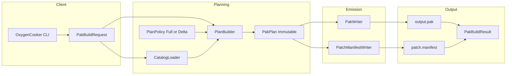
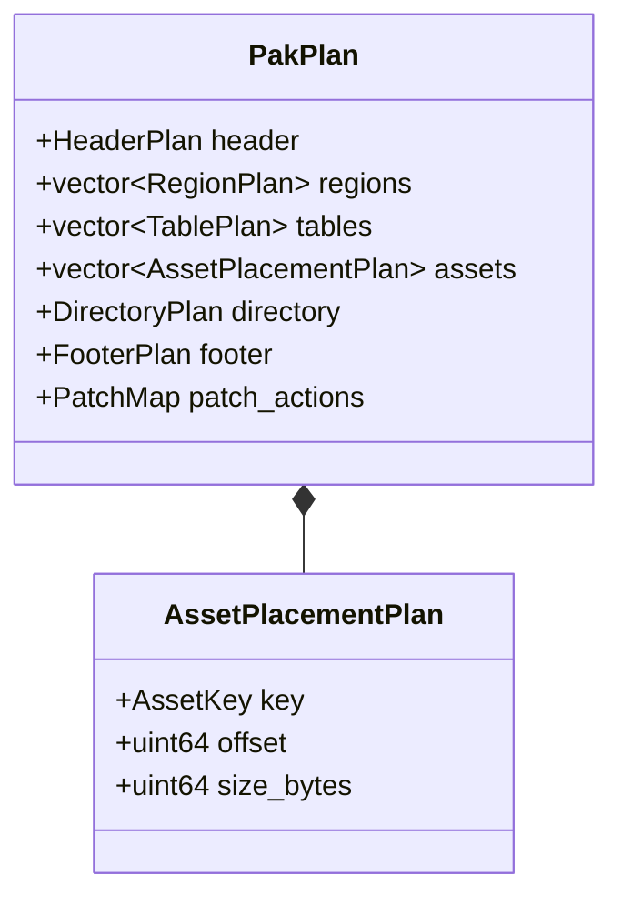
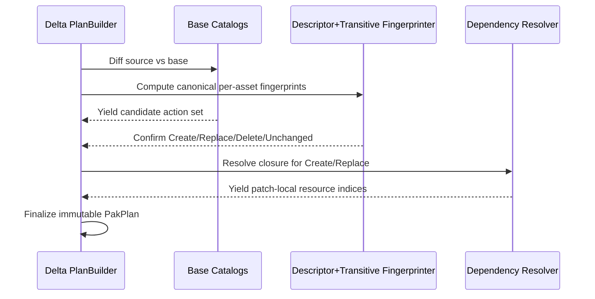
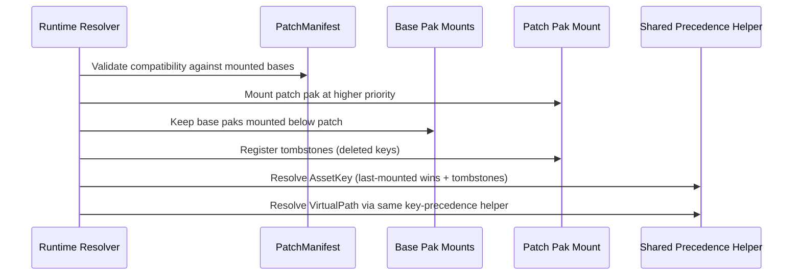

# Pak Builder API Design Specification (Remediated)

**Date:** 2026-02-28
**Status:** Design / Specification

## 1. Scope

This specification defines the canonical C++20-minimum pipeline for building Oxygen Engine `.pak` files, including both full builds and patch workflows (generation + application contract).

Hard constraints:

- Pak builder public API headers and implementation defined by this spec require C++20 minimum.
- Cross-module shared PAK model types used by both cooker and runtime content code must be defined in `Oxygen.Data` public headers (no `Content -> Cooker` dependency).
- Public API namespace is `oxygen::content::pak`; this namespace choice does not imply module dependency from `Oxygen.Content` to `Oxygen.Cooker`.
- PAK format targets the latest schema version only.
- Schema ownership is split across:
  - `src/Oxygen/Data/PakFormat_core.h`
  - `src/Oxygen/Data/PakFormat_world.h`
  - `src/Oxygen/Data/PakFormat_geometry.h`
  - `src/Oxygen/Data/PakFormat_render.h`
  - `src/Oxygen/Data/PakFormat_scripting.h`
  - `src/Oxygen/Data/PakFormat_input.h`
  - `src/Oxygen/Data/PakFormat_physics.h`
  - `src/Oxygen/Data/PakFormat_audio.h`
  - `src/Oxygen/Data/PakFormat_animation.h`
- Binary layout must match schema exactly.
- No schema version branching.
- Acceptance criteria authority is frozen to this specification and `design/content-pipeline/pak-builder-execution-plan.md` only; no external notes/reviews/chats are normative unless promoted into one of these files with formal approval.

## 2. Architecture Invariant

The system is one architecture:

- One immutable planning model (`PakPlan`).
- One writer (`PakWriter`).
- One mode discriminator at planning time (`Full` or `Patch`).

Patch support is not a side pipeline. Patch and full use the same plan validation and the same byte writer.



## 3. Canonical Schema Ownership

Domain ownership is strict and explicit:

- `pak::core`: shared scalar/index/container primitives (`ResourceRegion`, `ResourceTable`, `AssetDirectoryEntry`, `AssetHeader`, browse index structs).
- `pak::world`: scene graph and world component descriptors.
- `pak::geometry`: geometry asset descriptors.
- `pak::render`: texture/material/shader descriptors.
- `pak::scripting`: script descriptors, slot and param records.
- `pak::input`: input action/mapping descriptors.
- `pak::physics`: physics descriptors/resources and scene physics sidecar descriptors.
- `pak::audio`: audio descriptors/resources.
- `pak::animation`: reserved animation domain.

Container envelope is always:

- `oxygen::data::pak::core::PakHeader`
- `oxygen::data::pak::core::PakFooter`

Container envelope types are defined only in `pak::core` and must be referenced from there.

## 4. Non-Negotiable Type Isolation Rule

### 4.1 Rule

No code may alias a `pak::<domain>` type into another `pak::<other_domain>` namespace.

Forbidden examples:

- `using core::ResourceTable = ...` inside `namespace ...::pak::physics`
- `using PakFooter = pak::core::PakFooter` inside `namespace ...::pak::physics`
- `using namespace oxygen::data::pak` in any schema header

Required style:

- Use fully qualified cross-domain references at point of use.
- Do not create `using`/`typedef` shortcuts for cross-domain schema types in domain headers.

### 4.2 Enforcement

This rule is enforced directly in the schema headers: cross-domain aliases are removed and future schema edits must keep fully qualified cross-domain type references at the field/parameter level.

## 5. Public API

```cpp
namespace oxygen::content::pak {

enum class BuildMode : uint8_t { kFull, kPatch };
enum class PakDiagnosticSeverity : uint8_t { kInfo, kWarning, kError };
enum class PakBuildPhase : uint8_t {
  kRequestValidation,
  kPlanning,
  kWriting,
  kManifest,
  kFinalize,
};

struct PakBuildOptions {
  bool deterministic = true;
  bool embed_browse_index = false;
  bool emit_manifest_in_full = false;
  bool compute_crc32 = true;
  bool fail_on_warnings = false;
};

struct PakDiagnostic {
  PakDiagnosticSeverity severity = PakDiagnosticSeverity::kInfo;
  PakBuildPhase phase = PakBuildPhase::kPlanning;
  std::string code; // stable identifier (e.g. "pak.plan.offset_mismatch")
  std::string message;

  // Optional structured context for tooling/CI.
  std::string asset_key;
  std::string resource_kind;
  std::string table_name;
  std::filesystem::path path;
  std::optional<uint64_t> offset;
};

struct PakBuildSummary {
  uint32_t diagnostics_info = 0;
  uint32_t diagnostics_warning = 0;
  uint32_t diagnostics_error = 0;

  uint32_t assets_processed = 0;
  uint32_t resources_processed = 0;

  uint32_t patch_created = 0;
  uint32_t patch_replaced = 0;
  uint32_t patch_deleted = 0;
  uint32_t patch_unchanged = 0;

  bool crc_computed = true;
};

struct PakBuildTelemetry {
  std::optional<std::chrono::microseconds> planning_duration;
  std::optional<std::chrono::microseconds> writing_duration;
  std::optional<std::chrono::microseconds> manifest_duration;
  std::optional<std::chrono::microseconds> total_duration;
};

struct PatchCompatibilityPolicy {
  bool require_exact_base_set = true;
  bool require_content_version_match = true;
  bool require_base_source_key_match = true;
  bool require_catalog_digest_match = true;
};

struct PakBuildRequest {
  BuildMode mode = BuildMode::kFull;
  std::vector<CookedSource> sources;

  std::filesystem::path output_pak_path;
  std::filesystem::path output_manifest_path; // required for kPatch; also required in kFull when emit_manifest_in_full=true

  uint16_t content_version = 0;
  data::SourceKey source_key; // must be non-zero

  std::vector<PakCatalog> base_catalogs; // required for kPatch
  PatchCompatibilityPolicy patch_compat {};
  PakBuildOptions options {};
};

struct PakBuildResult {
  PakCatalog output_catalog;
  std::optional<PatchManifest> patch_manifest; // always set in kPatch; also set in kFull when emit_manifest_in_full=true
  uint64_t file_size = 0;
  uint32_t pak_crc32 = 0; // 0 if CRC disabled
  std::vector<PakDiagnostic> diagnostics;
  PakBuildSummary summary {};
  PakBuildTelemetry telemetry {};
};

class PakBuilder {
public:
  OXYGEN_MAKE_NON_COPYABLE(PakBuilder)
  [[nodiscard]] auto Build(const PakBuildRequest& request) noexcept
    -> Result<PakBuildResult>;
};

} // namespace oxygen::content::pak
```

### 5.1 Diagnostics Contract

Diagnostics are first-class build artifacts, not log-only side effects.

- Every validation and write failure must emit a structured `PakDiagnostic` with stable `code` and `phase`.
- `fail_on_warnings=true` must fail build based on `summary.diagnostics_warning > 0`, not string matching.
- Diagnostic ordering must be deterministic for deterministic inputs.
- `PakBuildResult` must always return collected diagnostics and summary/telemetry whether success or failure.

## 6. Internal Plan Model

`PakPlan` is immutable after validation.

It contains:

- Header plan (header bytes and source key bytes).
- Region plans: texture, buffer, audio, script, physics.
- Table plans: texture, buffer, audio, script_resource, script_slot, physics_resource.
- Asset descriptor placement plan (absolute offsets/sizes/alignment).
- Asset directory plan.
- Optional browse index plan.
- Footer plan (latest-schema footer layout).
- CRC patch-field absolute offset.
- Patch action map (`Create`, `Replace`, `Delete`, `Unchanged`).
- Patch resource closure set for `Create/Replace`.



## 7. Planning Semantics

### 7.1 Full

- Include all live assets/resources.
- Enforce index-0 semantics:
  - fallback-at-0 for categories with fallback semantics.
  - sentinel/absent-at-0 otherwise.

### 7.2 Patch

- Classify each asset vs base catalogs as `Create`, `Replace`, `Delete`, `Unchanged` using descriptor+transitive fingerprinting:
  - Fingerprint input includes canonical descriptor bytes (deterministic on-disk bytes).
  - Fingerprint input includes deterministic transitive resource closure digest (resource descriptor bytes + payload content hashes).
  - AssetKey references remain key-based (not inlined) and are resolved at runtime by mount precedence.
  - Classification rules:
    - key absent in base, present in source => `Create`
    - key present in base, absent in source => `Delete`
    - key present in both, fingerprint changed => `Replace`
    - key present in both, fingerprint equal => `Unchanged`
- Emit descriptors only for `Create` and `Replace`.
- `Delete` is manifest-only.
- Compute transitive resource closure for every emitted asset.
- Rebuild patch-local resource tables with patch-local indices.
- Ensure emitted descriptors point only to patch-local resources (except AssetKey references, which remain key-based).



## 8. Binary Writing Contract

Writer phases:

1. Write `pak::core::PakHeader` placeholder.
2. Write resource regions.
3. Write resource tables (`texture`, `buffer`, `audio`, `script_resource`, `script_slot`, `physics_resource`).
4. Write asset descriptors.
5. Write asset directory.
6. Write optional browse index payload.
7. Write `pak::core::PakFooter` with `pak_crc32 = 0`.
8. Flush.
9. If `options.compute_crc32=true`, patch `pak_crc32`; otherwise leave `pak_crc32=0`.

At each phase the writer checks actual cursor == planned offset.

### 8.1 Padding Determinism Rule

Standard C++ struct padding and ad-hoc stream alignments naturally contain uninitialized memory (garbage). Writing uninitialized bytes into the file breaks bit-exact reproducibility and CRC stability.

**Mandatory Constraint:** The `PakWriter` must explicitly zero-fill all alignment padding gaps and struct trailing padding gaps before advancing the write cursor. `serio::AnyWriter` padding logic must guarantee writing `0x00`.

### 8.2 CRC32 Streaming Rule (Skip-Field Semantics)

When `options.compute_crc32=true`, CRC is computed incrementally during the same write stream; post-write full-file CRC passes are forbidden.

- Initialize running CRC with `0xFFFFFFFF`.
- Update CRC with every emitted byte range.
- For the 4-byte `pak_crc32` field itself, skip those bytes from the CRC stream.
- Do not hash replacement zero bytes for that field.
- Continue hashing all remaining bytes, including footer bytes before/after `pak_crc32` and footer magic.
- Finalize CRC with XOR `0xFFFFFFFF`.
- Seek once to patch `pak_crc32`.

This matches runtime validation semantics and scales to multi-GB PAKs without a second read pass.

When `options.compute_crc32=false`:

- No CRC stream must be run.
- Footer `pak_crc32` must remain `0`.
- Writer must still emit all other bytes deterministically.

## 9. Script Slot/Param Requirements

The builder must treat scripting sidecar data as first-class:

- Populate `script_slot_table` when slots exist.
- Enforce `script_slot_table.entry_size == sizeof(pak::scripting::ScriptSlotRecord)`.
- Validate every `ScriptSlotRecord::params_array_offset/params_count` range.
- Ensure param record arrays are in-bounds and non-overlapping with invalid regions.

No patch/full special casing is allowed for script slots.

## 10. Patch Manifest Contract

`PatchManifest` is required for patch mode.
In full mode, `PatchManifest` is emitted only when `options.emit_manifest_in_full=true`.

It includes:

- `created`, `replaced`, `deleted` asset key sets (pairwise disjoint).
- Base compatibility envelope:
  - required base source keys.
  - required base content versions.
  - required base catalog digest(s).
  - patch content version.
- Effective compatibility policy snapshot (resolved `PatchCompatibilityPolicy` used for this build).
- Diff basis identifier: `descriptor_plus_transitive_resources_v1`.
- Patch source key and patch pak digest/CRC metadata.

For full-mode manifest emission (`emit_manifest_in_full=true`):

- `created` contains all emitted asset keys.
- `replaced` and `deleted` are empty.
- compatibility envelope base requirements are empty.
- policy snapshot and diff basis identifier are still recorded.
- patch/source metadata fields are populated from full build output context.

## 11. Patch Application Contract (Runtime)

Application sequence:

1. Validate compatibility envelope against currently mounted base set.
2. Mount patch source with higher precedence than all bases.
3. Register patch tombstones (`deleted` keys) on the patch mount layer.
4. Resolve by AssetKey using one shared precedence helper:
   - Traverse mounts from highest precedence to lowest (**last-mounted wins**).
   - If current mount tombstones the key, terminate lookup as `not found` (do not fall through).
   - Else if current mount contains the key, return it.
   - Else continue.
5. Resolve by virtual path through the same policy surface:
   - Resolve virtual path to candidate key from highest-precedence mapping.
   - Re-run step 4 key resolution (including tombstones) before returning.
6. Return deterministic `found/not-found` result for both lookup modes.



Mandatory consistency rule:

- AssetKey lookup and virtual-path lookup must share one precedence implementation.
- Current-schema precedence policy is fixed: **last-mounted wins**.

Runtime impact:

- `VirtualPathResolver` traversal must be highest-precedence-first (not first-mounted-wins).
- Asset-key and virtual-path paths must call the same helper for precedence and tombstones.
- Collision diagnostics must identify masked lower-priority sources.

## 12. Determinism Contract

When `deterministic=true`:

- Stable input normalization.
- Stable asset/resource ordering.
- Stable directory ordering.
- Stable browse index ordering.
- Stable source key policy (non-zero, deterministic derivation policy documented and tested).

Determinism is required for meaningful patch diffs.

Source-key determinism ownership:

- `PakBuilder` consumes `PakBuildRequest::source_key`; it does not derive it.
- Deterministic derivation policy is owned by the request-construction layer (CLI/tooling that produces `PakBuildRequest`).
- `PakBuilder` enforces non-zero validation for `source_key`.
- Coverage binding is mandatory:
  - deterministic derivation stability for identical normalized inputs,
  - non-zero source key guarantee,
  - reproducibility across repeated invocations.

## 13. Validation Matrix (Must Pass Before Emit)

Planner validations:

- Request-level validation:
  - mode-specific required fields.
  - non-zero source key.
  - patch mode requires non-empty base catalogs.
  - patch mode requires non-empty `output_manifest_path`.
  - full mode with `emit_manifest_in_full=true` requires non-empty `output_manifest_path`.
- Schema ownership checks:
  - asset type mapped to owning domain descriptor.
  - no domain/type mismatch.
- Layout checks:
  - all offsets aligned.
  - all section bounds inside file.
  - no overlap across incompatible sections.
- Table checks:
  - `entry_size` matches exact `sizeof(schema_type)`.
  - count/offset/size arithmetic overflow safe.
  - index-0 policy correctness.
- Descriptor checks:
  - `AssetHeader.asset_type` matches directory entry type.
  - descriptor size and offsets consistent.
  - domain-specific table offsets/counts/sizes valid (`SceneDataTable`, `PhysicsComponentTableDesc`, etc.).
  - duplicate `AssetKey` rejection.
  - replace operation must preserve `asset_type` vs base entry for the same key.
- Resource checks:
  - descriptor `data_offset` in declared region.
  - `size_bytes` bounded.
  - patch resource closure complete for emitted assets.
  - descriptor+transitive fingerprints are computed deterministically for patch classification.
  - reserved schema bytes are zero in emitted descriptors/tables.
- Patch checks:
  - `created/replaced/deleted` disjoint.
  - replace requires base presence.
  - delete must target existing base keys.
  - compatibility envelope complete.
  - effective compatibility policy snapshot is present in manifest.
  - browse-index virtual paths are canonical and duplicate-free.

Writer validations:

- Actual write cursor equals planned offsets for each section.
- Directory entry `entry_offset` and `desc_offset` exact.
- Final file size equals plan.
- CRC patch offset valid and points to `pak_crc32` field in the footer.
- when CRC enabled: CRC stream skips only the `pak_crc32` bytes and includes all other bytes.
- when CRC disabled: no CRC stream is executed and final `pak_crc32 == 0`.

Diagnostics validations:

- Every reported error has non-empty `code` and `message`.
- `summary.diagnostics_*` counters equal the emitted diagnostics vector counts.
- If `fail_on_warnings=true`, warning count must cause build failure status.

## 14. Performance Contract

- No redundant descriptor serialization passes.
- No N^2 remapping behavior in patch closure.
- **CRC Generation:** Streaming CRC state machine is **mandatory** with skip-field semantics for `pak_crc32` (field bytes excluded from CRC stream). Post-write full file passes are banned for performance and memory scaling reasons.
- If CRC computation is disabled by option, no CRC pass (streaming or full-file) may run.

## 15. Extension Workflow (Low-Risk for Juniors)

To add new schema safely, choose one of two workflows:

### 15.1 New Asset Type in Existing Domain/Regions

1. Add packed schema in owning `PakFormat_<domain>.h` with `static_assert(sizeof(...))`.
2. Add domain serializers: **Must** implement a strictly coupled `Measure()` and `Store()` contract (e.g. via an ADL visitor pattern or identical logic) so the planner can query exact payload sizes deterministically before the writer starts emitting bytes.
   > **Implementation Note**: The architecture requires a `Measure()` and `Store()` contract for payload domain definitions. From an implementation perspective, C++20 allows this cleanly with a single templated visitor to avoid code duplication across `Measure` and `Store` passes. This technique should remain an internal implementation detail.
3. Register type mapping in planner traits (asset type -> descriptor type -> measuring/serialization visitor).
4. Add domain validation rules.
5. Add full + patch tests.

Writer phase changes should not be necessary for this workflow.

### 15.2 New Resource Domain/Table/Region

1. Add packed schema in owning `PakFormat_<domain>.h` with `static_assert(sizeof(...))`.
2. Extend `pak::core::PakFooter` region/table fields for the new domain (latest-only schema policy; no version branching).
3. Extend planner region/table planning and layout validation.
4. Extend writer phases and footer emission to include the new domain region/table.
5. Extend runtime table initialization and lookup surface.
6. Add full + patch tests including patch closure and mount precedence behavior for the new domain.

Do not claim no writer/runtime changes for this workflow.

## 16. Mandatory Test Suite

### 16.1 Binary Conformance

- Golden binary for header/footer offsets and table layout.
- CRC skip-field correctness.
- CRC-disabled path correctness (`pak_crc32 == 0`, no CRC patch step).
- Directory offsets/sizes and descriptor offsets exact.

### 16.2 Domain Correctness

- Per-domain descriptor roundtrip tests.
- Table `entry_size` mismatch rejection tests.
- World/physics component table bounds and overlap rejection tests.
- Script slot/param array bounds tests.

### 16.3 Patch Correctness

- Create/replace/delete classification tests.
- Descriptor+transitive fingerprint classification tests.
- Patch resource closure completeness tests.
- Replace + unchanged dependency scenarios.
- Replace type-mismatch rejection tests.
- Delete tombstone behavior tests.
- Delete does-not-fall-through-to-base tests.
- Wrong-base compatibility rejection tests.
- Patch manifest required-field rejection tests.
- Full build with `emit_manifest_in_full=true` manifest content tests.

### 16.4 Mount/Resolution Semantics

- AssetKey and virtual-path precedence parity tests (shared helper).
- Multi-mount patch-above-base behavior tests.
- Last-mounted-wins tests for both key and virtual path lookups.
- Virtual-path collision masking diagnostics tests.

### 16.5 Diagnostics/Reporting Correctness

- Stable diagnostics code emission tests (`pak.request.*`, `pak.plan.*`, `pak.write.*`, `pak.patch.*`).
- Severity and phase mapping tests.
- Diagnostic context-field population tests.
- Summary counters vs diagnostics vector consistency tests.
- `fail_on_warnings=true` enforcement tests.

### 16.6 Source-Key Determinism Ownership Coverage

- Request-construction layer tests proving deterministic `source_key` derivation stability for identical normalized inputs.
- Request-construction layer tests proving non-zero `source_key` generation.
- Repeated-run reproducibility tests for request-construction `source_key` policy.
- Builder request-validation tests proving zero `source_key` is rejected.

## 17. Non-Goals

- No in-place mutation of existing pak files.
- No schema version branching.
- No import-time source decoding in this phase.

## 18. Final Architecture Statement

The design is a single architecture with one planning surface and one writer surface.
Patch support is integrated at plan semantics level, not bolted on.
Schema correctness is guarded by strict ownership, strict layout validation, and enforced anti-aliasing policy in schema headers.
